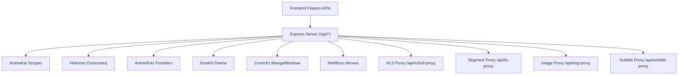
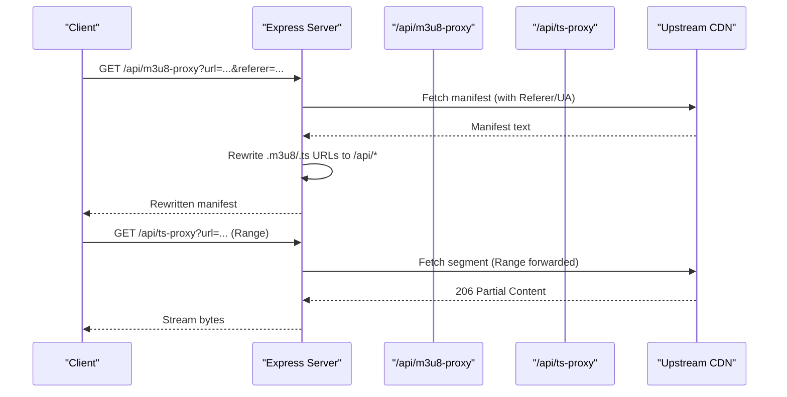
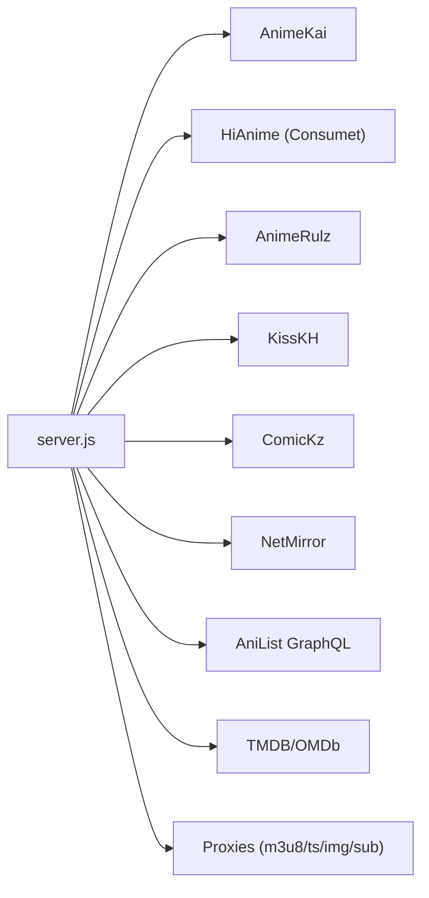

# API Reference

<cite>
**Referenced Files in This Document**
- [server.js](file://server.js)
- [proxy.py](file://proxy.py)
- [api/index.js](file://api/index.js)
- [api/runtime-config.js](file://api/runtime-config.js)
- [src/features/anime/api/animeApi.js](file://src/features/anime/api/animeApi.js)
- [src/features/movie/api/movieApi.js](file://src/features/movie/api/movieApi.js)
- [src/features/drama/api/dramaApi.js](file://src/features/drama/api/dramaApi.js)
- [src/features/manga/api/mangaApi.js](file://src/features/manga/api/mangaApi.js)
- [src/features/manhwa/api/manhwaApi.js](file://src/features/manhwa/api/manhwaApi.js)
</cite>

## Table of Contents
1. Introduction
2. Project Structure
3. Core Components
4. Architecture Overview
5. Detailed Component Analysis
6. Dependency Analysis
7. Performance Considerations
8. Troubleshooting Guide
9. Conclusion
10. Appendices

## Introduction
This document provides a comprehensive API reference for Project Anime’s backend. It covers all RESTful endpoints, content provider abstractions (anime, drama, manga/manhwa), proxy endpoints for CORS and stream protection, error formats, status codes, retry strategies, rate limiting considerations, authentication tokens, security headers, versioning/deprecation guidance, and migration notes. Concrete examples are included for common workflows such as searching content, retrieving episodes, and streaming media.

## Project Structure
The backend is an Express application that exposes a unified /api namespace. A small Node entry re-exports the app for serverless environments, and a Python helper serves as a KissKH relay when needed. Frontend feature modules call these endpoints via their own API helpers.

**Diagram sources**
- [server.js:152-393](file://server.js#L152-L393)
- [server.js:1378-1617](file://server.js#L1378-L1617)
- [server.js:1694-2196](file://server.js#L1694-L2196)
- [server.js:2198-2930](file://server.js#L2198-L2930)
- [server.js:2937-3608](file://server.js#L2937-L3608)

**Section sources**
- [server.js:1-28](file://server.js#L1-L28)
- [api/index.js:1-4](file://api/index.js#L1-L4)
- [proxy.py:1-36](file://proxy.py#L1-L36)

## Core Components
- Content providers abstraction layer:
  - Anime: HiAnime (via Consumet/META.Anilist), AnimeKai scraper, AnimeUnity fallback, AnimeRulz multi-language streams.
  - Drama: KissKH with enc-dec.app key generation; optional Python relay for trusted IP routing.
  - Manga/Manhwa: ComicKz catalog and chapter pages; AniList-based webtoon curation.
  - Movies: MoviePlex (WordPress/WP REST) with TMDB/OMDb poster enrichment; NetMirror aggregator.
- Streaming proxies:
  - HLS manifest rewriting and segment proxying to bypass CORS and protect streams.
  - Subtitle proxy for VTT files.
  - Image proxy to bypass hotlink restrictions.
- Caching and resilience:
  - In-memory caches for episode lists, streams, catalogs, and external API responses.
  - Retry/backoff logic for protected or rate-limited providers.

**Section sources**
- [server.js:213-228](file://server.js#L213-L228)
- [server.js:417-425](file://server.js#L417-L425)
- [server.js:748-765](file://server.js#L748-L765)
- [server.js:1628-1633](file://server.js#L1628-L1633)
- [server.js:2218-2220](file://server.js#L2218-L2220)
- [server.js:2953-2955](file://server.js#L2953-L2955)

## Architecture Overview
The server normalizes routes to /api/*, applies CORS, and dispatches requests to provider-specific handlers. Stream-related endpoints rewrite URLs so browsers only talk to the backend, enabling CORS-safe playback and protecting upstream CDNs. Provider integrations use robust headers, referers, and token handling where required.

**Diagram sources**
- [server.js:263-345](file://server.js#L263-L345)
- [server.js:354-393](file://server.js#L354-L393)

## Detailed Component Analysis

### Anime Endpoints
- GET /api/info/:anilistId
  - Purpose: Retrieve anime details and episode list using META.Anilist + HiAnime.
  - Path params: anilistId (number).
  - Response fields: id, title, description, image, cover, rating, type, status, totalEpisodes, currentEpisode, duration, genres, subOrDub, episodes[].
  - Errors: 502 on fetch failures.
  - Example: GET /api/info/2657

- GET /api/gogoanime/watch
  - Purpose: Resolve AnimeKai stream for a title and episode (English subs preferred by default; dub mode supported).
  - Query params: title (required), episode (default 1), season (optional), dub (eng|sub).
  - Response fields: provider, type, streamUrl (proxied), subtitleUrl, headers, episode, language, server, allServers.
  - Errors: 400 missing title; 404 if no streams found; 500 on scraper errors.
  - Example: GET /api/gogoanime/watch?title=Naruto&episode=1

- GET /api/watch/:episodeId
  - Purpose: Fallback stream resolution via AnimeUnity (Consumet) or META.Anilist.
  - Path params: episodeId.
  - Response fields: provider, type, sources[], subtitles[], headers.
  - Errors: 404 if no sources found.
  - Example: GET /api/watch/abc123

- GET /api/search
  - Purpose: Search AnimeKai by query and return best match slug.
  - Query params: q (required).
  - Response fields: slug, results[].
  - Errors: 400 missing q; 500 on failure.
  - Example: GET /api/search?q=Naruto

- GET /api/hianime/watch
  - Purpose: Primary HiAnime watch endpoint using AniList ID for deterministic season selection.
  - Query params: anilistId (required), episode (default 1), dub (eng|sub).
  - Response fields: provider, type, sources[], subtitles[], episode, episodeTitle, audioMode.
  - Errors: 400 missing anilistId; 404 if episode not found; 500 on lookup failure.
  - Example: GET /api/hianime/watch?anilistId=2657&episode=1&dub=sub

- GET /api/animerulz/watch
  - Purpose: Multi-language stream resolution (Indian dubs and fallbacks).
  - Query params: anilistId (required), episode (default 1), lang (hin|tam|tel|eng|jpn, default hin).
  - Response fields: type, streamUrl (proxied), sources[], subtitles, headers, provider, language, audioMode.
  - Errors: 400 missing anilistId; 404 if no stream; 502 on resolution failure.
  - Example: GET /api/animerulz/watch?anilistId=2657&episode=1&lang=hin

- GET /api/animerulz/episodes
  - Purpose: Get episode list from AnimeRulz fallback.
  - Query params: anilistId (required).
  - Response fields: total, episodes[].
  - Errors: 400 missing anilistId; 502 on failure.
  - Example: GET /api/animerulz/episodes?anilistId=2657

- GET /api/animerulz/availability
  - Purpose: Check availability and languages for an anime on AnimeRulz.
  - Query params: anilistId (required).
  - Response fields: available, languages[], animerulz_id.
  - Errors: 400 missing anilistId; 502 on failure.
  - Example: GET /api/animerulz/availability?anilistId=2657

- GET /api/animerulz/catalog
  - Purpose: Paginated catalog filtered by language.
  - Query params: language/lang (default hindi), page (default 1), limit (max 500).
  - Response fields: language, total, page, pages, items[].
  - Errors: 502 on failure.
  - Example: GET /api/animerulz/catalog?language=hindi&page=1&limit=50

- POST /api/anilist
  - Purpose: Cached & rate-limit-aware proxy to AniList GraphQL.
  - Request body: GraphQL query object.
  - Response: { data }.
  - Behavior: Caches identical payloads for 1 hour; retries on 429 with backoff.
  - Errors: 502 if all attempts fail and no cache hit; 500 on unexpected errors.
  - Example: POST /api/anilist with { query: "...", variables: {...} }

**Section sources**
- [server.js:1342-1376](file://server.js#L1342-L1376)
- [server.js:1378-1559](file://server.js#L1378-L1559)
- [server.js:1564-1601](file://server.js#L1564-L1601)
- [server.js:1604-1617](file://server.js#L1604-L1617)
- [server.js:1210-1278](file://server.js#L1210-L1278)
- [server.js:1044-1089](file://server.js#L1044-L1089)
- [server.js:1092-1107](file://server.js#L1092-L1107)
- [server.js:1110-1128](file://server.js#L1110-L1128)
- [server.js:1130-1155](file://server.js#L1130-L1155)
- [server.js:1158-1208](file://server.js#L1158-L1208)

### Drama Endpoints (KissKH)
- GET /api/drama/home
  - Purpose: Aggregated drama home sections (show, korean, chinese, top rating, last update).
  - Response fields: show[], korean[], chinese[], topRating[], lastUpdate[].
  - Errors: 502 on fetch failure.
  - Example: GET /api/drama/home

- GET /api/drama/list
  - Purpose: Paginated drama list search.
  - Query params: type (default 0), q (optional).
  - Response: List data from KissKH.
  - Errors: 502 on failure.
  - Example: GET /api/drama/list?type=0&q=Family

- GET /api/drama/search
  - Purpose: Search dramas by query.
  - Query params: q (required).
  - Response: Search results.
  - Errors: 400 missing q; 502 on failure.
  - Example: GET /api/drama/search?q=Family

- GET /api/drama/info/:dramaId
  - Purpose: Episode list for a drama.
  - Path params: dramaId.
  - Response: Drama info including episodes.
  - Errors: 502 on failure.
  - Example: GET /api/drama/info/12345

- GET /api/drama/stream/:episodeId
  - Purpose: Resolve stream URL and subtitles for an episode.
  - Path params: episodeId.
  - Response fields: episodeId, type (hls|mp4), streamUrl (proxied if m3u8), subtitles[].
  - Errors: 404 if no stream URL; 502 on failure.
  - Example: GET /api/drama/stream/12345

- GET /api/drama/subtitle
  - Purpose: Decode and serve KissKH subtitles as VTT.
  - Query params: url (required).
  - Response: VTT content with CORS enabled.
  - Errors: 400 missing url; 502 on failure.
  - Example: GET /api/drama/subtitle?url=https%3A%2F%2Fexample.com%2Fsub.vtt

**Section sources**
- [server.js:1862-1892](file://server.js#L1862-L1892)
- [server.js:1894-1913](file://server.js#L1894-L1913)
- [server.js:1915-1927](file://server.js#L1915-L1927)
- [server.js:1929-1946](file://server.js#L1929-L1946)
- [server.js:1948-2017](file://server.js#L1948-L2017)
- [server.js:2019-2043](file://server.js#L2019-L2043)

### Manga and Manhwa Endpoints (ComicKz + AniList Webtoons)
- GET /api/manga/home
  - Purpose: Curated manga landing data (top 10, category previews).
  - Response fields: bentoTop10[], manhwaPreview[], mangaPreview[], manhuaPreview[], trending[], popular[], topRated[], featured.
  - Errors: 500 on failure.
  - Example: GET /api/manga/home

- GET /api/manga/category/:type
  - Purpose: Browse manga/manhwa/manhua by country/type with optional genre filter.
  - Path params: type (manga|manhwa|manhua).
  - Query params: genre (optional), page (default 1), perPage (default 24, max 50).
  - Response fields: type, country, genre, page, perPage, total, hasMore, items[], trending[], popular[], topPick[], recent[].
  - Errors: 500 on failure.
  - Example: GET /api/manga/category/manhwa?genre=action&page=1&perPage=24

- GET /api/manga/search
  - Purpose: Search manga titles.
  - Query params: q (optional; returns [] if missing).
  - Response fields: items[].
  - Errors: None (returns empty array on missing query).
  - Example: GET /api/manga/search?q=Lone%20Wolf

- GET /api/manga/info/:id
  - Purpose: Series info and chapters list; supports numeric AniList IDs.
  - Path params: id (slug or number).
  - Response fields: id, comickSlug, title, cover, banner, description, status, rating, genres, chapters[].
  - Errors: 500 on failure.
  - Example: GET /api/manga/info/maxed-out-leveling

- GET /api/manga/read/:chapterId
  - Purpose: Read a chapter and get paginated images.
  - Path params: chapterId (format: slug___hid-chapter-N-en).
  - Response fields: chapterId, pageCount, pages[].
  - Errors: Returns empty pages on parse/scrape failure.
  - Example: GET /api/manga/read/manga___hid-chapter-1-en

- GET /api/webtoon/home
  - Purpose: Curated webtoon landing data from AniList (trending/popular/schedule).
  - Response fields: trending[], popular[], featured[], schedule{}, all[].
  - Fallback: Redirects to /api/manga/home on failure.
  - Example: GET /api/webtoon/home

- GET /api/webtoon/category/:type
  - Purpose: Filter webtoons by genre; falls back to manga category if unavailable.
  - Path params: type.
  - Query params: genre (optional).
  - Response fields: type, genre, trending[], popular[], items[], recent[].
  - Example: GET /api/webtoon/category/manhwa?genre=romance

- GET /api/manga/image-proxy
  - Purpose: Proxy images with correct Referer and exponential backoff on 429/403.
  - Query params: url (required).
  - Response: Image bytes with CORS enabled and caching.
  - Errors: 400 missing url; 500 on failure.
  - Example: GET /api/manga/image-proxy?url=https%3A%2F%2Fcdn.example.com%2Fcover.webp

**Section sources**
- [server.js:2320-2383](file://server.js#L2320-L2383)
- [server.js:2385-2465](file://server.js#L2385-L2465)
- [server.js:2654-2688](file://server.js#L2654-L2688)
- [server.js:2690-2800](file://server.js#L2690-L2800)
- [server.js:2802-2876](file://server.js#L2802-L2876)
- [server.js:2878-2930](file://server.js#L2878-L2930)
- [server.js:2610-2652](file://server.js#L2610-L2652)

### Movies Endpoints (MoviePlex + NetMirror)
- GET /api/movieplex/catalog
  - Purpose: Paginated movie catalog with category filtering, search, and 18+ control.
  - Query params: page (default 1), limit (max 100), category (int), search (string), is18 (boolean string).
  - Response fields: movies[], total, page, totalPages, cached (bool).
  - Errors: 500 on failure.
  - Example: GET /api/movieplex/catalog?page=1&limit=24&category=10

- GET /api/movieplex/stream
  - Purpose: Resolve stream for a movie series post slug; extracts LuluStream HLS or StreamTape URL.
  - Query params: slug (required).
  - Response fields: streamUrl (proxied if HLS), thumbnail, title, source, fallbackIframe.
  - Errors: 400 missing slug; 502 on resolution failure.
  - Example: GET /api/movieplex/stream?slug=fighter-2024-hindi

- GET /api/movieplex/post-info
  - Purpose: Get post info and thumbnails for a movie post slug.
  - Query params: slug (required).
  - Response fields: thumbnail, title, iframes[].
  - Errors: 502 on failure.
  - Example: GET /api/movieplex/post-info?slug=fighter-2024-hindi

- GET /api/movieplex/catalog/status
  - Purpose: Status of the in-memory catalog build.
  - Response fields: total, built, building, lastRefresh, categoryCount.
  - Example: GET /api/movieplex/catalog/status

- GET /api/movies/home
  - Purpose: Homepage rows for movies (trending, hot, web series, etc.).
  - Response fields: featured, bollywood, popular, trending, hollywood, action, classics, topRated, netmirror{}, movieplex{}.
  - Errors: 502 on failure.
  - Example: GET /api/movies/home

- GET /api/netmirror/search
  - Purpose: Search NetMirror by title.
  - Query params: q (required).
  - Response fields: results[].
  - Errors: 400 missing q; 502 on failure.
  - Example: GET /api/netmirror/search?q=Fighter

- GET /api/netmirror/post/:id
  - Purpose: Details + episodes for a NetMirror title.
  - Path params: id.
  - Response: NetMirror post data.
  - Errors: 502 on failure.
  - Example: GET /api/netmirror/post/12345

- GET /api/netmirror/playlist/:id
  - Purpose: HLS playlist with proxied sources and subtitle tracks.
  - Path params: id.
  - Response fields: sources[], tracks[].
  - Errors: 404 no sources; 502 on failure.
  - Example: GET /api/netmirror/playlist/12345

- GET /api/netmirror/trending
  - Purpose: Trending/home catalog via HTML parsing and batch title enrichment.
  - Response fields: movies[] (with proxied posters).
  - Errors: 502 on failure.
  - Example: GET /api/netmirror/trending

- GET /api/netmirror/stream-resolve
  - Purpose: Resolve stream for NetMirror by id or title; handles series episodes and generates proper session params.
  - Query params: id or title (one required), year (optional), type (movie|tv, default movie), season (default 1), episode (default 1), ott (nf|pv|hs, default nf).
  - Response fields: netmirrorId, title, year, sources[], tracks[].
  - Errors: 400 missing id/title; 404 no results; 502 on failure.
  - Example: GET /api/netmirror/stream-resolve?title=Fighter&year=2024&type=movie

**Section sources**
- [server.js:3402-3476](file://server.js#L3402-L3476)
- [server.js:3478-3488](file://server.js#L3478-L3488)
- [server.js:3490-3512](file://server.js#L3490-L3512)
- [server.js:3514-3608](file://server.js#L3514-L3608)
- [server.js:1778-1797](file://server.js#L1778-L1797)
- [server.js:1799-1809](file://server.js#L1799-L1809)
- [server.js:1811-1850](file://server.js#L1811-L1850)
- [server.js:2045-2109](file://server.js#L2045-L2109)
- [server.js:2112-2196](file://server.js#L2112-L2196)

### Proxy Endpoints (CORS and Stream Protection)
- GET /api/m3u8-proxy
  - Purpose: Fetch and rewrite HLS manifests; replace nested playlists and segments with backend proxies.
  - Query params: url (required), referer (optional).
  - Response: application/vnd.apple.mpegurl with CORS enabled.
  - Errors: 400 missing url; 502 on failure.
  - Example: GET /api/m3u8-proxy?url=https%3A%2F%2Fcdn.example.com%2Fmaster.m3u8&referer=https%3A%2F%2Fanime.example.com%2F

- GET /api/ts-proxy
  - Purpose: Pipe video/audio segments with Range support for HLS byte-range playback.
  - Query params: url (required), referer (optional).
  - Response: Video/audio bytes with Accept-Ranges, Content-Type, and CORS enabled.
  - Errors: 400 missing url; 502 on failure.
  - Example: GET /api/ts-proxy?url=https%3A%2F%2Fcdn.example.com%2Fseg.ts&referer=https%3A%2F%2Fanime.example.com%2F

- GET /api/subtitle-proxy
  - Purpose: Proxy VTT subtitles with CORS and caching.
  - Query params: url (required).
  - Response: text/vtt with CORS enabled and 1h cache.
  - Errors: 400 missing url; 502 on failure.
  - Example: GET /api/subtitle-proxy?url=https%3A%2F%2Fcdn.example.com%2Fen.vtt

- GET /api/img-proxy
  - Purpose: Proxy images with appropriate Referer and content-type normalization.
  - Query params: url (required).
  - Response: Image bytes with CORS enabled and 1d cache.
  - Errors: 400 missing url; 404 if not found; redirects to original if http(s) target.
  - Example: GET /api/img-proxy?url=https%3A%2F%2Fcdn.example.com%2Fposter.jpg

**Section sources**
- [server.js:231-256](file://server.js#L231-L256)
- [server.js:258-345](file://server.js#L258-L345)
- [server.js:347-393](file://server.js#L347-L393)
- [server.js:152-199](file://server.js#L152-L199)

### Health and Status
- GET /api/health
  - Purpose: Service health and configuration summary.
  - Response fields: status, service, startedAt, uptimeSeconds, publicBase, port, corsOrigin, providers{}, config{}.
  - Example: GET /api/health

- GET /api/status
  - Purpose: Provider connectivity checks; deep mode probes additional endpoints.
  - Query params: deep (true|1).
  - Response fields: status, checkedAt, publicBase, deep, results[].
  - Example: GET /api/status?deep=true

**Section sources**
- [server.js:712-735](file://server.js#L712-L735)
- [server.js:1304-1336](file://server.js#L1304-L1336)

### Frontend API Helpers
- Anime: Calls to backend endpoints via centralized api module and Hindi-specific helpers.
- Movie: Uses apiUrl to call /api/movieplex/* endpoints.
- Drama: Uses backendApi to call /api/drama/* endpoints.
- Manga/Manhwa: Uses apiUrl to call /api/manga/* and /api/manhwa/* endpoints.

These helpers construct paths under /api and handle basic error propagation.

**Section sources**
- [src/features/anime/api/animeApi.js:1-20](file://src/features/anime/api/animeApi.js#L1-L20)
- [src/features/movie/api/movieApi.js:1-32](file://src/features/movie/api/movieApi.js#L1-L32)
- [src/features/drama/api/dramaApi.js:1-33](file://src/features/drama/api/dramaApi.js#L1-L33)
- [src/features/manga/api/mangaApi.js:1-29](file://src/features/manga/api/mangaApi.js#L1-L29)
- [src/features/manhwa/api/manhwaApi.js:1-29](file://src/features/manhwa/api/manhwaApi.js#L1-L29)

## Dependency Analysis
- External providers:
  - Anime: HiAnime (Consumet), AnimeKai, AnimeUnity, AnimeRulz services.
  - Drama: KissKH and enc-dec.app; optional Python relay for trusted IP routing.
  - Manga/Manhwa: ComicKz and AniList GraphQL.
  - Movies: MoviePlex WordPress/WP REST, TMDB, OMDb; NetMirror aggregator.
- Internal dependencies:
  - Proxies depend on upstream providers’ headers/referers and may require token acquisition (e.g., NetMirror).
  - Caches reduce load on providers and improve response times.

**Diagram sources**
- [server.js:213-228](file://server.js#L213-L228)
- [server.js:748-765](file://server.js#L748-L765)
- [server.js:1694-1776](file://server.js#L1694-L1776)
- [server.js:2202-2220](file://server.js#L2202-L2220)
- [server.js:2937-3184](file://server.js#L2937-L3184)

**Section sources**
- [server.js:213-228](file://server.js#L213-L228)
- [server.js:748-765](file://server.js#L748-L765)
- [server.js:1694-1776](file://server.js#L1694-L1776)
- [server.js:2202-2220](file://server.js#L2202-L2220)
- [server.js:2937-3184](file://server.js#L2937-L3184)

## Performance Considerations
- Caching:
  - Episode lists, stream URLs, catalogs, and external API responses are cached in memory with TTLs tuned per provider.
  - AnimeKai stream cache avoids repeated extraction; AnimeRulz uses per-language episode and stream caches; Manga genre catalog caches batches.
- Rate limiting and retries:
  - AniList proxy retries on 429 with exponential backoff; Manga image proxy retries on 429/403 with backoff; StreamIndia retries on specific statuses.
- Streaming efficiency:
  - HLS segment proxy forwards Range headers to minimize bandwidth and startup time.
  - Manifest rewriting ensures only backend endpoints are called by the browser.
- Network timeouts:
  - Various endpoints set explicit timeouts to avoid hanging requests.

[No sources needed since this section provides general guidance]

## Troubleshooting Guide
Common issues and resolutions:
- Missing parameters:
  - Many endpoints return 400 with descriptive messages when required params are absent (e.g., /api/m3u8-proxy, /api/ts-proxy, /api/subtitle-proxy, /api/img-proxy, /api/animerulz/watch, /api/animerulz/episodes, /api/animerulz/availability, /api/drama/search, /api/netmirror/search, /api/movieplex/stream, /api/movieplex/post-info).
- Provider unavailability:
  - 502 responses indicate upstream failures; check /api/status (and ?deep=true) to diagnose.
- CORS and hotlink blocks:
  - Use proxy endpoints for manifests, segments, subtitles, and images to bypass CORS and hotlink restrictions.
- Token expiration:
  - NetMirror token refresh is handled automatically; if persistent failures occur, verify environment variables and network access.
- Rate limits:
  - AniList proxy includes retry logic; Manga image proxy includes backoff; consider reducing request frequency.

**Section sources**
- [server.js:231-256](file://server.js#L231-L256)
- [server.js:258-345](file://server.js#L258-L345)
- [server.js:347-393](file://server.js#L347-L393)
- [server.js:152-199](file://server.js#L152-L199)
- [server.js:1158-1208](file://server.js#L1158-L1208)
- [server.js:2878-2930](file://server.js#L2878-L2930)
- [server.js:1304-1336](file://server.js#L1304-L1336)

## Conclusion
Project Anime’s backend provides a unified API surface over multiple content providers, with robust streaming proxies, caching, and resilience mechanisms. The documented endpoints enable searching, metadata retrieval, episode listing, and secure streaming across anime, drama, manga/manhwa, and movies. Use the provided examples and error handling patterns to integrate reliably.

[No sources needed since this section summarizes without analyzing specific files]

## Appendices

### Authentication, Tokens, and Security Headers
- Authentication:
  - Most endpoints are open; some provider integrations require tokens or cookies (e.g., NetMirror t_hash_t cookie obtained via /verify.php flow).
- Security headers:
  - Proxies set Access-Control-Allow-Origin: * for cross-origin access.
  - HLS and segment proxies forward necessary headers (Accept-Ranges, Content-Type, Content-Length, Content-Range).
- CORS:
  - Enabled globally; configure CORS_ORIGIN as needed.

**Section sources**
- [server.js:19-20](file://server.js#L19-L20)
- [server.js:185-188](file://server.js#L185-L188)
- [server.js:248-250](file://server.js#L248-L250)
- [server.js:338-340](file://server.js#L338-L340)
- [server.js:377-386](file://server.js#L377-L386)
- [server.js:1704-1741](file://server.js#L1704-L1741)

### Rate Limiting and Retry Strategies
- AniList proxy:
  - Retries up to 3 times on 429 with increasing delays; caches identical payloads for 1 hour.
- Manga image proxy:
  - Exponential backoff on 429; retry once on 403 due to referer mismatch.
- StreamIndia:
  - Retries on 401/403/429/502 with alternate referers.

**Section sources**
- [server.js:1158-1208](file://server.js#L1158-L1208)
- [server.js:2878-2930](file://server.js#L2878-L2930)
- [server.js:108-148](file://server.js#L108-L148)

### API Versioning and Deprecation Policy
- Current state:
  - No explicit version prefix in URLs; endpoints are grouped by domain (/api/anime*, /api/drama*, /api/manga*, /api/movieplex*, /api/netmirror*).
- Recommended policy:
  - Introduce /api/v1/* prefixes for new major changes.
  - Maintain backward compatibility within minor versions; deprecate endpoints with clear warnings and sunset dates.
  - Provide migration guides when breaking changes occur (e.g., field renames, payload structure changes).

[No sources needed since this section provides general guidance]

### Migration Guides for Breaking Changes
- If changing response schemas:
  - Add versioned endpoints first; keep old behavior until sunset.
  - Document deprecated fields and provide mapping tables.
- If altering authentication:
  - Introduce token-based auth gradually; allow legacy modes during transition.
  - Update client libraries and frontend helpers accordingly.

[No sources needed since this section provides general guidance]

### Example Requests and Responses

- Search anime (AnimeKai):
  - Request: GET /api/search?q=Naruto
  - Response: { slug: "...", results: [{ slug: "..." }] }

- Get anime info (HiAnime via Anilist):
  - Request: GET /api/info/2657
  - Response: { id, title, description, image, cover, rating, type, status, totalEpisodes, currentEpisode, duration, genres, subOrDub, episodes: [...] }

- Resolve stream (AnimeKai):
  - Request: GET /api/gogoanime/watch?title=Naruto&episode=1
  - Response: { provider: "animekai", type: "hls", streamUrl: "/api/m3u8-proxy?url=...", subtitleUrl: "...", headers: {...}, episode: 1, language: "English Sub", server: "...", allServers: {...} }

- Resolve stream (HiAnime):
  - Request: GET /api/hianime/watch?anilistId=2657&episode=1&dub=sub
  - Response: { provider: "hianime", type: "hls", sources: [...], subtitles: [...], episode: 1, episodeTitle: "...", audioMode: "sub" }

- Drama stream:
  - Request: GET /api/drama/stream/12345
  - Response: { episodeId: "12345", type: "hls", streamUrl: "/api/m3u8-proxy?url=...", subtitles: [...] }

- Manga chapter read:
  - Request: GET /api/manga/read/manga___hid-chapter-1-en
  - Response: { chapterId: "...", pageCount: 20, pages: [{ page: 1, url: "/api/manga/image-proxy?url=...", rawUrl: "..." }, ...] }

- Movie catalog:
  - Request: GET /api/movieplex/catalog?page=1&limit=24&category=10
  - Response: { movies: [...], total: N, page: 1, totalPages: M, cached: true }

- NetMirror stream resolve:
  - Request: GET /api/netmirror/stream-resolve?title=Fighter&year=2024&type=movie
  - Response: { netmirrorId: "...", title: "Fighter", year: "2024", sources: [{ quality: "...", type: "hls", url: "/api/m3u8-proxy?url=...", originalUrl: "..." }], tracks: [...] }

**Section sources**
- [server.js:1604-1617](file://server.js#L1604-L1617)
- [server.js:1342-1376](file://server.js#L1342-L1376)
- [server.js:1378-1559](file://server.js#L1378-L1559)
- [server.js:1210-1278](file://server.js#L1210-L1278)
- [server.js:1948-2017](file://server.js#L1948-L2017)
- [server.js:2802-2876](file://server.js#L2802-L2876)
- [server.js:3402-3476](file://server.js#L3402-L3476)
- [server.js:2112-2196](file://server.js#L2112-L2196)