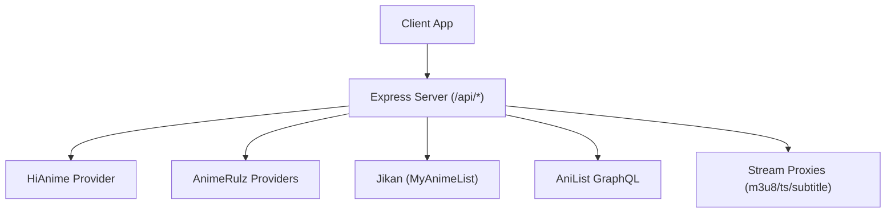
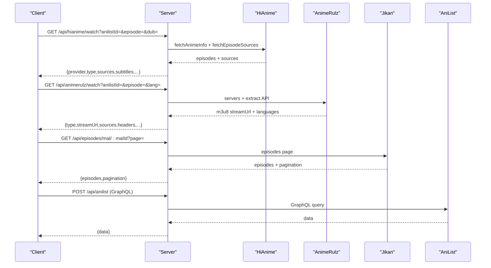
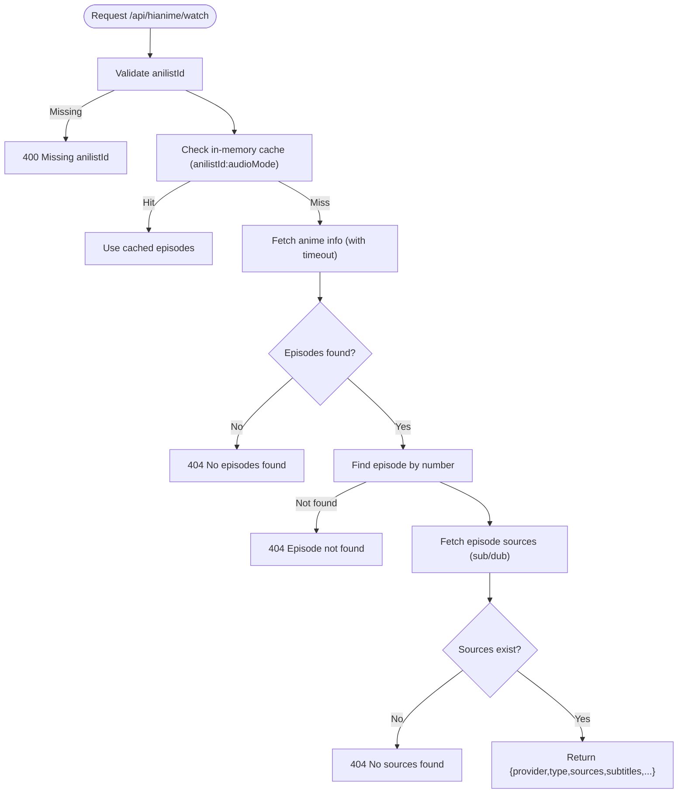
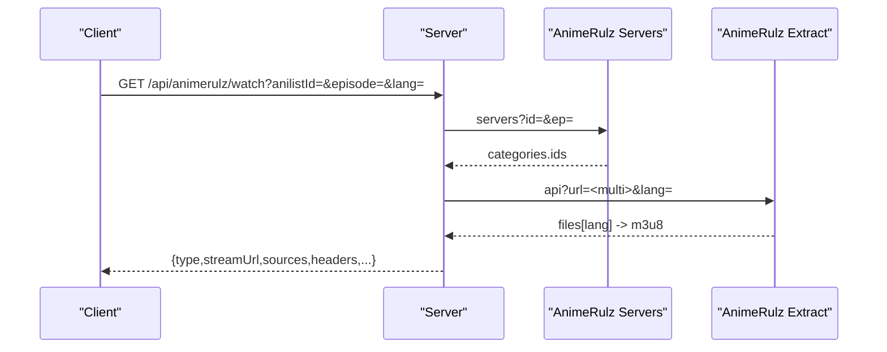
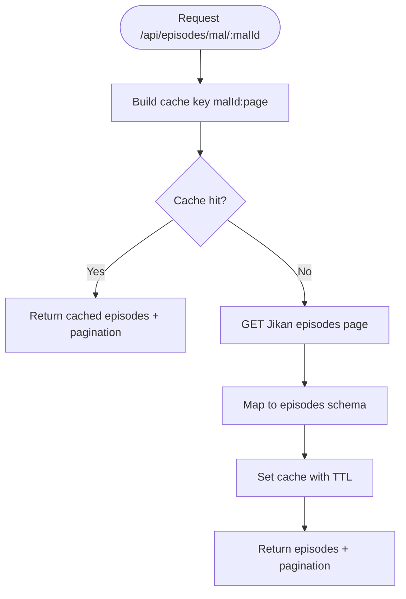
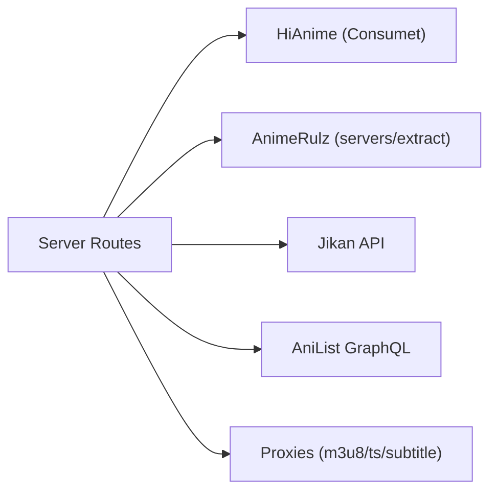

# Anime APIs

<cite>
**Referenced Files in This Document**
- [server.js](file://server.js)
- [animeApi.js](file://src/features/anime/api/animeApi.js)
- [hindiApi.js](file://src/features/anime/hindi/api/hindiApi.js)
- [runtimeConfig.js](file://src/runtimeConfig.js)
- [mockData.js](file://src/mockData.js)
</cite>

## Table of Contents
1. Introduction
2. Project Structure
3. Core Components
4. Architecture Overview
5. Detailed Component Analysis
6. Dependency Analysis
7. Performance Considerations
8. Troubleshooting Guide
9. Conclusion

## Introduction
This document provides comprehensive API documentation for anime content discovery and streaming endpoints exposed by the backend server. It focuses on:
- HiAnime streaming endpoint /api/hianime/watch with anilistId and episode parameters, including dub language support (eng for English dub; otherwise sub).
- AnimeRulz Hindi/Indian language streaming endpoint /api/animerulz/watch with language options (hin, tam, tel, eng, jpn).
- Jikan episode metadata endpoint /api/episodes/mal/:malId to fetch episode titles, air dates, and filler/recap flags.
It also covers request/response schemas, error handling, caching behavior, provider fallback mechanisms, and practical examples for searching anime, retrieving episode lists, and obtaining streaming URLs with different audio tracks.

## Project Structure
The backend is implemented as a single Express application that exposes REST endpoints under /api. The frontend calls these endpoints via a runtime-configured base URL. Key files:
- server.js: Defines all API routes, caching, proxying, and provider integrations.
- src/features/anime/api/animeApi.js: Frontend-facing API abstraction for anime features.
- src/features/anime/hindi/api/hindiApi.js: Frontend helpers for AnimeRulz availability and catalog queries.
- src/runtimeConfig.js: Resolves the API base URL at runtime for client-side requests.
- src/mockData.js: Client-side utilities and helper functions used by UI components.

**Diagram sources**
- [server.js:10-20](file://server.js#L10-L20)
- [server.js:662-710](file://server.js#L662-L710)
- [server.js:1048-1089](file://server.js#L1048-L1089)
- [server.js:1210-1278](file://server.js#L1210-L1278)

**Section sources**
- [server.js:10-20](file://server.js#L10-L20)
- [runtimeConfig.js:82-153](file://src/runtimeConfig.js#L82-L153)

## Core Components
- Streaming endpoints:
  - /api/hianime/watch: Returns HLS sources for a given anime episode using HiAnime, with optional dub selection.
  - /api/animerulz/watch: Returns HLS sources for Indian language dubs or Japanese subs via AnimeRulz infrastructure.
- Metadata endpoints:
  - /api/episodes/mal/:malId: Returns paginated episode metadata from Jikan (titles, air dates, filler/recap).
  - /api/animerulz/episodes: Returns episode list for a given anilistId from AnimeRulz.
- Discovery endpoints:
  - /api/search: Searches via AnimeKai to resolve slugs for titles.
  - /api/animerulz/catalog: Lists available AnimeRulz items filtered by language.
  - /api/animerulz/availability: Checks if an anime has specific language tracks on AnimeRulz.
- Utility endpoints:
  - /api/anilist: Cached GraphQL proxy to AniList.
  - /api/img-proxy, /api/subtitle-proxy, /api/m3u8-proxy, /api/ts-proxy: Proxies for images, subtitles, and media segments.

**Section sources**
- [server.js:662-710](file://server.js#L662-L710)
- [server.js:1048-1089](file://server.js#L1048-L1089)
- [server.js:1096-1155](file://server.js#L1096-L1155)
- [server.js:1164-1208](file://server.js#L1164-L1208)
- [server.js:1606-1617](file://server.js#L1606-L1617)

## Architecture Overview
The server acts as an aggregator and proxy between clients and external providers (HiAnime, AnimeRulz, Jikan, AniList). It implements:
- In-memory caches per endpoint to reduce external calls and improve latency.
- Fallback chains when primary providers fail or time out.
- Stream proxies to handle CORS, hotlink protection, and CDN-specific headers.

**Diagram sources**
- [server.js:1210-1278](file://server.js#L1210-L1278)
- [server.js:1048-1089](file://server.js#L1048-L1089)
- [server.js:662-710](file://server.js#L662-L710)
- [server.js:1164-1208](file://server.js#L1164-L1208)

## Detailed Component Analysis

### HiAnime Watch Endpoint
- Route: GET /api/hianime/watch
- Query Parameters:
  - anilistId: Required. Numeric AniList ID.
  - episode: Optional. Defaults to 1 if missing.
  - dub: Optional. "eng" selects English dub; any other value defaults to sub.
- Behavior:
  - Retrieves episode list for the given anilistId with a timeout to fall back to alternative providers if needed.
  - Uses an in-memory cache keyed by anilistId and audio mode (sub/dub) with TTL to avoid repeated lookups.
  - Fetches episode sources for the selected episode and returns HLS streams.
- Response Schema:
  - provider: "hianime"
  - type: "hls"
  - sources: Array of source objects (each includes url, quality, etc.)
  - subtitles: Array of subtitle entries
  - episode: Episode number requested
  - episodeTitle: Title string or null
  - audioMode: "sub" or "dub"
- Error Handling:
  - Missing anilistId: 400 with error message.
  - No episodes found: 404 with descriptive error.
  - No sources for episode: 404 with error.
  - Lookup failure: 500 with error and message.
- Caching:
  - Episode list cached per anilistId+audioMode for a fixed TTL.

**Diagram sources**
- [server.js:1210-1278](file://server.js#L1210-L1278)

**Section sources**
- [server.js:1210-1278](file://server.js#L1210-L1278)

### AnimeRulz Watch Endpoint
- Route: GET /api/animerulz/watch
- Query Parameters:
  - anilistId: Required. Numeric AniList ID.
  - episode: Optional. Defaults to 1 if missing.
  - lang: Optional. Language code: hin (Hindi), tam (Tamil), tel (Telugu), eng (English), jpn (Japanese). Default is hin.
- Behavior:
  - Queries AnimeRulz infrastructure to obtain server IDs and extracts language-specific m3u8 URLs.
  - Supports multiple providers and fallbacks within the AnimeRulz ecosystem.
  - Returns HLS stream URLs wrapped with necessary headers and optional subtitles.
- Response Schema:
  - type: "hls"
  - streamUrl: Primary HLS URL
  - sources: Array of source objects (includes url, isM3U8, quality, language label, audioMode)
  - subtitles: Array of subtitle entries
  - headers: Additional headers required for playback
  - provider: "animerulz"
  - language: Language code returned
  - audioMode: "hindi" (for Indian dubs) or appropriate mode
  - availableLanguages: List of available language codes
- Error Handling:
  - Missing anilistId: 400 with error message.
  - Stream resolution failure: 502 with error and message.
- Caching:
  - Stream results may be cached per provider logic; responses include headers for secure playback.

**Diagram sources**
- [server.js:1048-1089](file://server.js#L1048-L1089)

**Section sources**
- [server.js:1048-1089](file://server.js#L1048-L1089)

### Jikan Episodes Endpoint
- Route: GET /api/episodes/mal/:malId
- Path Parameters:
  - malId: Required. MyAnimeList numeric ID.
- Query Parameters:
  - page: Optional. Defaults to 1.
- Behavior:
  - Fetches paginated episode metadata from Jikan API.
  - Maps fields to include episode number, title, Japanese title, aired date, score, filler flag, recap flag.
  - Caches responses per malId:page with TTL to reduce external calls.
- Response Schema:
  - episodes: Array of episode objects with number, title, titleJapanese, aired, score, filler, recap
  - pagination: currentPage, lastPage, hasNextPage, total
- Error Handling:
  - External fetch failure: 502 with error and message.

**Diagram sources**
- [server.js:662-710](file://server.js#L662-L710)

**Section sources**
- [server.js:662-710](file://server.js#L662-L710)

### AnimeRulz Episodes and Availability Endpoints
- /api/animerulz/episodes
  - Query: anilistId (required)
  - Response: { total, episodes: [{ number, title, description, img, hasDub, hasSub }, ...] }
  - Errors: 400 if missing parameter; 502 on fetch failure.
- /api/animerulz/availability
  - Query: anilistId (required)
  - Response: { available, languages, animerulz_id } or { available: false }
  - Errors: 400 if missing parameter; 502 on check failure.
- /api/animerulz/catalog
  - Query: language/lang (default hindi), page, limit
  - Response: { language, total, page, pages, items: [...] }
  - Errors: 502 on catalog fetch failure.

**Section sources**
- [server.js:1096-1155](file://server.js#L1096-L1155)

### Search Endpoint
- Route: GET /api/search
- Query Parameters:
  - q: Required. Search term.
- Behavior:
  - Uses AnimeKai search to resolve slug for the title.
  - Returns { slug, results: [{ slug }] }.
- Error Handling:
  - Missing q: 400 with error.
  - Search failure: 500 with error.

**Section sources**
- [server.js:1606-1617](file://server.js#L1606-L1617)

### AniList GraphQL Proxy
- Route: POST /api/anilist
- Body: GraphQL query and variables
- Behavior:
  - Proxies to AniList GraphQL with rate-limit retries and in-memory caching.
  - Returns { data } containing the queried result.
- Error Handling:
  - Rate limiting handled with retries; falls back to cached data if available.
  - Persistent failures return 502 or 500 with error details.

**Section sources**
- [server.js:1164-1208](file://server.js#L1164-L1208)

## Dependency Analysis
- Provider Integrations:
  - HiAnime via Consumet library methods for fetching anime info and episode sources.
  - AnimeRulz via custom HTTP calls to servers and extract endpoints.
  - Jikan via direct HTTP calls to Jikan API.
  - AniList via GraphQL proxy with caching and retry logic.
- Caching Layers:
  - In-memory caches for episode lists, stream URLs, and Jikan pages.
  - TTL-based expiration to balance freshness and performance.
- Stream Proxies:
  - m3u8-proxy, ts-proxy, subtitle-proxy to handle CORS, referer, and CDN-specific requirements.

**Diagram sources**
- [server.js:10-20](file://server.js#L10-L20)
- [server.js:235-360](file://server.js#L235-L360)
- [server.js:662-710](file://server.js#L662-L710)
- [server.js:1048-1089](file://server.js#L1048-L1089)
- [server.js:1210-1278](file://server.js#L1210-L1278)

**Section sources**
- [server.js:10-20](file://server.js#L10-L20)
- [server.js:235-360](file://server.js#L235-L360)
- [server.js:662-710](file://server.js#L662-L710)
- [server.js:1048-1089](file://server.js#L1048-L1089)
- [server.js:1210-1278](file://server.js#L1210-L1278)

## Performance Considerations
- Caching:
  - Episode lists and stream URLs are cached in memory with TTLs to reduce external API calls and latency.
  - AniList GraphQL responses are cached server-side to mitigate rate limits.
- Timeouts and Retries:
  - HiAnime fetchAnimeInfo uses a timeout to trigger fallbacks quickly.
  - AnimeRulz provider probing tries multiple referers and providers to recover from transient errors.
- Stream Proxies:
  - Proxies add minimal overhead but ensure reliable playback across CDNs and regions.
- Recommendations:
  - Prefer using anilistId for deterministic results and faster lookups.
  - Request only necessary pages for Jikan episodes to minimize payload size.
  - Use language filters on AnimeRulz catalog to reduce processing time.

[No sources needed since this section provides general guidance]

## Troubleshooting Guide
Common issues and resolutions:
- Missing parameters:
  - Ensure anilistId is provided for watch and episodes endpoints.
  - For search, provide q parameter.
- Provider failures:
  - If HiAnime times out, the server attempts fallbacks; verify network connectivity and provider status.
  - AnimeRulz may require specific referers; the server handles this automatically but external blocks can still occur.
- Caching staleness:
  - If episode lists appear outdated, wait for TTL expiry or restart the server to clear in-memory caches.
- Stream playback issues:
  - Use the provided headers and proxies; do not bypass them to avoid CORS or hotlink errors.

**Section sources**
- [server.js:1210-1278](file://server.js#L1210-L1278)
- [server.js:1048-1089](file://server.js#L1048-L1089)
- [server.js:662-710](file://server.js#L662-L710)

## Conclusion
The Anime APIs provide robust endpoints for discovering anime content and obtaining streaming URLs across multiple providers. They implement caching, fallback mechanisms, and stream proxies to ensure reliability and performance. Use the documented schemas and parameters to integrate seamlessly with the backend, and leverage the availability and catalog endpoints to tailor experiences based on language preferences.

[No sources needed since this section summarizes without analyzing specific files]