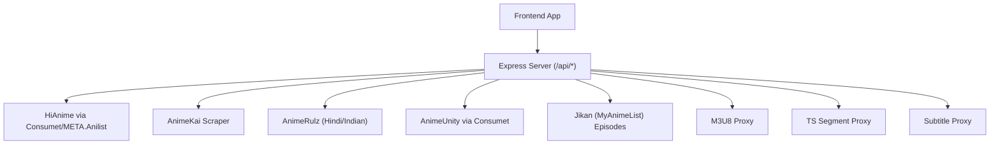
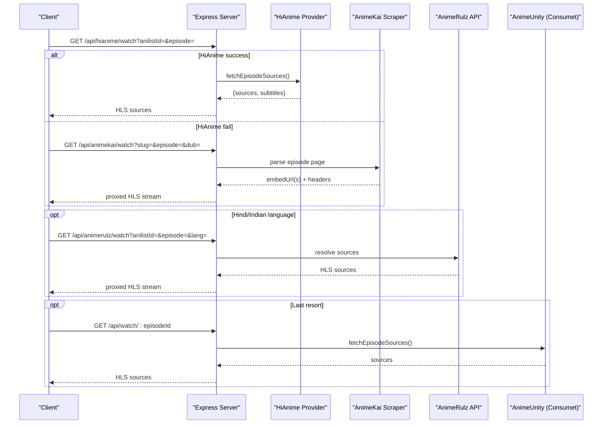
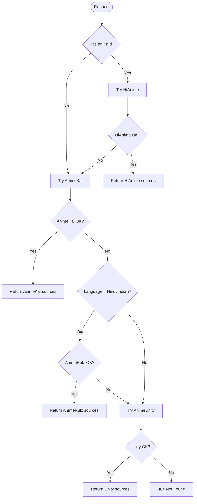

# Content APIs

<cite>
**Referenced Files in This Document**
- [server.js](file://server.js)
- [api/index.js](file://api/index.js)
- [mockData.js](file://src/mockData.js)
- [animeApi.js](file://src/features/anime/api/animeApi.js)
- [hindiApi.js](file://src/features/anime/hindi/api/hindiApi.js)
</cite>

## Table of Contents
1. [Introduction](#introduction)
2. [Project Structure](#project-structure)
3. [Core Components](#core-components)
4. [Architecture Overview](#architecture-overview)
5. [Detailed Component Analysis](#detailed-component-analysis)
6. [Dependency Analysis](#dependency-analysis)
7. [Performance Considerations](#performance-considerations)
8. [Troubleshooting Guide](#troubleshooting-guide)
9. [Conclusion](#conclusion)

## Introduction
This document provides comprehensive API documentation for content discovery and streaming endpoints used by the application. It covers:
- Anime search and metadata retrieval via AniList through a backend proxy
- Episode listing from MyAnimeList (MAL) IDs
- Streaming endpoints for multiple providers with a multi-provider fallback system
- Provider-specific endpoints including HiAnime, AnimeKai, AnimeRulz (Hindi/Indian dubs), and AnimeUnity
- Request parameters such as anilistId, episode numbers, language preferences, and quality options
- Response schemas for anime metadata, episode lists, and stream URLs
- Examples for searching anime, retrieving episodes, and obtaining streaming URLs with different audio tracks (sub, dub, hindi)

## Project Structure
The backend is implemented in a single Express server that exposes REST endpoints under /api. The frontend calls these endpoints via a centralized API helper and feature modules. Key files:
- server.js: All backend routes, provider integrations, proxies, and fallback logic
- api/index.js: Exposes the Express app for deployment
- src/mockData.js: Frontend orchestration of provider selection and fallbacks
- src/features/anime/api/animeApi.js: Feature API wrapper exposing methods to the UI
- src/features/anime/hindi/api/hindiApi.js: Hindi/Indian language availability and catalog helpers

**Diagram sources**
- [server.js:213-228](file://server.js#L213-L228)
- [server.js:662-710](file://server.js#L662-L710)
- [server.js:738-747](file://server.js#L738-L747)
- [server.js:1562-1601](file://server.js#L1562-L1601)

**Section sources**
- [server.js:1-30](file://server.js#L1-L30)
- [api/index.js:1-4](file://api/index.js#L1-L4)

## Core Components
- Providers:
  - HiAnime (primary): Uses AniList ID for deterministic season/episode mapping
  - AnimeKai (secondary): Title-based search and episode embed extraction
  - AnimeRulz (Hindi/Indian): Language-specific streams via data/fallback APIs
  - AnimeUnity (last resort): Consumet-based fallback
- Proxies:
  - M3U8 manifest proxy: Rewrites playlists and segments to go through the backend
  - TS segment proxy: Streams video/audio segments with Range support
  - Subtitle proxy: Serves VTT subtitles without CORS issues
- Caching:
  - Episode list cache for MAL pages
  - Stream URL caches per slug+episode+language
  - AnimeKai title search cache
  - AnimeRulz catalog/detail caches

**Section sources**
- [server.js:213-228](file://server.js#L213-L228)
- [server.js:413-425](file://server.js#L413-L425)
- [server.js:764-789](file://server.js#L764-L789)

## Architecture Overview
The streaming pipeline uses a layered fallback strategy:
1. If an AniList ID is provided, try HiAnime first (most reliable for exact season/episode).
2. If HiAnime fails or no AniList ID is available, use AnimeKai to search by title and extract HLS streams.
3. For Hindi/Indian languages, use AnimeRulz endpoints which resolve streams via data/fallback services.
4. As a last resort, use AnimeUnity via Consumet to find any available source.

**Diagram sources**
- [server.js:738-747](file://server.js#L738-L747)
- [server.js:1450-1545](file://server.js#L1450-L1545)
- [server.js:1051-1084](file://server.js#L1051-L1084)
- [server.js:1562-1601](file://server.js#L1562-L1601)

## Detailed Component Analysis

### Endpoint: /api/hianime/watch
- Purpose: Primary stream provider using AniList ID to deterministically select the correct season and episode.
- Method: GET
- Query Parameters:
  - anilistId: Required. Numeric AniList media ID.
  - episode: Required. Episode number within the selected season.
  - dub: Optional. Language preference for audio track (e.g., eng, hindi).
- Response Schema:
  - provider: "hianime"
  - type: "hls"
  - sources: Array of stream objects (each includes url, isM3U8, quality, language)
  - subtitles: Array of subtitle track objects (url, lang, label)
  - episode: Episode number
  - episodeTitle: Optional title string
  - audioMode: Audio mode used (sub/dub/hindi)
- Notes:
  - Uses META.Anilist to map AniList ID to HiAnime season/episode.
  - Sources are wrapped through the M3U8 proxy to bypass CORS and enforce referer/headers.

**Section sources**
- [server.js:738-747](file://server.js#L738-L747)
- [server.js:1259-1277](file://server.js#L1259-L1277)

### Endpoint: /api/animekai/watch
- Purpose: Secondary provider that searches by title and extracts direct HLS streams from embed pages.
- Method: GET
- Query Parameters:
  - slug: Required. AnimeKai slug derived from title search.
  - episode: Required. Episode number.
  - dub: Optional. Preferred language (sub, dub, hsub).
- Response Schema:
  - provider: "animekai"
  - type: "hls" or "iframe"
  - streamUrl: Proxied HLS URL (via /api/m3u8-proxy)
  - subtitleUrl: Optional proxied subtitle URL
  - headers: Referer/Origin required for playback
  - episode: Episode number
  - language: Selected language (e.g., English Sub, English Dub)
  - server: Server name chosen
  - cached: Boolean indicating if result came from cache
- Notes:
  - Performs parallel probing of top servers to minimize latency.
  - Falls back to iframe if direct extraction fails.

**Section sources**
- [server.js:1450-1545](file://server.js#L1450-L1545)

### Endpoint: /api/animerulz/watch
- Purpose: Provides Hindi/Indian language streams using AniList ID and provider APIs.
- Method: GET
- Query Parameters:
  - anilistId: Required. Numeric AniList media ID.
  - episode: Required. Episode number.
  - lang: Optional. Language code (hin, tam, tel, eng, jpn). Defaults to hin.
- Response Schema:
  - type: "hls"
  - streamUrl: Proxied HLS URL
  - sources: Array of alternative HLS sources (proxied)
  - subtitles: Optional subtitle tracks
  - headers: Required headers (e.g., Referer)
  - provider: "animerulz"
  - language: Selected language
  - audioMode: "hindi"
- Notes:
  - Wraps all m3u8 URLs through the M3U8 proxy due to missing CORS on provider domains.
  - Uses data.streamindia.co.in and fallback APIs to resolve sources.

**Section sources**
- [server.js:1051-1084](file://server.js#L1051-L1084)

### Endpoint: /api/watch/:episodeId
- Purpose: Last-resort streaming endpoint using AnimeUnity via Consumet.
- Method: GET
- Path Parameter:
  - episodeId: Required. Consumet episode identifier.
- Response Schema:
  - provider: "animeunity" or "animeunity-direct"
  - type: "hls"
  - sources: Array of stream objects
  - subtitles: Optional subtitle tracks
  - headers: Optional headers
- Notes:
  - Tries META.Anilist first; falls back to direct AnimeUnity call.
  - Returns 404 if no sources found.

**Section sources**
- [server.js:1562-1601](file://server.js#L1562-L1601)

### Endpoint: /api/episodes/mal/:malId
- Purpose: Retrieves episode metadata from MyAnimeList via Jikan API.
- Method: GET
- Path Parameter:
  - malId: Required. MyAnimeList anime ID.
- Query Parameters:
  - page: Optional. Page number (default 1).
- Response Schema:
  - episodes: Array of episode objects
    - number: Episode number
    - title: Episode title
    - titleJapanese: Optional Japanese title
    - aired: Air date (YYYY-MM-DD)
    - score: Rating score
    - filler: Boolean
    - recap: Boolean
  - pagination:
    - currentPage: Current page
    - lastPage: Total pages
    - hasNextPage: Boolean
    - total: Estimated total episodes
- Notes:
  - Results are cached per malId:page for 1 hour.

**Section sources**
- [server.js:662-710](file://server.js#L662-L710)

### Endpoint: /api/animerulz/availability
- Purpose: Checks availability of Hindi/Indian dubs for a given AniList ID.
- Method: GET
- Query Parameters:
  - anilistId: Required.
- Response Schema:
  - available: Boolean
  - languages: Array of language codes (e.g., ["hindi","tamil"])
- Notes:
  - Used by frontend to show availability indicators.

**Section sources**
- [hindiApi.js:13-33](file://src/features/anime/hindi/api/hindiApi.js#L13-L33)
- [mockData.js:26-46](file://src/mockData.js#L26-L46)

### Endpoint: /api/animerulz/catalog
- Purpose: Fetches AnimeRulz catalog filtered by language (e.g., hindi).
- Method: GET
- Query Parameters:
  - language: Required. e.g., "hindi"
  - limit: Optional. Max items to return
- Response Schema:
  - items: Array of catalog entries with animerulz_id and languages
- Notes:
  - Frontend batches requests to AniList to enrich catalog with details.

**Section sources**
- [hindiApi.js:47-131](file://src/features/anime/hindi/api/hindiApi.js#L47-L131)

### Streaming Proxies
- /api/m3u8-proxy: Rewrites HLS manifests and segments to route through the backend, handling referers and protected CDNs.
- /api/ts-proxy: Streams video/audio segments with Range header forwarding for efficient playback.
- /api/subtitle-proxy: Serves VTT subtitles without CORS restrictions.

**Section sources**
- [server.js:263-345](file://server.js#L263-L345)
- [server.js:354-393](file://server.js#L354-L393)
- [server.js:235-256](file://server.js#L235-L256)

## Dependency Analysis
Provider relationships and fallback order:
- HiAnime (primary) depends on META.Anilist to map AniList ID to season/episode.
- AnimeKai (secondary) scrapes titles and episode pages to extract HLS streams.
- AnimeRulz (Hindi/Indian) depends on data/fallback APIs and requires specific headers.
- AnimeUnity (last resort) uses Consumet to find any available source.

**Diagram sources**
- [server.js:738-747](file://server.js#L738-L747)
- [server.js:1450-1545](file://server.js#L1450-L1545)
- [server.js:1051-1084](file://server.js#L1051-L1084)
- [server.js:1562-1601](file://server.js#L1562-L1601)

**Section sources**
- [server.js:213-228](file://server.js#L213-L228)
- [server.js:413-425](file://server.js#L413-L425)

## Performance Considerations
- Caching:
  - MAL episode lists cached per page for 1 hour
  - Stream URLs cached per slug+episode+language for 20 minutes
  - AnimeKai title search cached for 1 hour
  - AnimeRulz catalog/detail cached for 30 minutes
- Network optimizations:
  - Parallel probing of AnimeKai servers reduces latency
  - Range header forwarding for TS segments enables instant startup
  - M3U8 proxy avoids repeated external requests by rewriting manifests
- Rate limiting:
  - Jikan API rate limits respected via timeouts and retries
  - AniList GraphQL requests cached to avoid excessive calls

[No sources needed since this section provides general guidance]

## Troubleshooting Guide
Common issues and resolutions:
- Missing parameters:
  - /api/hianime/watch requires anilistId and episode
  - /api/animerulz/watch requires anilistId and episode
  - /api/animerulz/availability requires anilistId
- CORS and Referer:
  - Use /api/m3u8-proxy and /api/ts-proxy to bypass CORS and enforce referer
  - Ensure Referer/Origin headers are set when calling provider APIs directly
- Provider failures:
  - If HiAnime fails, the client should fall back to AnimeKai or AnimeUnity
  - AnimeRulz may require specific language codes; verify lang parameter
- Cache staleness:
  - If results seem outdated, clear client-side caches or wait for TTL expiry
- Error responses:
  - 400: Missing parameters
  - 404: No streaming sources found
  - 502: Upstream provider error

**Section sources**
- [server.js:662-710](file://server.js#L662-L710)
- [server.js:1051-1084](file://server.js#L1051-L1084)
- [server.js:1562-1601](file://server.js#L1562-L1601)

## Conclusion
The content APIs provide a robust, multi-provider streaming solution with deterministic lookups via AniList IDs and flexible fallbacks for various languages and sources. The backend handles CORS, referer enforcement, and caching to ensure reliable playback across different providers. Clients should prefer HiAnime when possible, fall back to AnimeKai for title-based searches, use AnimeRulz for Hindi/Indian dubs, and rely on AnimeUnity as a last resort.

[No sources needed since this section summarizes without analyzing specific files]