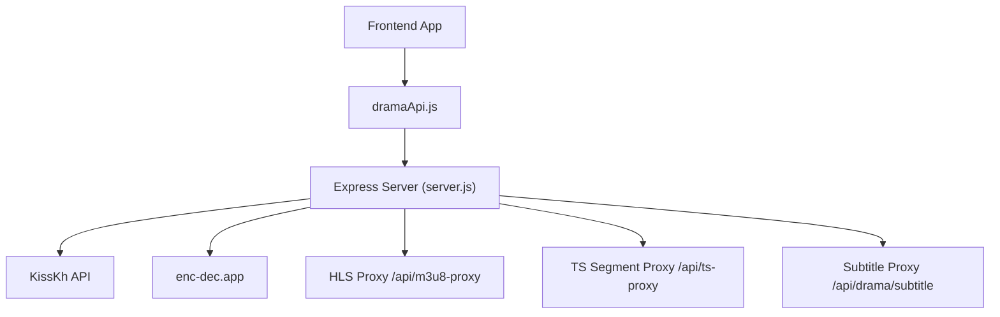
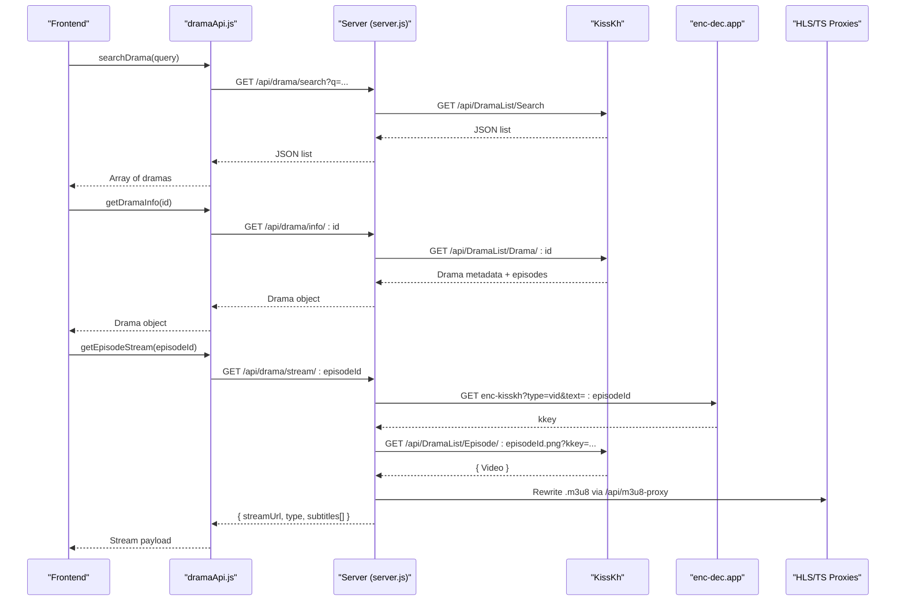
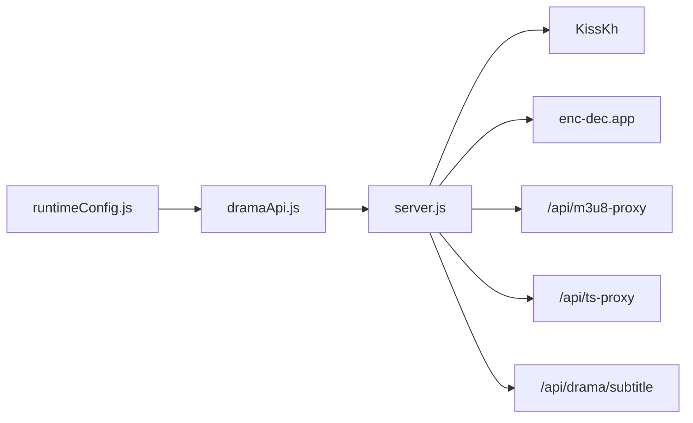

# Drama APIs

<cite>
**Referenced Files in This Document**
- [dramaApi.js](file://src/features/drama/api/dramaApi.js)
- [DramaDetailView.jsx](file://src/features/drama/components/DramaDetailView.jsx)
- [DramaWatchView.jsx](file://src/features/drama/components/DramaWatchView.jsx)
- [DramaHomeView.jsx](file://src/features/drama/components/DramaHomeView.jsx)
- [runtimeConfig.js](file://src/runtimeConfig.js)
- [server.js](file://server.js)
- [index.js](file://api/index.js)
</cite>

## Table of Contents
1. Introduction
2. Project Structure
3. Core Components
4. Architecture Overview
5. Detailed Component Analysis
6. Dependency Analysis
7. Performance Considerations
8. Troubleshooting Guide
9. Conclusion

## Introduction
This document provides comprehensive API documentation for drama series content discovery and streaming endpoints. It covers:
- Searching dramas
- Retrieving drama details (metadata, episodes)
- Navigating seasons/episodes
- Obtaining streaming URLs with HLS support and subtitles
- KissKh integration and international drama handling
- Request/response schemas and examples

The backend proxies requests to KissKh and normalizes responses for the frontend. It also includes robust HLS proxying and subtitle handling for reliable playback across regions.

## Project Structure
The drama feature is implemented as a client-side API module that calls backend routes exposed by the server. The server integrates with KissKh and provides caching, HLS proxying, and subtitle proxying.

**Diagram sources**
- [dramaApi.js:5-29](file://src/features/drama/api/dramaApi.js#L5-L29)
- [server.js:1862-2043](file://server.js#L1862-L2043)

**Section sources**
- [dramaApi.js:1-33](file://src/features/drama/api/dramaApi.js#L1-L33)
- [server.js:1862-2043](file://server.js#L1862-L2043)

## Core Components
- Frontend API client:
  - Home catalog retrieval
  - Drama info retrieval
  - Episode stream retrieval
  - Search
- Backend routes:
  - /api/drama/home
  - /api/drama/list
  - /api/drama/search
  - /api/drama/info/:dramaId
  - /api/drama/stream/:episodeId
  - /api/drama/subtitle?url=...
  - HLS/TS proxies for streaming reliability

**Section sources**
- [dramaApi.js:5-29](file://src/features/drama/api/dramaApi.js#L5-L29)
- [server.js:1862-2043](file://server.js#L1862-L2043)

## Architecture Overview
The frontend uses a small API client to call backend endpoints. The server aggregates data from KissKh, caches results, and proxies media streams and subtitles to bypass CORS and region restrictions.

**Diagram sources**
- [dramaApi.js:12-22](file://src/features/drama/api/dramaApi.js#L12-L22)
- [server.js:1915-2017](file://server.js#L1915-L2017)
- [server.js:263-345](file://server.js#L263-L345)

## Detailed Component Analysis

### Search Dramas
- Endpoint: GET /api/drama/search
- Query parameters:
  - q: string (required) — search term
- Response schema:
  - Array of drama items with fields such as id, title, thumbnail, country, status, releaseDate, episodesCount, description
- Behavior:
  - Forwards query to KissKh search endpoint
  - Caches results for 30 minutes
  - Returns empty array or error on failure

Example request:
- GET /api/drama/search?q=crash+landing+on+you

Example response (array):
- [
    {
      "id": "string",
      "title": "string",
      "thumbnail": "string",
      "country": "string",
      "status": "string",
      "releaseDate": "ISO date string",
      "episodesCount": "number"
    }
  ]

**Section sources**
- [server.js:1915-1927](file://server.js#L1915-L1927)
- [dramaApi.js:24-29](file://src/features/drama/api/dramaApi.js#L24-L29)

### Drama Home Catalog
- Endpoint: GET /api/drama/home
- Response schema:
  - show: Array — featured/popular dramas
  - korean: Array — popular Korean dramas
  - chinese: Array — popular Chinese dramas
  - topRating: Array — top rated dramas
  - lastUpdate: Array — recently updated dramas
- Behavior:
  - Aggregates multiple KissKh lists concurrently
  - Caches for 30 minutes

Example request:
- GET /api/drama/home

Example response:
- {
    "show": [...],
    "korean": [...],
    "chinese": [...],
    "topRating": [...],
    "lastUpdate": [...]
  }

**Section sources**
- [server.js:1862-1892](file://server.js#L1862-L1892)
- [dramaApi.js:6-10](file://src/features/drama/api/dramaApi.js#L6-L10)

### Drama Info (Metadata + Episodes)
- Endpoint: GET /api/drama/info/:dramaId
- Path parameter:
  - dramaId: string — unique identifier for the drama
- Response schema:
  - id: string
  - title: string
  - description: string
  - thumbnail: string
  - releaseDate: ISO date string
  - country: string
  - status: string
  - episodes: Array of episode objects
    - number: number
    - id: string
    - sub: number (count of available subtitles)
- Behavior:
  - Fetches drama detail from KissKh
  - Caches per dramaId for 30 minutes

Example request:
- GET /api/drama/info/abc123

Example response:
- {
    "id": "abc123",
    "title": "Crash Landing on You",
    "description": "...",
    "thumbnail": "https://...",
    "releaseDate": "2020-01-01T00:00:00Z",
    "country": "KR",
    "status": "Completed",
    "episodes": [
      { "number": 1, "id": "ep1", "sub": 3 },
      { "number": 2, "id": "ep2", "sub": 3 }
    ]
  }

**Section sources**
- [server.js:1929-1946](file://server.js#L1929-L1946)
- [dramaApi.js:12-16](file://src/features/drama/api/dramaApi.js#L12-L16)

### Episode Streaming URL
- Endpoint: GET /api/drama/stream/:episodeId
- Path parameter:
  - episodeId: string — episode identifier
- Response schema:
  - episodeId: string
  - type: "hls" | "mp4"
  - streamUrl: string — proxied HLS URL or direct MP4
  - subtitles: Array of subtitle tracks
    - label: string
    - file: string — proxied VTT URL via /api/drama/subtitle
    - rawFile: string — original subtitle URL
    - default: boolean — true if English
- Behavior:
  - Requests a video key from enc-dec.app
  - Retrieves stream URL from KissKh using the key
  - Rewrites HLS manifests through /api/m3u8-proxy for CORS and referer handling
  - Optionally fetches subtitles and wraps them via /api/drama/subtitle

Example request:
- GET /api/drama/stream/ep1

Example response:
- {
    "episodeId": "ep1",
    "type": "hls",
    "streamUrl": "https://your-server/api/m3u8-proxy?url=...&referer=...",
    "subtitles": [
      { "label": "English", "file": "/api/drama/subtitle?url=...", "rawFile": "https://...", "default": true },
      { "label": "Spanish", "file": "/api/drama/subtitle?url=...", "rawFile": "https://...", "default": false }
    ]
  }

**Section sources**
- [server.js:1948-2017](file://server.js#L1948-L2017)
- [dramaApi.js:18-22](file://src/features/drama/api/dramaApi.js#L18-L22)

### Subtitle Proxy
- Endpoint: GET /api/drama/subtitle
- Query parameters:
  - url: string — original subtitle URL
- Response:
  - text/vtt content (ensures WEBVTT header)
- Behavior:
  - Fetches subtitle content and ensures proper format
  - Sets CORS headers for browser access

Example request:
- GET /api/drama/subtitle?url=https://example.com/sub.vtt

**Section sources**
- [server.js:2019-2043](file://server.js#L2019-L2043)

### HLS and Segment Proxies
- Endpoints:
  - GET /api/m3u8-proxy?url=...&referer=...
  - GET /api/ts-proxy?url=...&referer=...
- Purpose:
  - Rewrite HLS playlists and segment URLs to pass through the backend
  - Forward Range headers for efficient streaming
  - Handle protected CDNs and required Referer/Origin headers

Behavior highlights:
- Resolves nested proxy URLs and malformed URIs
- Rewrites audio/video tracks and segments
- Supports byte-range requests for fast startup

**Section sources**
- [server.js:263-345](file://server.js#L263-L345)
- [server.js:354-393](file://server.js#L354-L393)

## Dependency Analysis
- Frontend dependencies:
  - runtimeConfig resolves API base URL dynamically
  - dramaApi.js calls backend endpoints with normalized paths
- Backend dependencies:
  - Express server exposes routes under /api
  - KissKh integration via configurable base URL
  - enc-dec.app used to obtain keys for protected resources
  - HLS/TS proxies ensure reliable playback

**Diagram sources**
- [runtimeConfig.js:82-153](file://src/runtimeConfig.js#L82-L153)
- [dramaApi.js:1-29](file://src/features/drama/api/dramaApi.js#L1-L29)
- [server.js:1862-2043](file://server.js#L1862-L2043)

**Section sources**
- [runtimeConfig.js:82-153](file://src/runtimeConfig.js#L82-L153)
- [dramaApi.js:1-29](file://src/features/drama/api/dramaApi.js#L1-L29)
- [server.js:1862-2043](file://server.js#L1862-L2043)

## Performance Considerations
- Caching:
  - Drama home, list, info, and stream responses are cached with TTLs to reduce external calls
- HLS optimization:
  - Range header forwarding reduces bandwidth and improves startup time
- Concurrency:
  - Home catalog fetches multiple KissKh lists in parallel
- Error resilience:
  - Retry logic for protected providers; fallback referers for problematic CDNs

[No sources needed since this section provides general guidance]

## Troubleshooting Guide
Common issues and resolutions:
- Missing q parameter in search:
  - Ensure query param is provided; server returns 400 with error message
- No stream URL found:
  - Verify episodeId exists; server may return 404 if no stream source
- Subtitle loading failures:
  - Check subtitle URL validity; server returns 502 on fetch errors
- HLS playback blocked:
  - Use /api/m3u8-proxy and /api/ts-proxy; ensure referer is set correctly
- CORS errors:
  - Backend sets Access-Control-Allow-Origin on proxies; verify environment CORS settings

**Section sources**
- [server.js:1915-1927](file://server.js#L1915-L1927)
- [server.js:1948-2017](file://server.js#L1948-L2017)
- [server.js:2019-2043](file://server.js#L2019-L2043)
- [server.js:263-393](file://server.js#L263-L393)

## Conclusion
The Drama APIs provide a complete flow for discovering, navigating, and streaming drama content. They integrate with KissKh for international catalogs, handle HLS streaming reliably through proxies, and expose clean endpoints for frontend consumption. Use the documented endpoints and schemas to implement search, detail views, episode navigation, and playback with subtitles.

[No sources needed since this section summarizes without analyzing specific files]