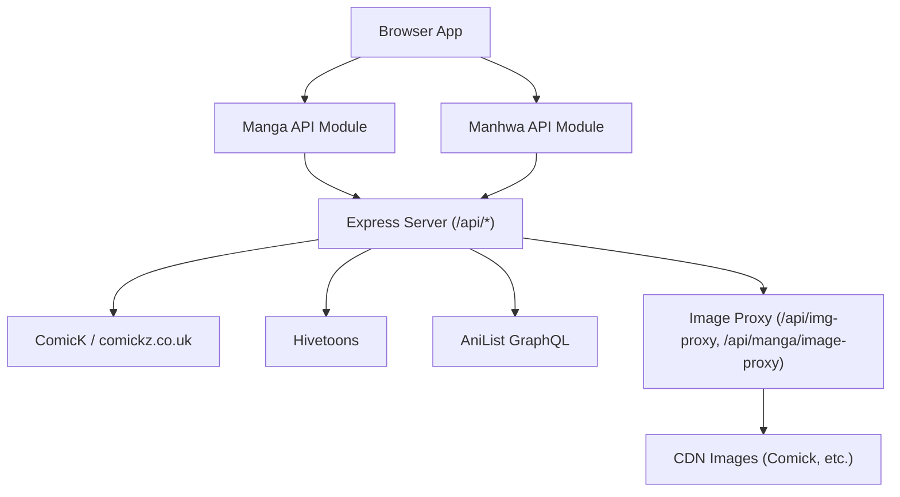
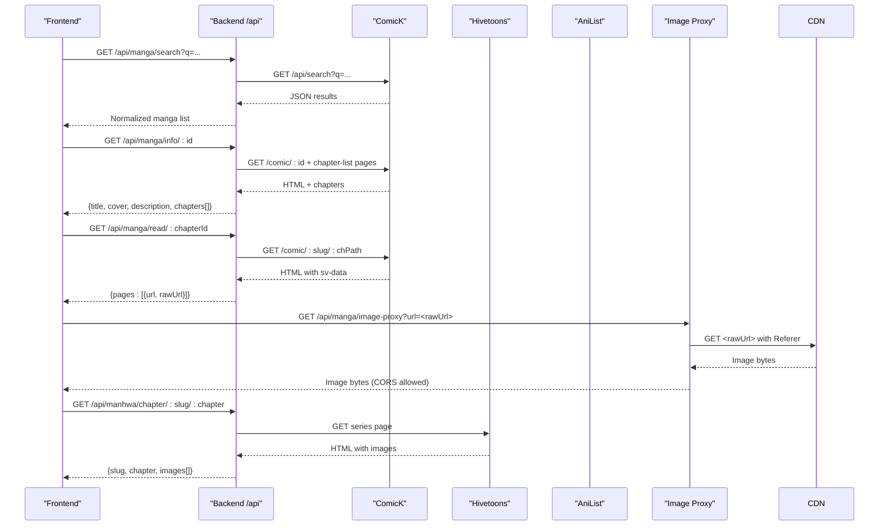
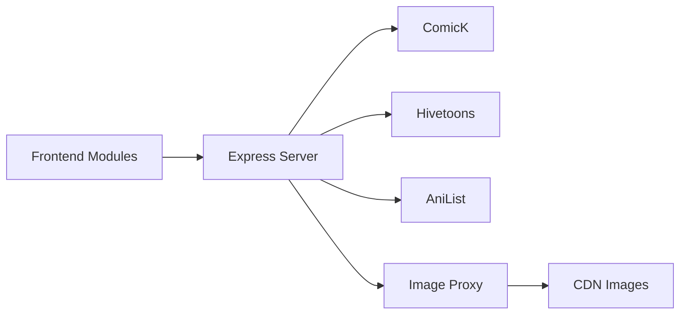

# Manga & Manhwa APIs

<cite>
**Referenced Files in This Document**
- [server.js](file://server.js)
- [mangaApi.js](file://src/features/manga/api/mangaApi.js)
- [manhwaApi.js](file://src/features/manhwa/api/manhwaApi.js)
- [MangaViews.jsx](file://src/features/manga/components/MangaViews.jsx)
- [ManhwaDetailView.jsx](file://src/features/manhwa/components/ManhwaDetailView.jsx)
- [ManhwaReadView.jsx](file://src/features/manhwa/components/ManhwaReadView.jsx)
- [runtimeConfig.js](file://src/runtimeConfig.js)
- [proxy.py](file://proxy.py)
</cite>

## Table of Contents
1. Introduction
2. Project Structure
3. Core Components
4. Architecture Overview
5. Detailed Component Analysis
6. Dependency Analysis
7. Performance Considerations
8. Troubleshooting Guide
9. Conclusion
10. Appendices

## Introduction
This document provides detailed API documentation for manga and manhwa reading content endpoints exposed by the backend server, along with the client-side integration points used to search, browse categories, list chapters, and serve images. It also explains the image proxy services that handle CORS and hotlink protection, including a dedicated proxy for ComicK assets and an optional external relay for KissKH.

## Project Structure
The application exposes a Node/Express backend (server.js) that proxies data from external providers (ComicK/KissKH/Hivetoons/AniList) and serves normalized JSON responses under /api. The frontend calls these endpoints via feature-specific API modules:
- Manga API module: src/features/manga/api/mangaApi.js
- Manhwa API module: src/features/manhwa/api/manhwaApi.js
- UI components consume these modules and render catalogs, details, chapter lists, and readers.

**Diagram sources**
- [server.js:152-198](file://server.js#L152-L198)
- [server.js:2321-2465](file://server.js#L2321-L2465)
- [server.js:2655-2876](file://server.js#L2655-L2876)
- [mangaApi.js:5-26](file://src/features/manga/api/mangaApi.js#L5-L26)
- [manhwaApi.js:5-26](file://src/features/manhwa/api/manhwaApi.js#L5-L26)

**Section sources**
- [server.js:152-198](file://server.js#L152-L198)
- [server.js:2321-2465](file://server.js#L2321-L2465)
- [server.js:2655-2876](file://server.js#L2655-L2876)
- [mangaApi.js:5-26](file://src/features/manga/api/mangaApi.js#L5-L26)
- [manhwaApi.js:5-26](file://src/features/manhwa/api/manhwaApi.js#L5-L26)

## Core Components
- Backend routes for manga discovery, category browsing, search, info, and reading pages are implemented in server.js.
- Frontend API modules encapsulate fetch calls to /api/manga/* and /api/manhwa/* endpoints.
- Image proxy endpoints provide CORS-friendly access to protected images from ComicK and other CDNs.
- Optional Python-based proxy (proxy.py) relays requests to KissKH when needed.

Key responsibilities:
- Search and discovery: /api/manga/search, /api/manga/home, /api/manga/category/:type
- Series info and chapters: /api/manga/info/:id
- Reading pages: /api/manga/read/:chapterId
- Manhwa chapter images: /api/manhwa/chapter/:slug/:chapter
- Image proxy: /api/img-proxy, /api/manga/image-proxy

**Section sources**
- [server.js:2321-2465](file://server.js#L2321-L2465)
- [server.js:2655-2876](file://server.js#L2655-L2876)
- [server.js:1662-1687](file://server.js#L1662-L1687)
- [server.js:152-198](file://server.js#L152-L198)
- [mangaApi.js:5-26](file://src/features/manga/api/mangaApi.js#L5-L26)
- [manhwaApi.js:5-26](file://src/features/manhwa/api/manhwaApi.js#L5-L26)

## Architecture Overview
The backend normalizes provider data into consistent schemas and serves them through stable /api endpoints. For images, it uses proxies to bypass CORS and hotlink restrictions. A hybrid webtoon flow can combine AniList metadata with ComicK chapter data.

**Diagram sources**
- [server.js:2655-2876](file://server.js#L2655-L2876)
- [server.js:152-198](file://server.js#L152-L198)
- [server.js:1662-1687](file://server.js#L1662-L1687)

## Detailed Component Analysis

### Manga Endpoints
- Search
  - Method: GET
  - Path: /api/manga/search
  - Query params: q (string)
  - Response: Array of normalized manga items with fields like id, title, cover, description, rating, status, type
  - Notes: Uses ComicK search; returns empty array on failure

- Home catalog
  - Method: GET
  - Path: /api/manga/home
  - Response: Object containing bentoTop10, manhwaPreview, mangaPreview, manhuaPreview, trending, popular, topRated, featured
  - Notes: Aggregates multiple country filters and normalizes covers via proxy

- Category browsing
  - Method: GET
  - Path: /api/manga/category/:type
  - Path params: type in {manga, manhwa, manhua}
  - Query params: genre (optional), page (default 1), perPage (default 24, capped at 50)
  - Response: {type, country, genre, page, perPage, total, hasMore, items[], trending[], popular[], topPick[], recent[]}
  - Notes: When genre is provided, uses cached genre catalog; otherwise returns curated sections

- Series info and chapters
  - Method: GET
  - Path: /api/manga/info/:id
  - Path params: id (ComicK slug or numeric AniList ID)
  - Response: {id, comickSlug, title, cover, banner, description, status, rating, genres, chapters[]}
  - Notes: If numeric ID, resolves to ComicK slug via AniList then searches ComicK; paginates chapter-list to collect all chapters

- Read chapter pages
  - Method: GET
  - Path: /api/manga/read/:chapterId
  - Path params: chapterId (format "slug___hid-chapter-N-lang")
  - Response: {chapterId, pageCount, pages[]} where each page has url (proxied) and rawUrl
  - Notes: Scrapes chapter HTML for sv-data JSON and maps images to proxied URLs

- Image proxy
  - Method: GET
  - Path: /api/manga/image-proxy
  - Query params: url (absolute URL to image)
  - Response: Image bytes with appropriate Content-Type and CORS headers
  - Notes: Sets Referer based on CDN domain; includes retry/backoff logic for rate-limited CDNs

Example usage patterns
- Search manga: GET /api/manga/search?q=leveling
- Get home: GET /api/manga/home
- Browse category: GET /api/manga/category/manhwa?genre=fantasy&page=1&perPage=24
- Get series info: GET /api/manga/info/maxed-out-leveling
- Read chapter: GET /api/manga/read/maxed-out-leveling___12345-chapter-200-en
- Load image: GET /api/manga/image-proxy?url=https://cdn2.comicknew.pictures/...

**Section sources**
- [server.js:2321-2465](file://server.js#L2321-L2465)
- [server.js:2655-2876](file://server.js#L2655-L2876)
- [server.js:152-198](file://server.js#L152-L198)

### Manhwa Endpoints
- Chapter images
  - Method: GET
  - Path: /api/manhwa/chapter/:slug/:chapter
  - Path params: slug (series slug), chapter (chapter identifier)
  - Response: {slug, chapter, images[]} where images are direct image URLs from Hivetoons
  - Notes: Scrapes series page for images hosted under storage.hivetoon.com

Example usage patterns
- Get chapter images: GET /api/manhwa/chapter/some-series/chapter-1

**Section sources**
- [server.js:1662-1687](file://server.js#L1662-L1687)

### Image Proxy Services
- Generic image proxy
  - Method: GET
  - Path: /api/img-proxy
  - Query params: url (absolute URL or path; relative paths prefixed with meo.comick.pictures)
  - Response: Image bytes with CORS enabled
  - Notes: Adds browser-like User-Agent and Referer; redirects if target is absolute HTTP(S) but fails

- Manga-specific image proxy
  - Method: GET
  - Path: /api/manga/image-proxy
  - Query params: url
  - Response: Image bytes with CORS and caching headers
  - Notes: Sets Referer based on CDN domain; retries on 429 with backoff

Optional external proxy
- Python relay for KissKH
  - Runs on configurable port (default 9090)
  - Relays requests to kisskh.co with browser headers
  - Useful when server-side requests originate from cloud IPs blocked by KissKH

**Section sources**
- [server.js:152-198](file://server.js#L152-L198)
- [server.js:2879-2900](file://server.js#L2879-L2900)
- [proxy.py:1-36](file://proxy.py#L1-L36)

### Frontend Integration
- Manga API module
  - Methods: getHomeCatalog, getMangaInfo, getChapterPages, searchManga
  - Paths: /manga/home, /manga/info/:slug, /manga/chapter/:slug, /manga/search?q=...
  - Notes: Uses runtimeConfig.apiUrl to resolve base URL dynamically

- Manhwa API module
  - Methods: getHomeCatalog, getSeriesInfo, getChapterImages, searchManhwa
  - Paths: /manhwa/home, /manhwa/info/:slug, /manhwa/chapter/:slug, /manhwa/search?q=...
  - Notes: Uses runtimeConfig.apiUrl to resolve base URL dynamically

- UI components
  - Manga views: display catalogs, category hubs, detail pages, chapter lists, and readers
  - Manhwa views: show series details, chapter lists, and reader with navigation

**Section sources**
- [mangaApi.js:5-26](file://src/features/manga/api/mangaApi.js#L5-L26)
- [manhwaApi.js:5-26](file://src/features/manhwa/api/manhwaApi.js#L5-L26)
- [MangaViews.jsx:169-281](file://src/features/manga/components/MangaViews.jsx#L169-L281)
- [ManhwaDetailView.jsx:4-108](file://src/features/manhwa/components/ManhwaDetailView.jsx#L4-L108)
- [ManhwaReadView.jsx:4-90](file://src/features/manhwa/components/ManhwaReadView.jsx#L4-L90)
- [runtimeConfig.js:82-153](file://src/runtimeConfig.js#L82-L153)

## Dependency Analysis
- Backend depends on external providers:
  - ComicK (comickz.co.uk) for manga/manhwa metadata and chapters
  - Hivetoons for manhwa chapter images
  - AniList GraphQL for curated webtoon metadata
- CORS is enabled globally for all routes
- Image proxy handles Referer and Accept headers to satisfy CDN protections
- Runtime configuration determines API base URL for frontend calls

**Diagram sources**
- [server.js:152-198](file://server.js#L152-L198)
- [server.js:2321-2465](file://server.js#L2321-L2465)
- [server.js:2655-2876](file://server.js#L2655-L2876)

**Section sources**
- [server.js:152-198](file://server.js#L152-L198)
- [server.js:2321-2465](file://server.js#L2321-L2465)
- [server.js:2655-2876](file://server.js#L2655-L2876)

## Performance Considerations
- Pagination and limits:
  - Category endpoint supports page and perPage parameters; perPage is capped at 50 to avoid heavy payloads
  - Chapter listing for manga info paginates across multiple pages up to a safety ceiling
- Caching:
  - Genre catalog caching reduces repeated scraping for large sets
  - Image proxy sets Cache-Control headers for improved browser caching
- Network resilience:
  - Image proxy retries on rate-limit responses with exponential backoff
  - Stream proxies (not covered here) include referer fallbacks and range support

[No sources needed since this section provides general guidance]

## Troubleshooting Guide
Common issues and resolutions:
- Missing query parameters:
  - Ensure q is provided for search endpoints; ensure url is provided for image proxy
- CORS errors:
  - Use /api/img-proxy or /api/manga/image-proxy instead of direct CDN links
- Hotlink protection:
  - Proxies set correct Referer headers; verify target URL matches expected CDN domain
- Rate limiting:
  - Image proxy includes retry/backoff; consider adding client-side debounce for rapid requests
- Provider failures:
  - Check logs for 502 responses; some providers may be temporarily unavailable

**Section sources**
- [server.js:152-198](file://server.js#L152-L198)
- [server.js:2879-2900](file://server.js#L2879-L2900)

## Conclusion
The backend provides a robust set of endpoints for manga and manhwa discovery, chapter listing, and image serving, with strong handling of CORS and hotlink protection via proxies. The frontend integrates cleanly through feature-specific API modules and dynamic runtime configuration. This design enables reliable reading experiences while abstracting provider complexities.

[No sources needed since this section summarizes without analyzing specific files]

## Appendices

### Request and Response Schemas

- Search manga
  - Request: GET /api/manga/search?q=<query>
  - Response: Array of objects with fields: id, title, cover, description, rating, status, type

- Home catalog
  - Request: GET /api/manga/home
  - Response: Object with fields: bentoTop10[], manhwaPreview[], mangaPreview[], manhuaPreview[], trending[], popular[], topRated[], featured

- Category browsing
  - Request: GET /api/manga/category/:type?genre=<genre>&page=<n>&perPage=<n>
  - Response: Object with fields: type, country, genre, page, perPage, total, hasMore, items[], trending[], popular[], topPick[], recent[]

- Series info
  - Request: GET /api/manga/info/:id
  - Response: Object with fields: id, comickSlug, title, cover, banner, description, status, rating, genres, chapters[]

- Read chapter
  - Request: GET /api/manga/read/:chapterId
  - Response: Object with fields: chapterId, pageCount, pages[] where each page has url and rawUrl

- Manhwa chapter images
  - Request: GET /api/manhwa/chapter/:slug/:chapter
  - Response: Object with fields: slug, chapter, images[]

- Image proxy
  - Request: GET /api/img-proxy?url=<url> or GET /api/manga/image-proxy?url=<url>
  - Response: Image bytes with appropriate Content-Type and CORS headers

**Section sources**
- [server.js:2321-2465](file://server.js#L2321-L2465)
- [server.js:2655-2876](file://server.js#L2655-L2876)
- [server.js:1662-1687](file://server.js#L1662-L1687)
- [server.js:152-198](file://server.js#L152-L198)