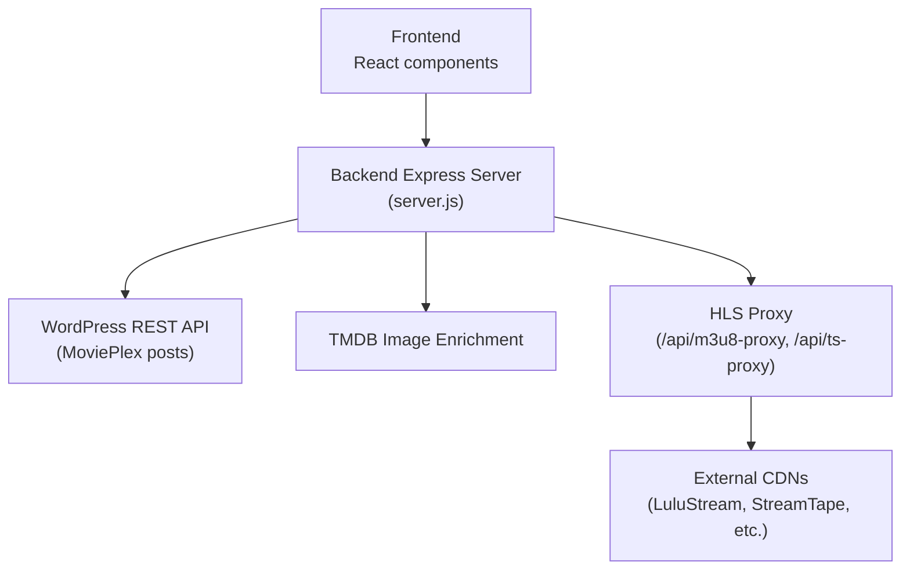
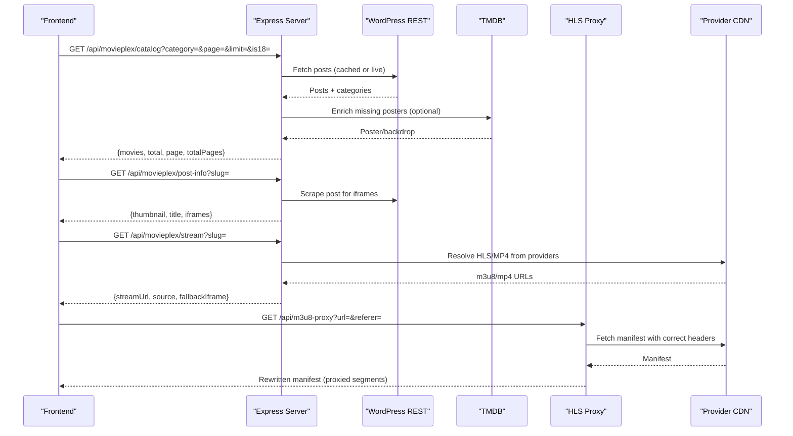
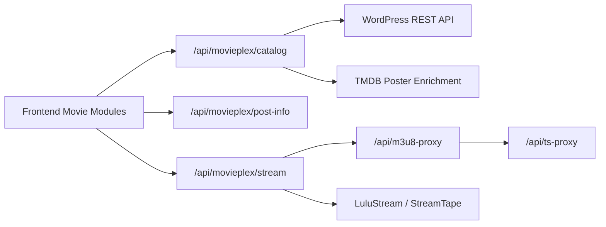

# Movie APIs

<cite>
**Referenced Files in This Document**
- [server.js](file://server.js)
- [movieApi.js](file://src/features/movie/api/movieApi.js)
- [MovieHomeView.jsx](file://src/features/movie/components/MovieHomeView.jsx)
- [MovieDetailView.jsx](file://src/features/movie/components/MovieDetailView.jsx)
- [MoviePlexPlayerView.jsx](file://src/features/movie/components/MoviePlexPlayerView.jsx)
- [MovieCard.jsx](file://src/features/movie/components/MovieCard.jsx)
</cite>

## Table of Contents
1. Introduction
2. Project Structure
3. Core Components
4. Architecture Overview
5. Detailed Component Analysis
6. Dependency Analysis
7. Performance Considerations
8. Troubleshooting Guide
9. Conclusion

## Introduction
This document provides detailed API documentation for movie content discovery and streaming endpoints exposed by the backend server and consumed by the frontend. It covers:
- Catalog browsing (home, categories, pagination, 18+ filtering)
- Movie search
- Movie details retrieval
- Streaming URL resolution with multi-provider fallback
- HLS proxying for CORS and protected streams
- Request parameters and response schemas for each endpoint

The goal is to help developers integrate with the movie features reliably, including how quality options are surfaced and how provider fallbacks work when sources fail.

## Project Structure
The movie feature spans a small set of backend routes and frontend modules:
- Backend routes under server.js expose /api/movieplex/* endpoints for catalog, post info, and stream resolution.
- Frontend modules call these endpoints via a thin client wrapper and render UI for browsing and playback.

**Diagram sources**
- [server.js:3402-3512](file://server.js#L3402-L3512)
- [server.js:263-393](file://server.js#L263-L393)

**Section sources**
- [server.js:3402-3512](file://server.js#L3402-L3512)
- [movieApi.js:1-31](file://src/features/movie/api/movieApi.js#L1-L31)

## Core Components
- Catalog Browsing: GET /api/movieplex/catalog
  - Purpose: Paginated list of movies with optional category filter and 18+ toggle.
  - Query parameters:
    - page: integer, default 1
    - limit: integer, default 40, max 100
    - category: integer category ID (e.g., 29 trending, 17 hindi dubbed, 10 bollywood, 19 hollywood, 33 web series, 6 action, 26 short film, 28 thriller, 24 romance, 21 18+)
    - is18: string "true" to include or restrict 18+ items
  - Response fields:
    - movies: array of movie objects with id, title, slug, date, thumbnail/coverImage/bannerImage, rating, categories (names), is18Plus flag
    - total: number of matching items
    - page: current page
    - totalPages: computed from total and limit
    - cached: boolean indicating if served from cache
- Post Info: GET /api/movieplex/post-info
  - Purpose: Retrieve metadata and available embed sources for a specific movie by slug.
  - Query parameters:
    - slug: string (required)
  - Response fields:
    - thumbnail: string URL (poster image)
    - title: string
    - iframes: array of embed URLs used for streaming
- Home Aggregation: GET /api/movies/home
  - Purpose: Returns curated rows (trending, hot, web series, hindi dubbed, bollywood, hollywood, action, short film, thriller, romance).
  - Response fields:
    - featured: object
    - movieplex: object containing arrays per category
- Search: GET /api/movieplex/search
  - Purpose: Search movies by query string.
  - Query parameters:
    - q: string (search term)
  - Response: array of movie results (used by frontend; exact shape depends on implementation)

Examples of usage from the frontend:
- Catalog page with category and 18+ filter
- Post info fetch for poster enrichment
- Stream resolution for playback

**Section sources**
- [server.js:3402-3476](file://server.js#L3402-L3476)
- [server.js:3490-3508](file://server.js#L3490-L3508)
- [server.js:3515-3599](file://server.js#L3515-L3599)
- [movieApi.js:5-28](file://src/features/movie/api/movieApi.js#L5-L28)
- [MovieHomeView.jsx:177-229](file://src/features/movie/components/MovieHomeView.jsx#L177-L229)
- [MovieDetailView.jsx:41-52](file://src/features/movie/components/MovieDetailView.jsx#L41-L52)
- [MovieCard.jsx:15-26](file://src/features/movie/components/MovieCard.jsx#L15-L26)

## Architecture Overview
The movie system uses a WordPress-based content source (MoviePlex) enriched with TMDB images and provides streaming via external providers. The backend normalizes requests, caches data, enriches posters, and proxies HLS streams to bypass CORS and handle protected segments.

**Diagram sources**
- [server.js:3402-3476](file://server.js#L3402-L3476)
- [server.js:3490-3508](file://server.js#L3490-L3508)
- [server.js:3478-3488](file://server.js#L3478-L3488)
- [server.js:263-393](file://server.js#L263-L393)

## Detailed Component Analysis

### Catalog Browsing Endpoint
- Endpoint: GET /api/movieplex/catalog
- Behavior:
  - Serves from an in-memory cache when available; otherwise queries WordPress REST API.
  - Supports category filtering by numeric ID and 18+ toggling via is18=true.
  - Applies live fallback to WordPress if category filter yields zero results from cache.
  - Enriches missing thumbnails using TMDB based on cleaned titles.
  - Adds human-readable category names to each item.
- Parameters:
  - page: integer (default 1)
  - limit: integer (default 40, capped at 100)
  - category: integer category ID
  - is18: string "true" to include or restrict 18+ items
- Response schema:
  - movies: array of objects with fields such as id, title, slug, date, thumbnail/coverImage/bannerImage, rating, categories (array of strings), is18Plus (boolean)
  - total: integer
  - page: integer
  - totalPages: integer
  - cached: boolean
  - note: optional string indicating live-fallback behavior

Example flows:
- Browse trending: category=29, page=1, limit=36
- Browse 18+: category=21 or is18=true
- Load more: increment page and append movies

**Section sources**
- [server.js:3402-3476](file://server.js#L3402-L3476)

### Post Info Endpoint
- Endpoint: GET /api/movieplex/post-info
- Behavior:
  - Scrapes the movie post to extract iframes and thumbnail.
  - Attempts to derive a thumbnail from LuluStream video IDs; falls back to TMDB poster by cleaned title if needed.
- Parameters:
  - slug: string (required)
- Response schema:
  - thumbnail: string URL
  - title: string
  - iframes: array of embed URLs

Usage examples:
- On-demand poster enrichment when card images fail
- Preparing player view with available embed sources

**Section sources**
- [server.js:3490-3508](file://server.js#L3490-L3508)
- [MovieCard.jsx:15-26](file://src/features/movie/components/MovieCard.jsx#L15-L26)

### Stream Resolution Endpoint
- Endpoint: GET /api/movieplex/stream
- Behavior:
  - Resolves a playable stream URL for a given movie slug.
  - Multi-provider fallback:
    - Primary: LuluStream HLS extraction (returns proxied HLS URL)
    - Secondary: StreamTape direct link extraction
    - Fallback: returns fallbackIframe if HLS extraction fails
  - Wraps HLS manifests through /api/m3u8-proxy to ensure CORS compliance and segment proxying.
- Parameters:
  - slug: string (required)
- Response schema:
  - streamUrl: string (proxied HLS or direct MP4)
  - source: string ("lulustream", "streamtape", or null)
  - thumbnail: string URL
  - title: string
  - fallbackIframe: string embed URL (if available)
  - error: string (when HLS extraction fails)

Quality selection:
- Quality is typically controlled by the HLS playlist variants provided by the upstream provider. The backend proxies the manifest so the browser can select qualities supported by the player.

Example flow:
- Client requests stream for a slug
- Server tries LuluStream HLS; if successful, returns proxied HLS URL
- If LuluStream fails, tries StreamTape
- If both fail, returns fallback iframe for embedded playback

**Section sources**
- [server.js:3478-3488](file://server.js#L3478-L3488)
- [server.js:3369-3400](file://server.js#L3369-L3400)

### HLS Proxy Endpoints
- Endpoints:
  - GET /api/m3u8-proxy?url=&referer=
  - GET /api/ts-proxy?url=&referer=
- Behavior:
  - Proxies HLS master and sub-playlists, rewriting internal URLs to go through the backend.
  - Forwards Range headers to support byte-range streaming for fast startup.
  - Handles protected hosts by setting appropriate headers and referers.
  - Unwraps nested proxy URLs to avoid loops.
- Use cases:
  - Ensures CORS-friendly playback across domains
  - Enables reliable segment fetching behind restrictive CDNs

**Section sources**
- [server.js:263-393](file://server.js#L263-L393)

### Home Aggregation Endpoint
- Endpoint: GET /api/movies/home
- Behavior:
  - Aggregates multiple categories into a single response for the homepage.
  - Uses cached MoviePlex posts when available; otherwise builds from WordPress REST API.
  - Enriches top row items with TMDB posters if missing.
- Response fields:
  - featured: object
  - movieplex: object with arrays for trending, hot, webSeries, hindiDubbed, bollywood, hollywood, action, shortFilm, thriller, romance

**Section sources**
- [server.js:3515-3599](file://server.js#L3515-L3599)

### Frontend Integration Points
- Catalog browsing:
  - Builds query params for category and is18, paginates by appending results
- Post info:
  - Used to fetch poster when card image fails
- Stream playback:
  - Calls stream endpoint and renders HLS via VideoPlayer; switches to fallback iframe when needed

**Section sources**
- [MovieHomeView.jsx:177-229](file://src/features/movie/components/MovieHomeView.jsx#L177-L229)
- [MovieDetailView.jsx:41-52](file://src/features/movie/components/MovieDetailView.jsx#L41-L52)
- [MoviePlexPlayerView.jsx:41-60](file://src/features/movie/components/MoviePlexPlayerView.jsx#L41-L60)
- [MovieCard.jsx:15-26](file://src/features/movie/components/MovieCard.jsx#L15-L26)

## Dependency Analysis

**Diagram sources**
- [server.js:3402-3476](file://server.js#L3402-L3476)
- [server.js:3490-3508](file://server.js#L3490-L3508)
- [server.js:3478-3488](file://server.js#L3478-L3488)
- [server.js:263-393](file://server.js#L263-L393)

**Section sources**
- [server.js:3402-3476](file://server.js#L3402-L3476)
- [server.js:3478-3488](file://server.js#L3478-L3488)
- [server.js:263-393](file://server.js#L263-L393)

## Performance Considerations
- Catalog caching:
  - In-memory cache reduces repeated WordPress calls; live fallback ensures availability when cache misses occur.
- Poster enrichment:
  - TMDB enrichment runs only for missing thumbnails, minimizing external calls.
- HLS streaming:
  - Range header forwarding enables efficient segment loading.
  - Referer and header handling improve success rates with protected CDNs.
- Pagination:
  - Default limit is 40, up to 100; adjust based on UI needs to balance load time and UX.

[No sources needed since this section provides general guidance]

## Troubleshooting Guide
Common issues and resolutions:
- Missing slug errors:
  - Ensure slug parameter is present in /api/movieplex/post-info and /api/movieplex/stream.
- No video sources found:
  - Check that the movie post contains valid iframes; verify scraping logic and provider availability.
- HLS playback failures:
  - Verify /api/m3u8-proxy and /api/ts-proxy are reachable and correctly rewriting URLs.
  - Confirm referer and headers are set appropriately for protected hosts.
- Category filter returning empty:
  - Use live fallback path; check WordPress REST API connectivity and category mapping.

Error responses:
- 400 Bad Request: Missing required parameters (e.g., slug)
- 502 Bad Gateway: Upstream provider or scraping failure
- 500 Internal Server Error: Unexpected server-side errors

**Section sources**
- [server.js:3478-3488](file://server.js#L3478-L3488)
- [server.js:3490-3508](file://server.js#L3490-L3508)
- [server.js:263-393](file://server.js#L263-L393)

## Conclusion
The Movie APIs provide a robust pipeline for discovering and streaming movies:
- Catalog browsing supports flexible filtering and pagination
- Post info delivers rich metadata and embed sources
- Stream resolution implements a resilient multi-provider fallback with HLS proxying
- Frontend integration points demonstrate practical usage patterns

Developers should leverage the catalog and post-info endpoints for discovery and detail views, then resolve streams via the stream endpoint and rely on the HLS proxies for reliable playback across diverse providers.