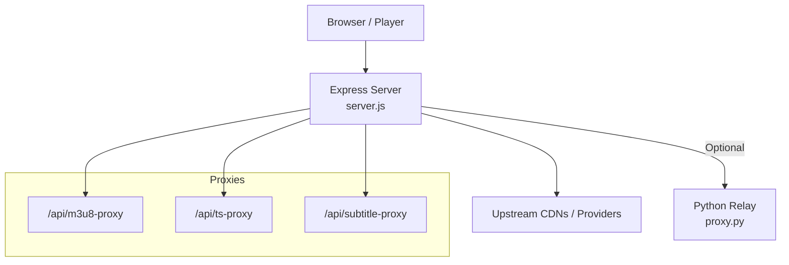
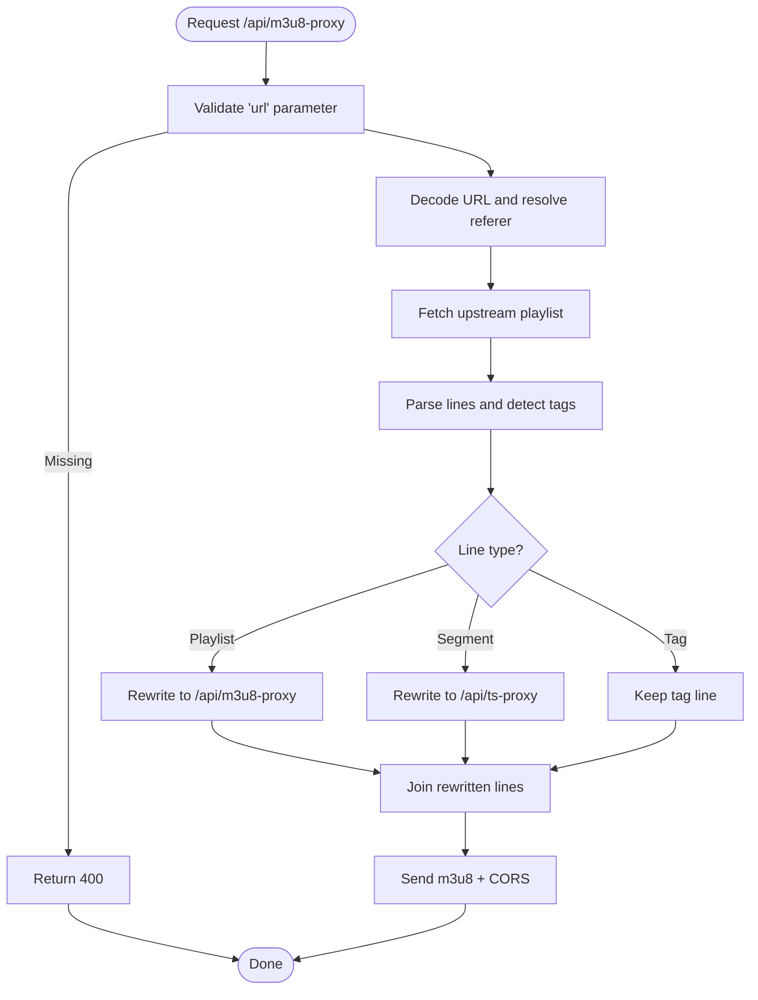
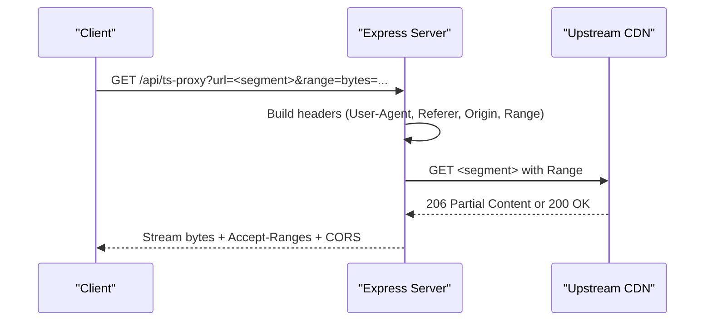
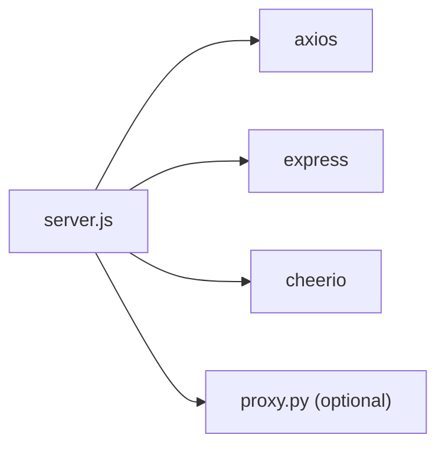

# Streaming Proxies

<cite>
**Referenced Files in This Document**
- [server.js](file://server.js)
- [proxy.py](file://proxy.py)
- [api/index.js](file://api/index.js)
- [api/runtime-config.js](file://api/runtime-config.js)
</cite>

## Table of Contents
1. [Introduction](#introduction)
2. [Project Structure](#project-structure)
3. [Core Components](#core-components)
4. [Architecture Overview](#architecture-overview)
5. [Detailed Component Analysis](#detailed-component-analysis)
6. [Dependency Analysis](#dependency-analysis)
7. [Performance Considerations](#performance-considerations)
8. [Troubleshooting Guide](#troubleshooting-guide)
9. [Conclusion](#conclusion)
10. [Appendices](#appendices)

## Introduction
This document provides comprehensive API documentation for the streaming proxy endpoints that enable HLS video streaming and media segment delivery. It covers:
- M3U8 manifest proxy for playlist processing, URL rewriting, subtitle track handling, and quality variant management
- TS segment proxy for raw video/audio segment delivery with Range header support for efficient streaming
- Subtitle proxy for VTT file delivery with CORS bypass
- Proxy architecture including referer handling, header forwarding, and CDN compatibility
- Usage examples for adaptive bitrate streaming, subtitle loading, and cross-origin media access
- Error handling, caching strategies, and performance optimization techniques used by the proxy layer

## Project Structure
The streaming proxies are implemented in a Node/Express server with an optional Python relay for specific upstreams. The key files are:
- server.js: Express application defining all streaming proxy routes and helper functions
- proxy.py: Lightweight Python HTTP relay for a specific upstream host
- api/index.js: Exposes the Express app for runtime environments
- api/runtime-config.js: Serves runtime configuration to clients



**Diagram sources**
- [server.js:235-393](file://server.js#L235-L393)
- [proxy.py:1-36](file://proxy.py#L1-L36)

**Section sources**
- [server.js:1-30](file://server.js#L1-L30)
- [proxy.py:1-36](file://proxy.py#L1-L36)
- [api/index.js:1-4](file://api/index.js#L1-L4)
- [api/runtime-config.js:1-25](file://api/runtime-config.js#L1-L25)

## Core Components
- M3U8 Manifest Proxy (/api/m3u8-proxy): Fetches HLS playlists from upstream providers, rewrites URLs to route through the backend, handles nested playlists, quality variants, and subtitle tracks, and returns a browser-friendly manifest with CORS enabled.
- TS Segment Proxy (/api/ts-proxy): Streams raw segments (video/audio) while preserving Range requests for efficient playback and passing through relevant headers from upstream CDNs.
- Subtitle Proxy (/api/subtitle-proxy): Proxies VTT subtitle files with CORS headers and caching to allow direct use in HTML <track> elements.

**Section sources**
- [server.js:235-393](file://server.js#L235-L393)

## Architecture Overview
The proxy layer sits between the client and upstream providers to:
- Bypass hotlink protection via Referer/Origin manipulation
- Rewrite relative and absolute URLs in manifests to go through the backend
- Preserve byte-range streaming for fast startup and seeking
- Provide CORS headers for cross-origin playback
- Handle provider-specific requirements (e.g., StreamIndia, NetMirror, LuluStream)

```mermaid
sequenceDiagram
participant C as "Client"
participant E as "Express Server"
participant U as "Upstream Provider"
C->>E : GET /api/m3u8-proxy?url=<m3u8>&referer=<ref>
E->>U : GET <m3u8> with Referer/Origin/User-Agent
U-->>E : Playlist text
E->>E : Rewrite URLs (playlists -> /api/m3u8-proxy; segments -> /api/ts-proxy)
E-->>C : application/vnd.apple.mpegurl + CORS
C->>E : GET /api/ts-proxy?url=<segment>&referer=<ref>
E->>U : GET <segment> with Range if present
U-->>E : 206 Partial Content or 200 OK
E-->>C : video/MP2T + Accept-Ranges + CORS
```

**Diagram sources**
- [server.js:263-345](file://server.js#L263-L345)
- [server.js:354-393](file://server.js#L354-L393)

## Detailed Component Analysis

### M3U8 Manifest Proxy (/api/m3u8-proxy)
Purpose:
- Fetch HLS master or variant playlists from upstream providers
- Rewrite all resource URLs so the browser only talks to the backend
- Support nested playlists, audio/video tracks, and quality variants
- Provide CORS headers for cross-origin playback

Key behaviors:
- Input parameters: url (required), referer (optional)
- Unwraps previously proxied URLs to avoid loops
- Resolves relative URLs and fixes malformed URIs
- Rewrites:
  - Sub-playlists (.m3u8) back to /api/m3u8-proxy
  - Segments (.ts, .aac, etc.) to /api/ts-proxy
  - Audio track URIs where applicable
- Sets Content-Type to application/vnd.apple.mpegurl and Access-Control-Allow-Origin to *

Error handling:
- Returns 400 if url is missing
- Returns 502 on upstream errors with error message

Usage example:
- Use the returned URL as the source for your HLS player instead of the original provider URL.

**Section sources**
- [server.js:263-345](file://server.js#L263-L345)

#### M3U8 Processing Flow


**Diagram sources**
- [server.js:263-345](file://server.js#L263-L345)

### TS Segment Proxy (/api/ts-proxy)
Purpose:
- Stream raw video/audio segments from upstream providers
- Forward Range headers to enable byte-range playback for instant startup and seeking
- Pass through relevant headers (Accept-Ranges, Content-Length, Content-Range, Content-Encoding)
- Provide CORS headers for cross-origin playback

Key behaviors:
- Input parameters: url (required), referer (optional)
- Builds request headers with browser-like User-Agent, Referer, Origin, and additional headers for protected HLS when needed
- Forwards Range header if present in the client request
- Streams response directly to the client without buffering

Error handling:
- Returns 400 if url is missing
- Returns 502 on upstream errors with error message

Usage example:
- Use the returned URL for any segment referenced by the rewritten M3U8 manifest.

**Section sources**
- [server.js:354-393](file://server.js#L354-L393)

#### TS Streaming Flow


**Diagram sources**
- [server.js:354-393](file://server.js#L354-L393)

### Subtitle Proxy (/api/subtitle-proxy)
Purpose:
- Proxy VTT subtitle files from external CDNs
- Add CORS headers so browsers can load subtitles via <track>
- Cache responses for improved performance

Key behaviors:
- Input parameter: url (required)
- Fetches VTT content with appropriate headers
- Sets Content-Type to text/vtt; charset=utf-8
- Adds Access-Control-Allow-Origin: * and Cache-Control: public, max-age=3600

Error handling:
- Returns 400 if url is missing
- Returns 502 on upstream errors with error message

Usage example:
- Point your <track src="..."> to this endpoint using the original VTT URL encoded in the query string.

**Section sources**
- [server.js:235-256](file://server.js#L235-L256)

### Referer Handling and Header Forwarding
- streamProxyHeaders constructs consistent headers for upstream requests:
  - Browser-like User-Agent
  - Accept: */*
  - Referer and Origin derived from the provided referer
  - Additional Sec-Fetch-* headers for protected HLS targets
- streamProxyReferers generates fallback referers for providers like StreamIndia to improve success rates
- fetchStreamProxyTarget iterates over candidate referers and retries on certain status codes for protected streams

These mechanisms help bypass hotlink protections and WAF restrictions across multiple providers.

**Section sources**
- [server.js:74-148](file://server.js#L74-L148)

### CDN Compatibility and Special Cases
- Unwrapping nested proxy URLs prevents infinite loops when cached responses contain already-proxied links
- Skipping known broken relays (e.g., proxy.streamindia.co.in) in favor of direct CDN URLs
- Fixing malformed triple-slash URIs from some providers
- Handling NetMirror token-based cookies when required

**Section sources**
- [server.js:41-70](file://server.js#L41-L70)
- [server.js:281-296](file://server.js#L281-L296)

## Dependency Analysis
The streaming proxies depend on:
- Express for routing and response handling
- Axios for HTTP requests with custom headers and timeouts
- cheerio for parsing provider pages (used elsewhere in the server)
- Optional Python relay for specific upstreams



**Diagram sources**
- [server.js:1-10](file://server.js#L1-L10)
- [proxy.py:1-36](file://proxy.py#L1-L36)

**Section sources**
- [server.js:1-10](file://server.js#L1-L10)
- [proxy.py:1-36](file://proxy.py#L1-L36)

## Performance Considerations
- Byte-range streaming: The TS proxy forwards Range headers to minimize bandwidth and enable instant startup and seeking.
- Caching:
  - Subtitle proxy caches VTT responses for 1 hour to reduce repeated downloads.
  - Other in-memory caches exist in the server for metadata and catalog data (not part of the streaming proxies).
- Timeouts and redirects:
  - Axios defaults include reasonable timeouts and redirect limits to avoid hanging requests.
- Header minimization:
  - Avoid sending unnecessary headers (e.g., Accept-Language) that may trigger WAF blocks.
- Streaming mode:
  - TS proxy streams responses directly without buffering to reduce memory usage and latency.

[No sources needed since this section provides general guidance]

## Troubleshooting Guide
Common issues and resolutions:
- Missing url parameter:
  - All three proxies return 400 when url is not provided. Ensure you encode the target URL correctly in the query string.
- 502 Bad Gateway:
  - Indicates upstream failure. Check logs for detailed error messages. Verify referer and origin values for protected providers.
- CORS errors:
  - Ensure you are using the backend proxy endpoints rather than calling upstream URLs directly. The proxies set Access-Control-Allow-Origin: *.
- Playback stalls or slow startup:
  - Confirm Range headers are being forwarded. The TS proxy preserves them; ensure your client supports range requests.
- Nested proxy loops:
  - The M3U8 proxy unwraps previously proxied URLs to prevent loops. If you see unexpected behavior, verify your client is not double-wrapping URLs.

**Section sources**
- [server.js:235-256](file://server.js#L235-L256)
- [server.js:263-345](file://server.js#L263-L345)
- [server.js:354-393](file://server.js#L354-L393)

## Conclusion
The streaming proxy layer provides robust HLS playback by rewriting manifests, forwarding critical headers, supporting byte-range streaming, and enabling cross-origin access. It abstracts provider-specific protections and ensures reliable delivery of video segments and subtitles. Use the documented endpoints to integrate adaptive bitrate streaming, subtitle loading, and cross-origin media access into your application.

[No sources needed since this section summarizes without analyzing specific files]

## Appendices

### API Reference

- GET /api/m3u8-proxy
  - Query parameters:
    - url: Required. Base64 or percent-encoded upstream playlist URL.
    - referer: Optional. Referer to send to upstream; defaults to origin of the playlist URL.
  - Response:
    - Content-Type: application/vnd.apple.mpegurl
    - Access-Control-Allow-Origin: *
  - Behavior:
    - Rewrites nested playlists to /api/m3u8-proxy
    - Rewrites segments to /api/ts-proxy
    - Handles audio track URIs and malformed paths
  - Errors:
    - 400 if url is missing
    - 502 on upstream errors

- GET /api/ts-proxy
  - Query parameters:
    - url: Required. Percent-encoded segment URL.
    - referer: Optional. Referer to send to upstream.
  - Request headers:
    - Range: Optional. Forwarded to upstream for partial content retrieval.
  - Response:
    - Content-Type: video/MP2T (or upstream content-type)
    - Accept-Ranges: bytes (if supported)
    - Access-Control-Allow-Origin: *
  - Errors:
    - 400 if url is missing
    - 502 on upstream errors

- GET /api/subtitle-proxy
  - Query parameters:
    - url: Required. Percent-encoded VTT URL.
  - Response:
    - Content-Type: text/vtt; charset=utf-8
    - Access-Control-Allow-Origin: *
    - Cache-Control: public, max-age=3600
  - Errors:
    - 400 if url is missing
    - 502 on upstream errors

**Section sources**
- [server.js:235-256](file://server.js#L235-L256)
- [server.js:263-345](file://server.js#L263-L345)
- [server.js:354-393](file://server.js#L354-L393)

### Example Usage Scenarios

- Adaptive bitrate streaming:
  - Obtain a master playlist URL from your provider
  - Call /api/m3u8-proxy with the playlist URL
  - Use the returned URL as the source in your HLS player
  - The proxy will rewrite all segment URLs to /api/ts-proxy automatically

- Subtitle loading:
  - Get the VTT URL from the player or manifest
  - Call /api/subtitle-proxy with the VTT URL
  - Set the returned URL as the src attribute of a <track> element

- Cross-origin media access:
  - Always use the backend proxy endpoints instead of calling upstream URLs directly
  - The proxies add CORS headers to allow playback from any origin

[No sources needed since this section provides general guidance]