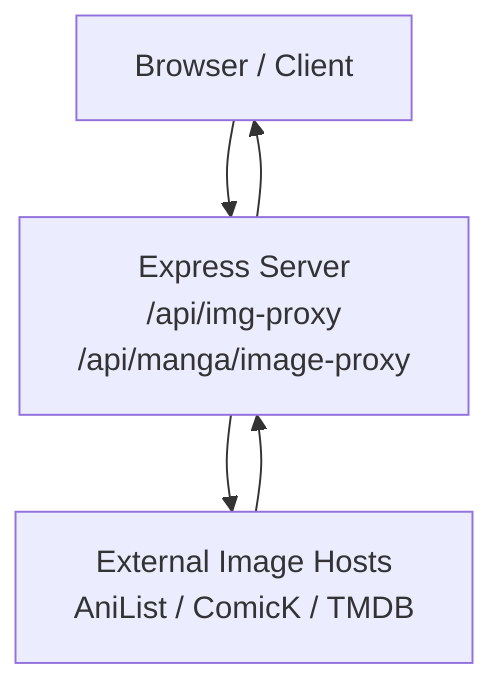
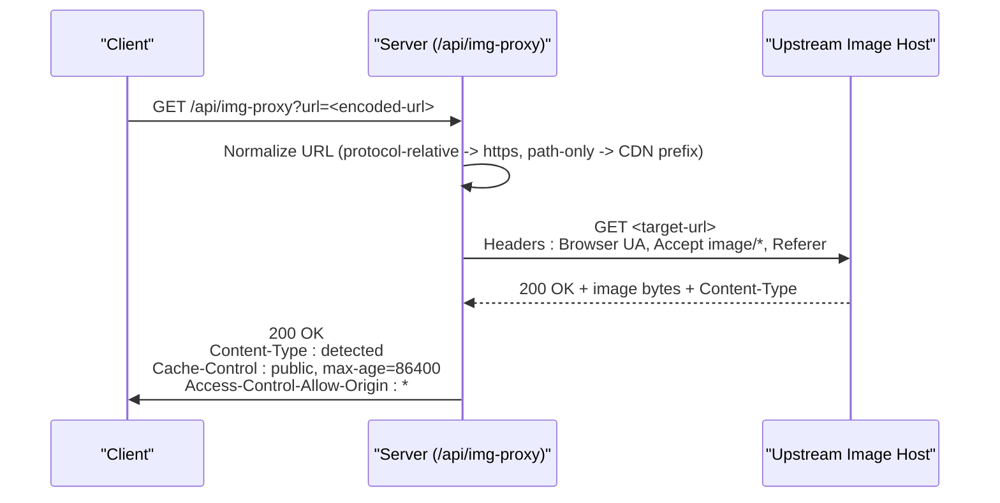
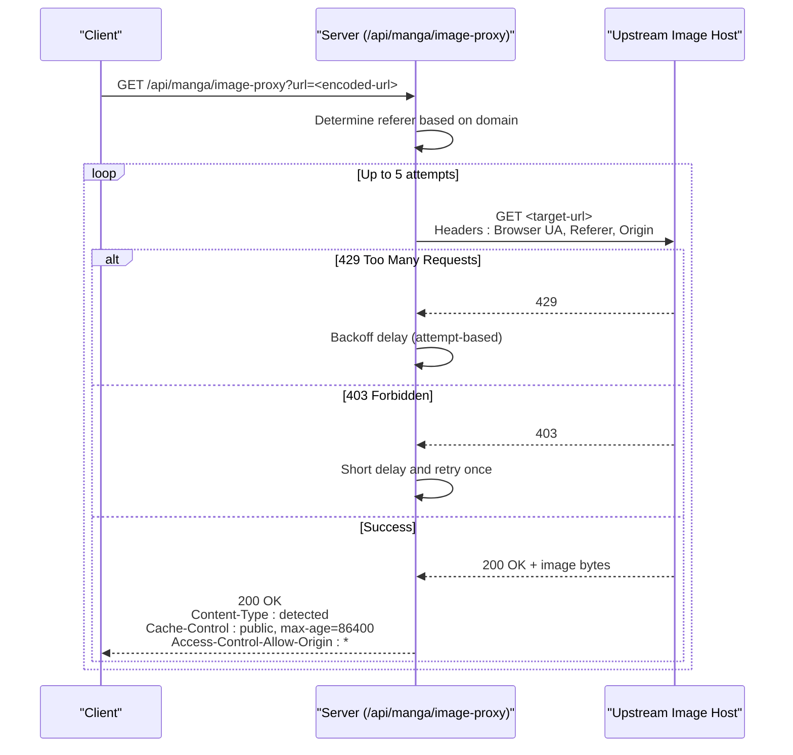
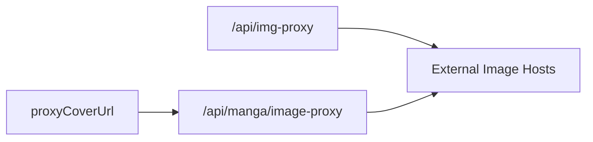

# Image Proxies

<cite>
**Referenced Files in This Document**
- [server.js](file://server.js)
</cite>

## Table of Contents
1. [Introduction](#introduction)
2. [Project Structure](#project-structure)
3. [Core Components](#core-components)
4. [Architecture Overview](#architecture-overview)
5. [Detailed Component Analysis](#detailed-component-analysis)
6. [Dependency Analysis](#dependency-analysis)
7. [Performance Considerations](#performance-considerations)
8. [Troubleshooting Guide](#troubleshooting-guide)
9. [Conclusion](#conclusion)

## Introduction
This document describes the image proxy endpoints that bypass CORS and hotlink restrictions for loading images from external sources such as AniList, ComicK, and TMDB. It covers:
- Endpoints: /api/img-proxy and /api/manga/image-proxy
- URL transformation rules (including protocol-relative and path-only URLs)
- Content type detection and response headers
- Caching behavior
- Referer handling to satisfy source server protections
- Error responses when images are unavailable or blocked

These proxies allow client applications to load images without being blocked by cross-origin policies or hotlink protection on upstream providers.

## Project Structure
The image proxy functionality is implemented in a single Express server file. Two routes share logic to fetch remote images and return them with appropriate headers. A helper function builds proxied URLs for manga covers used across catalog endpoints.

**Diagram sources**
- [server.js:152-199](file://server.js#L152-L199)
- [server.js:2878-2930](file://server.js#L2878-L2930)
- [server.js:2205-2216](file://server.js#L2205-L2216)

**Section sources**
- [server.js:152-199](file://server.js#L152-L199)
- [server.js:2205-2216](file://server.js#L2205-L2216)
- [server.js:2878-2930](file://server.js#L2878-L2930)

## Core Components
- /api/img-proxy: Generic image proxy that normalizes input URLs, sets a browser-like User-Agent and Referer, detects content type, and returns cached images with CORS enabled.
- /api/manga/image-proxy: Manga-focused image proxy with stronger referer enforcement and retry/backoff logic for rate-limited or restricted sources.
- proxyCoverUrl: Helper that converts raw cover URLs into proxied URLs using /api/manga/image-proxy.

Key behaviors:
- URL normalization: Protocol-relative URLs become https; path-only URLs are prefixed with a known CDN base before proxying.
- Referer selection: For ComicK domains, a site-specific referer is used; otherwise, the origin of the target URL is derived and used.
- Content type detection: The upstream Content-Type is forwarded unless it indicates HTML or octet-stream, in which case a default image type is used.
- Caching: Responses include a public cache header for one day to reduce repeated requests.
- CORS: Access-Control-Allow-Origin is set to allow cross-origin access.

**Section sources**
- [server.js:152-199](file://server.js#L152-L199)
- [server.js:2205-2216](file://server.js#L2205-L2216)
- [server.js:2878-2930](file://server.js#L2878-L2930)

## Architecture Overview
The image proxy flow involves receiving a request with a target image URL, transforming it if necessary, fetching the image from the upstream host with appropriate headers, and returning the bytes to the client with correct content type and caching headers.

**Diagram sources**
- [server.js:152-199](file://server.js#L152-L199)

For manga images, the flow includes retries and backoff when encountering rate limiting or referer-related blocks.

**Diagram sources**
- [server.js:2878-2930](file://server.js#L2878-L2930)

## Detailed Component Analysis

### Endpoint: /api/img-proxy
- Purpose: Proxy images from arbitrary external hosts while bypassing CORS and hotlink checks.
- Request parameters:
  - url: Required. The absolute or relative image URL to fetch.
- URL transformation:
  - If the URL starts with //, it becomes https.
  - If the URL does not start with http(s), and is not protocol-relative, it is prefixed with a known CDN base before proxying.
- Headers sent to upstream:
  - User-Agent set to a modern browser string.
  - Accept set to prefer image formats.
  - Referer set to either a site-specific value for ComicK domains or derived from the target URL’s origin.
- Response:
  - Content-Type inferred from upstream; defaults applied if upstream reports non-image types.
  - Cache-Control set to public with a one-day max age.
  - Access-Control-Allow-Origin set to allow cross-origin usage.
- Errors:
  - Missing url parameter returns a 400 error.
  - Fetch failures log a warning; if the target URL is absolute, the server redirects to the original URL; otherwise, returns a 404 with a message.

Example usage patterns:
- Absolute URL: /api/img-proxy?url=https://example.com/image.png
- Protocol-relative: /api/img-proxy=url=//example.com/image.png
- Path-only: /api/img-proxy=url=/path/to/image.jpg (will be prefixed with a CDN base)

**Section sources**
- [server.js:152-199](file://server.js#L152-L199)

### Endpoint: /api/manga/image-proxy
- Purpose: Manga-focused image proxy with robust handling for rate limits and referer requirements.
- Request parameters:
  - url: Required. The absolute or relative image URL to fetch.
- URL transformation:
  - Similar to the generic proxy; supports protocol-relative and path-only URLs.
- Referer strategy:
  - For comicknew.pictures, uses a specific referer.
  - For comick.pictures, uses another referer.
  - Otherwise, falls back to a default referer suitable for ComicK domains.
- Retry and backoff:
  - Retries up to five times.
  - On 429 (rate limit), applies an attempt-based backoff delay.
  - On 403 (forbidden), waits briefly and retries once to account for missing/wrong referer.
- Response:
  - Content-Type forwarded from upstream; defaults to webp if missing.
  - Cache-Control set to public with a one-day max age.
  - Access-Control-Allow-Origin set to allow cross-origin usage.
- Errors:
  - Missing url parameter returns a 400 error.
  - Persistent errors return status codes from upstream or a generic 500 with a message.

Example usage patterns:
- Absolute URL: /api/manga/image-proxy?url=https://comick.pictures/path/image.webp
- Path-only: /api/manga/image-proxy=url=/path/image.jpg (will be prefixed with a CDN base)

**Section sources**
- [server.js:2878-2930](file://server.js#L2878-L2930)

### Helper: proxyCoverUrl
- Purpose: Convert raw cover URLs into proxied URLs using /api/manga/image-proxy.
- Behavior:
  - Normalizes protocol-relative and path-only URLs similarly to the manga proxy.
  - Returns a full proxied URL using the current server’s public host.
- Usage:
  - Used throughout manga catalog endpoints to ensure all cover images go through the proxy.

**Section sources**
- [server.js:2205-2216](file://server.js#L2205-L2216)

### URL Transformation Rules
- Protocol-relative URLs (starting with //) are converted to https.
- Path-only URLs (not starting with http(s)) are prefixed with a known CDN base before proxying.
- Absolute URLs are used as-is.

These rules ensure consistent handling regardless of how the upstream provider formats image paths.

**Section sources**
- [server.js:157-164](file://server.js#L157-L164)
- [server.js:2205-2216](file://server.js#L2205-L2216)

### Content Type Detection
- The proxy forwards the upstream Content-Type when available.
- If the upstream reports application/octet-stream or HTML content, the proxy sets a default image content type to avoid misinterpretation.
- For the manga proxy, a default of webp is used if no content type is detected.

**Section sources**
- [server.js:180-183](file://server.js#L180-L183)
- [server.js:2905-2906](file://server.js#L2905-L2906)

### Caching Headers
- Both proxies set Cache-Control to public with a one-day max age to encourage browser and intermediate caching.
- This reduces repeated upstream requests and improves performance for frequently accessed images.

**Section sources**
- [server.js:186-187](file://server.js#L186-L187)
- [server.js:2907-2908](file://server.js#L2907-L2908)

### Referer Handling
- For ComicK domains, a site-specific referer is used to satisfy hotlink protection.
- For other domains, the referer is derived from the target URL’s origin.
- The manga proxy also sets an Origin header to further satisfy strict upstream checks.

**Section sources**
- [server.js:167-168](file://server.js#L167-L168)
- [server.js:2887-2889](file://server.js#L2887-L2889)
- [server.js:2899-2900](file://server.js#L2899-L2900)

### Error Responses
- Missing url parameter:
  - /api/img-proxy returns a 400 error with a message.
  - /api/manga/image-proxy returns a 400 error with a message.
- Fetch failures:
  - /api/img-proxy logs a warning; if the target URL is absolute, it redirects to the original URL; otherwise, returns a 404 with a message.
  - /api/manga/image-proxy returns the upstream status code when available, or a 500 with a generic message after exhausting retries.

**Section sources**
- [server.js:154-155](file://server.js#L154-L155)
- [server.js:189-195](file://server.js#L189-L195)
- [server.js:2880-2881](file://server.js#L2880-L2881)
- [server.js:2911-2929](file://server.js#L2911-L2929)

## Dependency Analysis
- The image proxies depend on HTTP client libraries to fetch upstream images with custom headers.
- They rely on URL parsing utilities to derive origins and normalize paths.
- Catalog endpoints use the manga proxy helper to generate proxied cover URLs, ensuring consistent image delivery.

**Diagram sources**
- [server.js:152-199](file://server.js#L152-L199)
- [server.js:2205-2216](file://server.js#L2205-L2216)
- [server.js:2878-2930](file://server.js#L2878-L2930)

**Section sources**
- [server.js:152-199](file://server.js#L152-L199)
- [server.js:2205-2216](file://server.js#L2205-L2216)
- [server.js:2878-2930](file://server.js#L2878-L2930)

## Performance Considerations
- Caching: One-day public caching reduces repeated upstream requests and improves load times.
- Retries and backoff: The manga proxy handles transient rate limits gracefully, minimizing client-side retries.
- Streaming: Images are returned as binary payloads directly, avoiding unnecessary transformations.
- Header optimization: Minimal headers are sent to upstream to reduce overhead while satisfying common protections.

[No sources needed since this section provides general guidance]

## Troubleshooting Guide
Common issues and resolutions:
- Missing url parameter: Ensure the url query parameter is present and properly encoded.
- Hotlink protection (403): The proxies set appropriate Referer and Origin headers; if still blocked, verify the target URL belongs to a supported domain or adjust the referer strategy accordingly.
- Rate limiting (429): The manga proxy automatically retries with backoff; consider reducing request frequency or implementing client-side caching.
- Invalid or unreachable upstream: The generic proxy may redirect to the original URL for absolute targets; otherwise, expect a 404 response.

**Section sources**
- [server.js:154-155](file://server.js#L154-L155)
- [server.js:189-195](file://server.js#L189-L195)
- [server.js:2880-2881](file://server.js#L2880-L2881)
- [server.js:2911-2929](file://server.js#L2911-L2929)

## Conclusion
The image proxy endpoints provide a reliable way to load images from external sources while bypassing CORS and hotlink restrictions. They handle URL normalization, content type detection, caching, and robust error handling. Use /api/img-proxy for general-purpose image proxying and /api/manga/image-proxy for manga-specific scenarios requiring stricter referer handling and retry logic. Always encode the url parameter and ensure your client respects caching headers for optimal performance.

[No sources needed since this section summarizes without analyzing specific files]