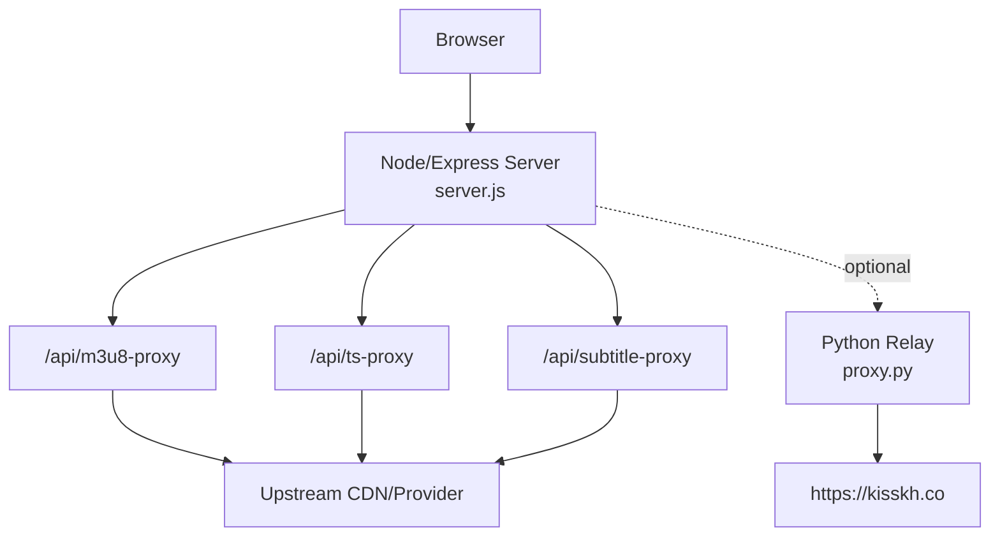
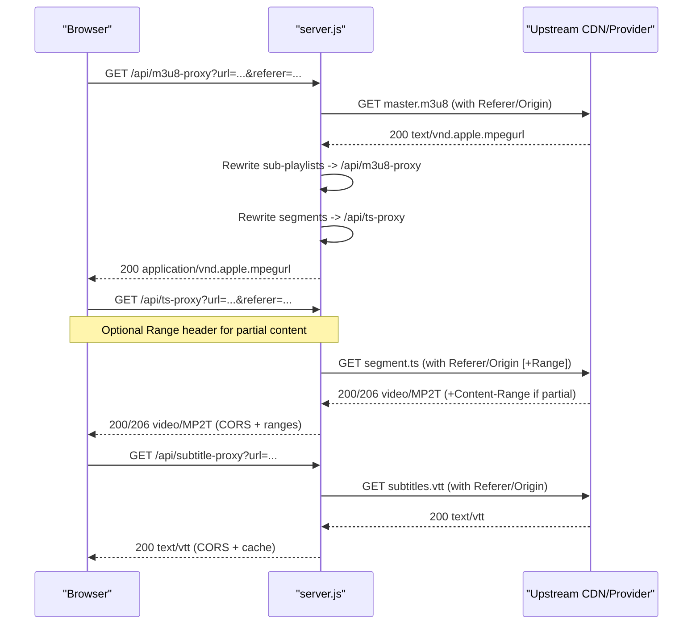
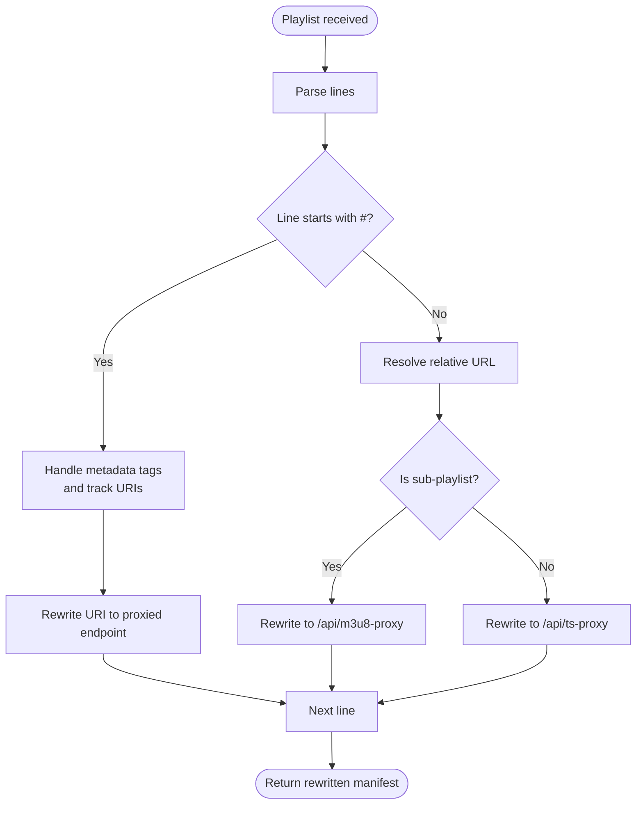
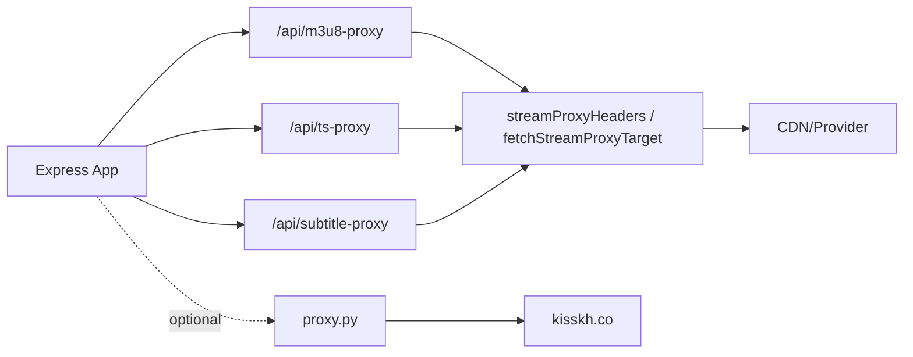

# Streaming Proxies

<cite>
**Referenced Files in This Document**
- [server.js](file://server.js)
- [proxy.py](file://proxy.py)
- [README.md](file://README.md)
</cite>

## Table of Contents
1. [Introduction](#introduction)
2. [Project Structure](#project-structure)
3. [Core Components](#core-components)
4. [Architecture Overview](#architecture-overview)
5. [Detailed Component Analysis](#detailed-component-analysis)
6. [Dependency Analysis](#dependency-analysis)
7. [Performance Considerations](#performance-considerations)
8. [Troubleshooting Guide](#troubleshooting-guide)
9. [Conclusion](#conclusion)

## Introduction
This document explains the streaming proxy endpoints that enable HLS playback, video segment fetching, and subtitle loading while bypassing CORS restrictions and protecting streams with referer validation. It covers:
- HLS manifest proxy: /api/m3u8-proxy
- Video segment proxy: /api/ts-proxy
- Subtitle proxy: /api/subtitle-proxy

It details how URLs are rewritten, how referers are validated and rotated, which streaming headers are forwarded or set, and how errors are handled. It also includes request/response examples, security considerations, rate limiting notes, and performance guidance such as range request handling and caching strategies.

## Project Structure
The streaming proxies are implemented in the Node/Express backend (server.js). A small Python relay (proxy.py) is available to route certain traffic through a residential IP when providers block datacenter IPs. The README documents deployment context and environment variables relevant to the proxies.

**Diagram sources**
- [server.js:235-393](file://server.js#L235-L393)
- [proxy.py:1-36](file://proxy.py#L1-L36)
- [README.md:10-15](file://README.md#L10-L15)

**Section sources**
- [server.js:235-393](file://server.js#L235-L393)
- [proxy.py:1-36](file://proxy.py#L1-L36)
- [README.md:10-15](file://README.md#L10-L15)

## Core Components
- HLS Manifest Proxy (/api/m3u8-proxy): Fetches an upstream .m3u8 playlist, rewrites all referenced sub-playlists and segments to proxied URLs, and returns a browser-friendly manifest via the backend’s public host.
- TS Segment Proxy (/api/ts-proxy): Streams raw media segments from upstream, forwarding Range requests for efficient seeking and startup.
- Subtitle Proxy (/api/subtitle-proxy): Proxies VTT subtitles so browsers can load them without CORS blocks.

Key behaviors:
- URL rewriting: All downstream references in manifests are rewritten to use the backend’s public host and the appropriate proxy endpoint.
- Referer handling: Requests to upstream include a valid Referer and Origin derived from the original source; for protected hosts, multiple candidate referers are tried automatically.
- Streaming headers: Accept-Ranges, Content-Type, Content-Length, Content-Range, and Content-Encoding are preserved where applicable.
- CORS: Responses include Access-Control-Allow-Origin to allow browser access from any origin.

**Section sources**
- [server.js:235-393](file://server.js#L235-L393)

## Architecture Overview
The proxies form a pipeline between the browser and upstream CDNs/providers. The m3u8-proxy parses and rewrites playlists, ensuring every nested playlist and segment goes through the backend. The ts-proxy handles byte-range streaming for fast seek and startup. The subtitle proxy ensures VTT files load across origins.

**Diagram sources**
- [server.js:235-393](file://server.js#L235-L393)

## Detailed Component Analysis

### HLS Manifest Proxy (/api/m3u8-proxy)
Responsibilities:
- Accepts url and optional referer query parameters.
- Unwraps nested proxy URLs to avoid loops.
- Fetches the upstream playlist with proper headers.
- Rewrites all referenced URIs:
  - Sub-playlists (.m3u8 or audio/video tracks) are rewritten to call back into /api/m3u8-proxy.
  - Segments (.ts, .aac, etc.) are rewritten to call back into /api/ts-proxy.
- Sets CORS and correct MIME type for HLS manifests.

Referer strategy:
- Uses a child referer based on the upstream playlist’s origin to satisfy multi-hop relays.
- For specific protected hosts, multiple referers are tried automatically by the shared fetch helper.

Error handling:
- Returns 502 on upstream failures with error message body.

Request example
- GET https://your-backend/api/m3u8-proxy?url=https%3A%2F%2Fcdn.example.com%2Fmaster.m3u8&referer=https%3A%2F%2Fexample.com%2F

Response
- 200 OK
- Content-Type: application/vnd.apple.mpegurl
- Access-Control-Allow-Origin: *
- Body: Rewritten .m3u8 referencing backend proxies for all nested assets.

**Section sources**
- [server.js:263-345](file://server.js#L263-L345)

### Video Segment Proxy (/api/ts-proxy)
Responsibilities:
- Streams raw segments from upstream.
- Forwards Range headers to support HLS byte-range requests, enabling instant startup and efficient seeking.
- Preserves upstream streaming headers (Accept-Ranges, Content-Type, Content-Length, Content-Range, Content-Encoding).
- Adds CORS headers.

Error handling:
- Returns 502 on upstream failures.

Request example
- GET https://your-backend/api/ts-proxy?url=https%3A%2F%2Fcdn.example.com%2Fsegment.ts&referer=https%3A%2F%2Fexample.com%2F
- Optional: Range: bytes=0-9999

Response
- 200 or 206 Partial Content
- Content-Type: video/MP2T (or actual upstream type)
- Access-Control-Allow-Origin: *
- Accept-Ranges: bytes (if supported)
- Content-Range: present for 206 responses

**Section sources**
- [server.js:354-393](file://server.js#L354-L393)

### Subtitle Proxy (/api/subtitle-proxy)
Responsibilities:
- Proxies VTT subtitle files from external CDNs to avoid CORS blocks.
- Sets appropriate Content-Type and Cache-Control for short-term caching.
- Adds CORS headers.

Error handling:
- Returns 502 on upstream failures.

Request example
- GET https://your-backend/api/subtitle-proxy?url=https%3A%2F%2Fcdn.example.com%2Fsubtitles.vtt

Response
- 200 OK
- Content-Type: text/vtt; charset=utf-8
- Access-Control-Allow-Origin: *
- Cache-Control: public, max-age=3600

**Section sources**
- [server.js:235-256](file://server.js#L235-L256)

### Referer Validation and Rotation
- The shared fetch helper constructs headers including Referer and Origin from the target URL.
- For protected hosts (e.g., streamindia.co.in), it tries multiple candidate referers until one succeeds.
- This mitigates provider-side hotlink protection and WAF challenges.

**Section sources**
- [server.js:74-148](file://server.js#L74-L148)

### URL Rewriting Flow
- Nested proxy URLs are unwrapped to prevent loops.
- Malformed triple-slash URIs are normalized.
- Sub-playlists and segments are rewritten to proxied endpoints using the backend’s public host.

**Diagram sources**
- [server.js:281-336](file://server.js#L281-L336)

**Section sources**
- [server.js:281-336](file://server.js#L281-L336)

## Dependency Analysis
- Express app sets CORS globally and JSON parsing middleware.
- The three streaming proxies depend on shared utilities:
  - Public host resolution from X-Forwarded-* headers.
  - Stream header construction and referer rotation.
  - Upstream fetch with retries for protected hosts.
- An optional Python relay forwards traffic to kisskh.co from a residential IP when needed.

**Diagram sources**
- [server.js:1-21](file://server.js#L1-L21)
- [server.js:74-148](file://server.js#L74-L148)
- [server.js:235-393](file://server.js#L235-L393)
- [proxy.py:1-36](file://proxy.py#L1-L36)

**Section sources**
- [server.js:1-21](file://server.js#L1-L21)
- [server.js:74-148](file://server.js#L74-L148)
- [server.js:235-393](file://server.js#L235-L393)
- [proxy.py:1-36](file://proxy.py#L1-L36)

## Performance Considerations
- Range requests: The TS proxy forwards Range headers to upstream, enabling HLS byte-range requests. This avoids downloading entire large segments and enables near-instant startup and seeking.
- Caching:
  - Subtitle proxy caches VTT for 1 hour (Cache-Control: public, max-age=3600).
  - Image proxy (not part of this scope) uses longer cache times; apply similar patterns if needed for other assets.
- Streaming headers: Accept-Ranges, Content-Length, Content-Range, and Content-Encoding are passed through to preserve efficient streaming behavior.
- Referer rotation: Automatic fallback referers reduce failed requests to protected hosts, improving reliability and reducing latency spikes.
- Timeouts: Upstream requests have timeouts to fail fast under poor network conditions.

[No sources needed since this section provides general guidance]

## Troubleshooting Guide
Common issues and resolutions:
- Missing url parameter: Both m3u8-proxy and ts-proxy return 400 if url is missing. Ensure the URL is properly encoded.
- 502 Bad Gateway: Indicates upstream failure. Check network connectivity, referer validity, and whether the upstream requires additional headers or tokens.
- CORS errors: Confirm the backend has CORS enabled and that responses include Access-Control-Allow-Origin.
- Playback stalls or slow startup: Verify Range requests are being sent and accepted (206 Partial Content). If not, check proxy headers and upstream support.
- Provider blocks: Use the optional Python relay on a separate port and point KISSKH_BASE to it if the provider blocks datacenter IPs.

Operational tips:
- Keep proxy.py on a different port than server.js to avoid conflicts.
- Ensure ngrok or your tunnel exposes only the API port (8080 by default), not the relay port.

**Section sources**
- [server.js:263-393](file://server.js#L263-L393)
- [README.md:34-74](file://README.md#L34-L74)

## Conclusion
The streaming proxies provide a robust, CORS-friendly path for HLS playback, segment delivery, and subtitle loading. They handle complex referer requirements, rewrite nested resources to stay within the backend’s domain, and optimize performance with range requests and selective caching. With careful configuration of CORS, referers, and optional relays, they enable reliable playback across diverse upstream providers.

[No sources needed since this section summarizes without analyzing specific files]