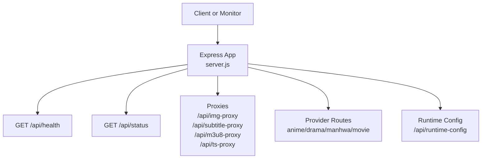
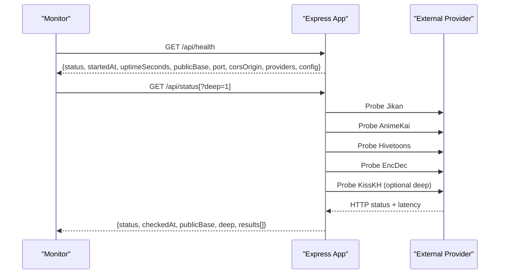
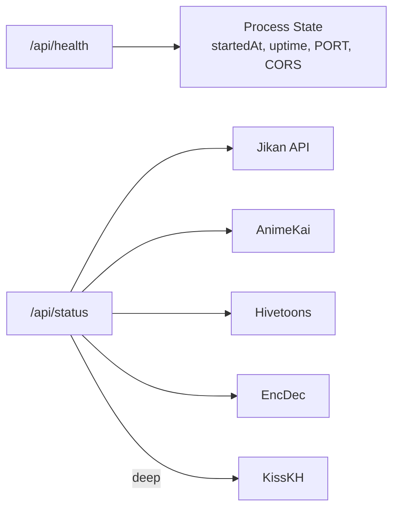

# Utility Endpoints

<cite>
**Referenced Files in This Document**
- [server.js](file://server.js)
- [api/index.js](file://api/index.js)
- [api/runtime-config.js](file://api/runtime-config.js)
</cite>

## Table of Contents
1. [Introduction](#introduction)
2. [Project Structure](#project-structure)
3. [Core Components](#core-components)
4. [Architecture Overview](#architecture-overview)
5. [Detailed Component Analysis](#detailed-component-analysis)
6. [Dependency Analysis](#dependency-analysis)
7. [Performance Considerations](#performance-considerations)
8. [Troubleshooting Guide](#troubleshooting-guide)
9. [Conclusion](#conclusion)

## Introduction
This document describes the utility and health check endpoints exposed by the backend service, with a focus on monitoring and status reporting. It explains how to interpret responses from the health and status endpoints, how to programmatically monitor service availability, and documents additional utility endpoints useful for debugging, testing, and administration.

## Project Structure
The backend is implemented as an Express application that exposes multiple API routes under /api. Health and status utilities are defined directly in the server file and re-exported via the API entry point for platform integrations (for example, Vercel).

**Diagram sources**
- [server.js:715-735](file://server.js#L715-L735)
- [server.js:1304-1336](file://server.js#L1304-L1336)
- [server.js:198-199](file://server.js#L198-L199)
- [server.js:235-256](file://server.js#L235-L256)
- [server.js:263-345](file://server.js#L263-L345)
- [server.js:354-393](file://server.js#L354-L393)
- [api/index.js:1-3](file://api/index.js#L1-L3)
- [api/runtime-config.js:4-24](file://api/runtime-config.js#L4-L24)

**Section sources**
- [server.js:1-30](file://server.js#L1-L30)
- [api/index.js:1-3](file://api/index.js#L1-L3)

## Core Components
- Health endpoint: returns basic service status, uptime, configuration hints, and available providers.
- Status endpoint: probes external provider dependencies and reports overall health including per-provider results.
- Utility proxies: image, subtitle, HLS manifest, and TS segment proxies used by streaming features.
- Runtime config endpoint: exposes the effective API base URL for clients.

Key responsibilities:
- Provide lightweight liveness checks (/api/health).
- Provide readiness and dependency checks (/api/status).
- Offer debugging and operational helpers (proxies and runtime config).

**Section sources**
- [server.js:715-735](file://server.js#L715-L735)
- [server.js:1304-1336](file://server.js#L1304-L1336)
- [server.js:198-199](file://server.js#L198-L199)
- [server.js:235-256](file://server.js#L235-L256)
- [server.js:263-345](file://server.js#L263-L345)
- [server.js:354-393](file://server.js#L354-L393)
- [api/runtime-config.js:4-24](file://api/runtime-config.js#L4-L24)

## Architecture Overview
The health and status endpoints are simple GET routes that return JSON. The health endpoint is fast and does not call external services. The status endpoint performs outbound HTTP probes to upstream providers and aggregates their results.

**Diagram sources**
- [server.js:715-735](file://server.js#L715-L735)
- [server.js:1280-1336](file://server.js#L1280-L1336)

## Detailed Component Analysis

### Health Endpoint: GET /api/health
Purpose:
- Liveness probe for orchestrators and monitoring systems.
- Returns service identity, uptime, environment-derived configuration hints, and listed providers.

Response fields:
- status: string indicating service state (e.g., ok).
- service: identifier for this backend.
- startedAt: ISO timestamp when the process started.
- uptimeSeconds: number of seconds since start.
- publicBase: computed public host derived from request headers.
- port: numeric port the server listens on.
- corsOrigin: configured CORS origin value.
- providers: object describing available content providers and strategies.
- config: object containing normalized base URLs for configured providers.

Interpretation:
- A successful 200 response with status "ok" indicates the process is running and responsive.
- Use uptimeSeconds to detect restarts or unexpected resets.
- Use publicBase to confirm the externally reachable base URL behind proxies or CDNs.
- Use providers and config to understand which backends are active and where they point.

Example usage:
- Poll periodically (for example every 30–60 seconds) to assert liveness.
- Alert if the endpoint is unreachable or returns non-200.

**Section sources**
- [server.js:715-735](file://server.js#L715-L735)

### Status Endpoint: GET /api/status
Purpose:
- Readiness and dependency health check.
- Probes upstream providers and reports aggregated status.

Query parameters:
- deep: optional flag to include additional provider checks (for example drama catalog).

Behavior:
- Executes multiple outbound probes in parallel to upstream services.
- Each probe records name, success, HTTP status or error, and latency.
- Overall status is "ok" if all probes succeed; otherwise "degraded".
- Returns a list of per-probe results with timing and details.

Response fields:
- status: "ok" or "degraded".
- checkedAt: ISO timestamp of the check.
- publicBase: computed public host.
- deep: boolean reflecting whether deep checks were performed.
- results: array of probe results with name, ok, status/error, and ms.

Interpretation:
- Use status to determine if the service can fulfill requests that depend on upstream providers.
- Inspect results to identify failing providers and approximate latency.
- Use deep=true to validate more critical paths (for example drama catalog access).

Operational guidance:
- If status is "degraded", investigate the specific failed probes in results.
- Consider alerting on degraded status or high-latency probes.

**Section sources**
- [server.js:1280-1336](file://server.js#L1280-L1336)

### Additional Utility Endpoints
These endpoints support debugging, testing, and administrative tasks related to media delivery and configuration.

- Image proxy: GET /api/img-proxy?url=<url>
  - Purpose: Bypasses CORS and hotlink restrictions for images.
  - Notes: Sets appropriate cache headers and CORS headers.

- Manga image proxy: GET /api/manga/image-proxy?url=<url>
  - Purpose: Same as image proxy but scoped to manga flows.

- Subtitle proxy: GET /api/subtitle-proxy?url=<url>
  - Purpose: Proxies VTT subtitles to avoid CORS blocks.
  - Notes: Returns text/vtt with caching enabled.

- HLS manifest proxy: GET /api/m3u8-proxy?url=<url>&referer=<referer>
  - Purpose: Rewrites HLS manifests so segments and sub-playlists are served through the backend.
  - Notes: Handles referer requirements and protected streams.

- TS segment proxy: GET /api/ts-proxy?url=<url>&referer=<referer>
  - Purpose: Streams video/audio segments with Range header support for efficient playback.
  - Notes: Forwards relevant headers and supports partial content.

- Runtime config: GET /api/runtime-config
  - Purpose: Returns the effective API_BASE used by the frontend.
  - Notes: Reads from environment variables and static config file.

Usage tips:
- Use these proxies during development or when browsers cannot reach upstream resources directly due to CORS or hotlink protections.
- Combine with /api/status to ensure upstream providers are reachable before relying on streaming endpoints.

**Section sources**
- [server.js:198-199](file://server.js#L198-L199)
- [server.js:235-256](file://server.js#L235-L256)
- [server.js:263-345](file://server.js#L263-L345)
- [server.js:354-393](file://server.js#L354-L393)
- [api/runtime-config.js:4-24](file://api/runtime-config.js#L4-L24)

## Dependency Analysis
The health and status endpoints have different dependency profiles:

- /api/health depends only on local process state and request context.
- /api/status depends on multiple external providers:
  - Jikan (anime metadata)
  - AnimeKai (anime search/stream discovery)
  - Hivetoons (manhwa source)
  - EncDec (drama key generation)
  - Optional: KissKH (drama catalog) when deep checks are enabled

**Diagram sources**
- [server.js:715-735](file://server.js#L715-L735)
- [server.js:1280-1336](file://server.js#L1280-L1336)

**Section sources**
- [server.js:715-735](file://server.js#L715-L735)
- [server.js:1280-1336](file://server.js#L1280-L1336)

## Performance Considerations
- /api/health is extremely lightweight and suitable for frequent polling.
- /api/status performs outbound network calls; consider throttling polls (for example every 60 seconds) and using deep=false for routine checks.
- When deep=true, additional network calls increase latency; use it sparingly for diagnostics.
- Proxies add minimal overhead but should be rate-limited at the edge if exposed publicly.

[No sources needed since this section provides general guidance]

## Troubleshooting Guide
Common issues and how to diagnose them:

- Health endpoint returns non-200:
  - Indicates the process is down or not reachable. Check process logs and network connectivity.

- Status endpoint returns "degraded":
  - Inspect results to find which provider failed.
  - High ms values indicate slow upstreams; consider timeouts or retries at the edge.

- Streaming fails despite healthy status:
  - Verify Referer and Origin requirements for specific providers.
  - Use /api/m3u8-proxy and /api/ts-proxy to test end-to-end flow.

- CORS errors in browser:
  - Ensure CORS_ORIGIN is set appropriately.
  - Use image and subtitle proxies to bypass restrictions during development.

- Runtime config mismatch:
  - Confirm API_BASE is correctly resolved via environment or static config.

**Section sources**
- [server.js:715-735](file://server.js#L715-L735)
- [server.js:1280-1336](file://server.js#L1280-L1336)
- [server.js:198-199](file://server.js#L198-L199)
- [server.js:235-256](file://server.js#L235-L256)
- [server.js:263-345](file://server.js#L263-L345)
- [server.js:354-393](file://server.js#L354-L393)
- [api/runtime-config.js:4-24](file://api/runtime-config.js#L4-L24)

## Conclusion
Use /api/health for simple liveness checks and /api/status for dependency-aware readiness checks. The provided utility proxies and runtime config endpoint support debugging and operational workflows. Programmatic monitors should poll /api/health frequently and /api/status less often, with deeper checks reserved for diagnostics.

[No sources needed since this section summarizes without analyzing specific files]