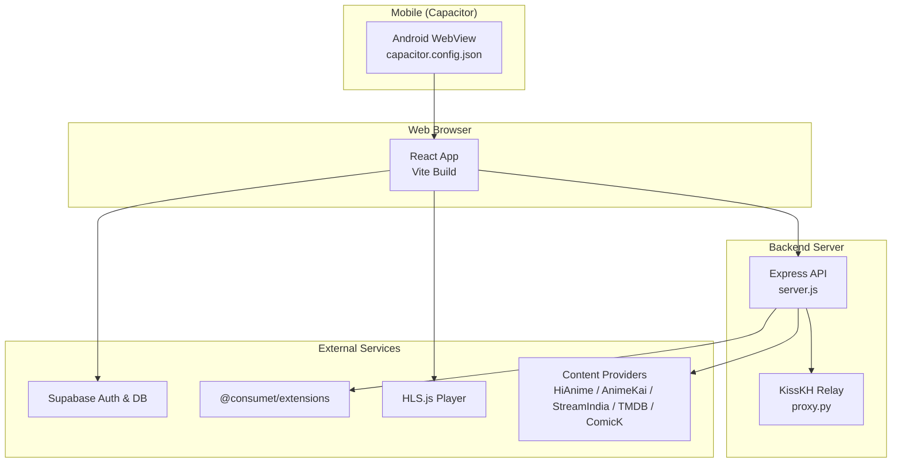
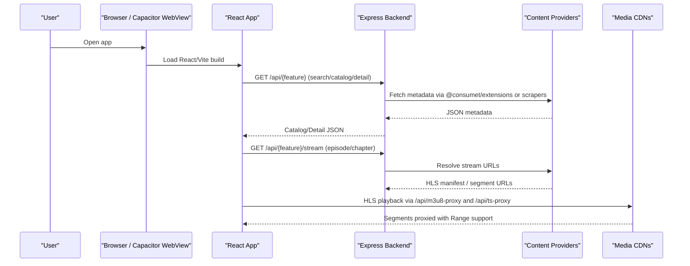
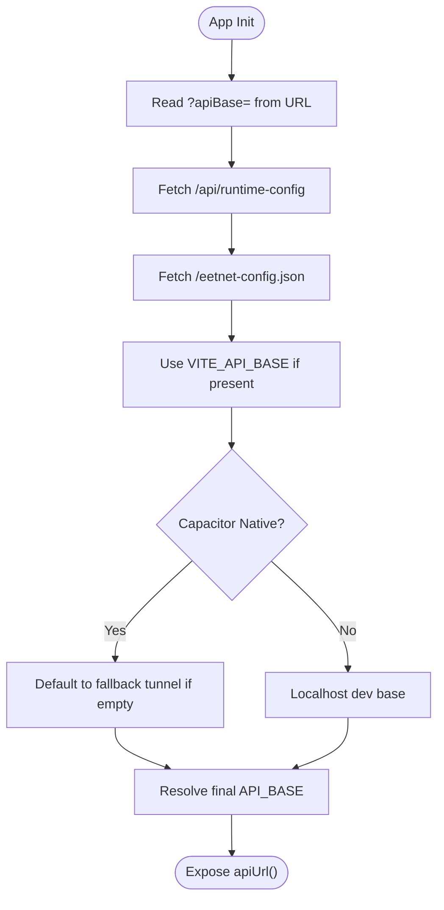
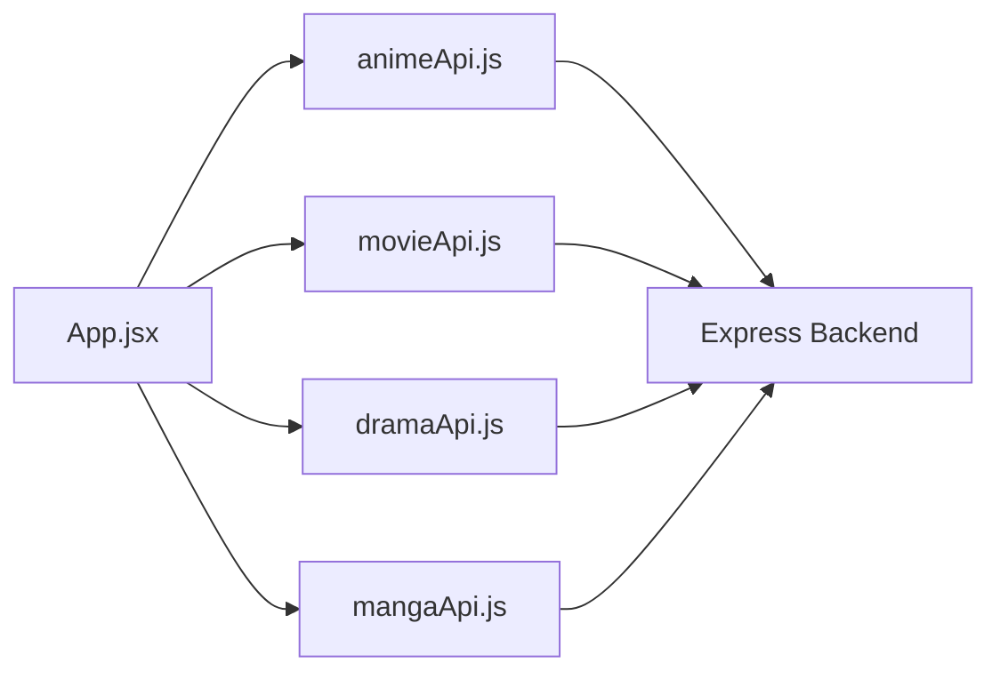
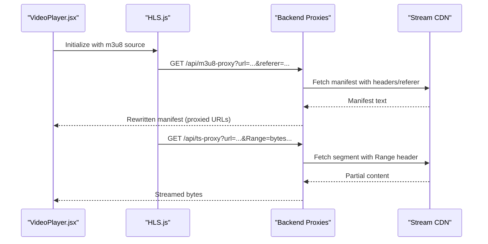
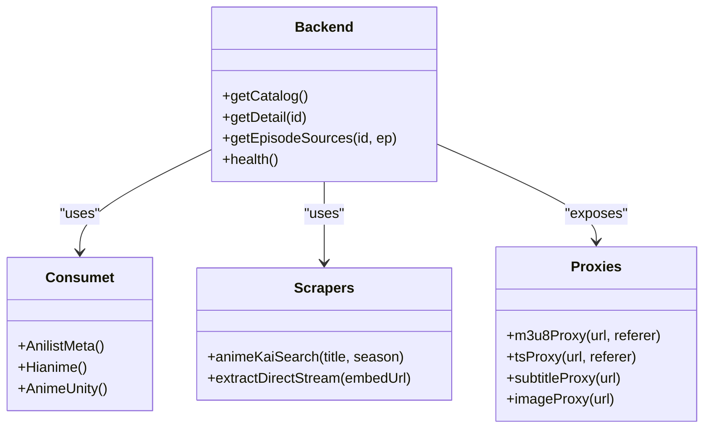
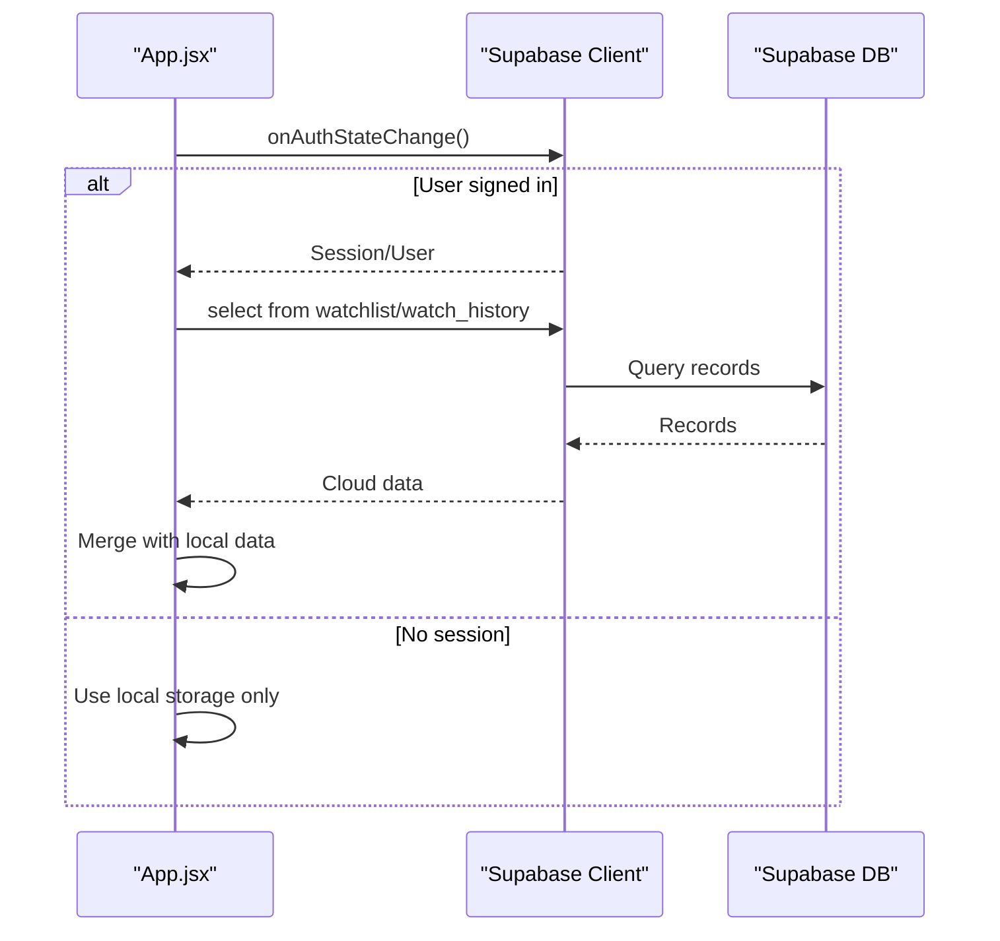
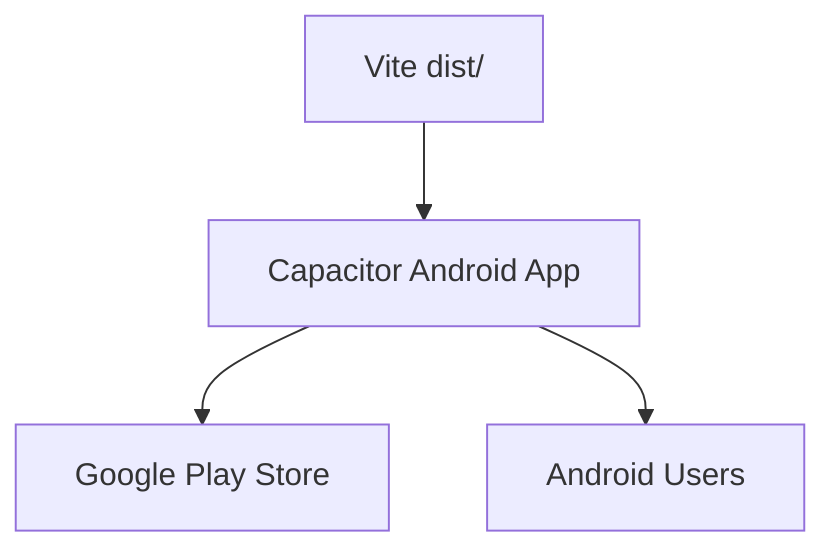
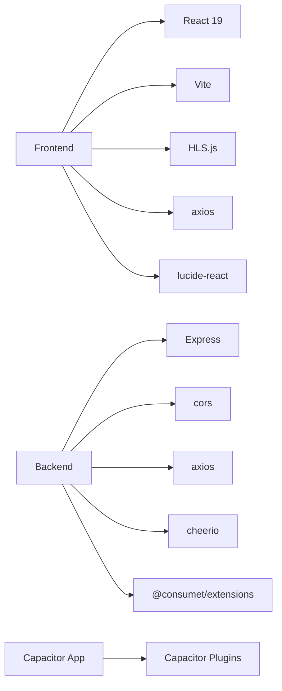

# Architecture Overview

<cite>
**Referenced Files in This Document**
- [package.json](file://package.json)
- [README.md](file://README.md)
- [server.js](file://server.js)
- [proxy.py](file://proxy.py)
- [capacitor.config.json](file://capacitor.config.json)
- [vite.config.js](file://vite.config.js)
- [src/App.jsx](file://src/App.jsx)
- [src/components/VideoPlayer.jsx](file://src/components/VideoPlayer.jsx)
- [src/runtimeConfig.js](file://src/runtimeConfig.js)
- [src/supabaseClient.js](file://src/supabaseClient.js)
- [src/features/anime/api/animeApi.js](file://src/features/anime/api/animeApi.js)
- [src/features/movie/api/movieApi.js](file://src/features/movie/api/movieApi.js)
- [src/features/drama/api/dramaApi.js](file://src/features/drama/api/dramaApi.js)
- [src/features/manga/api/mangaApi.js](file://src/features/manga/api/mangaApi.js)
</cite>

## Table of Contents
1. [Introduction](#introduction)
2. [Project Structure](#project-structure)
3. [Core Components](#core-components)
4. [Architecture Overview](#architecture-overview)
5. [Detailed Component Analysis](#detailed-component-analysis)
6. [Dependency Analysis](#dependency-analysis)
7. [Performance Considerations](#performance-considerations)
8. [Troubleshooting Guide](#troubleshooting-guide)
9. [Conclusion](#conclusion)
10. [Appendices](#appendices)

## Introduction
Project Anime is a full-stack streaming platform that delivers anime, movies, dramas, and manga across web and mobile. The frontend is built with React 19 and Vite, the backend is an Express.js server that scrapes and proxies content from multiple providers, and the mobile app uses Capacitor to wrap the same web build for Android. Streaming uses HLS.js for adaptive playback, while Supabase provides optional authentication and data sync for watch history and watchlists. Content providers are accessed via @consumet/extensions and custom scrapers/proxies to handle CORS, referer requirements, and stream protection.

## Project Structure
The project follows a feature-based modular architecture:
- Frontend (React + Vite): Single-page application with feature folders per content type (anime, movie, drama, manga, manhwa). Each feature includes its own API layer and UI components.
- Backend (Node/Express): Centralized API server providing search, catalog, detail, episode/stream endpoints, plus media proxies for images, subtitles, HLS manifests, and video segments.
- Mobile (Capacitor): Wraps the Vite-built web app into an Android app with native capabilities like splash screen, status bar, and keyboard behavior.

**Diagram sources**
- [package.json:14-34](file://package.json#L14-L34)
- [capacitor.config.json:1-31](file://capacitor.config.json#L1-L31)
- [vite.config.js:7-20](file://vite.config.js#L7-L20)
- [server.js:1-20](file://server.js#L1-L20)
- [proxy.py:1-36](file://proxy.py#L1-L36)

**Section sources**
- [package.json:1-45](file://package.json#L1-L45)
- [README.md:1-160](file://README.md#L1-L160)
- [capacitor.config.json:1-32](file://capacitor.config.json#L1-L32)
- [vite.config.js:1-23](file://vite.config.js#L1-L23)

## Core Components
- Frontend runtime configuration resolves the backend base URL dynamically at runtime, supporting query overrides, serverless config endpoints, static fallbacks, and environment variables. This avoids stale URLs when using rotating tunnels.
- Feature modules encapsulate domain logic and API calls:
  - Anime: Uses shared mockData APIs and Hindi-specific endpoints.
  - Movies: Calls backend movieplex endpoints for catalog, info, and search.
  - Drama: Calls backend drama endpoints for home, info, streams, and search.
  - Manga: Calls backend manga endpoints for home, info, chapters, and search.
- Video player integrates HLS.js for adaptive streaming, quality selection, audio track switching, CC support, skip intro/end detection, and robust error recovery.
- Backend provides:
  - Provider abstraction via @consumet/extensions for anime metadata and streaming.
  - Custom scrapers and proxies for additional providers and protected streams.
  - Media proxies for images, subtitles, HLS manifests, and TS segments with proper headers and range handling.
  - Health endpoint exposing provider configuration and active services.

**Section sources**
- [src/runtimeConfig.js:1-163](file://src/runtimeConfig.js#L1-L163)
- [src/features/anime/api/animeApi.js:1-20](file://src/features/anime/api/animeApi.js#L1-L20)
- [src/features/movie/api/movieApi.js:1-32](file://src/features/movie/api/movieApi.js#L1-L32)
- [src/features/drama/api/dramaApi.js:1-33](file://src/features/drama/api/dramaApi.js#L1-L33)
- [src/features/manga/api/mangaApi.js:1-29](file://src/features/manga/api/mangaApi.js#L1-L29)
- [src/components/VideoPlayer.jsx:1-800](file://src/components/VideoPlayer.jsx#L1-L800)
- [server.js:213-735](file://server.js#L213-L735)

## Architecture Overview
High-level system context shows how requests flow from the browser or mobile app through the frontend to the backend, which then interacts with external providers and media CDNs. The backend normalizes paths, applies CORS, and proxies sensitive media to avoid CORS and mixed-content issues.

**Diagram sources**
- [server.js:263-393](file://server.js#L263-L393)
- [server.js:738-735](file://server.js#L738-L735)
- [src/components/VideoPlayer.jsx:180-282](file://src/components/VideoPlayer.jsx#L180-L282)

## Detailed Component Analysis

### Frontend Runtime Configuration
Runtime configuration prioritizes dynamic resolution over build-time values to support rotating tunnels and instant updates without redeploy. It supports:
- Query parameter override for emergency backend changes.
- Serverless runtime config endpoint for fresh environment variables.
- Static fallback configuration file.
- Environment variable fallback and localhost auto-detection.
- Capacitor-aware defaults for native apps.

**Diagram sources**
- [src/runtimeConfig.js:37-129](file://src/runtimeConfig.js#L37-L129)

**Section sources**
- [src/runtimeConfig.js:1-163](file://src/runtimeConfig.js#L1-L163)

### Feature Modules and API Layers
Each content type has a dedicated module with its own API layer:
- Anime: Reuses shared APIs and adds Hindi-specific lists.
- Movies: Interacts with backend movieplex endpoints for catalogs, info, and search.
- Drama: Interacts with backend drama endpoints for home, info, streams, and search.
- Manga: Interacts with backend manga endpoints for home, info, chapters, and search.

**Diagram sources**
- [src/App.jsx:1-43](file://src/App.jsx#L1-L43)
- [src/features/anime/api/animeApi.js:1-20](file://src/features/anime/api/animeApi.js#L1-L20)
- [src/features/movie/api/movieApi.js:1-32](file://src/features/movie/api/movieApi.js#L1-L32)
- [src/features/drama/api/dramaApi.js:1-33](file://src/features/drama/api/dramaApi.js#L1-L33)
- [src/features/manga/api/mangaApi.js:1-29](file://src/features/manga/api/mangaApi.js#L1-L29)

**Section sources**
- [src/features/anime/api/animeApi.js:1-20](file://src/features/anime/api/animeApi.js#L1-L20)
- [src/features/movie/api/movieApi.js:1-32](file://src/features/movie/api/movieApi.js#L1-L32)
- [src/features/drama/api/dramaApi.js:1-33](file://src/features/drama/api/dramaApi.js#L1-L33)
- [src/features/manga/api/mangaApi.js:1-29](file://src/features/manga/api/mangaApi.js#L1-L29)

### Video Player and HLS Streaming
The video player integrates HLS.js for adaptive streaming, including:
- Quality level discovery and switching.
- Audio track selection with preferred language support.
- Subtitle tracks via VTT proxy.
- Skip intro/end detection using external API.
- Error recovery for network and media errors.
- Native HLS path for iOS Safari.

**Diagram sources**
- [src/components/VideoPlayer.jsx:180-282](file://src/components/VideoPlayer.jsx#L180-L282)
- [server.js:263-393](file://server.js#L263-L393)

**Section sources**
- [src/components/VideoPlayer.jsx:1-800](file://src/components/VideoPlayer.jsx#L1-L800)
- [server.js:231-393](file://server.js#L231-L393)

### Backend Provider Abstraction and Scrapers
The backend uses @consumet/extensions for primary anime metadata and streaming, with fallback scrapers for resilience:
- Primary: HiAnime via Anilist ID mapping for deterministic season/episode selection.
- Secondary: AnimeKai scraper with title matching and season qualification.
- Fallback: AnimeUnity via Consumet.
- Additional providers: StreamIndia/Animerulz for Hindi/Indian dubs; KissKH relay for drama; HiveToons for manhwa.

**Diagram sources**
- [server.js:213-229](file://server.js#L213-L229)
- [server.js:518-626](file://server.js#L518-L626)
- [server.js:263-393](file://server.js#L263-L393)

**Section sources**
- [server.js:213-735](file://server.js#L213-L735)

### Authentication and Data Sync with Supabase
Supabase integration provides:
- Optional authentication (email/password, OAuth) with persistent sessions.
- Custom storage adapter for Capacitor Preferences and localStorage.
- Watchlist and watch history sync between local and cloud.
- Graceful fallback to local-only mode when credentials are not configured.

**Diagram sources**
- [src/supabaseClient.js:1-98](file://src/supabaseClient.js#L1-L98)
- [src/App.jsx:592-725](file://src/App.jsx#L592-L725)

**Section sources**
- [src/supabaseClient.js:1-98](file://src/supabaseClient.js#L1-L98)
- [src/App.jsx:592-725](file://src/App.jsx#L592-L725)

### Mobile Deployment with Capacitor
Capacitor wraps the Vite-built web app into an Android app with:
- Splash screen and status bar configuration.
- Keyboard behavior and input capture settings.
- Mixed content allowance for development and testing.
- WebView bridge for native features like back button handling and deep links.

**Diagram sources**
- [capacitor.config.json:1-31](file://capacitor.config.json#L1-L31)

**Section sources**
- [capacitor.config.json:1-32](file://capacitor.config.json#L1-L32)

## Dependency Analysis
Key dependencies include:
- Frontend: React 19, Vite, HLS.js, axios, lucide-react icons.
- Backend: Express, cors, axios, cheerio, https agent, @consumet/extensions, node vm.
- Mobile: Capacitor plugins for app lifecycle, browser, filesystem, preferences, splash screen, status bar.
- External services: Supabase for auth/data, content providers via @consumet/extensions and custom scrapers.

**Diagram sources**
- [package.json:14-43](file://package.json#L14-L43)

**Section sources**
- [package.json:1-45](file://package.json#L1-L45)

## Performance Considerations
- HLS streaming uses byte-range requests for fast startup and efficient buffering.
- Backend caches episode lists, stream URLs, and Jikan metadata with TTLs to reduce upstream calls.
- Image and subtitle proxies add caching headers to improve repeat loads.
- Provider fallback chains minimize latency by trying primary, secondary, and last-resort sources.
- Mobile app allows mixed content during development but should be reviewed for production security.

[No sources needed since this section provides general guidance]

## Troubleshooting Guide
Common issues and resolutions:
- Empty drama/manhwa sections: Backend down or stale VITE_API_BASE on Vercel; restart phone chain and redeploy frontend.
- Video plays but no audio/subtitles: Subtitle or audio CDN blocking; use subtitle proxy or adjust referer headers.
- 403 from tunnel provider: Tunnel challenges datacenter IPs; use a tunnel without Cloudflare Edge challenges or a named Cloudflare Tunnel with Bot Fight Mode off.
- Stream India failures: Retry with alternative referers; unwrap failed relay URLs before fetching.

**Section sources**
- [README.md:144-160](file://README.md#L144-L160)
- [server.js:108-148](file://server.js#L108-L148)
- [server.js:263-393](file://server.js#L263-L393)

## Conclusion
Project Anime combines a modern React frontend, a flexible Express backend, and a Capacitor mobile wrapper to deliver a Netflix-style streaming experience. The feature-based architecture isolates content domains, while the backend’s provider abstraction and media proxies ensure reliable access to diverse content sources. Supabase enables optional cloud sync for user data, and the runtime configuration system supports dynamic backend addressing for resilient deployments.

[No sources needed since this section summarizes without analyzing specific files]

## Appendices
- Environment variables for backend and frontend are documented in the README.
- Development workflow uses Vite dev server proxying to local backend for seamless API access.
- Production deployment targets Vercel for frontend and Termux/ngrok for backend, with optional Cloudflare Tunnel for stable URLs.

**Section sources**
- [README.md:76-141](file://README.md#L76-L141)
- [vite.config.js:7-20](file://vite.config.js#L7-L20)