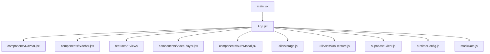
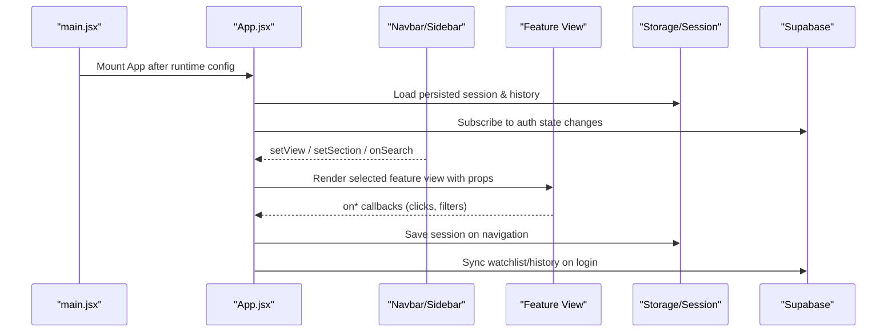
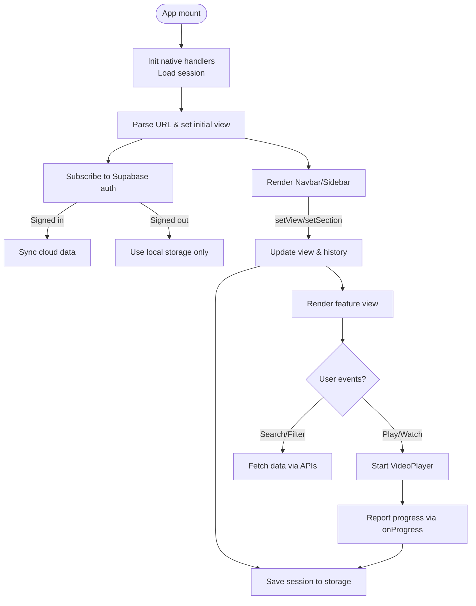
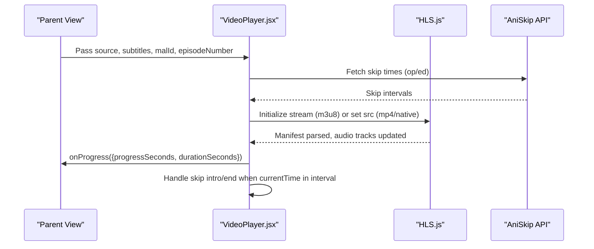
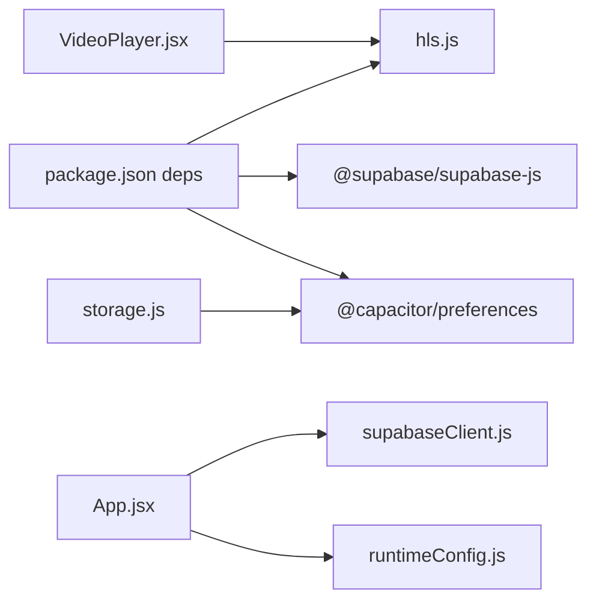

# Component Interactions

<cite>
**Referenced Files in This Document**
- [main.jsx](file://src/main.jsx)
- [App.jsx](file://src/App.jsx)
- [Navbar.jsx](file://src/components/Navbar.jsx)
- [Sidebar.jsx](file://src/components/Sidebar.jsx)
- [VideoPlayer.jsx](file://src/components/VideoPlayer.jsx)
- [AuthModal.jsx](file://src/components/AuthModal.jsx)
- [AnimeView.jsx](file://src/features/anime/components/AnimeView.jsx)
- [MovieHomeView.jsx](file://src/features/movie/components/MovieHomeView.jsx)
- [supabaseClient.js](file://src/supabaseClient.js)
- [runtimeConfig.js](file://src/runtimeConfig.js)
- [storage.js](file://src/utils/storage.js)
- [sessionRestore.js](file://src/utils/sessionRestore.js)
- [mockData.js](file://src/mockData.js)
- [package.json](file://package.json)
</cite>

## Table of Contents
1. [Introduction](#introduction)
2. [Project Structure](#project-structure)
3. [Core Components](#core-components)
4. [Architecture Overview](#architecture-overview)
5. [Detailed Component Analysis](#detailed-component-analysis)
6. [Dependency Analysis](#dependency-analysis)
7. [Performance Considerations](#performance-considerations)
8. [Troubleshooting Guide](#troubleshooting-guide)
9. [Conclusion](#conclusion)

## Introduction
This document explains the React architecture and component interactions for Project Anime. It covers the root-to-feature hierarchy, communication patterns (props, events, context), state management combining React hooks, local storage, and Supabase, routing and navigation across content types (anime, movies, dramas, manga), event-driven flows (video player controls, search, authentication), reusable utilities, and integrations with HLS.js and Supabase.

## Project Structure
The application is bootstrapped by a minimal entry that loads runtime configuration before mounting the App. The App acts as the central orchestrator: it manages global state, routes to feature views, wires up navigation, auth, persistence, and media playback. Feature modules encapsulate domain-specific UI and data fetching. Shared components provide layout, navigation, video playback, and authentication UI. Utilities abstract storage and session handling.

**Diagram sources**
- [main.jsx:6-13](file://src/main.jsx#L6-L13)
- [App.jsx:51-445](file://src/App.jsx#L51-L445)

**Section sources**
- [main.jsx:1-15](file://src/main.jsx#L1-L15)
- [App.jsx:1-100](file://src/App.jsx#L1-L100)

## Core Components
- Root bootstrap: Loads runtime config then mounts App under StrictMode.
- App: Central state holder; coordinates navigation, search, watch history, playlists, subscriptions, notifications, and sync with Supabase. Persists session and route state.
- Navbar: Global header with search, notifications, profile menu, mobile drawer/bottom nav. Emits search and navigation events via props.
- Sidebar: Left navigation panel with sections like Home, Subscriptions, You, Explore (Anime, Comics, Drama, Movies). Updates active view and section via props.
- VideoPlayer: Media playback with HLS.js support, quality/audio track selection, CC, fullscreen/PiP, keyboard shortcuts, skip intro/end via AniSkip, progress reporting.
- AuthModal: Sign-in/sign-up and OAuth flows using Supabase client; shows user-friendly error messages and password strength feedback.

Communication patterns:
- Parent-to-child: Props pass data and callbacks (e.g., setView, onSearch, onMovieClick).
- Child-to-parent: Event handlers bubble up to App (e.g., search input changes, card clicks).
- Cross-cutting concerns: Storage and session utilities persist state; Supabase provides cloud sync when authenticated.

**Section sources**
- [App.jsx:51-445](file://src/App.jsx#L51-L445)
- [Navbar.jsx:243-516](file://src/components/Navbar.jsx#L243-L516)
- [Sidebar.jsx:75-286](file://src/components/Sidebar.jsx#L75-L286)
- [VideoPlayer.jsx:1-800](file://src/components/VideoPlayer.jsx#L1-L800)
- [AuthModal.jsx:92-419](file://src/components/AuthModal.jsx#L92-L419)

## Architecture Overview
The app uses a single-page approach with manual history-based routing. App maintains a view string and pushes/pops browser history entries based on current state. Feature views are rendered conditionally based on the view and active section. Data fetching occurs in feature views or App-level effects, often via mockData APIs or direct fetch calls through runtimeConfig.

**Diagram sources**
- [main.jsx:6-13](file://src/main.jsx#L6-L13)
- [App.jsx:240-445](file://src/App.jsx#L240-L445)
- [sessionRestore.js:17-95](file://src/utils/sessionRestore.js#L17-L95)
- [supabaseClient.js:1-98](file://src/supabaseClient.js#L1-L98)

## Detailed Component Analysis

### App.jsx: Orchestrator and State Hub
Responsibilities:
- Manages global state: view, activeSection, featured/trending data, search results, category filters, selected items per feature, loading states, playlists, subscriptions, notifications, welcome/toast UI.
- Initializes native app handlers (back button, pause/resume, deep links) and restores last session.
- Implements browser history integration: push/replace state and URLs for clean paths and query parameters.
- Sets up Supabase auth listener and triggers cloud sync on sign-in.
- Provides handlers for liked videos, watch later, custom playlists, and toast notifications.

Key interactions:
- Props/callbacks from Navbar/Sidebar update view and section.
- Feature views receive data and callbacks (e.g., onAnimeClick, onMovieClick).
- Session and video progress saved via utils/sessionRestore and utils/storage.
- Cloud sync merges local and remote watchlist/history.

**Diagram sources**
- [App.jsx:240-445](file://src/App.jsx#L240-L445)
- [sessionRestore.js:17-95](file://src/utils/sessionRestore.js#L17-L95)

**Section sources**
- [App.jsx:51-445](file://src/App.jsx#L51-L445)

### Navbar.jsx: Navigation and Search
Responsibilities:
- Desktop/mobile header with logo, search bar, notifications, profile dropdown, sign-in/sign-out.
- Mobile drawer and bottom navigation for quick access to sections and user features.
- Emits search queries via onSearch prop and navigates via setView/setSection.

Communication:
- Parent passes setView, setSection, user, onSignIn/onSignOut, notifications, onSelectNotification.
- Drawer items call navigate(view, section) which updates parent state and scrolls to top.

**Section sources**
- [Navbar.jsx:5-170](file://src/components/Navbar.jsx#L5-L170)
- [Navbar.jsx:194-241](file://src/components/Navbar.jsx#L194-L241)
- [Navbar.jsx:243-516](file://src/components/Navbar.jsx#L243-L516)

### Sidebar.jsx: Section Navigation
Responsibilities:
- Organizes navigation into Home, Subscriptions, You, Explore (Anime, Comics, Drama, Movies).
- Supports expandable submenus (e.g., Anime genres) and “show more” toggles.
- Updates active view and section via setView/setSection.

Communication:
- Parent passes activeView, setView, setSection, user, onSignIn, subscriptions, onSelectCategory/onSelectSubscription.
- Genre selection can navigate to Hindi or default anime view.

**Section sources**
- [Sidebar.jsx:33-117](file://src/components/Sidebar.jsx#L33-L117)
- [Sidebar.jsx:118-286](file://src/components/Sidebar.jsx#L118-L286)

### VideoPlayer.jsx: Playback Controls and Integrations
Responsibilities:
- Handles HLS.js initialization, quality levels, audio tracks, subtitles, buffering, errors.
- Provides play/pause, volume, fullscreen, PiP, seek steps, double-tap gestures, timeline scrubbing with preview tooltip.
- Integrates AniSkip to detect and skip opening/ending segments.
- Reports playback progress via onProgress callback.

Integration points:
- Uses HLS.js library for streaming; falls back to native HLS on iOS Safari or direct MP4.
- Communicates with parent via props: source, poster, subtitles, malId, episodeNumber, title, type, onProgress, onNextEpisode, onPrevEpisode, onError.

**Diagram sources**
- [VideoPlayer.jsx:94-146](file://src/components/VideoPlayer.jsx#L94-L146)
- [VideoPlayer.jsx:149-282](file://src/components/VideoPlayer.jsx#L149-L282)
- [VideoPlayer.jsx:300-332](file://src/components/VideoPlayer.jsx#L300-L332)

**Section sources**
- [VideoPlayer.jsx:1-800](file://src/components/VideoPlayer.jsx#L1-L800)

### AuthModal.jsx: Authentication Flow
Responsibilities:
- Sign-in/sign-up forms with validation and password strength indicator.
- OAuth sign-in via Google/Discord using Supabase client.
- Displays friendly error messages and success transitions.

Communication:
- Receives onClose prop to dismiss modal.
- Calls supabase.auth methods and handles responses/errors.

**Section sources**
- [AuthModal.jsx:92-419](file://src/components/AuthModal.jsx#L92-L419)

### Feature Views: Anime and Movie
AnimeView:
- Renders chips for categories, continue watching row, top 10, and main grid.
- Uses shared YTCard and ChipBar components from App.
- Emits onAnimeClick/onStartWatching to navigate to detail/watch.

MovieHomeView:
- Hero carousel with auto-rotate, category filter pills, horizontal rows, and paginated category grid.
- Loads random picks from Supabase with realtime updates and admin-only dev mode to push selections.
- Emits onMovieClick to navigate to movie detail/watch.

**Section sources**
- [AnimeView.jsx:1-151](file://src/features/anime/components/AnimeView.jsx#L1-L151)
- [MovieHomeView.jsx:1-608](file://src/features/movie/components/MovieHomeView.jsx#L1-L608)

## Dependency Analysis
External libraries and integrations:
- HLS.js: Used by VideoPlayer for adaptive streaming and quality switching.
- Supabase: Client configured with custom storage adapter; used for auth and database operations (watchlist, history, site_config).
- Capacitor Preferences: Used via storage utility for persistent preferences in native Android builds.
- Runtime config: Resolves API base dynamically from query param, serverless function, static JSON, env, or fallback tunnel.

Coupling and cohesion:
- App has high cohesion around state orchestration but couples multiple feature views directly; consider extracting a routing/context layer if complexity grows.
- VideoPlayer is cohesive around playback logic and decouples from data fetching via props.
- AuthModal depends on Supabase client; robust error mapping improves UX.

Potential circular dependencies:
- None detected; imports are hierarchical (main -> App -> components/features/utils).

External integration points:
- Supabase client initialization and mock fallback ensure resilience without credentials.
- Runtime config ensures correct API endpoints across environments.

**Diagram sources**
- [package.json:14-35](file://package.json#L14-L35)
- [supabaseClient.js:1-98](file://src/supabaseClient.js#L1-L98)
- [runtimeConfig.js:82-163](file://src/runtimeConfig.js#L82-L163)
- [storage.js:1-71](file://src/utils/storage.js#L1-L71)

**Section sources**
- [package.json:14-35](file://package.json#L14-L35)
- [supabaseClient.js:1-98](file://src/supabaseClient.js#L1-L98)
- [runtimeConfig.js:82-163](file://src/runtimeConfig.js#L82-L163)
- [storage.js:1-71](file://src/utils/storage.js#L1-L71)

## Performance Considerations
- Debounced search and request refs prevent redundant API calls during rapid typing or navigation.
- In-memory caching for AniList queries reduces network load and rate-limiting impact.
- Session persistence avoids re-fetching state on reload; video progress stored locally for resume.
- HLS.js retry settings and recovery attempts improve resilience against transient network issues.
- Paginated category loading in MovieHomeView prevents rendering large datasets at once.

[No sources needed since this section provides general guidance]

## Troubleshooting Guide
Common issues and mitigations:
- Supabase not configured: Application falls back to mock client; watchlist/history remain local. Check environment variables and console warnings.
- HLS stream failures: Player reports errors and attempts recovery; verify m3u8 availability and CORS policies.
- Session restore fails: Storage utility gracefully falls back to localStorage; check Capacitor plugin availability in native builds.
- Runtime config resolution: If API_BASE is empty, relative paths are used; ensure serverless functions or static config are reachable.

**Section sources**
- [supabaseClient.js:21-98](file://src/supabaseClient.js#L21-L98)
- [VideoPlayer.jsx:244-282](file://src/components/VideoPlayer.jsx#L244-L282)
- [storage.js:8-71](file://src/utils/storage.js#L8-L71)
- [runtimeConfig.js:82-163](file://src/runtimeConfig.js#L82-L163)

## Conclusion
Project Anime’s React architecture centers on a single App orchestrating state, navigation, and persistence, with feature views encapsulating domain logic. Communication relies on props and callbacks, while cross-cutting concerns use storage utilities and Supabase for cloud sync. The video player integrates HLS.js for robust streaming, and runtime configuration ensures flexible API targeting. This design balances modularity and simplicity, enabling scalable growth across content types and platforms.

[No sources needed since this section summarizes without analyzing specific files]