# Data Flow Patterns

<cite>
**Referenced Files in This Document**
- [main.jsx](file://src/main.jsx)
- [App.jsx](file://src/App.jsx)
- [runtimeConfig.js](file://src/runtimeConfig.js)
- [supabaseClient.js](file://src/supabaseClient.js)
- [mockData.js](file://src/mockData.js)
- [animeApi.js](file://src/features/anime/api/animeApi.js)
- [movieApi.js](file://src/features/movie/api/movieApi.js)
- [dramaApi.js](file://src/features/drama/api/dramaApi.js)
- [storage.js](file://src/utils/storage.js)
- [VideoPlayer.jsx](file://src/components/VideoPlayer.jsx)
- [cbf.js](file://src/utils/cbf.js)
- [server.js](file://server.js)
- [index.js](file://api/index.js)
</cite>

## Table of Contents
1. Introduction
2. Project Structure
3. Core Components
4. Architecture Overview
5. Detailed Component Analysis
6. Dependency Analysis
7. Performance Considerations
8. Troubleshooting Guide
9. Conclusion

## Introduction
This document explains the end-to-end data flow patterns for Project Anime, covering how user interactions trigger feature APIs, how content providers are abstracted with automatic fallbacks, how caching works (in-memory TTL and local storage), and how real-time synchronization is achieved via Supabase subscriptions. It also documents error handling, retry logic, graceful degradation, and performance strategies such as lazy loading, pagination, and bandwidth optimization.

## Project Structure
Project Anime is a React application with:
- A runtime configuration layer that resolves API base URLs across environments.
- Feature modules (anime, movie, drama, manga/manhwa) each exposing an API facade.
- A shared mockData module that orchestrates discovery, details, episodes, and streaming sources with provider fallbacks.
- A server-side proxy that handles CORS, image/stream proxies, and external provider integrations.
- Persistent storage abstraction for Capacitor and browser environments.
- Supabase client integration for authentication and real-time sync.

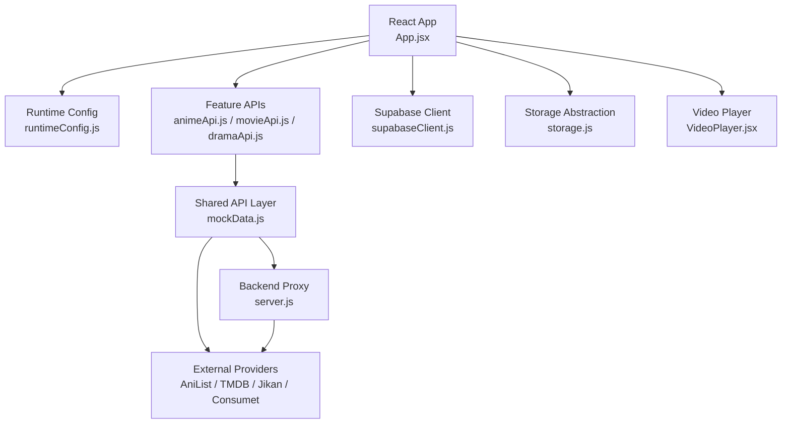

**Diagram sources**
- [App.jsx:1-100](file://src/App.jsx#L1-L100)
- [runtimeConfig.js:82-153](file://src/runtimeConfig.js#L82-L153)
- [animeApi.js:1-20](file://src/features/anime/api/animeApi.js#L1-L20)
- [movieApi.js:1-32](file://src/features/movie/api/movieApi.js#L1-L32)
- [dramaApi.js:1-33](file://src/features/drama/api/dramaApi.js#L1-L33)
- [mockData.js:79-150](file://src/mockData.js#L79-L150)
- [server.js:1-200](file://server.js#L1-L200)
- [supabaseClient.js:1-98](file://src/supabaseClient.js#L1-L98)
- [storage.js:1-71](file://src/utils/storage.js#L1-L71)
- [VideoPlayer.jsx:1-200](file://src/components/VideoPlayer.jsx#L1-L200)

**Section sources**
- [main.jsx:1-15](file://src/main.jsx#L1-L15)
- [App.jsx:1-120](file://src/App.jsx#L1-L120)
- [runtimeConfig.js:1-163](file://src/runtimeConfig.js#L1-L163)
- [server.js:1-200](file://server.js#L1-L200)
- [supabaseClient.js:1-98](file://src/supabaseClient.js#L1-L98)
- [storage.js:1-71](file://src/utils/storage.js#L1-L71)

## Core Components
- Runtime Configuration: Resolves API base URL from query override, serverless endpoint, static config, build-time env, or native fallback. Provides helpers to build absolute API paths.
- Feature APIs: Thin wrappers around shared methods and backend endpoints for anime, movies, and dramas.
- Shared API Layer: Implements AniList GraphQL queries with in-memory cache and TTL, episode list resolution (Jikan/backend), and streaming source acquisition with provider fallbacks.
- Storage Abstraction: Persists data using Capacitor Preferences on native platforms and localStorage on web.
- Supabase Integration: Real-time auth state changes and optional cloud sync; includes a mock client when credentials are missing.
- Video Player: HLS playback, quality/audio track selection, intro/outro skip via AniSkip, and progress reporting.

**Section sources**
- [runtimeConfig.js:82-153](file://src/runtimeConfig.js#L82-L153)
- [animeApi.js:1-20](file://src/features/anime/api/animeApi.js#L1-L20)
- [movieApi.js:1-32](file://src/features/movie/api/movieApi.js#L1-L32)
- [dramaApi.js:1-33](file://src/features/drama/api/dramaApi.js#L1-L33)
- [mockData.js:79-150](file://src/mockData.js#L79-L150)
- [storage.js:1-71](file://src/utils/storage.js#L1-L71)
- [supabaseClient.js:1-98](file://src/supabaseClient.js#L1-L98)
- [VideoPlayer.jsx:1-200](file://src/components/VideoPlayer.jsx#L1-L200)

## Architecture Overview
The request/response lifecycle spans UI components, feature APIs, shared API layer, backend proxy, and external providers. Caching occurs at multiple layers: in-memory caches with TTL for AniList and availability checks, and persistent storage for user preferences and history. Real-time updates come from Supabase subscriptions.

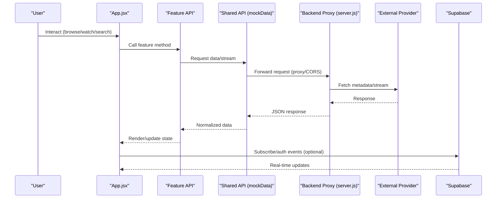

**Diagram sources**
- [App.jsx:474-725](file://src/App.jsx#L474-L725)
- [animeApi.js:1-20](file://src/features/anime/api/animeApi.js#L1-L20)
- [movieApi.js:1-32](file://src/features/movie/api/movieApi.js#L1-L32)
- [dramaApi.js:1-33](file://src/features/drama/api/dramaApi.js#L1-L33)
- [mockData.js:79-150](file://src/mockData.js#L79-L150)
- [server.js:1-200](file://server.js#L1-L200)
- [supabaseClient.js:1-98](file://src/supabaseClient.js#L1-L98)

## Detailed Component Analysis

### Content Discovery Flow
Discovery uses AniList via a shared fetch helper with in-memory caching and TTL. The backend proxy can be used first; if unavailable, direct AniList requests are attempted, with a dev proxy fallback on localhost.

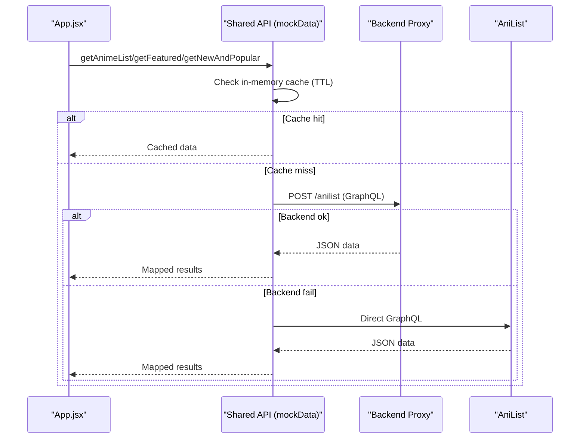

**Diagram sources**
- [mockData.js:79-150](file://src/mockData.js#L79-L150)
- [mockData.js:321-374](file://src/mockData.js#L321-L374)

**Section sources**
- [mockData.js:79-150](file://src/mockData.js#L79-L150)
- [mockData.js:321-374](file://src/mockData.js#L321-L374)

### Streaming Initiation Flow
Episode streaming uses a provider abstraction with automatic fallbacks. The shared API attempts backend-provided sources, then other providers, before returning a safe error state.

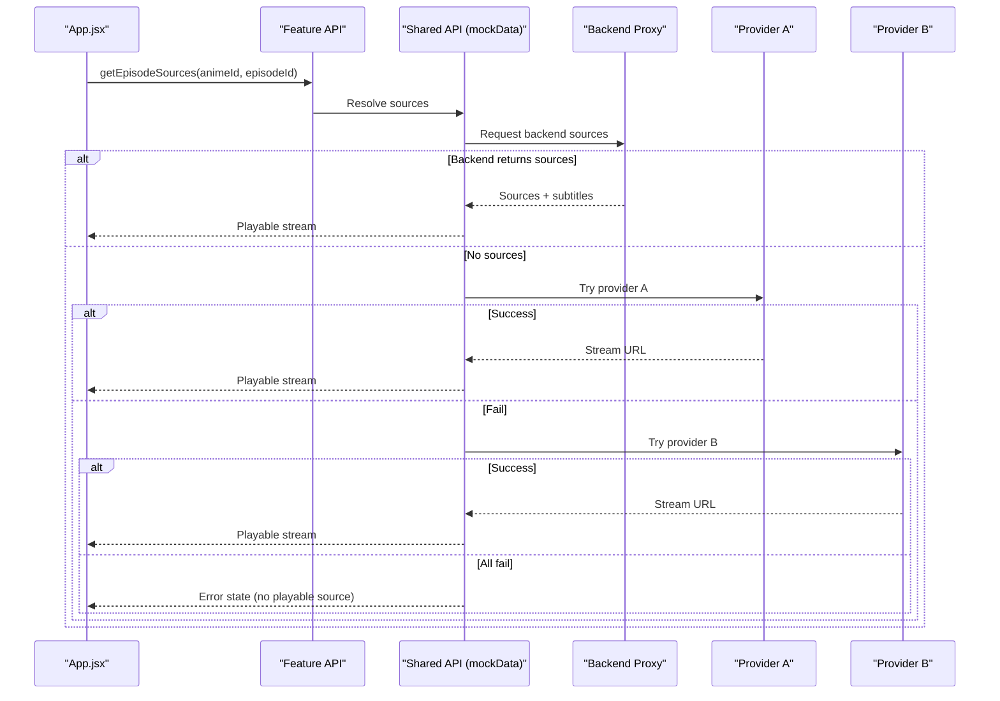

**Diagram sources**
- [mockData.js:780-818](file://src/mockData.js#L780-L818)
- [server.js:108-148](file://server.js#L108-L148)

**Section sources**
- [mockData.js:780-818](file://src/mockData.js#L780-L818)
- [server.js:108-148](file://server.js#L108-L148)

### User Preference Synchronization Flow
Watch history and watchlist are persisted locally and optionally synced to Supabase. On login, local items not present in the cloud are uploaded; on logout, state reverts to local-only.

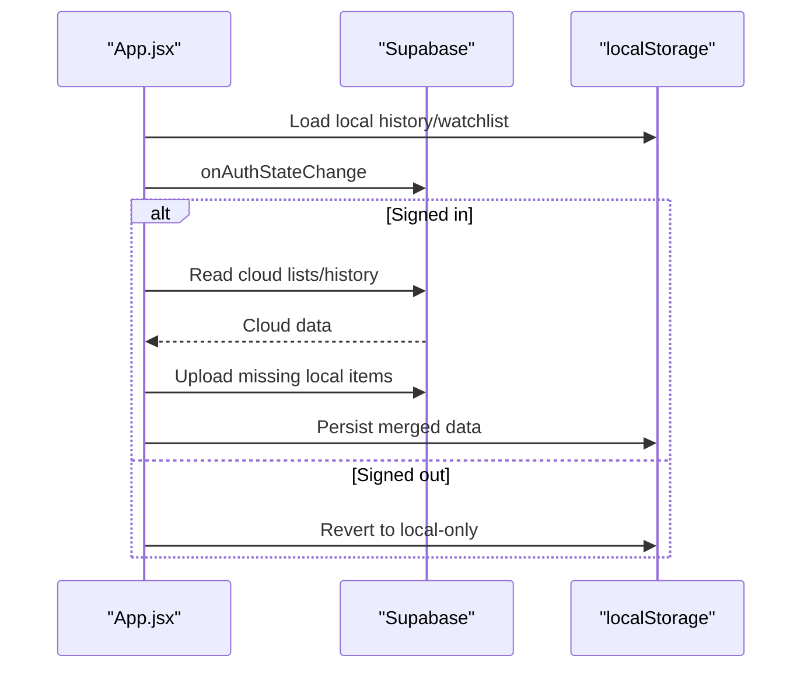

**Diagram sources**
- [App.jsx:592-725](file://src/App.jsx#L592-L725)
- [supabaseClient.js:1-98](file://src/supabaseClient.js#L1-L98)

**Section sources**
- [App.jsx:592-725](file://src/App.jsx#L592-L725)
- [supabaseClient.js:1-98](file://src/supabaseClient.js#L1-L98)

### Provider Abstraction Layer
The provider abstraction centralizes fetching from multiple sources and applies fallbacks:
- AniList GraphQL with in-memory cache and TTL.
- Backend proxy for Anilist and episode lists.
- Episode list resolution prioritizes Jikan/backend, then falls back to generated placeholders.
- Streaming sources try backend, then alternate providers, returning a safe error if none available.

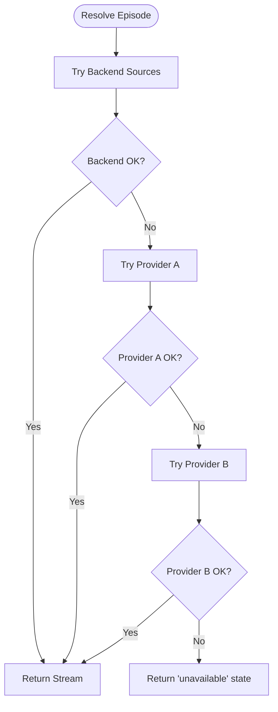

**Diagram sources**
- [mockData.js:780-818](file://src/mockData.js#L780-L818)
- [mockData.js:484-589](file://src/mockData.js#L484-L589)

**Section sources**
- [mockData.js:484-589](file://src/mockData.js#L484-L589)
- [mockData.js:780-818](file://src/mockData.js#L780-L818)

### Caching Strategy
- In-memory caches with TTL:
  - AniList responses cached by payload with a 10-minute TTL.
  - Hindi availability checks cached per AniList ID with a 30-minute TTL.
  - TMDB episode thumbnails cached per title/season/episode key.
- Local storage persistence:
  - Watch history, watchlist, liked videos, watch later, playlists stored in localStorage or Capacitor Preferences.
  - Session restore persists app view and selected items across reloads.

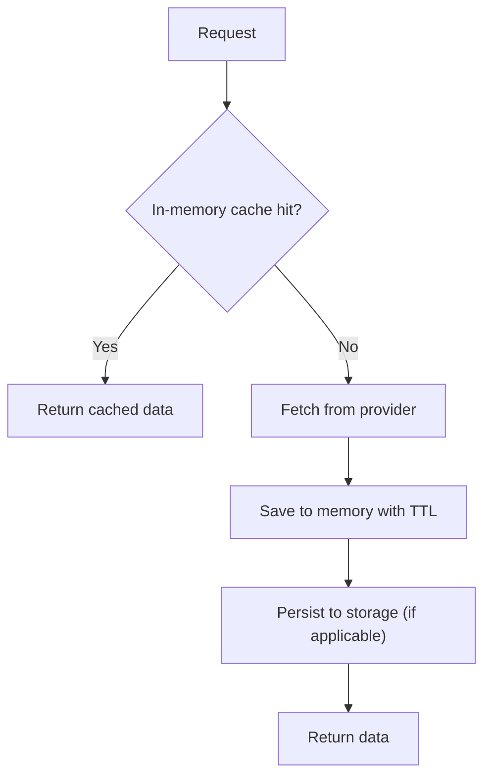

**Diagram sources**
- [mockData.js:79-150](file://src/mockData.js#L79-L150)
- [mockData.js:24-55](file://src/mockData.js#L24-L55)
- [mockData.js:249-287](file://src/mockData.js#L249-L287)
- [storage.js:1-71](file://src/utils/storage.js#L1-L71)
- [App.jsx:86-161](file://src/App.jsx#L86-L161)

**Section sources**
- [mockData.js:24-55](file://src/mockData.js#L24-L55)
- [mockData.js:79-150](file://src/mockData.js#L79-L150)
- [mockData.js:249-287](file://src/mockData.js#L249-L287)
- [storage.js:1-71](file://src/utils/storage.js#L1-L71)
- [App.jsx:86-161](file://src/App.jsx#L86-L161)

### Real-Time Data Synchronization
Supabase subscriptions drive auth state changes and enable cloud sync. When configured, the app subscribes to auth changes and merges local and cloud data. If credentials are missing, a mock client ensures the app continues to function with local-only behavior.

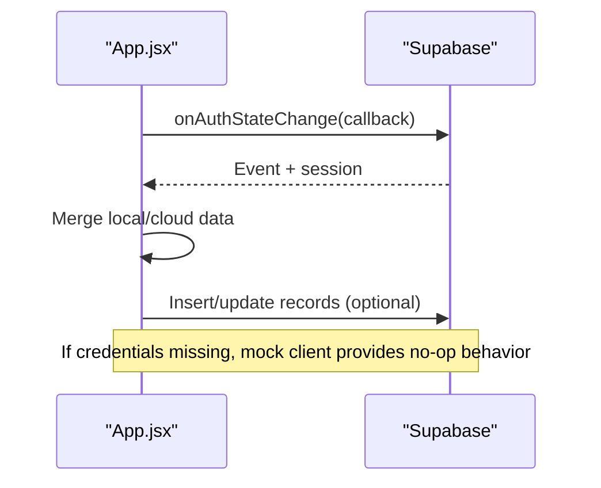

**Diagram sources**
- [App.jsx:592-725](file://src/App.jsx#L592-L725)
- [supabaseClient.js:1-98](file://src/supabaseClient.js#L1-L98)

**Section sources**
- [App.jsx:592-725](file://src/App.jsx#L592-L725)
- [supabaseClient.js:1-98](file://src/supabaseClient.js#L1-L98)

### Error Handling and Retry Logic
- Provider fallbacks: Multiple attempts across backend and external providers; final fallback returns a safe error state.
- Rate limiting: AniList 429 handled by serving cached data or null.
- Network resilience: Backend proxy retries referers for protected streams; timeouts and abort signals guard long operations.
- Graceful degradation: If Supabase is unconfigured, the app continues with local storage only.

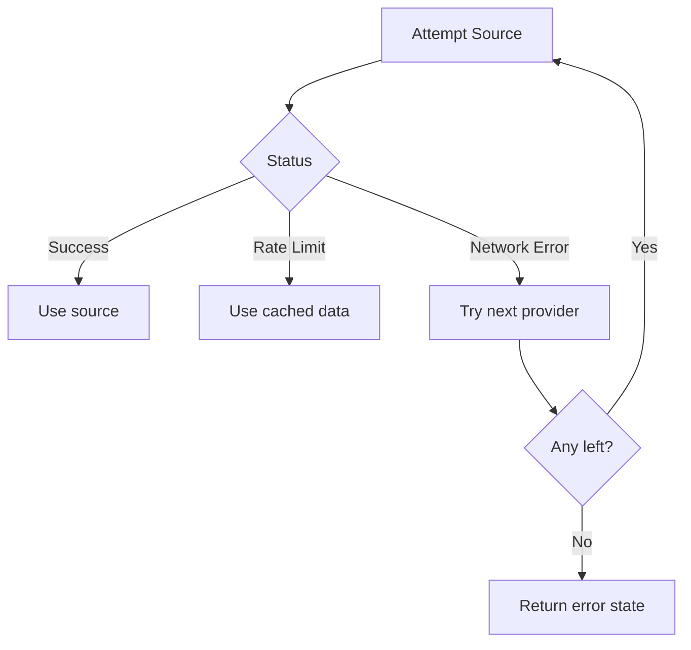

**Diagram sources**
- [mockData.js:79-150](file://src/mockData.js#L79-L150)
- [mockData.js:780-818](file://src/mockData.js#L780-L818)
- [server.js:108-148](file://server.js#L108-L148)

**Section sources**
- [mockData.js:79-150](file://src/mockData.js#L79-L150)
- [mockData.js:780-818](file://src/mockData.js#L780-L818)
- [server.js:108-148](file://server.js#L108-L148)

### Performance Considerations
- Lazy loading: Episode pages loaded on demand for long-running shows.
- Pagination: Catalog endpoints support page/limit parameters; franchise and category views use chunked batches.
- Bandwidth optimization: Image proxies set cache headers; HLS player uses worker and retry settings; avoid unnecessary network calls via in-memory caches.
- Recommendations: Content-based filtering reduces reliance on remote recommendation services.

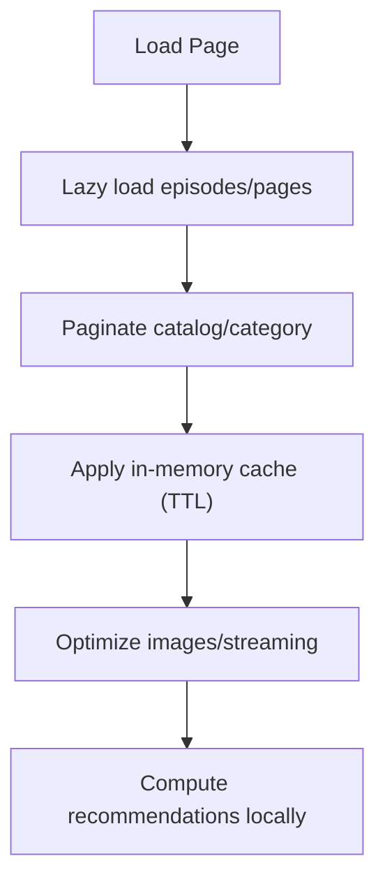

**Diagram sources**
- [mockData.js:591-600](file://src/mockData.js#L591-L600)
- [movieApi.js:11-18](file://src/features/movie/api/movieApi.js#L11-L18)
- [dramaApi.js:24-29](file://src/features/drama/api/dramaApi.js#L24-L29)
- [mockData.js:376-463](file://src/mockData.js#L376-L463)
- [cbf.js:1-65](file://src/utils/cbf.js#L1-L65)

**Section sources**
- [mockData.js:591-600](file://src/mockData.js#L591-L600)
- [movieApi.js:11-18](file://src/features/movie/api/movieApi.js#L11-L18)
- [dramaApi.js:24-29](file://src/features/drama/api/dramaApi.js#L24-L29)
- [mockData.js:376-463](file://src/mockData.js#L376-L463)
- [cbf.js:1-65](file://src/utils/cbf.js#L1-L65)

## Dependency Analysis
Key dependencies and relationships:
- App depends on runtime config to resolve API base and on feature APIs for domain-specific actions.
- Feature APIs delegate to shared API layer for cross-domain orchestration.
- Server acts as a proxy to external providers and manages CORS and stream proxies.
- Supabase client integrates with storage abstraction for persistent sessions.

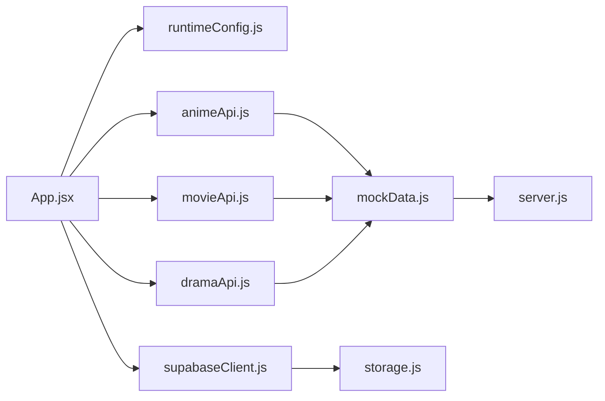

**Diagram sources**
- [App.jsx:1-120](file://src/App.jsx#L1-L120)
- [animeApi.js:1-20](file://src/features/anime/api/animeApi.js#L1-L20)
- [movieApi.js:1-32](file://src/features/movie/api/movieApi.js#L1-L32)
- [dramaApi.js:1-33](file://src/features/drama/api/dramaApi.js#L1-L33)
- [mockData.js:79-150](file://src/mockData.js#L79-L150)
- [server.js:1-200](file://server.js#L1-L200)
- [supabaseClient.js:1-98](file://src/supabaseClient.js#L1-L98)
- [storage.js:1-71](file://src/utils/storage.js#L1-L71)

**Section sources**
- [App.jsx:1-120](file://src/App.jsx#L1-L120)
- [animeApi.js:1-20](file://src/features/anime/api/animeApi.js#L1-L20)
- [movieApi.js:1-32](file://src/features/movie/api/movieApi.js#L1-L32)
- [dramaApi.js:1-33](file://src/features/drama/api/dramaApi.js#L1-L33)
- [mockData.js:79-150](file://src/mockData.js#L79-L150)
- [server.js:1-200](file://server.js#L1-L200)
- [supabaseClient.js:1-98](file://src/supabaseClient.js#L1-L98)
- [storage.js:1-71](file://src/utils/storage.js#L1-L71)

## Performance Considerations
- Prefer in-memory caches for hot paths (AniList, availability checks).
- Use pagination for large catalogs to reduce payload sizes.
- Leverage HLS.js worker and retry settings for smoother playback.
- Avoid redundant network calls by checking cache before fetching.
- Use image proxies with appropriate cache headers to minimize repeated downloads.

[No sources needed since this section provides general guidance]

## Troubleshooting Guide
Common issues and resolutions:
- No API base configured: Ensure runtime config resolves a valid base; check environment variables and static config.
- Supabase not configured: App falls back to local-only; configure credentials to enable cloud sync.
- Provider failures: Rely on built-in fallbacks; verify backend proxy health and referer handling.
- Rate limits: AniList 429 returns cached data; wait or reduce request frequency.
- Playback errors: Verify HLS support and stream URLs; check for CORS or token requirements.

**Section sources**
- [runtimeConfig.js:82-153](file://src/runtimeConfig.js#L82-L153)
- [supabaseClient.js:21-98](file://src/supabaseClient.js#L21-L98)
- [mockData.js:79-150](file://src/mockData.js#L79-L150)
- [server.js:108-148](file://server.js#L108-L148)

## Conclusion
Project Anime implements a robust data flow pattern with layered caching, provider abstraction, and resilient error handling. The architecture supports seamless transitions between discovery, streaming, and user preference synchronization, while maintaining performance through lazy loading, pagination, and bandwidth optimizations. Supabase integration enables real-time updates when configured, with graceful fallbacks ensuring continuity in all environments.

[No sources needed since this section summarizes without analyzing specific files]