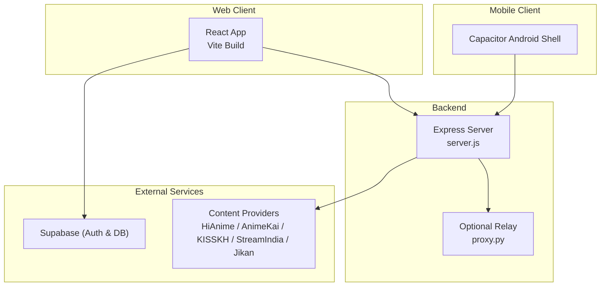
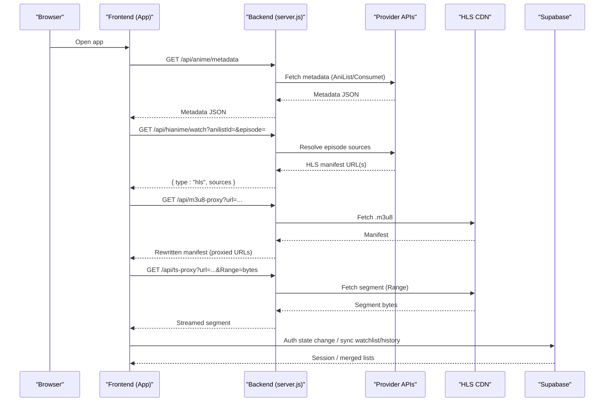
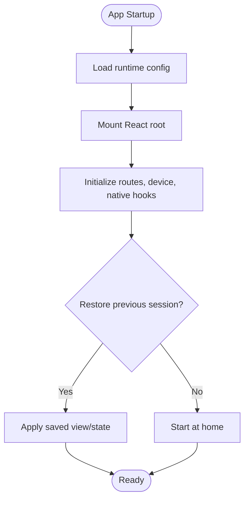
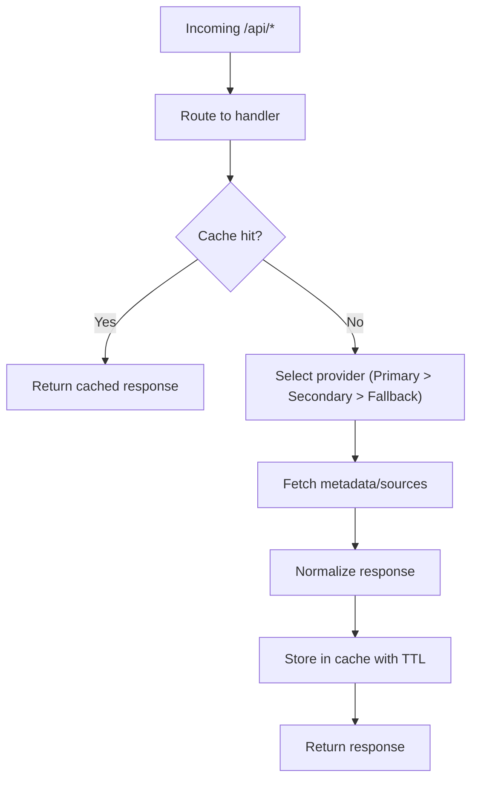
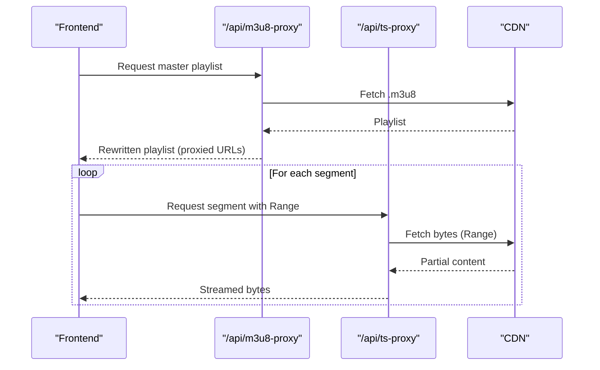
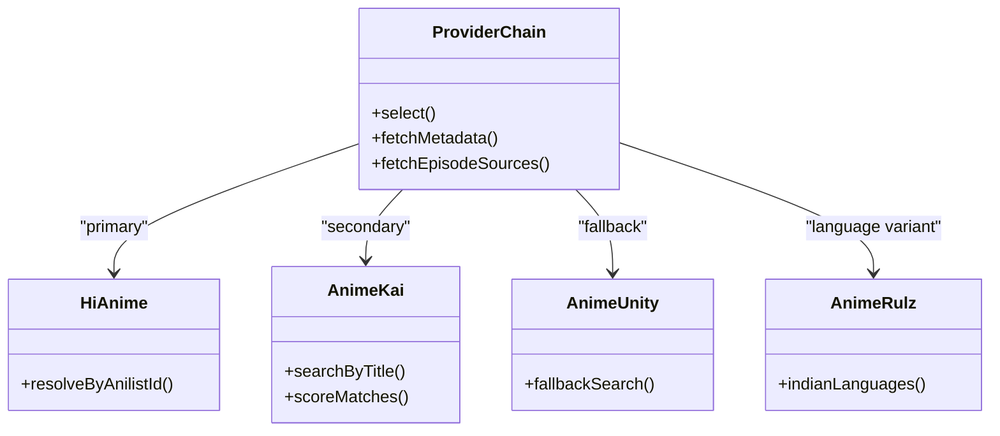
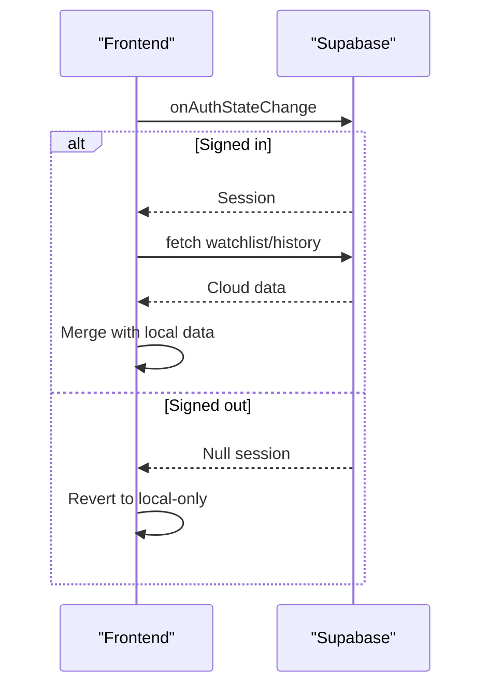
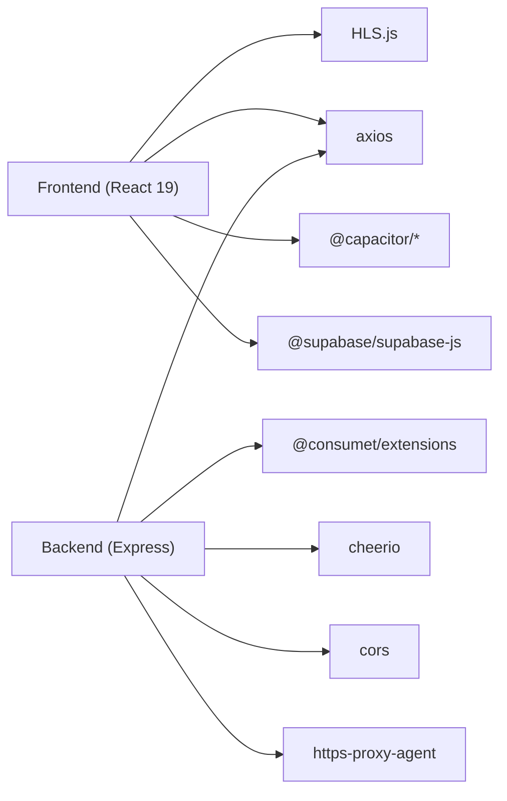

# System Design

<cite>
**Referenced Files in This Document**
- [README.md](file://README.md)
- [package.json](file://package.json)
- [vite.config.js](file://vite.config.js)
- [vercel.json](file://vercel.json)
- [capacitor.config.json](file://capacitor.config.json)
- [src/main.jsx](file://src/main.jsx)
- [src/App.jsx](file://src/App.jsx)
- [src/supabaseClient.js](file://src/supabaseClient.js)
- [server.js](file://server.js)
- [proxy.py](file://proxy.py)
</cite>

## Table of Contents
1. Introduction
2. Project Structure
3. Core Components
4. Architecture Overview
5. Detailed Component Analysis
6. Dependency Analysis
7. Performance Considerations
8. Troubleshooting Guide
9. Conclusion

## Introduction
Project Anime is a cross-platform streaming aggregator for anime, Asian dramas, and manhwa (webtoons). It delivers a Netflix-style browsing experience with adaptive HLS video playback, provider abstraction for content sources, and optional cloud sync via Supabase. The system comprises:
- A React 19 frontend built with Vite and deployed to Vercel
- An Express.js backend that scrapes and proxies content from external providers
- A Capacitor-based Android app that wraps the same web build
- Optional Python relay proxy to bypass IP restrictions on certain providers

The design emphasizes resilience through multiple provider fallbacks, robust streaming proxies for HLS manifests and segments, and a feature-based modular frontend architecture.

## Project Structure
The repository is organized into clear layers:
- Frontend (React + Vite): Feature folders under src/features/ encapsulate domain logic (anime, drama, movie, manga/manhwa), each exposing API clients and UI components.
- Backend (Express): server.js centralizes scraping, caching, and streaming proxies; proxy.py provides an optional relay for KissKH.
- Mobile (Capacitor): android/app contains the native shell and assets for the packaged web app.
- Configuration: vite.config.js handles dev-time proxying; vercel.json configures rewrites and headers; capacitor.config.json configures native plugins.

**Diagram sources**
- [README.md:10-15](file://README.md#L10-L15)
- [vite.config.js:7-21](file://vite.config.js#L7-L21)
- [capacitor.config.json:1-31](file://capacitor.config.json#L1-L31)
- [server.js:1-20](file://server.js#L1-L20)
- [proxy.py:1-36](file://proxy.py#L1-L36)

**Section sources**
- [README.md:1-15](file://README.md#L1-L15)
- [package.json:1-45](file://package.json#L1-L45)
- [vite.config.js:1-23](file://vite.config.js#L1-L23)
- [capacitor.config.json:1-32](file://capacitor.config.json#L1-L32)

## Core Components
- Frontend runtime bootstrap: Loads runtime configuration then mounts the React root.
- Application shell: Manages routing state, view transitions, session restore, auth integration, and orchestrates feature modules.
- Backend API: Provides endpoints for metadata, search, episode streams, image proxies, subtitle proxies, and HLS segment proxies. Implements provider orchestration and caching.
- Streaming proxies: Rewrites HLS manifests and forwards segment requests while preserving Range headers for efficient playback.
- Provider abstraction: Uses @consumet/extensions and custom scrapers to unify content sources across anime, drama, and comics.
- Cloud sync: Optional Supabase client with persistent storage adapter for sessions and user data.

Key technology decisions:
- React 19 with Vite for fast builds and modern DX
- HLS.js for adaptive streaming in browsers
- @consumet/extensions for provider abstraction
- Supabase for authentication and real-time data sync
- Express + Cheerio/Axios for scraping and proxying
- Capacitor for packaging the web app as Android

**Section sources**
- [src/main.jsx:1-15](file://src/main.jsx#L1-L15)
- [src/App.jsx:1-120](file://src/App.jsx#L1-L120)
- [server.js:1-20](file://server.js#L1-L20)
- [package.json:14-35](file://package.json#L14-L35)

## Architecture Overview
High-level flow:
- Web/Mobile clients request metadata and episodes from the backend.
- Backend selects a provider chain (primary, secondary, fallback) and returns normalized stream info.
- For HLS content, the frontend uses the backend’s m3u8-proxy and ts-proxy to avoid CORS and mixed-content issues.
- Optional Python relay relays traffic from trusted residential IPs when providers block datacenter/cloud IPs.
- Supabase provides optional auth and cloud persistence for watch history and watchlist.

**Diagram sources**
- [server.js:235-393](file://server.js#L235-L393)
- [server.js:738-747](file://server.js#L738-L747)
- [src/App.jsx:592-725](file://src/App.jsx#L592-L725)
- [src/supabaseClient.js:1-98](file://src/supabaseClient.js#L1-L98)

## Detailed Component Analysis

### Frontend Runtime and App Shell
- Bootstrap: main.jsx loads runtime configuration and dynamically imports the App component before mounting the React root.
- App shell: Centralized state for views, navigation, media selection, and features. Integrates device detection, native app hooks (Capacitor), session restore, and Supabase auth listeners. Maintains clean URL routing via history state and push/replace semantics.

**Diagram sources**
- [src/main.jsx:1-15](file://src/main.jsx#L1-L15)
- [src/App.jsx:240-320](file://src/App.jsx#L240-L320)
- [src/App.jsx:322-445](file://src/App.jsx#L322-L445)

**Section sources**
- [src/main.jsx:1-15](file://src/main.jsx#L1-L15)
- [src/App.jsx:240-445](file://src/App.jsx#L240-L445)

### Backend API and Provider Orchestration
- Middleware: Trusts proxies, normalizes URLs to /api/*, enables CORS, parses JSON bodies.
- Image and subtitle proxies: Bypass hotlink protection and CORS by serving assets through the backend.
- HLS proxies:
  - m3u8-proxy: Fetches master/sub-playlists, resolves relative URLs, rewrites references to backend-proxied endpoints, and preserves referer chains.
  - ts-proxy: Streams segments with Range support for instant startup and efficient seeking.
- Provider chain:
  - Primary: HiAnime via Consumet + AniList ID for deterministic season resolution.
  - Secondary: AnimeKai scraper with title matching and season-aware scoring.
  - Fallback: AnimeUnity via Consumet and AnimeRulz Indian-language sources.
- Caching: In-memory caches for episode lists, stream results, and Jikan metadata with TTLs.

**Diagram sources**
- [server.js:213-229](file://server.js#L213-L229)
- [server.js:413-425](file://server.js#L413-L425)
- [server.js:659-710](file://server.js#L659-L710)
- [server.js:738-747](file://server.js#L738-L747)

**Section sources**
- [server.js:1-20](file://server.js#L1-L20)
- [server.js:152-199](file://server.js#L152-L199)
- [server.js:235-393](file://server.js#L235-L393)
- [server.js:413-425](file://server.js#L413-L425)
- [server.js:659-710](file://server.js#L659-L710)
- [server.js:738-747](file://server.js#L738-L747)

### Streaming Proxies (HLS)
- Manifest rewriting: Resolves relative paths, fixes malformed URIs, unwraps nested proxy loops, and replaces playlist/segment URLs with backend endpoints.
- Segment streaming: Forwards Range headers to enable byte-range playback, reducing bandwidth and improving seek performance.

**Diagram sources**
- [server.js:263-345](file://server.js#L263-L345)
- [server.js:354-393](file://server.js#L354-L393)

**Section sources**
- [server.js:263-393](file://server.js#L263-L393)

### Provider Pattern and Content Sources
- Abstraction layer: @consumet/extensions provides standardized interfaces for anime providers; additional scrapers handle drama and manhwa.
- Fallback strategy: If primary fails or returns empty, try secondary and fallback providers.
- Language variants: Supports sub/dub/Hindi through provider-specific parameters and normalization.

**Diagram sources**
- [server.js:213-229](file://server.js#L213-L229)
- [server.js:518-626](file://server.js#L518-L626)
- [server.js:748-800](file://server.js#L748-L800)

**Section sources**
- [server.js:213-229](file://server.js#L213-L229)
- [server.js:518-626](file://server.js#L518-L626)
- [server.js:748-800](file://server.js#L748-L800)

### Cloud Sync and Authentication
- Supabase client: Initializes with environment variables; falls back to a mock client if credentials are missing, ensuring graceful degradation.
- Session persistence: Custom storage adapter integrates with Capacitor Preferences and localStorage.
- Data sync: On login, merges local watchlist and history with cloud records; on logout, reverts to local-only mode.

**Diagram sources**
- [src/supabaseClient.js:1-98](file://src/supabaseClient.js#L1-L98)
- [src/App.jsx:592-725](file://src/App.jsx#L592-L725)

**Section sources**
- [src/supabaseClient.js:1-98](file://src/supabaseClient.js#L1-L98)
- [src/App.jsx:592-725](file://src/App.jsx#L592-L725)

### Mobile Packaging (Capacitor)
- Native shell: Wraps the Vite-built web app (dist) and configures splash screen, status bar, and keyboard behavior.
- Mixed content: Allows mixed content for development scenarios.
- Deep linking: Handles callback URLs for OAuth flows.

**Section sources**
- [capacitor.config.json:1-32](file://capacitor.config.json#L1-L32)
- [src/App.jsx:240-278](file://src/App.jsx#L240-L278)

## Dependency Analysis
- Frontend dependencies: React 19, Vite, HLS.js, axios, lucide-react, Capacitor SDKs.
- Backend dependencies: Express, cors, axios, cheerio, @consumet/extensions, https-proxy-agent, sharp (dev).
- Dev tooling: Vite plugin for React, oxlint, TypeScript types for React.

**Diagram sources**
- [package.json:14-43](file://package.json#L14-L43)

**Section sources**
- [package.json:14-43](file://package.json#L14-L43)

## Performance Considerations
- Adaptive streaming: HLS.js with backend-maintained proxies ensures smooth bitrate adaptation and avoids CORS/mixed-content blocks.
- Byte-range streaming: ts-proxy forwards Range headers to minimize bandwidth and improve seek performance.
- Caching strategies:
  - In-memory caches for episode lists, stream results, and Jikan metadata with time-based TTLs reduce upstream load.
  - Image proxy sets long-lived cache headers for static assets.
- Provider fallbacks: Multi-tier provider selection improves reliability and reduces latency by trying faster or more available sources first.
- Build optimization: Vite provides fast HMR and optimized production builds; Vercel serves static assets with appropriate cache control.

[No sources needed since this section provides general guidance]

## Troubleshooting Guide
Common issues and mitigations:
- Empty drama/manhwa sections: Backend may be down or VITE_API_BASE points to a stale ngrok URL. Restart backend and redeploy frontend with updated env.
- Video won’t play but metadata loads: Video CDN may block backend IP; route video through the same relay used for metadata (proxy.py).
- 403 from tunnel: Tunnel provider challenges datacenter IPs; use a tunnel without edge challenges or a named Cloudflare Tunnel with Bot Fight Mode off.
- CORS errors: Ensure CORS_ORIGIN allows the frontend origin; verify Vite dev proxy or production base URL configuration.
- HLS not starting: Confirm m3u8-proxy and ts-proxy are reachable and that X-Forwarded-* headers resolve the correct public host behind tunnels.

Operational tips:
- Keep proxy.py on a separate port from the API server.
- When using ngrok, update VITE_API_BASE and redeploy the frontend whenever the URL changes.
- Prefer named Cloudflare Tunnels for stable public URLs.

**Section sources**
- [README.md:144-160](file://README.md#L144-L160)
- [README.md:76-84](file://README.md#L76-L84)
- [server.js:263-393](file://server.js#L263-L393)
- [proxy.py:1-36](file://proxy.py#L1-L36)

## Conclusion
Project Anime implements a resilient, scalable streaming platform with a clear separation of concerns:
- A feature-driven React frontend for rich UX and cross-platform delivery
- An Express backend providing provider abstraction, scraping, and robust streaming proxies
- Optional mobile packaging via Capacitor
- Optional cloud sync with Supabase

The design prioritizes reliability through multi-provider fallbacks, efficient HLS streaming via proxies, and pragmatic infrastructure choices suited to constrained environments. With proper tunneling and environment configuration, the system supports both web and mobile users across diverse network conditions.

[No sources needed since this section summarizes without analyzing specific files]