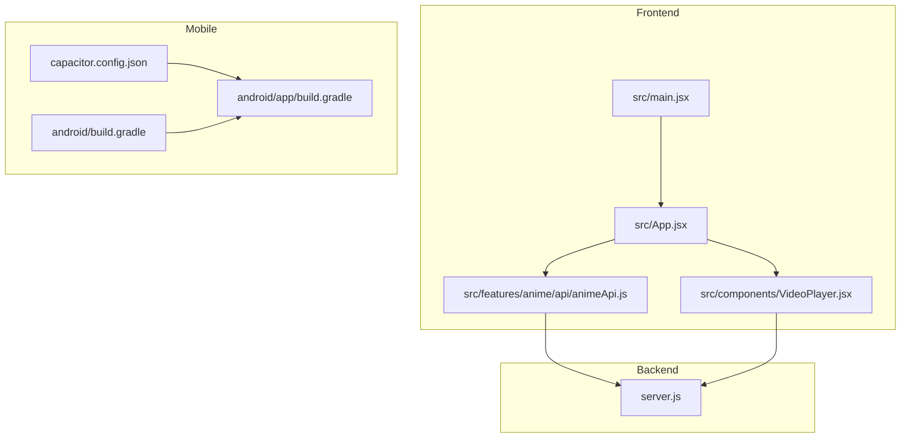
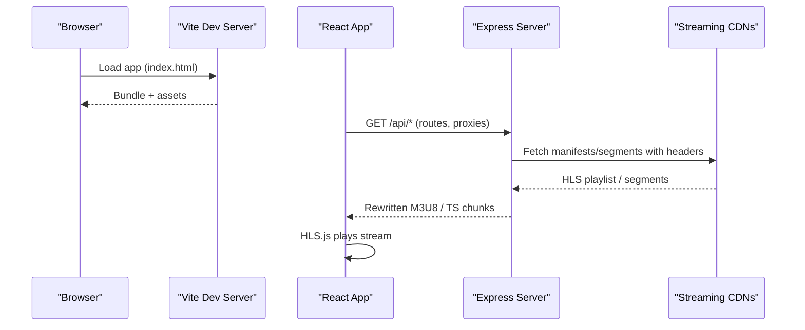
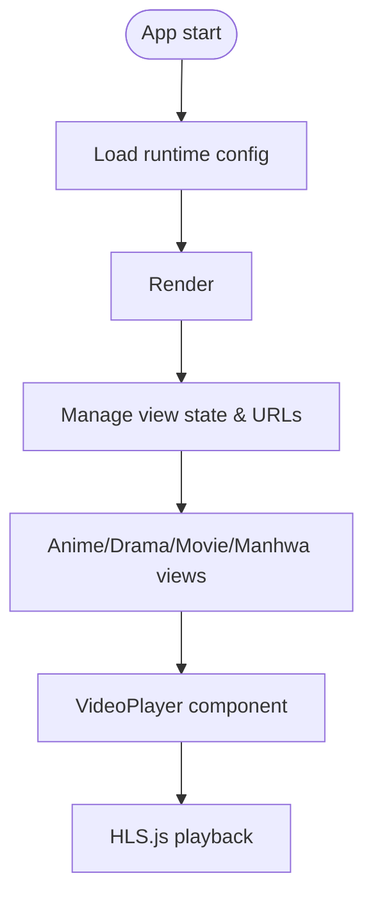
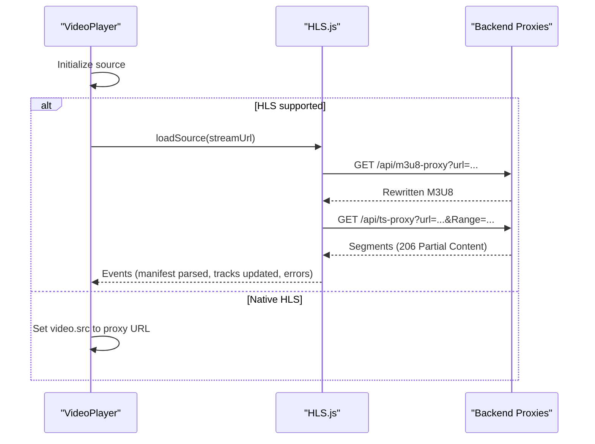
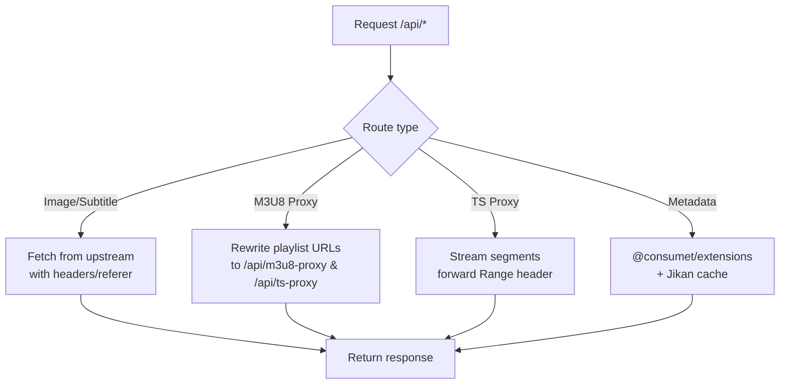
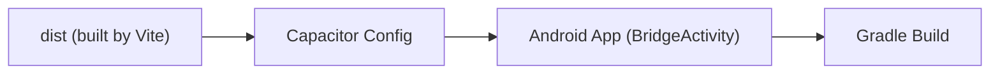
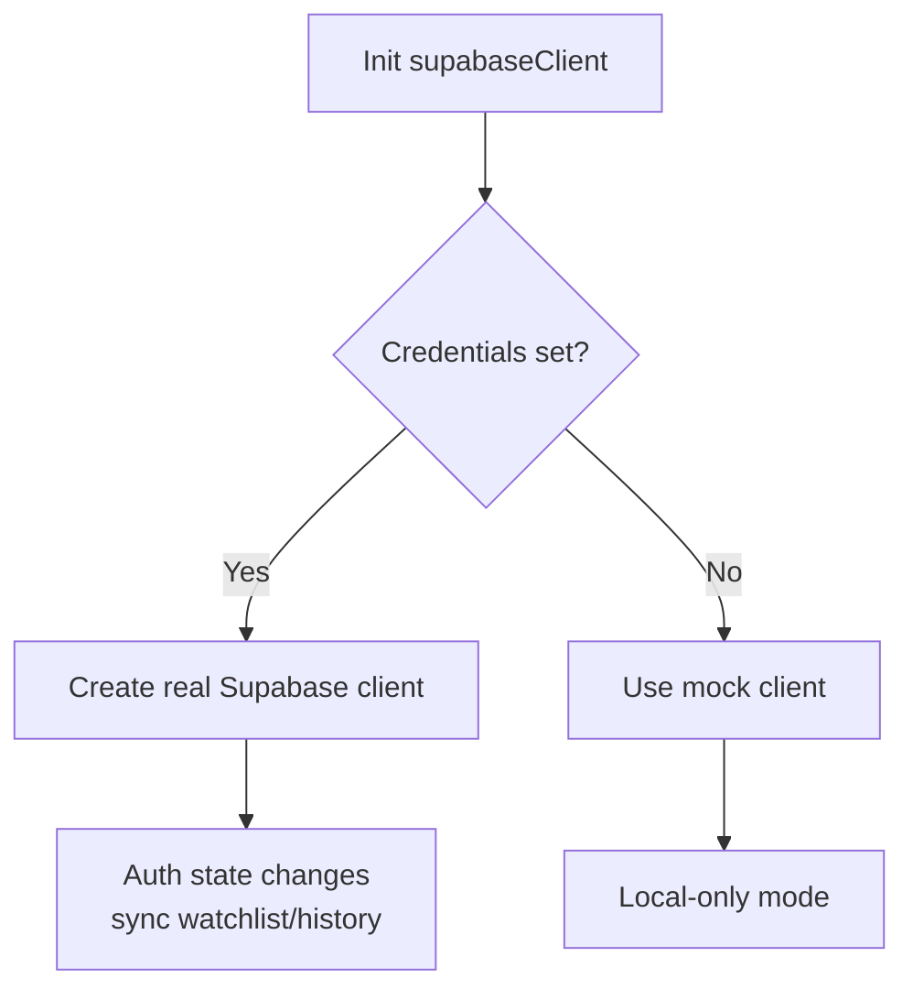
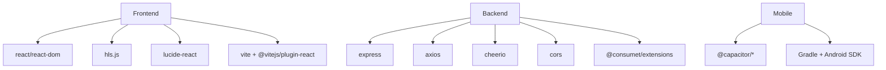

# Technology Stack

<cite>
**Referenced Files in This Document**
- [package.json](file://package.json)
- [vite.config.js](file://vite.config.js)
- [capacitor.config.json](file://capacitor.config.json)
- [android/app/build.gradle](file://android/app/build.gradle)
- [android/build.gradle](file://android/build.gradle)
- [server.js](file://server.js)
- [src/main.jsx](file://src/main.jsx)
- [src/App.jsx](file://src/App.jsx)
- [src/components/VideoPlayer.jsx](file://src/components/VideoPlayer.jsx)
- [src/supabaseClient.js](file://src/supabaseClient.js)
- [src/features/anime/api/animeApi.js](file://src/features/anime/api/animeApi.js)
</cite>

## Table of Contents
1. Introduction
2. Project Structure
3. Core Components
4. Architecture Overview
5. Detailed Component Analysis
6. Dependency Analysis
7. Performance Considerations
8. Troubleshooting Guide
9. Conclusion

## Introduction
This document describes the technology stack for Project Anime across frontend, backend, and mobile layers. It explains how React 19 with functional components and hooks is used with Vite for fast development and optimized builds, CSS/SASS for styling, and HLS.js for adaptive streaming. The backend uses Node.js with Express, Cheerio for HTML parsing, Axios for HTTP requests, and a Supabase client for authentication and data sync. Mobile packaging is handled via Capacitor with Android build automation using Gradle and Java. Third-party integrations include @consumet/extensions for content providers, Supabase for auth and real-time capabilities, and various streaming APIs proxied through the backend.

## Project Structure
Project Anime is organized into:
- Frontend (React + Vite): src directory contains components, features, utilities, and entry points.
- Backend (Node/Express): server.js provides API routes, proxies, and provider integrations.
- Mobile (Capacitor + Android): android directory holds native app configuration and Gradle build files; capacitor.config.json configures splash screen, status bar, and keyboard behavior.
- Build and dev tooling: package.json defines scripts and dependencies; vite.config.js configures dev server proxying to backend and external services.

**Diagram sources**
- [src/main.jsx:1-15](file://src/main.jsx#L1-L15)
- [src/App.jsx:1-800](file://src/App.jsx#L1-L800)
- [src/components/VideoPlayer.jsx:1-800](file://src/components/VideoPlayer.jsx#L1-L800)
- [src/features/anime/api/animeApi.js:1-20](file://src/features/anime/api/animeApi.js#L1-L20)
- [server.js:1-800](file://server.js#L1-L800)
- [capacitor.config.json:1-32](file://capacitor.config.json#L1-L32)
- [android/app/build.gradle:1-55](file://android/app/build.gradle#L1-L55)
- [android/build.gradle:1-30](file://android/build.gradle#L1-L30)

**Section sources**
- [package.json:1-45](file://package.json#L1-L45)
- [vite.config.js:1-23](file://vite.config.js#L1-L23)
- [capacitor.config.json:1-32](file://capacitor.config.json#L1-L32)
- [android/app/build.gradle:1-55](file://android/app/build.gradle#L1-L55)
- [android/build.gradle:1-30](file://android/build.gradle#L1-L30)

## Core Components
- Frontend runtime: React 19 with functional components and hooks; Vite plugin for React; dynamic import of App at runtime.
- Video playback: HLS.js-based player with quality selection, audio track switching, CC support, skip intro/end, fullscreen/PiP, and scrubbing previews.
- Backend API: Express server providing image proxies, subtitle proxies, HLS manifest and segment proxies, episode metadata, health checks, and provider integrations.
- Mobile packaging: Capacitor config for splash/status bar/keyboard; Android Gradle build with Capacitor bridge activity.
- Data and auth: Supabase client with custom storage adapter; graceful fallback to local storage when credentials are missing.

**Section sources**
- [src/main.jsx:1-15](file://src/main.jsx#L1-L15)
- [src/components/VideoPlayer.jsx:1-800](file://src/components/VideoPlayer.jsx#L1-L800)
- [server.js:1-800](file://server.js#L1-L800)
- [capacitor.config.json:1-32](file://capacitor.config.json#L1-L32)
- [android/app/build.gradle:1-55](file://android/app/build.gradle#L1-L55)
- [src/supabaseClient.js:1-98](file://src/supabaseClient.js#L1-L98)

## Architecture Overview
The system follows a client-server architecture with a web frontend served by Vite, a Node/Express backend that proxies and normalizes third-party streams, and a Capacitor-packaged Android app. The frontend communicates with the backend via relative /api routes during development (proxied by Vite) or directly in production. Streaming assets are fetched through backend proxies to handle CORS, referer requirements, and byte-range requests for efficient HLS playback.

**Diagram sources**
- [vite.config.js:1-23](file://vite.config.js#L1-L23)
- [server.js:1-800](file://server.js#L1-L800)
- [src/components/VideoPlayer.jsx:1-800](file://src/components/VideoPlayer.jsx#L1-L800)

## Detailed Component Analysis

### Frontend: React 19 + Vite
- Entry point dynamically imports App after loading runtime config, then renders within StrictMode.
- App orchestrates routing state, media views, auth integration with Supabase, and native app handlers via Capacitor.
- Features are modularized under src/features with per-feature API modules (e.g., animeApi.js).

**Diagram sources**
- [src/main.jsx:1-15](file://src/main.jsx#L1-L15)
- [src/App.jsx:1-800](file://src/App.jsx#L1-L800)
- [src/components/VideoPlayer.jsx:1-800](file://src/components/VideoPlayer.jsx#L1-L800)

**Section sources**
- [src/main.jsx:1-15](file://src/main.jsx#L1-L15)
- [src/App.jsx:1-800](file://src/App.jsx#L1-L800)
- [src/features/anime/api/animeApi.js:1-20](file://src/features/anime/api/animeApi.js#L1-L20)

### Video Player: HLS.js Integration
- Detects HLS vs native HLS vs direct MP4 and initializes accordingly.
- Exposes quality levels, audio tracks, CC toggling, seek steps, fullscreen/PiP, and scrubbing preview.
- Integrates AniSkip for intro/end skipping based on MAL ID and episode number.

**Diagram sources**
- [src/components/VideoPlayer.jsx:1-800](file://src/components/VideoPlayer.jsx#L1-L800)
- [server.js:235-393](file://server.js#L235-L393)

**Section sources**
- [src/components/VideoPlayer.jsx:1-800](file://src/components/VideoPlayer.jsx#L1-L800)

### Backend: Express + Providers + Proxies
- Provides image proxy, subtitle proxy, HLS manifest proxy, and TS segment proxy with proper headers and range forwarding.
- Integrates @consumet/extensions for anime metadata and streaming resolution, plus custom scrapers and provider helpers.
- Caches results (titles, episodes, catalogs) to reduce external calls.

**Diagram sources**
- [server.js:152-393](file://server.js#L152-L393)
- [server.js:662-710](file://server.js#L662-L710)

**Section sources**
- [server.js:1-800](file://server.js#L1-L800)

### Mobile: Capacitor + Android
- Capacitor config sets app ID, name, webDir, splash screen, status bar, and keyboard behavior.
- Android module uses Capacitor BridgeActivity and Gradle to build the APK; top-level Gradle applies variables and repositories.

**Diagram sources**
- [capacitor.config.json:1-32](file://capacitor.config.json#L1-L32)
- [android/app/src/main/java/com/eetnet/app/MainActivity.java:1-6](file://android/app/src/main/java/com/eetnet/app/MainActivity.java#L1-L6)
- [android/app/build.gradle:1-55](file://android/app/build.gradle#L1-L55)
- [android/build.gradle:1-30](file://android/build.gradle#L1-L30)

**Section sources**
- [capacitor.config.json:1-32](file://capacitor.config.json#L1-L32)
- [android/app/build.gradle:1-55](file://android/app/build.gradle#L1-L55)
- [android/build.gradle:1-30](file://android/build.gradle#L1-L30)

### Authentication and Data Sync: Supabase Client
- Initializes Supabase client with environment variables and a custom storage adapter bridging Capacitor Preferences and localStorage.
- Falls back to a mock client if credentials are not configured, ensuring the app remains functional without cloud features.

**Diagram sources**
- [src/supabaseClient.js:1-98](file://src/supabaseClient.js#L1-L98)
- [src/App.jsx:592-725](file://src/App.jsx#L592-L725)

**Section sources**
- [src/supabaseClient.js:1-98](file://src/supabaseClient.js#L1-L98)
- [src/App.jsx:592-725](file://src/App.jsx#L592-L725)

## Dependency Analysis
Key dependencies and their roles:
- Frontend: react/react-dom for UI, hls.js for adaptive streaming, lucide-react for icons.
- Backend: express for routing, axios for HTTP, cheerio for HTML parsing, cors for cross-origin handling, @consumet/extensions for provider abstractions.
- Mobile: @capacitor/* packages for native bridges; Android Gradle plugins for building.
- Dev tools: vite and @vitejs/plugin-react for fast dev and builds; oxlint for linting.

**Diagram sources**
- [package.json:14-43](file://package.json#L14-L43)
- [android/build.gradle:3-18](file://android/build.gradle#L3-L18)
- [android/app/build.gradle:27-43](file://android/app/build.gradle#L27-L43)

**Section sources**
- [package.json:1-45](file://package.json#L1-L45)
- [android/build.gradle:1-30](file://android/build.gradle#L1-L30)
- [android/app/build.gradle:1-55](file://android/app/build.gradle#L1-L55)

## Performance Considerations
- HLS streaming: Backend proxies enforce Range headers for byte-range requests, enabling instant startup and efficient buffering.
- Caching: In-memory caches for titles, episodes, and catalogs reduce repeated external calls and improve responsiveness.
- Dev experience: Vite’s HMR and proxy configuration streamline development by forwarding API calls to the local backend.
- Mobile: Capacitor’s minimal bridge and Gradle build pipeline provide efficient packaging and native performance.

[No sources needed since this section provides general guidance]

## Troubleshooting Guide
Common issues and resolutions:
- Missing Supabase credentials: App falls back to local storage; configure VITE_SUPABASE_URL and VITE_SUPABASE_ANON_KEY to enable cloud sync and social login.
- Stream failures: Ensure backend proxies are reachable; check CORS and referer headers; verify HLS manifest rewriting and segment proxy endpoints.
- Provider blocks: Backend sets browser-like User-Agent and Referer; some providers require specific origins or tokens; consult logs for retry behavior.
- Mobile splash/status bar: Adjust capacitor.config.json settings for desired behavior on Android.

**Section sources**
- [src/supabaseClient.js:21-46](file://src/supabaseClient.js#L21-L46)
- [server.js:74-92](file://server.js#L74-L92)
- [server.js:235-393](file://server.js#L235-L393)
- [capacitor.config.json:1-32](file://capacitor.config.json#L1-L32)

## Conclusion
Project Anime combines a modern React 19 frontend with Vite for rapid development, a robust Node/Express backend for provider abstraction and streaming proxies, and Capacitor for mobile packaging. The stack balances performance (HLS byte-range streaming, caching), scalability (modular backend routes and provider integrations), and developer experience (Vite dev server, clear separation of concerns). With Supabase integration for auth and data sync, the application supports both local-only and cloud-backed modes, making it adaptable to different deployment scenarios.

[No sources needed since this section summarizes without analyzing specific files]