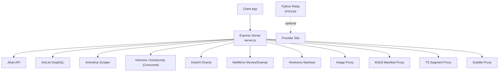
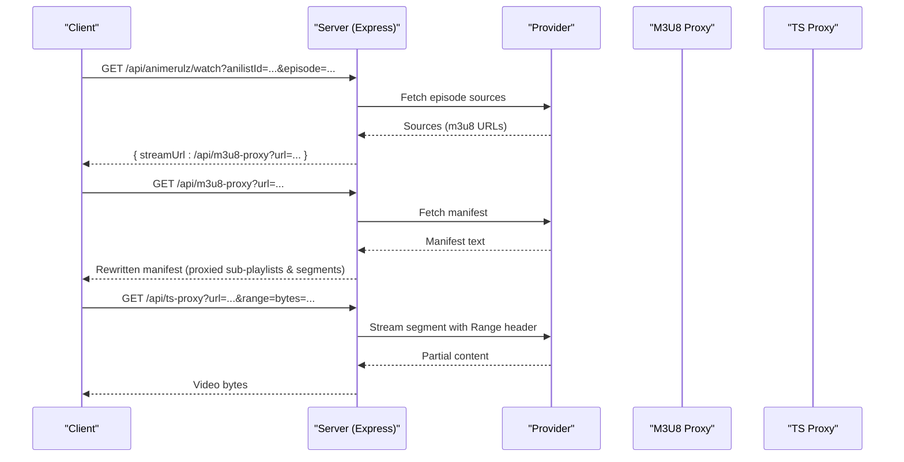
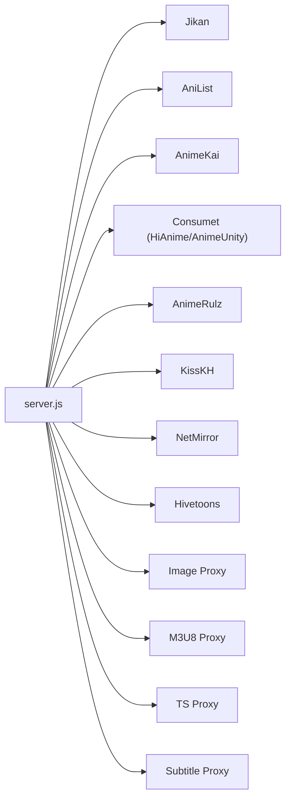

# API Endpoints Reference

<cite>
**Referenced Files in This Document**
- [server.js](file://server.js)
- [proxy.py](file://proxy.py)
- [api/index.js](file://api/index.js)
</cite>

## Table of Contents
1. [Introduction](#introduction)
2. [Project Structure](#project-structure)
3. [Core Components](#core-components)
4. [Architecture Overview](#architecture-overview)
5. [Detailed Component Analysis](#detailed-component-analysis)
6. [Dependency Analysis](#dependency-analysis)
7. [Performance Considerations](#performance-considerations)
8. [Troubleshooting Guide](#troubleshooting-guide)
9. [Conclusion](#conclusion)
10. [Appendices](#appendices)

## Introduction
This document provides comprehensive API documentation for the backend endpoints exposed by the application server. It covers health checks, content discovery (anime, drama, manga/webtoon), streaming endpoints for M3U8 manifests and TS segments, subtitles, and provider-specific parameters. It also documents authentication requirements, rate limiting behavior, error response formats, and request/response examples.

The server is an Express-based Node.js application that proxies and normalizes requests to external providers (e.g., Jikan, AniList, AnimeKai, HiAnime/Consumet, KissKH, NetMirror, Hivetoons). It includes CORS support, a URL normalizer for serverless deployments, and multiple caching layers to reduce external calls.

## Project Structure
At runtime, the Express app is defined in the main server file and exported via a small entry module. A separate Python helper serves as a relay for specific provider traffic when needed.

**Diagram sources**
- [server.js:1-28](file://server.js#L1-L28)
- [server.js:152-199](file://server.js#L152-L199)
- [server.js:235-393](file://server.js#L235-L393)
- [proxy.py:1-36](file://proxy.py#L1-L36)

**Section sources**
- [server.js:1-28](file://server.js#L1-L28)
- [api/index.js:1-4](file://api/index.js#L1-L4)
- [proxy.py:1-36](file://proxy.py#L1-L36)

## Core Components
- Health and status endpoints for service monitoring and provider reachability.
- Content discovery endpoints for anime, drama, manga/webtoon catalogs and details.
- Streaming endpoints that proxy HLS manifests and video segments with correct headers and range support.
- Subtitle proxy endpoints for VTT files.
- Image proxy endpoints to bypass hotlink restrictions.
- Provider-specific endpoints for AnimeRulz, HiAnime/Consumet, AnimeKai, KissKH, NetMirror, and Hivetoons.

**Section sources**
- [server.js:715-735](file://server.js#L715-L735)
- [server.js:1304-1336](file://server.js#L1304-L1336)
- [server.js:1606-1617](file://server.js#L1606-L1617)
- [server.js:1863-2043](file://server.js#L1863-L2043)
- [server.js:2321-2800](file://server.js#L2321-L2800)

## Architecture Overview
The server acts as a unified API gateway:
- Normalizes URLs for serverless environments.
- Proxies and rewrites media URLs to ensure CORS and referer compliance.
- Caches metadata and streams to reduce latency and external load.
- Provides robust fallbacks across providers.

**Diagram sources**
- [server.js:1048-1089](file://server.js#L1048-L1089)
- [server.js:263-345](file://server.js#L263-L345)
- [server.js:354-393](file://server.js#L354-L393)

## Detailed Component Analysis

### Health and Status
- GET /api/health
  - Purpose: Service monitoring and status reporting.
  - Response fields: status, service name, startedAt, uptimeSeconds, publicBase, port, corsOrigin, providers, config.
  - Example response shape:
    - { status: "ok", service: "eetnet-backend", startedAt: "...", uptimeSeconds: N, publicBase: "...", port: 8080, corsOrigin: "*", providers: {...}, config: {...} }
  - Authentication: None.
  - Rate limiting: Not enforced at this endpoint.

- GET /api/status
  - Purpose: Provider reachability check; optionally deep probe.
  - Query params: deep (true|1) to include additional provider checks.
  - Response fields: status ("ok" or "degraded"), checkedAt, publicBase, deep flag, results array with per-provider ok, status, ms, and optional error.
  - Authentication: None.
  - Rate limiting: Not enforced.

**Section sources**
- [server.js:715-735](file://server.js#L715-L735)
- [server.js:1304-1336](file://server.js#L1304-L1336)

### Anime Discovery and Streaming
- GET /api/info/:anilistId
  - Purpose: Retrieve anime info and episodes via META.Anilist + Consumet.
  - Path param: anilistId (number).
  - Response fields: id, title, description, image, cover, rating, type, status, totalEpisodes, currentEpisode, duration, genres, subOrDub, episodes[].
  - Authentication: None.
  - Rate limiting: Uses internal cache with TTL.

- GET /api/hianime/watch
  - Purpose: Primary stream provider using HiAnime via Consumet.
  - Query params: anilistId (required), episode (default 1), dub (eng -> dub; otherwise sub).
  - Response fields: provider, type ("hls"), sources[], subtitles[], episode, episodeTitle, audioMode.
  - Authentication: None.
  - Rate limiting: Uses internal caches for episode lists.

- GET /api/gogoanime/watch
  - Purpose: AnimeKai scraper-based stream resolution with parallel server probing.
  - Query params: title (required), episode (default 1), season (optional), dub ("eng" to prefer dub).
  - Response fields: provider ("animekai"), type ("hls" or "iframe" fallback), streamUrl (proxied), subtitleUrl, headers, episode, language, server, allServers.
  - Authentication: None.
  - Rate limiting: Uses internal caches for slug and stream extraction.

- GET /api/animerulz/watch
  - Purpose: AnimeRulz stream resolution supporting Indian languages and fallback providers.
  - Query params: anilistId (required), episode (default 1), lang (hin|tam|tel|eng|jpn; default hin).
  - Response fields: type ("hls"), streamUrl (proxied), sources[], subtitles[], headers, provider ("animerulz"), language, audioMode.
  - Authentication: None.
  - Rate limiting: Uses internal caches for availability, episodes, and streams.

- GET /api/animerulz/episodes
  - Purpose: Episode list for a given anilistId from AnimeRulz.
  - Query params: anilistId (required).
  - Response fields: total, episodes[].
  - Authentication: None.

- GET /api/animerulz/availability
  - Purpose: Check if an anime has Indian language tracks on AnimeRulz.
  - Query params: anilistId (required).
  - Response fields: available (boolean), languages[], animerulz_id (if available).
  - Authentication: None.

- GET /api/animerulz/catalog
  - Purpose: Paginated catalog of AnimeRulz entries filtered by language.
  - Query params: language/lang (default hindi), page (default 1), limit (max 500).
  - Response fields: language, total, page, pages, items[].
  - Authentication: None.

- GET /api/watch/:episodeId
  - Purpose: Fallback stream resolution via AnimeUnity (Consumet) and direct AnimeUnity.
  - Path param: episodeId.
  - Response fields: provider ("animeunity" or "animeunity-direct"), type ("hls"), sources[], subtitles[], headers.
  - Authentication: None.

- GET /api/search
  - Purpose: Search anime titles via AnimeKai.
  - Query params: q (required).
  - Response fields: slug, results[].
  - Authentication: None.

- GET /api/episodes/mal/:malId
  - Purpose: Jikan episode metadata proxy (titles, air dates, filler/recap flags).
  - Path param: malId.
  - Query params: page (default 1).
  - Response fields: episodes[], pagination{ currentPage, lastPage, hasNextPage, total }.
  - Authentication: None.
  - Rate limiting: Internal cache with TTL.

- POST /api/anilist
  - Purpose: Server-side cached and rate-limit-aware proxy for AniList GraphQL.
  - Request body: JSON GraphQL query.
  - Response fields: data (GraphQL result).
  - Authentication: None.
  - Rate limiting: Retries on 429 with backoff; uses in-memory cache.

**Section sources**
- [server.js:1342-1376](file://server.js#L1342-L1376)
- [server.js:1210-1278](file://server.js#L1210-L1278)
- [server.js:1382-1559](file://server.js#L1382-L1559)
- [server.js:1048-1155](file://server.js#L1048-L1155)
- [server.js:1564-1601](file://server.js#L1564-L1601)
- [server.js:1606-1617](file://server.js#L1606-L1617)
- [server.js:662-710](file://server.js#L662-L710)
- [server.js:1164-1208](file://server.js#L1164-L1208)

### Streaming Infrastructure (M3U8, TS, Subtitles)
- GET /api/m3u8-proxy
  - Purpose: Proxy and rewrite HLS manifests; replaces sub-playlist and segment URLs with proxied versions.
  - Query params: url (required, base64-safe encoded), referer (optional).
  - Response: application/vnd.apple.mpegurl with rewritten references.
  - Authentication: None.
  - Notes: Handles nested proxy URLs and known problematic relays; sets CORS.

- GET /api/ts-proxy
  - Purpose: Stream video/audio segments with Range header forwarding for byte-range playback.
  - Query params: url (required), referer (optional).
  - Response: Binary stream with appropriate headers (Accept-Ranges, Content-Type, Content-Length/Range).
  - Authentication: None.
  - Notes: Supports partial content (206) responses from upstream.

- GET /api/subtitle-proxy
  - Purpose: Proxy VTT subtitle files to bypass CORS.
  - Query params: url (required).
  - Response: text/vtt with CORS enabled.
  - Authentication: None.

- GET /api/img-proxy
  - Purpose: Proxy images to bypass hotlink restrictions; supports ComicK paths.
  - Query params: url (required).
  - Response: Image binary with appropriate content-type and cache headers.
  - Authentication: None.

- GET /api/drama/subtitle
  - Purpose: Drama subtitle proxy; ensures WEBVTT format and CORS.
  - Query params: url (required).
  - Response: text/vtt.
  - Authentication: None.

**Section sources**
- [server.js:263-345](file://server.js#L263-L345)
- [server.js:354-393](file://server.js#L354-L393)
- [server.js:235-256](file://server.js#L235-L256)
- [server.js:152-199](file://server.js#L152-L199)
- [server.js:2019-2043](file://server.js#L2019-L2043)

### Drama (KissKH)
- GET /api/drama/home
  - Purpose: Curated drama home sections (show, korean, chinese, topRating, lastUpdate).
  - Response fields: show[], korean[], chinese[], topRating[], lastUpdate[].
  - Authentication: None.
  - Rate limiting: In-memory cache with TTL.

- GET /api/drama/list
  - Purpose: Search drama list with optional type and query.
  - Query params: type (default 0), q (optional).
  - Response fields: list data from provider.
  - Authentication: None.

- GET /api/drama/search
  - Purpose: Drama search endpoint.
  - Query params: q (required).
  - Response fields: search results.
  - Authentication: None.

- GET /api/drama/info/:dramaId
  - Purpose: Drama detail and episode list.
  - Path param: dramaId.
  - Response fields: drama info and episodes.
  - Authentication: None.

- GET /api/drama/stream/:episodeId
  - Purpose: Resolve stream URL and subtitles for a drama episode.
  - Path param: episodeId.
  - Response fields: episodeId, type ("hls" or "mp4"), streamUrl (proxied if m3u8), subtitles[].
  - Authentication: None.
  - Notes: Uses enc-dec.app to generate keys; may redirect to proxy for CORS.

**Section sources**
- [server.js:1863-2043](file://server.js#L1863-L2043)

### Manga/Webtoon
- GET /api/manga/home
  - Purpose: Manga landing data (bento top 10 and category previews).
  - Response fields: bentoTop10[], manhwaPreview[], mangaPreview[], manhuaPreview[], trending[], popular[], topRated[], featured.
  - Authentication: None.

- GET /api/manga/category/:type
  - Purpose: Category browsing for manga/manhwa/manhua with optional genre filter and pagination.
  - Path param: type (manga|manhwa|manhua).
  - Query params: genre (optional), page (default 1), perPage (default 24, max 50).
  - Response fields: type, country, genre, page, perPage, total, hasMore, items[], trending[], popular[], topPick[], recent[].
  - Authentication: None.

- GET /api/manga/search
  - Purpose: Search manga titles.
  - Query params: q (optional; returns empty array if missing).
  - Response fields: results[].
  - Authentication: None.

- GET /api/manga/info/:id
  - Purpose: Manga series info and chapters; supports numeric AniList ID resolution.
  - Path param: id (slug or numeric AniList ID).
  - Response fields: id, comickSlug, title, cover, banner, description, status, rating, genres, chapters[].
  - Authentication: None.

- GET /api/webtoon/home
  - Purpose: Curated webtoon landing data via AniList; falls back to manga/home on failure.
  - Response fields: trending[], popular[], featured[], schedule{}, all[].
  - Authentication: None.

- GET /api/webtoon/category/:type
  - Purpose: Webtoon category browsing with optional genre filter; falls back to manga/category on failure.
  - Path param: type.
  - Query params: genre (optional).
  - Response fields: type, genre, trending[], popular[], items[], recent[].
  - Authentication: None.

**Section sources**
- [server.js:2321-2465](file://server.js#L2321-L2465)
- [server.js:2654-2800](file://server.js#L2654-L2800)
- [server.js:2610-2652](file://server.js#L2610-L2652)

### NetMirror (Movies/Dramas)
- GET /api/netmirror/search
  - Purpose: Search movies/shows by title.
  - Query params: q (required).
  - Response fields: results[] with id, title, year, rating, type.
  - Authentication: None.

- GET /api/netmirror/post/:id
  - Purpose: Get details and episodes for a NetMirror title.
  - Path param: id.
  - Response fields: post data including episodes.
  - Authentication: None.

- GET /api/netmirror/playlist/:id
  - Purpose: Get HLS playlist sources for a NetMirror title; rewrites URLs through m3u8-proxy.
  - Path param: id.
  - Response fields: sources[], tracks[].
  - Authentication: None.

- GET /api/netmirror/trending
  - Purpose: Trending catalog via HTML parsing; images proxied.
  - Response fields: movies[] with id, title, year, coverImage, bannerImage, type.
  - Authentication: None.

- GET /api/netmirror/stream-resolve
  - Purpose: Resolve stream sources for a movie/show; handles series episodes and generates proper playlist parameters.
  - Query params: id or title (required), year (optional), type (movie|tv; default movie), season (default 1), episode (default 1), ott (nf|pv|hs; default nf).
  - Response fields: netmirrorId, title, year, sources[], tracks[].
  - Authentication: None.

**Section sources**
- [server.js:1780-1850](file://server.js#L1780-L1850)
- [server.js:2045-2109](file://server.js#L2045-L2109)
- [server.js:2112-2196](file://server.js#L2112-L2196)

### Optional Python Relay
- Python HTTP server proxy.py forwards requests to kisskh.co with custom headers and disables TLS verification.
- Intended to run on a separate port to avoid conflicts with the Node server.
- Useful when cloud IPs are blocked by provider WAFs.

**Section sources**
- [proxy.py:1-36](file://proxy.py#L1-L36)

## Dependency Analysis
- External APIs:
  - Jikan (MyAnimeList): Episode metadata.
  - AniList GraphQL: Metadata and webtoon curation.
  - Consumet (HiAnime/AnimeUnity): Episode sources and metadata.
  - AnimeKai: Title search and stream extraction.
  - AnimeRulz: Streams and availability for Indian languages.
  - KissKH: Drama catalog and streaming.
  - NetMirror: Movie/drama catalog and playlists.
  - Hivetoons: Manhwa chapter images.
- Internal components:
  - Caching layers for performance and resilience.
  - Proxies for CORS and referer handling.
  - URL normalization for serverless deployments.

**Diagram sources**
- [server.js:1-28](file://server.js#L1-L28)
- [server.js:152-199](file://server.js#L152-L199)
- [server.js:235-393](file://server.js#L235-L393)
- [server.js:662-710](file://server.js#L662-L710)
- [server.js:1164-1208](file://server.js#L1164-L1208)
- [server.js:1382-1559](file://server.js#L1382-L1559)
- [server.js:1863-2043](file://server.js#L1863-L2043)
- [server.js:2321-2800](file://server.js#L2321-L2800)

**Section sources**
- [server.js:1-28](file://server.js#L1-L28)
- [server.js:152-199](file://server.js#L152-L199)
- [server.js:235-393](file://server.js#L235-L393)
- [server.js:662-710](file://server.js#L662-L710)
- [server.js:1164-1208](file://server.js#L1164-L1208)
- [server.js:1382-1559](file://server.js#L1382-L1559)
- [server.js:1863-2043](file://server.js#L1863-L2043)
- [server.js:2321-2800](file://server.js#L2321-L2800)

## Performance Considerations
- Caching:
  - Jikan episodes: 1 hour TTL.
  - HiAnime episode lists: 30 minutes TTL.
  - AnimeKai slug and stream extraction: 1 hour and 20 minutes respectively.
  - AnimeRulz availability, episodes, streams: 30 minutes TTL.
  - AniList GraphQL proxy: 1 hour TTL with retry on rate limits.
  - Drama catalog and streams: 30 minutes and 2 hours TTL.
  - Manga categories: up to 15 minutes TTL with batched fetching.
- Streaming:
  - TS proxy forwards Range headers for efficient byte-range playback.
  - M3U8 proxy rewrites nested URLs and avoids loops.
- Network:
  - User-Agent and Referer headers set to mimic browsers.
  - Timeout values configured per provider to fail fast.

[No sources needed since this section provides general guidance]

## Troubleshooting Guide
Common errors and their meanings:
- 400 Bad Request: Missing required parameters (e.g., url, q, anilistId).
- 404 Not Found: No streams found for episode, no results for search, or provider returned no data.
- 502 Bad Gateway: Upstream provider failed or returned unexpected content; often due to network issues or provider changes.
- 500 Internal Server Error: Unexpected server-side errors (e.g., parsing failures).

Tips:
- Use /api/health to verify service status and configuration exposure.
- Use /api/status?deep=true to diagnose provider connectivity.
- For streaming issues, ensure referer and CORS are handled by the client; use provided proxy endpoints.
- If encountering 403/429 from providers, rely on built-in retries and caches; consider reducing request frequency.

**Section sources**
- [server.js:235-256](file://server.js#L235-L256)
- [server.js:263-345](file://server.js#L263-L345)
- [server.js:354-393](file://server.js#L354-L393)
- [server.js:1164-1208](file://server.js#L1164-L1208)
- [server.js:1304-1336](file://server.js#L1304-L1336)

## Conclusion
The backend exposes a comprehensive set of endpoints for health monitoring, content discovery, and streaming across multiple providers. It standardizes access through proxies that handle CORS, referers, and range requests, while leveraging caching to improve performance and resilience. Clients should use the documented endpoints and parameters to retrieve metadata and streams reliably.

[No sources needed since this section summarizes without analyzing specific files]

## Appendices

### Authentication and Security
- Authentication: Not required for any endpoint.
- CORS: Enabled globally; many responses include Access-Control-Allow-Origin: *.
- Rate Limiting:
  - AniList proxy retries on 429 with exponential backoff.
  - Other providers do not have explicit rate limiting in this codebase; clients should implement reasonable request pacing.

**Section sources**
- [server.js:1164-1208](file://server.js#L1164-L1208)
- [server.js:19-20](file://server.js#L19-L20)

### Error Response Formats
- Typical error object:
  - { error: string, message?: string, ...context fields }
- Examples:
  - Missing parameter: { error: "Missing url parameter" }
  - Provider failure: { error: "Stream resolution failed", message: "..." }
  - Not found: { error: "No streams found for episode ..." }

**Section sources**
- [server.js:1048-1089](file://server.js#L1048-L1089)
- [server.js:1382-1559](file://server.js#L1382-L1559)
- [server.js:1863-2043](file://server.js#L1863-L2043)

### Provider-Specific Parameters and Options
- AnimeRulz:
  - lang: hin|tam|tel|eng|jpn; affects source selection and language labeling.
  - availability endpoint indicates supported languages for a given anilistId.
- HiAnime/Consumet:
  - dub: eng selects dubbed sources; otherwise sub.
- AnimeKai:
  - dub: eng prefers English Dub servers; otherwise prioritizes sub/hsub.
  - season: influences slug search and matching logic.
- NetMirror:
  - ott: nf|pv|hs; controls output quality/source type.
  - stream-resolve accepts id or title; for series, season and episode determine target episode.

**Section sources**
- [server.js:1048-1155](file://server.js#L1048-L1155)
- [server.js:1210-1278](file://server.js#L1210-L1278)
- [server.js:1382-1559](file://server.js#L1382-L1559)
- [server.js:2112-2196](file://server.js#L2112-L2196)