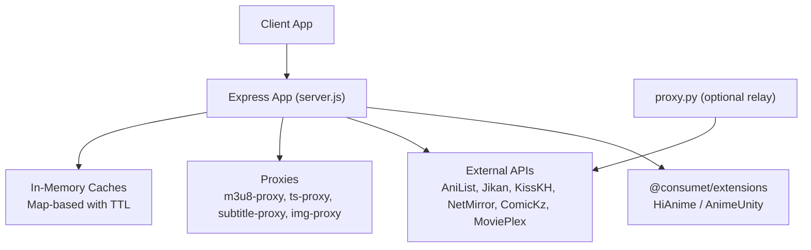
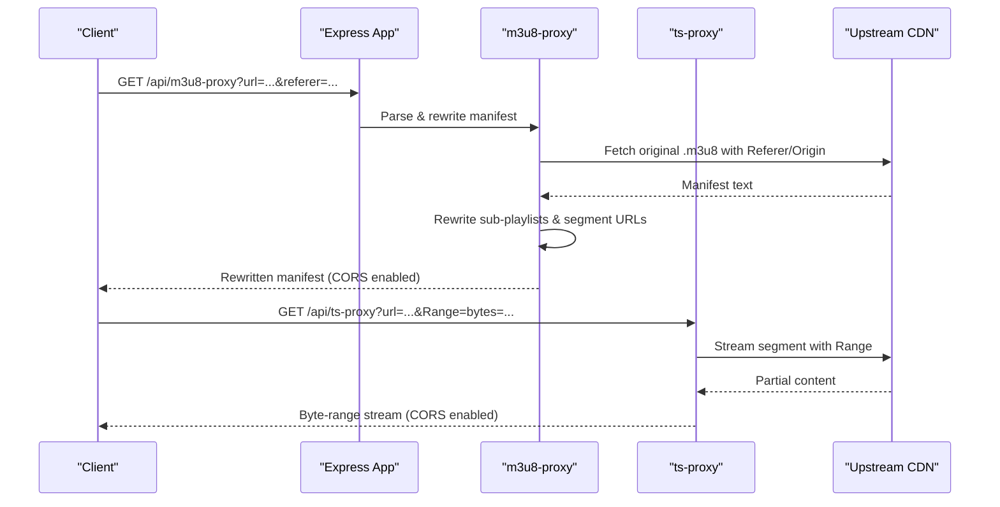
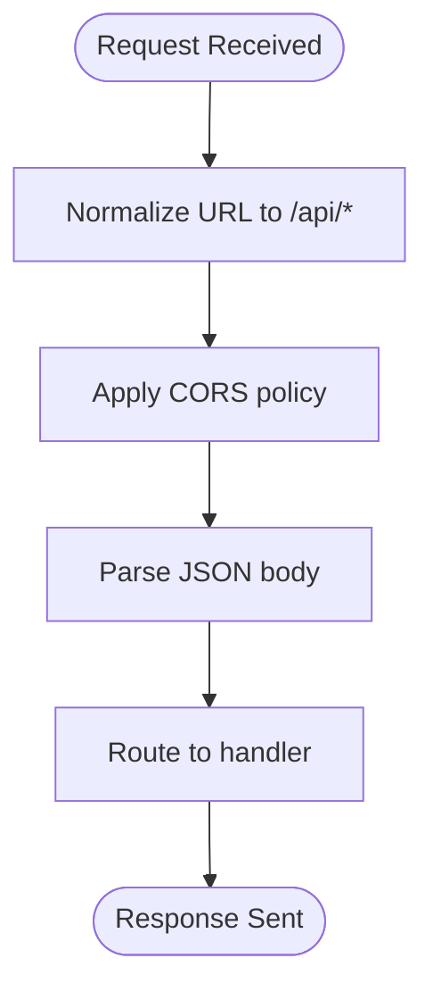
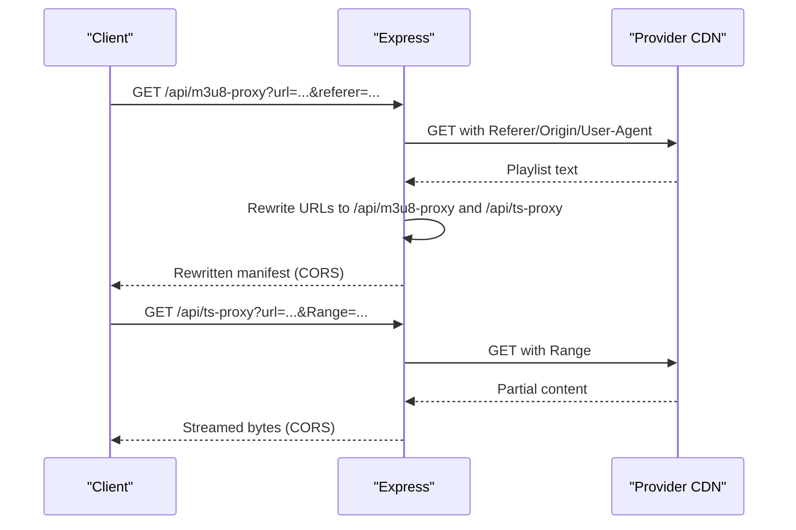
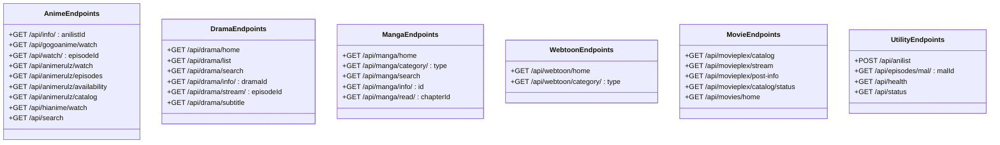
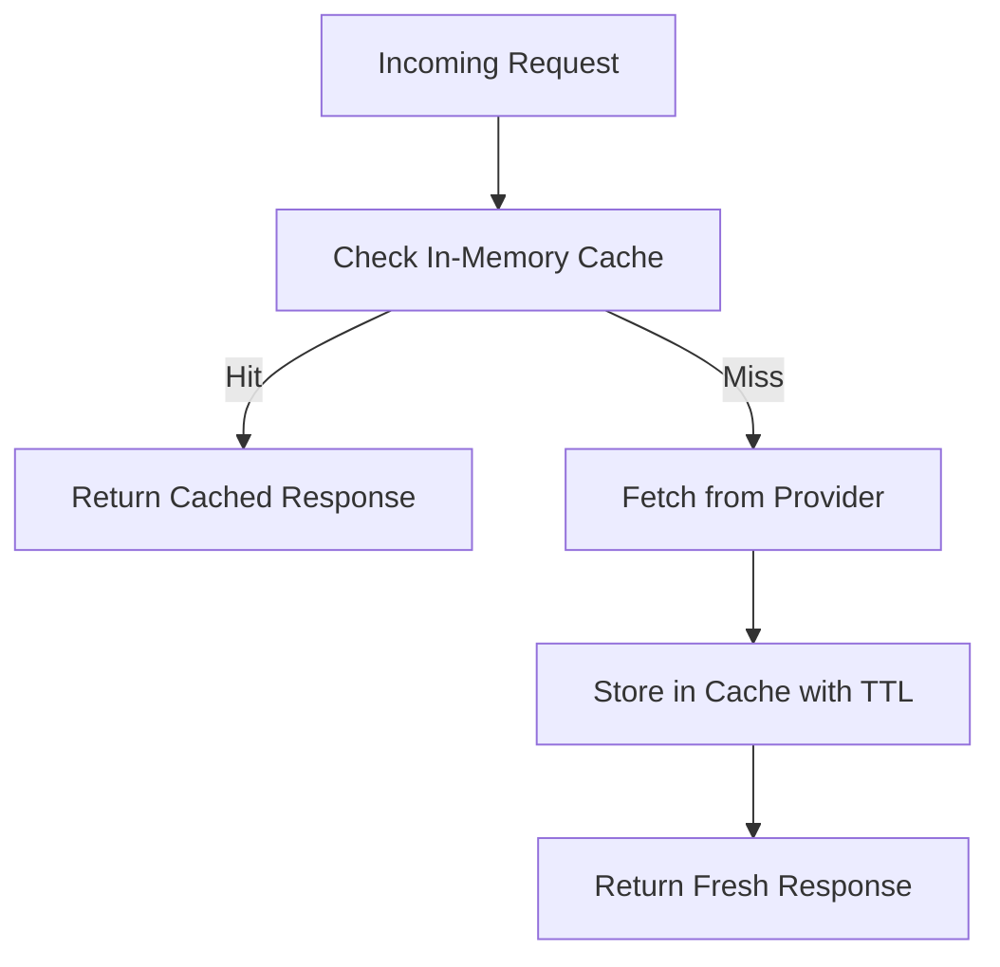
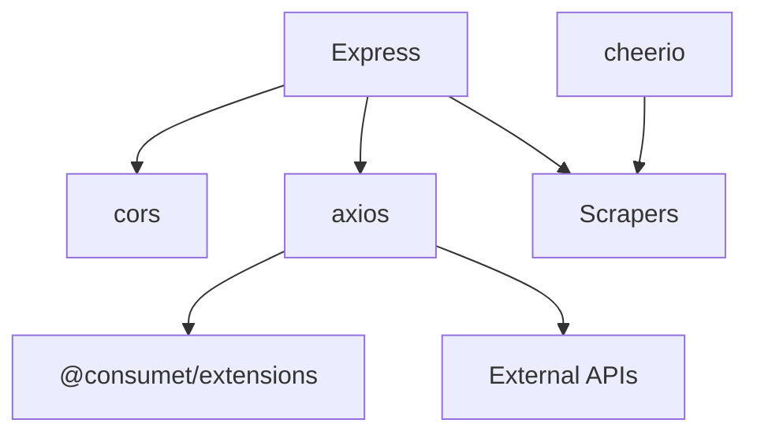

# Backend Services

<cite>
**Referenced Files in This Document**
- [server.js](file://server.js)
- [api/index.js](file://api/index.js)
- [proxy.py](file://proxy.py)
- [package.json](file://package.json)
</cite>

## Table of Contents
1. [Introduction](#introduction)
2. [Project Structure](#project-structure)
3. [Core Components](#core-components)
4. [Architecture Overview](#architecture-overview)
5. [Detailed Component Analysis](#detailed-component-analysis)
6. [Dependency Analysis](#dependency-analysis)
7. [Performance Considerations](#performance-considerations)
8. [Troubleshooting Guide](#troubleshooting-guide)
9. [Conclusion](#conclusion)
10. [Appendices](#appendices)

## Introduction
This document describes the backend services for Project Anime’s Express.js server. It covers middleware configuration, route handlers, error handling strategies, proxy services for CORS bypass and stream protection, API endpoints that integrate with external content providers via @consumet/extensions, caching strategy using in-memory caches with TTL, authentication and rate limiting considerations, logging practices, and extension points for adding new content providers or processing pipelines.

## Project Structure
The backend is implemented as a single Express application with a modular layout:
- Entry point exports the configured Express app for both Node and Vercel serverless usage.
- A small Python helper serves as an optional relay to bypass provider-side IP restrictions.
- The main server file contains all routes, middleware, proxies, and integrations.

**Diagram sources**
- [server.js:1-28](file://server.js#L1-L28)
- [server.js:235-393](file://server.js#L235-L393)
- [proxy.py:1-36](file://proxy.py#L1-L36)

**Section sources**
- [server.js:1-28](file://server.js#L1-L28)
- [api/index.js:1-4](file://api/index.js#L1-L4)
- [package.json:14-35](file://package.json#L14-L35)

## Core Components
- Express app initialization and global middleware:
  - Trusts proxy headers for correct public URL resolution.
  - Enables CORS based on environment configuration.
  - Parses JSON bodies.
  - Normalizes URLs to always route under /api for serverless environments.
- Streaming proxies:
  - m3u8-proxy rewrites HLS manifests and segments to go through the backend, preserving referer/origin and enabling range requests.
  - ts-proxy streams video/audio segments with Range header forwarding for efficient playback.
  - subtitle-proxy fetches VTT subtitles with proper headers and CORS.
  - image-proxy fetches images from providers with hotlink protection bypass and sets cache headers.
- Provider integrations:
  - Anime via @consumet/extensions (HiAnime, AnimeUnity) and AniList metadata.
  - Drama via KissKH and enc-dec.app key exchange.
  - Manga/Webtoon via ComicKz and AniList curated data.
  - Movies via MoviePlex WordPress REST API and poster enrichment via TMDB/OMDb.
- In-memory caching:
  - Map-based caches keyed by request identifiers with TTLs per domain (anime episodes, stream results, drama lists, manga catalogs).
- Health and status endpoints:
  - /api/health returns service status and configuration.
  - /api/status probes external dependencies and reports degraded states.

**Section sources**
- [server.js:10-28](file://server.js#L10-L28)
- [server.js:152-199](file://server.js#L152-L199)
- [server.js:235-393](file://server.js#L235-L393)
- [server.js:662-735](file://server.js#L662-L735)
- [server.js:1164-1208](file://server.js#L1164-L1208)
- [server.js:1304-1336](file://server.js#L1304-L1336)

## Architecture Overview
The server acts as a centralized gateway that:
- Normalizes client requests and applies CORS.
- Routes to specialized handlers for anime, drama, manga/webtoon, and movies.
- Proxies streaming assets to bypass CORS and enforce referer/origin requirements.
- Integrates with multiple external providers and caches responses to reduce latency and external calls.

**Diagram sources**
- [server.js:263-345](file://server.js#L263-L345)
- [server.js:354-393](file://server.js#L354-L393)

## Detailed Component Analysis

### Middleware Configuration
- CORS: Enabled globally with configurable origin; allows cross-origin access for frontend clients.
- JSON parsing: Body parser applied to all routes.
- URL normalization: Ensures all routes are prefixed with /api when deployed behind serverless platforms.
- Public host resolution: Derives protocol and host from forwarded headers for generating absolute URLs in proxies.

**Diagram sources**
- [server.js:20-28](file://server.js#L20-L28)
- [server.js:32-36](file://server.js#L32-L36)

**Section sources**
- [server.js:10-28](file://server.js#L10-L28)
- [server.js:32-36](file://server.js#L32-L36)

### Proxy Service Implementation (CORS Bypass and Stream Protection)
- m3u8-proxy:
  - Fetches upstream playlists with browser-like headers and referer/origin.
  - Rewrites playlist entries to route through backend proxies.
  - Handles malformed URIs and special relays (e.g., StreamIndia relay).
  - Sets CORS headers and appropriate content types.
- ts-proxy:
  - Streams segments with Range header forwarding for byte-range playback.
  - Preserves upstream headers like Accept-Ranges, Content-Type, Content-Length, Content-Range.
  - Uses retry logic for protected streams returning transient errors.
- subtitle-proxy:
  - Fetches VTT files with referer and sets CORS and cache headers.
- image-proxy:
  - Fetches images with provider-specific referers and sets long-lived cache headers.
  - Redirects to original URL if fetching fails for direct links.

**Diagram sources**
- [server.js:263-345](file://server.js#L263-L345)
- [server.js:354-393](file://server.js#L354-L393)

**Section sources**
- [server.js:235-256](file://server.js#L235-L256)
- [server.js:263-345](file://server.js#L263-L345)
- [server.js:354-393](file://server.js#L354-L393)
- [server.js:152-199](file://server.js#L152-L199)

### API Endpoints Structure and Provider Integration
- Anime:
  - /api/info/:anilistId — details and episode list via META.Anilist + Consumet.
  - /api/gogoanime/watch — AnimeKai scraper with title search and season-aware matching; returns proxied HLS stream.
  - /api/watch/:episodeId — fallback via AnimeUnity (Consumet).
  - /api/animerulz/watch, /api/animerulz/episodes, /api/animerulz/availability, /api/animerulz/catalog — Indian language streams via AnimeRulz ecosystem.
  - /api/hianime/watch — primary HiAnime stream via Consumet with AniList ID.
  - /api/search — AnimeKai search endpoint.
- Drama:
  - /api/drama/home, /api/drama/list, /api/drama/search, /api/drama/info/:dramaId, /api/drama/stream/:episodeId, /api/drama/subtitle — KissKH integration with enc-dec.app keys and subtitle decoding.
- Manga/Webtoon:
  - /api/manga/home, /api/manga/category/:type, /api/manga/search, /api/manga/info/:id, /api/manga/read/:chapterId — ComicKz scraping with AniList curated data and cover proxying.
  - /api/webtoon/home, /api/webtoon/category/:type — hybrid webtoon endpoints combining AniList and ComicKz.
- Movies:
  - /api/movieplex/catalog, /api/movieplex/stream, /api/movieplex/post-info, /api/movieplex/catalog/status, /api/movies/home — MoviePlex WordPress catalog with TMDB/OMDb poster enrichment and LuluStream/StreamTape extraction.
- Utilities:
  - /api/anilist — cached GraphQL proxy with rate-limit retries.
  - /api/episodes/mal/:malId — Jikan episode metadata proxy with caching.
  - /api/health, /api/status — health checks and dependency probes.

**Diagram sources**
- [server.js:1210-1278](file://server.js#L1210-L1278)
- [server.js:1382-1559](file://server.js#L1382-L1559)
- [server.js:1564-1601](file://server.js#L1564-L1601)
- [server.js:1606-1617](file://server.js#L1606-L1617)
- [server.js:1863-2043](file://server.js#L1863-L2043)
- [server.js:2321-2465](file://server.js#L2321-L2465)
- [server.js:2611-2688](file://server.js#L2611-L2688)
- [server.js:3402-3608](file://server.js#L3402-L3608)
- [server.js:1164-1208](file://server.js#L1164-L1208)
- [server.js:662-710](file://server.js#L662-L710)
- [server.js:715-735](file://server.js#L715-L735)
- [server.js:1304-1336](file://server.js#L1304-L1336)

**Section sources**
- [server.js:1210-1278](file://server.js#L1210-L1278)
- [server.js:1382-1559](file://server.js#L1382-L1559)
- [server.js:1564-1601](file://server.js#L1564-L1601)
- [server.js:1606-1617](file://server.js#L1606-L1617)
- [server.js:1863-2043](file://server.js#L1863-L2043)
- [server.js:2321-2465](file://server.js#L2321-L2465)
- [server.js:2611-2688](file://server.js#L2611-L2688)
- [server.js:3402-3608](file://server.js#L3402-L3608)
- [server.js:1164-1208](file://server.js#L1164-L1208)
- [server.js:662-710](file://server.js#L662-L710)
- [server.js:715-735](file://server.js#L715-L735)
- [server.js:1304-1336](file://server.js#L1304-L1336)

### Caching Strategy Using In-Memory Caches with TTL
- Anime episode list cache (HiAnime): keyed by anilistId+subOrDub with 30-minute TTL.
- Stream result cache (AnimeKai): keyed by slug+episode+language with 20-minute TTL.
- Jikan episode cache: keyed by malId+page with 1-hour TTL.
- AniList GraphQL cache: payload-keyed with 1-hour TTL and retry on 429.
- Drama caches: home, list, info, stream with 30-minute to 2-hour TTLs.
- Manga genre catalog cache: page-batched with max items and refresh intervals.
- MoviePlex catalog cache: built once and refreshed hourly; includes poster enrichment.

**Diagram sources**
- [server.js:227-228](file://server.js#L227-L228)
- [server.js:413-419](file://server.js#L413-L419)
- [server.js:424-425](file://server.js#L424-L425)
- [server.js:1161-1162](file://server.js#L1161-L1162)
- [server.js:1628-1633](file://server.js#L1628-L1633)
- [server.js:2218-2219](file://server.js#L2218-L2219)
- [server.js:2953-2954](file://server.js#L2953-L2954)

**Section sources**
- [server.js:227-228](file://server.js#L227-L228)
- [server.js:413-419](file://server.js#L413-L419)
- [server.js:424-425](file://server.js#L424-L425)
- [server.js:1161-1162](file://server.js#L1161-L1162)
- [server.js:1628-1633](file://server.js#L1628-L1633)
- [server.js:2218-2219](file://server.js#L2218-L2219)
- [server.js:2953-2954](file://server.js#L2953-L2954)

### Authentication Middleware, Rate Limiting, and Logging
- Authentication:
  - No explicit authentication middleware is implemented in the server code. Access control is not enforced at the API layer.
- Rate Limiting:
  - No global rate limiter is configured. Some endpoints implement provider-side retry/backoff (e.g., AniList 429 handling, image proxy exponential backoff).
- Logging:
  - Console logging throughout handlers for debugging and observability. Logs include provider names, cache hits/misses, errors, and performance metrics.

Recommendations:
- Add JWT or session-based authentication middleware for protected endpoints.
- Integrate a rate limiter (e.g., express-rate-limit) to protect against abuse.
- Centralize structured logging (e.g., Winston or Pino) for better observability and log aggregation.

**Section sources**
- [server.js:1172-1199](file://server.js#L1172-L1199)
- [server.js:2878-2930](file://server.js#L2878-L2930)

### Custom Middleware Creation and Extension Points
- URL normalizer middleware: Demonstrates how to transform incoming paths before routing.
- Proxy utilities: streamProxyHeaders and streamProxyReferers encapsulate provider-specific header strategies.
- Provider abstraction: Each provider (AnimeKai, AnimeRulz, KissKH, ComicKz, MoviePlex) has dedicated functions and caches, making it straightforward to add new providers by following the same pattern.
- Extension points:
  - New content providers can be added by defining a provider instance, implementing search/detail/stream functions, and registering routes.
  - Processing pipelines can be extended by adding middleware between URL normalization and route handlers.

Example patterns:
- Adding a new provider:
  - Create provider instance and configure base URLs/headers.
  - Implement fetch functions with caching and error handling.
  - Register routes with validation and response transformation.
- Adding pipeline steps:
  - Insert middleware after JSON parsing to modify requests/responses (e.g., audit logging, request signing).

**Section sources**
- [server.js:23-28](file://server.js#L23-L28)
- [server.js:74-92](file://server.js#L74-L92)
- [server.js:94-106](file://server.js#L94-L106)
- [server.js:108-148](file://server.js#L108-L148)

## Dependency Analysis
Key dependencies and their roles:
- express: HTTP server framework.
- cors: Cross-origin resource sharing.
- axios: HTTP client for external requests.
- cheerio: HTML parsing for scrapers.
- @consumet/extensions: Provider abstractions for anime content.
- https-proxy-agent: Optional HTTPS proxy support.
- hls.js: Frontend HLS player (not used server-side but relevant for streaming).

**Diagram sources**
- [package.json:14-35](file://package.json#L14-L35)
- [server.js:1-8](file://server.js#L1-L8)

**Section sources**
- [package.json:14-35](file://package.json#L14-L35)
- [server.js:1-8](file://server.js#L1-L8)

## Performance Considerations
- Streaming optimization:
  - Range header forwarding enables byte-range playback, reducing bandwidth and startup time.
  - Manifest rewriting ensures only necessary segments are fetched.
- Caching:
  - In-memory caches reduce external API calls and improve response times.
  - TTLs balance freshness and performance.
- Parallelism:
  - Promise.all/Promise.any used for parallel provider probing and candidate selection.
- Error resilience:
  - Retry logic and fallback providers handle transient failures.
- Proxy overhead:
  - Proxies add latency; consider deploying closer to users or using edge caching where possible.

[No sources needed since this section provides general guidance]

## Troubleshooting Guide
Common issues and resolutions:
- CORS errors:
  - Ensure CORS is enabled and origins match client domains.
  - Use image and subtitle proxies to bypass provider restrictions.
- Stream playback failures:
  - Verify referer/origin headers are set correctly for protected streams.
  - Check m3u8-proxy and ts-proxy logs for upstream errors.
- Provider rate limits:
  - AniList proxy handles 429 with retries; monitor logs for repeated throttling.
- Image loading:
  - Use image-proxy for hotlink-protected images; check referer settings.
- Health checks:
  - Use /api/health and /api/status to verify service and dependency health.

**Section sources**
- [server.js:1172-1199](file://server.js#L1172-L1199)
- [server.js:2878-2930](file://server.js#L2878-L2930)
- [server.js:715-735](file://server.js#L715-L735)
- [server.js:1304-1336](file://server.js#L1304-L1336)

## Conclusion
The backend provides a robust, multi-provider media aggregation service with strong streaming capabilities, comprehensive caching, and flexible proxy infrastructure. While authentication and rate limiting are not currently implemented, the architecture supports easy extension points for adding security controls and new content providers. The use of in-memory caches and efficient streaming techniques ensures good performance and reliability across diverse external sources.

[No sources needed since this section summarizes without analyzing specific files]

## Appendices

### Environment Variables and Configuration
- PORT: Server port (default 8080).
- CORS_ORIGIN: Allowed CORS origin (default wildcard).
- KISSKH_BASE, ENCDEC_BASE, HIVETOONS_BASE: Provider base URLs.
- ANIMERULZ_*: AnimeRulz ecosystem endpoints.
- NETMIRROR_BASE: NetMirror aggregator base URL.
- TMDB_API_KEY, OMDB_API_KEY: Poster enrichment API keys.

**Section sources**
- [server.js:15-18](file://server.js#L15-L18)
- [server.js:748-753](file://server.js#L748-L753)
- [server.js:1699-1701](file://server.js#L1699-L1701)
- [server.js:3036-3037](file://server.js#L3036-L3037)

### Optional Relay Proxy
A Python script provides a simple HTTP relay to bypass provider IP restrictions when running behind cloud platforms. It forwards requests to kisskh.co with appropriate headers and disables SSL verification for compatibility.

**Section sources**
- [proxy.py:1-36](file://proxy.py#L1-L36)