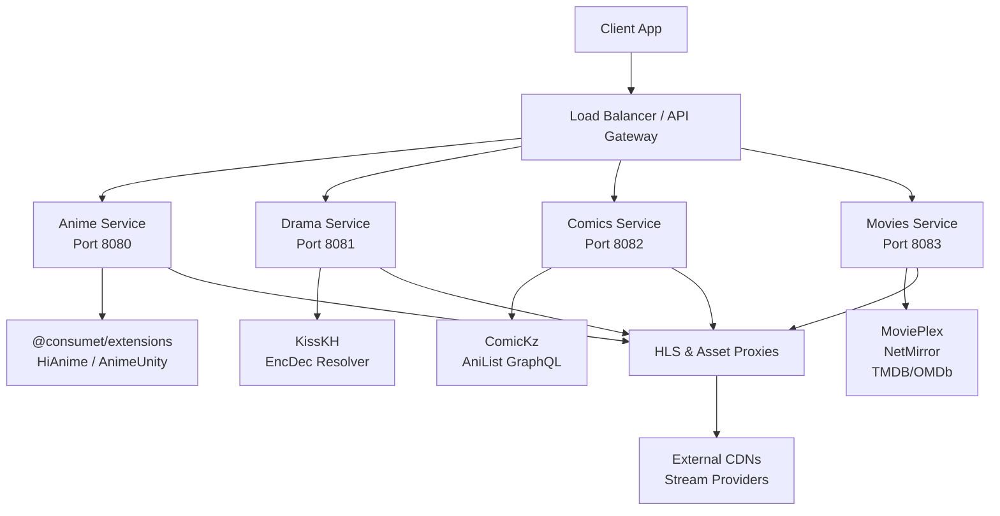
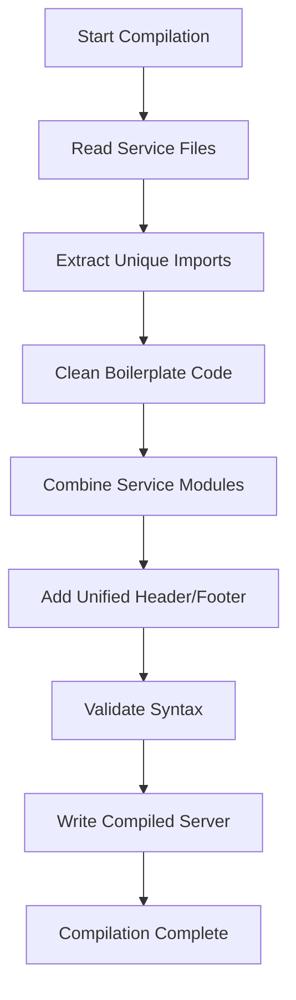

# Backend Services

<cite>
**Referenced Files in This Document**
- [services/anime/server.js](file://services/anime/server.js)
- [services/drama/server.js](file://services/drama/server.js)
- [services/comics/server.js](file://services/comics/server.js)
- [services/movies/server.js](file://services/movies/server.js)
- [services/anime/README.md](file://services/anime/README.md)
- [services/drama/README.md](file://services/drama/README.md)
- [services/comics/README.md](file://services/comics/README.md)
- [services/movies/README.md](file://services/movies/README.md)
- [scripts/compile_monolith.js](file://scripts/compile_monolith.js)
- [the compilation/server.js](file://the compilation/server.js)
- [scripts/audit_services.js](file://scripts/audit_services.js)
</cite>

## Update Summary
**Changes Made**
- Complete microservices architecture transformation from monolithic server to four independent services
- Added comprehensive service documentation with individual README files for each service
- Implemented compilation system to create unified monolith from modular services
- Updated all sections to reflect the new microservices structure and deployment options

## Table of Contents
1. [Introduction](#introduction)
2. [Microservices Architecture](#microservices-architecture)
3. [Service Overview](#service-overview)
4. [Compilation System](#compilation-system)
5. [Individual Service Documentation](#individual-service-documentation)
6. [API Endpoints Structure](#api-endpoints-structure)
7. [Caching Strategy](#caching-strategy)
8. [Proxy Services](#proxy-services)
9. [Deployment Options](#deployment-options)
10. [Performance Considerations](#performance-considerations)
11. [Troubleshooting Guide](#troubleshooting-guide)
12. [Conclusion](#conclusion)

## Introduction
This document describes the backend services for Project Anime's microservices architecture. The system has been completely transformed from a monolithic Express.js server into four independent, specialized microservices: Anime, Drama, Comics, and Movies. Each service operates independently with its own dependencies, configuration, and API endpoints while maintaining consistent patterns for streaming, caching, and proxy functionality.

The architecture supports both standalone microservice deployment and unified monolith compilation through an automated build system that combines all services into a single executable.

## Microservices Architecture
The backend now consists of four specialized microservices, each handling specific content types:



**Diagram sources**
- [services/anime/server.js:1-18](file://services/anime/server.js#L1-L18)
- [services/drama/server.js:1-18](file://services/drama/server.js#L1-L18)
- [services/comics/server.js:1-18](file://services/comics/server.js#L1-L18)
- [services/movies/server.js:1-18](file://services/movies/server.js#L1-L18)

Each microservice is designed as a self-contained Express.js application with:
- Independent package.json with specific dependencies
- Dedicated port assignments (8080-8083)
- Consistent middleware patterns (CORS, JSON parsing, URL normalization)
- Service-specific caching strategies
- Provider integrations tailored to content type

## Service Overview

### Anime Service (Port 8080)
Specialized for anime streaming with support for English Sub/Dub, Japanese Sub, Hindi Dub, Tamil Dub, and Telugu Dub content. Integrates with HiAnime, AnimeKai, Consumet, AnimeRulz, and AniList GraphQL.

### Drama Service (Port 8081)
Handles Asian drama streaming (Korean, Chinese, Japanese, Thai) powered by KissKH and EncDec resolver. Provides curated home sections, search functionality, and episode streaming with subtitle support.

### Comics Service (Port 8082)
Manages Manga, Korean Manhwa, Chinese Manhua, and Webtoons through ComicKz, AniList GraphQL, and Hivetoons integration. Features bento grid layouts, genre filtering, and chapter reading capabilities.

### Movies Service (Port 8083)
Supports Bollywood, Hollywood, South Indian, Hindi Dubbed Movies and Web Series via MoviePlex, NetMirror, TMDB, and OMDb. Includes catalog management, stream resolution, and poster enrichment.

**Section sources**
- [services/anime/README.md:1-12](file://services/anime/README.md#L1-L12)
- [services/drama/README.md:1-12](file://services/drama/README.md#L1-L12)
- [services/comics/README.md:1-12](file://services/comics/README.md#L1-L12)
- [services/movies/README.md:1-12](file://services/movies/README.md#L1-L12)

## Compilation System
The project includes an automated compilation system that transforms the modular microservices into a unified monolith server for simplified deployment scenarios.

### Monolith Compiler
The `compile_monolith.js` script performs the following operations:
- Reads all four service files from the `services/` directory
- Extracts and deduplicates imports across services
- Cleans boilerplate code (Express initialization, middleware setup)
- Combines services with clear module boundaries
- Generates a unified health and status endpoint
- Validates syntax before writing output



**Diagram sources**
- [scripts/compile_monolith.js:24-43](file://scripts/compile_monolith.js#L24-L43)
- [scripts/compile_monolith.js:45-122](file://scripts/compile_monolith.js#L45-L122)
- [scripts/compile_monolith.js:193-246](file://scripts/compile_monolith.js#L193-L246)

### Generated Output
The compilation produces `the compilation/server.js`, which contains:
- All four services combined into a single Express application
- Shared global helpers and middleware
- Unified health check and status endpoints
- Consolidated error handling
- Single port deployment (default 8080)

**Section sources**
- [scripts/compile_monolith.js:124-191](file://scripts/compile_monolith.js#L124-L191)
- [scripts/compile_monolith.js:199-244](file://scripts/compile_monolith.js#L199-L244)
- [the compilation/server.js:1-74](file://the compilation/server.js#L1-L74)

## Individual Service Documentation

### Anime Service Details
The Anime service provides comprehensive anime streaming capabilities with multiple provider support:

**Key Features:**
- Multi-provider streaming (HiAnime, AnimeKai, AnimeUnity, AnimeRulz)
- Language support (English Sub/Dub, Japanese Sub, Hindi/Tamil/Telugu Dub)
- Advanced search with season-aware matching
- HLS streaming with CORS bypass proxies
- AniList GraphQL integration for metadata

**Provider Integration:**
- @consumet/extensions for standardized anime data access
- Custom AnimeKai scraper with title matching algorithms
- AnimeRulz ecosystem for Indian language dubs
- AniList metadata enrichment

**Section sources**
- [services/anime/server.js:128-158](file://services/anime/server.js#L128-L158)
- [services/anime/server.js:248-324](file://services/anime/server.js#L248-L324)
- [services/anime/server.js:505-593](file://services/anime/server.js#L505-L593)

### Drama Service Details
The Drama service specializes in Asian drama content with KissKH integration:

**Core Functionality:**
- Curated home sections (Featured, Korean, Chinese, Top Rating, Last Update)
- Search and filter capabilities by country/type
- Episode streaming with subtitle support
- EncDec key exchange for secure stream access

**Subtitle Processing:**
- Automatic SRT to WebVTT conversion
- CORS-enabled subtitle streaming
- Default subtitle detection based on language

**Section sources**
- [services/drama/server.js:95-125](file://services/drama/server.js#L95-L125)
- [services/drama/server.js:181-272](file://services/drama/server.js#L181-L272)
- [services/drama/server.js:274-298](file://services/drama/server.js#L274-L298)

### Comics Service Details
The Comics service handles diverse comic content formats:

**Content Types:**
- Japanese Manga (via ComicKz)
- Korean Manhwa (via ComicKz and Hivetoons)
- Chinese Manhua (via ComicKz)
- Webtoons (via AniList GraphQL)

**Advanced Features:**
- Bento grid layout support for top content
- Genre-based filtering with pagination
- Chapter reading with image proxy support
- AniList integration for webtoon scheduling

**Image Proxy:**
- Hotlink protection bypass
- Exponential backoff for rate limiting
- Cache headers for performance optimization

**Section sources**
- [services/comics/server.js:285-347](file://services/comics/server.js#L285-L347)
- [services/comics/server.js:509-614](file://services/comics/server.js#L509-L614)
- [services/comics/server.js:715-771](file://services/comics/server.js#L715-L771)

### Movies Service Details
The Movies service provides comprehensive movie and series streaming:

**Content Sources:**
- MoviePlex WordPress REST API for catalog management
- NetMirror integration for OTT platform content
- TMDB and OMDb for poster enrichment

**Stream Resolution:**
- LuluStream HLS extraction with JavaScript evaluation
- StreamTape URL resolution
- Fallback iframe support when direct streaming fails

**Catalog Management:**
- Automated catalog building with caching
- Category-based organization
- 18+ content filtering and control

**Section sources**
- [services/movies/server.js:131-183](file://services/movies/server.js#L131-L183)
- [services/movies/server.js:295-395](file://services/movies/server.js#L295-L395)
- [services/movies/server.js:397-530](file://services/movies/server.js#L397-L530)

## API Endpoints Structure
Each service maintains consistent API patterns while providing domain-specific endpoints:

### Common Patterns
- Health checks: `/api/health` returns service status and uptime
- CORS enabled globally with configurable origins
- JSON body parsing for all routes
- URL normalization for flexible routing

### Service-Specific Endpoints

**Anime Service:**
- `/api/info/:anilistId` - Anime metadata and episodes
- `/api/gogoanime/watch` - AnimeKai streaming
- `/api/hianime/watch` - HiAnime streaming
- `/api/animerulz/*` - Indian language dub support
- `/api/search` - Title search functionality

**Drama Service:**
- `/api/drama/home` - Curated drama sections
- `/api/drama/list` - Filterable drama catalog
- `/api/drama/stream/:episodeId` - Episode streaming
- `/api/drama/subtitle` - Subtitle processing

**Comics Service:**
- `/api/manga/home` - Bento grid and previews
- `/api/manga/category/:type` - Genre filtering
- `/api/webtoon/home` - AniList webtoon schedule
- `/api/manga/read/:chapterId` - Chapter reading

**Movies Service:**
- `/api/movies/home` - Curated movie rows
- `/api/movieplex/catalog` - Paginated catalog
- `/api/movieplex/stream` - Stream resolution
- `/api/netmirror/*` - OTT platform integration

**Section sources**
- [services/anime/README.md:15-84](file://services/anime/README.md#L15-L84)
- [services/drama/README.md:15-122](file://services/drama/README.md#L15-L122)
- [services/comics/README.md:15-116](file://services/comics/README.md#L15-L116)
- [services/movies/README.md:15-90](file://services/movies/README.md#L15-L90)

## Caching Strategy
Each service implements intelligent caching strategies optimized for their specific content types and access patterns:

### In-Memory Caches
- **Anime Service**: Episode lists (30min TTL), stream results (20min TTL), AniList queries (1hr TTL)
- **Drama Service**: Home catalog (30min TTL), episode streams (2hr TTL), search results (30min TTL)
- **Comics Service**: Genre catalogs (15min TTL, max 240 items), chapter pages (1hr TTL)
- **Movies Service**: MoviePlex catalog (24hr TTL), poster enrichment (cached per item)

### Cache Implementation Patterns
```javascript
// Standard cache pattern used across services
const cache = new Map();
const CACHE_TTL = 30 * 60 * 1000; // 30 minutes

function getOrSetCache(key, fetchFn) {
    const cached = cache.get(key);
    if (cached && Date.now() - cached.timestamp < CACHE_TTL) {
        return cached.data;
    }
    const data = await fetchFn();
    cache.set(key, { data, timestamp: Date.now() });
    return data;
}
```

### Performance Optimizations
- Batch requests where possible (drama home catalog)
- Parallel fetching with Promise.all/Promise.any
- Exponential backoff for rate-limited providers
- Smart cache invalidation based on content freshness

**Section sources**
- [services/anime/server.js:134-157](file://services/anime/server.js#L134-L157)
- [services/drama/server.js:54-63](file://services/drama/server.js#L54-L63)
- [services/comics/server.js:59-64](file://services/comics/server.js#L59-L64)
- [services/movies/server.js:143-144](file://services/movies/server.js#L143-L144)

## Proxy Services
All services implement robust proxy infrastructure for CORS bypass and stream protection:

### HLS Streaming Proxies
- **m3u8-proxy**: Rewrites HLS manifests to route segments through backend
- **ts-proxy**: Streams video segments with Range header forwarding
- **subtitle-proxy**: Converts and serves subtitles with proper CORS headers
- **image-proxy**: Handles hotlink protection and rate limiting

### Provider-Specific Headers
Each service configures appropriate headers for different providers:
- User-Agent spoofing to match browser requests
- Referer and Origin headers for protected streams
- Custom headers for specific provider requirements

### Error Handling and Retries
- Exponential backoff for rate-limited responses (429 errors)
- Fallback providers when primary sources fail
- Graceful degradation with informative error messages

**Section sources**
- [services/anime/server.js:71-123](file://services/anime/server.js#L71-L123)
- [services/drama/server.js:303-397](file://services/drama/server.js#L303-L397)
- [services/comics/server.js:715-771](file://services/comics/server.js#L715-L771)
- [services/movies/server.js:44-52](file://services/movies/server.js#L44-L52)

## Deployment Options
The system supports two primary deployment strategies:

### Standalone Microservices
Each service runs independently with dedicated resources:
```bash
# Run individual services
cd services/anime && npm start      # Port 8080
cd services/drama && npm start      # Port 8081
cd services/comics && npm start     # Port 8082
cd services/movies && npm start     # Port 8083
```

**Advantages:**
- Independent scaling and resource allocation
- Fault isolation between services
- Technology flexibility per service needs
- Easier maintenance and updates

### Unified Monolith
Compiled single-server deployment:
```bash
# Compile and run monolith
node scripts/compile_monolith.js
node "the compilation/server.js"
```

**Advantages:**
- Simplified deployment and monitoring
- Shared resources and memory efficiency
- Single point of failure (trade-off)
- Easier development workflow

### Service Audit and Validation
Automated validation ensures all services are properly configured:
```bash
node scripts/audit_services.js
```

This script verifies:
- Package.json existence and validity
- Server file presence and size
- README documentation completeness

**Section sources**
- [scripts/compile_monolith.js:24-43](file://scripts/compile_monolith.js#L24-L43)
- [scripts/audit_services.js:1-25](file://scripts/audit_services.js#L1-L25)
- [the compilation/server.js:236-243](file://the compilation/server.js#L236-L243)

## Performance Considerations
The microservices architecture provides several performance benefits:

### Resource Isolation
- Each service can be scaled independently based on demand
- Memory leaks in one service don't affect others
- CPU-intensive operations (stream extraction) isolated per service

### Caching Optimization
- Service-specific cache sizes and TTLs
- Reduced external API calls through intelligent caching
- Parallel request processing within services

### Network Efficiency
- Local inter-service communication when needed
- Optimized provider connections per service
- Connection pooling and reuse

### Monitoring and Observability
- Individual service health checks
- Granular error tracking per service
- Performance metrics per content type

## Troubleshooting Guide

### Service-Specific Issues

**Anime Service Problems:**
- Provider rate limits: Check AniList 429 handling and retry logic
- Stream extraction failures: Verify referer headers and provider availability
- Search accuracy: Review title matching algorithms and season detection

**Drama Service Issues:**
- EncDec key failures: Verify enc-dec.app availability and response format
- Subtitle conversion: Check SRT to WebVTT conversion logic
- Stream resolution: Validate KissKH API responses and episode IDs

**Comics Service Challenges:**
- Image loading failures: Review image proxy fallback mechanisms
- Chapter parsing: Verify HTML structure changes in source sites
- AniList integration: Check GraphQL query formatting and rate limits

**Movies Service Complications:**
- Stream extraction: Debug JavaScript evaluation for obfuscated players
- Catalog building: Monitor MoviePlex API responses and pagination
- Poster enrichment: Validate TMDB/OMDb API keys and search queries

### Common Solutions
- **CORS Errors**: Verify CORS_ORIGIN environment variable and client domains
- **Timeout Issues**: Adjust timeout values in axios configurations
- **Memory Leaks**: Monitor service memory usage and implement cache cleanup
- **Provider Changes**: Regularly update scraping logic for source site changes

### Diagnostic Tools
- Health endpoints: `/api/health` for each service
- Status monitoring: Service-specific status information
- Log analysis: Console logging throughout all handlers
- Network debugging: Proxy logs for upstream connectivity

**Section sources**
- [services/anime/server.js:505-513](file://services/anime/server.js#L505-L513)
- [services/drama/server.js:85-93](file://services/drama/server.js#L85-L93)
- [services/comics/server.js:275-283](file://services/comics/server.js#L275-L283)
- [services/movies/server.js:536-544](file://services/movies/server.js#L536-L544)

## Conclusion
The transformation to a microservices architecture provides significant advantages for Project Anime's backend infrastructure. The four specialized services (Anime, Drama, Comics, Movies) offer improved scalability, maintainability, and fault isolation while maintaining consistent patterns and APIs.

The dual deployment strategy (standalone microservices vs. compiled monolith) provides flexibility for different operational requirements. The automated compilation system ensures consistency between deployment modes, while the comprehensive caching and proxy infrastructure delivers reliable performance across diverse content providers.

Future enhancements could include:
- Container orchestration with Docker/Kubernetes
- Distributed caching with Redis/Memcached
- Advanced load balancing and service discovery
- Enhanced monitoring and alerting systems
- Database integration for persistent caching

The architecture successfully balances modularity with simplicity, providing a solid foundation for continued growth and feature development.