# Caching & Performance Optimization

<cite>
**Referenced Files in This Document**
- [server.js](file://server.js)
- [proxy.py](file://proxy.py)
</cite>

## Table of Contents
1. [Introduction](#introduction)
2. [Project Structure](#project-structure)
3. [Core Components](#core-components)
4. [Architecture Overview](#architecture-overview)
5. [Detailed Component Analysis](#detailed-component-analysis)
6. [Dependency Analysis](#dependency-analysis)
7. [Performance Considerations](#performance-considerations)
8. [Troubleshooting Guide](#troubleshooting-guide)
9. [Conclusion](#conclusion)

## Introduction
This document explains the multi-layered caching strategy implemented in the backend to reduce external API calls, improve response times, and stabilize streaming playback. It covers:
- In-memory caches built with JavaScript Maps and TTL-based expiration for different data types (anime search results, stream URLs, Jikan episode data, HiAnime episode lists).
- HTTP-level caching via Cache-Control headers on image and subtitle proxies.
- Key generation strategies and memory management considerations.
- Scaling guidance beyond single-process deployments.

## Project Structure
The caching logic is primarily implemented in a single Node.js server file that defines routes, providers, and multiple Map-based caches. A small Python helper provides an additional relay proxy for specific provider constraints.

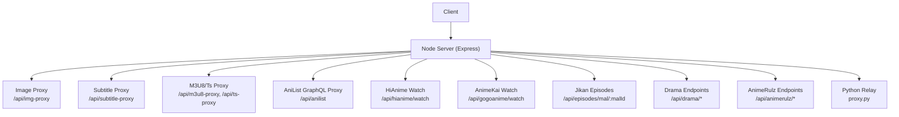

**Diagram sources**
- [server.js:152-199](file://server.js#L152-L199)
- [server.js:235-256](file://server.js#L235-L256)
- [server.js:263-393](file://server.js#L263-L393)
- [server.js:662-710](file://server.js#L662-L710)
- [server.js:1164-1208](file://server.js#L1164-L1208)
- [server.js:1210-1278](file://server.js#L1210-L1278)
- [server.js:1382-1559](file://server.js#L1382-L1559)
- [server.js:1863-2000](file://server.js#L1863-L2000)
- [proxy.py:1-36](file://proxy.py#L1-L36)

**Section sources**
- [server.js:1-200](file://server.js#L1-L200)
- [proxy.py:1-36](file://proxy.py#L1-L36)

## Core Components
- In-memory caches using JavaScript Maps with TTL checks:
  - Anime search results cache (1 hour TTL)
  - Stream URL cache (20 minutes TTL)
  - Jikan episode data cache (1 hour TTL)
  - HiAnime episode list cache (30 minutes TTL)
  - Additional caches for AnimeRulz data and streams, AniList GraphQL responses, drama endpoints, and manhwa chapters
- HTTP caching via Cache-Control headers:
  - Image proxy sets public caching with max-age=86400
  - Subtitle proxy sets public caching with max-age=3600
- Streaming proxies:
  - M3U8 manifest rewriting and segment proxying with Range support
  - TS segment proxy forwarding byte ranges for efficient playback

Key behaviors:
- Each cache entry stores both data and a timestamp; reads check if the current time minus stored timestamp is less than the configured TTL.
- Keys are composed from domain-relevant identifiers (e.g., title+season, slug+episode, malId+page, anilistId+audio mode).

**Section sources**
- [server.js:414-425](file://server.js#L414-L425)
- [server.js:227-228](file://server.js#L227-L228)
- [server.js:662-710](file://server.js#L662-L710)
- [server.js:1210-1278](file://server.js#L1210-L1278)
- [server.js:152-199](file://server.js#L152-L199)
- [server.js:235-256](file://server.js#L235-L256)
- [server.js:263-393](file://server.js#L263-L393)

## Architecture Overview
The backend uses a layered approach:
- Application-level caches (Maps) to avoid repeated scraping or API calls.
- HTTP-level caching via response headers to leverage browser and CDN caches where appropriate.
- Streaming proxies to normalize CORS, handle referer requirements, and enable HLS range requests.

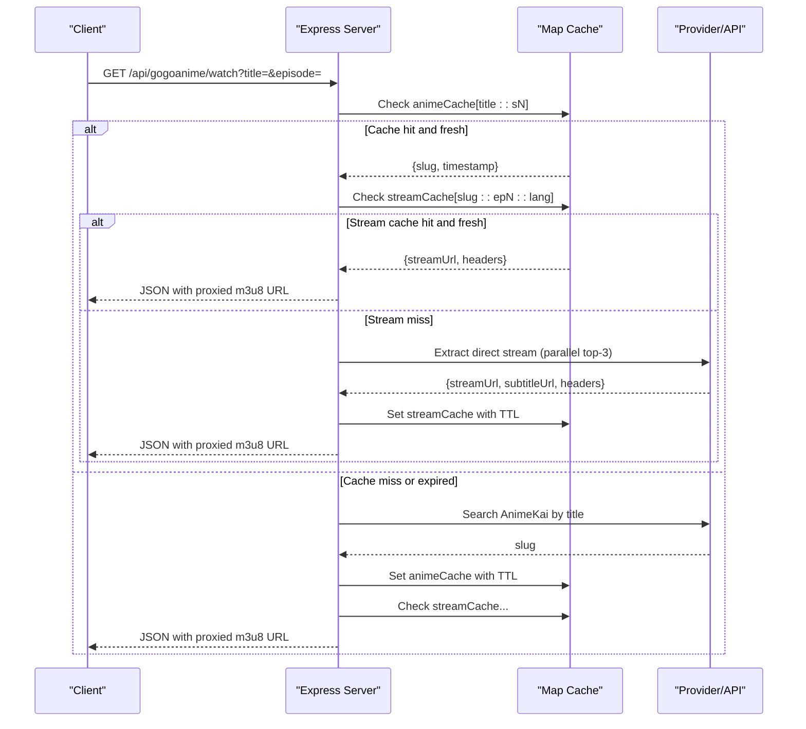

**Diagram sources**
- [server.js:1382-1559](file://server.js#L1382-L1559)
- [server.js:414-419](file://server.js#L414-L419)

## Detailed Component Analysis

### Anime Search Results Cache (1 hour TTL)
- Purpose: Avoid repeated AnimeKai searches for the same title and season.
- Key format: Title normalized + season number (e.g., "TITLE::sN").
- Behavior: On cache miss/expiry, performs search and stores result with timestamp.
- Memory: Entries persist until TTL expires; no explicit size cap.

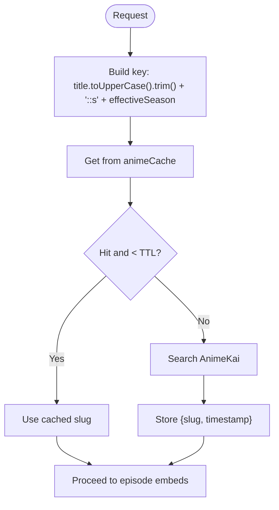

**Diagram sources**
- [server.js:1393-1413](file://server.js#L1393-L1413)

**Section sources**
- [server.js:414-415](file://server.js#L414-L415)
- [server.js:1393-1413](file://server.js#L1393-L1413)

### Stream URL Cache (20 minutes TTL)
- Purpose: Cache extracted direct HLS stream URLs per episode and language to avoid re-extraction on repeat clicks.
- Key format: slug + episode + language (e.g., "slug::epN::lang").
- Behavior: If present and fresh, returns immediately; otherwise extracts via parallel top-3 attempts and caches result.

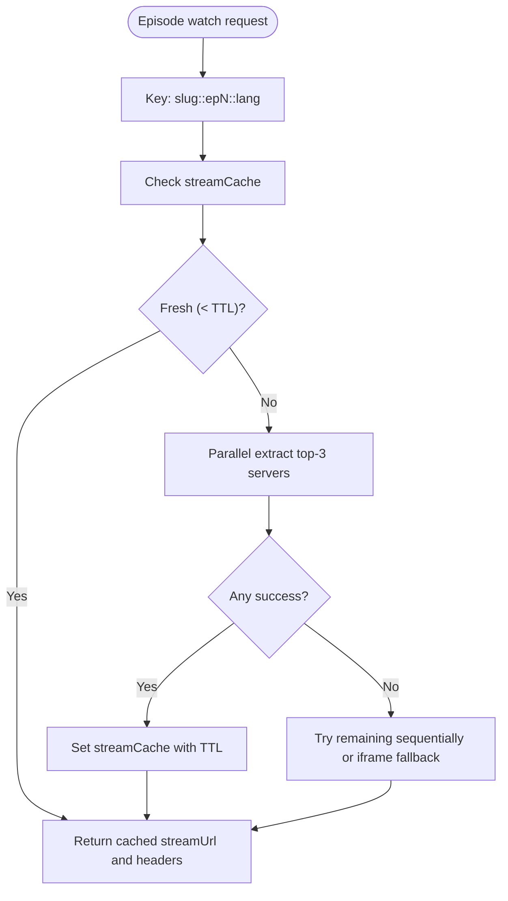

**Diagram sources**
- [server.js:1464-1542](file://server.js#L1464-L1542)

**Section sources**
- [server.js:418-419](file://server.js#L418-L419)
- [server.js:1464-1542](file://server.js#L1464-L1542)

### Jikan Episode Data Cache (1 hour TTL)
- Purpose: Cache paginated episode metadata from Jikan to reduce rate-limited API calls.
- Key format: malId + page (e.g., "malId:page").
- Behavior: Checks TTL before fetching; stores full response including pagination info.

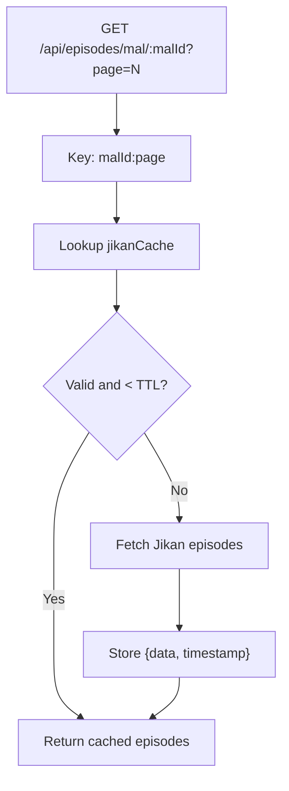

**Diagram sources**
- [server.js:662-710](file://server.js#L662-L710)

**Section sources**
- [server.js:424-425](file://server.js#L424-L425)
- [server.js:662-710](file://server.js#L662-L710)

### HiAnime Episode List Cache (30 minutes TTL)
- Purpose: Cache episode lists resolved by AniList ID and audio mode to avoid repeated provider lookups.
- Key format: anilistId + subOrDub (e.g., "anilistId:sub" or "anilistId:dub").
- Behavior: If fresh, returns cached episodes; otherwise fetches via Consumet with timeout and caches result.

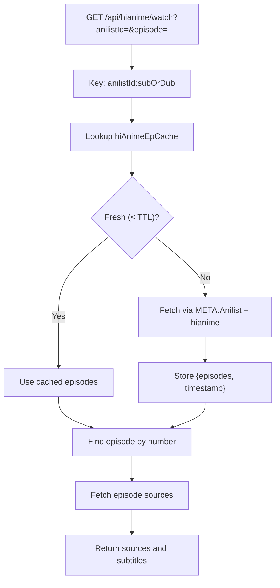

**Diagram sources**
- [server.js:1210-1278](file://server.js#L1210-L1278)

**Section sources**
- [server.js:227-228](file://server.js#L227-L228)
- [server.js:1210-1278](file://server.js#L1210-L1278)

### AnimeRulz Data and Stream Caches (30 minutes TTL)
- Purpose: Reduce repeated catalog/detail/availability/stream resolution calls to AnimeRulz services.
- Keys:
  - Catalog: "catalog"
  - Detail: "detail:anilistId"
  - Episodes: "episodes:anilistId"
  - Availability: "avail:anilistId"
  - Stream: "anilistId:e{episodeNum}:lang"
- Behavior: Each function checks TTL before calling upstream APIs; successful results are cached.

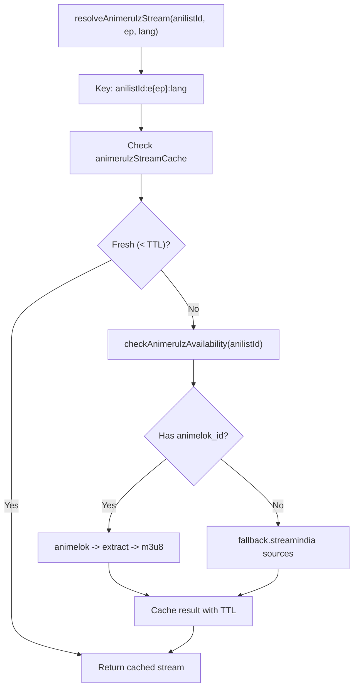

**Diagram sources**
- [server.js:778-839](file://server.js#L778-L839)
- [server.js:845-876](file://server.js#L845-L876)
- [server.js:886-1041](file://server.js#L886-L1041)

**Section sources**
- [server.js:764-765](file://server.js#L764-L765)
- [server.js:778-839](file://server.js#L778-L839)
- [server.js:845-876](file://server.js#L845-L876)
- [server.js:886-1041](file://server.js#L886-L1041)

### AniList GraphQL Proxy Cache (1 hour TTL)
- Purpose: Cache identical GraphQL payloads to mitigate rate limits and reduce network overhead.
- Key: Serialized request body string.
- Behavior: On cache hit within TTL, returns immediately; on miss, retries up to 3 times on 429 and caches result.

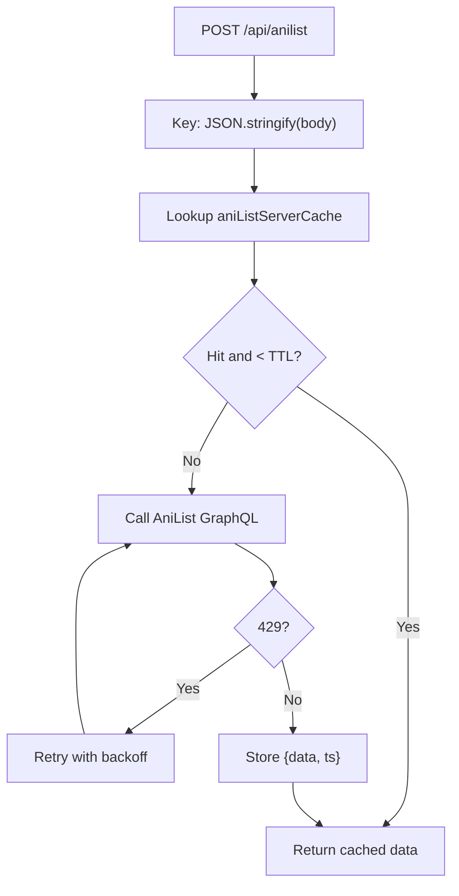

**Diagram sources**
- [server.js:1164-1208](file://server.js#L1164-L1208)

**Section sources**
- [server.js:1161-1162](file://server.js#L1161-L1162)
- [server.js:1164-1208](file://server.js#L1164-L1208)

### Image Proxy Caching (HTTP Cache Headers)
- Endpoint: /api/img-proxy and /api/manga/image-proxy
- Behavior: Proxies images with proper Content-Type and sets Cache-Control: public, max-age=86400 to allow browser/CDN caching.
- Error handling: Redirects to original URL if it starts with http; otherwise returns 404.

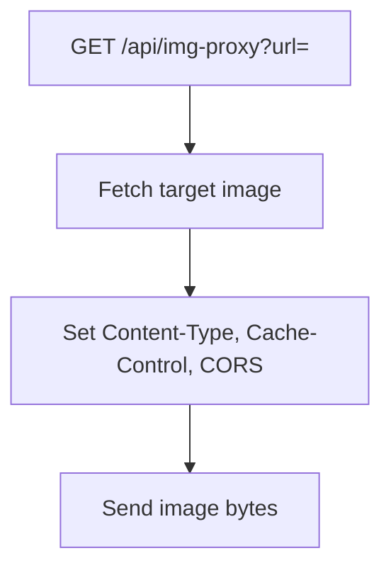

**Diagram sources**
- [server.js:152-199](file://server.js#L152-L199)

**Section sources**
- [server.js:152-199](file://server.js#L152-L199)

### Subtitle Proxy Caching (HTTP Cache Headers)
- Endpoint: /api/subtitle-proxy
- Behavior: Proxies VTT files with Content-Type text/vtt and sets Cache-Control: public, max-age=3600.
- CORS: Allows all origins.

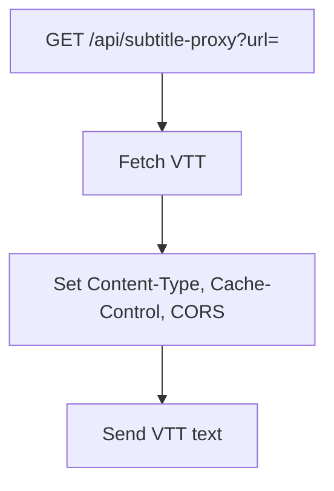

**Diagram sources**
- [server.js:235-256](file://server.js#L235-L256)

**Section sources**
- [server.js:235-256](file://server.js#L235-L256)

### M3U8 and TS Segment Proxies
- M3U8 proxy rewrites playlist URLs to route through the backend, preserving referers and fixing malformed URIs.
- TS proxy forwards Range headers to enable HLS byte-range playback, reducing bandwidth and startup latency.

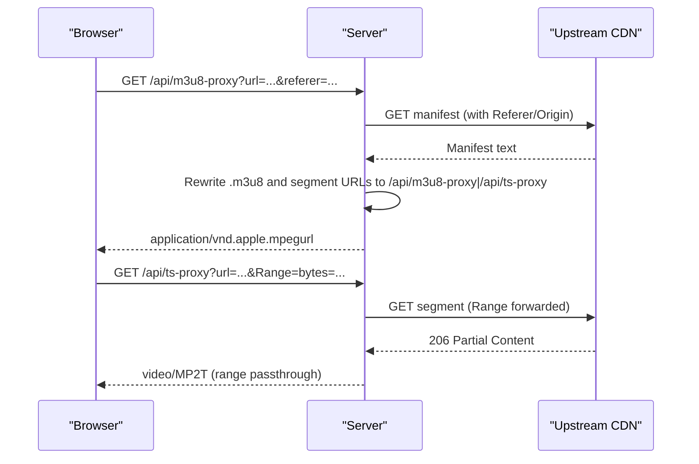

**Diagram sources**
- [server.js:263-393](file://server.js#L263-L393)

**Section sources**
- [server.js:263-393](file://server.js#L263-L393)

### Python Relay Proxy
- Purpose: Provide a separate relay for KissKH to bypass IP restrictions when running behind cloud environments.
- Behavior: Forwards requests with Host header set to target, strips certain headers, and passes status and headers through.

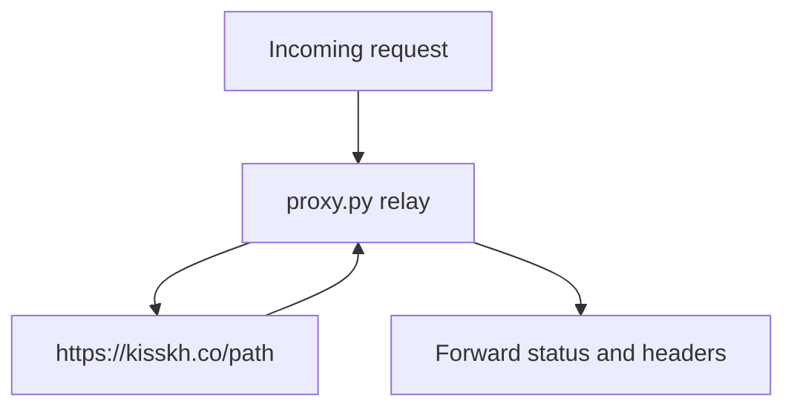

**Diagram sources**
- [proxy.py:1-36](file://proxy.py#L1-L36)

**Section sources**
- [proxy.py:1-36](file://proxy.py#L1-L36)

## Dependency Analysis
- The server composes multiple provider clients (Consumet extensions, Axios, Cheerio) and coordinates caching at each layer.
- Caches are process-scoped (in-memory), which means they do not share state across processes or restarts.
- External dependencies include:
  - Express, Axios, Cheerio for HTTP and parsing
  - Consumet extensions for HiAnime/AniList integration
  - Optional Python relay for provider-specific constraints

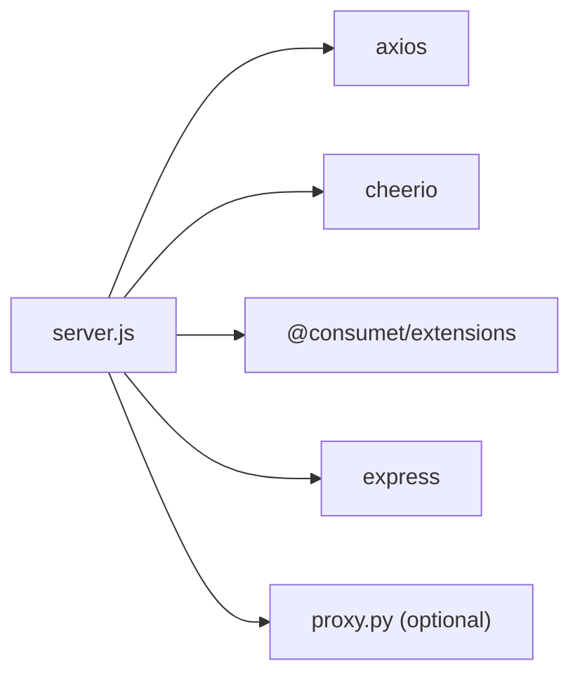

**Diagram sources**
- [server.js:1-8](file://server.js#L1-L8)
- [proxy.py:1-36](file://proxy.py#L1-L36)

**Section sources**
- [server.js:1-8](file://server.js#L1-L8)
- [proxy.py:1-36](file://proxy.py#L1-L36)

## Performance Considerations
- Cache hit ratios:
  - Anime search results: High under repeated title queries due to 1-hour TTL.
  - Stream URLs: Very high for repeated episode plays within 20 minutes.
  - Jikan episodes: Beneficial under pagination-heavy browsing; reduces rate-limit risk.
  - HiAnime episode lists: Reduces provider load when switching between sub/dub modes.
  - AnimeRulz data and streams: Significant reduction in upstream calls during active sessions.
  - AniList GraphQL: Effective against rate limiting for identical queries.
- Memory management:
  - All caches are in-memory Maps without explicit eviction policies or size limits.
  - Risk: Unbounded growth under high cardinality keys (e.g., many unique titles, episodes, pages).
  - Mitigations recommended:
    - Add maximum size per cache with LRU eviction.
    - Periodic cleanup tasks to remove entries older than TTL even if still within TTL window.
    - Consider sharding keys by feature area to bound per-cache growth.
- Streaming performance:
  - Range forwarding on TS segments improves startup time and reduces bandwidth usage.
  - M3U8 rewriting ensures consistent referer handling and avoids CORS issues.
- HTTP caching:
  - Image proxy: 24-hour cache enables browser/CDN reuse.
  - Subtitle proxy: 1-hour cache reduces repeated subtitle downloads.

[No sources needed since this section provides general guidance]

## Troubleshooting Guide
Common issues and diagnostics:
- Cache misses:
  - Verify TTL values and ensure timestamps are updated on writes.
  - Confirm key construction matches read paths exactly (case normalization, season inclusion).
- Provider errors:
  - 403/429 responses often indicate missing or incorrect headers; ensure Referer/Origin/User-Agent are set.
  - For protected HLS, verify referer candidates and retry logic for transient failures.
- Streaming problems:
  - Ensure Range headers are forwarded; missing ranges can cause full segment downloads.
  - Validate rewritten URLs to avoid nested proxy loops; unwrap helpers prevent localhost-to-localhost loops.
- Memory pressure:
  - Monitor process heap growth; consider adding cache size limits and background cleanup.

**Section sources**
- [server.js:263-393](file://server.js#L263-L393)
- [server.js:1164-1208](file://server.js#L1164-L1208)
- [server.js:1382-1559](file://server.js#L1382-L1559)

## Conclusion
The backend employs a pragmatic, multi-layered caching strategy:
- Process-local Maps with TTLs provide fast, simple caching for frequently accessed data.
- HTTP-level caching via Cache-Control leverages browsers and CDNs for static assets and subtitles.
- Streaming proxies normalize provider behavior and optimize playback with Range support.
For production scaling beyond single-process deployments, replace in-memory caches with a shared store (e.g., Redis) and add bounded sizes, eviction policies, and monitoring to maintain performance and stability.

[No sources needed since this section summarizes without analyzing specific files]