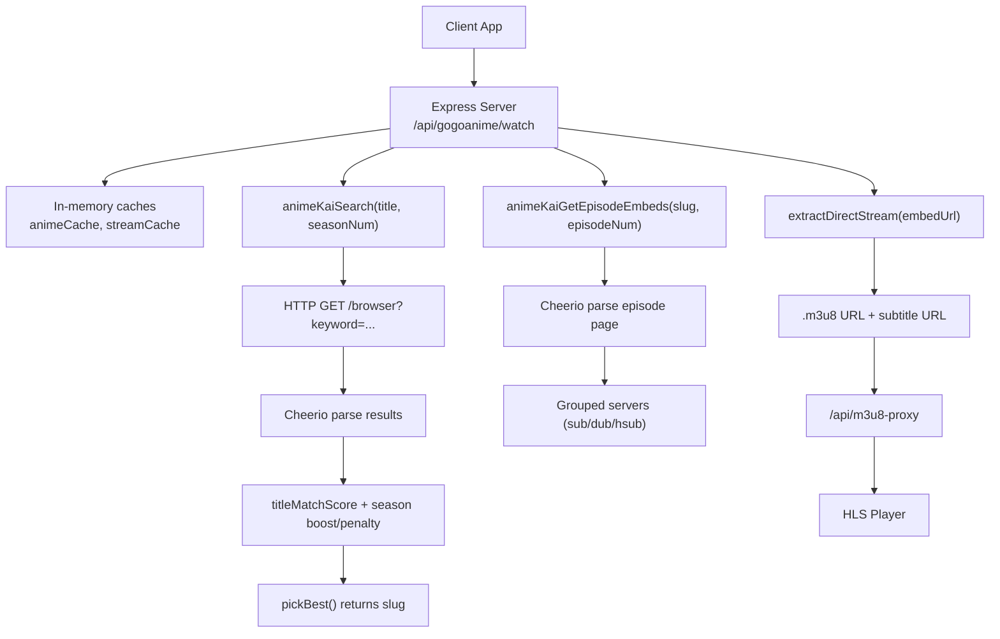
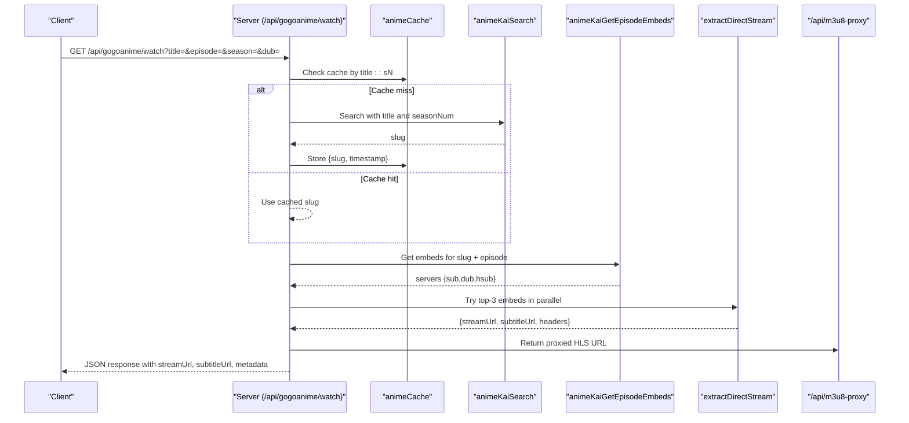
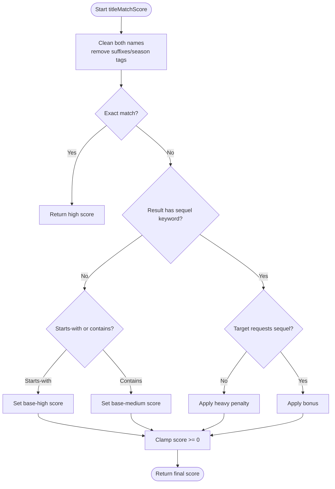
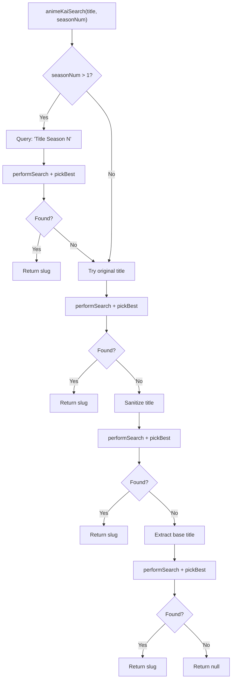
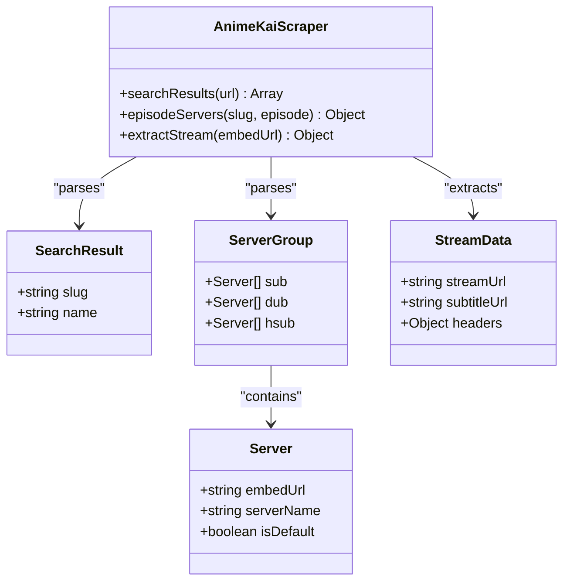
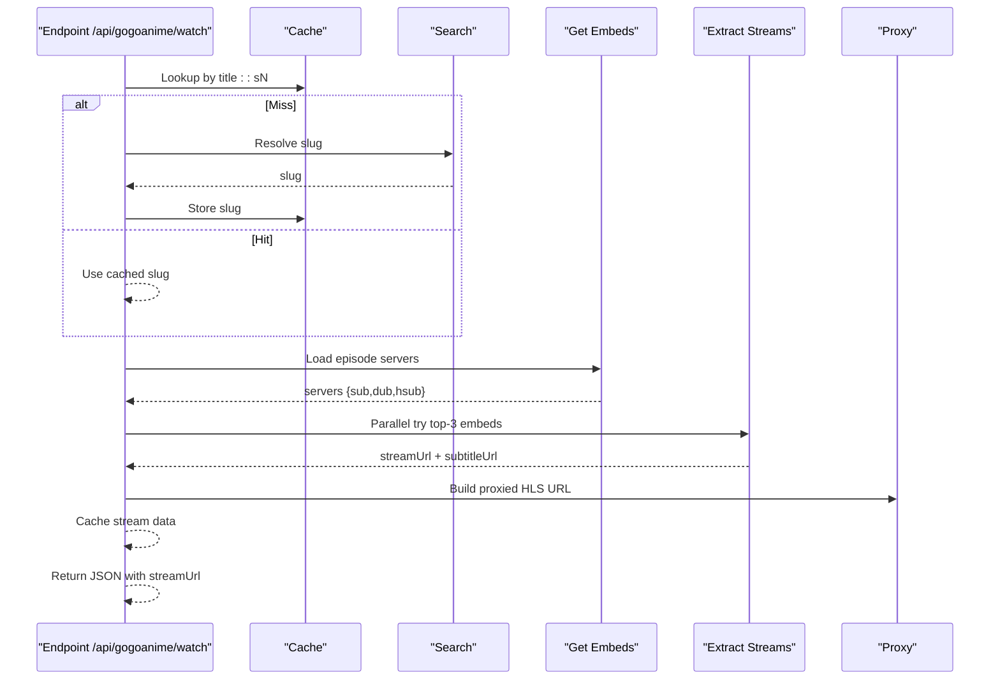
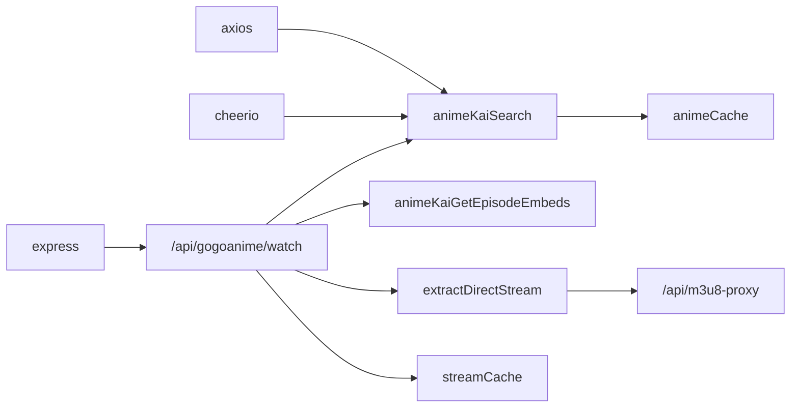

# Anime Search & Episode Resolution

<cite>
**Referenced Files in This Document**
- [server.js](file://server.js)
</cite>

## Table of Contents
1. [Introduction](#introduction)
2. [Project Structure](#project-structure)
3. [Core Components](#core-components)
4. [Architecture Overview](#architecture-overview)
5. [Detailed Component Analysis](#detailed-component-analysis)
6. [Dependency Analysis](#dependency-analysis)
7. [Performance Considerations](#performance-considerations)
8. [Troubleshooting Guide](#troubleshooting-guide)
9. [Conclusion](#conclusion)

## Introduction
This document explains the anime search and episode resolution algorithms implemented in the backend server. It focuses on:
- Title matching system: cleanAnimeTitle, titleMatchScore, and season detection logic
- Multi-step search process for AnimeKai: season-qualified queries, original title searches, sanitized title processing, and base title extraction
- AnimeKai scraper implementation using Cheerio-based HTML parsing, server group parsing, and embed URL extraction
- Examples of complex title matching scenarios and edge cases handled by the scoring system

The goal is to make these algorithms understandable for both technical and non-technical readers while providing precise references to the source code.

## Project Structure
The core logic resides in a single Node.js server file that exposes HTTP endpoints for streaming and scraping. The AnimeKai-related functionality includes:
- A multi-step search routine that tries several query strategies to find the best match
- A robust title scoring algorithm that handles seasons, sequels, and common suffixes
- Episode page parsing to extract available servers and their embed URLs
- Stream extraction from player pages to obtain HLS .m3u8 URLs and subtitles

**Diagram sources**
- [server.js:471-516](file://server.js#L471-L516)
- [server.js:518-626](file://server.js#L518-L626)
- [server.js:631-656](file://server.js#L631-L656)
- [server.js:431-468](file://server.js#L431-L468)
- [server.js:1382-1559](file://server.js#L1382-L1559)

**Section sources**
- [server.js:401-419](file://server.js#L401-L419)
- [server.js:431-468](file://server.js#L431-L468)
- [server.js:471-516](file://server.js#L471-L516)
- [server.js:518-626](file://server.js#L518-L626)
- [server.js:631-656](file://server.js#L631-L656)
- [server.js:1382-1559](file://server.js#L1382-L1559)

## Core Components
- cleanAnimeTitle: Normalizes titles by removing common suffixes like (TV), (Sub), (Dub), (Uncensored), (Media), and season annotations to enable fair comparisons.
- titleMatchScore: Scores how well a result name matches a target title with rules for exact matches, base title starts-with, inclusion, sequel detection, and penalties/rewards based on whether the target explicitly requests a season or sequel.
- animeKaiSearch: Implements a four-step search strategy:
  1) Season-qualified query when season > 1
  2) Original title search
  3) Sanitized title (strip trailing punctuation and parentheses)
  4) Base title (before colon/hyphen)
- animeKaiGetEpisodeEmbeds: Parses an episode page to collect server groups (sub, dub, hsub) and their embed URLs.
- extractDirectStream: Loads a player page and extracts the direct HLS .m3u8 stream URL and optional subtitle track.

These components work together to resolve an anime title to a slug and then to playable streams for a given episode.

**Section sources**
- [server.js:471-516](file://server.js#L471-L516)
- [server.js:518-626](file://server.js#L518-L626)
- [server.js:631-656](file://server.js#L631-L656)
- [server.js:431-468](file://server.js#L431-L468)

## Architecture Overview
The AnimeKai flow begins at the watch endpoint, which orchestrates caching, searching, episode parsing, and stream extraction. It uses in-memory caches to reduce repeated network calls and parallelizes top candidate attempts to speed up stream discovery.

**Diagram sources**
- [server.js:1382-1559](file://server.js#L1382-L1559)
- [server.js:518-626](file://server.js#L518-L626)
- [server.js:631-656](file://server.js#L631-L656)
- [server.js:431-468](file://server.js#L431-L468)

## Detailed Component Analysis

### Title Matching System
- cleanAnimeTitle
  - Lowercases input
  - Removes common suffixes such as (TV), (Sub), (Dub), (Uncensored), (Media)
  - Removes season annotations like (Season 2)
  - Trims whitespace
  - Purpose: Normalize titles so comparisons are not affected by formatting or language tags

- titleMatchScore
  - Exact match: Returns highest score if normalized strings match exactly
  - Sequel detection: Identifies sequel keywords in result names (e.g., “Season 2”, “3rd Season”, “Part 2”, “Cour 2”, “Movie”, “Movie 2”) and specific known arcs/titles used as proxies for sequels
  - Target has sequel: Detects if the user’s query explicitly asks for a season or part
  - Base match heuristics:
    - Starts-with cleaned title: higher score
    - Contains cleaned title: medium score
  - Penalty/Reward:
    - If result is a sequel but target does not request one: heavy penalty to prefer base/season 1
    - If result is a sequel and target requests one: bonus to favor the correct sequel
  - Final score clamped to non-negative values

- Season detection logic within pickBest
  - When seasonNum is provided:
    - Boost results that explicitly mention the requested season number or part
    - Penalize results mentioning a different season number
    - For season 1, unlabelled results get a small boost since season 1 is often not labeled

**Diagram sources**
- [server.js:471-516](file://server.js#L471-L516)
- [server.js:546-573](file://server.js#L546-L573)

**Section sources**
- [server.js:471-516](file://server.js#L471-L516)
- [server.js:546-573](file://server.js#L546-L573)

### Multi-Step Search Process (animeKaiSearch)
The search function executes a prioritized sequence of queries to maximize match accuracy:
1) Season-qualified query: If seasonNum > 1, constructs a query like “Title Season N” and searches first
2) Original title: Searches with the exact title provided
3) Sanitized title: Strips trailing punctuation and parentheses to improve matching
4) Base title: Splits on colon/hyphen and tries the base portion before any subtitle or episode-specific text

Each step uses performSearch to fetch results via HTTP and Cheerio parsing, then pickBest to score and select the best slug.

**Diagram sources**
- [server.js:518-626](file://server.js#L518-L626)

**Section sources**
- [server.js:518-626](file://server.js#L518-L626)

### AnimeKai Scraper Implementation
- HTML Parsing with Cheerio
  - Search results: Selects items by class and extracts poster links and titles to build a list of {slug, name}
  - Episode page: Groups servers by language using data-id attributes and collects embed URLs, server names, and default flags

- Server Group Parsing
  - Collects sub, dub, and hsub servers
  - Tracks default servers per group to prioritize them

- Embed URL Extraction
  - Loads the player page and extracts the HLS .m3u8 URL using regex patterns
  - Captures subtitle track URL from query parameters
  - Returns stream URL, subtitle URL, and necessary headers

**Diagram sources**
- [server.js:521-539](file://server.js#L521-L539)
- [server.js:631-656](file://server.js#L631-L656)
- [server.js:431-468](file://server.js#L431-L468)

**Section sources**
- [server.js:521-539](file://server.js#L521-L539)
- [server.js:631-656](file://server.js#L631-L656)
- [server.js:431-468](file://server.js#L431-L468)

### Episode Resolution Flow
- Endpoint receives title, episode, season, and optional dub preference
- Uses in-memory cache keyed by title and effective season to avoid repeated searches
- Calls animeKaiSearch to resolve slug
- Calls animeKaiGetEpisodeEmbeds to gather available servers
- Builds a candidate list ordered by preference (default/sub vs English dub mode)
- Attempts top-3 candidates in parallel; falls back sequentially to remaining candidates
- On success, caches stream data and returns a proxied HLS URL via /api/m3u8-proxy
- If all extractions fail, returns iframe fallback with available servers

**Diagram sources**
- [server.js:1382-1559](file://server.js#L1382-L1559)
- [server.js:518-626](file://server.js#L518-L626)
- [server.js:631-656](file://server.js#L631-L656)
- [server.js:431-468](file://server.js#L431-L468)

**Section sources**
- [server.js:1382-1559](file://server.js#L1382-L1559)

### Complex Title Matching Scenarios and Edge Cases
- Exact match normalization: Titles with differing casing or suffixes like (TV)/(Sub)/(Dub) are treated as equal after cleaning
- Sequel penalty: Searching for a base title should prefer season 1 over later seasons unless the query explicitly mentions a season/part
- Season-aware boosting: When a season is specified, results explicitly naming that season receive a boost; mismatched seasons are penalized
- Known sequel proxies: Certain terms act as proxies for sequel content and influence scoring accordingly
- Base title extraction: Handles titles with colons/hyphens by trying the base portion when full titles fail

Examples of behaviors:
- “Jujutsu Kaisen” vs “Jujutsu Kaisen 3rd Season”: Without specifying a season, base title wins due to sequel penalty
- “Jujutsu Kaisen Season 2” vs “Jujutsu Kaisen”: With explicit season, sequel match is rewarded
- “Attack on Titan: The Final Season” vs “Attack on Titan”: Base title extraction helps when full titles include subtitles or parts

**Section sources**
- [server.js:471-516](file://server.js#L471-L516)
- [server.js:546-573](file://server.js#L546-L573)
- [server.js:597-622](file://server.js#L597-L622)

## Dependency Analysis
- External libraries:
  - axios: HTTP requests for search and episode pages
  - cheerio: HTML parsing for search results and episode pages
  - express: HTTP routing for endpoints
  - node:vm: Used elsewhere in the server (not directly in AnimeKai flow)
- Internal dependencies:
  - In-memory caches: animeCache (title-to-slug), streamCache (episode stream data)
  - Proxies: /api/m3u8-proxy and /api/ts-proxy for HLS manifest and segment handling
  - Other providers: HiAnime and AnimeUnity are present in the server but not used by the AnimeKai flow

**Diagram sources**
- [server.js:401-419](file://server.js#L401-L419)
- [server.js:518-626](file://server.js#L518-L626)
- [server.js:631-656](file://server.js#L631-L656)
- [server.js:1382-1559](file://server.js#L1382-L1559)

**Section sources**
- [server.js:401-419](file://server.js#L401-L419)
- [server.js:518-626](file://server.js#L518-L626)
- [server.js:631-656](file://server.js#L631-L656)
- [server.js:1382-1559](file://server.js#L1382-L1559)

## Performance Considerations
- Caching:
  - Title-to-slug cache reduces repeated searches for the same title and season
  - Stream cache avoids re-extracting HLS URLs for repeat clicks within TTL
- Parallelism:
  - Top-3 embed candidates are tried in parallel to minimize latency
  - Fallback sequential attempts ensure resilience when top candidates fail
- Network resilience:
  - Robust headers and referers help bypass CDN restrictions
  - Multiple referer candidates increase success rates for protected streams
- Efficiency:
  - Title normalization and scoring minimize unnecessary downstream steps
  - Base title extraction improves match rates without extra network calls

[No sources needed since this section provides general guidance]

## Troubleshooting Guide
Common issues and remedies:
- No results found:
  - Verify title spelling and consider using sanitized or base title variants
  - Ensure season parameter is correct; if unspecified, defaults to season 1 for caching
- Stream extraction failures:
  - Check if the embed page still contains the expected HLS pattern
  - Retry with alternative servers; the endpoint automatically tries multiple candidates
- CORS or referer blocks:
  - Ensure Referer and Origin headers are set correctly by the proxy
  - Some providers require specific referers; the server rotates candidates to improve success
- Cache staleness:
  - If titles change frequently, rely on TTL expiration or clear in-memory caches during development

**Section sources**
- [server.js:1382-1559](file://server.js#L1382-L1559)
- [server.js:431-468](file://server.js#L431-L468)

## Conclusion
The AnimeKai search and episode resolution pipeline combines intelligent title normalization, robust scoring, and a multi-step search strategy to reliably map user queries to playable streams. Season-aware logic ensures accurate results across sequels and specials, while caching and parallelization optimize performance. The scraper’s Cheerio-based parsing and resilient stream extraction provide a dependable experience even when upstream sites vary or impose restrictions.

[No sources needed since this section summarizes without analyzing specific files]