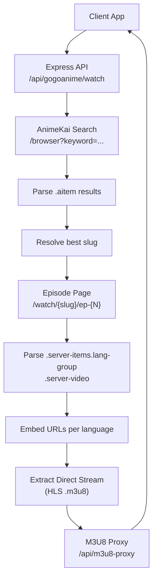
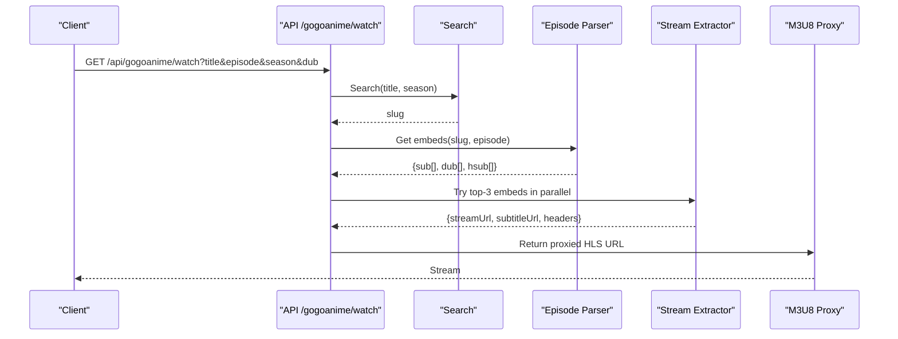
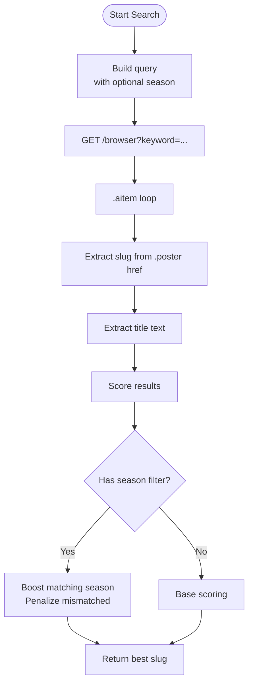
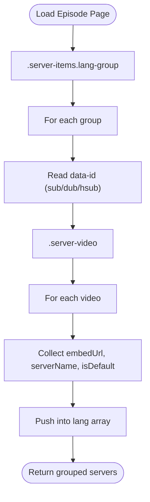
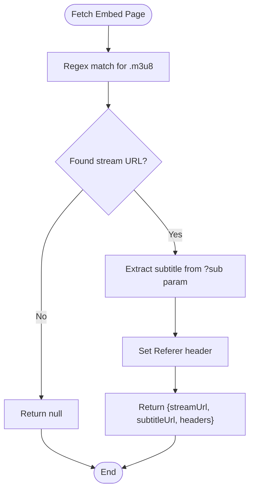
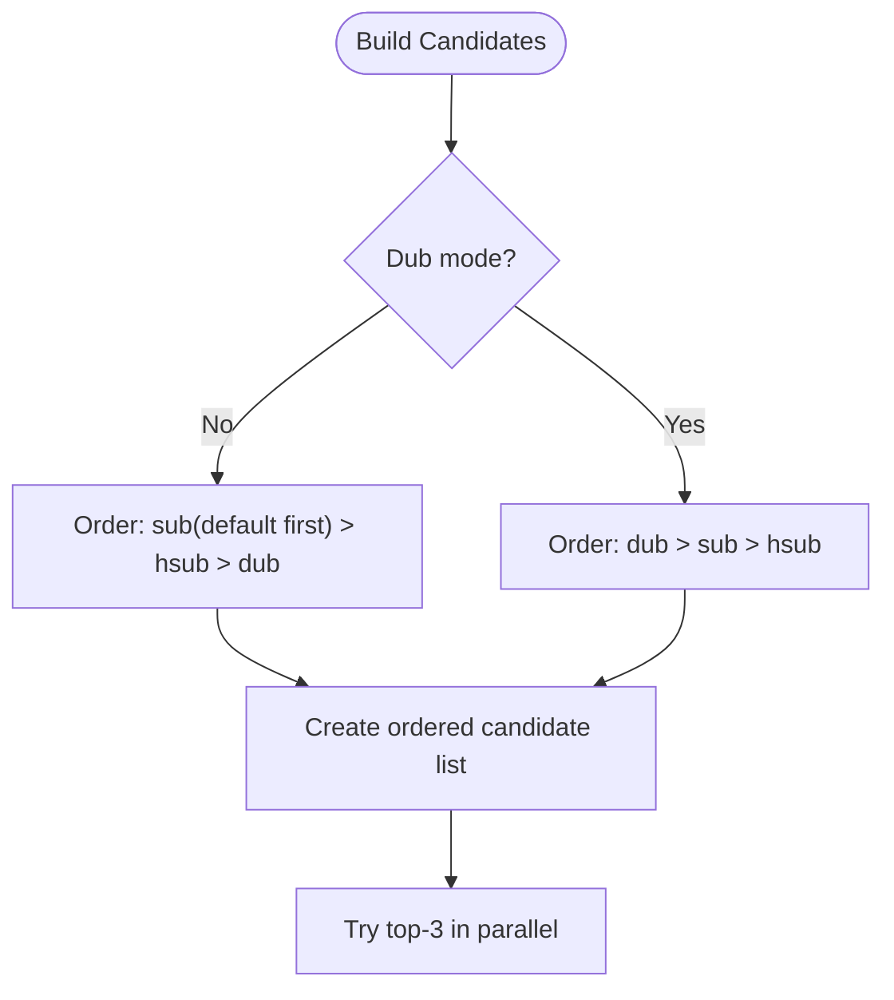
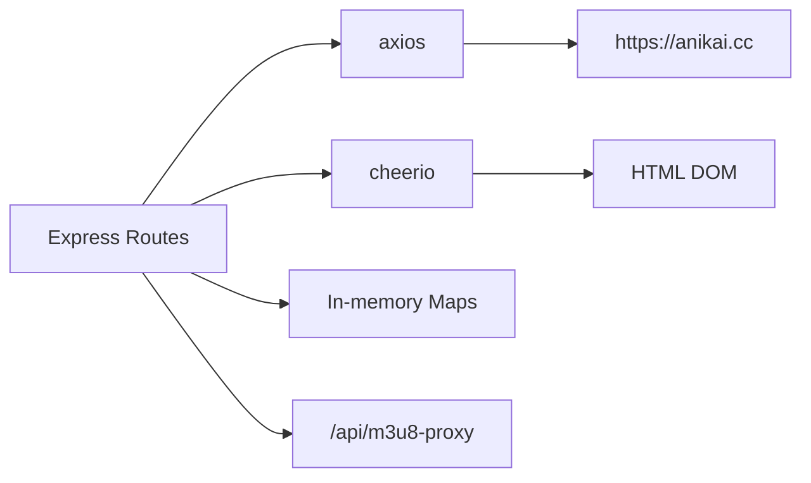

# AnimeKai Scraper Implementation

<cite>
**Referenced Files in This Document**
- [server.js](file://server.js)
</cite>

## Table of Contents
1. [Introduction](#introduction)
2. [Project Structure](#project-structure)
3. [Core Components](#core-components)
4. [Architecture Overview](#architecture-overview)
5. [Detailed Component Analysis](#detailed-component-analysis)
6. [Dependency Analysis](#dependency-analysis)
7. [Performance Considerations](#performance-considerations)
8. [Troubleshooting Guide](#troubleshooting-guide)
9. [Conclusion](#conclusion)

## Introduction
This document explains the AnimeKai web scraper implementation used by the application to find and stream anime episodes. It focuses on how HTML is parsed with Cheerio, how search results are extracted from .aitem elements, how episode pages are parsed for server groups (.server-items.lang-group), and how embed URLs are obtained from .server-video elements. It also documents the server categorization system (sub, dub, hsub), default server selection logic, embed URL extraction patterns, end-to-end scraping workflow, error handling, and timeout management.

## Project Structure
The AnimeKai scraper is implemented as server-side Node.js code that:
- Accepts API requests for searching and streaming
- Scrapes AnimeKai’s website using HTTP requests and Cheerio
- Extracts embed URLs from player pages and resolves direct HLS streams
- Caches results to reduce repeated network calls
- Returns a proxyable HLS stream URL to the client

**Diagram sources**
- [server.js:397-419](file://server.js#L397-L419)
- [server.js:518-626](file://server.js#L518-L626)
- [server.js:631-656](file://server.js#L631-L656)
- [server.js:1382-1558](file://server.js#L1382-L1558)

**Section sources**
- [server.js:397-419](file://server.js#L397-L419)
- [server.js:518-626](file://server.js#L518-L626)
- [server.js:631-656](file://server.js#L631-L656)
- [server.js:1382-1558](file://server.js#L1382-L1558)

## Core Components
- HTTP configuration and base URL:
  - Base site URL and Axios options including timeout, redirects, headers, and agent.
- In-memory caches:
  - Title-to-slug cache with TTL to avoid repeated searches.
  - Stream URL cache to serve previously resolved HLS links quickly.
- Search function:
  - Queries AnimeKai browser endpoint, parses .aitem entries, and selects the best match using title scoring and optional season filtering.
- Episode parser:
  - Loads episode page, groups servers by language via data-id, and extracts embed URLs from .server-video nodes.
- Stream extractor:
  - Fetches embed player page and extracts the direct HLS .m3u8 URL and subtitle track.
- API route:
  - Orchestrates search, parsing, candidate prioritization, parallel extraction, caching, and response formatting.

**Section sources**
- [server.js:397-419](file://server.js#L397-L419)
- [server.js:427-468](file://server.js#L427-L468)
- [server.js:518-626](file://server.js#L518-L626)
- [server.js:631-656](file://server.js#L631-L656)
- [server.js:1382-1558](file://server.js#L1382-L1558)

## Architecture Overview
The scraper follows a pipeline:
1. Receive request with title, episode, season, and optional dub preference.
2. Use cached or live search to resolve the AnimeKai slug.
3. Load the episode page and parse server groups and embed URLs.
4. Build a priority list of candidates based on language preference and defaults.
5. Attempt to extract direct HLS from top candidates in parallel; fall back sequentially if needed.
6. Cache successful stream extractions and return a proxied HLS URL.

**Diagram sources**
- [server.js:1382-1558](file://server.js#L1382-L1558)
- [server.js:518-626](file://server.js#L518-L626)
- [server.js:631-656](file://server.js#L631-L656)
- [server.js:427-468](file://server.js#L427-L468)

## Detailed Component Analysis

### Search: Extracting Results from .aitem Elements
- Endpoint used: AnimeKai browser search with keyword query parameter.
- Parsing:
  - Select all .aitem containers.
  - For each item, read the poster link href to derive the slug by removing the /watch/ prefix.
  - Read the title text for display and matching.
- Best match selection:
  - Scores titles with rules favoring exact matches, base titles, and penalizing sequels unless explicitly requested.
  - When a season number is provided, boosts results mentioning the correct season and penalizes others.

**Diagram sources**
- [server.js:518-626](file://server.js#L518-L626)

**Section sources**
- [server.js:518-626](file://server.js#L518-L626)

### Episode Page Parsing: Server Groups and Embed URLs
- Endpoint used: /watch/{slug}/ep-{N}.
- Parsing:
  - Iterate over .server-items.lang-group elements.
  - Group servers by data-id attribute values: sub, dub, hsub.
  - Within each group, iterate .server-video elements to collect:
    - embedUrl from data-video attribute
    - serverName from element text
    - isDefault flag when the element has the default class
- Output:
  - Object with arrays for sub, dub, and hsub containing embedUrl, serverName, and isDefault.

**Diagram sources**
- [server.js:631-656](file://server.js#L631-L656)

**Section sources**
- [server.js:631-656](file://server.js#L631-L656)

### Embed URL Extraction: Resolving Direct HLS Streams
- Process:
  - Fetch the embed player page using configured Axios options.
  - Extract the direct .m3u8 stream URL using regex patterns targeting JS variable assignments and quoted URLs.
  - Capture subtitle track URL from the embed URL query parameters.
  - Attach Referer header derived from the embed origin.
- Fallback behavior:
  - If extraction fails, returns null so the caller can try another server.

**Diagram sources**
- [server.js:427-468](file://server.js#L427-L468)

**Section sources**
- [server.js:427-468](file://server.js#L427-L468)

### Server Categorization and Default Selection
- Categories:
  - sub: Japanese audio with English subtitles
  - dub: English dubbed
  - hsub: Hard-subbed (subtitles burned into video)
- Priority:
  - Default mode: sub first (prefers the server marked default), then hsub, then dub.
  - Dub mode: dub first, then sub, then hsub.
- Default server detection:
  - Uses the presence of a specific CSS class on the server button to mark the preferred server within the sub category.

**Diagram sources**
- [server.js:1382-1558](file://server.js#L1382-L1558)

**Section sources**
- [server.js:1382-1558](file://server.js#L1382-L1558)

### End-to-End Scraping Workflow Example
- Request: GET /api/gogoanime/watch?title=Example%20Anime&episode=5&season=1&dub=eng
- Steps:
  1. Check cache for title::s1; if missing, call search to get slug.
  2. Load episode page for slug and episode 5; parse server groups and embed URLs.
  3. Build candidate list based on dub mode; prioritize dub servers first.
  4. Attempt to extract direct HLS from top-3 embeds in parallel; take first success.
  5. Cache the result for 20 minutes; return proxied HLS URL and metadata.
- Response includes provider, type, streamUrl, subtitleUrl, headers, episode, language, server, and optionally allServers.

**Section sources**
- [server.js:1382-1558](file://server.js#L1382-L1558)

## Dependency Analysis
- External libraries:
  - axios: HTTP client with timeout and redirect limits.
  - cheerio: HTML parsing for search results and episode pages.
- Internal modules:
  - Express routes orchestrate scraping and caching.
  - M3U8 proxy endpoint serves HLS content with required headers.

**Diagram sources**
- [server.js:397-419](file://server.js#L397-L419)
- [server.js:518-626](file://server.js#L518-L626)
- [server.js:631-656](file://server.js#L631-L656)
- [server.js:1382-1558](file://server.js#L1382-L1558)

**Section sources**
- [server.js:397-419](file://server.js#L397-L419)
- [server.js:518-626](file://server.js#L518-L626)
- [server.js:631-656](file://server.js#L631-L656)
- [server.js:1382-1558](file://server.js#L1382-L1558)

## Performance Considerations
- Timeouts:
  - Global Axios timeout set to a fixed duration to prevent hanging requests.
- Redirects:
  - Maximum redirect limit configured to avoid excessive hops.
- Caching:
  - Title-to-slug cache with one-hour TTL reduces repeated searches.
  - Stream URL cache with twenty-minute TTL avoids re-extraction on repeat clicks.
- Parallelism:
  - Top three candidate embeds are attempted concurrently to minimize latency.
- Defaults:
  - Prefers default server within sub category to improve reliability.

[No sources needed since this section provides general guidance]

## Troubleshooting Guide
Common issues and remedies:
- Missing title parameter:
  - The API returns a 400 error if title is not provided.
- No search results:
  - The API returns a 404 error indicating the anime was not found on AnimeKai.
- No streams for episode:
  - The API returns a 404 error when no embed URLs are available for the episode.
- Extraction failures:
  - If all embed extractions fail, the API falls back to returning an iframe source as last resort.
- Network errors:
  - Errors during scraping or extraction result in a 500 error with message details.

Operational tips:
- Verify network connectivity and DNS resolution to AnimeKai.
- Ensure referer and user-agent headers are present to avoid blocking.
- Monitor logs for “[ANIMEKAI]” prefixed messages to trace search, parsing, and extraction steps.

**Section sources**
- [server.js:1382-1558](file://server.js#L1382-L1558)

## Conclusion
The AnimeKai scraper integrates search, parsing, and stream extraction into a robust pipeline with caching and parallel attempts to deliver fast, reliable HLS streams. It supports multiple language categories, respects default server preferences, and handles errors gracefully. The design balances performance and resilience through timeouts, redirects control, and in-memory caches.

[No sources needed since this section summarizes without analyzing specific files]