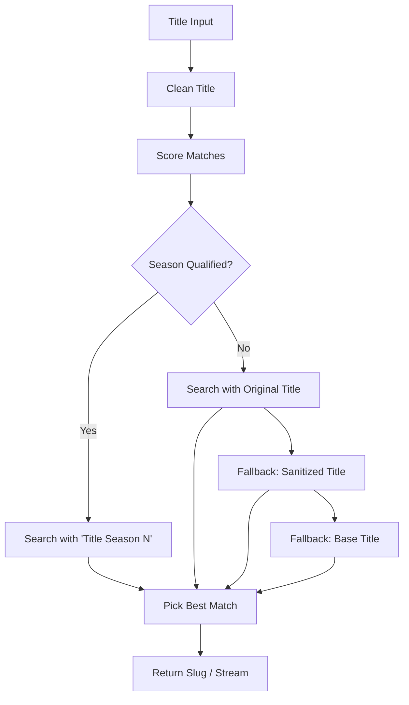
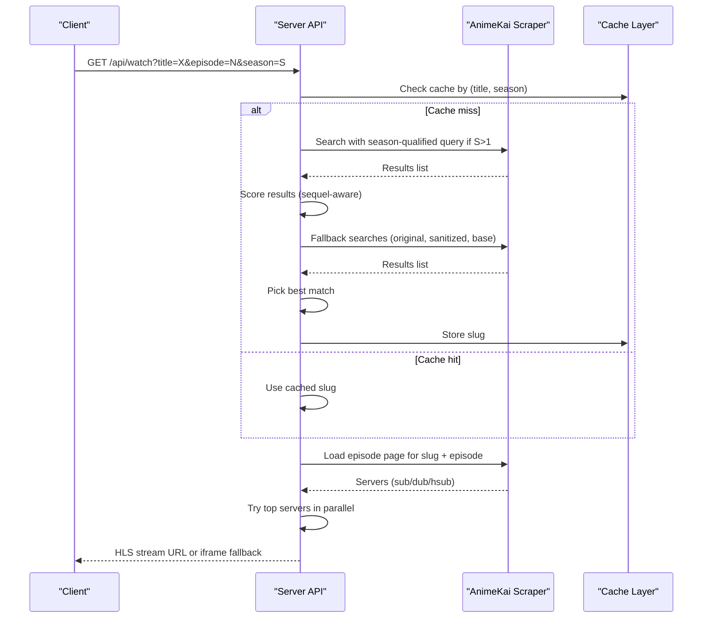
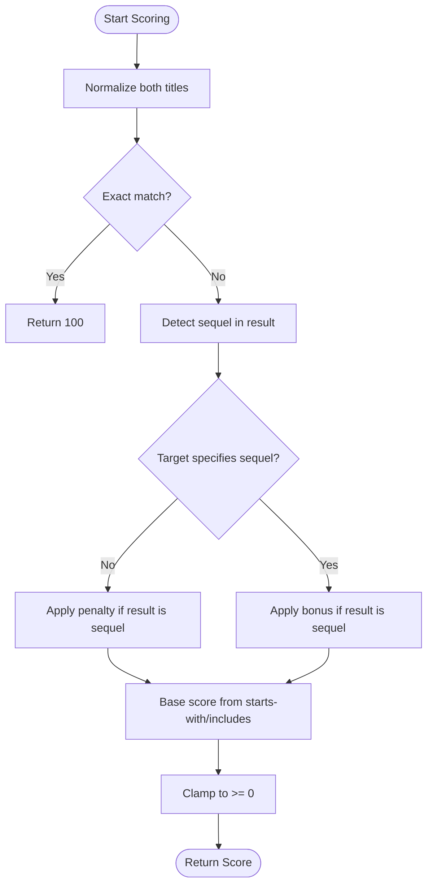
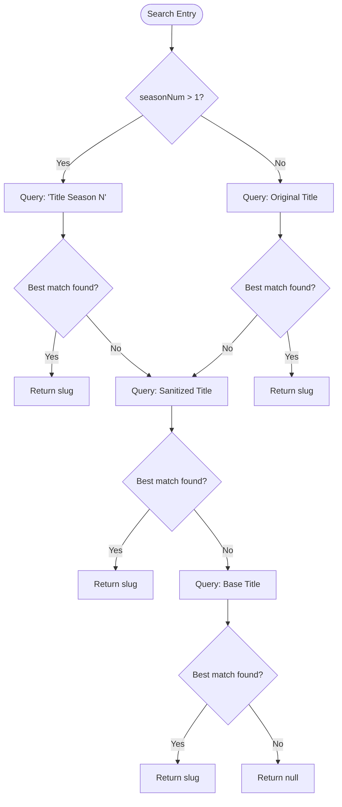
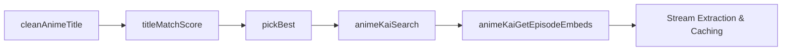

# Season Detection & Qualification

<cite>
**Referenced Files in This Document**
- [server.js](file://server.js)
</cite>

## Table of Contents
1. [Introduction](#introduction)
2. [Project Structure](#project-structure)
3. [Core Components](#core-components)
4. [Architecture Overview](#architecture-overview)
5. [Detailed Component Analysis](#detailed-component-analysis)
6. [Dependency Analysis](#dependency-analysis)
7. [Performance Considerations](#performance-considerations)
8. [Troubleshooting Guide](#troubleshooting-guide)
9. [Conclusion](#conclusion)

## Introduction
This document explains the season detection and qualification system used to handle multi-season anime content. It covers how the system identifies season numbers from titles, handles sequel keywords (Season 2, 3rd Season, Part 2), applies penalties or bonuses during matching, and follows a robust search strategy that prioritizes season-qualified queries before falling back to original, sanitized, and base titles. It also includes examples of complex scenarios and how the system avoids common pitfalls such as incorrectly matching “Jujutsu Kaisen 3rd Season” when searching for “Jujutsu Kaisen”.

## Project Structure
The season detection and qualification logic is implemented on the server side within a single file that orchestrates title cleaning, scoring, and a multi-step search strategy against an external source. The key functions involved are:
- Title cleaning utility
- Scoring function for title matches with sequel awareness
- Search function implementing a fallback chain
- Episode embed retrieval and stream resolution

[No sources needed since this diagram shows conceptual workflow, not actual code structure]

## Core Components
- Title Cleaning: Removes suffixes like (TV), (Sub), (Dub), (Uncensored), (Media), and parenthesized season markers to normalize titles for comparison.
- Sequel Detection and Scoring: Detects sequel indicators in result names (e.g., “Season 2”, “3rd Season”, “Part 2”, “Cour 2”, “Movie”, “Movie 2”) and specific named arcs/seasons. Applies heavy penalties when a result contains sequel keywords but the target query does not specify a sequel. Rewards matches when the target explicitly requests a sequel.
- Search Strategy: Attempts queries in order:
  1) Season-qualified query when a season number > 1 is provided
  2) Original title
  3) Sanitized title (strips trailing punctuation and parentheses)
  4) Base title (before colon/hyphen)
- Season-Aware Selection: When a season number is provided, boosts results that explicitly mention the correct season and penalizes those mentioning a different season. Treats unlabelled results favorably for Season 1.

**Section sources**
- [server.js:471-476](file://server.js#L471-L476)
- [server.js:478-516](file://server.js#L478-L516)
- [server.js:518-626](file://server.js#L518-L626)

## Architecture Overview
The system integrates into the server’s watch/search endpoints to resolve the best slug for a given title and optional season number, then retrieves episode embeds and streams.

**Diagram sources**
- [server.js:1400-1559](file://server.js#L1400-L1559)
- [server.js:518-626](file://server.js#L518-L626)

**Section sources**
- [server.js:1400-1559](file://server.js#L1400-L1559)
- [server.js:518-626](file://server.js#L518-L626)

## Detailed Component Analysis

### Title Cleaning
- Purpose: Normalize titles by removing non-essential suffixes and parenthesized season markers to enable fair comparisons.
- Behavior: Converts to lowercase, removes known suffixes, strips parenthesized season annotations, and trims whitespace.

**Section sources**
- [server.js:471-476](file://server.js#L471-L476)

### Sequel Detection and Scoring
- Sequel Indicators: Recognizes patterns like “Season 2”, “3rd Season”, “Part 2”, “Cour 2”, “Movie”, “Movie 2”, and certain named arcs/seasons.
- Target Query Awareness: Checks whether the user’s query itself specifies a season/sequel. If not, results containing sequel keywords are heavily penalized to ensure base titles win.
- Scoring Logic:
  - Exact matches score highest.
  - Starts-with and inclusion checks provide intermediate scores.
  - Penalty applied when result has sequel keywords but target does not request one.
  - Bonus applied when target explicitly requests a sequel and result matches.

**Diagram sources**
- [server.js:478-516](file://server.js#L478-L516)

**Section sources**
- [server.js:478-516](file://server.js#L478-L516)

### Search Strategy and Season-Aware Selection
- Stepwise Search:
  1) If season number > 1, try “Title Season N” first.
  2) Fall back to original title.
  3) Fall back to sanitized title (removes trailing punctuation and parentheses).
  4) Fall back to base title (text before colon/hyphen).
- Season-Aware Selection:
  - Boosts results that explicitly name the requested season (“Season N”, “Nth Season”, “Part N”).
  - Penalizes results mentioning a different season number.
  - For Season 1, favors unlabelled results since many entries omit “Season 1”.

**Diagram sources**
- [server.js:518-626](file://server.js#L518-L626)

**Section sources**
- [server.js:518-626](file://server.js#L518-L626)

### Episode Embed Resolution and Streaming
- After selecting a slug, the system loads the episode page, collects available servers grouped by language (sub, dub, hsub), and attempts to extract direct HLS streams.
- Parallel Top-3 Strategy: Tries the top three candidate servers concurrently and selects the first successful extraction; falls back sequentially to remaining candidates if needed.
- Fallback: If all extractions fail, returns an iframe-based player as a last resort.
- Caching: Stream URLs are cached for repeat access to improve performance.

**Section sources**
- [server.js:1400-1559](file://server.js#L1400-L1559)

## Dependency Analysis
- Title Matching depends on:
  - cleanAnimeTitle for normalization
  - Regex patterns for sequel detection and target query analysis
- Search Strategy depends on:
  - performSearch to fetch results from the external site
  - pickBest to apply scoring and season-aware selection
- Episode Retrieval depends on:
  - Page parsing to collect server groups and video links
  - Stream extraction utilities and caching layer

**Diagram sources**
- [server.js:471-476](file://server.js#L471-L476)
- [server.js:478-516](file://server.js#L478-L516)
- [server.js:518-626](file://server.js#L518-L626)
- [server.js:628-656](file://server.js#L628-L656)

**Section sources**
- [server.js:471-476](file://server.js#L471-L476)
- [server.js:478-516](file://server.js#L478-L516)
- [server.js:518-626](file://server.js#L518-L626)
- [server.js:628-656](file://server.js#L628-L656)

## Performance Considerations
- Early Returns: The search strategy returns immediately upon finding a best match at each step, minimizing unnecessary network calls.
- Parallel Extraction: The top three candidate servers are tried in parallel to reduce latency when resolving streams.
- Caching: Both slugs and stream URLs are cached to avoid repeated scraping and extraction.
- Minimal Regex Overhead: Sequel detection uses targeted regex patterns only where necessary.

[No sources needed since this section provides general guidance]

## Troubleshooting Guide
Common issues and resolutions:
- Incorrect Season Match:
  - Symptom: Searching “Jujutsu Kaisen” returns “Jujutsu Kaisen 3rd Season”.
  - Cause: Result contains sequel keywords while target query does not specify a season.
  - Resolution: The system applies a heavy penalty to sequel-tagged results when the target query lacks a season specifier, ensuring base titles win. Verify that the target query does not include unintended season keywords.
- No Results Found:
  - Symptom: Search returns null.
  - Cause: All four query strategies failed (season-qualified, original, sanitized, base).
  - Resolution: Inspect logs for attempted queries and consider adjusting input formatting or relying on fallback providers.
- Stream Extraction Failures:
  - Symptom: No HLS stream returned; iframe fallback used.
  - Cause: All candidate servers failed to provide a direct stream.
  - Resolution: Retry later or switch audio mode; check server availability.

**Section sources**
- [server.js:478-516](file://server.js#L478-L516)
- [server.js:518-626](file://server.js#L518-L626)
- [server.js:1483-1528](file://server.js#L1483-L1528)

## Conclusion
The season detection and qualification system combines robust title normalization, sequel-aware scoring, and a layered search strategy to reliably select the correct anime entry across multiple seasons and variants. By penalizing sequel-tagged results when the target query does not request a season and rewarding explicit matches when it does, the system avoids common pitfalls like mismatching “Jujutsu Kaisen 3rd Season” for a base title search. The subsequent episode resolution pipeline ensures efficient stream delivery with parallel server attempts and caching.

[No sources needed since this section summarizes without analyzing specific files]