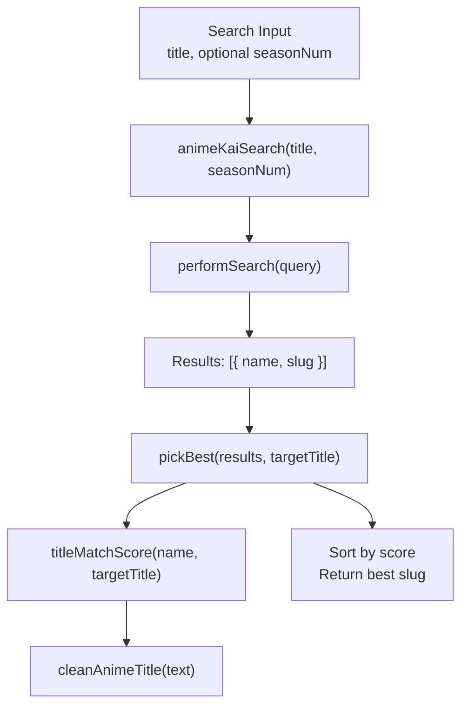
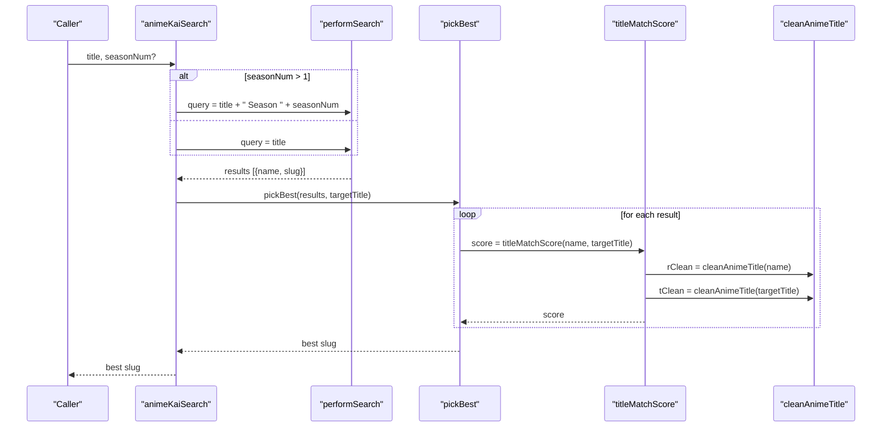
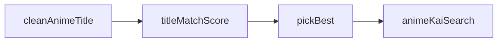

# Title Matching & Scoring System

<cite>
**Referenced Files in This Document**
- [server.js](file://server.js)
</cite>

## Table of Contents
1. [Introduction](#introduction)
2. [Project Structure](#project-structure)
3. [Core Components](#core-components)
4. [Architecture Overview](#architecture-overview)
5. [Detailed Component Analysis](#detailed-component-analysis)
6. [Dependency Analysis](#dependency-analysis)
7. [Performance Considerations](#performance-considerations)
8. [Troubleshooting Guide](#troubleshooting-guide)
9. [Conclusion](#conclusion)

## Introduction
This document explains the anime title matching and scoring system used to normalize titles and rank search results. It focuses on:
- Normalization via cleanAnimeTitle, which removes common suffixes like (TV), (Sub), (Dub), (Uncensored), and season indicators such as (Season 2).
- The titleMatchScore algorithm that assigns numerical scores based on exact matches, prefix matches, inclusion matches, sequel detection, and penalties for unwanted seasonal variants.
- How these functions are integrated into the search flow to pick the best match from a list of candidates.

## Project Structure
The title matching and scoring logic is implemented in the server-side codebase. The key functions are defined in a single file and consumed by the search pipeline.

**Diagram sources**
- [server.js:518-626](file://server.js#L518-L626)
- [server.js:471-516](file://server.js#L471-L516)

**Section sources**
- [server.js:471-626](file://server.js#L471-L626)

## Core Components
- cleanAnimeTitle(t): Normalizes an anime title by lowercasing and removing specific suffixes and season indicators.
- titleMatchScore(resultName, targetTitle): Scores how well a candidate result matches the target query using multiple rules.
- animeKaiSearch(title, seasonNum): Orchestrates search attempts and uses titleMatchScore to select the best match.

Key responsibilities:
- Normalization ensures consistent comparison across different title formats.
- Scoring prioritizes exact matches, then base-title matches, while penalizing sequels when not requested.
- Search orchestration tries multiple queries (season-qualified, original, sanitized, base) to maximize hit rate.

**Section sources**
- [server.js:471-516](file://server.js#L471-L516)
- [server.js:518-626](file://server.js#L518-L626)

## Architecture Overview
The system follows a simple pipeline:
1. Normalize both candidate and target titles for fair comparison.
2. Score each candidate against the target using exact/prefix/inclusion heuristics and sequel-aware adjustments.
3. If a season number is provided, apply additional boosts/penalties for explicit season mentions.
4. Choose the highest-scoring candidate.

**Diagram sources**
- [server.js:518-626](file://server.js#L518-L626)
- [server.js:471-516](file://server.js#L471-L516)

## Detailed Component Analysis

### cleanAnimeTitle(t)
Purpose:
- Normalize titles by removing common suffixes and season indicators to enable robust comparisons.

Behavior:
- Lowercases the input.
- Removes suffixes in parentheses: TV, Sub, Dub, Uncensored, Media.
- Removes season indicators in parentheses with digits: (Season N).
- Trims whitespace.

Impact:
- Enables “Jujutsu Kaisen (TV)” to be treated as “jujutsu kaisen” for matching purposes.
- Prevents season tags from affecting base-title matching unless explicitly requested.

Complexity:
- Time: O(n) where n is the length of the title string.
- Space: O(n) for the normalized string.

Example transformations (conceptual):
- “Attack on Titan (TV)” → “attack on titan”
- “Demon Slayer (Season 2)” → “demon slayer”
- “One Piece (Sub)” → “one piece”

**Section sources**
- [server.js:471-476](file://server.js#L471-L476)

### titleMatchScore(resultName, targetTitle)
Purpose:
- Assign a numerical score indicating how well a candidate result matches the target query.

Algorithm overview:
- Exact match: Returns the highest score if the raw or cleaned strings match exactly.
- Sequel detection: Identifies sequel-like terms in the result (e.g., “Season 2”, “Part 2”, “Movie”, or known arc names).
- Target sequel detection: Checks if the target query itself requests a sequel.
- Base match heuristics:
  - Prefix match (result starts with target) gets a high score.
  - Inclusion match (target appears within result) gets a moderate score.
- Penalty/Bonus for sequels:
  - If result has sequel keywords but target does not request one, apply a heavy penalty.
  - If both result and target indicate a sequel, apply a bonus.
- Final score is clamped to a non-negative value.

Scoring highlights:
- Exact match: Highest priority.
- Prefix match: Strong positive signal.
- Inclusion match: Moderate positive signal.
- Unwanted sequel variant: Significant penalty to avoid selecting “X Season 2” when user searched “X”.
- Requested sequel: Bonus to prefer the correct sequel when explicitly asked.

Complexity:
- Time: O(n + m) for string operations and regex checks, where n and m are lengths of result and target.
- Space: O(1) beyond temporary variables.

Edge cases handled:
- Case-insensitive matching via lowercasing.
- Whitespace normalization via trimming.
- Robustness against varied season phrasing (“Season 2”, “2nd Season”, “Part 2”).

**Section sources**
- [server.js:478-516](file://server.js#L478-L516)

### animeKaiSearch(title, seasonNum)
Purpose:
- Perform multi-stage search to find the best matching slug for a given title, optionally constrained to a specific season.

Flow:
- If seasonNum > 1, first try a season-qualified query (e.g., “Title Season 2”).
- Then try the original title.
- Then try a sanitized version (strips trailing punctuation and parenthetical segments).
- Finally, try the base title before any colon/hyphen separator.
- For each attempt, parse results and use pickBest to choose the top candidate.

pickBest behavior:
- Applies titleMatchScore to each result.
- If seasonNum is provided:
  - Boost results that explicitly mention the requested season.
  - Penalize results mentioning a different season.
  - For season 1, do not penalize unlabelled results (since season 1 is often omitted).
- Sorts by score descending and returns the top slug.

Complexity:
- Depends on number of search attempts and number of results per attempt; typically small constant number of attempts and limited results.

Error handling:
- Network errors during search return empty results gracefully.
- Logging provides visibility into attempted queries and scored results.

**Section sources**
- [server.js:518-626](file://server.js#L518-L626)

## Dependency Analysis
- cleanAnimeTitle is used by titleMatchScore to normalize both sides of the comparison.
- titleMatchScore is used by pickBest inside animeKaiSearch to evaluate candidates.
- animeKaiSearch orchestrates search attempts and delegates selection to pickBest.

**Diagram sources**
- [server.js:471-516](file://server.js#L471-L516)
- [server.js:518-626](file://server.js#L518-L626)

**Section sources**
- [server.js:471-626](file://server.js#L471-L626)

## Performance Considerations
- String operations are lightweight and run on short inputs (titles), so performance impact is minimal.
- Regex checks are bounded and executed only once per candidate per search attempt.
- The search function tries a fixed set of queries, keeping network calls predictable.
- Sorting is performed over a small array of results, typical for search result sets.

[No sources needed since this section provides general guidance]

## Troubleshooting Guide
Common issues and diagnostics:
- No results found:
  - Check logs for attempted queries (season-qualified, original, sanitized, base).
  - Verify external site availability and response parsing selectors.
- Wrong season selected:
  - Ensure seasonNum is correctly passed when applicable.
  - Confirm that result titles contain recognizable season markers for boosting/penalty logic.
- Unexpected low scores:
  - Review whether result contains sequel keywords without target requesting them, triggering penalties.
  - Validate that cleanAnimeTitle is stripping expected suffixes.

Operational tips:
- Inspect console logs printed by the search pipeline to see attempted queries and top-scoring candidates.
- When debugging, temporarily adjust logging verbosity around performSearch and pickBest.

**Section sources**
- [server.js:518-626](file://server.js#L518-L626)

## Conclusion
The title matching and scoring system combines robust normalization with heuristic-based scoring to reliably match anime titles despite variations in formatting and season indicators. By penalizing unwanted sequel variants and rewarding explicit season matches, it improves accuracy in selecting the intended entry. The modular design keeps normalization, scoring, and search orchestration clear and maintainable.

[No sources needed since this section summarizes without analyzing specific files]