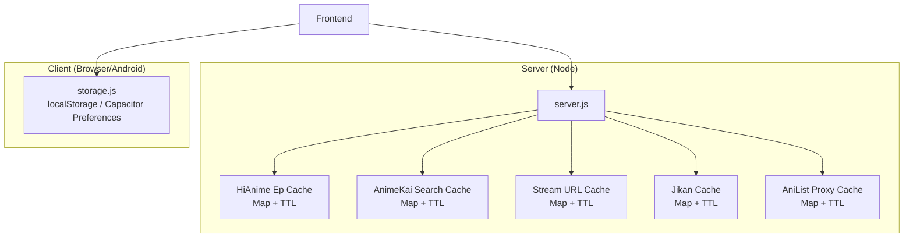
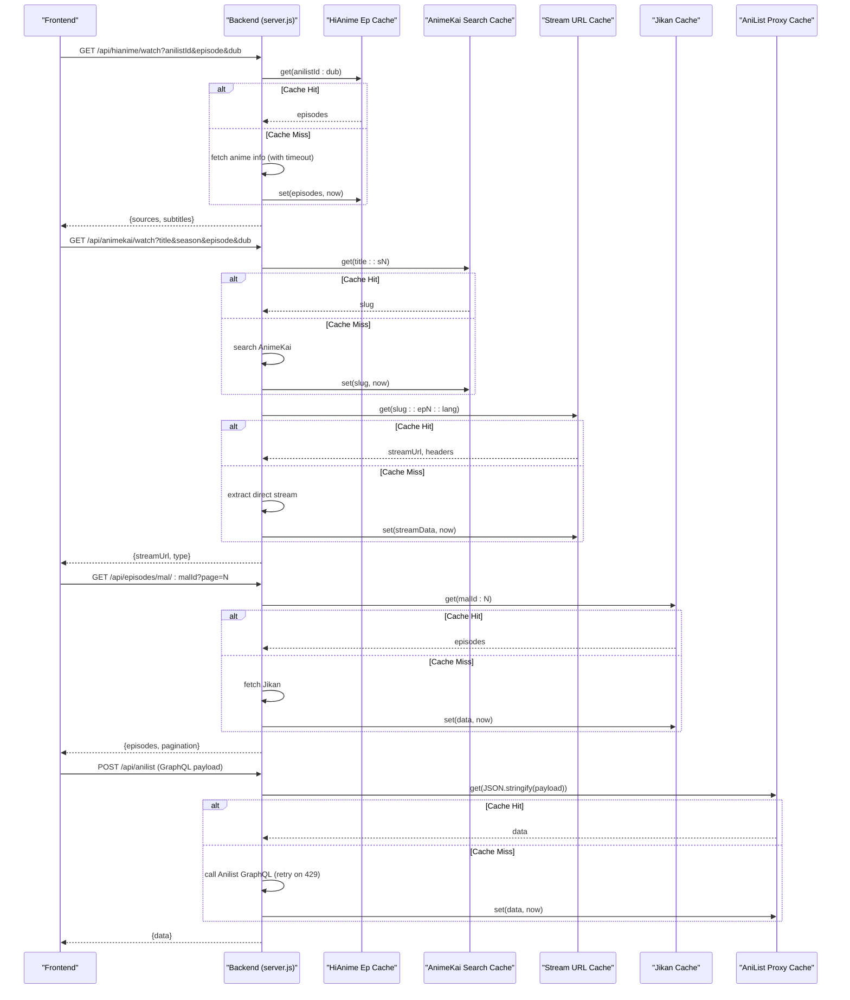
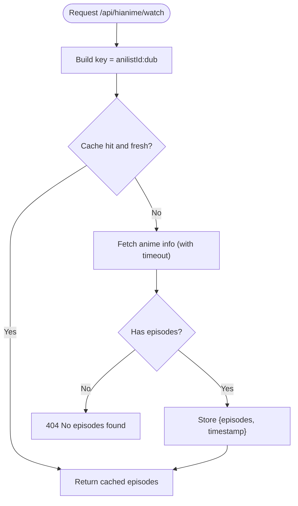
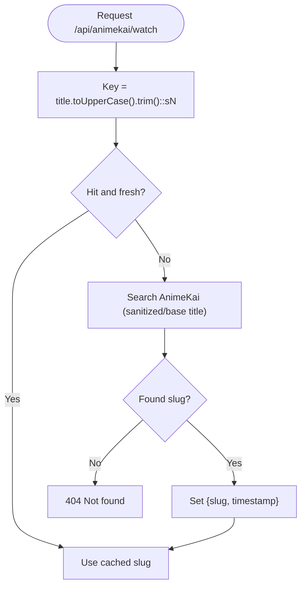
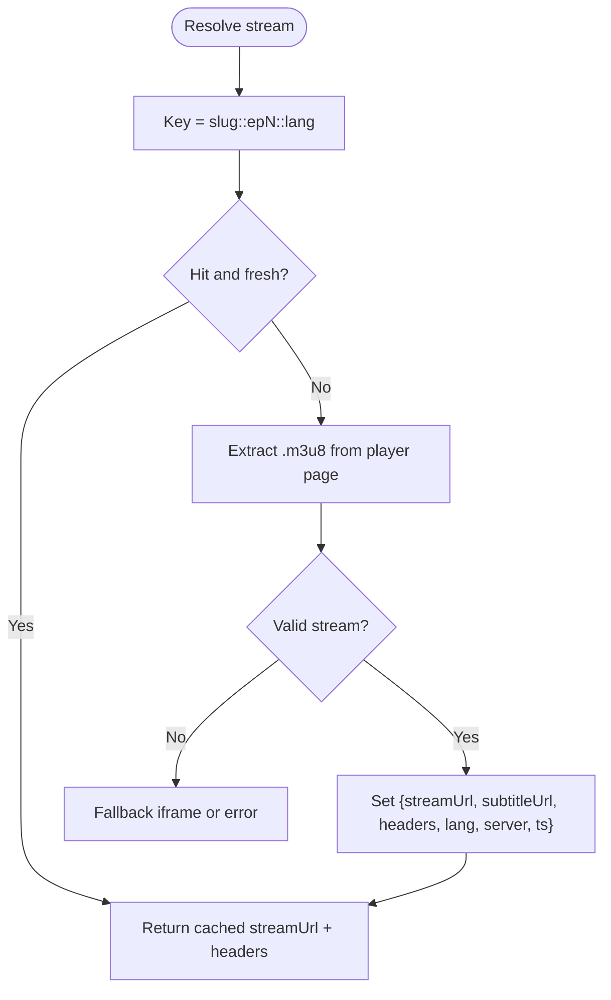
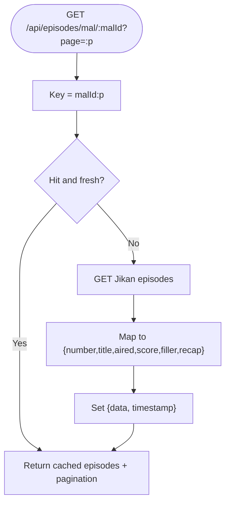
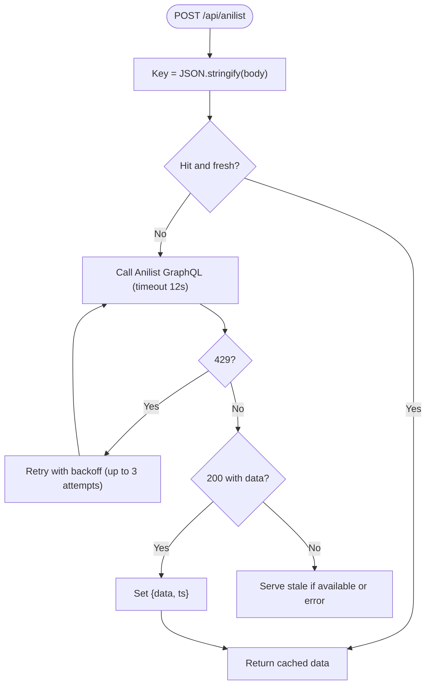
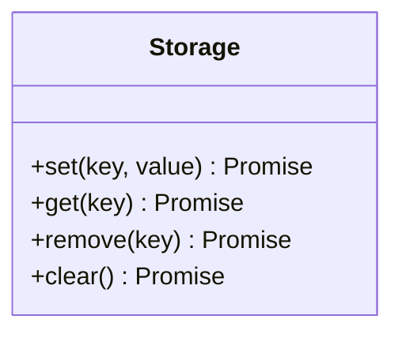
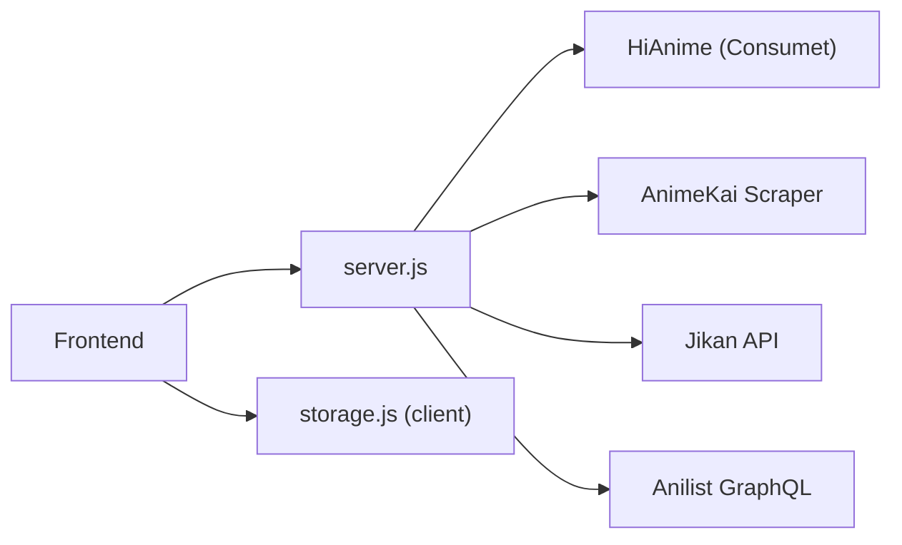

# Caching & Performance Optimization

<cite>
**Referenced Files in This Document**
- [server.js](file://server.js)
- [storage.js](file://src/utils/storage.js)
- [mockData.js](file://src/mockData.js)
</cite>

## Table of Contents
1. [Introduction](#introduction)
2. [Project Structure](#project-structure)
3. [Core Components](#core-components)
4. [Architecture Overview](#architecture-overview)
5. [Detailed Component Analysis](#detailed-component-analysis)
6. [Dependency Analysis](#dependency-analysis)
7. [Performance Considerations](#performance-considerations)
8. [Troubleshooting Guide](#troubleshooting-guide)
9. [Conclusion](#conclusion)

## Introduction
This document explains the multi-layered caching system that optimizes performance across different data types: HiAnime episode lists, AnimeKai search results, stream URLs, and Jikan API responses. It covers TTL strategies, cache key generation, collision avoidance, warming techniques, hit/miss scenarios, monitoring, and troubleshooting.

## Project Structure
The caching logic is implemented primarily in the Node.js server with additional persistent storage utilities on the client side.

**Diagram sources**
- [server.js:220-230](file://server.js#L220-L230)
- [server.js:414-426](file://server.js#L414-L426)
- [server.js:1161-1163](file://server.js#L1161-L1163)
- [storage.js:1-71](file://src/utils/storage.js#L1-L71)

**Section sources**
- [server.js:220-230](file://server.js#L220-L230)
- [server.js:414-426](file://server.js#L414-L426)
- [server.js:1161-1163](file://server.js#L1161-L1163)
- [storage.js:1-71](file://src/utils/storage.js#L1-L71)

## Core Components
- HiAnime episode list cache: stores per-anilistId + audio mode episode lists with a 30-minute TTL.
- AnimeKai search cache: stores title-to-slug mappings with a 1-hour TTL.
- Stream URL cache: stores resolved stream metadata for a specific slug+episode+language with a 20-minute TTL.
- Jikan episode metadata cache: stores MAL ID + page responses with a 1-hour TTL.
- AniList GraphQL proxy cache: caches full request payloads to reduce rate-limited calls with a 1-hour TTL.
- Client-side persistent storage: provides durable key/value storage via Capacitor Preferences or localStorage.

Key behaviors:
- TTL checks use current time minus stored timestamp against configured TTLs.
- Keys are constructed to avoid collisions by including all relevant dimensions (e.g., anilistId + audio mode; title + season; slug + episode + language).
- On miss, the system fetches from upstream providers and writes back into the cache.

**Section sources**
- [server.js:220-230](file://server.js#L220-L230)
- [server.js:414-426](file://server.js#L414-L426)
- [server.js:1161-1163](file://server.js#L1161-L1163)
- [server.js:662-710](file://server.js#L662-L710)
- [server.js:1164-1208](file://server.js#L1164-L1208)
- [storage.js:1-71](file://src/utils/storage.js#L1-L71)

## Architecture Overview
The backend exposes endpoints that route through layered caches before hitting external APIs or providers.

**Diagram sources**
- [server.js:1210-1278](file://server.js#L1210-L1278)
- [server.js:1387-1543](file://server.js#L1387-L1543)
- [server.js:662-710](file://server.js#L662-L710)
- [server.js:1164-1208](file://server.js#L1164-L1208)

## Detailed Component Analysis

### HiAnime Episode List Cache
- Purpose: Avoid repeated expensive lookups for episode lists per AniList ID and audio mode.
- Key: `anilistId:dub` where dub is derived from query parameter (eng -> dub, otherwise sub).
- TTL: 30 minutes.
- Behavior: If missing or expired, fetch via Consumet’s AniList-HiAnime adapter with a 3-second timeout fallback; store episodes and timestamp.
- Collision avoidance: Separate entries for sub vs dub ensure correct audio track selection.

**Diagram sources**
- [server.js:1210-1278](file://server.js#L1210-L1278)

**Section sources**
- [server.js:220-230](file://server.js#L220-L230)
- [server.js:1210-1278](file://server.js#L1210-L1278)

### AnimeKai Search Cache
- Purpose: Cache title-to-slug mapping per title and season to avoid repeated searches.
- Key: `TITLE::sN` where N defaults to 1 if unspecified.
- TTL: 1 hour.
- Behavior: On miss, perform search with multiple sanitization strategies; store slug and timestamp.

**Diagram sources**
- [server.js:1387-1413](file://server.js#L1387-L1413)

**Section sources**
- [server.js:414-419](file://server.js#L414-L419)
- [server.js:1387-1413](file://server.js#L1387-L1413)

### Stream URL Cache
- Purpose: Cache resolved direct stream URLs and headers per slug+episode+language to speed up repeat playback attempts.
- Key: `slug::epN::lang`.
- TTL: 20 minutes.
- Behavior: On miss, extract direct HLS stream from provider player page; store streamUrl, subtitleUrl, headers, language, server; return proxied URL.

**Diagram sources**
- [server.js:1465-1543](file://server.js#L1465-L1543)

**Section sources**
- [server.js:414-419](file://server.js#L414-L419)
- [server.js:1465-1543](file://server.js#L1465-L1543)

### Jikan Episode Metadata Cache
- Purpose: Cache MAL episode listings per page to reduce external API calls.
- Key: `malId:page`.
- TTL: 1 hour.
- Behavior: On miss, fetch from Jikan v4, map fields, paginate metadata, then cache result.

**Diagram sources**
- [server.js:662-710](file://server.js#L662-L710)

**Section sources**
- [server.js:414-426](file://server.js#L414-L426)
- [server.js:662-710](file://server.js#L662-L710)

### AniList GraphQL Proxy Cache
- Purpose: Cache full GraphQL payloads to mitigate rate limits and repeated network calls.
- Key: JSON stringified request body.
- TTL: 1 hour.
- Behavior: On miss, call Anilist GraphQL with retries on 429; cache successful response; serve cached data on subsequent identical requests.

**Diagram sources**
- [server.js:1164-1208](file://server.js#L1164-L1208)

**Section sources**
- [server.js:1161-1163](file://server.js#L1161-L1163)
- [server.js:1164-1208](file://server.js#L1164-L1208)

### Client-Side Persistent Storage
- Purpose: Provide durable key/value storage across app restarts on Android via Capacitor Preferences, falling back to localStorage on web.
- Operations: set, get, remove, clear with JSON serialization.

**Diagram sources**
- [storage.js:1-71](file://src/utils/storage.js#L1-L71)

**Section sources**
- [storage.js:1-71](file://src/utils/storage.js#L1-L71)

## Dependency Analysis
- The caches are simple in-memory Maps with TTL checks; they have no external dependencies beyond Node runtime.
- External integrations:
  - Consumet extensions for HiAnime via AniList mapping.
  - AnimeKai scraper for search and embed extraction.
  - Jikan API for episode metadata.
  - Anilist GraphQL for rich metadata and rate-limit handling.
- Frontend integration:
  - Mock data layer triggers backend endpoints and can surface cache-related logs/warnings.

**Diagram sources**
- [server.js:220-230](file://server.js#L220-L230)
- [server.js:414-426](file://server.js#L414-L426)
- [server.js:662-710](file://server.js#L662-L710)
- [server.js:1164-1208](file://server.js#L1164-L1208)
- [mockData.js:721-749](file://src/mockData.js#L721-L749)

**Section sources**
- [server.js:220-230](file://server.js#L220-L230)
- [server.js:414-426](file://server.js#L414-L426)
- [server.js:662-710](file://server.js#L662-L710)
- [server.js:1164-1208](file://server.js#L1164-L1208)
- [mockData.js:721-749](file://src/mockData.js#L721-L749)

## Performance Considerations
- TTL tuning:
  - HiAnime episodes: 30 minutes balances freshness and load reduction.
  - AnimeKai search: 1 hour reduces repeated title searches.
  - Stream URLs: 20 minutes avoids re-extraction while keeping streams reasonably fresh.
  - Jikan episodes: 1 hour reduces frequent metadata calls.
  - AniList GraphQL: 1 hour mitigates rate limiting and repeated queries.
- Memory management:
  - In-memory Maps grow until process restart; consider periodic cleanup or size caps in high-traffic deployments.
- Network resilience:
  - Timeouts and retries prevent long hangs (e.g., HiAnime 3s timeout, Anilist retry on 429).
- Streaming efficiency:
  - Segment proxies forward Range headers for byte-range streaming to minimize bandwidth and startup time.

[No sources needed since this section provides general guidance]

## Troubleshooting Guide
Common issues and how to diagnose them:
- Missing or expired cache entries:
  - Verify TTL values and timestamps; check logs for “Cache hit” messages.
  - For AniList, watch for 429 rate limit warnings and confirm retry behavior.
- Incorrect keys or collisions:
  - Ensure keys include all necessary dimensions (e.g., dub mode for HiAnime, season for AnimeKai, language for streams).
- Provider failures:
  - Use status endpoint to probe external services; check logs for timeouts and errors.
- Stream playback issues:
  - Confirm stream cache contains valid streamUrl and headers; verify m3u8-proxy and ts-proxy endpoints are reachable.
- Client persistence problems:
  - On Android, ensure Capacitor Preferences plugin loads; on web, verify localStorage availability and capacity.

Operational tips:
- Monitor logs for cache hits/misses and provider health.
- Use deep status checks to validate external endpoints.
- When debugging, temporarily increase TTLs to isolate network vs cache issues.

**Section sources**
- [server.js:1164-1208](file://server.js#L1164-L1208)
- [server.js:1304-1336](file://server.js#L1304-L1336)
- [server.js:263-345](file://server.js#L263-L345)
- [server.js:354-393](file://server.js#L354-L393)
- [storage.js:1-71](file://src/utils/storage.js#L1-L71)

## Conclusion
The caching system uses targeted in-memory Maps with well-defined TTLs to optimize performance across diverse data types. Keys are designed to avoid collisions, and fallbacks/retries improve resilience. Monitoring via logs and status endpoints helps maintain reliability. For production-scale deployments, consider adding cache size limits and background warming to further stabilize performance.

[No sources needed since this section summarizes without analyzing specific files]