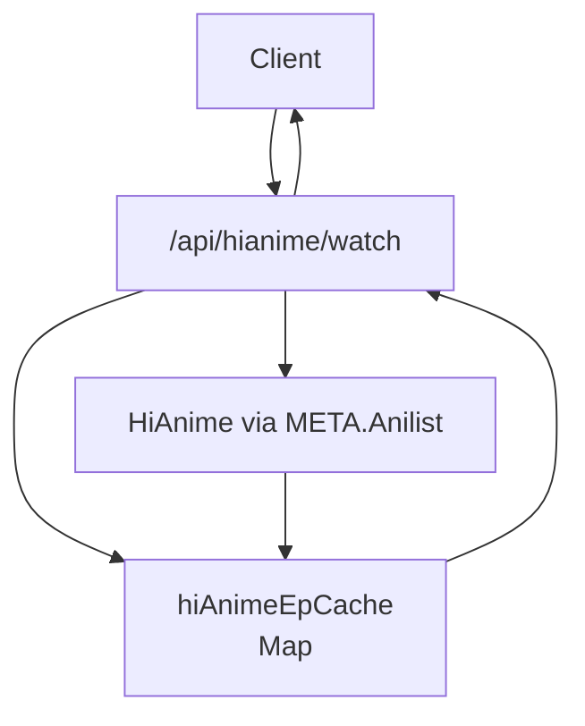
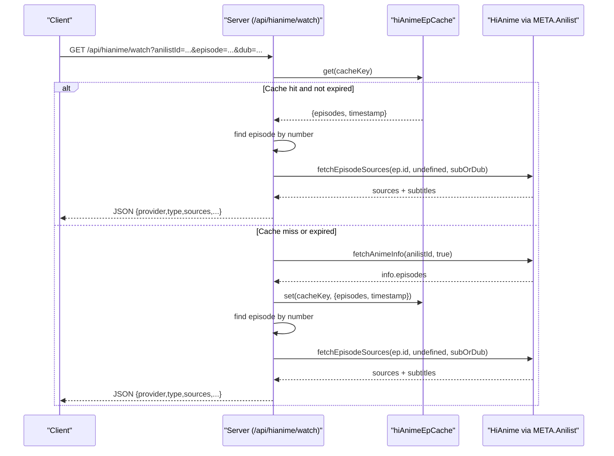
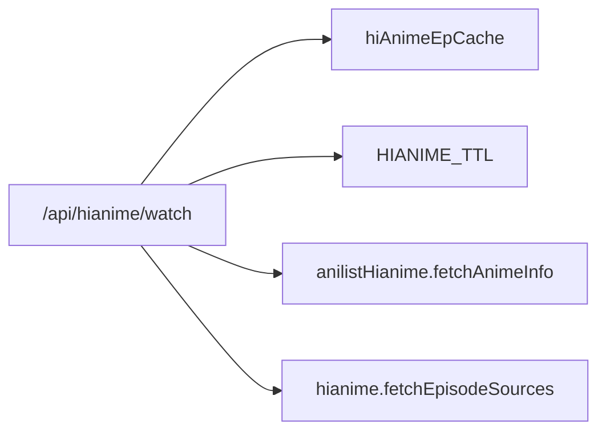

# Episode Metadata Caching

<cite>
**Referenced Files in This Document**
- [server.js](file://server.js)
</cite>

## Table of Contents
1. [Introduction](#introduction)
2. [Project Structure](#project-structure)
3. [Core Components](#core-components)
4. [Architecture Overview](#architecture-overview)
5. [Detailed Component Analysis](#detailed-component-analysis)
6. [Dependency Analysis](#dependency-analysis)
7. [Performance Considerations](#performance-considerations)
8. [Troubleshooting Guide](#troubleshooting-guide)
9. [Conclusion](#conclusion)

## Introduction
This document explains the episode metadata caching system for HiAnime that stores episode lists and maps them to AniList IDs. It covers the in-memory cache structure, TTL strategy, cache key generation, data flow, and operational behavior. The goal is to reduce repeated network calls to external providers and speed up episode lookups by serving cached episode lists when available.

## Project Structure
The episode metadata caching logic is implemented in the server-side HTTP handlers within a single Node.js file. The relevant parts include:
- A global Map-based cache for HiAnime episode lists keyed by an AniList ID and audio mode (sub/dub).
- A 30-minute TTL used to determine whether a cached entry is still valid.
- An HTTP endpoint that reads from the cache or fetches fresh data via a provider abstraction.

**Diagram sources**
- [server.js:226-228](file://server.js#L226-L228)
- [server.js:1210-1278](file://server.js#L1210-L1278)

**Section sources**
- [server.js:226-228](file://server.js#L226-L228)
- [server.js:1210-1278](file://server.js#L1210-L1278)

## Core Components
- hiAnimeEpCache: An in-memory Map storing episode lists with timestamps. Keys are composite strings combining an AniList ID and audio mode; values contain the episodes array and the time the entry was created.
- HIANIME_TTL: A constant defining the validity window for cached entries (30 minutes).
- /api/hianime/watch handler: Reads from the cache if present and fresh; otherwise fetches episode metadata from the provider, caches it, and returns the requested episode’s streaming sources.

Key responsibilities:
- Key generation: Combine anilistId and subOrDub into a stable cache key.
- TTL check: Compare current time against stored timestamp to decide cache hit vs miss.
- Data storage: Store fetched episode list with timestamp upon first retrieval.
- Episode resolution: Find the requested episode number in the cached or freshly fetched list.

**Section sources**
- [server.js:226-228](file://server.js#L226-L228)
- [server.js:1210-1278](file://server.js#L1210-L1278)

## Architecture Overview
The endpoint orchestrates cache lookup, optional provider fetch, and response assembly.

**Diagram sources**
- [server.js:1210-1278](file://server.js#L1210-L1278)
- [server.js:226-228](file://server.js#L226-L228)

## Detailed Component Analysis

### hiAnimeEpCache Structure
- Type: In-memory Map.
- Key format: "{anilistId}:{subOrDub}" where subOrDub is either "sub" or "dub".
- Value shape: Object containing:
  - episodes: Array of episode objects returned by the provider.
  - timestamp: Numeric epoch time when the entry was created.

Behavior:
- On cache hit and within TTL, the episodes array is reused directly.
- On cache miss or expiration, the provider is called, and the result is stored with the current timestamp.

Complexity:
- Lookup and insertion are O(1) average-case operations on the Map.
- Episode search within the list uses linear scan by episode number.

**Section sources**
- [server.js:226-228](file://server.js#L226-L228)
- [server.js:1223-1245](file://server.js#L1223-L1245)

### TTL Strategy (30 Minutes)
- HIANIME_TTL is defined as 30 minutes in milliseconds.
- Each request checks whether the cached entry exists and whether the elapsed time since creation is less than the TTL.
- If expired or missing, the provider is invoked and the new entry is stored with a fresh timestamp.

Implications:
- Reduces repeated network calls for the same anime within a 30-minute window.
- Balances freshness and performance for episode metadata that changes infrequently.

**Section sources**
- [server.js:228](file://server.js#L228)
- [server.js:1227](file://server.js#L1227)

### Cache Key Generation
- Key composition: Concatenation of anilistId and subOrDub separated by a colon.
- Purpose: Ensures separate caches for subtitle and dub versions of the same anime.

Example patterns:
- "12345:sub"
- "12345:dub"

**Section sources**
- [server.js:1223-1224](file://server.js#L1223-L1224)

### Data Flow and Serialization
- Fetch path: When cache misses, the provider returns episode metadata which is stored directly in the cache without additional serialization.
- Response path: After resolving the episode, streaming sources and subtitles are returned as JSON.
- No explicit persistence layer is used; all data lives in process memory.

Notes:
- Because the cache holds JavaScript objects, there is no disk serialization step.
- Memory usage grows with the number of unique keys until process restart or manual cleanup.

**Section sources**
- [server.js:1231-1245](file://server.js#L1231-L1245)
- [server.js:1256-1272](file://server.js#L1256-L1272)

### Cache Invalidation Policies
- Time-based invalidation: Entries expire after HIANIME_TTL (30 minutes).
- No explicit size cap or LRU eviction is implemented in this module.
- No programmatic clear/delete endpoints are exposed for this cache in the analyzed code.

Operational note:
- Since the cache is in-process, restarting the server clears all entries.
- For production stability under high load, consider adding size limits or periodic cleanup routines.

**Section sources**
- [server.js:228](file://server.js#L228)
- [server.js:1227](file://server.js#L1227)

### Example Operations
- First request for an anime:
  - Cache miss triggers provider fetch.
  - Episodes are stored with timestamp.
  - Requested episode is resolved and streaming sources are returned.
- Subsequent requests within 30 minutes:
  - Cache hit serves episodes immediately.
  - Only the specific episode’s sources are fetched per request.

Observed behaviors:
- Logs indicate cache hits and the number of episodes served from cache.
- Errors return appropriate status codes when episodes or sources are not found.

**Section sources**
- [server.js:1223-1245](file://server.js#L1223-L1245)
- [server.js:1248-1272](file://server.js#L1248-L1272)

## Dependency Analysis
The endpoint depends on:
- hiAnimeEpCache: In-memory Map for episode lists.
- HIANIME_TTL: TTL constant controlling cache lifetime.
- Provider abstractions:
  - anilistHianime.fetchAnimeInfo: Retrieves episode metadata for an AniList ID.
  - hianime.fetchEpisodeSources: Retrieves streaming sources for a specific episode.

Coupling:
- Tight coupling between the endpoint and the provider methods.
- Loose coupling to the cache implementation (Map), making it easy to swap strategies later.

Potential risks:
- Unbounded growth of the Map over time due to lack of eviction.
- Reliance on external provider availability and latency.

**Diagram sources**
- [server.js:226-228](file://server.js#L226-L228)
- [server.js:1210-1278](file://server.js#L1210-L1278)

**Section sources**
- [server.js:226-228](file://server.js#L226-L228)
- [server.js:1210-1278](file://server.js#L1210-L1278)

## Performance Considerations
Benefits:
- Eliminates repeated provider calls for the same anime within 30 minutes.
- Reduces latency for episode list retrieval and improves responsiveness during binge-watching sessions.
- Separates sub and dub episode lists to avoid cross-contamination.

Trade-offs:
- Memory usage increases with the number of unique anime accessed concurrently.
- Without eviction, long-running processes may accumulate stale entries.

Recommendations:
- Add a maximum size limit and evict least-recently-used entries when exceeded.
- Introduce periodic background cleanup to remove expired entries proactively.
- Monitor cache hit rates and memory usage to tune TTL and capacity.

[No sources needed since this section provides general guidance]

## Troubleshooting Guide
Common issues and diagnostics:
- Missing anilistId parameter:
  - The endpoint validates required query parameters and returns a 400 error if absent.
- No episodes found:
  - If the provider returns no episodes, a 404 error is returned with a descriptive message.
- Episode not found:
  - If the requested episode number is not present in the list, a 404 error is returned.
- Provider timeout:
  - A timeout guard falls back to alternative providers when the primary call exceeds the configured time.
- Cache effectiveness:
  - Check logs for cache hit messages to confirm reuse of episode lists.

Operational tips:
- Restarting the server clears the in-memory cache, forcing fresh provider calls.
- Inspect logs to verify TTL behavior and identify potential bottlenecks.

**Section sources**
- [server.js:1216-1218](file://server.js#L1216-L1218)
- [server.js:1239-1242](file://server.js#L1239-L1242)
- [server.js:1248-1252](file://server.js#L1248-L1252)
- [server.js:1232-1237](file://server.js#L1232-L1237)

## Conclusion
The HiAnime episode metadata caching system leverages a simple, effective in-memory Map with a 30-minute TTL to minimize redundant network calls and improve user experience. By separating caches per AniList ID and audio mode, it ensures accurate sub/dub handling while keeping overhead low. To scale further, consider adding eviction policies and proactive cleanup to manage memory growth in long-running deployments.

[No sources needed since this section summarizes without analyzing specific files]