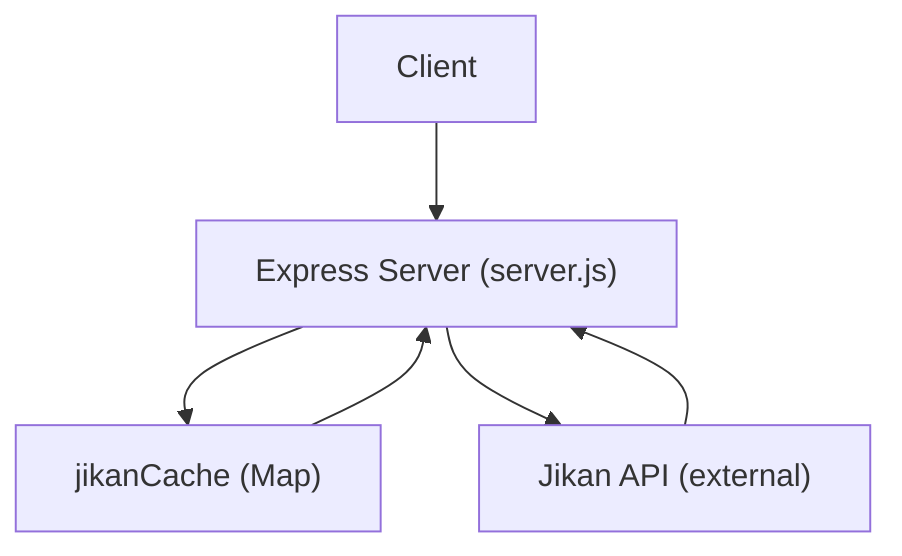
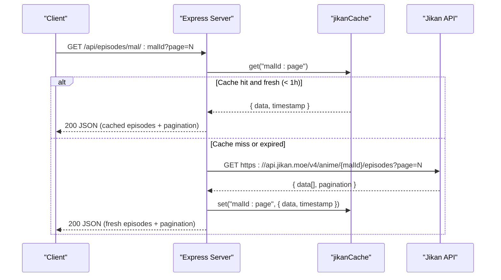
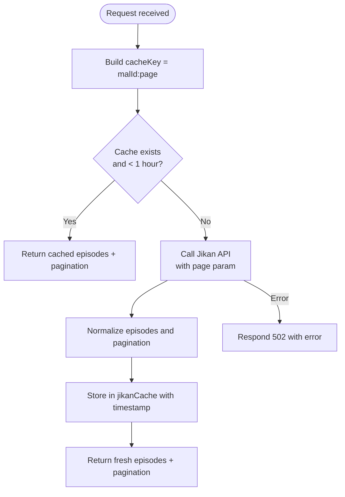
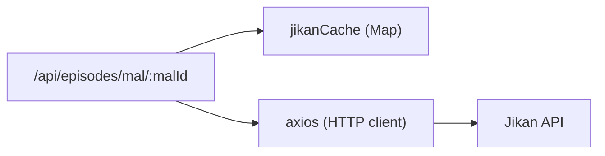

# External API Caching

<cite>
**Referenced Files in This Document**
- [server.js](file://server.js)
</cite>

## Table of Contents
1. [Introduction](#introduction)
2. [Project Structure](#project-structure)
3. [Core Components](#core-components)
4. [Architecture Overview](#architecture-overview)
5. [Detailed Component Analysis](#detailed-component-analysis)
6. [Dependency Analysis](#dependency-analysis)
7. [Performance Considerations](#performance-considerations)
8. [Troubleshooting Guide](#troubleshooting-guide)
9. [Conclusion](#conclusion)

## Introduction
This document explains the Jikan API caching system implemented in the backend server to reduce external API calls and improve response times for episode metadata. It focuses on the jikanCache structure, 1-hour TTL strategy, cache key generation using malId:page format, cache validation logic, refresh strategies, and error handling when encountering rate limits or upstream failures. It also provides guidance on measuring cache hit rates and performance metrics, along with best practices for managing external API dependencies.

## Project Structure
The caching behavior is implemented within a single Express server file that defines routes, in-memory caches, and helper functions. The Jikan-specific endpoint returns paginated episode metadata and uses an in-memory Map-based cache keyed by malId:page.

**Diagram sources**
- [server.js:422-425](file://server.js#L422-L425)
- [server.js:662-710](file://server.js#L662-L710)

**Section sources**
- [server.js:422-425](file://server.js#L422-L425)
- [server.js:662-710](file://server.js#L662-L710)

## Core Components
- In-memory cache store: jikanCache (Map)
- Time-to-live: JIKAN_TTL = 1 hour
- Endpoint: GET /api/episodes/mal/:malId?page=N
- Key format: malId:page
- Behavior:
  - On request, check cache for malId:page
  - If entry exists and is younger than 1 hour, return cached data
  - Otherwise, call Jikan API, transform response, store in cache, and return
  - On errors, respond with 502 and error details

Key implementation references:
- Cache declaration and TTL: [server.js:422-425](file://server.js#L422-L425)
- Route handler and cache usage: [server.js:662-710](file://server.js#L662-L710)

**Section sources**
- [server.js:422-425](file://server.js#L422-L425)
- [server.js:662-710](file://server.js#L662-L710)

## Architecture Overview
The Jikan episode metadata flow integrates caching at the route level to minimize external calls.

**Diagram sources**
- [server.js:662-710](file://server.js#L662-L710)
- [server.js:422-425](file://server.js#L422-L425)

## Detailed Component Analysis

### Jikan Episode Metadata Endpoint
- Purpose: Provide paginated episode metadata (titles, air dates, filler/recap flags) for a MAL ID.
- Cache key: malId:page
- TTL: 1 hour
- Response shape:
  - episodes: array of normalized episode objects
  - pagination: currentPage, lastPage, hasNextPage, total
- Error handling: Returns 502 with error message if upstream fails

**Diagram sources**
- [server.js:662-710](file://server.js#L662-L710)
- [server.js:422-425](file://server.js#L422-L425)

**Section sources**
- [server.js:662-710](file://server.js#L662-L710)
- [server.js:422-425](file://server.js#L422-L425)

### Cache Validation and Refresh Strategy
- Validation: Each cached entry stores a timestamp; requests compare current time against stored timestamp and JIKAN_TTL (1 hour).
- Refresh: On cache miss or expiry, the endpoint fetches fresh data from Jikan and updates the cache.
- Pagination awareness: Keys include page, so each page is independently cached and refreshed.

References:
- TTL constant and cache store: [server.js:422-425](file://server.js#L422-L425)
- Validation and refresh logic: [server.js:662-710](file://server.js#L662-L710)

**Section sources**
- [server.js:422-425](file://server.js#L422-L425)
- [server.js:662-710](file://server.js#L662-L710)

### Error Handling and Rate Limits
- Upstream errors: The endpoint catches exceptions and responds with HTTP 502 and a descriptive error object.
- Rate limiting: There is no explicit retry/backoff for Jikan 429 responses in this endpoint. A general health probe to Jikan is available via /api/status, which can be used to monitor upstream availability.

References:
- Error handling in Jikan route: [server.js:662-710](file://server.js#L662-L710)
- Health check including Jikan probe: [server.js:1304-1336](file://server.js#L1304-L1336)

Note: For other external APIs (e.g., AniList), the server implements retry with backoff on 429 responses. This pattern can be adapted for Jikan if needed.

**Section sources**
- [server.js:662-710](file://server.js#L662-L710)
- [server.js:1304-1336](file://server.js#L1304-L1336)

### Data Flow and Normalization
- Episodes are mapped to a consistent shape including number, title, Japanese title, aired date, score, filler flag, and recap flag.
- Pagination fields are derived from Jikan’s response to support client-side paging.

References:
- Episode mapping and pagination normalization: [server.js:683-701](file://server.js#L683-L701)

**Section sources**
- [server.js:683-701](file://server.js#L683-L701)

## Dependency Analysis
- External dependency: Jikan API (https://api.jikan.moe/v4/anime/{malId}/episodes?page={page})
- Internal dependency: In-memory Map (jikanCache) for fast lookups
- Coupling: The route depends on axios for HTTP calls and on the global jikanCache for stateful caching
- Cohesion: The Jikan endpoint encapsulates fetching, transformation, caching, and error handling in one place

**Diagram sources**
- [server.js:662-710](file://server.js#L662-L710)
- [server.js:422-425](file://server.js#L422-L425)

**Section sources**
- [server.js:662-710](file://server.js#L662-L710)
- [server.js:422-425](file://server.js#L422-L425)

## Performance Considerations
- Cache hit path: O(1) lookup in Map; minimal CPU and memory overhead
- TTL strategy: 1-hour window reduces repeated network calls for popular MAL IDs and pages
- Memory growth: Since keys include page, long-running processes may accumulate entries; consider periodic cleanup or size limits if needed
- Concurrency: Multiple concurrent requests for the same key will all proceed to the upstream until the first response populates the cache; subsequent requests during that window will still hit the cache

[No sources needed since this section provides general guidance]

## Troubleshooting Guide
- Symptom: Frequent 502 errors from /api/episodes/mal
  - Cause: Jikan API unreachable or returning errors
  - Action: Use /api/status to verify Jikan reachability; inspect logs for upstream error messages
- Symptom: Stale episode data
  - Cause: Cached entry still within 1-hour TTL
  - Action: Wait for TTL expiry or implement cache invalidation if required
- Symptom: High memory usage over time
  - Cause: Unbounded growth of jikanCache entries
  - Action: Implement cache eviction policy (LRU or max size) and periodic cleanup

**Section sources**
- [server.js:662-710](file://server.js#L662-L710)
- [server.js:1304-1336](file://server.js#L1304-L1336)

## Conclusion
The Jikan episode metadata endpoint uses a simple yet effective in-memory cache with a 1-hour TTL and malId:page keys to significantly reduce external API calls and improve response times. While it lacks explicit rate-limit retries for Jikan, it provides robust error handling and a health check endpoint to monitor upstream status. For production deployments, consider adding retry/backoff for 429 responses, cache size limits, and metrics collection to track hit rates and latency.

[No sources needed since this section summarizes without analyzing specific files]