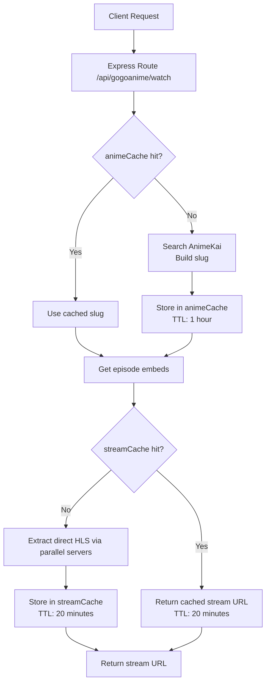
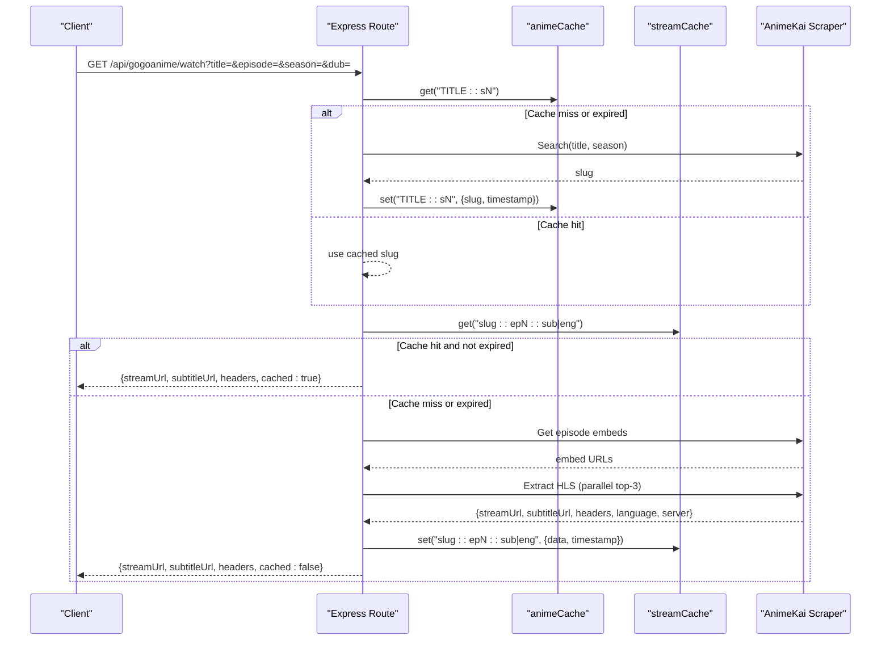
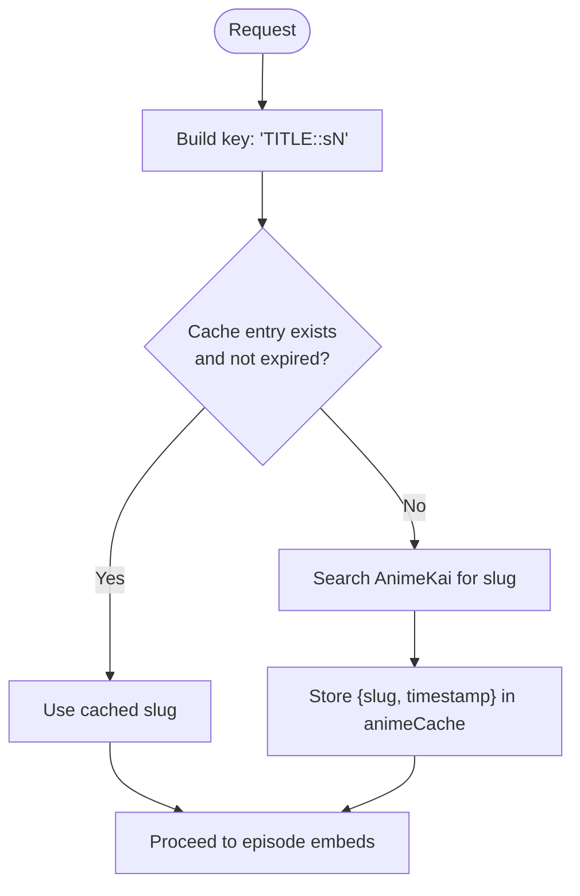
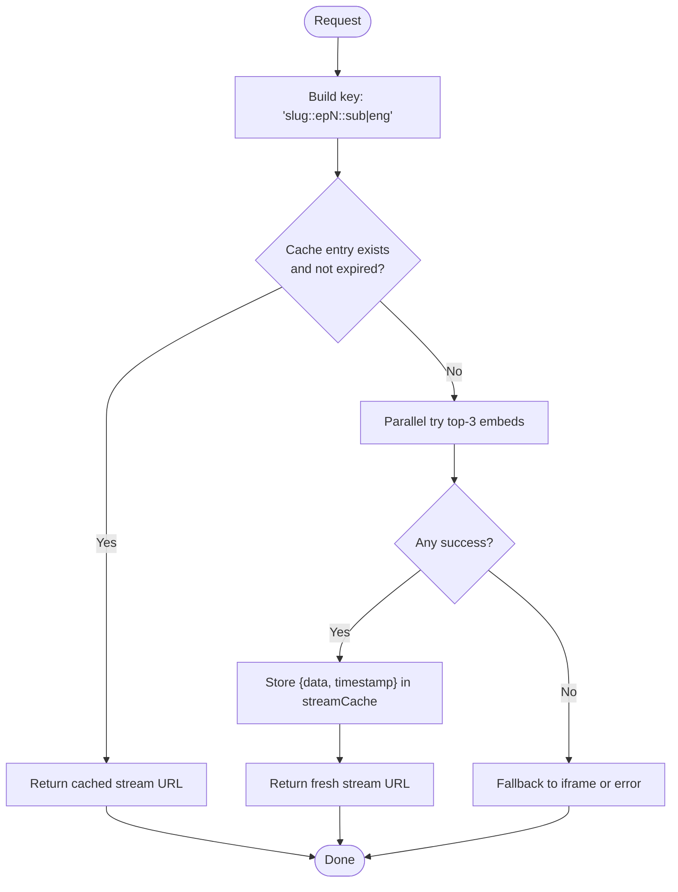
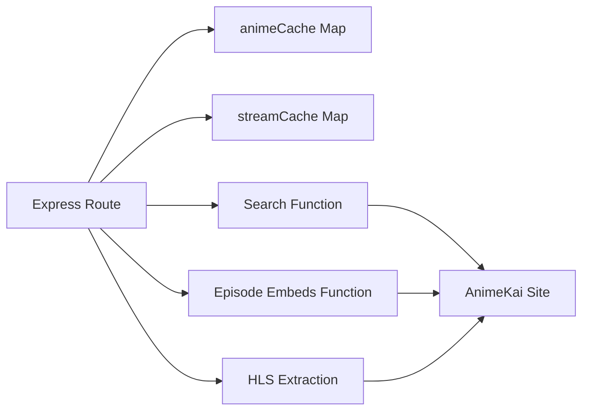

# Search Result Caching

<cite>
**Referenced Files in This Document**
- [server.js](file://server.js)
</cite>

## Table of Contents
1. [Introduction](#introduction)
2. [Project Structure](#project-structure)
3. [Core Components](#core-components)
4. [Architecture Overview](#architecture-overview)
5. [Detailed Component Analysis](#detailed-component-analysis)
6. [Dependency Analysis](#dependency-analysis)
7. [Performance Considerations](#performance-considerations)
8. [Troubleshooting Guide](#troubleshooting-guide)
9. [Conclusion](#conclusion)

## Introduction
This document explains the search result caching system for AnimeKai used by the application server. It covers:
- The two in-memory caches: animeCache and streamCache
- Their TTLs (time-to-live): 1 hour for search results, 20 minutes for stream URLs
- Cache key strategies using title::season and slug::episode patterns
- How cache hits reduce network calls and improve response times
- Memory management considerations for large result sets
- Examples of performance improvements and troubleshooting stale cache issues

## Project Structure
The caching logic is implemented in the Node.js server file that handles AnimeKai requests and stream extraction. Key areas include:
- Global cache declarations and TTL constants
- Search endpoint that resolves an anime slug from a title/season pair
- Stream endpoint that extracts HLS URLs and caches them per episode and language mode

**Diagram sources**
- [server.js:1393-1413](file://server.js#L1393-L1413)
- [server.js:1464-1481](file://server.js#L1464-L1481)
- [server.js:1483-1542](file://server.js#L1483-L1542)

**Section sources**
- [server.js:413-419](file://server.js#L413-L419)
- [server.js:1393-1413](file://server.js#L1393-L1413)
- [server.js:1464-1481](file://server.js#L1464-L1481)
- [server.js:1483-1542](file://server.js#L1483-L1542)

## Core Components
- animeCache: Stores resolved anime slugs keyed by title and season with a 1-hour TTL. Used to avoid repeated searches for the same title/season combination.
- streamCache: Stores extracted stream data (HLS URL, subtitles, headers, language/server metadata) keyed by slug, episode number, and language mode with a 20-minute TTL. Used to avoid repeated stream extraction on repeat clicks.

Key behaviors:
- Search cache key pattern: title::season (e.g., "TITLE::sN")
- Stream cache key pattern: slug::episode::language (e.g., "slug::epN::sub" or "slug::epN::eng")
- TTL enforcement: On each request, the current timestamp is compared against stored timestamps; expired entries are treated as misses and refreshed.

**Section sources**
- [server.js:413-419](file://server.js#L413-L419)
- [server.js:1393-1413](file://server.js#L1393-L1413)
- [server.js:1464-1481](file://server.js#L1464-L1481)

## Architecture Overview
The AnimeKai watch flow uses two caches to minimize external scraping and parsing:
1. Resolve the anime slug once per title/season and cache it for 1 hour.
2. Extract the direct HLS stream once per episode/language and cache it for 20 minutes.

**Diagram sources**
- [server.js:1393-1413](file://server.js#L1393-L1413)
- [server.js:1464-1481](file://server.js#L1464-L1481)
- [server.js:1483-1542](file://server.js#L1483-L1542)

## Detailed Component Analysis

### animeCache: Search Results
- Purpose: Cache resolved anime slugs to avoid repeated AnimeKai searches for the same title/season.
- Key strategy: title::season
  - Title is normalized to uppercase and trimmed.
  - Season defaults to 1 if unspecified.
- TTL: 1 hour (CACHE_TTL).
- Behavior:
  - On request, check cache; if missing or expired, perform search and store result with timestamp.
  - Subsequent requests within TTL return the cached slug immediately.

**Diagram sources**
- [server.js:1393-1413](file://server.js#L1393-L1413)

**Section sources**
- [server.js:413-415](file://server.js#L413-L415)
- [server.js:1393-1413](file://server.js#L1393-L1413)

### streamCache: Stream URLs
- Purpose: Cache extracted HLS stream data to avoid repeated parsing of player pages.
- Key strategy: slug::episode::language
  - Language mode is either "sub" (default) or "eng" (when dub is requested).
- TTL: 20 minutes (STREAM_CACHE_TTL).
- Behavior:
  - On request, check cache; if missing or expired, extract HLS via parallel attempts across top candidate servers.
  - Store successful extraction with timestamp; subsequent requests within TTL return cached stream URL.

**Diagram sources**
- [server.js:1464-1481](file://server.js#L1464-L1481)
- [server.js:1483-1542](file://server.js#L1483-L1542)

**Section sources**
- [server.js:417-419](file://server.js#L417-L419)
- [server.js:1464-1481](file://server.js#L1464-L1481)
- [server.js:1483-1542](file://server.js#L1483-L1542)

### Cache Key Strategies
- Search cache keys: "TITLE::sN"
  - Ensures different seasons are cached separately.
  - Example: "JUJUTSU KAISEN::s2" vs "JUJUTSU KAISEN::s1".
- Stream cache keys: "slug::epN::sub" or "slug::epN::eng"
  - Ensures episodes and language modes are isolated.
  - Example: "watch/abc123::ep5::sub" vs "watch/abc123::ep5::eng".

These strategies prevent cross-contamination between seasons and languages while keeping keys compact and deterministic.

**Section sources**
- [server.js:1393-1395](file://server.js#L1393-L1395)
- [server.js:1464-1466](file://server.js#L1464-L1466)

### Cache Warming Techniques
- No explicit background warming is implemented for animeCache or streamCache.
- Warmth is achieved naturally through user traffic:
  - Popular titles will be searched once and cached for 1 hour.
  - Frequently watched episodes will have their streams cached for 20 minutes.
- If needed, you can implement proactive warming by:
  - Pre-warming popular titles at startup or on schedule.
  - Triggering a warm-up request for trending episodes after a new episode drops.

[No sources needed since this section provides general guidance]

### Memory Management for Large Result Sets
- Current implementation uses in-memory Maps without size limits or eviction policies.
- Risks:
  - Unbounded growth under high concurrency or many unique titles/episodes.
  - Potential memory pressure over long-running processes.
- Recommended enhancements:
  - Add maximum size limits and least-recently-used (LRU) eviction.
  - Implement periodic cleanup tasks to remove expired entries proactively.
  - Monitor cache sizes and evictions to tune TTLs and limits.
  - Consider offloading to Redis or another persistent cache for multi-instance deployments.

[No sources needed since this section provides general guidance]

## Dependency Analysis
The caching layer depends on:
- Express route handling for AnimeKai watch requests
- External AnimeKai scraper functions for search and episode embed retrieval
- In-memory Map structures for animeCache and streamCache
- Timestamp checks for TTL enforcement

**Diagram sources**
- [server.js:1393-1413](file://server.js#L1393-L1413)
- [server.js:1464-1481](file://server.js#L1464-L1481)
- [server.js:1483-1542](file://server.js#L1483-L1542)

**Section sources**
- [server.js:1393-1413](file://server.js#L1393-L1413)
- [server.js:1464-1481](file://server.js#L1464-L1481)
- [server.js:1483-1542](file://server.js#L1483-L1542)

## Performance Considerations
- Cache hit benefits:
  - Search cache reduces AnimeKai search calls by up to 1 hour per title/season.
  - Stream cache reduces HLS extraction calls by 20 minutes per episode/language.
- Parallel extraction:
  - Top-3 candidate servers are tried in parallel to minimize latency.
  - Successful extraction is cached to avoid rework on repeat clicks.
- Expected improvements:
  - Faster response times for repeat users and episodes.
  - Lower external scraping load and fewer timeouts/failures.
- Monitoring:
  - Log cache hits and misses to measure effectiveness.
  - Track average response time before and after enabling caching.

[No sources needed since this section provides general guidance]

## Troubleshooting Guide
Common issues and resolutions:
- Stale search results:
  - Symptom: Wrong season selected or outdated slug.
  - Cause: Expired or incorrect cache key usage.
  - Resolution: Verify key includes correct season; ensure TTL is appropriate; clear or restart process if necessary.
- Stale stream URLs:
  - Symptom: HLS link no longer works or returns errors.
  - Cause: Stream cache TTL exceeded or upstream changes.
  - Resolution: Wait for TTL refresh or force a new extraction by changing parameters; consider shortening TTL during unstable periods.
- High memory usage:
  - Symptom: Process memory grows over time.
  - Cause: Unbounded cache growth.
  - Resolution: Implement LRU eviction and periodic cleanup; monitor cache sizes; consider external cache.
- Debugging tips:
  - Inspect logs for cache hit/miss messages.
  - Validate cache keys by checking request parameters (title, season, episode, dub).
  - Temporarily disable caching to confirm behavior differences.

**Section sources**
- [server.js:1393-1413](file://server.js#L1393-L1413)
- [server.js:1464-1481](file://server.js#L1464-L1481)
- [server.js:1483-1542](file://server.js#L1483-L1542)

## Conclusion
The AnimeKai caching system significantly improves performance by reducing redundant searches and stream extractions. With well-defined cache keys and sensible TTLs, it delivers fast responses for repeat users. For production stability, consider adding size limits, eviction policies, and monitoring to manage memory and ensure reliability.

[No sources needed since this section summarizes without analyzing specific files]