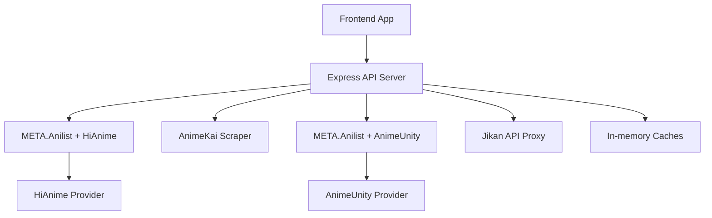
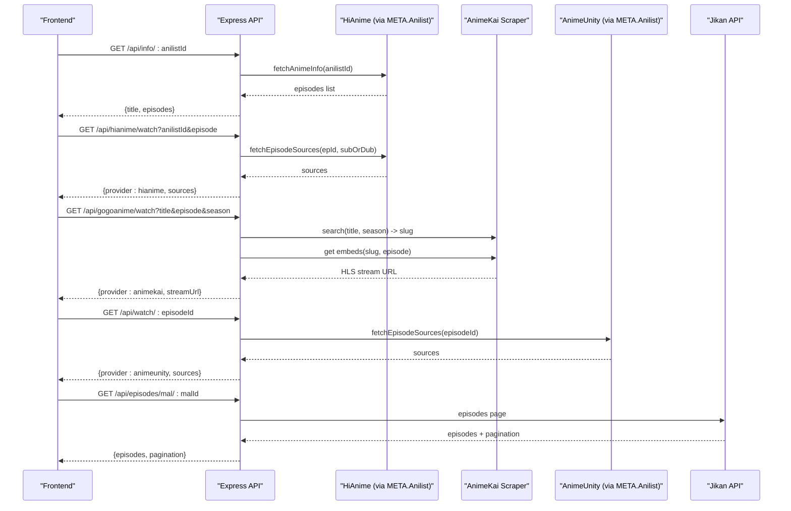
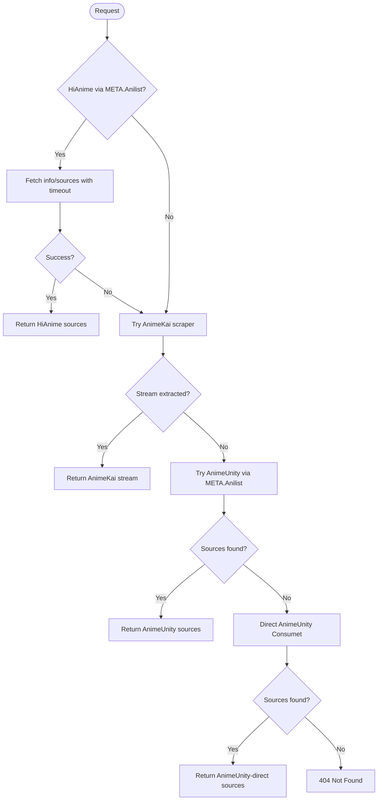
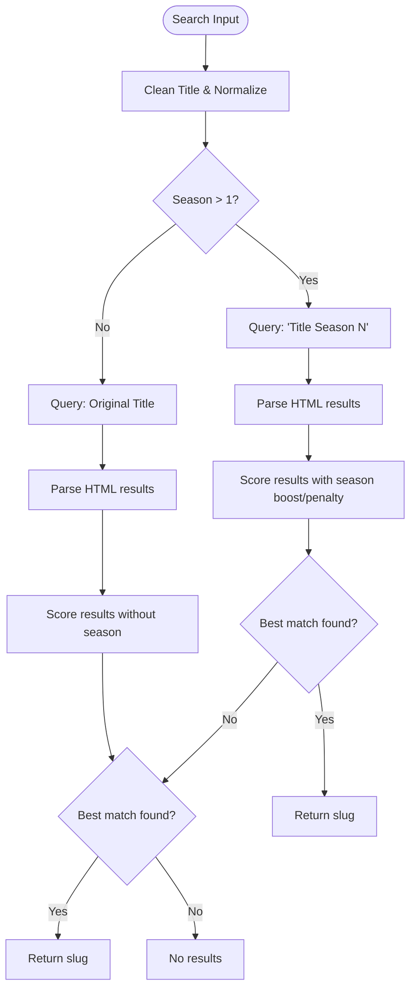
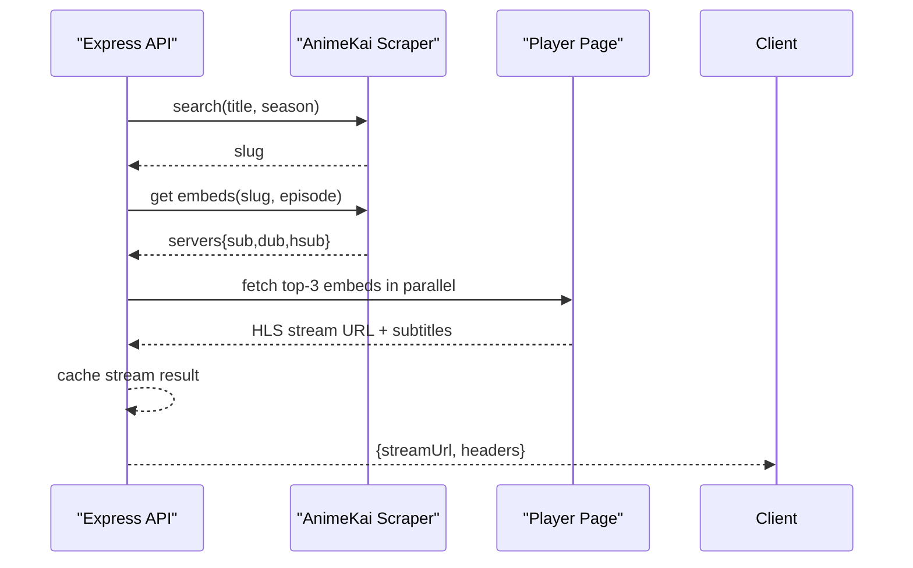
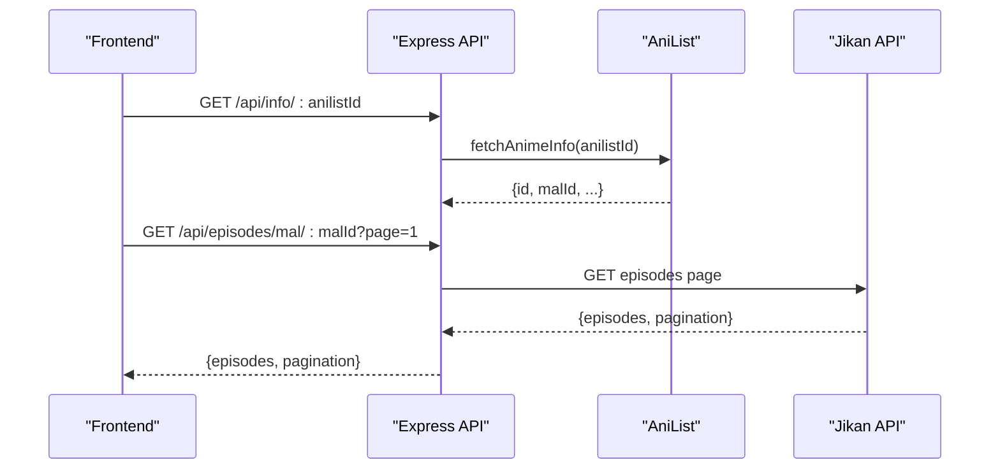
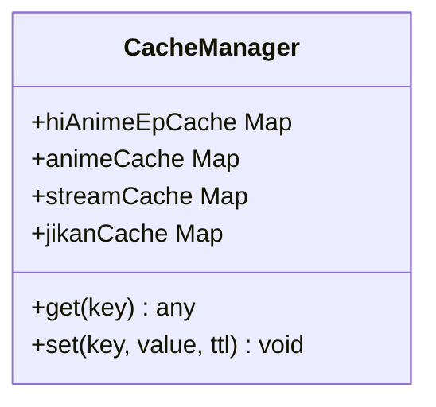
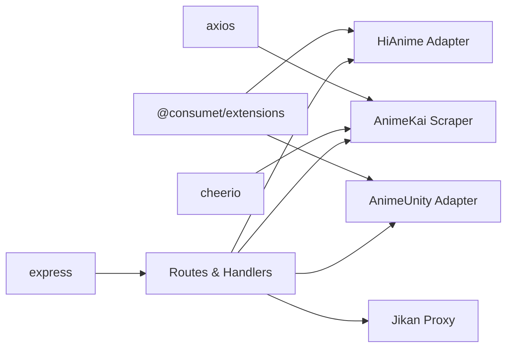

# Content Provider Integration

<cite>
**Referenced Files in This Document**
- [server.js](file://server.js)
- [animeApi.js](file://src/features/anime/api/animeApi.js)
- [hindiApi.js](file://src/features/anime/hindi/api/hindiApi.js)
- [mockData.js](file://src/mockData.js)
- [package.json](file://package.json)
</cite>

## Table of Contents
1. [Introduction](#introduction)
2. [Project Structure](#project-structure)
3. [Core Components](#core-components)
4. [Architecture Overview](#architecture-overview)
5. [Detailed Component Analysis](#detailed-component-analysis)
6. [Dependency Analysis](#dependency-analysis)
7. [Performance Considerations](#performance-considerations)
8. [Troubleshooting Guide](#troubleshooting-guide)
9. [Conclusion](#conclusion)
10. [Appendices](#appendices)

## Introduction
This document explains the multi-provider content integration system for anime streaming and metadata, built on top of @consumet/extensions. It covers:
- Provider hierarchy: HiAnime (primary via AniList), AnimeKai (secondary scraper), AnimeUnity (fallback).
- Provider selection logic, fallback mechanisms, and caching strategies.
- Anime search and episode resolution algorithms: title matching, season detection, scoring.
- Jikan API integration for episode metadata and how it complements provider data.
- The AnimeKai scraper implementation details.
- Guidance for adding new providers and extending the abstraction layer.

## Project Structure
The backend is an Express server that orchestrates multiple providers and caches to deliver consistent responses to the frontend. Key responsibilities:
- Server routes expose unified endpoints for watching, searching, and fetching info.
- Provider adapters use @consumet/extensions for standardized access to HiAnime and AnimeUnity.
- A custom AnimeKai scraper provides a fast HTTP-based alternative with robust title/season matching.
- Caches reduce repeated network calls and improve responsiveness.

**Diagram sources**
- [server.js:213-228](file://server.js#L213-L228)
- [server.js:397-425](file://server.js#L397-L425)
- [server.js:659-710](file://server.js#L659-L710)

**Section sources**
- [server.js:1-30](file://server.js#L1-L30)
- [server.js:213-228](file://server.js#L213-L228)
- [server.js:397-425](file://server.js#L397-L425)
- [server.js:659-710](file://server.js#L659-L710)

## Core Components
- Provider Abstraction Layer: Uses @consumet/extensions to standardize interactions with HiAnime and AnimeUnity through META.Anilist.
- AnimeKai Scraper: Custom scraping pipeline for title search, season-aware matching, and HLS stream extraction.
- Jikan Integration: Backend proxy to MyAnimeList/Jikan for rich episode metadata (titles, air dates, filler/recap flags).
- Caching: In-memory caches for episode lists, streams, and Jikan pages to minimize latency and external calls.
- Frontend APIs: Thin wrappers that call backend endpoints and normalize provider responses.

**Section sources**
- [server.js:213-228](file://server.js#L213-L228)
- [server.js:397-425](file://server.js#L397-L425)
- [server.js:659-710](file://server.js#L659-L710)
- [animeApi.js:1-20](file://src/features/anime/api/animeApi.js#L1-L20)
- [hindiApi.js:1-132](file://src/features/anime/hindi/api/hindiApi.js#L1-L132)
- [mockData.js:484-589](file://src/mockData.js#L484-L589)

## Architecture Overview
The system implements a tiered provider strategy:
- Primary: HiAnime via META.Anilist using AniList ID to resolve exact season/episode.
- Secondary: AnimeKai scraper for fast title-based search and HLS extraction.
- Fallback: AnimeUnity via META.Anilist or direct Consumet as last resort.

**Diagram sources**
- [server.js:1210-1278](file://server.js#L1210-L1278)
- [server.js:1342-1376](file://server.js#L1342-L1376)
- [server.js:1382-1559](file://server.js#L1382-L1559)
- [server.js:1564-1601](file://server.js#L1564-L1601)
- [server.js:659-710](file://server.js#L659-L710)

## Detailed Component Analysis

### Provider Selection Logic and Fallback Mechanisms
- Primary path: Use META.Anilist with HiAnime to map AniList ID to HiAnime ID and retrieve correct season/episode. Includes a timeout to fall back if HiAnime is slow.
- Secondary path: AnimeKai scraper performs title search with season-aware scoring and extracts HLS streams from embed pages.
- Fallback path: If primary fails, try META.Anilist with AnimeUnity; if that fails, try direct AnimeUnity Consumet endpoint.

**Diagram sources**
- [server.js:1210-1278](file://server.js#L1210-L1278)
- [server.js:1382-1559](file://server.js#L1382-L1559)
- [server.js:1564-1601](file://server.js#L1564-L1601)

**Section sources**
- [server.js:1210-1278](file://server.js#L1210-L1278)
- [server.js:1382-1559](file://server.js#L1382-L1559)
- [server.js:1564-1601](file://server.js#L1564-L1601)

### Anime Search and Episode Resolution Algorithms
- Title Matching: Normalizes titles by removing suffixes like (TV), (Sub), (Dub), and cleans punctuation. Scores based on exact match, starts-with, and inclusion.
- Season Detection: When a season number is provided, boosts results mentioning the specific season and penalizes mismatched seasons. Heavily penalizes sequel keywords when target query does not specify a sequel.
- Scoring System: Combines base score with seasonal adjustments to pick the best slug for AnimeKai.

**Diagram sources**
- [server.js:470-516](file://server.js#L470-L516)
- [server.js:518-626](file://server.js#L518-L626)

**Section sources**
- [server.js:470-516](file://server.js#L470-L516)
- [server.js:518-626](file://server.js#L518-L626)

### AnimeKai Scraper Implementation
- Search: Scrapes browser results, extracts slugs and titles, applies scoring to select best match.
- Episode Embeds: Loads episode page, parses server groups by language (sub/dub/hsub), collects embed URLs.
- Stream Extraction: Fetches player page, extracts .m3u8 URL and subtitle track, returns headers for referer.
- Parallel Attempts: Tries top-3 servers in parallel to find fastest working stream; falls back sequentially if needed; finally returns iframe if extraction fails.

**Diagram sources**
- [server.js:397-468](file://server.js#L397-L468)
- [server.js:631-656](file://server.js#L631-L656)
- [server.js:1382-1559](file://server.js#L1382-L1559)

**Section sources**
- [server.js:397-468](file://server.js#L397-L468)
- [server.js:631-656](file://server.js#L631-L656)
- [server.js:1382-1559](file://server.js#L1382-L1559)

### Jikan API Integration for Episode Metadata
- Purpose: Provides detailed episode metadata (titles, air dates, filler/recap flags) via MyAnimeList’s Jikan API.
- Flow: Frontend requests anime details; backend uses AniList to get MAL ID; then proxies Jikan to fetch episode pages with pagination.
- Caching: Episodes per MAL ID and page are cached for one hour to reduce rate-limits and latency.

**Diagram sources**
- [server.js:659-710](file://server.js#L659-L710)
- [mockData.js:484-589](file://src/mockData.js#L484-L589)

**Section sources**
- [server.js:659-710](file://server.js#L659-L710)
- [mockData.js:484-589](file://src/mockData.js#L484-L589)

### Caching Strategies
- HiAnime Episode List Cache: Keys by anilistId+subOrDub; TTL 30 minutes; avoids repeated provider calls for same episode list.
- AnimeKai Search Cache: Keys by title::season; TTL 1 hour; reduces repeated searches.
- AnimeKai Stream Cache: Keys by slug::episode::language; TTL 20 minutes; avoids re-extraction of HLS URLs.
- Jikan Episode Cache: Keys by malId:page; TTL 1 hour; reduces Jikan API calls.

**Diagram sources**
- [server.js:226-228](file://server.js#L226-L228)
- [server.js:413-425](file://server.js#L413-L425)
- [server.js:669-703](file://server.js#L669-L703)

**Section sources**
- [server.js:226-228](file://server.js#L226-L228)
- [server.js:413-425](file://server.js#L413-L425)
- [server.js:669-703](file://server.js#L669-L703)

### Frontend API Wrappers and Hindi Dub Support
- animeApi.js exposes methods that delegate to backend endpoints for consistency across features.
- hindiApi.js integrates with backend to check availability and fetch Hindi dub catalogs, with local caching and batched loading.

**Section sources**
- [animeApi.js:1-20](file://src/features/anime/api/animeApi.js#L1-L20)
- [hindiApi.js:1-132](file://src/features/anime/hindi/api/hindiApi.js#L1-L132)

## Dependency Analysis
- External Dependencies:
  - @consumet/extensions: Provides standardized interfaces for HiAnime and AnimeUnity.
  - axios/cheerio: Used for HTTP requests and HTML parsing in the AnimeKai scraper.
  - express/cors: Web server framework and CORS configuration.
- Internal Coupling:
  - server.js centralizes provider orchestration, caching, and route handlers.
  - Frontend modules depend on backend endpoints exposed by server.js.

**Diagram sources**
- [package.json:14-35](file://package.json#L14-L35)
- [server.js:1-8](file://server.js#L1-L8)
- [server.js:213-228](file://server.js#L213-L228)
- [server.js:397-425](file://server.js#L397-L425)

**Section sources**
- [package.json:14-35](file://package.json#L14-L35)
- [server.js:1-8](file://server.js#L1-L8)
- [server.js:213-228](file://server.js#L213-L228)
- [server.js:397-425](file://server.js#L397-L425)

## Performance Considerations
- Timeouts: HiAnime fetch has a 3-second timeout to trigger fallback quickly.
- Parallelism: AnimeKai tries top-3 servers in parallel to minimize latency.
- Caching: Multi-level caches reduce redundant network calls and improve UX.
- Referer Handling: Proper referers and headers avoid CDN blocks and ensure reliable stream playback.

[No sources needed since this section provides general guidance]

## Troubleshooting Guide
- Missing Parameters: Ensure required query params like anilistId, episode, title are present.
- No Streams Found: Verify provider availability; check logs for timeouts or extraction failures.
- Rate Limits: Jikan and AniList may rate-limit; rely on caches and retries.
- CORS and Proxies: Use backend proxies for images and subtitles to bypass CORS restrictions.

**Section sources**
- [server.js:1210-1278](file://server.js#L1210-L1278)
- [server.js:1382-1559](file://server.js#L1382-L1559)
- [server.js:1564-1601](file://server.js#L1564-L1601)
- [server.js:659-710](file://server.js#L659-L710)

## Conclusion
The system delivers resilient anime streaming by combining a primary provider (HiAnime via AniList), a robust secondary scraper (AnimeKai), and a fallback (AnimeUnity). Advanced title/season matching, parallel stream extraction, and multi-layer caching ensure fast and reliable performance. Jikan integration enriches episode metadata, while frontend APIs provide a consistent interface for consumers.

[No sources needed since this section summarizes without analyzing specific files]

## Appendices

### Adding a New Provider
Steps to extend the abstraction layer:
- Initialize a new provider instance using @consumet/extensions or implement a custom scraper similar to AnimeKai.
- Add route handlers to integrate into the provider selection flow:
  - Attempt primary provider first.
  - On failure, proceed to secondary/fallback providers.
- Implement caching for search results and streams to optimize performance.
- Expose normalized responses so frontend code remains unchanged.

Example reference points:
- Provider initialization and hierarchy comments.
- Route handlers for watch/info/search endpoints.
- Caching patterns for episode lists and streams.

**Section sources**
- [server.js:213-228](file://server.js#L213-L228)
- [server.js:1210-1278](file://server.js#L1210-L1278)
- [server.js:1382-1559](file://server.js#L1382-L1559)
- [server.js:1564-1601](file://server.js#L1564-L1601)
- [server.js:413-425](file://server.js#L413-L425)