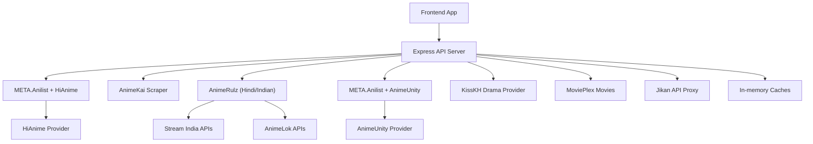
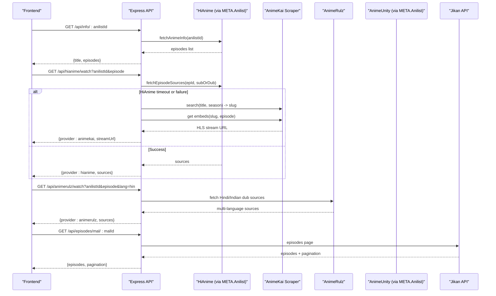
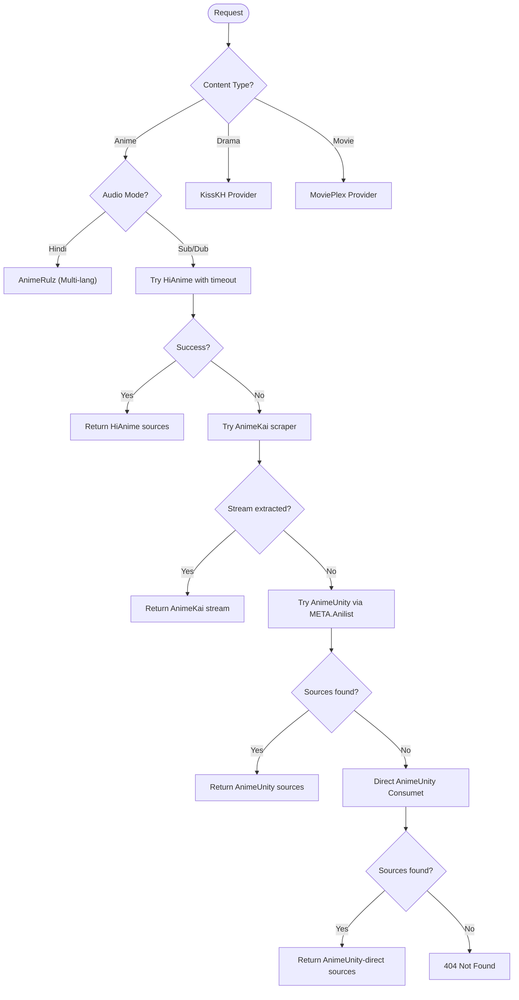
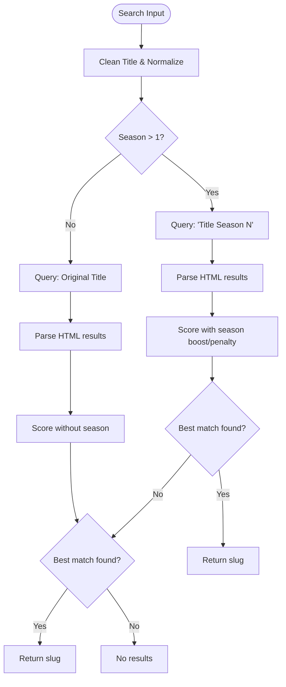
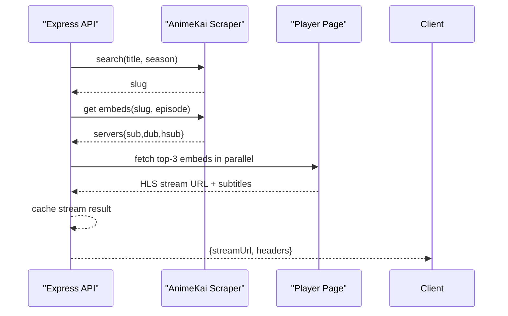
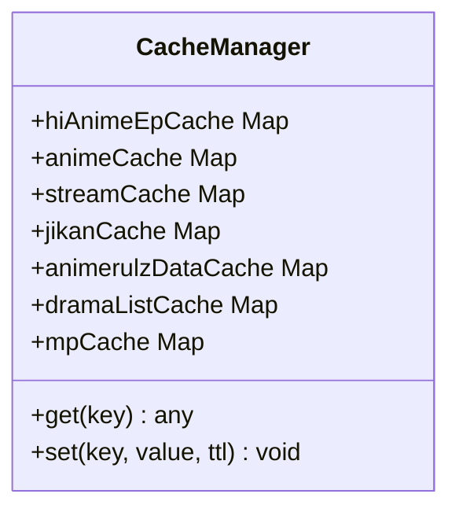
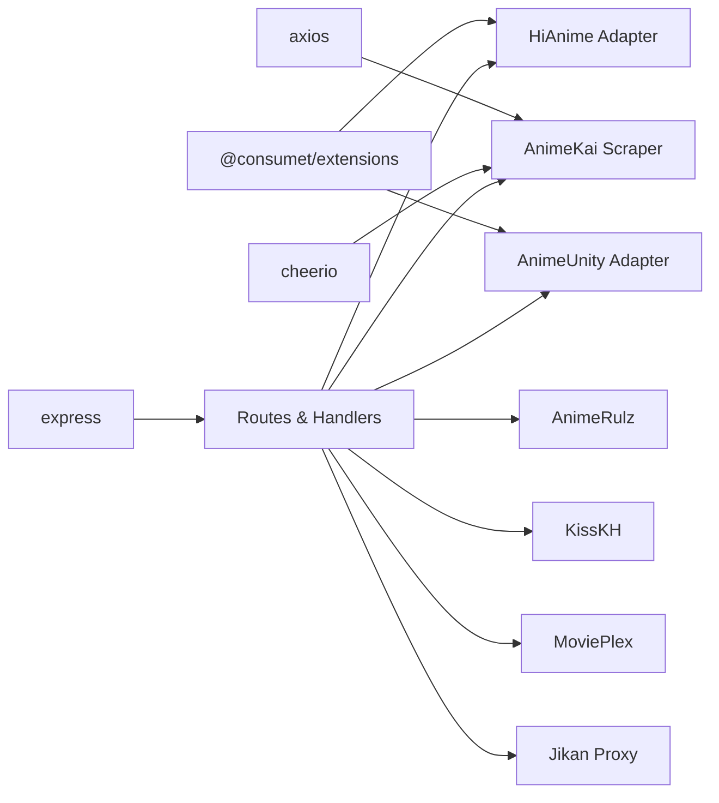

# Content Provider Integration

<cite>
**Referenced Files in This Document**
- [server.js](file://server.js)
- [animeApi.js](file://src/features/anime/api/animeApi.js)
- [hindiApi.js](file://src/features/anime/hindi/api/hindiApi.js)
- [mockData.js](file://src/mockData.js)
- [package.json](file://package.json)
</cite>

## Update Summary
**Changes Made**
- Updated provider hierarchy to reflect new microservices architecture with AniList, HiAnime, AnimeKai, KissKH, and MoviePlex providers
- Enhanced fallback mechanisms with automatic response shape normalization across multiple streaming providers
- Added comprehensive coverage of AnimeRulz integration for Hindi/Indian language content
- Expanded caching strategies and performance optimizations for multi-provider orchestration
- Updated API endpoints and response formats to support unified provider abstraction

## Table of Contents
1. [Introduction](#introduction)
2. [Project Structure](#project-structure)
3. [Core Components](#core-components)
4. [Architecture Overview](#architecture-overview)
5. [Detailed Component Analysis](#detailed-component-analysis)
6. [Dependency Analysis](#dependency-analysis)
7. [Performance Considerations](#performance-considerations)
8. [Troubleshooting Guide](#troubleshooting-guide)
9. [Conclusion](#conclusion)
10. [Appendices](#appendices)

## Introduction
This document explains the enhanced multi-provider content integration system built on top of @consumet/extensions with a new microservices architecture supporting multiple streaming providers (AniList, HiAnime, AnimeKai, KissKH, MoviePlex) with automatic fallback mechanisms and response shape normalization. The system provides resilient anime streaming by combining primary providers with robust fallbacks, advanced search algorithms, and comprehensive caching strategies.

The architecture now supports:
- **Primary Provider**: HiAnime via META.Anilist using AniList ID for exact season/episode resolution
- **Secondary Provider**: AnimeKai scraper for fast title-based search with HLS stream extraction
- **Regional Provider**: AnimeRulz for Hindi/Indian language dubs with multi-language support
- **Fallback Providers**: AnimeUnity via Consumet as last resort
- **Content Providers**: KissKH for drama content and MoviePlex for movies
- **Metadata Provider**: Jikan API integration for rich episode metadata

## Project Structure
The backend is an Express server that orchestrates multiple providers through a unified microservices architecture with intelligent fallback mechanisms:

**Diagram sources**
- [server.js:213-228](file://server.js#L213-L228)
- [server.js:746-765](file://server.js#L746-L765)
- [server.js:1620-1690](file://server.js#L1620-L1690)
- [server.js:2938-2955](file://server.js#L2938-L2955)

**Section sources**
- [server.js:1-30](file://server.js#L1-L30)
- [server.js:213-228](file://server.js#L213-L228)
- [server.js:746-765](file://server.js#L746-L765)
- [server.js:1620-1690](file://server.js#L1620-L1690)
- [server.js:2938-2955](file://server.js#L2938-L2955)

## Core Components
- **Provider Abstraction Layer**: Uses @consumet/extensions to standardize interactions with HiAnime and AnimeUnity through META.Anilist
- **AnimeKai Scraper**: Custom scraping pipeline for title search, season-aware matching, and HLS stream extraction
- **AnimeRulz Integration**: Multi-language support for Hindi, Tamil, Telugu, English, and Japanese content
- **KissKH Drama Provider**: Complete drama streaming solution with catalog management and subtitle support
- **MoviePlex Integration**: Movie and web series streaming with TMDB poster enhancement
- **Jikan Integration**: Backend proxy to MyAnimeList/Jikan for rich episode metadata
- **Caching System**: Multi-level caches for episode lists, streams, catalogs, and metadata
- **Response Normalization**: Unified response shapes across all providers for consistent frontend consumption

**Section sources**
- [server.js:213-228](file://server.js#L213-L228)
- [server.js:397-468](file://server.js#L397-L468)
- [server.js:746-765](file://server.js#L746-L765)
- [server.js:1620-1690](file://server.js#L1620-L1690)
- [server.js:2938-2955](file://server.js#L2938-L2955)
- [animeApi.js:1-20](file://src/features/anime/api/animeApi.js#L1-L20)
- [hindiApi.js:1-132](file://src/features/anime/hindi/api/hindiApi.js#L1-L132)

## Architecture Overview
The system implements a sophisticated tiered provider strategy with automatic fallback mechanisms:

**Diagram sources**
- [server.js:1210-1278](file://server.js#L1210-L1278)
- [server.js:1382-1559](file://server.js#L1382-L1559)
- [server.js:933-998](file://server.js#L933-L998)
- [server.js:659-710](file://server.js#L659-L710)

## Detailed Component Analysis

### Enhanced Provider Selection Logic and Fallback Mechanisms
The system now implements a comprehensive provider selection algorithm with intelligent fallbacks:

- **Primary Path**: HiAnime via META.Anilist with 3-second timeout for rapid fallback
- **Secondary Path**: AnimeKai scraper with parallel server attempts and HLS extraction
- **Regional Path**: AnimeRulz for Hindi/Indian content with multi-language support
- **Fallback Path**: AnimeUnity via META.Anilist or direct Consumet endpoint
- **Content Paths**: KissKH for dramas and MoviePlex for movies with TMDB enhancement

**Diagram sources**
- [server.js:1210-1278](file://server.js#L1210-L1278)
- [server.js:1382-1559](file://server.js#L1382-L1559)
- [server.js:933-998](file://server.js#L933-L998)
- [server.js:1564-1601](file://server.js#L1564-L1601)

**Section sources**
- [server.js:1210-1278](file://server.js#L1210-L1278)
- [server.js:1382-1559](file://server.js#L1382-L1559)
- [server.js:933-998](file://server.js#L933-L998)
- [server.js:1564-1601](file://server.js#L1564-L1601)

### Advanced Search and Episode Resolution Algorithms
Enhanced search capabilities with improved title matching and season detection:

- **Title Matching**: Normalizes titles by removing suffixes like (TV), (Sub), (Dub), and cleans punctuation
- **Season Detection**: Boosts results mentioning specific seasons and penalizes mismatched seasons
- **Scoring System**: Combines base score with seasonal adjustments for optimal AnimeKai slug selection
- **Multi-language Support**: AnimeRulz handles Hindi, Tamil, Telugu, English, and Japanese content

**Diagram sources**
- [server.js:470-516](file://server.js#L470-L516)
- [server.js:518-626](file://server.js#L518-L626)

**Section sources**
- [server.js:470-516](file://server.js#L470-L516)
- [server.js:518-626](file://server.js#L518-L626)

### Enhanced AnimeKai Scraper Implementation
Improved scraping pipeline with parallel processing and better error handling:

- **Parallel Attempts**: Tries top-3 servers simultaneously to find fastest working stream
- **Smart Language Priority**: Prioritizes appropriate audio/subtitle combinations
- **Robust Extraction**: Multiple fallback methods for HLS stream extraction
- **Cache Optimization**: Stream URLs cached for 20 minutes to reduce repeated extractions

**Diagram sources**
- [server.js:397-468](file://server.js#L397-L468)
- [server.js:631-656](file://server.js#L631-L656)
- [server.js:1382-1559](file://server.js#L1382-L1559)

**Section sources**
- [server.js:397-468](file://server.js#L397-L468)
- [server.js:631-656](file://server.js#L631-L656)
- [server.js:1382-1559](file://server.js#L1382-L1559)

### AnimeRulz Multi-Language Integration
Comprehensive support for Indian and regional language content:

- **Multi-Language Support**: Hindi, Tamil, Telugu, English, and Japanese audio tracks
- **Provider Rotation**: Automatic fallback between kiwi, bonk, pewe, and vidstream providers
- **Catalog Management**: Cached anime catalog with availability checking
- **Stream Processing**: HLS stream extraction with proper referer handling

**Section sources**
- [server.js:746-765](file://server.js#L746-L765)
- [server.js:933-998](file://server.js#L933-L998)
- [hindiApi.js:1-132](file://src/features/anime/hindi/api/hindiApi.js#L1-L132)

### KissKH Drama Provider Integration
Complete drama streaming solution with catalog management:

- **Catalog Management**: Home, trending, and category-based browsing
- **Search Functionality**: Full-text search across drama database
- **Stream Resolution**: Episode-specific stream extraction with subtitle support
- **Caching Strategy**: Multi-level caching for catalogs, info, and streams

**Section sources**
- [server.js:1620-1690](file://server.js#L1620-L1690)
- [server.js:1852-2043](file://server.js#L1852-L2043)

### MoviePlex Movie Integration
Advanced movie streaming with TMDB poster enhancement:

- **TMDB Integration**: Automatic poster and backdrop fetching from TMDB API
- **OMDb Fallback**: Additional poster lookup via OMDb for Bollywood content
- **Category Management**: Organized content by genre, popularity, and release date
- **Responsive Design**: Mobile-optimized streaming experience

**Section sources**
- [server.js:2938-3199](file://server.js#L2938-L3199)

### Jikan API Integration for Episode Metadata
Enhanced metadata retrieval with improved caching:

- **Rich Metadata**: Episode titles, air dates, filler/recap flags from MyAnimeList
- **Pagination Support**: Efficient loading of large episode lists
- **Caching Strategy**: 1-hour TTL for episode data to reduce API calls
- **Error Handling**: Graceful fallback when Jikan is unavailable

**Section sources**
- [server.js:659-710](file://server.js#L659-L710)
- [mockData.js:484-589](file://src/mockData.js#L484-L589)

### Enhanced Caching Strategies
Multi-level caching system optimized for different content types:

- **HiAnime Episode List Cache**: 30-minute TTL keyed by anilistId+subOrDub
- **AnimeKai Search Cache**: 1-hour TTL for title::season combinations
- **AnimeKai Stream Cache**: 20-minute TTL for slug::episode::language
- **AnimeRulz Data Cache**: 30-minute TTL for catalog and detail information
- **KissKH Catalog Cache**: 30-minute TTL for drama listings
- **MoviePlex Poster Cache**: 24-hour TTL for TMDB poster lookups
- **Jikan Episode Cache**: 1-hour TTL for malId:page combinations

**Diagram sources**
- [server.js:226-228](file://server.js#L226-L228)
- [server.js:413-425](file://server.js#L413-L425)
- [server.js:669-703](file://server.js#L669-L703)
- [server.js:764-765](file://server.js#L764-L765)
- [server.js:1631-1633](file://server.js#L1631-L1633)
- [server.js:2953-2954](file://server.js#L2953-L2954)

**Section sources**
- [server.js:226-228](file://server.js#L226-L228)
- [server.js:413-425](file://server.js#L413-L425)
- [server.js:669-703](file://server.js#L669-L703)
- [server.js:764-765](file://server.js#L764-L765)
- [server.js:1631-1633](file://server.js#L1631-L1633)
- [server.js:2953-2954](file://server.js#L2953-L2954)

### Frontend API Wrappers and Response Normalization
Unified API layer providing consistent responses across all providers:

- **animeApi.js**: Centralized anime API with provider abstraction
- **hindiApi.js**: Specialized Hindi dub functionality with availability checking
- **Response Normalization**: Consistent JSON structures regardless of underlying provider
- **Error Handling**: Graceful degradation when providers are unavailable

**Section sources**
- [animeApi.js:1-20](file://src/features/anime/api/animeApi.js#L1-L20)
- [hindiApi.js:1-132](file://src/features/anime/hindi/api/hindiApi.js#L1-L132)

## Dependency Analysis
Enhanced dependency structure supporting the microservices architecture:

- **External Dependencies**:
  - `@consumet/extensions`: Standardized interfaces for HiAnime and AnimeUnity
  - `axios/cheerio`: HTTP requests and HTML parsing for custom scrapers
  - `express/cors`: Web server framework and CORS configuration
  - `hls.js`: HLS video player integration
  - `crypto`: Token generation for NetMirror authentication

- **Internal Coupling**:
  - `server.js`: Centralized provider orchestration and route handlers
  - Frontend modules depend on normalized backend endpoints
  - Shared utilities for common operations across providers

**Diagram sources**
- [package.json:14-35](file://package.json#L14-L35)
- [server.js:1-8](file://server.js#L1-L8)
- [server.js:213-228](file://server.js#L213-L228)
- [server.js:397-425](file://server.js#L397-L425)

**Section sources**
- [package.json:14-35](file://package.json#L14-L35)
- [server.js:1-8](file://server.js#L1-L8)
- [server.js:213-228](file://server.js#L213-L228)
- [server.js:397-425](file://server.js#L397-L425)

## Performance Considerations
Enhanced performance optimizations across all providers:

- **Timeout Management**: 3-second timeout for HiAnime to trigger rapid fallback
- **Parallel Processing**: AnimeKai tries top-3 servers simultaneously
- **Intelligent Caching**: Multi-level caches with appropriate TTLs for different content types
- **Header Optimization**: Proper referer and user-agent handling to avoid CDN blocks
- **Streaming Optimization**: Range header forwarding for efficient HLS segment loading
- **Batch Processing**: Batched requests for catalog and metadata operations

## Troubleshooting Guide
Common issues and solutions for the enhanced provider system:

- **Missing Parameters**: Ensure required query parameters like anilistId, episode, title are present
- **Provider Availability**: Check provider health status via `/api/status` endpoint
- **Rate Limiting**: Implement exponential backoff for external API calls
- **CORS Issues**: Use backend proxies for images and subtitles to bypass restrictions
- **Stream Extraction**: Verify provider embed pages and HLS stream availability
- **Language Support**: Confirm requested language is available for regional providers

**Section sources**
- [server.js:1210-1278](file://server.js#L1210-L1278)
- [server.js:1382-1559](file://server.js#L1382-L1559)
- [server.js:1564-1601](file://server.js#L1564-L1601)
- [server.js:659-710](file://server.js#L659-L710)

## Conclusion
The enhanced multi-provider content integration system delivers resilient streaming capabilities through a sophisticated microservices architecture. With automatic fallback mechanisms, intelligent provider selection, and comprehensive caching strategies, the system ensures reliable access to anime, drama, and movie content across multiple providers. The unified API layer abstracts provider complexity while maintaining high performance and excellent user experience.

Key improvements include:
- **Multi-language Support**: Comprehensive regional content with AnimeRulz integration
- **Enhanced Reliability**: Robust fallback mechanisms ensuring content availability
- **Performance Optimization**: Intelligent caching and parallel processing
- **Content Diversity**: Support for anime, drama, and movie content
- **Developer Experience**: Unified API responses simplifying frontend integration

## Appendices

### Adding a New Provider
Steps to extend the provider abstraction layer with the new microservices architecture:

1. **Initialize Provider Instance**: Create provider instance using @consumet/extensions or implement custom scraper
2. **Implement Route Handler**: Add endpoint with proper error handling and caching
3. **Configure Fallback Logic**: Integrate into provider selection flow with appropriate priority
4. **Add Caching Strategy**: Implement provider-specific caching with appropriate TTL
5. **Normalize Responses**: Ensure consistent JSON structure across all providers
6. **Test Integration**: Verify fallback mechanisms and error handling

Example implementation patterns:
- Provider initialization and configuration
- Route handler with timeout and fallback logic
- Caching implementation with TTL management
- Response normalization for frontend consumption

**Section sources**
- [server.js:213-228](file://server.js#L213-L228)
- [server.js:1210-1278](file://server.js#L1210-L1278)
- [server.js:1382-1559](file://server.js#L1382-L1559)
- [server.js:1564-1601](file://server.js#L1564-L1601)
- [server.js:413-425](file://server.js#L413-L425)

### API Endpoints Reference
Comprehensive reference for all available endpoints:

**Anime Streaming:**
- `GET /api/hianime/watch?anilistId=N&episode=N[&dub=sub|eng]` - Primary HiAnime streaming
- `GET /api/gogoanime/watch?title&episode&season[&dub=sub|eng]` - AnimeKai fallback streaming
- `GET /api/animerulz/watch?anilistId=N&episode=N[&lang=hin|tam|tel|eng|jpn]` - Regional language streaming
- `GET /api/watch/:episodeId` - AnimeUnity fallback streaming

**Metadata and Search:**
- `GET /api/info/:anilistId` - Anime details and episode list
- `GET /api/search?q=query` - Title-based search
- `GET /api/episodes/mal/:malId?page=N` - Jikan episode metadata

**Drama Content:**
- `GET /api/drama/home` - Drama home page
- `GET /api/drama/list?type=N&q=query` - Drama catalog
- `GET /api/drama/stream/:episodeId` - Drama streaming

**Movie Content:**
- `GET /api/netmirror/trending` - Trending movies
- `GET /api/netmirror/stream-resolve?id=N&title=T&year=Y` - Movie streaming

**Health and Status:**
- `GET /api/health` - Service health check
- `GET /api/status?deep=true` - Provider status monitoring