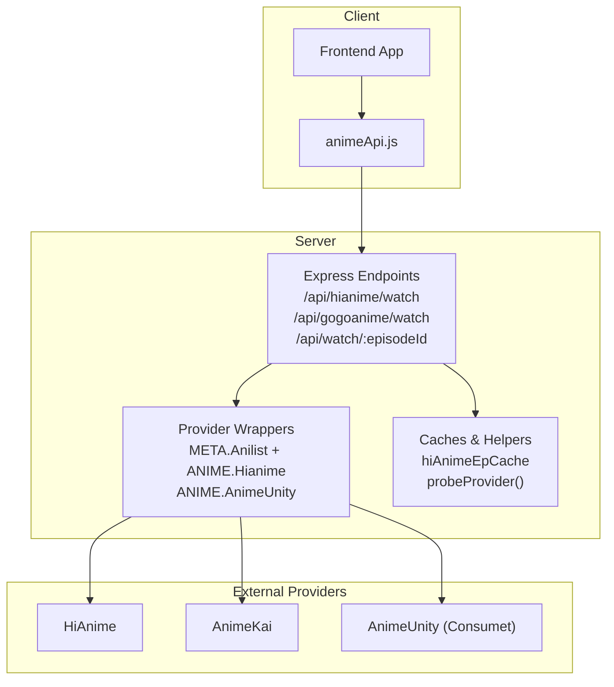
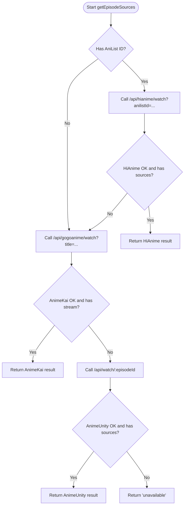
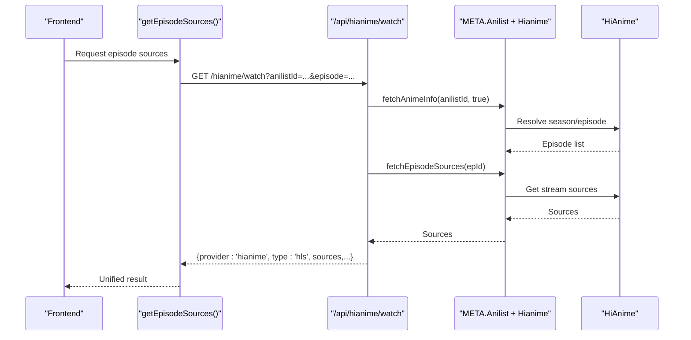
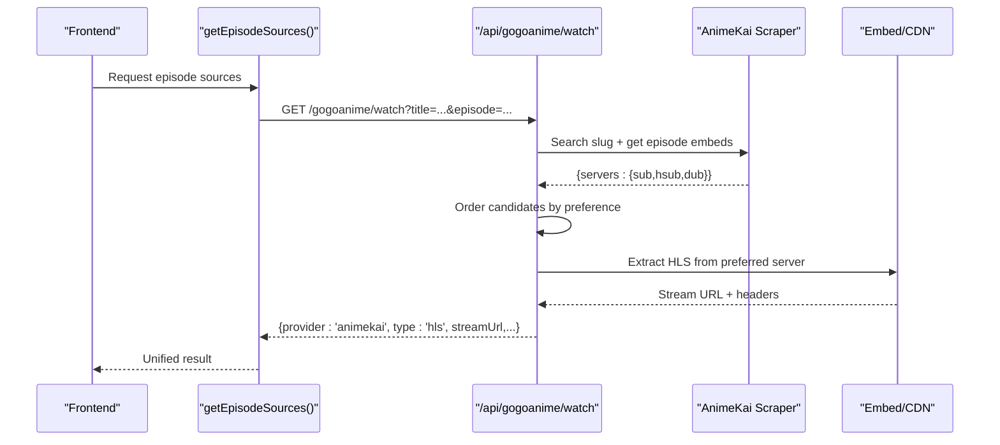
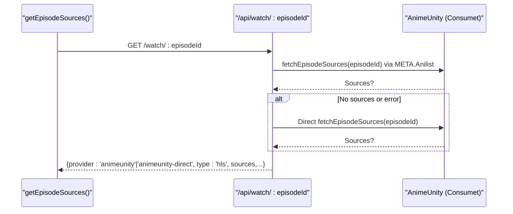
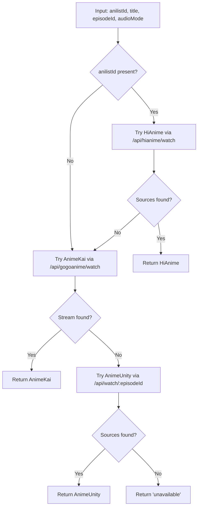
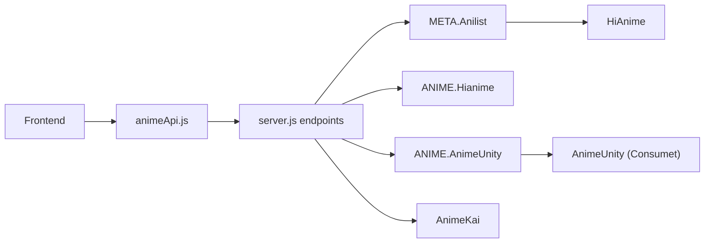

# Provider Hierarchy & Selection Logic

<cite>
**Referenced Files in This Document**
- [server.js](file://server.js)
- [mockData.js](file://src/mockData.js)
- [animeApi.js](file://src/features/anime/api/animeApi.js)
- [ARCHITECTURE_RESEARCH_BRIEF.txt](file://ARCHITECTURE_RESEARCH_BRIEF.txt)
</cite>

## Table of Contents
1. [Introduction](#introduction)
2. [Project Structure](#project-structure)
3. [Core Components](#core-components)
4. [Architecture Overview](#architecture-overview)
5. [Detailed Component Analysis](#detailed-component-analysis)
6. [Dependency Analysis](#dependency-analysis)
7. [Performance Considerations](#performance-considerations)
8. [Troubleshooting Guide](#troubleshooting-guide)
9. [Conclusion](#conclusion)

## Introduction
This document explains the multi-tier provider selection system used to stream anime episodes. The system prioritizes a primary provider (HiAnime via AniList), falls back to a secondary provider (AnimeKai scraper), and finally uses a last-resort fallback (AnimeUnity via Consumet). It details how automatic fallbacks are triggered, error handling strategies, retry logic, and the selection algorithms that determine which source to use based on content availability, reliability, and user preferences. It also includes examples of provider switching scenarios and guidance for troubleshooting failed provider connections.

## Project Structure
The provider selection spans both server-side endpoints and client-side orchestration:
- Server-side orchestrates provider calls, caching, timeouts, and status probes.
- Client-side composes requests across providers and returns unified results to the UI.

**Diagram sources**
- [server.js:213-224](file://server.js#L213-L224)
- [server.js:1210-1278](file://server.js#L1210-L1278)
- [server.js:1382-1559](file://server.js#L1382-L1559)
- [server.js:1564-1601](file://server.js#L1564-L1601)
- [mockData.js:721-817](file://src/mockData.js#L721-L817)

**Section sources**
- [server.js:213-224](file://server.js#L213-L224)
- [mockData.js:721-817](file://src/mockData.js#L721-L817)

## Core Components
- Primary Provider: HiAnime via META.Anilist using AniList ID to deterministically select season and episode.
- Secondary Provider: AnimeKai title-based search with preference ordering by language/sub/dub.
- Fallback Provider: AnimeUnity via Consumet as last resort when earlier providers fail or return no sources.
- Orchestration: Client-side getEpisodeSources composes provider calls; server exposes endpoints per provider and a unified watch endpoint.
- Health Probing: /api/status probes external services and reports degraded state if any fail.

Key responsibilities:
- Determine provider order based on input parameters (AniList ID vs title vs episode ID).
- Apply timeouts and retries where applicable.
- Cache episode lists and streams to reduce latency and repeated extractions.
- Normalize responses into a consistent format for the player.

**Section sources**
- [server.js:213-224](file://server.js#L213-L224)
- [server.js:1210-1278](file://server.js#L1210-L1278)
- [server.js:1382-1559](file://server.js#L1382-L1559)
- [server.js:1564-1601](file://server.js#L1564-L1601)
- [mockData.js:721-817](file://src/mockData.js#L721-L817)

## Architecture Overview
The selection algorithm is layered:
1. If an AniList ID is available, attempt HiAnime first (primary).
2. If HiAnime fails or returns no sources, try AnimeKai by title (secondary).
3. If AnimeKai fails or returns no playable stream, try AnimeUnity via Consumet (fallback).
4. If all fail, return an unavailable response.

**Diagram sources**
- [mockData.js:721-817](file://src/mockData.js#L721-L817)
- [server.js:1210-1278](file://server.js#L1210-L1278)
- [server.js:1382-1559](file://server.js#L1382-L1559)
- [server.js:1564-1601](file://server.js#L1564-L1601)

## Detailed Component Analysis

### Primary Provider: HiAnime via AniList
- Input: AniList ID and episode number; supports audio mode (sub/dub).
- Behavior:
  - Uses META.Anilist to map AniList ID to HiAnime’s correct season page.
  - Enforces a short timeout to avoid long waits before falling back.
  - Caches episode lists per AniList ID and audio mode to speed up subsequent requests.
  - Returns normalized HLS sources and subtitles when available.

**Diagram sources**
- [server.js:1210-1278](file://server.js#L1210-L1278)
- [server.js:213-224](file://server.js#L213-L224)
- [mockData.js:721-749](file://src/mockData.js#L721-L749)

**Section sources**
- [server.js:1210-1278](file://server.js#L1210-L1278)
- [server.js:213-224](file://server.js#L213-L224)
- [mockData.js:721-749](file://src/mockData.js#L721-L749)

### Secondary Provider: AnimeKai Scraper
- Input: Title, season, episode, and audio mode preference.
- Behavior:
  - Searches by title and caches slug per title+season.
  - Builds a preference-ordered candidate list based on requested audio mode:
    - Default (sub): prefers English Sub, then Hardsub, then Dub.
    - ENG Dub mode: prefers Dub, then Sub, then Hardsub.
  - Attempts to extract HLS stream URLs; if extraction fails, falls back to iframe embed.
  - Proxies subtitles through backend to avoid CORS issues.

**Diagram sources**
- [server.js:1382-1559](file://server.js#L1382-L1559)
- [mockData.js:751-790](file://src/mockData.js#L751-L790)

**Section sources**
- [server.js:1382-1559](file://server.js#L1382-L1559)
- [mockData.js:751-790](file://src/mockData.js#L751-L790)

### Fallback Provider: AnimeUnity via Consumet
- Input: Episode ID.
- Behavior:
  - First tries META.Anilist wrapper around AnimeUnity; if it fails, tries direct AnimeUnity call.
  - Returns normalized sources and subtitles when available.
  - Used only when primary and secondary providers cannot provide playable streams.

**Diagram sources**
- [server.js:1564-1601](file://server.js#L1564-L1601)
- [mockData.js:792-817](file://src/mockData.js#L792-L817)

**Section sources**
- [server.js:1564-1601](file://server.js#L1564-L1601)
- [mockData.js:792-817](file://src/mockData.js#L792-L817)

### Provider Selection Algorithm
- Deterministic primary path: When an AniList ID is present, always attempt HiAnime first because it maps directly to the correct season and episode without ambiguity.
- Title-based fallback: If HiAnime fails or returns no sources, switch to AnimeKai using title and season.
- Last resort: If both fail, use AnimeUnity with the episode ID.
- Preference ordering within AnimeKai respects user audio mode (sub vs dub) and server priority.

**Diagram sources**
- [mockData.js:721-817](file://src/mockData.js#L721-L817)
- [server.js:1210-1278](file://server.js#L1210-L1278)
- [server.js:1382-1559](file://server.js#L1382-L1559)
- [server.js:1564-1601](file://server.js#L1564-L1601)

**Section sources**
- [mockData.js:721-817](file://src/mockData.js#L721-L817)
- [server.js:1210-1278](file://server.js#L1210-L1278)
- [server.js:1382-1559](file://server.js#L1382-L1559)
- [server.js:1564-1601](file://server.js#L1564-L1601)

### Error Handling Strategies and Retry Logic
- Timeouts:
  - HiAnime request wrapped with a short timeout to trigger fallback quickly when slow or unresponsive.
- Graceful degradation:
  - Each provider call is wrapped in try/catch; failures log warnings/errors and proceed to next provider.
  - Status endpoint aggregates health checks and reports “degraded” if any external service fails.
- Caching:
  - Episode list cache for HiAnime reduces repeated network calls.
  - Stream cache for AnimeKai avoids re-extraction on repeat clicks.
- Retry behavior:
  - Some endpoints implement single retry attempts (e.g., NetMirror token flow) to handle transient errors.
  - AnimeKai server extraction may fall back to iframe if direct HLS extraction fails.

**Section sources**
- [server.js:1210-1278](file://server.js#L1210-L1278)
- [server.js:1304-1336](file://server.js#L1304-L1336)
- [server.js:1382-1559](file://server.js#L1382-L1559)
- [server.js:1564-1601](file://server.js#L1564-L1601)

### Examples of Provider Switching Scenarios
- Scenario A: HiAnime succeeds
  - Input: anilistId provided.
  - Flow: HiAnime returns sources → immediate success.
  - Result: provider = hianime.
- Scenario B: HiAnime times out or returns no sources
  - Input: anilistId provided but HiAnime fails.
  - Flow: Switch to AnimeKai using title and season → if stream found → success.
  - Result: provider = animekai.
- Scenario C: Both HiAnime and AnimeKai fail
  - Input: anilistId/title provided but both fail.
  - Flow: Use AnimeUnity with episodeId → if sources found → success.
  - Result: provider = animeunity or animeunity-direct.
- Scenario D: All providers fail
  - Result: provider = unavailable with error message.

**Section sources**
- [mockData.js:721-817](file://src/mockData.js#L721-L817)
- [server.js:1210-1278](file://server.js#L1210-L1278)
- [server.js:1382-1559](file://server.js#L1382-L1559)
- [server.js:1564-1601](file://server.js#L1564-L1601)

## Dependency Analysis
- Client dependency:
  - Frontend calls getEpisodeSources in animeApi.js, which delegates to backend endpoints.
- Server dependencies:
  - Express routes depend on provider wrappers (META.Anilist, ANIME.Hianime, ANIME.AnimeUnity).
  - Health checks probe external APIs to detect degraded states.
- External dependencies:
  - HiAnime, AnimeKai, AnimeUnity (Consumet) are third-party sources.
  - AniList metadata is used to resolve exact seasons and episodes.

**Diagram sources**
- [animeApi.js:1-20](file://src/features/anime/api/animeApi.js#L1-L20)
- [server.js:213-224](file://server.js#L213-L224)
- [server.js:1210-1278](file://server.js#L1210-L1278)
- [server.js:1382-1559](file://server.js#L1382-L1559)
- [server.js:1564-1601](file://server.js#L1564-L1601)

**Section sources**
- [animeApi.js:1-20](file://src/features/anime/api/animeApi.js#L1-L20)
- [server.js:213-224](file://server.js#L213-L224)
- [server.js:1210-1278](file://server.js#L1210-L1278)
- [server.js:1382-1559](file://server.js#L1382-L1559)
- [server.js:1564-1601](file://server.js#L1564-L1601)

## Performance Considerations
- Caching:
  - HiAnime episode lists cached per AniList ID and audio mode to reduce repeated lookups.
  - AnimeKai stream results cached to avoid re-extraction on repeat clicks.
- Timeouts:
  - Short timeout on HiAnime ensures quick fallback to AnimeKai when needed.
- Preference ordering:
  - AnimeKai candidate ordering minimizes unnecessary extraction attempts by trying preferred servers first.
- Status probing:
  - Aggregated health checks help identify degraded providers early.

[No sources needed since this section provides general guidance]

## Troubleshooting Guide
Common issues and diagnostics:
- HiAnime timeout or no sources:
  - Check logs for “[HIANIME]” messages indicating timeout or missing sources.
  - Verify AniList ID correctness and ensure the episode exists on the correct season.
- AnimeKai extraction failures:
  - Logs show “[ANIMEKAI] Trying fallback server” or iframe fallback usage.
  - Ensure title and season parameters match available entries; check subtitle proxy availability.
- AnimeUnity failures:
  - Logs indicate “[WATCH] META.Anilist failed” or direct AnimeUnity failure.
  - Confirm episode ID validity and that Consumet is reachable.
- Service health:
  - Use /api/status to see which external providers are down or returning errors.
  - Deep mode can include additional providers for broader diagnostics.

**Section sources**
- [server.js:1210-1278](file://server.js#L1210-L1278)
- [server.js:1382-1559](file://server.js#L1382-L1559)
- [server.js:1564-1601](file://server.js#L1564-L1601)
- [server.js:1304-1336](file://server.js#L1304-L1336)

## Conclusion
The multi-tier provider selection system ensures robust streaming by prioritizing HiAnime via AniList for deterministic accuracy, falling back to AnimeKai for title-based retrieval, and using AnimeUnity as a last resort. Automatic fallbacks, timeouts, caching, and preference ordering contribute to resilience and performance. The status endpoint aids in monitoring provider health, while structured logging facilitates troubleshooting. Together, these mechanisms deliver a reliable experience even when individual providers are unstable or unavailable.

[No sources needed since this section summarizes without analyzing specific files]