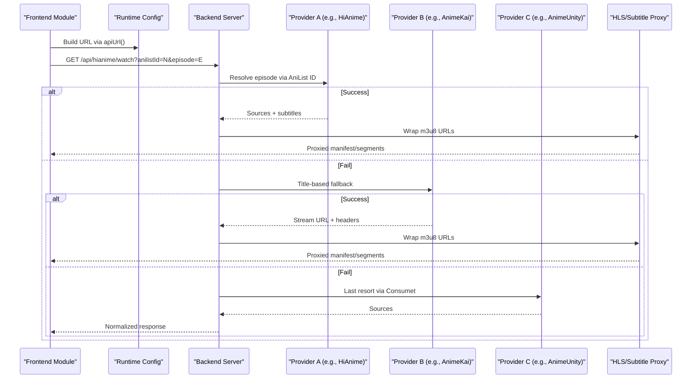
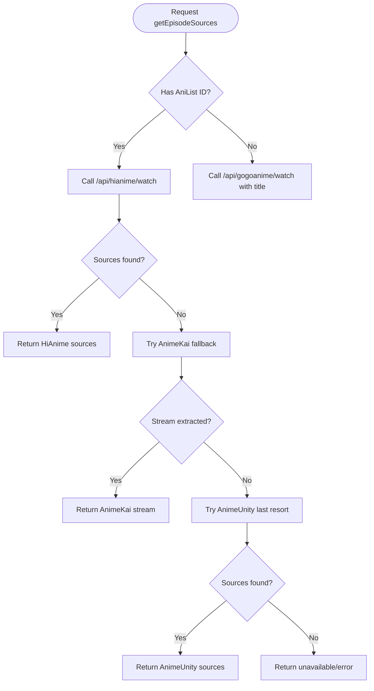
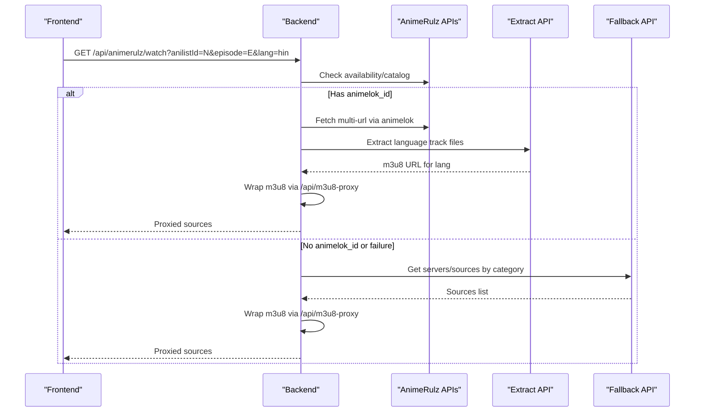
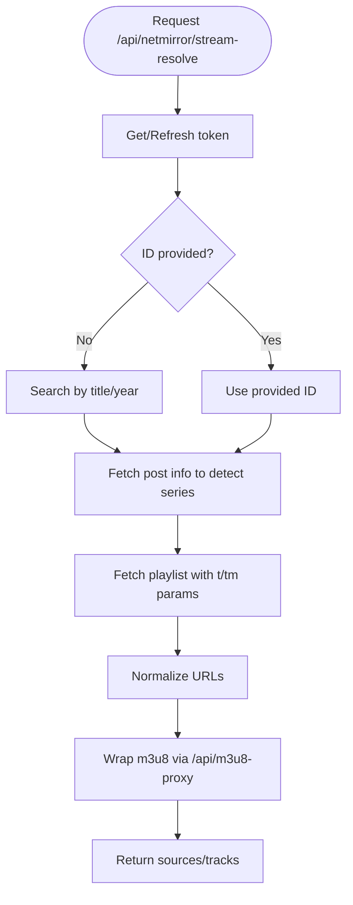
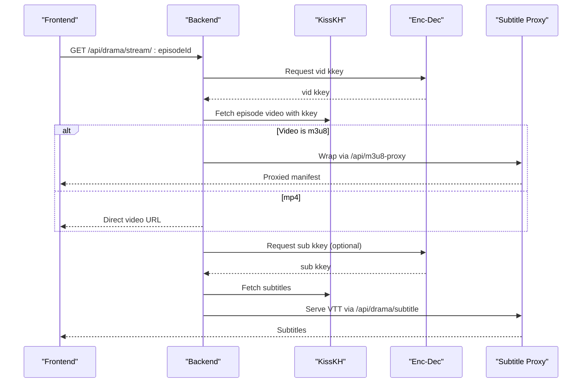
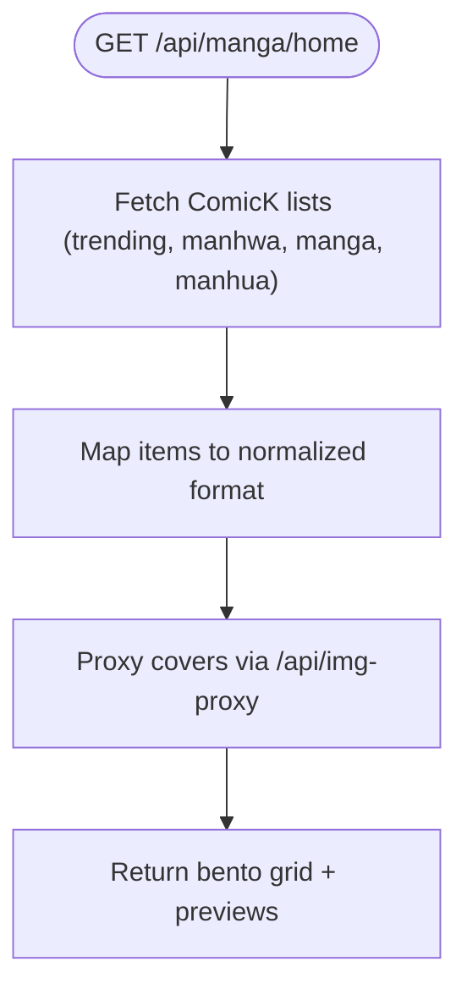
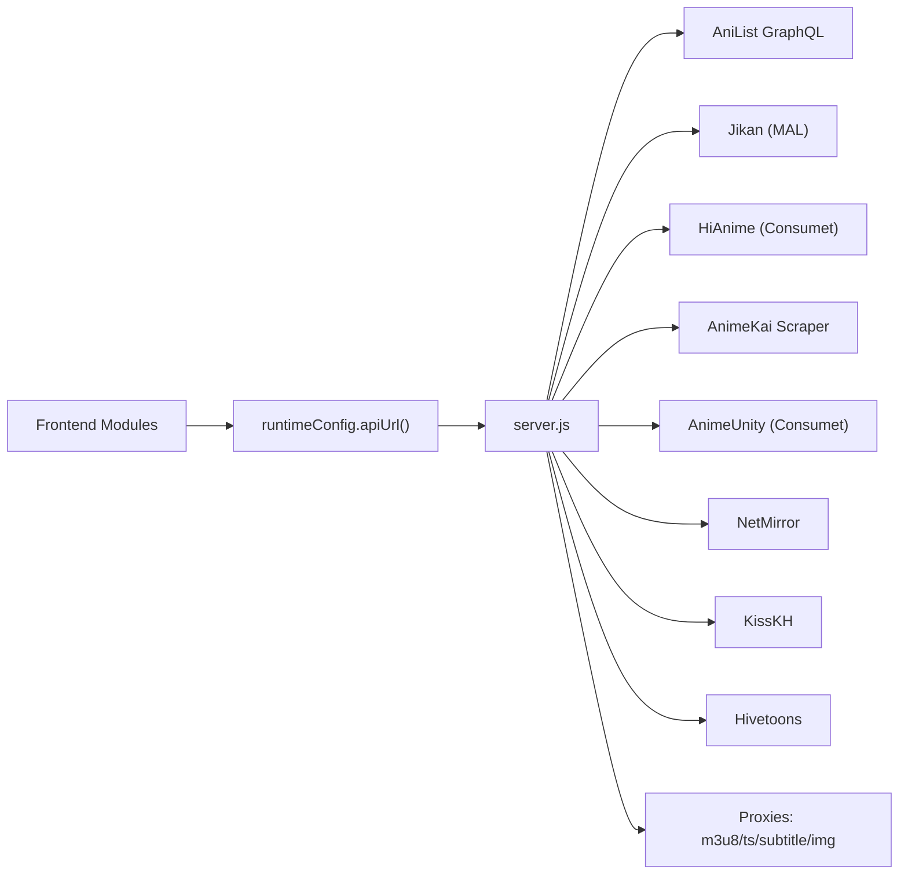

# Provider Integration Patterns

<cite>
**Referenced Files in This Document**
- [animeApi.js](file://src/features/anime/api/animeApi.js)
- [movieApi.js](file://src/features/movie/api/movieApi.js)
- [dramaApi.js](file://src/features/drama/api/dramaApi.js)
- [mangaApi.js](file://src/features/manga/api/mangaApi.js)
- [manhwaApi.js](file://src/features/manhwa/api/manhwaApi.js)
- [mockData.js](file://src/mockData.js)
- [runtimeConfig.js](file://src/runtimeConfig.js)
- [server.js](file://server.js)
</cite>

## Table of Contents
1. [Introduction](#introduction)
2. [Project Structure](#project-structure)
3. [Core Components](#core-components)
4. [Architecture Overview](#architecture-overview)
5. [Detailed Component Analysis](#detailed-component-analysis)
6. [Dependency Analysis](#dependency-analysis)
7. [Performance Considerations](#performance-considerations)
8. [Troubleshooting Guide](#troubleshooting-guide)
9. [Conclusion](#conclusion)
10. [Appendices](#appendices)

## Introduction
This document explains the provider integration patterns used across the application to unify streaming and content sources behind a consistent API surface. It covers how new providers are integrated, how authentication and request formatting are handled, how responses are normalized, and how errors are recovered. It also documents common patterns for handling different content types (anime, movies, dramas), language variants (sub, dub, hsub), and quality options, as well as the abstraction layer that enables seamless switching between sources.

## Project Structure
The application uses a feature-based structure where each content type has its own API module that forwards calls to a backend server. The backend centralizes provider logic, caching, proxies, and error handling.

```mermaid
graph TB
subgraph "Frontend"
A["Anime API<br/>src/features/anime/api/animeApi.js"]
B["Movie API<br/>src/features/movie/api/movieApi.js"]
C["Drama API<br/>src/features/drama/api/dramaApi.js"]
D["Manga API<br/>src/features/manga/api/mangaApi.js"]
E["Manhwa API<br/>src/features/manhwa/api/manhwaApi.js"]
F["Runtime Config<br/>src/runtimeConfig.js"]
end
subgraph "Backend"
S["Express Server<br/>server.js"]
end
A --> |fetch /api/*| S
B --> |fetch /api/*| S
C --> |fetch /api/*| S
D --> |fetch /api/*| S
E --> |fetch /api/*| S
F --> |provides apiUrl()| A
F --> |provides apiUrl()| B
F --> |provides apiUrl()| C
F --> |provides apiUrl()| D
F --> |provides apiUrl()| E
```

**Diagram sources**
- [animeApi.js:1-20](file://src/features/anime/api/animeApi.js#L1-L20)
- [movieApi.js:1-32](file://src/features/movie/api/movieApi.js#L1-L32)
- [dramaApi.js:1-33](file://src/features/drama/api/dramaApi.js#L1-L33)
- [mangaApi.js:1-29](file://src/features/manga/api/mangaApi.js#L1-L29)
- [manhwaApi.js:1-29](file://src/features/manhwa/api/manhwaApi.js#L1-L29)
- [runtimeConfig.js:149-153](file://src/runtimeConfig.js#L149-L153)
- [server.js:22-28](file://server.js#L22-L28)

**Section sources**
- [animeApi.js:1-20](file://src/features/anime/api/animeApi.js#L1-L20)
- [movieApi.js:1-32](file://src/features/movie/api/movieApi.js#L1-L32)
- [dramaApi.js:1-33](file://src/features/drama/api/dramaApi.js#L1-L33)
- [mangaApi.js:1-29](file://src/features/manga/api/mangaApi.js#L1-L29)
- [manhwaApi.js:1-29](file://src/features/manhwa/api/manhwaApi.js#L1-L29)
- [runtimeConfig.js:1-163](file://src/runtimeConfig.js#L1-L163)
- [server.js:1-800](file://server.js#L1-L800)

## Core Components
- Feature API modules: Thin wrappers that call backend endpoints via a shared URL builder. They standardize error handling and return formats per content type.
- Backend server: Centralized provider orchestration with caching, proxying, scraping, and normalization. Exposes stable endpoints like /api/hianime/watch, /api/gogoanime/watch, /api/animerulz/watch, /api/drama/*, /api/netmirror/*, /api/manga/*, /api/manhwa/*.
- Runtime configuration: Provides a unified base URL strategy for all frontend requests, including environment overrides and fallbacks.

Key responsibilities:
- Anime: Multi-provider resolution (HiAnime primary, AnimeKai fallback, AnimeUnity last resort), Hindi/Indian language support via AnimeRulz, episode metadata from Jikan/Consumet, HLS proxying.
- Movies: Catalog and search via NetMirror aggregator; playlist resolution and HLS proxying.
- Dramas: KissKH catalog/info/stream endpoints with subtitle proxying and tokenized stream resolution.
- Manga/Manhwa: ComicK/Hivetoons catalogs and chapter pages with image proxying.

**Section sources**
- [mockData.js:321-800](file://src/mockData.js#L321-L800)
- [server.js:738-1600](file://server.js#L738-L1600)
- [server.js:1600-2399](file://server.js#L1600-L2399)

## Architecture Overview
The system abstracts multiple external providers behind a consistent backend API. Frontend modules call these endpoints using a runtime-configured base URL. The backend normalizes responses, handles provider-specific authentication, retries, and proxies media streams through secure endpoints to bypass CORS and hotlink restrictions.



**Diagram sources**
- [mockData.js:632-800](file://src/mockData.js#L632-L800)
- [server.js:1210-1600](file://server.js#L1210-L1600)
- [server.js:263-393](file://server.js#L263-L393)

## Detailed Component Analysis

### Anime Provider Abstraction
- Primary provider: HiAnime via META.Anilist using AniList IDs for deterministic season/episode mapping.
- Fallback provider: AnimeKai scraper using title search with season-aware scoring; supports sub, dub, and hardsub (hsub).
- Last resort: AnimeUnity via Consumet when previous providers fail.
- Language variants:
  - Sub: Japanese audio with English subtitles.
  - Dub: English dubbed tracks.
  - Hindi/Indian dubs: AnimeRulz integration with animelok and extract APIs; supports multiple Indian languages.
- Episode metadata: Jikan (MAL) for titles, air dates, filler/recap flags; Consumet for provider-specific episode IDs.
- Streaming: HLS manifests proxied via /api/m3u8-proxy; subtitles proxied via /api/subtitle-proxy.



**Diagram sources**
- [mockData.js:632-800](file://src/mockData.js#L632-L800)
- [server.js:1210-1600](file://server.js#L1210-L1600)

**Section sources**
- [mockData.js:321-800](file://src/mockData.js#L321-L800)
- [server.js:738-1600](file://server.js#L738-L1600)

### AnimeRulz (Hindi/Indian Dubs) Integration
- Availability check: Uses catalog and individual lookup to determine available languages per anime.
- Stream resolution:
  - Strategy 1: animelok + extract for requested language (e.g., Hindi, Tamil, Telugu).
  - Strategy 2: fallback.streamindia.co.in sources if no Indian language requested or strategy 1 fails.
- Headers and referers: Strict browser-like headers and referer rotation to avoid 403 blocks.
- Proxying: All m3u8 URLs wrapped through /api/m3u8-proxy to handle CORS and protected CDNs.



**Diagram sources**
- [server.js:748-1155](file://server.js#L748-L1155)
- [server.js:1048-1155](file://server.js#L1048-L1155)

**Section sources**
- [server.js:748-1155](file://server.js#L748-L1155)

### Movie Provider (NetMirror)
- Authentication: Token obtained via /verify.php with randomized captcha bypass; cookie maintained and refreshed.
- Catalog and search: HTML parsing with cheerio to extract trending items; batch fetching titles via post.php.
- Playlist resolution: Search by title or ID; resolve series episodes; generate per-session parameters to avoid anti-abuse videos.
- Streaming: HLS sources rewritten through /api/m3u8-proxy with correct referer; subtitles proxied via drama subtitle endpoint.



**Diagram sources**
- [server.js:1699-1850](file://server.js#L1699-L1850)
- [server.js:2112-2196](file://server.js#L2112-L2196)

**Section sources**
- [server.js:1699-1850](file://server.js#L1699-L1850)
- [server.js:2112-2196](file://server.js#L2112-L2196)

### Drama Provider (KissKH)
- Catalog endpoints: Home, list, search, info with TTL-based caching.
- Stream resolution: Encrypted keys via enc-dec.app; fetch episode video and optional subtitles; wrap m3u8 via /api/m3u8-proxy.
- Subtitles: Dedicated proxy endpoint normalizes VTT format and serves with CORS headers.



**Diagram sources**
- [server.js:1853-2043](file://server.js#L1853-L2043)

**Section sources**
- [server.js:1853-2043](file://server.js#L1853-L2043)

### Manga/Manhwa Providers
- Manga (ComicK): Catalog endpoints with genre pagination, cover image proxying, and normalized item mapping.
- Manhwa (Hivetoons): Chapter page scraping to extract images; caching per chapter.



**Diagram sources**
- [server.js:2200-2383](file://server.js#L2200-L2383)

**Section sources**
- [server.js:2200-2383](file://server.js#L2200-L2383)

## Dependency Analysis
- Frontend modules depend on runtimeConfig.apiUrl() to build absolute URLs, enabling environment-based routing without code changes.
- Backend depends on external libraries (@consumet/extensions, axios, cheerio) and third-party services (AniList, Jikan, HiAnime, AnimeKai, AnimeUnity, NetMirror, KissKH, Hivetoons).
- Caching layers reduce load on providers and improve responsiveness:
  - AniList server cache with rate-limit retry.
  - HiAnime episode cache keyed by anilistId+audio mode.
  - AnimeKai slug and stream caches with TTLs.
  - AnimeRulz catalog and stream caches.
  - Drama catalog and stream caches.
  - Manga genre catalog cache with deduplication.



**Diagram sources**
- [runtimeConfig.js:149-153](file://src/runtimeConfig.js#L149-L153)
- [server.js:213-228](file://server.js#L213-L228)
- [server.js:401-425](file://server.js#L401-L425)
- [server.js:764-789](file://server.js#L764-L789)
- [server.js:1161-1208](file://server.js#L1161-L1208)
- [server.js:1628-1633](file://server.js#L1628-L1633)
- [server.js:2218-2318](file://server.js#L2218-L2318)

**Section sources**
- [runtimeConfig.js:1-163](file://src/runtimeConfig.js#L1-L163)
- [server.js:213-228](file://server.js#L213-L228)
- [server.js:401-425](file://server.js#L401-L425)
- [server.js:764-789](file://server.js#L764-L789)
- [server.js:1161-1208](file://server.js#L1161-L1208)
- [server.js:1628-1633](file://server.js#L1628-L1633)
- [server.js:2218-2318](file://server.js#L2218-L2318)

## Performance Considerations
- Caching strategies:
  - In-memory caches with TTLs for expensive operations (AniList, HiAnime episodes, AnimeKai slug/stream, AnimeRulz catalog/stream, drama catalog/stream, manga genre catalog).
  - Deduplication for manga genre catalog to prevent duplicate items and repeated page fetches.
- Parallelism:
  - Parallel extraction attempts for AnimeKai top-3 servers to minimize latency.
  - Batched AniList queries for Hindi anime list to reduce network overhead.
- Proxy optimization:
  - Range header forwarding for TS segments to enable byte-range playback.
  - Manifest rewriting to ensure only necessary segments are fetched.
- Rate limiting and retries:
  - AniList proxy retries on 429 with backoff.
  - Provider fallback chains to maintain service continuity.

[No sources needed since this section provides general guidance]

## Troubleshooting Guide
Common issues and resolutions:
- Missing or invalid AniList ID for Hindi dub: Ensure the anime detail page resolves an AniList ID before requesting Hindi streams.
- Provider unavailability:
  - HiAnime timeout or missing episodes triggers fallback to AnimeKai; if both fail, AnimeUnity is attempted.
  - AnimeKai extraction failures fall back to iframe mode or remaining servers.
  - AnimeRulz availability checks may return empty languages; verify catalog data and language codes.
- CORS and hotlink protection:
  - Always use backend proxies (/api/m3u8-proxy, /api/ts-proxy, /api/subtitle-proxy, /api/img-proxy) instead of direct provider URLs.
  - Ensure referer and origin headers are set correctly; backend rotates candidates for protected domains.
- Token expiration (NetMirror/KissKH):
  - Tokens are refreshed automatically; if endpoints return HTML or status "n", the backend refreshes and retries once.
- Debugging:
  - Use /api/health and /api/status (with deep=true) to inspect provider connectivity and configuration.
  - Review console logs for provider-specific warnings and errors.

**Section sources**
- [server.js:713-735](file://server.js#L713-L735)
- [server.js:1304-1336](file://server.js#L1304-L1336)
- [server.js:1763-1776](file://server.js#L1763-L1776)
- [server.js:1998-2017](file://server.js#L1998-L2017)

## Conclusion
The application implements a robust provider abstraction layer that standardizes access to diverse streaming and content sources. By centralizing authentication, request formatting, response normalization, and error recovery in the backend, it enables seamless switching between providers and consistent behavior across content types and language variants. The patterns documented here provide a clear blueprint for adding new providers, extending existing integrations, and maintaining compatibility while ensuring reliability and performance.

[No sources needed since this section summarizes without analyzing specific files]

## Appendices

### Adding a New Provider: Step-by-Step
1. Define backend endpoints under server.js for discovery, details, and streaming.
2. Implement provider-specific authentication and request formatting (headers, cookies, tokens).
3. Normalize responses to a common schema (provider, type, sources, subtitles, headers).
4. Integrate proxies for HLS and subtitles to bypass CORS and hotlink restrictions.
5. Add caching and fallback logic to improve resilience.
6. Expose frontend API module that calls the new backend endpoints via apiUrl().

**Section sources**
- [server.js:263-393](file://server.js#L263-L393)
- [server.js:1210-1600](file://server.js#L1210-L1600)
- [runtimeConfig.js:149-153](file://src/runtimeConfig.js#L149-L153)

### Extending Existing Integrations
- For anime:
  - Add new language modes by updating audioMode handling and provider selection in mockData.js and server.js.
  - Extend AnimeKai server preference order to include new language variants (e.g., hsub).
- For movies/dramas:
  - Enhance playlist resolution to support additional OTT sources or episode detection logic.
  - Improve subtitle handling by supporting additional formats and languages.

**Section sources**
- [mockData.js:632-800](file://src/mockData.js#L632-L800)
- [server.js:1382-1559](file://server.js#L1382-L1559)
- [server.js:1948-2043](file://server.js#L1948-L2043)

### Maintaining Provider Compatibility
- Monitor provider health via /api/status and adjust timeouts/retries accordingly.
- Keep referer and user-agent strings updated to match provider expectations.
- Regularly validate cached data freshness and TTLs to balance performance and accuracy.
- Test fallback chains thoroughly to ensure graceful degradation when primary providers fail.

**Section sources**
- [server.js:1304-1336](file://server.js#L1304-L1336)
- [server.js:401-425](file://server.js#L401-L425)
- [server.js:764-789](file://server.js#L764-L789)