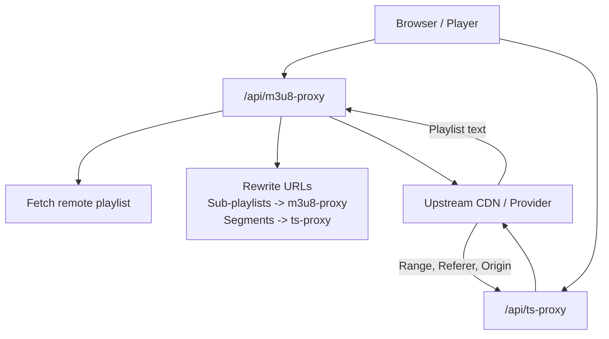
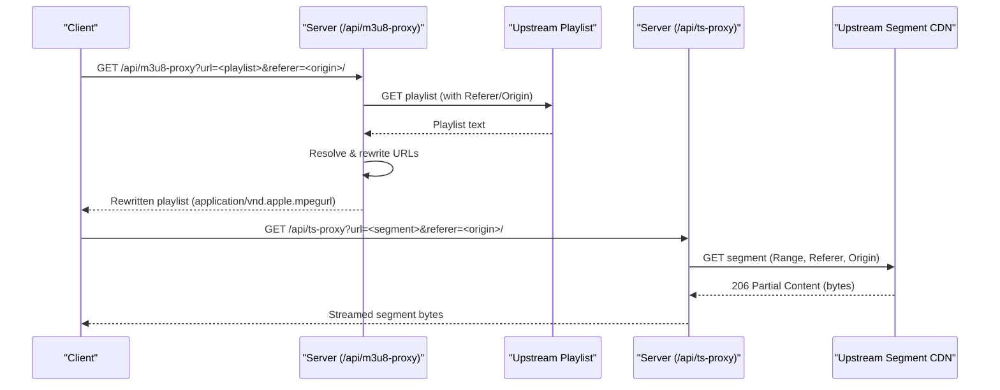
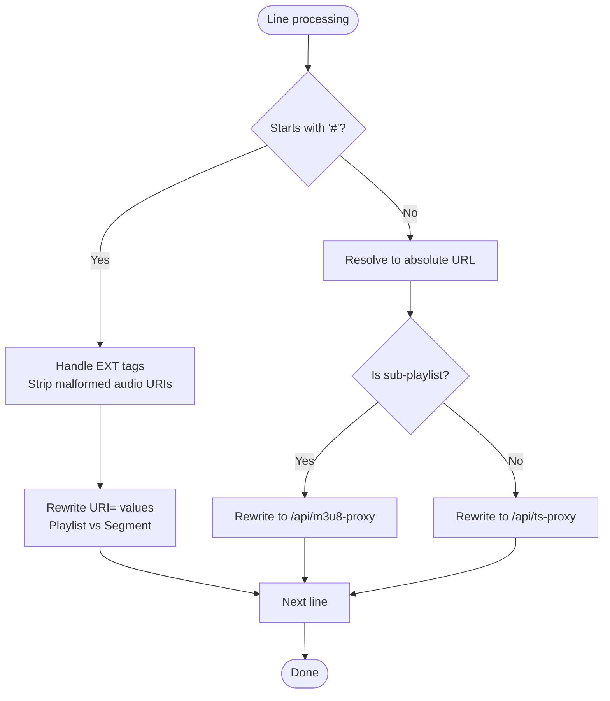

# HLS Manifest Rewriting

<cite>
**Referenced Files in This Document**
- [server.js](file://server.js)
- [proxy.py](file://proxy.py)
</cite>

## Table of Contents
1. [Introduction](#introduction)
2. [Project Structure](#project-structure)
3. [Core Components](#core-components)
4. [Architecture Overview](#architecture-overview)
5. [Detailed Component Analysis](#detailed-component-analysis)
6. [Dependency Analysis](#dependency-analysis)
7. [Performance Considerations](#performance-considerations)
8. [Troubleshooting Guide](#troubleshooting-guide)
9. [Conclusion](#conclusion)

## Introduction
This document explains the HLS manifest rewriting system that enables playback of protected and CORS-restricted HLS streams by routing all playlist and segment requests through a backend proxy. The core endpoint is /api/m3u8-proxy, which fetches remote playlists, rewrites internal URLs to route through the backend, and recursively handles nested sub-playlists. A companion segment proxy at /api/ts-proxy forwards media segments with correct headers (including Range) for efficient streaming. Special handling exists for StreamIndia’s protected HLS flows and malformed URIs from certain providers.

## Project Structure
The HLS proxy logic is implemented in the Node.js server:
- /api/m3u8-proxy: Fetches and rewrites HLS manifests
- /api/ts-proxy: Streams media segments with range support
- Helper utilities: URL unwrapping, header construction, referer rotation, and provider-specific logic

A separate Python relay (proxy.py) forwards requests to an external site for specific use cases and runs on a different port to avoid conflicts with the main server.

**Diagram sources**
- [server.js:263-345](file://server.js#L263-L345)
- [server.js:354-393](file://server.js#L354-L393)

**Section sources**
- [server.js:263-345](file://server.js#L263-L345)
- [server.js:354-393](file://server.js#L354-L393)
- [proxy.py:1-36](file://proxy.py#L1-L36)

## Core Components
- m3u8-proxy endpoint: Fetches the original playlist, normalizes and resolves relative or malformed URLs, then rewrites them to proxied endpoints. Sub-playlists are routed back through m3u8-proxy; media segments (.ts, .aac, .js, .css, etc.) are routed through ts-proxy.
- ts-proxy endpoint: Proxies raw segment bytes, forwarding Range headers to enable byte-range streaming and preserving upstream content headers.
- URL transformation helpers:
  - unwrapM3u8ProxyUrl: Prevents loops by unwrapping previously proxied URLs
  - resolveManifestUrl: Resolves absolute, protocol-relative, and malformed URIs against the playlist base
  - unwrapStreamIndiaRelayUrl: Bypasses a known failing relay for StreamIndia flows
- Header and referer management:
  - streamProxyHeaders: Adds browser-like headers and extra headers for protected HLS
  - streamProxyReferers: Rotates referers for providers requiring multiple origins

**Section sources**
- [server.js:41-70](file://server.js#L41-L70)
- [server.js:74-148](file://server.js#L74-L148)
- [server.js:263-345](file://server.js#L263-L345)
- [server.js:354-393](file://server.js#L354-L393)

## Architecture Overview
The HLS pipeline ensures the client only talks to the backend, while the backend manages upstream authentication, CORS, and referrer requirements.

**Diagram sources**
- [server.js:263-345](file://server.js#L263-L345)
- [server.js:354-393](file://server.js#L354-L393)

## Detailed Component Analysis

### m3u8-proxy Endpoint
Responsibilities:
- Accepts url and referer query parameters
- Unwraps any nested proxy URLs to prevent loops
- Fetches the remote playlist with appropriate headers
- Rewrites each line:
  - #EXT-X-MEDIA entries with URI attributes are proxied based on whether they point to playlists or segments
  - Lines following #EXT-X-STREAM-INF are treated as variant playlists and proxied via m3u8-proxy
  - Other lines are resolved to absolute URLs and proxied via ts-proxy if they are segments
- Returns the rewritten playlist with proper MIME type and CORS headers

URL resolution and transformation:
- Fixes malformed triple-slash URIs (e.g., https:///files/...) by resolving against the playlist origin
- Handles protocol-relative URLs (//host/path) by converting to https when host contains a dot, otherwise resolves against playlist origin
- Applies unwrapStreamIndiaRelayUrl to bypass a failing relay for StreamIndia flows
- Generates child referer as the playlist’s origin to satisfy downstream relays

Nested playlist recursion:
- Sub-playlists are rewritten to call /api/m3u8-proxy again, passing the resolved absolute URL and the child referer so each hop receives the correct referer context

Media type handling:
- Any non-playlist line is treated as a segment and routed to /api/ts-proxy, covering .ts, .aac, .js, .css, .woff, and other assets referenced by the player

Error handling:
- On errors, returns 502 with error message

**Section sources**
- [server.js:263-345](file://server.js#L263-L345)

#### URL Transformation Logic Flow

**Diagram sources**
- [server.js:304-336](file://server.js#L304-L336)

### ts-proxy Endpoint
Responsibilities:
- Accepts url and referer query parameters
- Forwards Range headers to upstream for efficient byte-range streaming
- Proxies segment data with upstream content headers (Content-Type, Accept-Ranges, Content-Length, Content-Range, Content-Encoding)
- Sets CORS headers to allow browser access

Protected HLS handling:
- Uses streamProxyHeaders to add browser-like User-Agent and, for protected HLS targets, additional Sec-Fetch-* headers
- Rotates referers via streamProxyReferers for providers like StreamIndia

Error handling:
- Returns 502 on failure

**Section sources**
- [server.js:354-393](file://server.js#L354-L393)

### StreamIndia Protected HLS Handling
Special behaviors:
- Detects protected HLS targets by checking for streamindia.co.in domains or as-cdn*.top patterns
- Adds extra fetch headers required by these CDNs
- Rotates referers across multiple known origins to recover from 401/403/429/502 responses
- Unwraps failed relay URLs pointing to proxy.streamindia.co.in to reach the direct CDN URL

**Section sources**
- [server.js:57-70](file://server.js#L57-L70)
- [server.js:74-106](file://server.js#L74-L106)
- [server.js:108-148](file://server.js#L108-L148)

### Example Processing Scenarios
- Absolute URL in playlist: Resolved as-is and proxied appropriately (m3u8-proxy for playlists, ts-proxy for segments)
- Relative path: Resolved against the playlist origin before being proxied
- Protocol-relative URL (//host/path): Converted to https when host contains a dot; otherwise resolved against playlist origin
- Malformed triple-slash URI (https:///files/...): Fixed by prepending the playlist origin
- Nested sub-playlist: Rewritten to call m3u8-proxy again with the resolved absolute URL and child referer
- StreamIndia relay URL: Unwrapped to direct CDN URL when encountering the known failing relay

[No sources needed since this section summarizes behavior without quoting code]

## Dependency Analysis
Key dependencies within the server:
- axios: HTTP client for fetching playlists and segments
- cheerio: Used elsewhere in the server (not directly in HLS proxy)
- Express: Routing and request/response handling
- Node built-ins: URL parsing, crypto (used elsewhere), vm (used elsewhere)

External dependencies:
- Upstream CDNs and providers (e.g., StreamIndia, NetMirror)
- Browser-like headers required by WAFs and CDNs

Coupling and cohesion:
- m3u8-proxy depends on helper functions for URL unwrapping, header construction, and referer rotation
- ts-proxy depends on the same header/referer helpers to ensure consistent upstream requests
- Both proxies share the publicHost utility to generate correct backend URLs for rewriting

Potential circular dependencies:
- None observed between m3u8-proxy and ts-proxy; recursion occurs via HTTP calls rather than module imports

**Section sources**
- [server.js:1-20](file://server.js#L1-L20)
- [server.js:263-345](file://server.js#L263-L345)
- [server.js:354-393](file://server.js#L354-L393)

## Performance Considerations
- Byte-range streaming: ts-proxy forwards Range headers to minimize bandwidth and improve startup time
- Streaming response: ts-proxy pipes upstream data directly to the client
- Timeout configuration: Segment fetch uses a reasonable timeout to avoid hanging connections
- Header passthrough: Preserves upstream content headers to maintain caching and encoding behavior

[No sources needed since this section provides general guidance]

## Troubleshooting Guide
Common issues and resolutions:
- Missing url parameter: Ensure the m3u8-proxy request includes a properly encoded url query parameter
- Loops from cached responses: The unwrapM3u8ProxyUrl function prevents localhost-to-localhost loops by unwrapping nested proxy URLs
- 403 Forbidden from CDNs: Verify that browser-like User-Agent and Referer/Origin headers are set; protected HLS may require additional Sec-Fetch-* headers
- StreamIndia relay failures: The unwrapStreamIndiaRelayUrl function bypasses the failing relay; if issues persist, check referer rotation and upstream availability
- Malformed URIs: Triple-slash or protocol-relative URLs are automatically fixed; if playback fails, inspect the resolved absolute URL in logs
- CORS errors: Ensure the backend sets Access-Control-Allow-Origin and that the frontend requests come from allowed origins

**Section sources**
- [server.js:41-70](file://server.js#L41-L70)
- [server.js:74-148](file://server.js#L74-L148)
- [server.js:263-345](file://server.js#L263-L345)
- [server.js:354-393](file://server.js#L354-L393)

## Conclusion
The HLS manifest rewriting system centralizes playlist and segment access through secure backend endpoints, enabling playback of protected and CORS-restricted streams. It robustly handles URL normalization, nested playlist recursion, and provider-specific requirements, including StreamIndia’s protected HLS flows. By leveraging byte-range streaming and careful header management, it delivers efficient and reliable playback across diverse upstream sources.