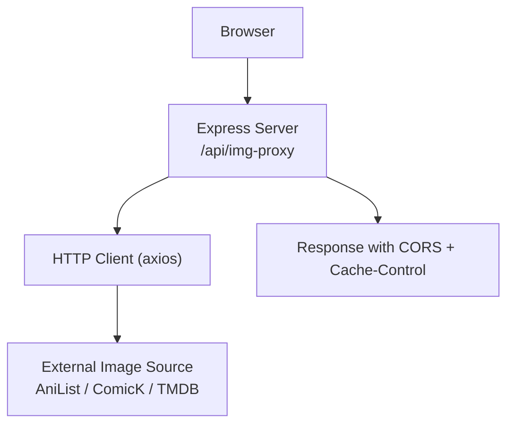
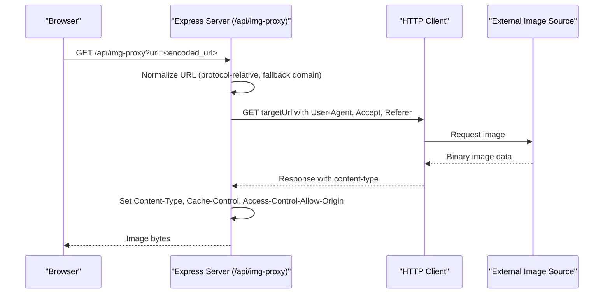
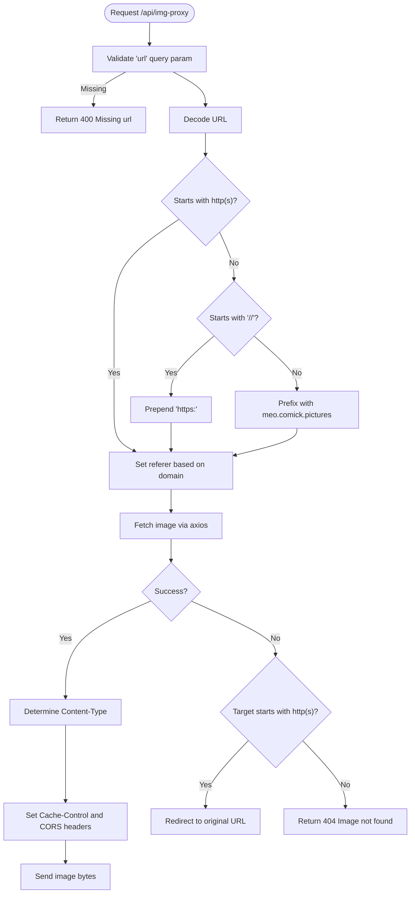
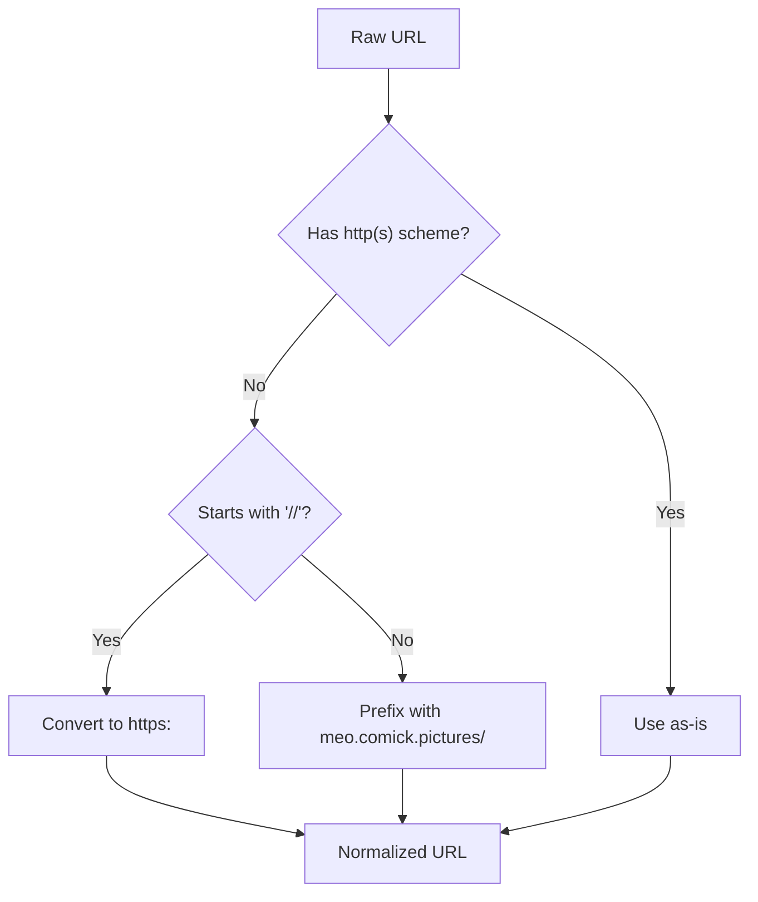
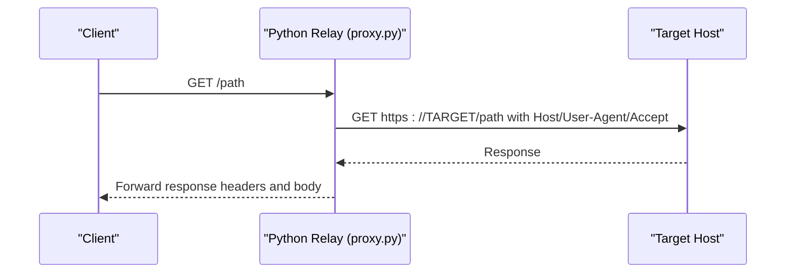
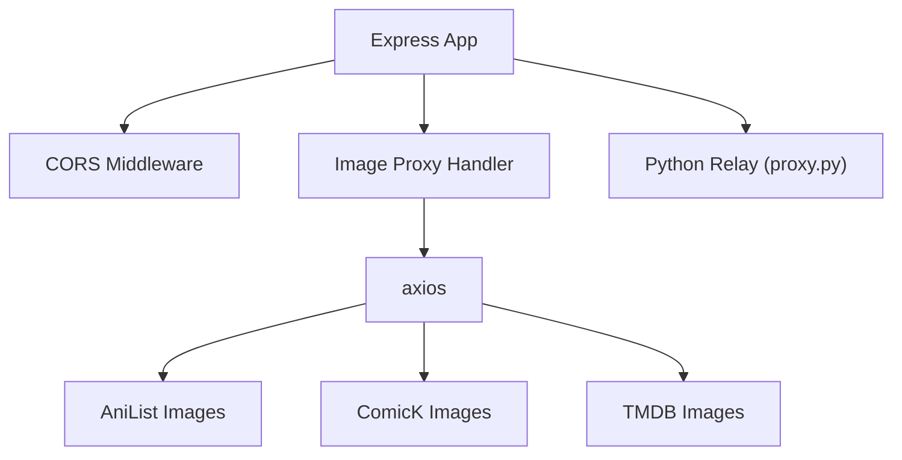

# Image Proxy & CORS Bypass

<cite>
**Referenced Files in This Document**
- [server.js](file://server.js)
- [proxy.py](file://proxy.py)
- [mockData.js](file://src/mockData.js)
</cite>

## Table of Contents
1. [Introduction](#introduction)
2. [Project Structure](#project-structure)
3. [Core Components](#core-components)
4. [Architecture Overview](#architecture-overview)
5. [Detailed Component Analysis](#detailed-component-analysis)
6. [Dependency Analysis](#dependency-analysis)
7. [Performance Considerations](#performance-considerations)
8. [Troubleshooting Guide](#troubleshooting-guide)
9. [Conclusion](#conclusion)

## Introduction
This document explains the image proxy system that bypasses CORS restrictions and hotlink protection for images sourced from external providers such as AniList, ComicK, and TMDB. It focuses on the /api/img-proxy endpoint, URL normalization logic (protocol-relative URLs, domain transformations, fallback domains), caching strategy via Cache-Control headers, error handling for failed image loads, and practical usage examples with troubleshooting guidance for CORS-related issues.

## Project Structure
The image proxy functionality is implemented in the Node.js server and complemented by a Python-based relay used for specific provider scenarios. Key files:
- server.js: Express server implementing /api/img-proxy and related helpers for URL normalization, header management, and caching.
- proxy.py: A lightweight Python HTTP relay used to forward requests to a specific target host with required headers.
- mockData.js: Frontend utilities that generate TMDB image URLs and integrate with the backend proxies.

**Diagram sources**
- [server.js:152-199](file://server.js#L152-L199)

**Section sources**
- [server.js:152-199](file://server.js#L152-L199)
- [proxy.py:1-36](file://proxy.py#L1-L36)
- [mockData.js:245-307](file://src/mockData.js#L245-L307)

## Core Components
- Image proxy handler: Fetches images from external sources, sets appropriate headers (Content-Type, Access-Control-Allow-Origin, Cache-Control), and returns binary image data to the client.
- URL normalization: Handles protocol-relative URLs, absolute paths, and fallback domains to ensure reliable fetching.
- Referer and Origin handling: Adjusts referer based on source domain to satisfy hotlink protections.
- Caching: Sets long-lived cache headers to reduce repeated fetches.
- Error handling: Logs warnings, redirects to original URL when possible, or returns 404 for missing images.

**Section sources**
- [server.js:152-199](file://server.js#L152-L199)
- [server.js:2205-2216](file://server.js#L2205-L2216)

## Architecture Overview
The image proxy acts as an intermediary between the browser and external image hosts. The browser requests images through the backend’s /api/img-proxy endpoint, which normalizes the URL, sets necessary headers, fetches the image, and returns it with CORS enabled and cached appropriately.

**Diagram sources**
- [server.js:152-199](file://server.js#L152-L199)

## Detailed Component Analysis

### Image Proxy Endpoint (/api/img-proxy)
- Input: query parameter url containing the encoded target image URL.
- Normalization:
  - If the URL does not start with http:// or https://:
    - Protocol-relative URLs starting with // are converted to https:.
    - Absolute paths are prefixed with a fallback domain (meo.comick.pictures).
- Referer selection:
  - For ComicK domains, set referer to a trusted site to avoid hotlink blocks.
  - Otherwise, derive referer from the target URL’s origin.
- Headers:
  - User-Agent mimics a modern browser.
  - Accept prioritizes modern image formats.
  - Referer set per above logic.
- Response:
  - Content-Type derived from upstream; defaults to image/jpeg if ambiguous.
  - Cache-Control set to public with max-age=86400.
  - Access-Control-Allow-Origin set to * to allow cross-origin access.
- Error handling:
  - Logs warning with target URL and error message.
  - Redirects to original URL if it starts with http(s).
  - Returns 404 with a descriptive message otherwise.

**Diagram sources**
- [server.js:152-199](file://server.js#L152-L199)

**Section sources**
- [server.js:152-199](file://server.js#L152-L199)

### URL Normalization Logic
- Protocol-relative URLs:
  - Detected by leading “//” and converted to https: to ensure secure fetching.
- Absolute path URLs:
  - Prefixed with a fallback domain (meo.comick.pictures) to resolve relative paths reliably.
- Domain transformation:
  - For ComicK domains, referer is set to a known trusted site to bypass hotlink checks.
- Fallback domains:
  - Used when the provided URL lacks a scheme or points to a path-only resource.

**Diagram sources**
- [server.js:152-164](file://server.js#L152-L164)
- [server.js:2205-2216](file://server.js#L2205-L2216)

**Section sources**
- [server.js:152-164](file://server.js#L152-L164)
- [server.js:2205-2216](file://server.js#L2205-L2216)

### Caching Strategy
- Cache-Control:
  - Set to public with max-age=86400 seconds (24 hours) to enable browser and CDN caching.
- Benefits:
  - Reduces repeated network calls for popular images.
  - Improves perceived performance and reduces bandwidth usage.

**Section sources**
- [server.js:185-187](file://server.js#L185-L187)

### Error Handling for Failed Image Loads
- Logging:
  - Warns with the target URL and error message for diagnostics.
- Redirect:
  - If the target URL is absolute (http/https), the response redirects to the original URL so the browser can attempt direct loading.
- Not Found:
  - Returns 404 with a descriptive message when the target cannot be fetched and is not redirectable.

**Section sources**
- [server.js:189-195](file://server.js#L189-L195)

### Python Relay for Specific Providers
- Purpose:
  - Provides a separate relay service to forward requests to a specific target host with required headers (Host, User-Agent, Accept).
- Usage:
  - Runs on a separate port to avoid conflicts with the main server.
  - Useful when a provider requires strict Host header matching or specific request context.

**Diagram sources**
- [proxy.py:12-32](file://proxy.py#L12-L32)

**Section sources**
- [proxy.py:1-36](file://proxy.py#L1-L36)

### TMDB Integration and Fallbacks
- Frontend utility:
  - Generates TMDB episode thumbnail URLs using a base image path and resolved IDs.
- Integration:
  - These URLs can be proxied via /api/img-proxy to bypass CORS and hotlink restrictions.

**Section sources**
- [mockData.js:245-307](file://src/mockData.js#L245-L307)

## Dependency Analysis
- Express server dependencies:
  - cors middleware enables cross-origin responses at the application level.
  - axios performs outbound HTTP requests to external image sources.
  - cheerio is used elsewhere in the server but not directly in the image proxy flow.
- External integrations:
  - AniList, ComicK, TMDB provide image assets.
  - Python relay integrates with a specific provider requiring precise Host header behavior.

**Diagram sources**
- [server.js:1-20](file://server.js#L1-L20)
- [server.js:152-199](file://server.js#L152-L199)
- [proxy.py:1-36](file://proxy.py#L1-L36)

**Section sources**
- [server.js:1-20](file://server.js#L1-L20)
- [server.js:152-199](file://server.js#L152-L199)
- [proxy.py:1-36](file://proxy.py#L1-L36)

## Performance Considerations
- Caching:
  - Long-lived Cache-Control reduces redundant fetches and improves load times.
- Header optimization:
  - Using browser-like User-Agent and Accept headers avoids provider-side throttling or blocking.
- Stream vs buffer:
  - The image proxy uses arraybuffer for simplicity; for very large images, streaming could reduce memory pressure.
- Retry and resilience:
  - While the image proxy does not implement retries, other parts of the server demonstrate retry patterns for robustness.

[No sources needed since this section provides general guidance]

## Troubleshooting Guide
Common CORS-related issues and resolutions:
- Ensure the backend serves Access-Control-Allow-Origin: *.
- Verify that the frontend requests go through /api/img-proxy rather than directly to external domains.
- Confirm that the URL passed to the proxy is correctly encoded and normalized.
- Check referer settings for providers that enforce hotlink protection (e.g., ComicK).
- If images fail to load, inspect logs for warnings indicating fetch failures and consider whether the target URL is absolute (redirect path) or invalid (404 path).

Practical steps:
- Inspect network tab for CORS errors and confirm the response includes Access-Control-Allow-Origin.
- Validate that the image URL resolves to a valid resource when requested from the server.
- For persistent hotlink blocks, adjust referer logic or use the Python relay where required.

**Section sources**
- [server.js:185-195](file://server.js#L185-L195)
- [proxy.py:12-32](file://proxy.py#L12-L32)

## Conclusion
The image proxy system effectively bypasses CORS and hotlink restrictions by acting as a trusted intermediary that normalizes URLs, sets appropriate headers, and caches responses. It supports multiple external providers and includes robust error handling to maintain reliability. By following the usage examples and troubleshooting guidance, developers can integrate image loading seamlessly across different domains while optimizing performance and user experience.

[No sources needed since this section summarizes without analyzing specific files]