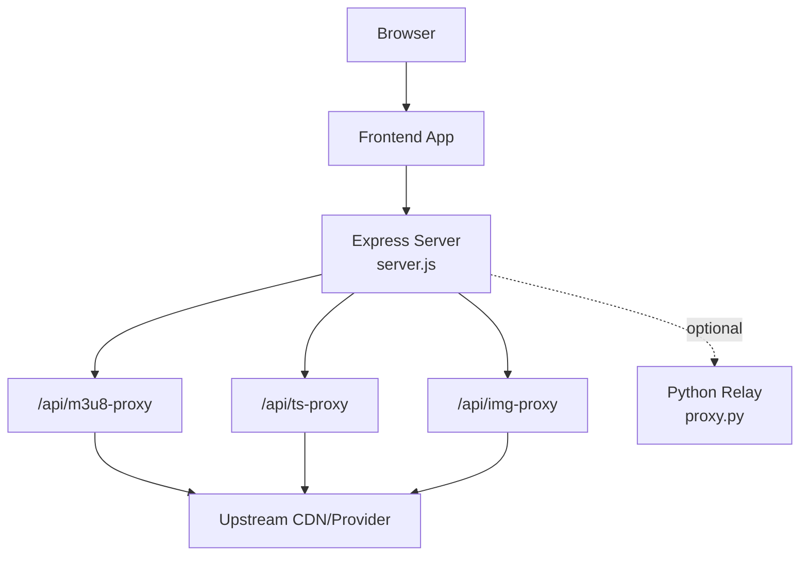
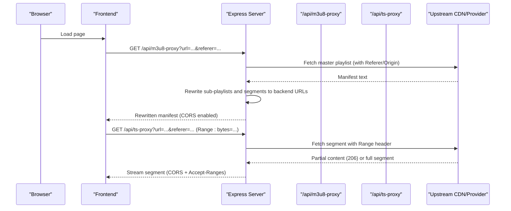
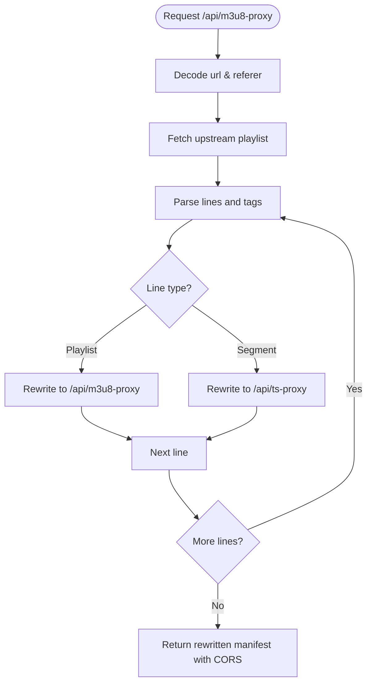
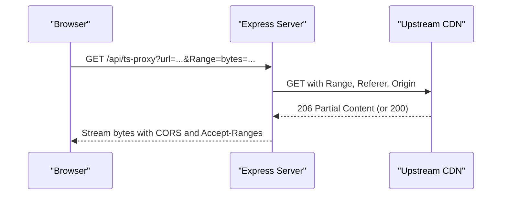
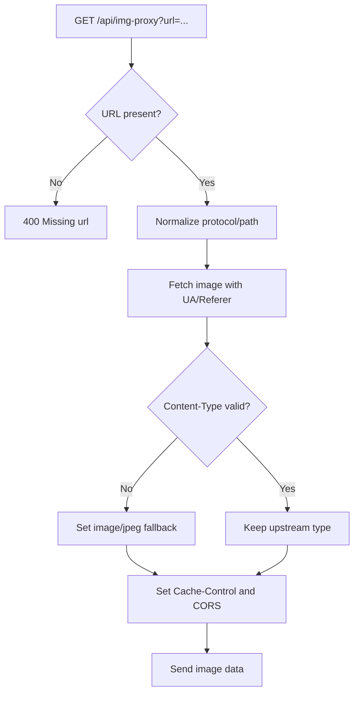
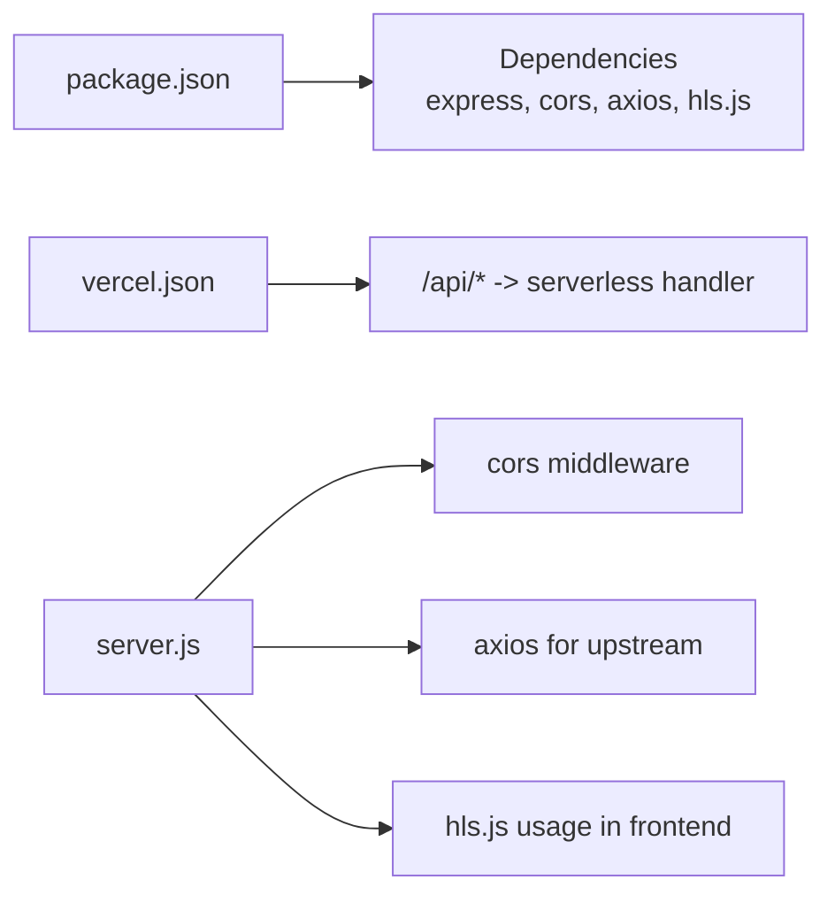

# Streaming Proxy Infrastructure

<cite>
**Referenced Files in This Document**
- [server.js](file://server.js)
- [proxy.py](file://proxy.py)
- [package.json](file://package.json)
- [vercel.json](file://vercel.json)
</cite>

## Table of Contents
1. [Introduction](#introduction)
2. [Project Structure](#project-structure)
3. [Core Components](#core-components)
4. [Architecture Overview](#architecture-overview)
5. [Detailed Component Analysis](#detailed-component-analysis)
6. [Dependency Analysis](#dependency-analysis)
7. [Performance Considerations](#performance-considerations)
8. [Troubleshooting Guide](#troubleshooting-guide)
9. [Conclusion](#conclusion)

## Introduction
This document explains the streaming proxy infrastructure that enables HLS playback and media delivery while bypassing CORS and referrer restrictions. It focuses on:
- The m3u8-proxy endpoint that rewrites HLS playlists to route all subsequent requests through the backend, including sub-playlist recursion and segment URL transformation.
- The ts-proxy endpoint that streams video segments with proper Range header forwarding for efficient byte-range playback.
- The image proxy system that bypasses CORS and hotlink protection for external images.
- Configuration examples, header manipulation patterns, and error handling strategies used across these proxies.

## Project Structure
The streaming proxy logic is implemented in a Node/Express server and complemented by a small Python relay for specific provider needs. Key files:
- server.js: Express application implementing /api/m3u8-proxy, /api/ts-proxy, /api/img-proxy, subtitle proxy, and helper utilities for headers, referers, and upstream fetching.
- proxy.py: A lightweight Python HTTP relay that forwards requests to a target host with required headers (used as an alternative or supplementary relay).
- package.json: Declares dependencies such as express, cors, axios, and hls.js.
- vercel.json: Defines runtime rewrites and headers for deployment environments.

**Diagram sources**
- [server.js:263-345](file://server.js#L263-L345)
- [server.js:354-393](file://server.js#L354-L393)
- [server.js:153-199](file://server.js#L153-L199)
- [proxy.py:1-36](file://proxy.py#L1-L36)

**Section sources**
- [server.js:1-20](file://server.js#L1-L20)
- [proxy.py:1-36](file://proxy.py#L1-L36)
- [package.json:1-45](file://package.json#L1-L45)
- [vercel.json:1-22](file://vercel.json#L1-L22)

## Core Components
- HLS Playlist Rewriter (/api/m3u8-proxy): Fetches the original playlist, normalizes URLs, rewrites sub-playlists and segment references to point back to the backend, and returns a rewritten manifest with CORS enabled.
- Segment Streamer (/api/ts-proxy): Streams raw segments from upstream, forwards Range headers for partial content, and mirrors necessary headers like Accept-Ranges, Content-Type, Content-Length, and Content-Range.
- Image Proxy (/api/img-proxy, /api/manga/image-proxy): Proxies images from external CDNs with appropriate headers and CORS, falling back to redirect when needed.
- Subtitle Proxy (/api/subtitle-proxy): Proxies VTT subtitles with CORS and caching headers.

Key behaviors:
- Referrer and Origin spoofing via streamProxyHeaders and streamProxyReferers to satisfy protected providers.
- Nested playlist recursion: sub-playlists are rewritten to also go through /api/m3u8-proxy.
- Byte-range support: Range header forwarding ensures fast startup and efficient seeking.

**Section sources**
- [server.js:74-148](file://server.js#L74-L148)
- [server.js:263-345](file://server.js#L263-L345)
- [server.js:354-393](file://server.js#L354-L393)
- [server.js:153-199](file://server.js#L153-L199)
- [server.js:235-256](file://server.js#L235-L256)

## Architecture Overview
The architecture centers around a single Express server that acts as a reverse proxy for HLS manifests and segments, plus image and subtitle resources. The frontend only communicates with the backend endpoints; all external calls originate from the server, avoiding browser CORS issues.

**Diagram sources**
- [server.js:263-345](file://server.js#L263-L345)
- [server.js:354-393](file://server.js#L354-L393)

## Detailed Component Analysis

### HLS Playlist Rewriter: /api/m3u8-proxy
Responsibilities:
- Decode and unwrap nested proxy URLs to avoid loops.
- Fetch the original playlist with correct headers and referers.
- Normalize relative and malformed URIs.
- Rewrite sub-playlists to recurse through /api/m3u8-proxy.
- Rewrite segment URIs to route through /api/ts-proxy.
- Return a CORS-enabled manifest.

Processing flow:
- Unwrap previously proxied URLs and handle special relays.
- Build child referer per hop to preserve context for downstream playlists.
- For each line:
  - Handle EXT tags and strip invalid audio track URIs when needed.
  - Detect sub-playlists vs segments and rewrite accordingly.
  - Preserve manifest structure and metadata.

**Diagram sources**
- [server.js:263-345](file://server.js#L263-L345)

**Section sources**
- [server.js:41-70](file://server.js#L41-L70)
- [server.js:263-345](file://server.js#L263-L345)

### Segment Streamer: /api/ts-proxy
Responsibilities:
- Forward Range headers to enable byte-range requests for HLS.
- Stream data directly from upstream to client without buffering the entire file.
- Mirror relevant headers (Accept-Ranges, Content-Type, Content-Length, Content-Range, Content-Encoding).
- Provide CORS headers so browsers can load segments from the backend.

Behavior highlights:
- Uses streamProxyHeaders to set User-Agent, Accept, Referer, Origin, and additional headers for protected hosts.
- Retries with alternate referers for certain providers when encountering transient errors.
- Validates status codes to allow 206 Partial Content.

**Diagram sources**
- [server.js:354-393](file://server.js#L354-L393)

**Section sources**
- [server.js:74-148](file://server.js#L74-L148)
- [server.js:354-393](file://server.js#L354-L393)

### Image Proxy System: /api/img-proxy and /api/manga/image-proxy
Responsibilities:
- Bypass CORS and hotlink protections for images hosted on external domains.
- Normalize protocol-relative or path-only image URLs.
- Set appropriate Content-Type and cache headers.
- Add Access-Control-Allow-Origin to allow cross-origin loads.

Error handling:
- Logs warnings on failures.
- Redirects to the original URL if it starts with http(s), otherwise returns 404.

**Diagram sources**
- [server.js:153-199](file://server.js#L153-L199)

**Section sources**
- [server.js:153-199](file://server.js#L153-L199)

### Subtitle Proxy: /api/subtitle-proxy
Responsibilities:
- Proxy VTT subtitle files from external CDNs.
- Set Content-Type to text/vtt and enable CORS.
- Cache responses for improved performance.

**Section sources**
- [server.js:235-256](file://server.js#L235-L256)

### Python Relay: proxy.py
Purpose:
- Provides a simple HTTP relay to a target host with required headers (Host, User-Agent, Accept).
- Useful when a separate process is needed to avoid port conflicts or to run alongside the Node server.

Usage notes:
- Listens on a configurable port (default 9090) and forwards to https://kisskh.co.
- Disables SSL verification for compatibility with certain providers.

**Section sources**
- [proxy.py:1-36](file://proxy.py#L1-L36)

## Dependency Analysis
- Express server uses cors middleware to allow cross-origin requests globally, plus per-endpoint CORS headers for specific resources.
- Axios is used for upstream requests with custom headers and timeouts.
- HLS.js is a frontend dependency indicating HLS playback expectations.
- Vercel rewrites route /api/* to the serverless handler, ensuring consistent routing in serverless deployments.

**Diagram sources**
- [package.json:14-35](file://package.json#L14-L35)
- [vercel.json:16-20](file://vercel.json#L16-L20)
- [server.js:1-20](file://server.js#L1-L20)

**Section sources**
- [package.json:14-35](file://package.json#L14-L35)
- [vercel.json:16-20](file://vercel.json#L16-L20)
- [server.js:1-20](file://server.js#L1-L20)

## Performance Considerations
- Byte-range streaming: The ts-proxy forwards Range headers to minimize bandwidth and improve startup time by fetching only needed segments.
- Caching: Image proxy sets Cache-Control for reduced repeated downloads; subtitle proxy caches for one hour.
- Header optimization: Avoid sending unnecessary headers (e.g., Accept-Language) to prevent WAF blocks on some providers.
- Retry strategy: For protected hosts, multiple referers are tried to recover from transient errors.

[No sources needed since this section provides general guidance]

## Troubleshooting Guide
Common issues and resolutions:
- Missing url parameter: Both m3u8-proxy and ts-proxy return 400 when url is absent. Ensure the frontend constructs valid URLs with encoded parameters.
- CORS errors: Verify that CORS_ORIGIN is configured appropriately and that endpoints set Access-Control-Allow-Origin.
- Provider blocks: If upstream returns 403/401/429/502, the proxy retries with alternate referers for supported providers. Check logs for recovery messages.
- Malformed URIs: The playlist rewriter handles malformed triple-slash URIs and protocol-relative paths; ensure your source manifests use standard formats where possible.
- SSL verification: Some providers require disabling certificate validation; the server disables TLS verification for scraping scenarios.

Operational tips:
- Use the health endpoint to verify service status, public base URL, and configuration values.
- Monitor logs for “[M3U8-PROXY]”, “[TS-PROXY]”, and “[IMAGE PROXY WARNING]” messages to diagnose failures.

**Section sources**
- [server.js:263-265](file://server.js#L263-L265)
- [server.js:354-356](file://server.js#L354-L356)
- [server.js:189-195](file://server.js#L189-L195)
- [server.js:126-148](file://server.js#L126-L148)
- [server.js:715-735](file://server.js#L715-L735)

## Conclusion
The streaming proxy infrastructure centralizes HLS manifest rewriting, segment streaming, and image/proxy services behind a single backend. By rewriting URLs to route through the server, it avoids CORS and referrer restrictions while preserving essential headers for protected providers. The design supports recursive sub-playlists, efficient byte-range streaming, and robust error handling, making it suitable for diverse streaming scenarios.

[No sources needed since this section summarizes without analyzing specific files]