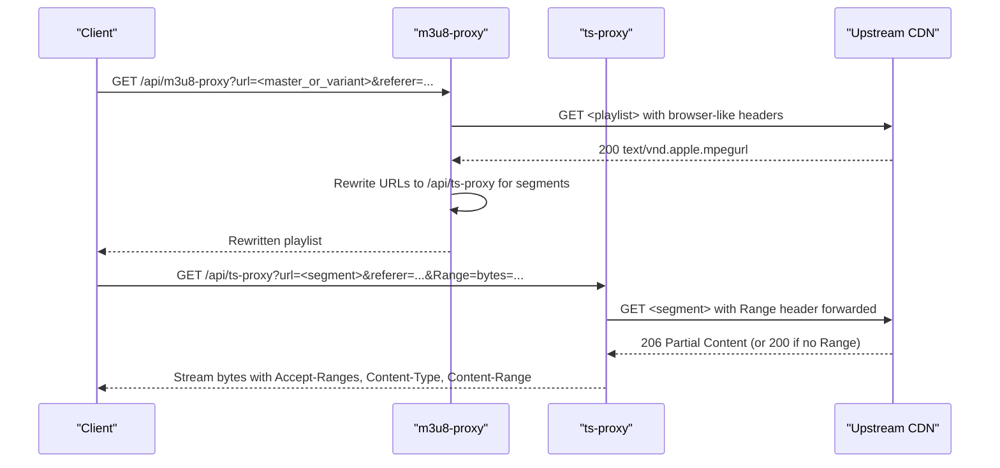
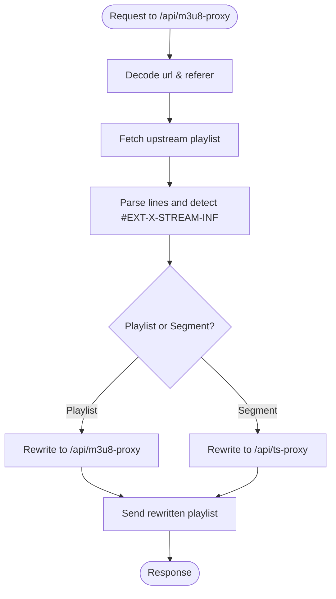
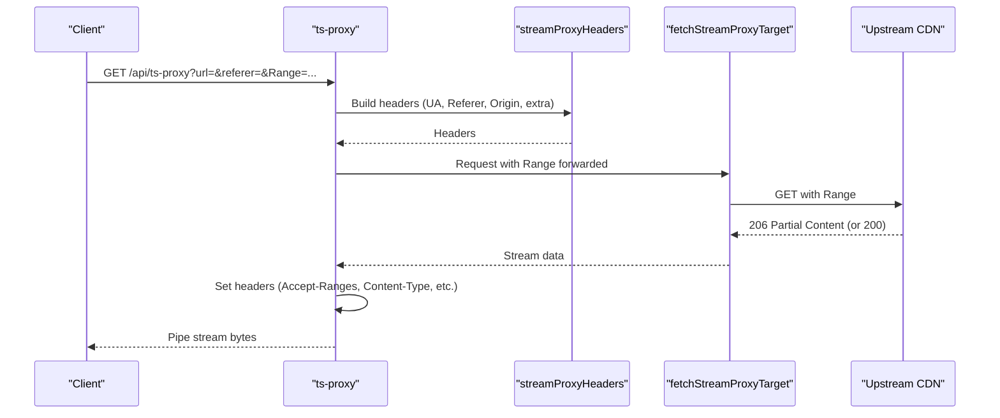
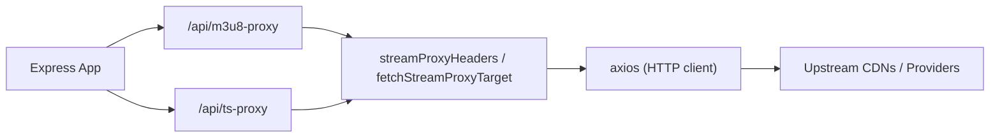

# Video Segment Streaming

<cite>
**Referenced Files in This Document**
- [server.js](file://server.js)
- [proxy.py](file://proxy.py)
</cite>

## Table of Contents
1. [Introduction](#introduction)
2. [Project Structure](#project-structure)
3. [Core Components](#core-components)
4. [Architecture Overview](#architecture-overview)
5. [Detailed Component Analysis](#detailed-component-analysis)
6. [Dependency Analysis](#dependency-analysis)
7. [Performance Considerations](#performance-considerations)
8. [Troubleshooting Guide](#troubleshooting-guide)
9. [Conclusion](#conclusion)

## Introduction
This document explains the video segment streaming system that efficiently delivers HLS segments through a backend proxy. It focuses on the ts-proxy endpoint, which forwards Range headers to support byte-range requests, sets correct MIME types, and streams responses directly from upstream CDNs. It also covers performance optimizations such as partial content support, connection reuse via HTTP keep-alive, timeout management, and error handling for network failures, invalid segments, and rate limiting scenarios. Examples of request/response cycles and debugging techniques are included to help diagnose streaming issues.

## Project Structure
The streaming pipeline is implemented primarily in the Node.js server:
- The m3u8-proxy endpoint rewrites HLS manifests so that all segment URLs point back to the backend’s ts-proxy.
- The ts-proxy endpoint fetches segments from upstream CDNs and streams them back to clients with proper headers and optional Range forwarding.
- A separate Python relay (proxy.py) provides an alternative path for specific providers by relaying HTTPS traffic with custom headers.

```mermaid
graph TB
Client["Browser / Player"] --> M3U8Proxy["/api/m3u8-proxy"]
M3U8Proxy --> UpstreamM3U8["Upstream .m3u8"]
M3U8Proxy --> TSProxy["/api/ts-proxy"]
TSProxy --> UpstreamSegment["Upstream CDN (.ts/.aac/etc.)"]
Client <--|HLS playback| TSProxy
```

**Diagram sources**
- [server.js:263-345](file://server.js#L263-L345)
- [server.js:354-393](file://server.js#L354-L393)

**Section sources**
- [server.js:263-345](file://server.js#L263-L345)
- [server.js:354-393](file://server.js#L354-L393)
- [proxy.py:1-36](file://proxy.py#L1-L36)

## Core Components
- m3u8-proxy: Fetches the master or variant playlist, resolves relative URLs, and rewrites references to use the backend’s proxies. Sub-playlists go through m3u8-proxy; media segments go through ts-proxy.
- ts-proxy: Streams individual segments from upstream CDNs, preserving Range requests and relevant headers like Accept-Ranges, Content-Type, Content-Length, and Content-Range.
- streamProxyHeaders and fetchStreamProxyTarget: Build browser-like headers and handle retries and referer rotation for protected hosts.
- Optional Python relay (proxy.py): Relays requests to a target host with custom headers and SSL settings.

Key responsibilities:
- Correct MIME type handling for playlists and segments.
- Byte-range forwarding for efficient startup and seeking.
- Streaming response piping to avoid buffering entire files.
- Robust error handling and timeouts.

**Section sources**
- [server.js:74-148](file://server.js#L74-L148)
- [server.js:263-345](file://server.js#L263-L345)
- [server.js:354-393](file://server.js#L354-L393)
- [proxy.py:1-36](file://proxy.py#L1-L36)

## Architecture Overview
The HLS playback flow uses two proxy endpoints to ensure compatibility with protected CDNs and to optimize delivery:



**Diagram sources**
- [server.js:263-345](file://server.js#L263-L345)
- [server.js:354-393](file://server.js#L354-L393)

## Detailed Component Analysis

### m3u8-proxy Endpoint
- Purpose: Fetch the HLS manifest, resolve relative URLs, and rewrite segment and sub-playlist URLs to route through the backend proxies.
- Behavior:
  - Decodes URL parameters and computes a child referer for downstream requests.
  - Rewrites URIs inside manifest lines to either /api/m3u8-proxy (for playlists) or /api/ts-proxy (for segments).
  - Handles malformed triple-slash URIs and skips dummy audio track URIs when necessary.
  - Sets Content-Type to application/vnd.apple.mpegurl and enables CORS.
- Error handling: Logs errors and returns 502 with message on failure.



**Diagram sources**
- [server.js:263-345](file://server.js#L263-L345)

**Section sources**
- [server.js:263-345](file://server.js#L263-L345)

### ts-proxy Endpoint
- Purpose: Stream individual media segments from upstream CDNs while supporting byte-range requests for fast startup and seeking.
- Behavior:
  - Forwards Range header to upstream when present.
  - Uses streamProxyHeaders to set browser-like User-Agent, Referer, Origin, and additional headers required by protected hosts.
  - Calls fetchStreamProxyTarget with responseType 'stream' and a 30-second timeout.
  - Copies relevant upstream headers (Accept-Ranges, Content-Type, Content-Length, Content-Range, Content-Encoding) and writes status code.
  - Pipes upstream data directly to the client response.
- Error handling: Logs errors and responds with 502 if headers have not been sent.



**Diagram sources**
- [server.js:354-393](file://server.js#L354-L393)
- [server.js:74-148](file://server.js#L74-L148)

**Section sources**
- [server.js:354-393](file://server.js#L354-L393)
- [server.js:74-148](file://server.js#L74-L148)

### streamProxyHeaders and fetchStreamProxyTarget
- streamProxyHeaders:
  - Adds a realistic User-Agent to avoid WAF blocks.
  - Adds Accept, Referer, Origin, and provider-specific headers (e.g., Sec-Fetch-* for protected hosts).
- fetchStreamProxyTarget:
  - Tries multiple referers for certain hosts (e.g., streamindia.co.in).
  - Applies NetMirror token cookies when needed.
  - Retries on specific statuses (401, 403, 429, 502) for protected hosts.
  - Returns Axios response with appropriate headers and data stream.

**Section sources**
- [server.js:74-148](file://server.js#L74-L148)

### Python Relay (proxy.py)
- Purpose: Provide a simple HTTPS relay to a target host with custom headers and disabled certificate verification for environments where direct access is blocked.
- Behavior:
  - Listens on a configurable port and proxies GET requests to https://{TARGET}{path}.
  - Forwards Host, User-Agent, and Accept headers.
  - Copies upstream headers except transfer-encoding and connection.
  - Writes full response body and handles exceptions with 502.

**Section sources**
- [proxy.py:1-36](file://proxy.py#L1-L36)

## Dependency Analysis
- Express app routes:
  - /api/m3u8-proxy depends on fetchStreamProxyTarget and streamProxyHeaders.
  - /api/ts-proxy depends on fetchStreamProxyTarget and streamProxyHeaders.
- External dependencies:
  - axios for HTTP requests with streaming and timeouts.
  - cheerio used elsewhere in the server but not in the streaming endpoints.
- Environment configuration:
  - KISSKH_BASE, ENCDEC_BASE, HIVETOONS_BASE influence base URLs.
  - PORT controls server listening port.
  - PROXY_PORT controls Python relay port.



**Diagram sources**
- [server.js:263-345](file://server.js#L263-L345)
- [server.js:354-393](file://server.js#L354-L393)
- [server.js:74-148](file://server.js#L74-L148)

**Section sources**
- [server.js:263-345](file://server.js#L263-L345)
- [server.js:354-393](file://server.js#L354-L393)
- [server.js:74-148](file://server.js#L74-L148)

## Performance Considerations
- Partial content support:
  - Range header forwarding ensures only requested byte ranges are fetched, enabling near-instant startup and efficient seeking.
  - Accept-Ranges, Content-Length, and Content-Range headers are passed through to clients.
- Connection reuse:
  - Axios maintains HTTP keep-alive connections by default, reducing handshake overhead for repeated segment requests.
- Timeout management:
  - ts-proxy sets a 30-second timeout per segment request to prevent hanging connections.
  - Other endpoints use shorter timeouts (e.g., 12 seconds) for metadata and page fetching.
- Streaming response piping:
  - Data is streamed directly from upstream to client without buffering entire files, minimizing memory usage and latency.
- Header optimization:
  - Browser-like headers and referer rotation improve success rates with protected CDNs.
  - Selective header forwarding avoids unnecessary payload bloat.

[No sources needed since this section provides general guidance]

## Troubleshooting Guide
Common issues and diagnostics:
- Missing url parameter:
  - Both m3u8-proxy and ts-proxy return 400 if url is missing. Verify query parameters in client requests.
- Network failures:
  - Errors are logged and 502 responses are returned. Check logs for upstream connectivity issues and adjust timeouts if necessary.
- Invalid segments:
  - If upstream returns non-2xx or empty content, the proxy will respond with 502. Validate upstream URLs and referers.
- Rate limiting:
  - Protected hosts may return 429. The system retries with different referers and waits briefly before failing over. Monitor logs for retry patterns.
- CORS issues:
  - Ensure Access-Control-Allow-Origin is set appropriately. The proxies include CORS headers for cross-origin playback.
- Debugging steps:
  - Inspect the rewritten playlist to confirm segment URLs point to /api/ts-proxy.
  - Use browser DevTools Network tab to verify Range requests and 206 responses.
  - Check server logs for “[TS-PROXY]” and “[M3U8-PROXY]” messages to trace errors.

**Section sources**
- [server.js:263-345](file://server.js#L263-L345)
- [server.js:354-393](file://server.js#L354-L393)

## Conclusion
The streaming system leverages two focused proxy endpoints to deliver HLS content efficiently and reliably. The m3u8-proxy rewrites manifests to route segments through ts-proxy, which supports byte-range requests, preserves critical headers, and streams data directly from upstream CDNs. Together with robust error handling, timeouts, and connection reuse, these components provide fast startup times, smooth seeking, and resilience against network and provider constraints.

[No sources needed since this section summarizes without analyzing specific files]