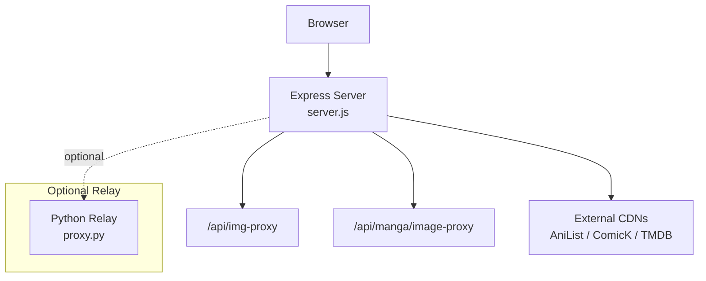
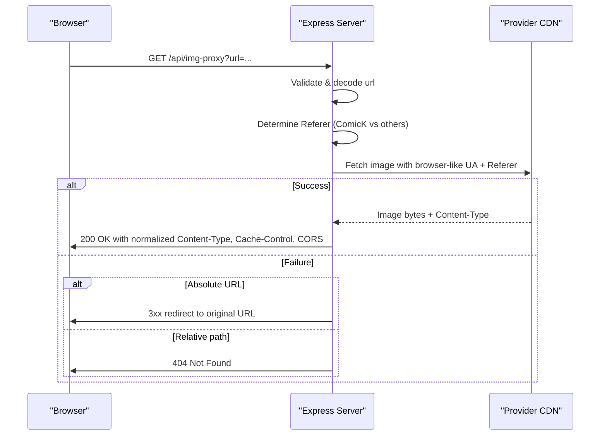
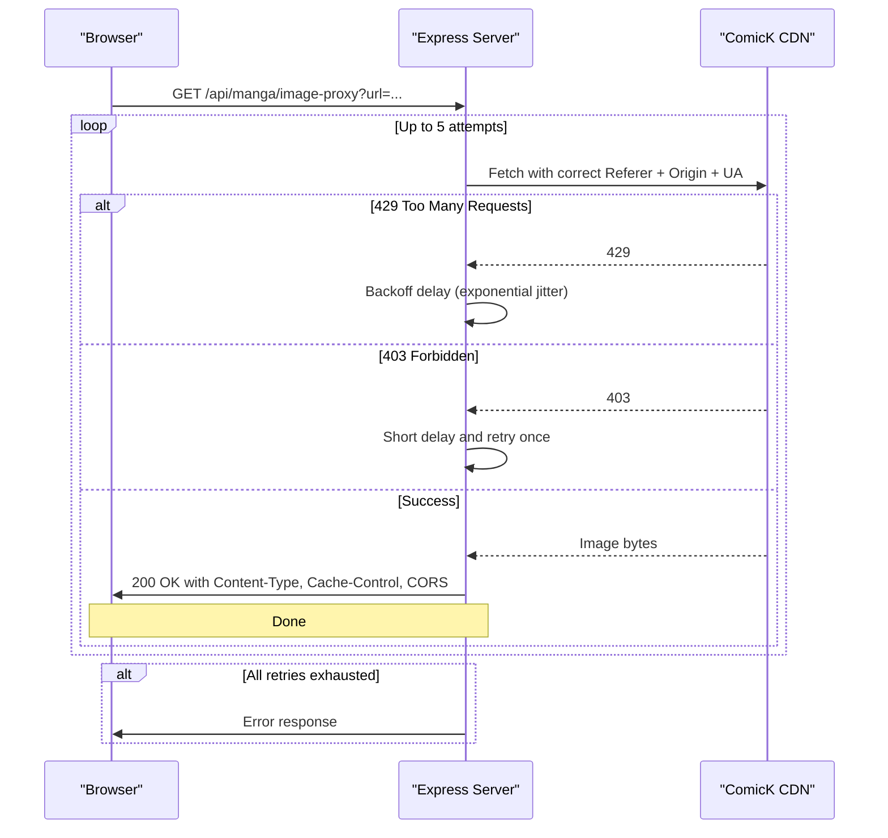
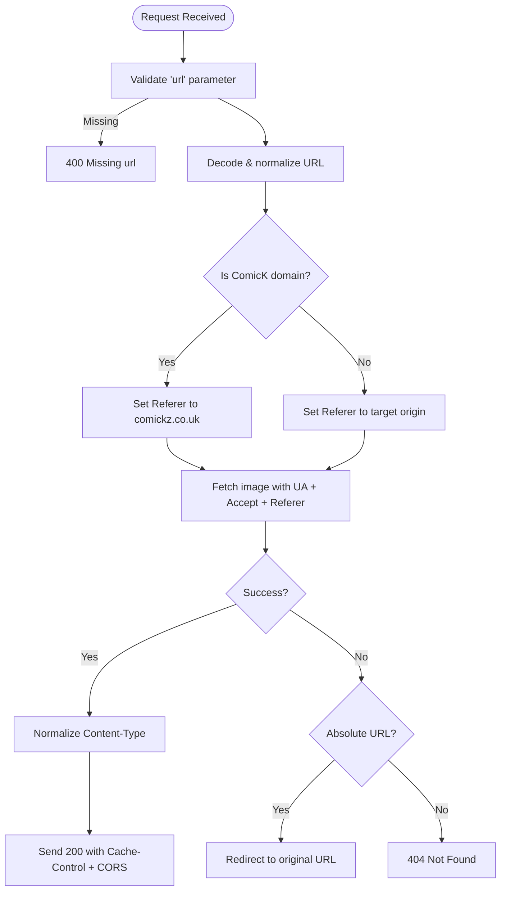
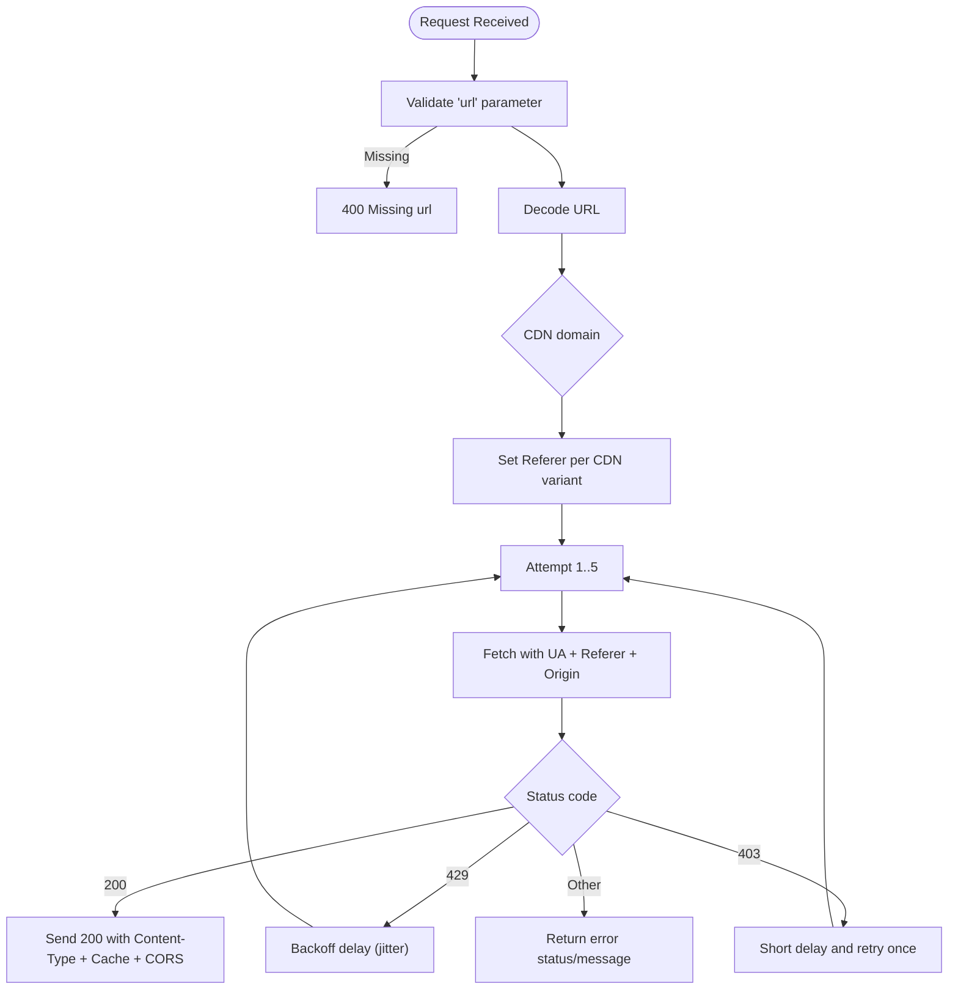
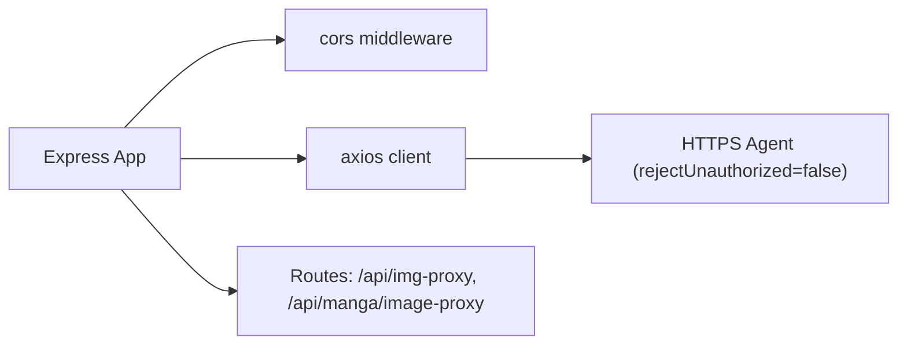

# Image Proxy Service

<cite>
**Referenced Files in This Document**
- [server.js](file://server.js)
- [proxy.py](file://proxy.py)
- [package.json](file://package.json)
</cite>

## Table of Contents
1. [Introduction](#introduction)
2. [Project Structure](#project-structure)
3. [Core Components](#core-components)
4. [Architecture Overview](#architecture-overview)
5. [Detailed Component Analysis](#detailed-component-analysis)
6. [Dependency Analysis](#dependency-analysis)
7. [Performance Considerations](#performance-considerations)
8. [Troubleshooting Guide](#troubleshooting-guide)
9. [Conclusion](#conclusion)

## Introduction
This document explains the image proxy service that bypasses CORS restrictions and hotlink protection for external image sources. It focuses on two endpoints:
- GET /api/img-proxy
- GET /api/manga/image-proxy

These endpoints fetch images from third-party providers (AniList, ComicK, TMDB), set appropriate Referer headers, normalize content types, cache responses, and provide fallback behavior when direct fetching fails. The service also includes a separate Python-based relay for another domain, which is documented for completeness.

## Project Structure
The image proxy functionality is implemented in the Node/Express server. A small Python HTTP server provides a separate relay to a specific target domain.

**Diagram sources**
- [server.js:152-199](file://server.js#L152-L199)
- [server.js:2878-2930](file://server.js#L2878-L2930)
- [proxy.py:1-36](file://proxy.py#L1-L36)

**Section sources**
- [server.js:152-199](file://server.js#L152-L199)
- [server.js:2878-2930](file://server.js#L2878-L2930)
- [proxy.py:1-36](file://proxy.py#L1-L36)

## Core Components
- Express routes for image proxies:
  - /api/img-proxy: generic image proxy with provider-aware Referer handling and content-type normalization.
  - /api/manga/image-proxy: manga-focused proxy with retry/backoff for rate-limited or blocked requests.
- Provider-specific logic:
  - Detects ComicK domains and sets a known good Referer.
  - Uses safe origin extraction for other providers.
- Response transformation:
  - Sets Content-Type safely, caches responses, and enables CORS.
- Fallback mechanisms:
  - Redirects to original URL if proxy fetch fails for absolute URLs; otherwise returns 404.
  - Manga proxy retries on 429/403 with backoff.

**Section sources**
- [server.js:152-199](file://server.js#L152-L199)
- [server.js:2878-2930](file://server.js#L2878-L2930)

## Architecture Overview
The image proxy acts as an intermediary between the browser and external image CDNs. It normalizes headers, handles provider quirks, and ensures consistent responses.

**Diagram sources**
- [server.js:152-199](file://server.js#L152-L199)

**Diagram sources**
- [server.js:2878-2930](file://server.js#L2878-L2930)

## Detailed Component Analysis

### Endpoint: GET /api/img-proxy
- Purpose: Generic image proxy that bypasses CORS and hotlink protections for multiple providers.
- Input:
  - query.url: URL-encoded image URL. Supports absolute http/https or protocol-relative // paths. Relative paths are rewritten to a default ComicK CDN base.
- Processing:
  - Decodes URL and normalizes it to an absolute URL.
  - Detects ComicK domains and sets a valid Referer; otherwise derives Referer from the target URL’s origin.
  - Fetches image with a realistic User-Agent and Accept header for modern image formats.
  - Normalizes Content-Type if upstream reports octet-stream or HTML.
  - Sets caching and CORS headers.
- Output:
  - On success: 200 with image bytes and normalized headers.
  - On failure: If the target URL is absolute, redirects to the original URL; otherwise returns 404.

**Diagram sources**
- [server.js:152-199](file://server.js#L152-L199)

**Section sources**
- [server.js:152-199](file://server.js#L152-L199)

### Endpoint: GET /api/manga/image-proxy
- Purpose: Manga-focused image proxy with resilience against rate limiting and hotlink blocks.
- Input:
  - query.url: URL-encoded image URL.
- Processing:
  - Decodes URL.
  - Determines Referer based on ComicK CDN variants.
  - Attempts up to 5 fetches with exponential backoff on 429 and one retry on 403.
  - Sets Content-Type from upstream or defaults to webp, caches for 24 hours, and enables CORS.
- Output:
  - On success: 200 with image bytes and headers.
  - On failure after retries: Returns error status/message.

**Diagram sources**
- [server.js:2878-2930](file://server.js#L2878-L2930)

**Section sources**
- [server.js:2878-2930](file://server.js#L2878-L2930)

### Provider-Specific Handling
- AniList:
  - Images from AniList are proxied through the same handlers by passing their URLs to the proxy endpoints. The server sets a Referer derived from the target origin unless it matches ComicK domains.
- ComicK:
  - Special-cased Referer selection to trusted origins (comickz.co.uk or comick.io depending on CDN).
  - Manga proxy uses Origin header alongside Referer to satisfy strict hotlink checks.
- TMDB:
  - TMDB images can be proxied via the generic handler. The server sets a browser-like User-Agent and Accept header to avoid rejections.

Note: The proxy does not implement user-agent rotation; it uses a fixed Chrome User-Agent string.

**Section sources**
- [server.js:152-199](file://server.js#L152-L199)
- [server.js:2878-2930](file://server.js#L2878-L2930)

### Fallback Mechanisms
- /api/img-proxy:
  - If fetching fails and the target URL is absolute, the server issues a redirect to the original URL so the client can attempt direct access.
  - For relative paths rewritten to a default CDN base, a 404 is returned on failure.
- /api/manga/image-proxy:
  - Retries on 429 with exponential backoff and jitter.
  - Retries once on 403 to account for transient Referer mismatches.
  - After exhausting retries, returns an error response.

**Section sources**
- [server.js:152-199](file://server.js#L152-L199)
- [server.js:2878-2930](file://server.js#L2878-L2930)

### Additional Python Relay (Separate Service)
- A minimal Python HTTP server relays requests to a specific target domain with custom Host and User-Agent headers. It runs on a separate port and is independent of the Express image proxy endpoints.

**Section sources**
- [proxy.py:1-36](file://proxy.py#L1-L36)

## Dependency Analysis
- Express server dependencies relevant to image proxying:
  - axios for outbound HTTP requests with custom headers and timeouts.
  - cors middleware to enable cross-origin responses.
  - https agent configured to disable certificate verification for scraping scenarios.
- Environment configuration:
  - PORT controls server listening port.
  - CORS_ORIGIN configures allowed origins.

**Diagram sources**
- [server.js:1-20](file://server.js#L1-L20)
- [server.js:201-203](file://server.js#L201-L203)

**Section sources**
- [package.json:14-35](file://package.json#L14-L35)
- [server.js:1-20](file://server.js#L1-L20)
- [server.js:201-203](file://server.js#L201-L203)

## Performance Considerations
- Caching:
  - Both endpoints set Cache-Control: public, max-age=86400 to leverage browser and intermediate caches.
- Timeouts:
  - Image fetches use a 12-second timeout to prevent hanging connections.
- Streaming and Range support:
  - While not used by image proxies, the server demonstrates efficient streaming and Range forwarding for video segments, indicating a pattern that could be adopted for large images if needed.
- Bandwidth:
  - Proxied images are served directly without recompression; consider adding size limits and format validation to reduce abuse.

[No sources needed since this section provides general guidance]

## Troubleshooting Guide
Common issues and diagnostics:
- Missing url parameter:
  - Both endpoints validate the presence of the url query parameter and return 400 if missing.
- Hotlink protection (403):
  - Manga proxy retries once on 403; ensure Referer and Origin match expected provider domains.
- Rate limiting (429):
  - Manga proxy implements exponential backoff with jitter; monitor logs for repeated throttling.
- Content-Type mismatch:
  - Generic proxy normalizes octet-stream or HTML responses to image/jpeg; verify upstream headers if unexpected content appears.
- Redirect fallback:
  - If proxy fetch fails for absolute URLs, clients may receive a redirect; inspect network tab to see final destination.

**Section sources**
- [server.js:152-199](file://server.js#L152-L199)
- [server.js:2878-2930](file://server.js#L2878-L2930)

## Conclusion
The image proxy service provides robust, provider-aware image fetching with CORS bypass and hotlink protection handling. It supports both generic and manga-specific workflows, includes caching and resilient retry strategies, and offers clear fallback behaviors. For production hardening, consider adding explicit rate limiting, request validation, and logging/analytics to protect against abuse and monitor performance.

[No sources needed since this section summarizes without analyzing specific files]