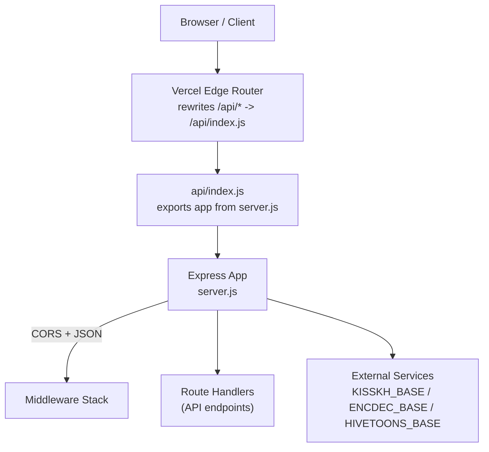
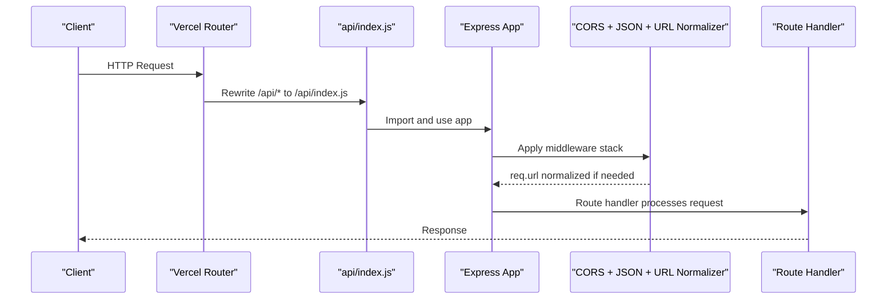

# Server Configuration & Middleware

<cite>
**Referenced Files in This Document**
- [server.js](file://server.js)
- [api/index.js](file://api/index.js)
- [api/runtime-config.js](file://api/runtime-config.js)
- [vercel.json](file://vercel.json)
- [proxy.py](file://proxy.py)
</cite>

## Table of Contents
1. [Introduction](#introduction)
2. [Project Structure](#project-structure)
3. [Core Components](#core-components)
4. [Architecture Overview](#architecture-overview)
5. [Detailed Component Analysis](#detailed-component-analysis)
6. [Dependency Analysis](#dependency-analysis)
7. [Performance Considerations](#performance-considerations)
8. [Troubleshooting Guide](#troubleshooting-guide)
9. [Conclusion](#conclusion)
10. [Appendices](#appendices)

## Introduction
This document explains the Express.js server configuration and middleware setup for the backend. It covers:
- Server initialization, CORS, JSON parsing, and Vercel URL normalization
- Trust proxy and public host detection behind reverse proxies (ngrok, Cloudflare)
- Environment variables for external service endpoints (KISSKH_BASE, ENCDEC_BASE, HIVETOONS_BASE)
- Middleware stack order and custom middleware functions
- Error handling strategies
- How to extend the middleware chain and configure different deployment environments

## Project Structure
The backend is a single Express application that also serves as a Vercel serverless function via an API entrypoint. A runtime config endpoint exposes environment-driven base URLs to the frontend.

**Diagram sources**
- [vercel.json:16-20](file://vercel.json#L16-L20)
- [api/index.js:1-3](file://api/index.js#L1-L3)
- [server.js:10-28](file://server.js#L10-L28)

**Section sources**
- [vercel.json:1-22](file://vercel.json#L1-L22)
- [api/index.js:1-3](file://api/index.js#L1-L3)
- [server.js:10-28](file://server.js#L10-L28)

## Core Components
- Express app instance with trust proxy enabled
- CORS middleware configured via environment variable
- JSON body parser
- Custom request URL normalizer for Vercel serverless routing
- Public host resolver for correct protocol/host behind reverse proxies
- External service base endpoints loaded from environment variables

Key behaviors:
- Trust proxy is enabled so X-Forwarded-* headers are respected
- CORS origin defaults to wildcard but can be restricted via environment variable
- All requests not starting with /api/ are rewritten to /api/... for Vercel serverless compatibility
- Public host is derived from forwarded headers or local protocol/host

**Section sources**
- [server.js:10-18](file://server.js#L10-L18)
- [server.js:20-28](file://server.js#L20-L28)
- [server.js:30-36](file://server.js#L30-L36)

## Architecture Overview
The request lifecycle flows through a small set of core middleware before reaching route handlers. The architecture supports both standalone Node execution and Vercel serverless deployments.

**Diagram sources**
- [vercel.json:16-20](file://vercel.json#L16-L20)
- [api/index.js:1-3](file://api/index.js#L1-L3)
- [server.js:20-28](file://server.js#L20-L28)

## Detailed Component Analysis

### Server Initialization and Trust Proxy
- The Express app is created and trust proxy is set to true so that when running behind ngrok, Cloudflare, or other reverse proxies, the real protocol and host are read from forwarded headers.
- The port is taken from environment variables with a default fallback.

Operational notes:
- When deployed behind a reverse proxy, ensure the proxy forwards x-forwarded-proto and host correctly.
- Trust proxy must remain enabled for accurate publicHost resolution.

**Section sources**
- [server.js:10-13](file://server.js#L10-L13)

### CORS Configuration
- CORS is applied early in the middleware stack using an environment variable to control allowed origins.
- Default allows all origins; restrict to specific domains in production by setting the corresponding environment variable.

Best practices:
- In production, set a strict origin list to prevent unintended cross-origin access.
- Keep CORS before any authentication or rate-limiting middleware that might depend on origin validation.

**Section sources**
- [server.js:19](file://server.js#L19)

### JSON Parsing
- JSON body parsing is enabled globally.
- A second JSON parser registration appears later in the file; this is redundant and can be removed to avoid confusion.

Recommendation:
- Keep a single global JSON parser near the top of the stack. Remove duplicate registrations.

**Section sources**
- [server.js:20](file://server.js#L20)
- [server.js:150](file://server.js#L150)

### Vercel Serverless URL Normalization
- A custom middleware rewrites incoming paths that do not start with /api/ to /api/<path>. This ensures routes work under Vercel’s serverless routing where all API calls should be under /api/.

Behavior:
- Requests like /movies/home become /api/movies/home internally.
- The root /api path is preserved without rewriting.

Extensibility:
- Add additional rewrite rules here if you introduce new top-level namespaces.

**Section sources**
- [server.js:22-28](file://server.js#L22-L28)

### Public Host Detection Behind Reverse Proxies
- A helper computes the public base URL used by clients to reach the server. It reads x-forwarded-proto and host headers first, then falls back to local protocol and host.
- Used when generating absolute URLs for HLS manifests and segments so browsers always call back to the backend instead of directly to upstream CDNs.

Behind ngrok/Cloudflare:
- Ensure your reverse proxy sets x-forwarded-proto and host appropriately.
- If multiple proxies are chained, only the first token of x-forwarded-proto is used.

**Section sources**
- [server.js:30-36](file://server.js#L30-L36)

### Environment Variables for External Service Endpoints
- KISSKH_BASE: Base URL for drama content provider. Defaults to a known domain if not set.
- ENCDEC_BASE: Base URL for encryption/decryption helper used by drama endpoints. Defaults to a known domain if not set.
- HIVETOONS_BASE: Base URL for manga/webtoon provider. Defaults to a known domain if not set.

Deployment guidance:
- For hosted deployments where providers block cloud IPs, point these bases to a trusted relay (for example, a phone-based tunnel).
- Use separate values per environment (dev/staging/prod) via your platform’s environment management.

**Section sources**
- [server.js:15-17](file://server.js#L15-L17)
- [server.js:1620-1626](file://server.js#L1620-L1626)

### Middleware Stack Order
Current order:
1. CORS
2. JSON body parser
3. Vercel URL normalizer (custom)
4. Route handlers (including image, subtitle, HLS proxies, drama/anime/movie APIs)

Important implications:
- CORS runs before route logic, ensuring preflight and cross-origin responses are handled early.
- JSON parsing is available to all routes.
- URL normalization ensures consistent routing under Vercel.

Where to add new middleware:
- Place logging, rate limiting, or security headers after CORS and JSON parsing but before route handlers.
- Place authentication or authorization after URL normalization if it depends on normalized paths.

**Section sources**
- [server.js:19-28](file://server.js#L19-L28)

### Custom Middleware Functions
- URL normalizer: Rewrites non-/api paths to /api/<path> for Vercel serverless compatibility.
- Public host resolver: Builds the client-facing base URL from forwarded headers or local context.

Error handling strategy:
- Route handlers return appropriate status codes and messages on failure.
- Network errors from upstream services result in 502 responses with error details.
- Missing parameters yield 400 responses.

Examples in code:
- Image proxy returns 400 when url is missing and 404 when not found.
- Subtitle proxy returns 502 on fetch failures.
- HLS proxies return 502 on errors.

**Section sources**
- [server.js:22-28](file://server.js#L22-L28)
- [server.js:30-36](file://server.js#L30-L36)
- [server.js:152-199](file://server.js#L152-L199)
- [server.js:235-256](file://server.js#L235-L256)
- [server.js:263-345](file://server.js#L263-L345)
- [server.js:354-393](file://server.js#L354-L393)

### Extending the Middleware Chain
To add features such as request logging, rate limiting, or security headers:
- Insert after CORS and JSON parsing.
- Example pattern:
  - Logging: log method, path, and timing.
  - Rate limiting: limit per IP or user agent.
  - Security headers: set HSTS, CSP, X-Frame-Options.

Placement considerations:
- If you need to modify req.url or headers, place before route handlers.
- If you rely on parsed bodies, place after JSON parsing.

**Section sources**
- [server.js:19-28](file://server.js#L19-L28)

### Configuring Different Deployment Environments
- Local development:
  - Run the server directly; it listens on PORT or a default port.
  - No special routing required.
- Vercel serverless:
  - All API routes must be under /api/.
  - The URL normalizer handles rewriting automatically.
  - Runtime config endpoint provides dynamic API_BASE to the frontend.

Environment variables:
- Set CORS_ORIGIN to restrict allowed origins.
- Set KISSKH_BASE, ENCDEC_BASE, HIVETOONS_BASE to point at trusted relays if needed.
- Configure API_BASE or related variables via your platform’s dashboard for runtime config.

**Section sources**
- [vercel.json:16-20](file://vercel.json#L16-L20)
- [api/runtime-config.js:4-24](file://api/runtime-config.js#L4-L24)
- [server.js:15-17](file://server.js#L15-L17)
- [server.js:3610-3629](file://server.js#L3610-L3629)

## Dependency Analysis
The server depends on:
- Express for routing and middleware
- CORS for cross-origin configuration
- Axios for outbound HTTP requests to upstream providers
- Cheerio for HTML scraping where needed
- HTTPS agent configuration to handle TLS settings for scraping

Runtime behavior:
- Trust proxy enables reading forwarded headers.
- Vercel rewrites funnel all API traffic through a single entrypoint.

Potential coupling:
- Heavy reliance on upstream provider availability and headers.
- Some providers require specific User-Agent and Referer headers.

Mitigations:
- Robust error handling and retries in specific flows.
- Caching layers for catalog and stream data to reduce upstream load.

**Section sources**
- [server.js:1-8](file://server.js#L1-L8)
- [server.js:201-203](file://server.js#L201-L203)
- [vercel.json:16-20](file://vercel.json#L16-L20)

## Performance Considerations
- Use a single global JSON parser to avoid duplication.
- Keep CORS and JSON parsing at the top for minimal overhead.
- Leverage caching for expensive operations (catalogs, episode lists, stream tokens).
- Forward Range headers for segment streaming to enable byte-range playback and faster startup.
- Avoid unnecessary redirects; prefer proxied endpoints for media.

[No sources needed since this section provides general guidance]

## Troubleshooting Guide
Common issues and resolutions:
- CORS errors:
  - Ensure CORS_ORIGIN is set appropriately for your frontend domain.
  - Verify that the browser’s request includes the correct Origin header.
- 400 Bad Request on proxies:
  - Check that required query parameters (like url) are provided and properly encoded.
- 502 Bad Gateway:
  - Upstream provider unreachable or blocked; check logs and consider using a trusted relay for KISSKH_BASE/ENCDEC_BASE.
- Incorrect public URL in HLS:
  - Confirm trust proxy is enabled and reverse proxy forwards x-forwarded-proto and host.
- Vercel routing mismatches:
  - Ensure all API routes are under /api/; the normalizer will rewrite non-/api paths automatically.

**Section sources**
- [server.js:152-199](file://server.js#L152-L199)
- [server.js:235-256](file://server.js#L235-L256)
- [server.js:263-345](file://server.js#L263-L345)
- [server.js:354-393](file://server.js#L354-L393)
- [server.js:1620-1626](file://server.js#L1620-L1626)

## Conclusion
The server uses a concise middleware stack tailored for modern deployments:
- CORS and JSON parsing are applied early
- A custom URL normalizer ensures compatibility with Vercel serverless routing
- Trust proxy and public host detection support reverse proxies like ngrok and Cloudflare
- External service endpoints are configurable via environment variables
- Error handling is explicit across route handlers

For further customization, add middleware after CORS and JSON parsing, and before route handlers, while respecting the existing URL normalization and proxy-aware host resolution.

[No sources needed since this section summarizes without analyzing specific files]

## Appendices

### Vercel Routing and Runtime Config
- Rewrites direct /api/* requests to the Express app entrypoint.
- A runtime config endpoint exposes the effective API_BASE to the frontend based on environment variables and static config.

**Section sources**
- [vercel.json:16-20](file://vercel.json#L16-L20)
- [api/index.js:1-3](file://api/index.js#L1-L3)
- [api/runtime-config.js:4-24](file://api/runtime-config.js#L4-L24)

### Optional Relay for Provider Access
- A Python script demonstrates a simple relay to bypass provider IP blocks by routing requests through a trusted IP.
- Useful when deploying to platforms whose IPs are blocked by providers like KissKH.

**Section sources**
- [proxy.py:1-35](file://proxy.py#L1-L35)