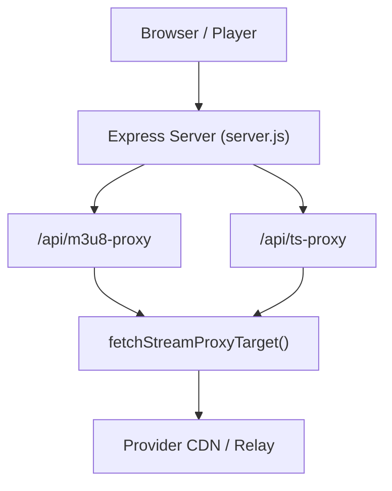
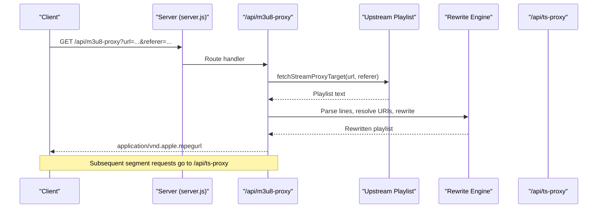
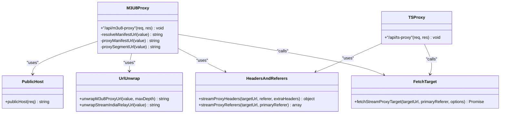
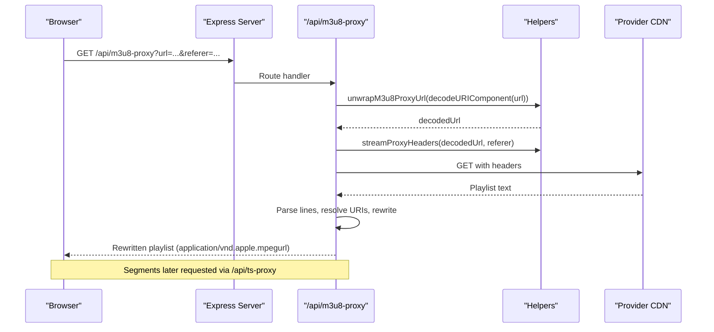
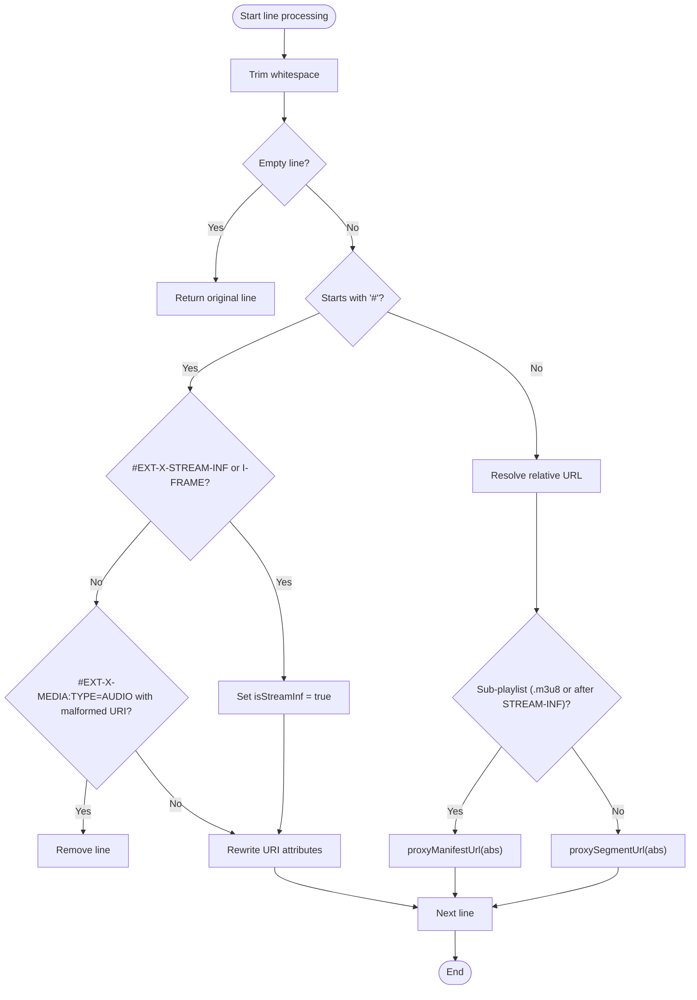
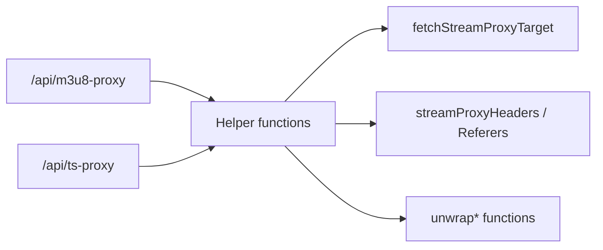

# M3U8 Manifest Proxy

<cite>
**Referenced Files in This Document**
- [server.js](file://server.js)
- [README.md](file://README.md)
</cite>

## Table of Contents
1. [Introduction](#introduction)
2. [Project Structure](#project-structure)
3. [Core Components](#core-components)
4. [Architecture Overview](#architecture-overview)
5. [Detailed Component Analysis](#detailed-component-analysis)
6. [Dependency Analysis](#dependency-analysis)
7. [Performance Considerations](#performance-considerations)
8. [Troubleshooting Guide](#troubleshooting-guide)
9. [Conclusion](#conclusion)

## Introduction
This document explains the M3U8 manifest proxy endpoint (/api/m3u8-proxy) and how it rewrites HLS playlists to work reliably across multiple streaming providers. It covers:
- How relative URLs are resolved and rewritten
- Handling nested playlists and variant streams
- Provider-specific URL transformations (e.g., NetMirror malformed URIs, StreamIndia relay bypass)
- Parsing logic for #EXT-X-STREAM-INF tags, audio track URIs, and segment references
- The URL rewriting functions resolveManifestUrl, proxyManifestUrl, and proxySegmentUrl
- Fallback mechanisms when requests fail

The proxy ensures that browsers only communicate with the backend’s public URL, avoiding CORS issues and mixed-content problems while preserving provider-specific headers like Referer and Origin.

## Project Structure
The M3U8 proxy is implemented as a single Express route in server.js, supported by helper functions for header construction, referer rotation, token handling for specific providers, and URL unwrapping. The README documents the high-level purpose of the proxy endpoints and their role in HLS playback.

**Diagram sources**
- [server.js:263-345](file://server.js#L263-L345)
- [server.js:354-393](file://server.js#L354-L393)
- [server.js:108-148](file://server.js#L108-L148)

**Section sources**
- [server.js:263-393](file://server.js#L263-L393)
- [README.md:144-149](file://README.md#L144-L149)

## Core Components
- /api/m3u8-proxy: Fetches the master or sub-playlist from the upstream provider, parses and rewrites all URLs, and returns a new playlist where every reference goes through either /api/m3u8-proxy (for playlists) or /api/ts-proxy (for segments).
- /api/ts-proxy: Streams raw media segments back to the client, forwarding Range headers for efficient byte-range playback.
- Helper utilities:
  - publicHost(req): Derives the public base URL used in rewritten links.
  - unwrapM3u8ProxyUrl(value): Unwraps nested proxy URLs to avoid loops.
  - unwrapStreamIndiaRelayUrl(value): Bypasses a known failing relay by extracting the direct URL.
  - streamProxyHeaders(targetUrl, referer, extraHeaders): Builds provider-aware request headers.
  - streamProxyReferers(targetUrl, primaryReferer): Rotates referers for resilient fetching.
  - fetchStreamProxyTarget(targetUrl, primaryReferer, options): Performs the actual HTTP GET with retries and provider-specific headers.

**Section sources**
- [server.js:32-70](file://server.js#L32-L70)
- [server.js:74-148](file://server.js#L74-L148)
- [server.js:263-393](file://server.js#L263-L393)

## Architecture Overview
The proxy operates in two phases per request:
1. Fetch phase: Retrieve the original playlist or segment from the upstream using provider-aware headers and referer rotation.
2. Rewrite phase: For playlists, parse line-by-line, detect tags and URIs, resolve relative URLs, apply provider-specific fixes, and rewrite them to go through the backend proxies.

**Diagram sources**
- [server.js:263-345](file://server.js#L263-L345)
- [server.js:354-393](file://server.js#L354-L393)
- [server.js:108-148](file://server.js#L108-L148)

## Detailed Component Analysis

### Endpoint: /api/m3u8-proxy
Responsibilities:
- Accepts url and referer query parameters
- Unwraps any nested proxy URLs to prevent loops
- Fetches the playlist text from the upstream with appropriate headers
- Computes childReferer based on the decoded URL origin
- Parses and rewrites each line:
  - Detects #EXT-X-STREAM-INF and #EXT-X-I-FRAME-STREAM-INF to mark the next line as a variant stream
  - Handles #EXT-X-MEDIA:TYPE=AUDIO entries; removes malformed dummy audio URIs so players use multiplexed audio
  - Rewrites URI values inside tags to go through proxy endpoints
  - Resolves relative URLs against the current playlist base
  - Routes sub-playlists (.m3u8 or following a STREAM-INF tag) to /api/m3u8-proxy
  - Routes segments to /api/ts-proxy
- Returns the rewritten playlist with proper content type and CORS headers

Key behaviors:
- Nested playlist recursion: Each sub-playlist is proxied again via /api/m3u8-proxy, ensuring consistent rewriting at every level.
- Segment streaming: All non-playlist resources are streamed via /api/ts-proxy, which forwards Range headers for efficient seeking.

Error handling:
- On failure, logs error details and responds with 502 status and message.

**Section sources**
- [server.js:263-345](file://server.js#L263-L345)

### URL Resolution and Rewriting Functions
- resolveManifestUrl(value):
  - Normalizes protocol-relative URLs (//example.com/path)
  - Fixes malformed triple-slash URIs (https:///files/...) by prepending the origin
  - Resolves relative paths against the current playlist URL
  - Applies provider-specific unwrapping (e.g., StreamIndia relay bypass)
- proxyManifestUrl(value):
  - Wraps the resolved URL into /api/m3u8-proxy with the childReferer set to the origin of the decoded URL
- proxySegmentUrl(value):
  - Wraps the resolved URL into /api/ts-proxy with the childReferer set to the origin of the decoded URL

These functions ensure that regardless of how the upstream formats its URLs, they are normalized and routed through the backend proxies.

**Section sources**
- [server.js:281-300](file://server.js#L281-L300)

### HLS Parsing Logic
Line processing highlights:
- Tag detection:
  - #EXT-X-STREAM-INF and #EXT-X-I-FRAME-STREAM-INF set a flag indicating the next line is a variant stream URL
  - #EXT-X-MEDIA:TYPE=AUDIO entries are handled specially; malformed dummy URIs are removed to fall back to multiplexed audio
- URI rewriting:
  - Any URI attribute in tags is rewritten to go through the appropriate proxy
  - data: URIs are preserved without rewriting
- Relative URL resolution:
  - Non-tag lines are treated as resource references and resolved against the current playlist base
  - If a line is a sub-playlist (detected by .m3u8 extension or being after a STREAM-INF tag), it is proxied via /api/m3u8-proxy
  - Otherwise, it is proxied via /api/ts-proxy

This approach supports nested playlists, audio tracks, and variant streams consistently.

**Section sources**
- [server.js:304-336](file://server.js#L304-L336)

### Provider-Specific Transformations
- NetMirror malformed URIs:
  - Triple-slash URIs like https:///files/... are corrected by prepending the origin
  - Protocol-relative URLs are handled to ensure absolute URLs are formed before resolution
- StreamIndia relay bypass:
  - Requests to proxy.streamindia.co.in/proxy are unwrapped to the direct URL parameter if present, avoiding a known failing relay
- Header and referer rotation:
  - For protected HLS domains (e.g., streamindia.co.in and certain CDNs), additional headers like Sec-Fetch-Dest, Sec-Fetch-Mode, and Sec-Fetch-Site are included
  - Referer rotation tries multiple candidates to recover from 401/403/429/502 errors

**Section sources**
- [server.js:57-70](file://server.js#L57-L70)
- [server.js:74-106](file://server.js#L74-L106)
- [server.js:108-148](file://server.js#L108-L148)
- [server.js:281-295](file://server.js#L281-L295)

### TS Segment Proxy: /api/ts-proxy
Responsibilities:
- Accepts url and referer query parameters
- Decodes and validates inputs
- Forwards Range headers to enable byte-range streaming
- Proxies the upstream response with appropriate headers (Accept-Ranges, Content-Type, Content-Length, Content-Range)
- Streams data directly to the client

This ensures fast startup and efficient seeking for HLS clients.

**Section sources**
- [server.js:354-393](file://server.js#L354-L393)

### Class Diagram: Core Functions and Relationships

**Diagram sources**
- [server.js:32-70](file://server.js#L32-L70)
- [server.js:74-148](file://server.js#L74-L148)
- [server.js:263-393](file://server.js#L263-L393)

### Sequence Diagram: Request Flow Through the Proxy

**Diagram sources**
- [server.js:263-345](file://server.js#L263-L345)
- [server.js:74-148](file://server.js#L74-L148)

### Flowchart: Manifest Line Processing

**Diagram sources**
- [server.js:304-336](file://server.js#L304-L336)

## Dependency Analysis
- The m3u8-proxy depends on:
  - publicHost for constructing backend URLs
  - unwrapM3u8ProxyUrl to prevent nested proxy loops
  - unwrapStreamIndiaRelayUrl to bypass a failing relay
  - streamProxyHeaders and streamProxyReferers for robust upstream requests
  - fetchStreamProxyTarget for making HTTP requests with retries and provider-specific headers
- The ts-proxy depends on:
  - fetchStreamProxyTarget for streaming segments
  - Header forwarding for Range and other relevant headers

Coupling is cohesive within server.js; dependencies are localized to helper functions and the Express routes.

**Diagram sources**
- [server.js:32-70](file://server.js#L32-L70)
- [server.js:74-148](file://server.js#L74-L148)
- [server.js:263-393](file://server.js#L263-L393)

**Section sources**
- [server.js:32-148](file://server.js#L32-L148)
- [server.js:263-393](file://server.js#L263-L393)

## Performance Considerations
- Byte-range streaming: The ts-proxy forwards Range headers, enabling HLS clients to fetch only needed segments quickly.
- Referer rotation: Reduces failures due to provider restrictions, improving reliability without excessive retries.
- Token caching for NetMirror: Avoids repeated authentication overhead by caching tokens with expiration.
- Minimal parsing overhead: Line-by-line processing avoids heavy parsing libraries, keeping CPU usage low.

[No sources needed since this section provides general guidance]

## Troubleshooting Guide
Common issues and mitigations:
- Missing url parameter: The endpoint returns 400 with an error message.
- Upstream failures: The proxy logs errors and returns 502 with the error message.
- Provider blocks: Referer rotation and additional headers help bypass common restrictions.
- Malformed URIs: NetMirror triple-slash URIs are automatically fixed; StreamIndia relay URLs are unwrapped to direct URLs.
- Audio track issues: Malformed dummy audio URIs are removed so players can use multiplexed audio.

Operational tips:
- Ensure the public host is correctly derived behind proxies (X-Forwarded-* headers).
- Verify referer values match expected origins for protected HLS domains.
- Monitor logs for recovery messages when alternate referers succeed.

**Section sources**
- [server.js:263-345](file://server.js#L263-L345)
- [server.js:354-393](file://server.js#L354-L393)
- [server.js:74-148](file://server.js#L74-L148)

## Conclusion
The /api/m3u8-proxy endpoint provides a robust, provider-agnostic HLS manifest proxy that normalizes URLs, handles nested playlists, and adapts to provider-specific quirks. Combined with /api/ts-proxy for segment streaming, it enables reliable playback across diverse sources while maintaining performance and compatibility with HLS clients.

[No sources needed since this section summarizes without analyzing specific files]