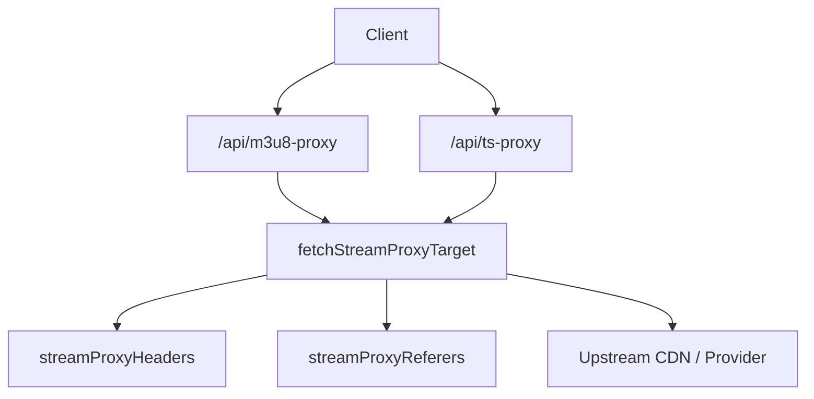
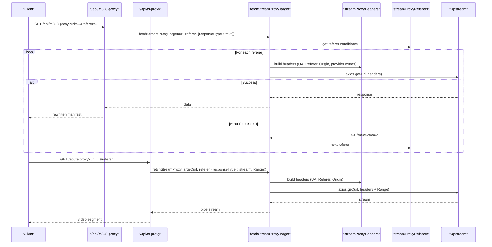
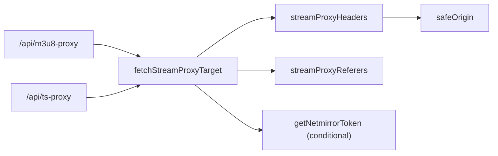

# Stream Headers Management

<cite>
**Referenced Files in This Document**
- [server.js](file://server.js)
- [NETMIRROR_RESEARCH.md](file://research on reverse engineering/NETMIRROR_RESEARCH.md)
</cite>

## Table of Contents
1. [Introduction](#introduction)
2. [Project Structure](#project-structure)
3. [Core Components](#core-components)
4. [Architecture Overview](#architecture-overview)
5. [Detailed Component Analysis](#detailed-component-analysis)
6. [Dependency Analysis](#dependency-analysis)
7. [Performance Considerations](#performance-considerations)
8. [Troubleshooting Guide](#troubleshooting-guide)
9. [Conclusion](#conclusion)

## Introduction
This document explains the stream headers management system that handles HTTP headers for different streaming providers. It focuses on:
- streamProxyHeaders: sets User-Agent rotation, Referer/Origin handling, and provider-specific headers (e.g., StreamIndia protected HLS).
- streamProxyReferers: generates multiple referer candidates per provider to improve success rates.
- fetchStreamProxyTarget: implements retry logic with different referers and handles provider-specific authentication tokens (e.g., NetMirror token fetching).

It also provides examples of header configurations for various services and a troubleshooting guide for common authentication issues.

## Project Structure
The stream proxying logic is implemented in the server-side Express application. The key functions live in a single server file and are used by the M3U8 and TS proxy endpoints to fetch upstream content with correct headers and retries.

**Diagram sources**
- [server.js:263-345](file://server.js#L263-L345)
- [server.js:354-393](file://server.js#L354-L393)
- [server.js:108-148](file://server.js#L108-L148)
- [server.js:74-106](file://server.js#L74-L106)

**Section sources**
- [server.js:74-148](file://server.js#L74-L148)
- [server.js:263-393](file://server.js#L263-L393)

## Core Components
- streamProxyHeaders(targetUrl, referer, extraHeaders): Builds a robust header set for upstream requests. It always sends a realistic browser User-Agent, avoids problematic headers like Accept-Language for certain CDNs, adds StreamIndia-specific Sec-Fetch-* headers when needed, and sets Referer and Origin from the provided referer.
- streamProxyReferers(targetUrl, primaryReferer): Returns an ordered list of referer candidates. For StreamIndia targets, it includes several known working referers to increase success probability.
- fetchStreamProxyTarget(targetUrl, primaryReferer, options): Performs the actual request with retry logic across referers. For NetMirror targets, it obtains and attaches an authentication token via getNetmirrorToken before retrying.

Key behaviors:
- User-Agent rotation: Uses a consistent browser-like UA to avoid WAF blocks.
- Referer/Origin handling: Derives Origin safely from Referer; supports provider-specific fallbacks.
- Provider-specific requirements: Adds extra headers for StreamIndia protected HLS; injects NetMirror cookies and headers when targeting NetMirror domains.
- Retry strategy: Iterates through referer candidates and retries on specific error codes for protected streams.

**Section sources**
- [server.js:74-106](file://server.js#L74-L106)
- [server.js:108-148](file://server.js#L108-L148)

## Architecture Overview
The proxy endpoints orchestrate header generation and retries to reliably fetch manifests and segments from diverse providers.

**Diagram sources**
- [server.js:263-345](file://server.js#L263-L345)
- [server.js:354-393](file://server.js#L354-L393)
- [server.js:108-148](file://server.js#L108-L148)
- [server.js:74-106](file://server.js#L74-L106)

## Detailed Component Analysis

### streamProxyHeaders
Responsibilities:
- Always include a realistic browser User-Agent to bypass WAFs that block default library UAs.
- Avoid sending Accept-Language for certain CDNs that reject it.
- Add StreamIndia-specific headers (Sec-Fetch-Dest, Sec-Fetch-Mode, Sec-Fetch-Site) when the target URL indicates protected HLS.
- Set Referer and Origin based on the provided referer using a safe origin extractor.

Provider notes:
- Works for general CDNs and providers requiring browser-like headers.
- For StreamIndia, additional fetch metadata headers are included automatically when detected.

**Section sources**
- [server.js:74-92](file://server.js#L74-L92)
- [server.js:205-211](file://server.js#L205-L211)

### streamProxyReferers
Responsibilities:
- Start with the primary referer passed by the caller.
- For StreamIndia targets, append multiple known working referers to maximize success rate.
- Deduplicate and filter out invalid entries.

Behavior:
- Returns a deterministic order: primary first, then provider-specific candidates.
- Ensures at least one valid referer is always present.

**Section sources**
- [server.js:94-106](file://server.js#L94-L106)

### fetchStreamProxyTarget
Responsibilities:
- Build provider-specific headers and attach them to the request.
- For NetMirror targets, obtain an authentication token and inject cookies and headers required by the service.
- Iterate over referer candidates returned by streamProxyReferers and retry until success or exhaustion.
- On protected errors (e.g., 401/403/429/502) for StreamIndia, continue trying other referers.

NetMirror authentication flow:
- Detects NetMirror domains and calls getNetmirrorToken to retrieve a session token.
- Attaches Cookie (including t_hash_t), a mobile-like User-Agent, and X-Requested-With header.
- Logs warnings if token fetch fails but continues without it.

Retry logic:
- Loops through referers and catches errors.
- Retries only for protected failures on StreamIndia URLs; otherwise throws immediately.
- Returns the first successful response.

**Section sources**
- [server.js:108-148](file://server.js#L108-L148)
- [server.js:1696-1741](file://server.js#L1696-L1741)

### getNetmirrorToken
Responsibilities:
- Obtain a session token from the NetMirror verification endpoint.
- Bypasses client-side challenges by sending a random UUID where expected.
- Extracts the t_hash_t cookie from the response and caches it with an expiry window.
- Reuses cached token until near-expiry to minimize network calls.

Notes:
- Token lifetime is long; cache refresh happens lazily when expired.
- Errors during token retrieval are logged and propagated to callers.

**Section sources**
- [server.js:1696-1741](file://server.js#L1696-L1741)
- [NETMIRROR_RESEARCH.md:240-314](file://research on reverse engineering/NETMIRROR_RESEARCH.md#L240-L314)

### Proxy Endpoints Using These Functions
- /api/m3u8-proxy: Fetches and rewrites HLS manifests, replacing internal URLs with proxied endpoints while preserving referer context for nested hops.
- /api/ts-proxy: Streams video segments with Range header forwarding to support efficient byte-range playback.

Both endpoints rely on streamProxyHeaders and fetchStreamProxyTarget to ensure reliable upstream access.

**Section sources**
- [server.js:263-345](file://server.js#L263-L345)
- [server.js:354-393](file://server.js#L354-L393)

## Dependency Analysis

**Diagram sources**
- [server.js:263-345](file://server.js#L263-L345)
- [server.js:354-393](file://server.js#L354-L393)
- [server.js:108-148](file://server.js#L108-L148)
- [server.js:74-106](file://server.js#L74-L106)
- [server.js:205-211](file://server.js#L205-L211)
- [server.js:1696-1741](file://server.js#L1696-L1741)

**Section sources**
- [server.js:74-148](file://server.js#L74-L148)
- [server.js:205-211](file://server.js#L205-L211)
- [server.js:263-393](file://server.js#L263-L393)
- [server.js:1696-1741](file://server.js#L1696-L1741)

## Performance Considerations
- Use of Range headers in segment streaming prevents full-file downloads and accelerates startup.
- Token caching for NetMirror reduces repeated authentication overhead.
- Referer fallbacks reduce failed attempts by quickly rotating to alternative origins.
- Avoid sending unnecessary headers (e.g., Accept-Language) for providers that block them.

[No sources needed since this section provides general guidance]

## Troubleshooting Guide
Common issues and resolutions:
- 403 Forbidden due to User-Agent: Ensure a realistic browser User-Agent is sent; avoid library defaults.
- 403 due to Accept-Language: Do not send Accept-Language for certain CDNs; the implementation omits it for those cases.
- StreamIndia protected HLS failures: The system automatically adds Sec-Fetch-* headers and tries multiple referers; verify referer configuration and ensure protected HLS detection triggers.
- NetMirror authentication failures: Confirm token retrieval succeeds; check logs for token fetch errors and ensure domain and environment variables are correct. If token expires, the system will attempt to refresh on subsequent calls.
- Rate limiting or temporary blocks: The retry logic cycles through referers; if persistent, consider adding backoff or reducing request frequency.

Operational tips:
- Monitor logs for recovery messages indicating a successful fallback referer.
- Validate that m3u8 and ts proxies rewrite URLs correctly and preserve referer context for nested playlists.
- Keep NetMirror base URL updated if the domain rotates.

**Section sources**
- [server.js:74-92](file://server.js#L74-L92)
- [server.js:108-148](file://server.js#L108-L148)
- [server.js:1696-1741](file://server.js#L1696-L1741)
- [server.js:263-393](file://server.js#L263-L393)

## Conclusion
The stream headers management system centralizes provider-specific header construction, referer rotation, and authentication token handling to reliably fetch HLS manifests and segments. By combining realistic browser headers, targeted provider extras, and robust retry logic, it adapts to diverse upstream protections and improves streaming reliability across providers like StreamIndia and NetMirror.

[No sources needed since this section summarizes without analyzing specific files]