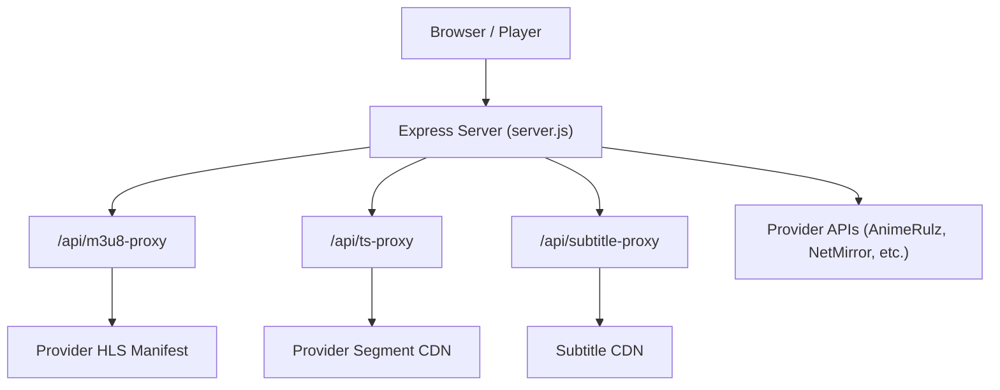
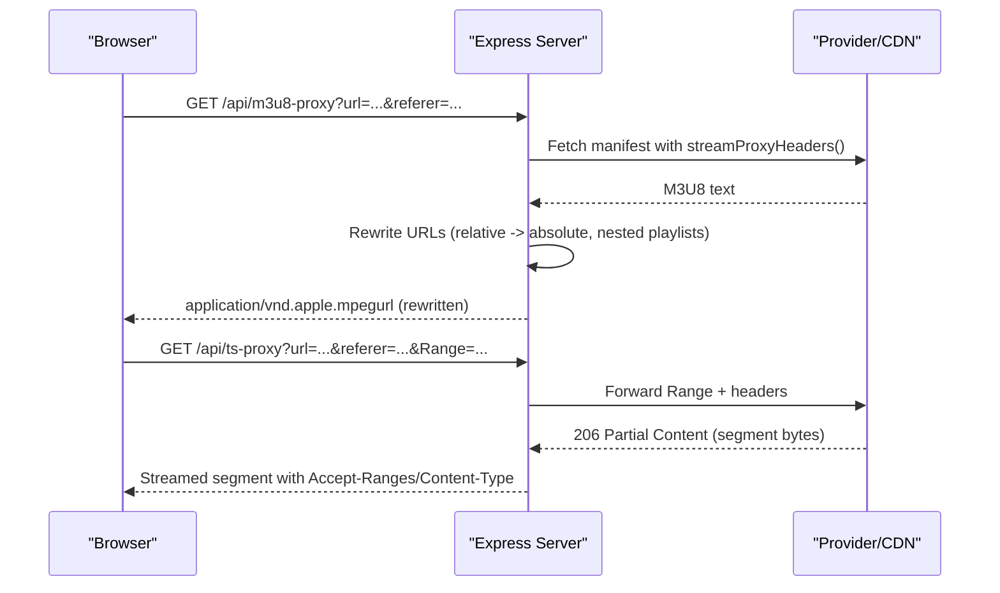
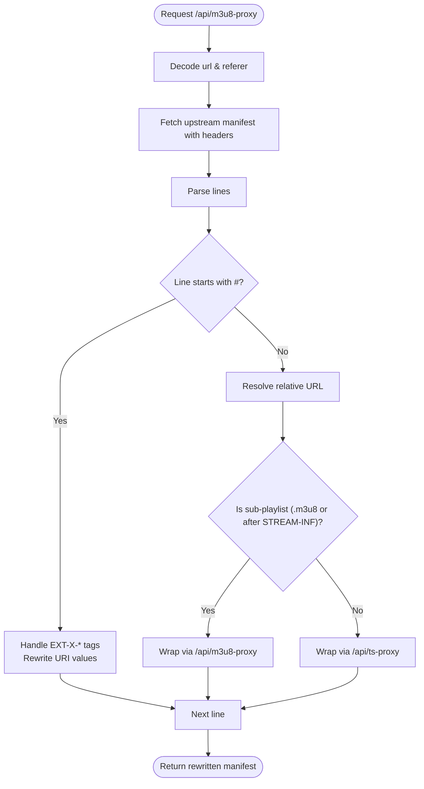
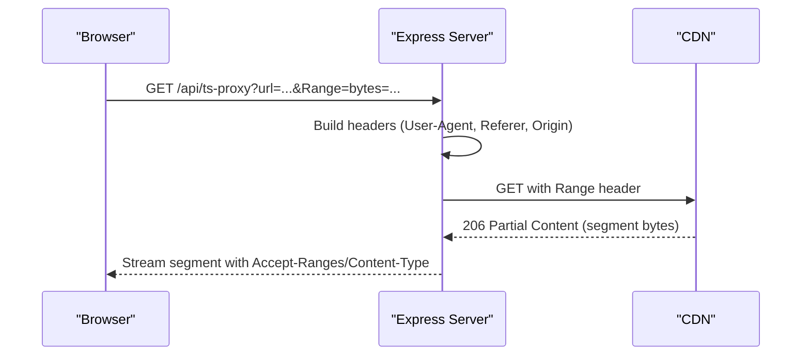
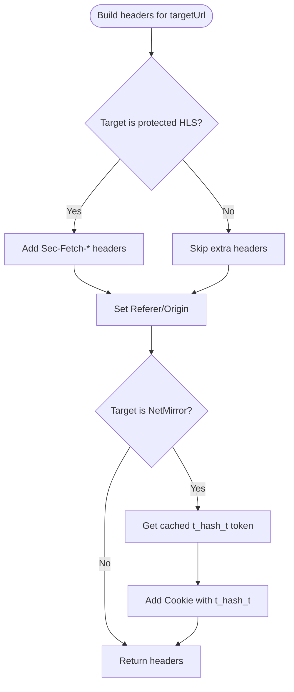
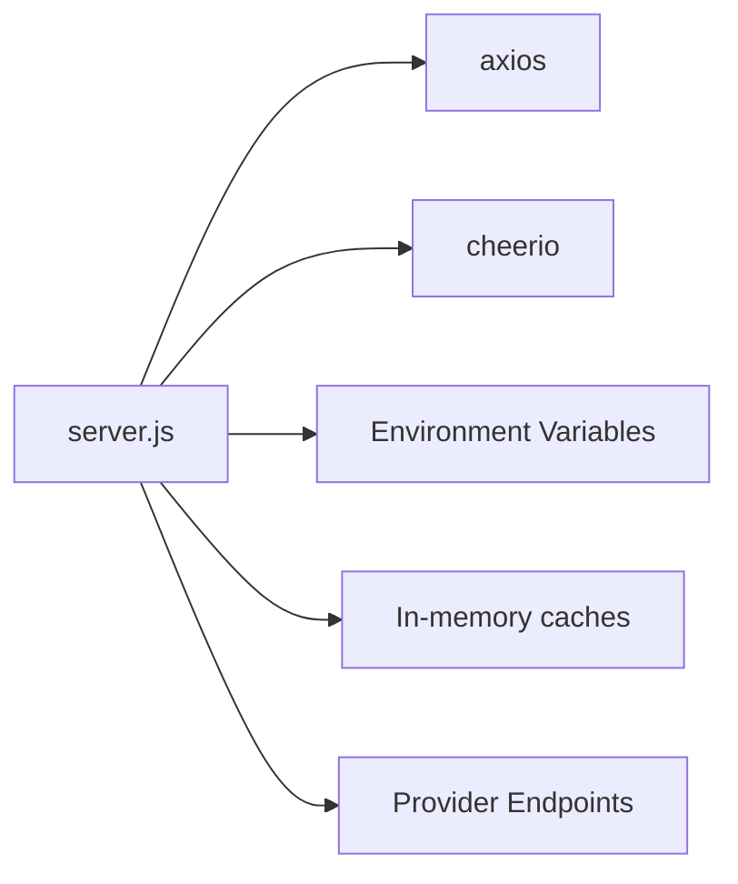

# Streaming Proxy Services

<cite>
**Referenced Files in This Document**
- [server.js](file://server.js)
- [proxy.py](file://proxy.py)
</cite>

## Table of Contents
1. [Introduction](#introduction)
2. [Project Structure](#project-structure)
3. [Core Components](#core-components)
4. [Architecture Overview](#architecture-overview)
5. [Detailed Component Analysis](#detailed-component-analysis)
6. [Dependency Analysis](#dependency-analysis)
7. [Performance Considerations](#performance-considerations)
8. [Troubleshooting Guide](#troubleshooting-guide)
9. [Conclusion](#conclusion)

## Introduction
This document explains the streaming proxy services that enable HLS video playback and content protection by relaying and rewriting media manifests, segments, and subtitles through a backend server. It focuses on:
- The M3U8 manifest proxy endpoint for playlist rewriting, relative URL resolution, and nested playlist handling.
- The TS segment proxy with Range header forwarding for efficient byte-range requests.
- The subtitle proxy for VTT file serving.
- Stream proxy headers management including User-Agent rotation, Referer/Origin handling, and provider-specific requirements.
- Examples of how different streaming providers are handled (StreamIndia, NetMirror) and fallback mechanisms for failed requests.

## Project Structure
The streaming proxies are implemented in the Node.js Express server and a small Python relay used for specific provider needs. Key files:
- server.js: Implements all streaming proxy endpoints, header management, provider integrations, and fallback logic.
- proxy.py: A lightweight HTTP relay to a target host for specific use cases.

**Diagram sources**
- [server.js:235-390](file://server.js#L235-L390)

**Section sources**
- [server.js:1-20](file://server.js#L1-L20)
- [proxy.py:1-36](file://proxy.py#L1-L36)

## Core Components
- M3U8 Manifest Proxy (/api/m3u8-proxy): Fetches the upstream HLS master or variant playlist, rewrites all referenced URLs to go through the backend, resolves relative paths, handles nested playlists, and sets appropriate CORS and content-type headers.
- TS Segment Proxy (/api/ts-proxy): Streams raw media segments from upstream CDNs while preserving Range requests for efficient seeking and startup.
- Subtitle Proxy (/api/subtitle-proxy): Proxies VTT subtitle files with CORS enabled and caching headers.
- Stream Proxy Headers Management: Centralized header building with browser-like User-Agent, Referer/Origin, and provider-specific extras; includes referer rotation and token injection for protected providers.
- Provider Integrations and Fallbacks: Handles StreamIndia’s protected HLS flow and NetMirror’s token-based access; retries with alternate referers and provider-specific headers when needed.

**Section sources**
- [server.js:235-390](file://server.js#L235-L390)
- [server.js:74-148](file://server.js#L74-L148)
- [server.js:1700-1776](file://server.js#L1700-L1776)

## Architecture Overview
The streaming pipeline ensures that browsers only communicate with the backend, which then talks to external providers and CDNs with the correct headers and authentication.

**Diagram sources**
- [server.js:263-345](file://server.js#L263-L345)
- [server.js:354-390](file://server.js#L354-L390)

## Detailed Component Analysis

### M3U8 Manifest Proxy (/api/m3u8-proxy)
Responsibilities:
- Fetches the upstream HLS manifest using provider-aware headers and referers.
- Rewrites all referenced resources so they route through the backend:
  - Sub-playlists (.m3u8) are proxied via /api/m3u8-proxy again.
  - Segments (.ts, .aac, etc.) are proxied via /api/ts-proxy.
- Resolves relative URLs against the manifest origin and fixes malformed URIs (e.g., triple-slash).
- Skips known-broken relays (e.g., StreamIndia’s proxy.streamindia.co.in) and unwraps direct URLs when possible.
- Sets CORS and content-type headers for HLS playback.

Key behaviors:
- Nested playlist handling: Each child playlist is wrapped back into /api/m3u8-proxy with its own referer derived from the parent playlist’s origin.
- Relative URL resolution: Uses URL constructor to resolve relative paths against the manifest base.
- Malformed URI fixes: Normalizes protocol-relative and triple-slash URIs.
- Error handling: Returns 502 with error message if upstream fetch fails.

**Diagram sources**
- [server.js:263-345](file://server.js#L263-L345)

**Section sources**
- [server.js:263-345](file://server.js#L263-L345)

### TS Segment Proxy (/api/ts-proxy)
Responsibilities:
- Streams raw media segments from upstream CDNs.
- Forwards Range headers to support byte-range requests for fast startup and seeking.
- Passes through relevant headers (Accept-Ranges, Content-Type, Content-Length, Content-Range, Content-Encoding).
- Uses provider-aware headers and referers; supports retry with alternate referers for protected streams.

Important details:
- Range forwarding: Critical for HLS.js byte-range manifests to avoid downloading entire large files.
- Streaming response: Pipes upstream data directly to the client for minimal latency.
- Error handling: Logs errors and returns 502 if upstream fails.

**Diagram sources**
- [server.js:354-390](file://server.js#L354-L390)

**Section sources**
- [server.js:354-390](file://server.js#L354-L390)

### Subtitle Proxy (/api/subtitle-proxy)
Responsibilities:
- Proxies VTT subtitle files from external CDNs.
- Sets CORS headers to allow cross-origin loading in the browser.
- Applies cache control for performance.

Usage:
- Frontend can point <track> elements to this endpoint with the original subtitle URL encoded in query parameters.

**Section sources**
- [server.js:235-256](file://server.js#L235-L256)

### Stream Proxy Headers Management
Centralized header construction ensures requests look like real browser traffic and satisfy provider requirements:
- User-Agent: Browser-like UA to avoid 403 blocks from CDNs.
- Accept: Broad accept types.
- Referer/Origin: Derived from the request or provided referer; sanitized to safe origins.
- Provider-specific extras:
  - StreamIndia protected HLS: Adds Sec-Fetch-Dest, Sec-Fetch-Mode, Sec-Fetch-Site.
  - NetMirror: Injects cookie with t_hash_t token and mobile UA when targeting NetMirror domains.

Referer rotation:
- For StreamIndia targets, multiple referers are tried in sequence to bypass restrictions.
- If a non-primary referer succeeds, it logs recovery for observability.

Token handling for NetMirror:
- Token obtained once and cached for up to 15 hours (safe refresh before expiry).
- Requests include Cookie with t_hash_t and other required headers.
- On token expiration (status "n"), the system refreshes and retries once.

**Diagram sources**
- [server.js:74-148](file://server.js#L74-L148)
- [server.js:1700-1776](file://server.js#L1700-L1776)

**Section sources**
- [server.js:74-148](file://server.js#L74-L148)
- [server.js:1700-1776](file://server.js#L1700-L1776)

### Provider Handling Examples

#### StreamIndia Protected HLS
- Master playlists may reference a relay (proxy.streamindia.co.in) that currently fails; the code unwraps to the direct CDN URL when possible.
- Referer rotation includes several known-good referers for StreamIndia domains.
- Additional Sec-Fetch headers are included for protected flows.

Behavior highlights:
- Unwrap relay URLs to direct CDN where applicable.
- Try multiple referers until success.
- Log recovery when a secondary referer works.

**Section sources**
- [server.js:57-70](file://server.js#L57-L70)
- [server.js:94-148](file://server.js#L94-L148)

#### NetMirror
- Requires a session token (t_hash_t) obtained via a verification endpoint; token is cached and refreshed automatically.
- Requests include mobile UA, X-Requested-With, Referer, and Accept-Language.
- Playlist endpoints return HLS sources that are wrapped through /api/m3u8-proxy with the correct referer.

Behavior highlights:
- Token bypass via verification endpoint; token cached for long periods.
- Automatic retry on token expiration.
- All m3u8 URLs rewritten to go through the backend proxy.

**Section sources**
- [server.js:1700-1776](file://server.js#L1700-L1776)
- [server.js:1811-1850](file://server.js#L1811-L1850)

### Fallback Mechanisms
- Referer rotation: When a primary referer fails for protected streams, alternate referers are tried.
- Provider-specific retries: For StreamIndia, certain status codes trigger retries with different referers.
- NetMirror token refresh: On expired token responses, the system clears the token and retries once.

These mechanisms improve reliability across varying provider protections and transient failures.

**Section sources**
- [server.js:94-148](file://server.js#L94-L148)
- [server.js:1700-1776](file://server.js#L1700-L1776)

## Dependency Analysis
The streaming proxies depend on:
- Axios for HTTP requests with custom agents and timeouts.
- Cheerio for HTML parsing in some provider integrations.
- Environment variables for base URLs and CORS configuration.
- In-memory caches for tokens and provider data to reduce overhead.

**Diagram sources**
- [server.js:1-20](file://server.js#L1-L20)
- [server.js:401-411](file://server.js#L401-L411)

**Section sources**
- [server.js:1-20](file://server.js#L1-L20)
- [server.js:401-411](file://server.js#L401-L411)

## Performance Considerations
- Byte-range streaming: The TS proxy forwards Range headers to avoid downloading full segments, enabling near-instant startup and efficient seeking.
- Caching: Tokens and provider data are cached to reduce repeated network calls.
- Streaming responses: Direct piping of upstream data minimizes memory usage and latency.
- Header optimization: Avoid sending unnecessary headers (e.g., Accept-Language for certain providers) to prevent WAF blocks.

[No sources needed since this section provides general guidance]

## Troubleshooting Guide
Common issues and resolutions:
- Missing url parameter: Both /api/m3u8-proxy and /api/ts-proxy require a properly encoded url query parameter.
- 502 errors: Indicate upstream fetch failures; check provider availability, referer validity, and token status for NetMirror.
- CORS blocks: Ensure the subtitle proxy is used for VTT files and that CORS headers are set by the backend.
- Token expiration (NetMirror): If requests fail with status "n", the system will refresh the token and retry; verify environment configuration for the base URL.

Operational tips:
- Verify publicHost calculation behind reverse proxies (ngrok/Cloudflare) to ensure correct proxy URLs in manifests.
- Monitor logs for recoveries when alternate referers succeed for StreamIndia.

**Section sources**
- [server.js:263-345](file://server.js#L263-L345)
- [server.js:354-390](file://server.js#L354-L390)
- [server.js:235-256](file://server.js#L235-L256)
- [server.js:1700-1776](file://server.js#L1700-L1776)

## Conclusion
The streaming proxy services provide a robust layer for HLS playback and content protection by:
- Rewriting manifests to route all resources through the backend.
- Supporting efficient byte-range streaming for segments.
- Serving subtitles with CORS enabled.
- Managing provider-specific headers and authentication, including token handling for NetMirror and referer rotation for StreamIndia.
- Implementing fallback mechanisms to handle transient failures and provider restrictions.

These capabilities ensure reliable playback across diverse streaming providers while maintaining performance and security.

[No sources needed since this section summarizes without analyzing specific files]