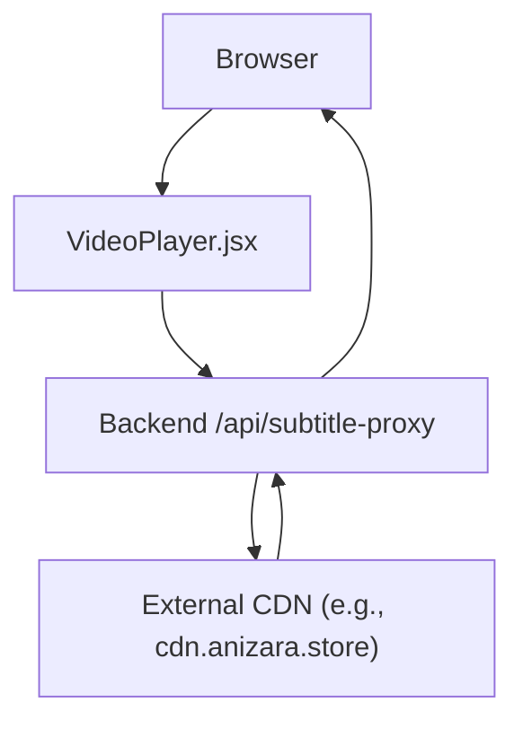
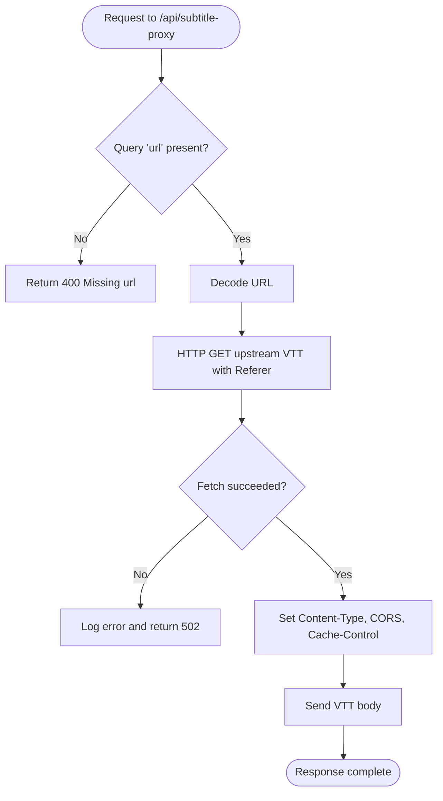
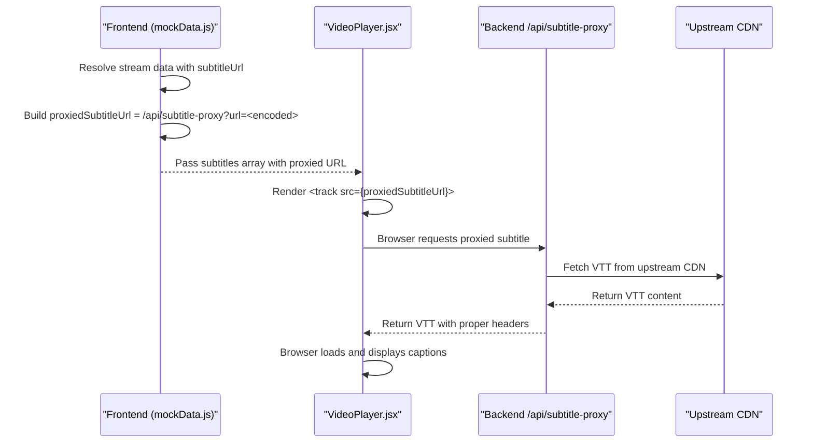
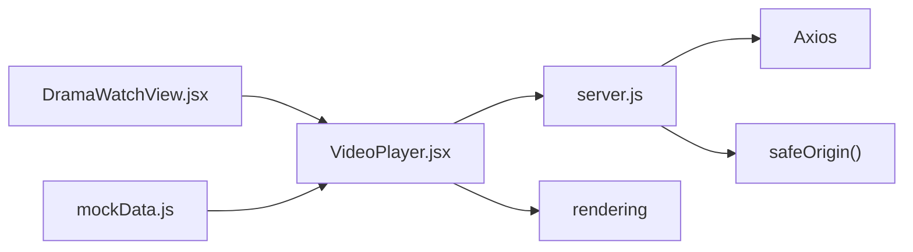

# Subtitle Proxy

<cite>
**Referenced Files in This Document**
- [server.js](file://server.js)
- [VideoPlayer.jsx](file://src/components/VideoPlayer.jsx)
- [DramaWatchView.jsx](file://src/features/drama/components/DramaWatchView.jsx)
- [mockData.js](file://src/mockData.js)
</cite>

## Table of Contents
1. [Introduction](#introduction)
2. [Project Structure](#project-structure)
3. [Core Components](#core-components)
4. [Architecture Overview](#architecture-overview)
5. [Detailed Component Analysis](#detailed-component-analysis)
6. [Dependency Analysis](#dependency-analysis)
7. [Performance Considerations](#performance-considerations)
8. [Troubleshooting Guide](#troubleshooting-guide)
9. [Conclusion](#conclusion)

## Introduction
This document explains the subtitle proxy endpoint that enables browser <track> elements to load VTT subtitles from external CDNs (for example, cdn.anizara.store) without being blocked by CORS. The backend proxies the remote VTT file and returns it with appropriate headers so browsers can render captions seamlessly. It also documents request handling, response formatting, caching behavior, integration with the video player, and error handling for missing or inaccessible subtitle files.

## Project Structure
The subtitle proxy is implemented as a server-side route and consumed by frontend components that build subtitle track URLs through a proxy endpoint.



**Diagram sources**
- [server.js:235-256](file://server.js#L235-L256)
- [VideoPlayer.jsx:720-744](file://src/components/VideoPlayer.jsx#L720-L744)
- [mockData.js:760-780](file://src/mockData.js#L760-L780)

**Section sources**
- [server.js:235-256](file://server.js#L235-L256)
- [VideoPlayer.jsx:720-744](file://src/components/VideoPlayer.jsx#L720-L744)
- [mockData.js:760-780](file://src/mockData.js#L760-L780)

## Core Components
- Backend route: GET /api/subtitle-proxy?url=<url>
  - Accepts a single query parameter url pointing to a remote VTT file.
  - Decodes the URL, fetches the VTT content from the upstream CDN, and forwards it to the client with correct headers.
  - Sets Content-Type to text/vtt; charset=utf-8, enables CORS with Access-Control-Allow-Origin: *, and sets Cache-Control: public, max-age=3600 for 1-hour caching.
  - On errors, logs details and returns 502 with an error message.

- Frontend integration:
  - VideoPlayer.jsx renders <track> elements using subtitle objects provided by the application layer.
  - DramaWatchView.jsx selects and passes a single active subtitle to the player.
  - mockData.js constructs proxied subtitle URLs by wrapping the original subtitleUrl with /api/subtitle-proxy?url=... before passing to the player.

**Section sources**
- [server.js:235-256](file://server.js#L235-L256)
- [VideoPlayer.jsx:720-744](file://src/components/VideoPlayer.jsx#L720-L744)
- [DramaWatchView.jsx:1-34](file://src/features/drama/components/DramaWatchView.jsx#L1-L34)
- [mockData.js:760-780](file://src/mockData.js#L760-L780)

## Architecture Overview
The subtitle proxy acts as a CORS-bypassing relay between the browser and external CDNs. The flow ensures that only the backend communicates with the upstream CDN, while the browser interacts solely with the same-origin backend.

```mermaid
sequenceDiagram
participant B as "Browser"
participant VP as "VideoPlayer.jsx"
participant BE as "Backend /api/subtitle-proxy"
participant U as "Upstream CDN"
B->>VP : Load episode with subtitles
VP->>BE : GET /api/subtitle-proxy?url=<encoded_vtt_url>
BE->>U : HTTP GET (with Referer and headers)
U-->>BE : VTT content (text/plain)
BE-->>B : 200 OK<br/>Content-Type : text/vtt; charset=utf-8<br/>Access-Control-Allow-Origin : *<br/>Cache-Control : public, max-age=3600
B->>B : Browser parses VTT and displays captions
```

**Diagram sources**
- [server.js:235-256](file://server.js#L235-L256)
- [VideoPlayer.jsx:720-744](file://src/components/VideoPlayer.jsx#L720-L744)
- [mockData.js:760-780](file://src/mockData.js#L760-L780)

## Detailed Component Analysis

### Backend Subtitle Proxy Endpoint
- Request:
  - Method: GET
  - Path: /api/subtitle-proxy
  - Query parameters:
    - url: Required. The absolute URL of the remote VTT file (must be percent-encoded).
- Processing:
  - Validates presence of url; returns 400 if missing.
  - Decodes the URL and performs an HTTP GET to the upstream CDN using configured Axios options and a Referer derived from the target origin.
  - Reads the response as text.
- Response:
  - Success:
    - Status: 200
    - Headers:
      - Content-Type: text/vtt; charset=utf-8
      - Access-Control-Allow-Origin: *
      - Cache-Control: public, max-age=3600
    - Body: Raw VTT content
  - Error:
    - Status: 502
    - Body: Error message string
    - Logs: [SUBTITLE-PROXY] Error with message



**Diagram sources**
- [server.js:235-256](file://server.js#L235-L256)

**Section sources**
- [server.js:235-256](file://server.js#L235-L256)

### Frontend Integration with Video Player
- Rendering tracks:
  - VideoPlayer.jsx maps a subtitles array into <track> elements under the <video> element. Each track uses src, kind="subtitles", language, label, and default flags.
- Selecting active subtitle:
  - DramaWatchView.jsx maintains an active subtitle selection and builds a single-element subtitle list to ensure only one track is mounted at a time. Swapping this triggers a remount of the track.
- Building proxied subtitle URLs:
  - mockData.js wraps the original subtitleUrl with /api/subtitle-proxy?url=... to avoid CORS issues when loading VTT from external CDNs.



**Diagram sources**
- [mockData.js:760-780](file://src/mockData.js#L760-L780)
- [VideoPlayer.jsx:720-744](file://src/components/VideoPlayer.jsx#L720-L744)
- [server.js:235-256](file://server.js#L235-L256)

**Section sources**
- [VideoPlayer.jsx:720-744](file://src/components/VideoPlayer.jsx#L720-L744)
- [DramaWatchView.jsx:1-34](file://src/features/drama/components/DramaWatchView.jsx#L1-L34)
- [mockData.js:760-780](file://src/mockData.js#L760-L780)

## Dependency Analysis
- Backend dependencies:
  - Express app defines the /api/subtitle-proxy route.
  - Axios is used to fetch upstream VTT content with configured headers and timeouts.
  - Utility safeOrigin extracts the origin from URLs to set Referer correctly.
- Frontend dependencies:
  - VideoPlayer.jsx consumes subtitles via props and renders native <track> elements.
  - DramaWatchView.jsx manages subtitle selection and passes a single active subtitle to the player.
  - mockData.js constructs proxied subtitle URLs for use in the player.



**Diagram sources**
- [server.js:235-256](file://server.js#L235-L256)
- [VideoPlayer.jsx:720-744](file://src/components/VideoPlayer.jsx#L720-L744)
- [DramaWatchView.jsx:1-34](file://src/features/drama/components/DramaWatchView.jsx#L1-L34)
- [mockData.js:760-780](file://src/mockData.js#L760-L780)

**Section sources**
- [server.js:235-256](file://server.js#L235-L256)
- [VideoPlayer.jsx:720-744](file://src/components/VideoPlayer.jsx#L720-L744)
- [DramaWatchView.jsx:1-34](file://src/features/drama/components/DramaWatchView.jsx#L1-L34)
- [mockData.js:760-780](file://src/mockData.js#L760-L780)

## Performance Considerations
- Caching:
  - The backend sets Cache-Control: public, max-age=3600, enabling 1-hour caching by browsers and intermediate caches. This reduces repeated fetches for the same VTT file.
- Network efficiency:
  - Using a single proxied URL per subtitle avoids cross-origin requests and allows standard browser caching mechanisms to work effectively.
- Resource usage:
  - The proxy reads the entire VTT into memory before sending. For typical VTT sizes this is acceptable; however, extremely large caption files could increase memory usage.

[No sources needed since this section provides general guidance]

## Troubleshooting Guide
Common issues and how to diagnose them:

- Missing subtitle URL:
  - Symptom: 400 response with “Missing url”.
  - Cause: The url query parameter was not provided or empty.
  - Fix: Ensure the frontend constructs the request with a valid, percent-encoded url.

- Upstream CDN unreachable or blocking:
  - Symptom: 502 response with an error message; logs show [SUBTITLE-PROXY] Error.
  - Causes:
    - Network failure or timeout fetching the VTT.
    - Upstream CDN returning an error (e.g., 403 Forbidden due to missing or invalid Referer).
  - Fixes:
    - Verify the upstream URL is accessible and supports the Referer header used by the proxy.
    - Confirm network connectivity and DNS resolution from the server.
    - If the upstream requires specific headers beyond Referer, extend the proxy’s request headers accordingly.

- Captions not showing in the player:
  - Check that the subtitles array contains a valid proxied URL and that the <track> element is rendered.
  - Ensure the active subtitle is selected and passed to the player.
  - Validate that the backend returns 200 with Content-Type text/vtt and CORS enabled.

- Caching-related stale captions:
  - If captions appear outdated, clear browser cache or wait for the 1-hour Cache-Control window to expire.
  - To force reload, append a cache-busting query parameter to the proxied URL on the frontend side.

**Section sources**
- [server.js:235-256](file://server.js#L235-L256)
- [VideoPlayer.jsx:720-744](file://src/components/VideoPlayer.jsx#L720-L744)
- [DramaWatchView.jsx:1-34](file://src/features/drama/components/DramaWatchView.jsx#L1-L34)
- [mockData.js:760-780](file://src/mockData.js#L760-L780)

## Conclusion
The /api/subtitle-proxy endpoint provides a reliable, cached, and CORS-friendly way to serve VTT subtitles from external CDNs to the browser’s native <track> mechanism. By centralizing upstream access on the server and setting appropriate headers, it simplifies frontend integration and improves reliability. Proper error handling and logging help diagnose issues quickly, while the 1-hour cache reduces redundant network traffic.

[No sources needed since this section summarizes without analyzing specific files]