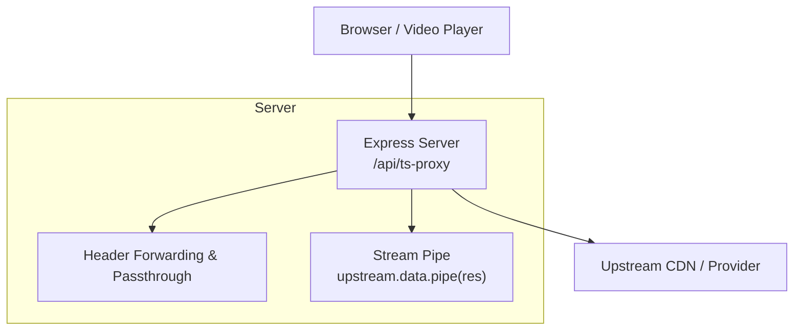
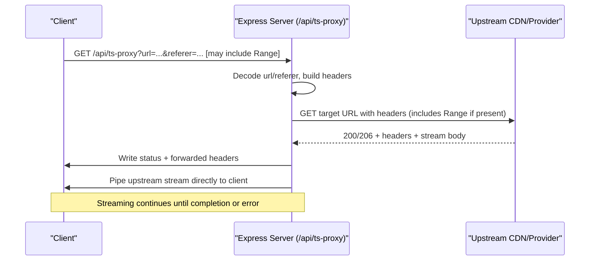
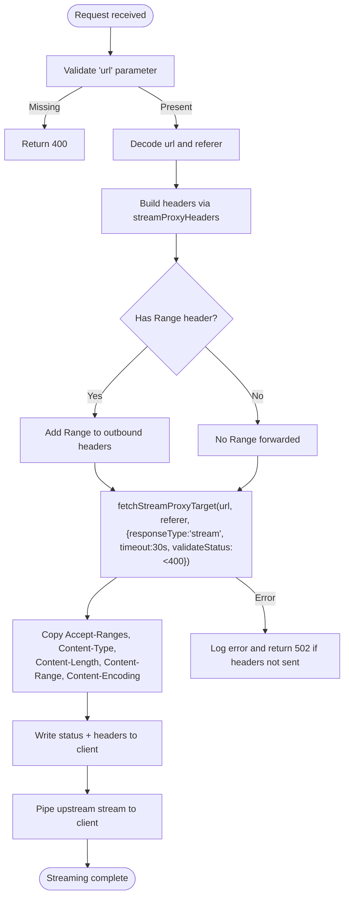
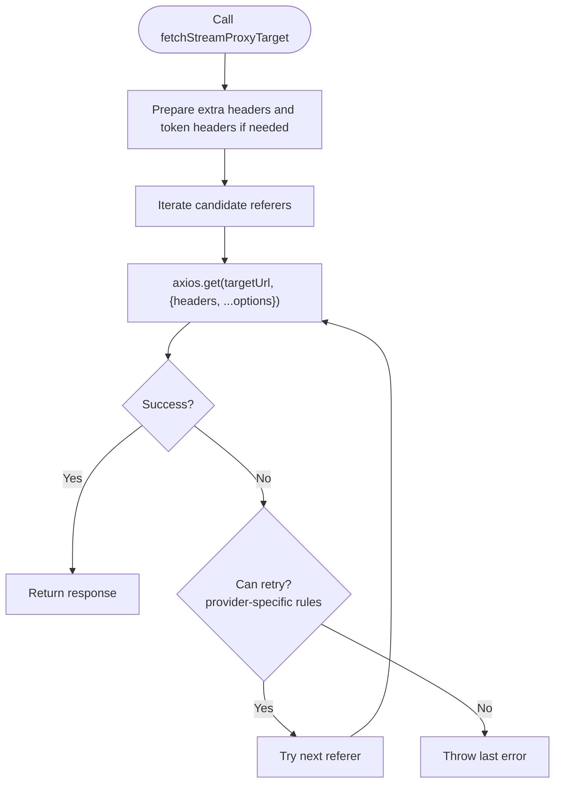
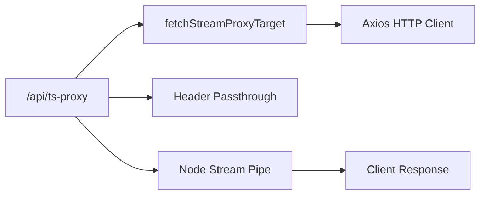

# TS Segment Proxy

<cite>
**Referenced Files in This Document**
- [server.js](file://server.js)
- [proxy.py](file://proxy.py)
- [README.md](file://README.md)
</cite>

## Table of Contents
1. [Introduction](#introduction)
2. [Project Structure](#project-structure)
3. [Core Components](#core-components)
4. [Architecture Overview](#architecture-overview)
5. [Detailed Component Analysis](#detailed-component-analysis)
6. [Dependency Analysis](#dependency-analysis)
7. [Performance Considerations](#performance-considerations)
8. [Troubleshooting Guide](#troubleshooting-guide)
9. [Conclusion](#conclusion)

## Introduction
This document explains the TS segment proxy endpoint (/api/ts-proxy) and how it enables efficient HLS video streaming by forwarding byte-range requests to upstream servers. It details the stream processing pipeline that pipes raw video/audio segments through the server while preserving essential HTTP headers (Accept-Ranges, Content-Type, Content-Length, Content-Range, and Content-Encoding). It also covers error handling for partial content responses (206 status codes), timeout management for large segment downloads, and performance considerations for concurrent requests and memory usage during streaming.

## Project Structure
The TS segment proxy is implemented as part of a Node.js/Express server that also provides an M3U8 manifest proxy and other utilities. A separate Python helper script proxies specific provider endpoints but is not used by /api/ts-proxy.

**Diagram sources**
- [server.js:354-393](file://server.js#L354-L393)

**Section sources**
- [server.js:1-28](file://server.js#L1-L28)
- [server.js:354-393](file://server.js#L354-L393)

## Core Components
- /api/ts-proxy: Proxies raw video/audio segments with streaming and Range header forwarding.
- fetchStreamProxyTarget: Makes outbound requests with retry logic and provider-specific headers.
- streamProxyHeaders: Builds browser-like headers and adds extra headers for protected HLS sources.
- Header passthrough: Copies Accept-Ranges, Content-Type, Content-Length, Content-Range, and Content-Encoding from upstream to client.

Key responsibilities:
- Validate inputs and decode URLs.
- Forward Range when present to enable byte-range playback.
- Stream data directly without buffering into memory.
- Preserve critical headers for correct player behavior.
- Handle errors and timeouts gracefully.

**Section sources**
- [server.js:74-92](file://server.js#L74-L92)
- [server.js:108-148](file://server.js#L108-L148)
- [server.js:354-393](file://server.js#L354-L393)

## Architecture Overview
The TS segment proxy sits between the client and upstream CDNs/providers. It receives a request with optional query parameters (url, referer), forwards necessary headers (including Range), streams the response back to the client, and preserves key headers so the client can perform byte-range seeking efficiently.

**Diagram sources**
- [server.js:354-393](file://server.js#L354-L393)
- [server.js:108-148](file://server.js#L108-L148)
- [server.js:74-92](file://server.js#L74-L92)

## Detailed Component Analysis

### Endpoint: GET /api/ts-proxy
- Input validation: Returns 400 if url is missing.
- Decoding: Safely decodes url and referer; defaults referer to origin if absent.
- Range forwarding: If the incoming request includes a Range header, it is forwarded to upstream to support byte-range playback.
- Outbound request: Uses fetchStreamProxyTarget with responseType set to stream and a 30-second timeout. validateStatus allows 206 Partial Content to pass through.
- Header passthrough: Sets Access-Control-Allow-Origin, Accept-Ranges, Content-Type, and conditionally sets Content-Length, Content-Range, and Content-Encoding based on upstream headers.
- Streaming: Writes the upstream status and headers, then pipes the upstream stream directly to the client response.
- Error handling: Logs errors and returns 502 if headers have not been sent yet.

**Diagram sources**
- [server.js:354-393](file://server.js#L354-L393)
- [server.js:108-148](file://server.js#L108-L148)
- [server.js:74-92](file://server.js#L74-L92)

**Section sources**
- [server.js:354-393](file://server.js#L354-L393)

### Helper: fetchStreamProxyTarget
- Purpose: Performs the actual outbound request to the upstream target with robust header construction and retry logic for certain providers.
- Retry behavior: For specific hosts, retries with alternative Referer values when encountering certain status codes (e.g., 401, 403, 429, 502).
- Token injection: For certain providers, injects cookies and additional headers after fetching tokens.
- Options: Supports passing extra headers and axios options such as responseType and timeout.

**Diagram sources**
- [server.js:108-148](file://server.js#L108-L148)
- [server.js:94-106](file://server.js#L94-L106)

**Section sources**
- [server.js:108-148](file://server.js#L108-L148)
- [server.js:94-106](file://server.js#L94-L106)

### Helper: streamProxyHeaders
- Purpose: Constructs browser-like headers to satisfy provider WAFs and CDNs.
- Behavior: Adds User-Agent, Accept, Referer, Origin, and conditional Sec-Fetch-* headers for protected HLS sources.
- Integration: Used by both manifest and segment proxies; Range is added separately in the segment proxy before calling fetchStreamProxyTarget.

**Section sources**
- [server.js:74-92](file://server.js#L74-L92)

### Relationship to M3U8 Manifest Proxy
- The M3U8 manifest proxy rewrites segment URLs to route them through /api/ts-proxy, ensuring all segment requests go through the same proxy pipeline with proper headers and streaming.

**Section sources**
- [server.js:263-345](file://server.js#L263-L345)

## Dependency Analysis
- Express app: Defines routes and middleware.
- Axios: Used for outbound HTTP requests with streaming and custom headers.
- Node Streams: Pipes upstream response data directly to the client response to avoid buffering.
- Optional Python relay: Not used by /api/ts-proxy; exists for other provider needs.

**Diagram sources**
- [server.js:354-393](file://server.js#L354-L393)
- [server.js:108-148](file://server.js#L108-L148)

**Section sources**
- [server.js:1-28](file://server.js#L1-L28)
- [server.js:354-393](file://server.js#L354-L393)

## Performance Considerations
- Streaming architecture: The endpoint uses responseType: 'stream' and pipes the upstream data directly to the client, minimizing memory usage and enabling fast startup for HLS playback.
- Byte-range support: By forwarding Range headers, only the requested byte ranges are fetched, reducing bandwidth and latency for seeking operations.
- Timeouts: A 30-second timeout is applied to upstream requests to prevent hanging connections on slow or unresponsive servers.
- Concurrent requests: Each request creates its own outbound connection and stream; ensure the hosting environment supports sufficient concurrency and file descriptor limits.
- Header preservation: Passing Accept-Ranges, Content-Type, Content-Length, Content-Range, and Content-Encoding ensures correct client behavior and avoids re-downloads or decoding issues.
- CORS: Access-Control-Allow-Origin is set to allow cross-origin playback from browsers.

[No sources needed since this section provides general guidance]

## Troubleshooting Guide
Common issues and remedies:
- Missing url parameter: The endpoint returns 400 if url is not provided. Ensure the caller encodes the target URL correctly.
- 502 responses: Occur when upstream requests fail or time out. Check logs for error messages and verify network connectivity and provider availability.
- Playback stalls or fails to seek: Verify that Range headers are being forwarded and that upstream supports byte-range requests (Accept-Ranges should be present).
- CORS errors: Confirm that Access-Control-Allow-Origin is set and that the frontend origin matches expectations.
- Large segment downloads: Ensure the client is requesting appropriate byte ranges rather than full files; the proxy will forward Range when present.

Operational notes:
- The README documents how the backend rewrites manifests and segments through /api/m3u8-proxy and /api/ts-proxy to avoid mixed-content and CORS issues.

**Section sources**
- [server.js:354-393](file://server.js#L354-L393)
- [README.md:144-159](file://README.md#L144-L159)

## Conclusion
The /api/ts-proxy endpoint provides a lightweight, efficient proxy for HLS video segments by streaming data directly from upstream servers and forwarding Range headers to enable byte-range playback. It preserves essential headers to ensure correct client behavior and handles errors and timeouts gracefully. Combined with the M3U8 manifest proxy, it forms a robust streaming pipeline that minimizes memory usage and maximizes playback performance.

[No sources needed since this section summarizes without analyzing specific files]