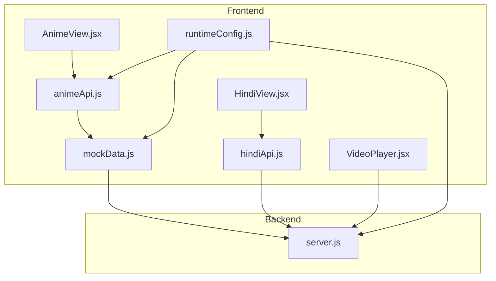
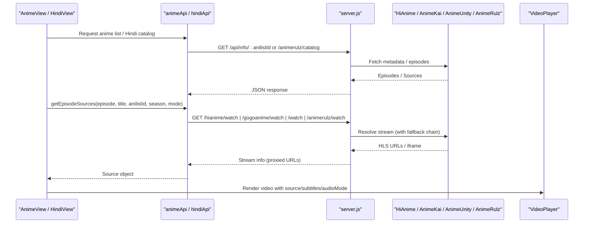
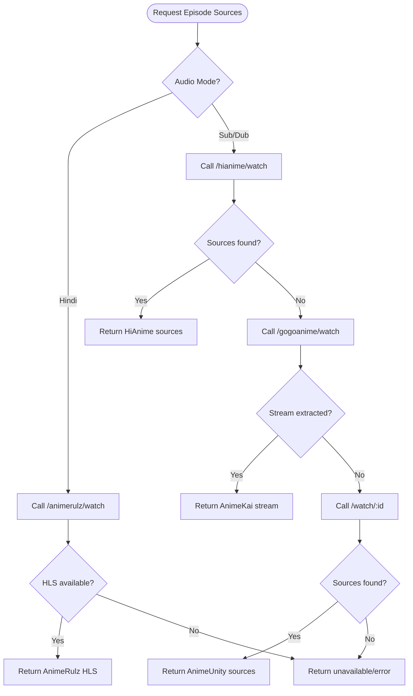
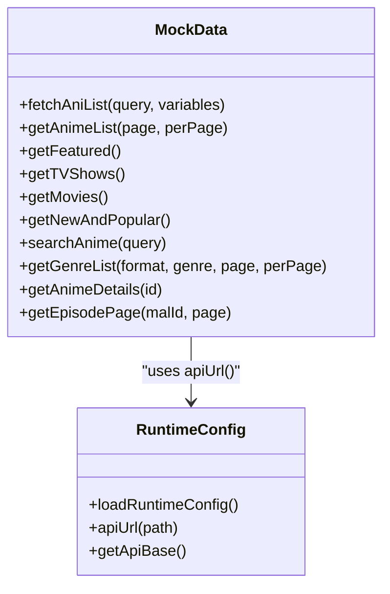
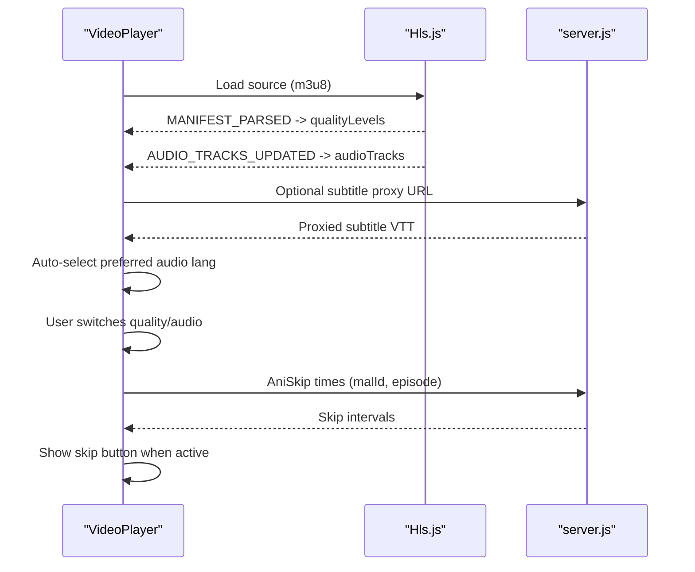
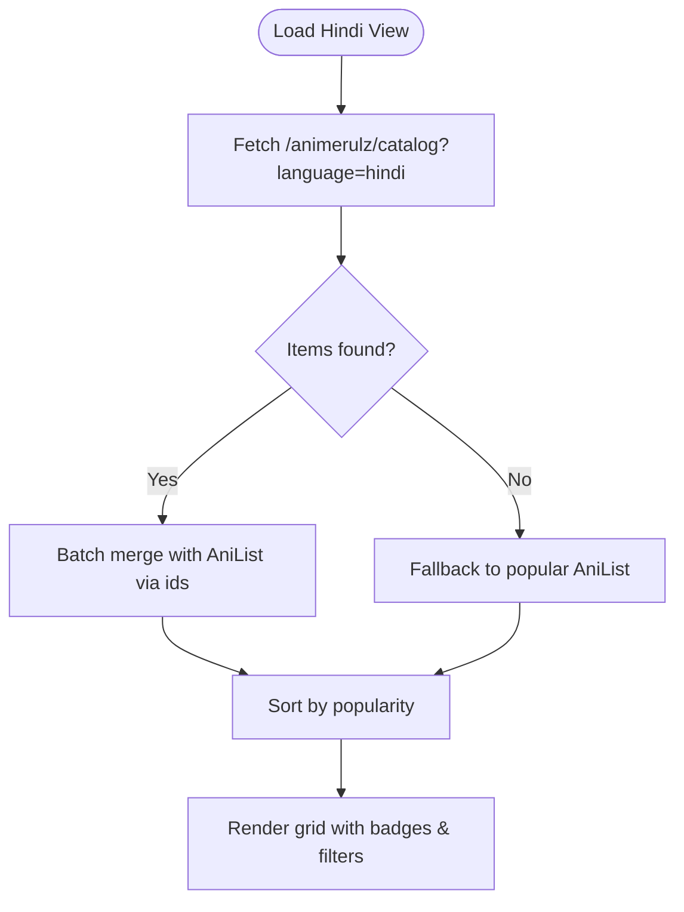
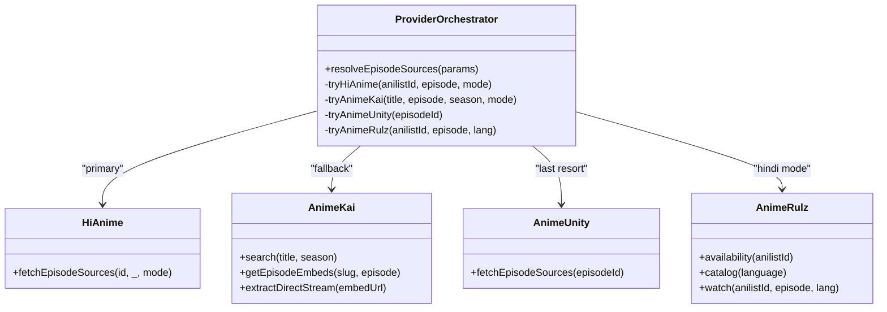
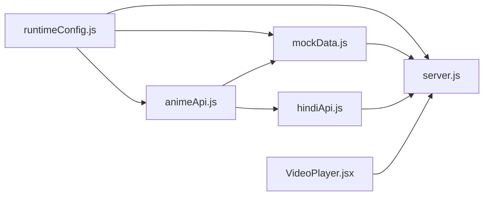

# Anime System

<cite>
**Referenced Files in This Document**
- [animeApi.js](file://src/features/anime/api/animeApi.js)
- [AnimeView.jsx](file://src/features/anime/components/AnimeView.jsx)
- [hindiApi.js](file://src/features/anime/hindi/api/hindiApi.js)
- [HindiView.jsx](file://src/features/anime/hindi/components/HindiView.jsx)
- [VideoPlayer.jsx](file://src/components/VideoPlayer.jsx)
- [mockData.js](file://src/mockData.js)
- [runtimeConfig.js](file://src/runtimeConfig.js)
- [server.js](file://server.js)
</cite>

## Table of Contents
1. [Introduction](#introduction)
2. [Project Structure](#project-structure)
3. [Core Components](#core-components)
4. [Architecture Overview](#architecture-overview)
5. [Detailed Component Analysis](#detailed-component-analysis)
6. [Dependency Analysis](#dependency-analysis)
7. [Performance Considerations](#performance-considerations)
8. [Troubleshooting Guide](#troubleshooting-guide)
9. [Conclusion](#conclusion)
10. [Appendices](#appendices)

## Introduction
This document explains the Anime system implementation in Project Anime, focusing on:
- Multi-provider streaming with automatic fallback across HiAnime, AnimeKai (via GogoAnime), and AnimeUnity (Consumet).
- AniList integration for metadata, search, and content discovery.
- Episode management including subtitles, quality selection, and audio track switching.
- Hindi dubbed content via AnimeRulz with language detection and catalog fallbacks.
- Provider pattern design enabling seamless switching between sources.
- Extensibility guidance to add new providers or endpoints.
- Caching strategies, error handling, and performance optimization techniques.

## Project Structure
The Anime feature is organized into a client-side API abstraction, UI views, and a Node backend that orchestrates provider calls and proxies media streams.

**Diagram sources**
- [AnimeView.jsx:1-151](file://src/features/anime/components/AnimeView.jsx#L1-L151)
- [HindiView.jsx:1-131](file://src/features/anime/hindi/components/HindiView.jsx#L1-L131)
- [VideoPlayer.jsx:1-800](file://src/components/VideoPlayer.jsx#L1-L800)
- [animeApi.js:1-20](file://src/features/anime/api/animeApi.js#L1-L20)
- [hindiApi.js:1-132](file://src/features/anime/hindi/api/hindiApi.js#L1-L132)
- [mockData.js:1-800](file://src/mockData.js#L1-L800)
- [runtimeConfig.js:1-163](file://src/runtimeConfig.js#L1-L163)
- [server.js:1200-1650](file://server.js#L1200-L1650)

**Section sources**
- [AnimeView.jsx:1-151](file://src/features/anime/components/AnimeView.jsx#L1-L151)
- [HindiView.jsx:1-131](file://src/features/anime/hindi/components/HindiView.jsx#L1-L131)
- [animeApi.js:1-20](file://src/features/anime/api/animeApi.js#L1-L20)
- [hindiApi.js:1-132](file://src/features/anime/hindi/api/hindiApi.js#L1-L132)
- [mockData.js:1-800](file://src/mockData.js#L1-L800)
- [runtimeConfig.js:1-163](file://src/runtimeConfig.js#L1-L163)
- [server.js:1200-1650](file://server.js#L1200-L1650)

## Core Components
- Anime API abstraction: Exposes unified methods for fetching anime details, episodes, trending lists, and episode sources. It delegates to mockData and Hindi APIs.
- Hindi API: Provides availability checks and a batched catalog fetcher for Hindi-dubbed content, with AniList fallback when the backend catalog is empty.
- Video Player: Handles HLS playback, quality selection, audio track switching, subtitles, skip intro/end via AniSkip, and iframe fallbacks.
- Backend server: Implements provider routing, caching, and proxying for streams and subtitles; integrates HiAnime, AnimeKai (GogoAnime), AnimeUnity (Consumet), and AnimeRulz.

**Section sources**
- [animeApi.js:1-20](file://src/features/anime/api/animeApi.js#L1-L20)
- [hindiApi.js:1-132](file://src/features/anime/hindi/api/hindiApi.js#L1-L132)
- [VideoPlayer.jsx:1-800](file://src/components/VideoPlayer.jsx#L1-L800)
- [server.js:1200-1650](file://server.js#L1200-L1650)

## Architecture Overview
The system uses a layered architecture:
- Frontend UI components render catalogs and player controls.
- Frontend API modules call backend endpoints or AniList directly through a configured base URL.
- Backend routes implement provider orchestration with caching and fallbacks.
- Media streams are proxied to bypass CORS and protect tokens/referers.

**Diagram sources**
- [animeApi.js:1-20](file://src/features/anime/api/animeApi.js#L1-L20)
- [hindiApi.js:1-132](file://src/features/anime/hindi/api/hindiApi.js#L1-L132)
- [mockData.js:632-800](file://src/mockData.js#L632-L800)
- [server.js:1200-1650](file://server.js#L1200-L1650)
- [VideoPlayer.jsx:1-800](file://src/components/VideoPlayer.jsx#L1-L800)

## Detailed Component Analysis

### Multi-Provider Streaming and Automatic Fallback
- Primary: HiAnime via AniList ID for deterministic season/episode mapping.
- Secondary: AnimeKai (GogoAnime) using title search with season filtering and parallel server probing.
- Last resort: AnimeUnity (Consumet) via META.Anilist wrapper or direct endpoint.
- Hindi mode: AnimeRulz with availability checks and catalog fallback to popular AniList titles.

**Diagram sources**
- [mockData.js:632-800](file://src/mockData.js#L632-L800)
- [server.js:1200-1650](file://server.js#L1200-L1650)

**Section sources**
- [mockData.js:632-800](file://src/mockData.js#L632-L800)
- [server.js:1200-1650](file://server.js#L1200-L1650)

### AniList Integration for Metadata, Search, and Discovery
- In-memory cache with TTL reduces repeated queries.
- Proxy-first strategy: backend proxy to AniList GraphQL, then direct request, then dev proxy fallback.
- Mapping functions convert AniList media to card/detail formats used by UI.
- Search includes auto-correction for common misspellings.

**Diagram sources**
- [mockData.js:1-800](file://src/mockData.js#L1-L800)
- [runtimeConfig.js:1-163](file://src/runtimeConfig.js#L1-L163)

**Section sources**
- [mockData.js:1-800](file://src/mockData.js#L1-L800)
- [runtimeConfig.js:1-163](file://src/runtimeConfig.js#L1-L163)

### Episode Management: Subtitles, Quality Selection, Audio Tracks
- Subtitles: VTT tracks injected into the video element; subtitle URLs may be proxied to avoid CORS.
- Quality selection: HLS manifest parsed to expose levels; user can switch levels via UI.
- Audio tracks: HLS audioTracks enumerated; preferred language auto-selected (e.g., Hindi) and switchable.
- Skip Intro/End: AniSkip API provides intervals; UI shows skip button during active windows.

**Diagram sources**
- [VideoPlayer.jsx:1-800](file://src/components/VideoPlayer.jsx#L1-L800)
- [server.js:1200-1650](file://server.js#L1200-L1650)

**Section sources**
- [VideoPlayer.jsx:1-800](file://src/components/VideoPlayer.jsx#L1-L800)

### Hindi Dubbed Content System with AnimeRulz
- Availability check: In-memory cache keyed by AniList ID; queries backend availability endpoint.
- Catalog fetch: Streams batches from backend catalog; merges with AniList data; falls back to popular AniList if catalog empty.
- Language detection: Marks items with hasHindiDub and languages array; UI filters and sorts accordingly.

**Diagram sources**
- [hindiApi.js:1-132](file://src/features/anime/hindi/api/hindiApi.js#L1-L132)
- [mockData.js:376-463](file://src/mockData.js#L376-L463)

**Section sources**
- [hindiApi.js:1-132](file://src/features/anime/hindi/api/hindiApi.js#L1-L132)
- [mockData.js:376-463](file://src/mockData.js#L376-L463)

### Provider Pattern Implementation
- Unified interface: Frontend calls getEpisodeSources with consistent parameters; backend resolves provider based on mode and availability.
- Deterministic primary path: HiAnime uses AniList ID to avoid ambiguity.
- Robust fallback: AnimeKai uses title search with season filter; AnimeUnity as last resort.
- Hindi-specific path: AnimeRulz handles Indian dubs with proxying for HLS.

**Diagram sources**
- [mockData.js:632-800](file://src/mockData.js#L632-L800)
- [server.js:1200-1650](file://server.js#L1200-L1650)

**Section sources**
- [mockData.js:632-800](file://src/mockData.js#L632-L800)
- [server.js:1200-1650](file://server.js#L1200-L1650)

### Examples: Adding New Providers and Extending the Catalog
- Add a new provider route in the backend:
  - Define a new endpoint (e.g., /api/newprovider/watch) with parameter validation, caching, and fallback logic similar to existing routes.
  - Implement extraction/proxying for HLS and subtitles, returning a normalized response shape.
- Extend frontend provider resolution:
  - Update getEpisodeSources in mockData.js to call the new endpoint when appropriate conditions are met.
  - Ensure response normalization matches expected fields (provider, type, sources, subtitles, headers).
- Extend catalog sources:
  - For Hindi or other categories, integrate additional backend catalogs and merge with AniList data using batching and fallbacks.

[No sources needed since this section provides general guidance]

## Dependency Analysis
Key dependencies and relationships:
- Frontend depends on runtime configuration to resolve backend base URL.
- Anime API depends on mockData for AniList interactions and Hindi API for localized content.
- Backend depends on external providers (HiAnime, AnimeKai/GogoAnime, AnimeUnity/Consumet, AnimeRulz) and caches results to reduce latency.
- VideoPlayer depends on HLS.js and optional iframe fallback for embedded players.

**Diagram sources**
- [runtimeConfig.js:1-163](file://src/runtimeConfig.js#L1-L163)
- [animeApi.js:1-20](file://src/features/anime/api/animeApi.js#L1-L20)
- [mockData.js:1-800](file://src/mockData.js#L1-L800)
- [hindiApi.js:1-132](file://src/features/anime/hindi/api/hindiApi.js#L1-L132)
- [VideoPlayer.jsx:1-800](file://src/components/VideoPlayer.jsx#L1-L800)
- [server.js:1200-1650](file://server.js#L1200-L1650)

**Section sources**
- [runtimeConfig.js:1-163](file://src/runtimeConfig.js#L1-L163)
- [animeApi.js:1-20](file://src/features/anime/api/animeApi.js#L1-L20)
- [mockData.js:1-800](file://src/mockData.js#L1-L800)
- [hindiApi.js:1-132](file://src/features/anime/hindi/api/hindiApi.js#L1-L132)
- [VideoPlayer.jsx:1-800](file://src/components/VideoPlayer.jsx#L1-L800)
- [server.js:1200-1650](file://server.js#L1200-L1650)

## Performance Considerations
- Caching strategies:
  - In-memory caches for AniList queries and Hindi availability checks with TTLs to reduce network calls.
  - Backend caches for episode lists and stream extractions to speed up repeat requests.
- Parallelism:
  - Parallel probing of top servers for AnimeKai to minimize latency.
  - Batched AniList queries for Hindi catalog merging.
- Network resilience:
  - Timeouts and retries for provider calls.
  - Fallback chains ensure continuity when primary providers fail.
- Playback optimizations:
  - HLS buffering settings tuned for smooth playback.
  - Prefetching skip intervals for intro/end segments.

[No sources needed since this section provides general guidance]

## Troubleshooting Guide
Common issues and resolutions:
- No playable source:
  - Verify provider availability via status endpoint; check logs for timeouts or errors.
  - Ensure correct parameters (anilistId, episode, season, audioMode) are passed.
- CORS or token issues:
  - Use backend-proxied URLs for HLS manifests and subtitles; avoid direct provider URLs in the browser.
- Hindi dub not found:
  - Check availability cache and backend catalog; fall back to popular AniList list if needed.
- Player errors:
  - Inspect HLS error events; attempt recovery or switch to iframe fallback if provided.

**Section sources**
- [VideoPlayer.jsx:1-800](file://src/components/VideoPlayer.jsx#L1-L800)
- [server.js:1200-1650](file://server.js#L1200-L1650)

## Conclusion
The Anime system implements a robust multi-provider streaming architecture with strong fallback mechanisms, comprehensive AniList integration, and a polished video player experience. The provider pattern ensures reliability and scalability, while caching and parallelism optimize performance. Hindi dubbed content is seamlessly integrated with availability checks and catalog fallbacks. Extensibility is straightforward through backend routes and frontend API updates.

[No sources needed since this section summarizes without analyzing specific files]

## Appendices
- Configuration:
  - Runtime config prioritizes query overrides, serverless runtime config, static config, build-time env, and local dev detection.
- Endpoints summary:
  - /api/hianime/watch: Primary HiAnime streaming via AniList ID.
  - /api/gogoanime/watch: AnimeKai fallback with title search and parallel server probing.
  - /api/watch/:episodeId: AnimeUnity last resort via Consumet.
  - /animerulz/*: Hindi dub availability and catalog endpoints.

**Section sources**
- [runtimeConfig.js:1-163](file://src/runtimeConfig.js#L1-L163)
- [server.js:1200-1650](file://server.js#L1200-L1650)