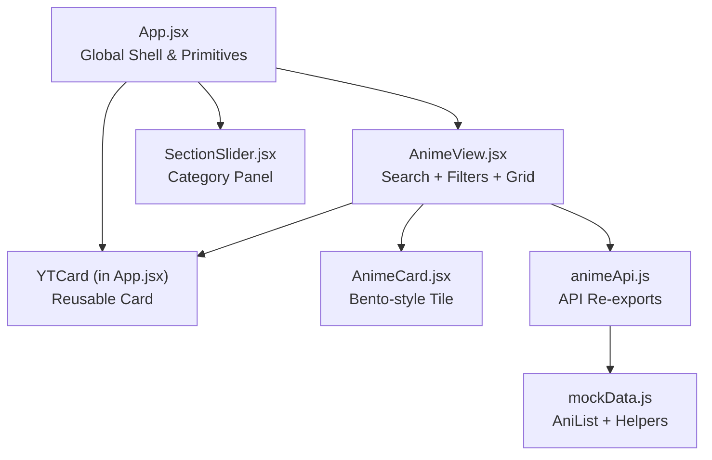
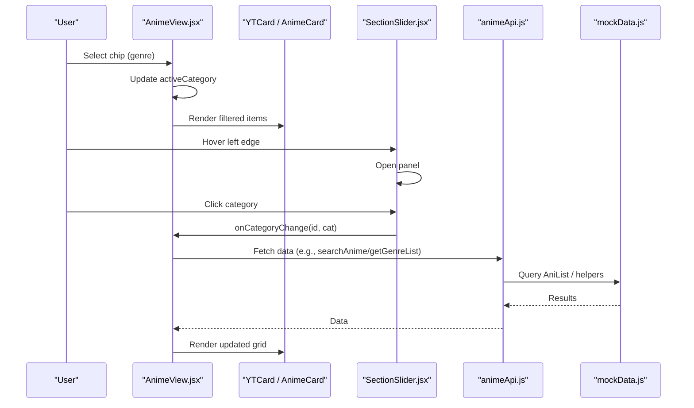
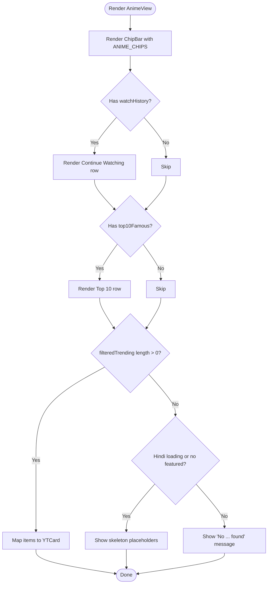
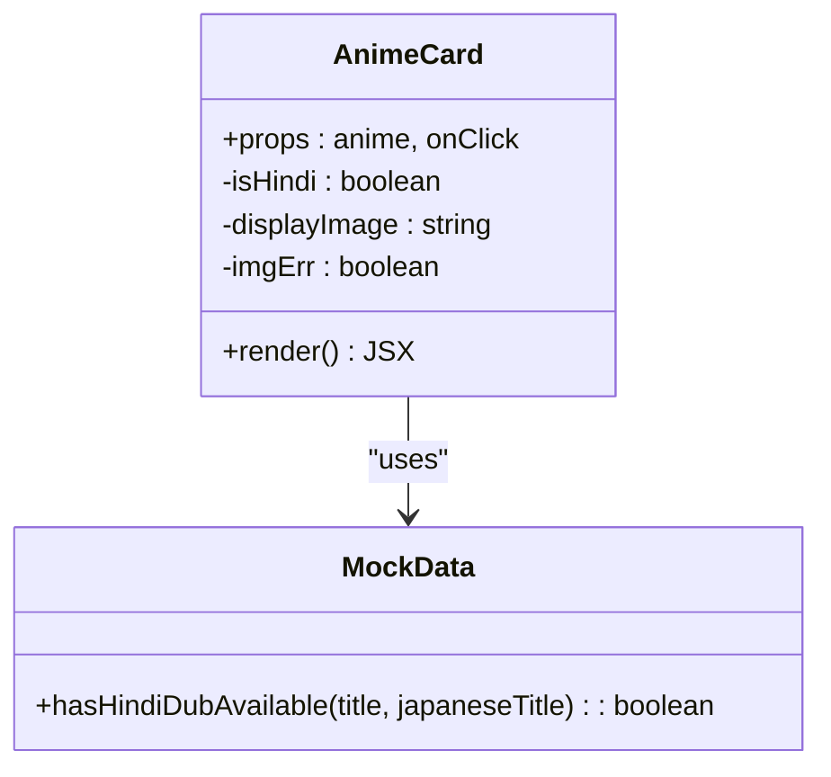
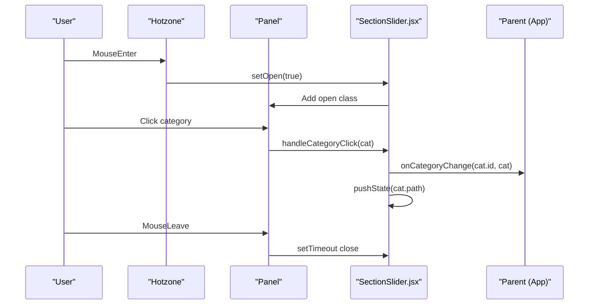
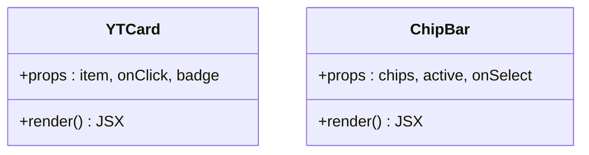
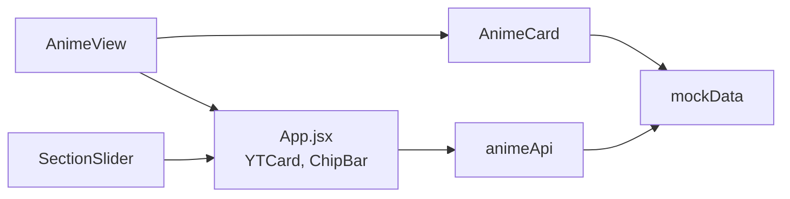

# Anime UI Components

<cite>
**Referenced Files in This Document**
- [AnimeView.jsx](file://src/features/anime/components/AnimeView.jsx)
- [AnimeCard.jsx](file://src/features/anime/components/AnimeCard.jsx)
- [SectionSlider.jsx](file://src/components/SectionSlider.jsx)
- [SectionSlider.css](file://src/components/SectionSlider.css)
- [animeApi.js](file://src/features/anime/api/animeApi.js)
- [App.jsx](file://src/App.jsx)
- [mockData.js](file://src/mockData.js)
- [useDeviceType.js](file://src/utils/useDeviceType.js)
</cite>

## Table of Contents
1. [Introduction](#introduction)
2. [Project Structure](#project-structure)
3. [Core Components](#core-components)
4. [Architecture Overview](#architecture-overview)
5. [Detailed Component Analysis](#detailed-component-analysis)
6. [Dependency Analysis](#dependency-analysis)
7. [Performance Considerations](#performance-considerations)
8. [Troubleshooting Guide](#troubleshooting-guide)
9. [Conclusion](#conclusion)
10. [Appendices](#appendices)

## Introduction
This document explains the anime user interface components that power browsing and discovery. It focuses on:
- AnimeView for search results display, genre filtering via chips, and pagination/skeleton handling
- AnimeCard for metadata display, rating information, and hover interactions
- SectionSlider for a slide-out category panel with smooth transitions and accessibility
It also covers customization patterns, responsive design, integration with global state, accessibility considerations, and cross-browser compatibility notes based on the codebase.

## Project Structure
The anime UI is composed of feature-scoped components and shared UI primitives:
- Feature layer: AnimeView and AnimeCard under src/features/anime/components
- Shared UI: SectionSlider (slide-out panel) under src/components
- Global app shell and shared primitives: App.jsx defines YTCard and ChipBar used by views
- Data layer: animeApi.js re-exports API helpers; mockData.js provides data fetching utilities and mappings

**Diagram sources**
- [App.jsx:2636-2692](file://src/App.jsx#L2636-L2692)
- [AnimeView.jsx:1-151](file://src/features/anime/components/AnimeView.jsx#L1-L151)
- [AnimeCard.jsx:1-63](file://src/features/anime/components/AnimeCard.jsx#L1-L63)
- [SectionSlider.jsx:1-227](file://src/components/SectionSlider.jsx#L1-L227)
- [animeApi.js:1-20](file://src/features/anime/api/animeApi.js#L1-L20)
- [mockData.js:1-200](file://src/mockData.js#L1-L200)

**Section sources**
- [App.jsx:2636-2692](file://src/App.jsx#L2636-L2692)
- [AnimeView.jsx:1-151](file://src/features/anime/components/AnimeView.jsx#L1-L151)
- [AnimeCard.jsx:1-63](file://src/features/anime/components/AnimeCard.jsx#L1-L63)
- [SectionSlider.jsx:1-227](file://src/components/SectionSlider.jsx#L1-L227)
- [animeApi.js:1-20](file://src/features/anime/api/animeApi.js#L1-L20)
- [mockData.js:1-200](file://src/mockData.js#L1-L200)

## Core Components
- AnimeView: Renders a chip-based filter bar, Continue Watching row, Top 10 section, and main trending grid with skeleton loaders and empty states. Uses ChipBar and YTCard from App.jsx.
- AnimeCard: A bento-style tile showing cover/banner image, Hindi badge, hover play overlay, rating or episode count, and genre text.
- SectionSlider: A glassmorphic slide-out panel triggered by a left-edge hotzone, listing categories with icons, descriptions, and active state management.
- Shared primitives:
  - YTCard: YouTube-style card with thumbnail, duration, avatar, title, channel, and stats.
  - ChipBar: Horizontal chip list for filtering content by category or genre.

**Section sources**
- [AnimeView.jsx:1-151](file://src/features/anime/components/AnimeView.jsx#L1-L151)
- [AnimeCard.jsx:1-63](file://src/features/anime/components/AnimeCard.jsx#L1-L63)
- [SectionSlider.jsx:1-227](file://src/components/SectionSlider.jsx#L1-L227)
- [App.jsx:2636-2692](file://src/App.jsx#L2636-L2692)

## Architecture Overview
The UI follows a layered approach:
- Presentation layer: AnimeView composes sections using shared cards (YTCard, AnimeCard) and filters (ChipBar).
- Navigation layer: SectionSlider provides category navigation and updates URL via history.pushState while notifying parent via onCategoryChange.
- Data layer: animeApi.js exposes methods like getAnimeDetails, searchAnime, getGenreList, etc., backed by mockData.js which integrates AniList GraphQL and helper functions for formatting and availability checks.

**Diagram sources**
- [AnimeView.jsx:19-48](file://src/features/anime/components/AnimeView.jsx#L19-L48)
- [SectionSlider.jsx:122-131](file://src/components/SectionSlider.jsx#L122-L131)
- [animeApi.js:4-17](file://src/features/anime/api/animeApi.js#L4-L17)
- [mockData.js:79-150](file://src/mockData.js#L79-L150)

## Detailed Component Analysis

### AnimeView: Search Results, Genre Filtering, Pagination Handling
- Chip-based filtering: Defines ANIME_CHIPS and renders ChipBar to switch between All, Action, Adventure, Romance, Comedy, Fantasy, Thriller, Horror, Sci-Fi, Sports, and Hindi Dub. The active category drives the displayed content.
- Sections:
  - Continue Watching: Aggregates up to 12 items from watchHistory, shows type badges and progress bars when available.
  - Top 10 This Week: Displays top10Famous with rank badges.
  - Main Grid: Shows filteredTrending or skeletons during loading, or an empty state if no results.
- Interactions:
  - onAnimeClick and onStartWatching are passed down to handle navigation and playback.
  - Hindi loading state influences skeleton visibility for Hindi category.

**Diagram sources**
- [AnimeView.jsx:19-48](file://src/features/anime/components/AnimeView.jsx#L19-L48)
- [AnimeView.jsx:51-105](file://src/features/anime/components/AnimeView.jsx#L51-L105)
- [AnimeView.jsx:107-147](file://src/features/anime/components/AnimeView.jsx#L107-L147)

**Section sources**
- [AnimeView.jsx:19-48](file://src/features/anime/components/AnimeView.jsx#L19-L48)
- [AnimeView.jsx:51-105](file://src/features/anime/components/AnimeView.jsx#L51-L105)
- [AnimeView.jsx:107-147](file://src/features/anime/components/AnimeView.jsx#L107-L147)

### AnimeCard: Metadata Display, Rating Information, Hover Interactions
- Image handling: Uses bannerImage or coverImage with lazy loading and error fallback to a placeholder with initial letter.
- Badges:
  - Hindi badge shown when hasHindiDub or hasHindiDubAvailable returns true.
  - Rating badge displays star-prefixed rating or episode count when rating is not available.
- Hover overlay: Play icon appears on hover to indicate click-to-play behavior.
- Metadata: Title and genres (up to two joined with a separator) are displayed below the image.

**Diagram sources**
- [AnimeCard.jsx:1-63](file://src/features/anime/components/AnimeCard.jsx#L1-L63)
- [mockData.js:62-64](file://src/mockData.js#L62-L64)

**Section sources**
- [AnimeCard.jsx:1-63](file://src/features/anime/components/AnimeCard.jsx#L1-L63)
- [mockData.js:62-64](file://src/mockData.js#L62-L64)

### SectionSlider: Horizontal Scrolling Content Carousels (Slide-out Category Panel)
- Trigger mechanism: Invisible left-edge hotzone opens the panel; a visible tab hint indicates where to hover.
- Panel behavior: Glassmorphic backdrop and panel with smooth transform transitions; closes on Escape key, outside clicks, or leaving the panel after a delay.
- Categories: Predefined list with icons, labels, subtitles, descriptions, and accent colors; clicking pushes a new URL path and calls onCategoryChange.
- Accessibility: Panel uses role="dialog" and aria-label; keyboard support via Escape; focus-friendly buttons with clear labels.

**Diagram sources**
- [SectionSlider.jsx:87-131](file://src/components/SectionSlider.jsx#L87-L131)
- [SectionSlider.jsx:133-224](file://src/components/SectionSlider.jsx#L133-L224)
- [SectionSlider.css:6-106](file://src/components/SectionSlider.css#L6-L106)

**Section sources**
- [SectionSlider.jsx:87-131](file://src/components/SectionSlider.jsx#L87-L131)
- [SectionSlider.jsx:133-224](file://src/components/SectionSlider.jsx#L133-L224)
- [SectionSlider.css:6-106](file://src/components/SectionSlider.css#L6-L106)

### Shared Primitives: YTCard and ChipBar
- YTCard: Displays thumbnail, duration badge, avatar, title, channel, and stats; supports keyboard activation and lazy images.
- ChipBar: Renders a horizontal list of filter chips with active state styling and selection callback.

**Diagram sources**
- [App.jsx:2636-2692](file://src/App.jsx#L2636-L2692)

**Section sources**
- [App.jsx:2636-2692](file://src/App.jsx#L2636-L2692)

## Dependency Analysis
- AnimeView depends on:
  - ChipBar and YTCard from App.jsx for filtering and rendering
  - Props for data and callbacks (activeCategory, filteredTrending, top10Famous, watchHistory)
- AnimeCard depends on:
  - mockData helpers for Hindi dub availability
- SectionSlider depends on:
  - CSS for animations and glassmorphism
  - Parent component for onCategoryChange and routing
- Data flow:
  - animeApi.js re-exports API methods from mockData.js
  - mockData.js integrates AniList GraphQL, caching, and helper functions

**Diagram sources**
- [AnimeView.jsx:1-151](file://src/features/anime/components/AnimeView.jsx#L1-L151)
- [AnimeCard.jsx:1-63](file://src/features/anime/components/AnimeCard.jsx#L1-L63)
- [SectionSlider.jsx:1-227](file://src/components/SectionSlider.jsx#L1-L227)
- [App.jsx:2636-2692](file://src/App.jsx#L2636-L2692)
- [animeApi.js:1-20](file://src/features/anime/api/animeApi.js#L1-L20)
- [mockData.js:1-200](file://src/mockData.js#L1-L200)

**Section sources**
- [AnimeView.jsx:1-151](file://src/features/anime/components/AnimeView.jsx#L1-L151)
- [AnimeCard.jsx:1-63](file://src/features/anime/components/AnimeCard.jsx#L1-L63)
- [SectionSlider.jsx:1-227](file://src/components/SectionSlider.jsx#L1-L227)
- [App.jsx:2636-2692](file://src/App.jsx#L2636-L2692)
- [animeApi.js:1-20](file://src/features/anime/api/animeApi.js#L1-L20)
- [mockData.js:1-200](file://src/mockData.js#L1-L200)

## Performance Considerations
- Lazy loading: Images use loading="lazy" to defer offscreen images.
- Skeletons: Placeholder grids reduce perceived load time during data fetches.
- Caching: mockData.js implements in-memory caches for AniList queries and Hindi availability checks with TTLs to reduce network requests.
- Batching: Thumbnail resolution runs in batches to avoid blocking the UI.
- Transitions: CSS transforms and backdrop-filter provide smooth animations without heavy JS overhead.

[No sources needed since this section provides general guidance]

## Troubleshooting Guide
- No content found:
  - Ensure filteredTrending is populated and activeCategory matches expected values.
  - Check API responses and error handling paths in mockData.js for rate limits or failures.
- Images not displaying:
  - Verify image URLs and onError handlers; fallbacks exist but may need alt text improvements.
- Hindi badge not appearing:
  - Confirm hasHindiDubAvailable or async hasHindiDub checks return true; ensure AniList IDs are present for dynamic checks.
- SectionSlider not closing:
  - Verify Escape key listener and outside click handler are attached; check z-index conflicts.

**Section sources**
- [AnimeView.jsx:107-147](file://src/features/anime/components/AnimeView.jsx#L107-L147)
- [AnimeCard.jsx:20-31](file://src/features/anime/components/AnimeCard.jsx#L20-L31)
- [SectionSlider.jsx:87-107](file://src/components/SectionSlider.jsx#L87-L107)
- [mockData.js:79-150](file://src/mockData.js#L79-L150)

## Conclusion
The anime UI components provide a cohesive browsing experience through modular, reusable pieces:
- AnimeView orchestrates filtering, sections, and grid rendering with robust loading states
- AnimeCard delivers rich metadata and interactive feedback
- SectionSlider offers accessible, animated category navigation
Integration with global state and APIs is streamlined via shared primitives and a consistent data layer, enabling scalable customization and responsive design across devices.

[No sources needed since this section summarizes without analyzing specific files]

## Appendices

### Customizing Anime Card Layouts
- To change how metadata is presented, extend AnimeCard props or wrap it with a custom renderer that adjusts layout, badges, and overlays.
- Use AnimeView’s continue watching and top 10 sections to showcase different layouts (e.g., rank badges, progress indicators).

**Section sources**
- [AnimeCard.jsx:1-63](file://src/features/anime/components/AnimeCard.jsx#L1-L63)
- [AnimeView.jsx:51-105](file://src/features/anime/components/AnimeView.jsx#L51-L105)

### Implementing Responsive Design Patterns
- Leverage useDeviceType hook to detect mobile/tablet breakpoints and adjust UI accordingly.
- SectionSlider includes responsive styles for smaller screens; consider adapting card grids and chip bars similarly.

**Section sources**
- [useDeviceType.js:1-48](file://src/utils/useDeviceType.js#L1-L48)
- [SectionSlider.css:356-362](file://src/components/SectionSlider.css#L356-L362)

### Integrating with Global State Management
- AnimeView receives props for activeCategory, filteredTrending, top10Famous, and watchHistory; manage these in the parent component (App.jsx) and pass down as needed.
- SectionSlider communicates category changes via onCategoryChange; update URL and fetch relevant data in the parent.

**Section sources**
- [AnimeView.jsx:4-18](file://src/features/anime/components/AnimeView.jsx#L4-L18)
- [SectionSlider.jsx:122-131](file://src/components/SectionSlider.jsx#L122-L131)
- [App.jsx:51-83](file://src/App.jsx#L51-L83)

### Accessibility Considerations
- Keyboard navigation: YTCard supports Enter key activation; SectionSlider listens for Escape to close panels.
- ARIA attributes: SectionSlider panel uses role="dialog" and aria-label for screen readers.
- Focus management: Buttons and interactive elements are native HTML controls, ensuring proper focus behavior.

**Section sources**
- [App.jsx:2652-2653](file://src/App.jsx#L2652-L2653)
- [SectionSlider.jsx:87-94](file://src/components/SectionSlider.jsx#L87-L94)
- [SectionSlider.jsx:157-165](file://src/components/SectionSlider.jsx#L157-L165)

### Cross-Browser Compatibility Notes
- Glassmorphism effects rely on backdrop-filter; ensure vendor prefixes are applied where necessary.
- CSS transitions and transforms are widely supported; test on older browsers for graceful degradation.
- Image lazy loading and error handling improve resilience across environments.

**Section sources**
- [SectionSlider.css:28-31](file://src/components/SectionSlider.css#L28-L31)
- [SectionSlider.css:91-94](file://src/components/SectionSlider.css#L91-L94)
- [App.jsx:2656-2656](file://src/App.jsx#L2656-L2656)