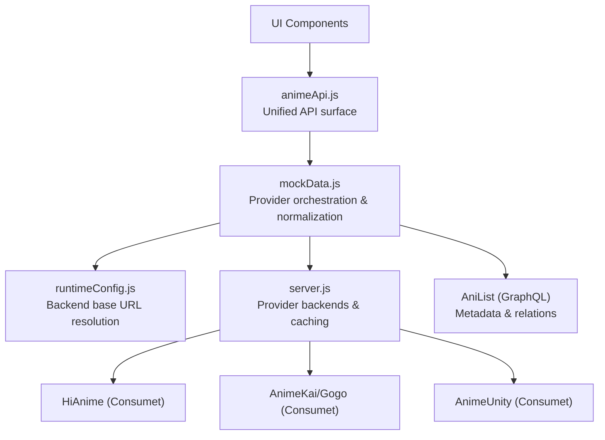
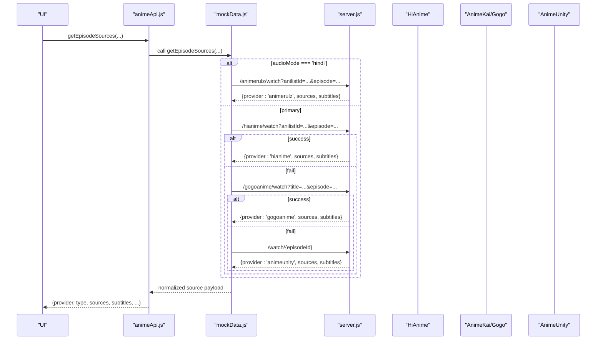
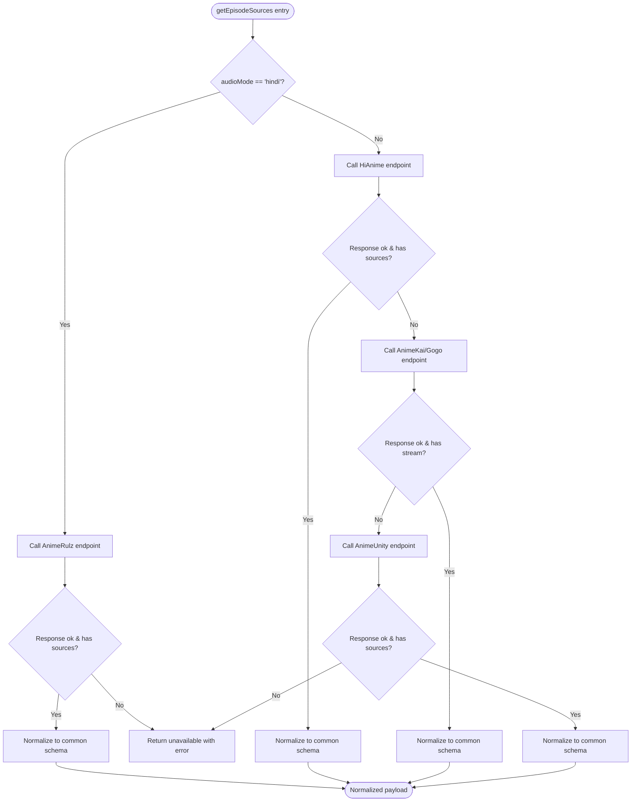

# Core Anime API

<cite>
**Referenced Files in This Document**
- [animeApi.js](file://src/features/anime/api/animeApi.js)
- [mockData.js](file://src/mockData.js)
- [runtimeConfig.js](file://src/runtimeConfig.js)
- [server.js](file://server.js)
</cite>

## Table of Contents
1. [Introduction](#introduction)
2. [Project Structure](#project-structure)
3. [Core Components](#core-components)
4. [Architecture Overview](#architecture-overview)
5. [Detailed Component Analysis](#detailed-component-analysis)
6. [Dependency Analysis](#dependency-analysis)
7. [Performance Considerations](#performance-considerations)
8. [Troubleshooting Guide](#troubleshooting-guide)
9. [Conclusion](#conclusion)

## Introduction
This document explains the core anime API layer that provides unified access to multiple streaming providers. It focuses on the provider abstraction pattern that allows seamless switching between HiAnime, AnimeKai (via Gogo), and AnimeUnity sources, as well as a dedicated Hindi dub path via AnimeRulz. The API exposes consistent methods such as getAnimeDetails, searchAnime, getEpisodeSources, and getFranchise, normalizing diverse provider responses into a single contract for reliable consumption by the UI.

The implementation includes robust error handling and automatic fallback mechanisms: if one provider fails or returns no playable stream, the system tries the next provider in order. Caching strategies are implemented both client-side and server-side to reduce latency and external API load.

## Project Structure
The anime API is exposed through a thin module that re-exports a unified interface, while the actual logic lives in a shared data module that coordinates with a backend server. Configuration for the backend base URL is resolved at runtime to support local development, Vercel serverless functions, and native app environments.

**Diagram sources**
- [animeApi.js:1-20](file://src/features/anime/api/animeApi.js#L1-L20)
- [mockData.js:321-893](file://src/mockData.js#L321-L893)
- [runtimeConfig.js:82-153](file://src/runtimeConfig.js#L82-L153)
- [server.js:213-228](file://server.js#L213-L228)

**Section sources**
- [animeApi.js:1-20](file://src/features/anime/api/animeApi.js#L1-L20)
- [runtimeConfig.js:1-163](file://src/runtimeConfig.js#L1-L163)

## Core Components
- Unified API surface: Exposes stable method names to the rest of the application.
- Provider orchestration: Chooses the best available provider based on input parameters and availability.
- Normalization: Converts provider-specific payloads into a consistent shape for playback and metadata.
- Caching: In-memory caches on both client and server to reduce network calls and rate-limit exposure.
- Error handling: Graceful degradation when providers fail, returning safe defaults and clear error context.

Key responsibilities by file:
- animeApi.js: Re-exports the unified API object used by components.
- mockData.js: Implements getAnimeDetails, searchAnime, getEpisodeSources, getFranchise, plus helper utilities and caching.
- runtimeConfig.js: Resolves the backend base URL dynamically and provides helpers for building API URLs.
- server.js: Hosts provider endpoints, implements caching, proxies, and fallback logic for streaming sources.

**Section sources**
- [animeApi.js:1-20](file://src/features/anime/api/animeApi.js#L1-L20)
- [mockData.js:321-893](file://src/mockData.js#L321-L893)
- [runtimeConfig.js:82-153](file://src/runtimeConfig.js#L82-L153)
- [server.js:213-228](file://server.js#L213-L228)

## Architecture Overview
The API layer abstracts multiple streaming providers behind a single interface. When requesting episode sources, it attempts providers in a defined order:

1. AnimeRulz (Hindi audio mode)
2. HiAnime (primary, deterministic via AniList ID)
3. AnimeKai/Gogo (fallback via title search)
4. AnimeUnity (last resort via Consumet)

Each provider’s response is normalized to a common structure containing provider name, type, sources array, subtitles, headers, and optional language/audioMode fields.

**Diagram sources**
- [mockData.js:636-818](file://src/mockData.js#L636-L818)
- [server.js:1200-1278](file://server.js#L1200-L1278)

## Detailed Component Analysis

### Provider Abstraction Pattern
The provider abstraction decouples the UI from provider-specific details. The same method signature works regardless of which provider supplies the stream. The abstraction handles:

- Input routing: Determines which provider to try first based on audioMode and identifiers.
- Fallback chain: Automatically tries subsequent providers if the current one fails or returns no playable content.
- Response normalization: Ensures all responses include a consistent set of fields for playback and metadata.

**Diagram sources**
- [mockData.js:636-818](file://src/mockData.js#L636-L818)

**Section sources**
- [mockData.js:636-818](file://src/mockData.js#L636-L818)

### API Methods

#### getAnimeDetails
Purpose: Retrieve full metadata for an anime and populate episodes using multiple sources.

Flow:
- Fetch AniList metadata and map to a normalized detail object.
- Attempt to fetch episode list from Jikan (MAL) using MAL ID; pad missing episodes if needed.
- If Jikan fails or lacks episodes, attempt backend info endpoint for real episode IDs.
- As a last resort, generate placeholder episodes based on AniList totalEpisodes.

Normalization highlights:
- Episodes include number, title, filler/recap flags, thumbnail, and empty sources until resolved.
- Pagination metadata is preserved when available.

**Section sources**
- [mockData.js:484-589](file://src/mockData.js#L484-L589)

#### searchAnime
Purpose: Search for anime by title with auto-correction fallback.

Behavior:
- Query AniList with the provided search string.
- If no results, apply known spelling corrections and retry once.
- Returns a normalized list of cards suitable for display.

**Section sources**
- [mockData.js:605-630](file://src/mockData.js#L605-L630)

#### getEpisodeSources
Purpose: Obtain playable streams for a specific episode across providers.

Strategy:
- AnimeRulz for Hindi audio mode using AniList ID and episode number.
- HiAnime as primary for sub/dub modes using AniList ID and episode number.
- AnimeKai/Gogo fallback using title and season/episode parameters.
- AnimeUnity last resort using episode ID.

Normalization:
- All successful responses are converted to a common structure including provider, type, sources, subtitles, headers, and language/audioMode where applicable.
- Subtitles are proxied through the backend to avoid CORS issues.

Error handling:
- Each provider call is wrapped in try/catch; failures log warnings and proceed to the next provider.
- If all providers fail, return a standardized unavailable response with a user-friendly error message.

**Section sources**
- [mockData.js:636-818](file://src/mockData.js#L636-L818)

#### getFranchise
Purpose: Build a complete franchise list including seasons, movies, OVAs, and specials.

Behavior:
- Collect related items from current anime relations.
- Perform a title-based search on AniList to discover additional entries.
- Sort logically: TV series first (chronologically), then movies, then OVAs/ONAs/specials.

Normalization:
- Returns a list of items with id, title, format, cover/banner images, and rating.

**Section sources**
- [mockData.js:820-893](file://src/mockData.js#L820-L893)

### Data Normalization Across Providers
The API ensures consistent consumption by mapping provider-specific responses to a unified schema:

- Common fields: provider, type, sources[], subtitles[], headers{}, language, audioMode.
- For HLS streams, sources include url, isM3U8 flag, and quality hints.
- Subtitles are proxied via backend endpoints to bypass CORS restrictions.

Examples of normalization:
- AnimeRulz: Proxies HLS manifests and segments to avoid CORS; sets preferredAudioLang and audioMode.
- HiAnime: Returns sources and subtitles directly when available.
- AnimeKai/Gogo: May return HLS or iframe fallback; subtitles are proxied.
- AnimeUnity: Returns whatever Consumet provides; normalized to the common schema.

**Section sources**
- [mockData.js:636-818](file://src/mockData.js#L636-L818)

### Caching Strategies

Client-side caching:
- AniList GraphQL queries use an in-memory cache with TTL to reduce repeated requests.
- Episode thumbnails may leverage TMDB stills with a per-episode cache key.

Server-side caching:
- AniList proxy endpoint caches responses for one hour to mitigate rate limits.
- HiAnime episode lists cached per AniList ID for 30 minutes.
- Stream URLs cached per slug+episode for 20 minutes to speed up repeat plays.

Cache keys and TTLs:
- AniList: payload-based key with 10-minute client TTL; server TTL 1 hour.
- HiAnime episodes: anilistId -> { episodes, timestamp } with 30-minute TTL.
- Stream URLs: slug::epN -> { streamData, timestamp } with 20-minute TTL.

**Section sources**
- [mockData.js:75-150](file://src/mockData.js#L75-L150)
- [server.js:413-419](file://server.js#L413-L419)
- [server.js:1161-1173](file://server.js#L1161-L1173)

### Backend Proxying and CORS Handling
The backend provides specialized proxies to handle provider restrictions:

- Subtitle proxy: Fetches VTT files and serves them with proper CORS headers.
- HLS/M3U8 proxy: Rewrites manifest and segment URLs to route through the backend, applying correct referers and headers.
- Image proxy: Bypasses hotlink protection for images from various CDNs.

These proxies ensure that browser playback works reliably even when providers block direct access.

**Section sources**
- [server.js:235-256](file://server.js#L235-L256)
- [server.js:263-300](file://server.js#L263-L300)
- [server.js:152-199](file://server.js#L152-L199)

## Dependency Analysis
The API layer depends on:

- Runtime configuration for backend base URL resolution.
- Server endpoints for provider access, caching, and proxying.
- External APIs: AniList for metadata, Consumet extensions for provider integration, and third-party CDNs for media.

Coupling and cohesion:
- animeApi.js is a thin facade with high cohesion around exposing stable methods.
- mockData.js encapsulates provider orchestration and normalization, maintaining cohesion around anime-related workflows.
- server.js centralizes provider integrations, caching, and proxying, improving cohesion and reducing duplication.

Potential circular dependencies:
- None observed; the flow is unidirectional: UI -> animeApi.js -> mockData.js -> server.js -> providers.

External dependencies:
- @consumet/extensions for provider implementations.
- Express, axios, cheerio for server-side operations.
- AniList GraphQL API for metadata and relations.

**Section sources**
- [animeApi.js:1-20](file://src/features/anime/api/animeApi.js#L1-L20)
- [mockData.js:321-893](file://src/mockData.js#L321-L893)
- [server.js:1-20](file://server.js#L1-L20)
- [server.js:213-228](file://server.js#L213-L228)

## Performance Considerations
- Use AniList caching to reduce redundant metadata requests.
- Leverage server-side caches for episode lists and stream URLs to minimize provider calls.
- Prefer HiAnime primary path when AniList ID is available for deterministic results.
- Avoid unnecessary retries by checking provider responses early.
- Use subtitle and HLS proxies to prevent CORS errors and reduce failed loads.
- Batch requests where possible (e.g., Hindi catalog chunks) to balance throughput and rate limits.

[No sources needed since this section provides general guidance]

## Troubleshooting Guide
Common issues and resolutions:

- No playable stream found:
  - Ensure AniList ID is provided for primary provider path.
  - Verify backend is reachable and not blocked by firewall or CORS policies.
  - Check logs for provider-specific errors and consider trying another episode or provider.

- Subtitles not loading:
  - Confirm subtitle proxy endpoint is accessible.
  - Ensure referer and origin headers are correctly set by the backend.

- HLS playback issues:
  - Verify m3u8-proxy is rewriting URLs correctly.
  - Check that segment proxies are receiving valid referers and headers.

- Rate limiting from AniList:
  - Rely on server-side caching to reduce direct calls.
  - Implement exponential backoff in UI if necessary.

**Section sources**
- [mockData.js:636-818](file://src/mockData.js#L636-L818)
- [server.js:235-300](file://server.js#L235-L300)

## Conclusion
The core anime API layer provides a robust, provider-agnostic interface for accessing streaming content. By implementing a clear provider abstraction, automatic fallback mechanisms, and comprehensive caching, it ensures reliable playback and efficient resource usage. The normalization strategy simplifies UI integration and supports multiple audio modes and languages. With careful error handling and backend proxying, the system maintains resilience against provider instability and network restrictions.

[No sources needed since this section summarizes without analyzing specific files]