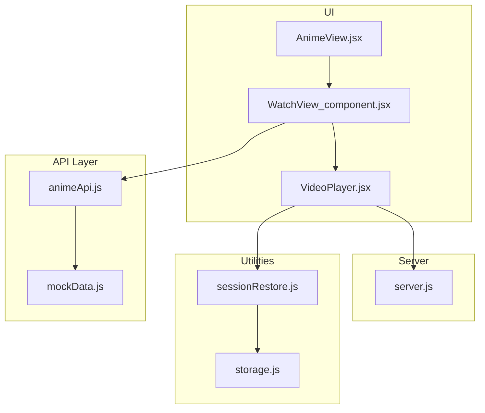
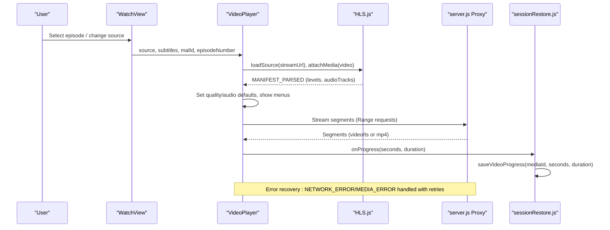
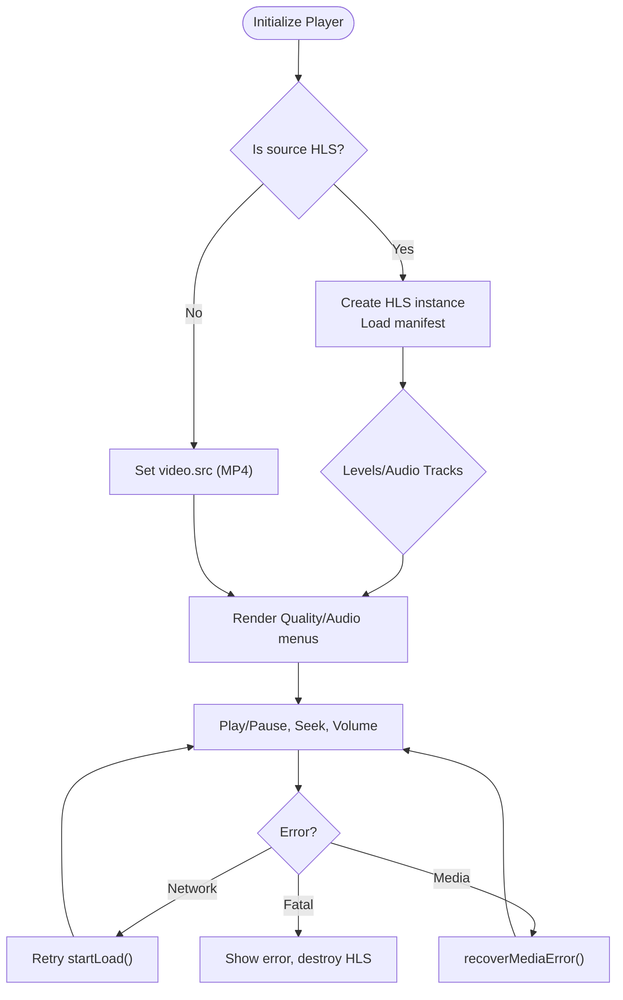
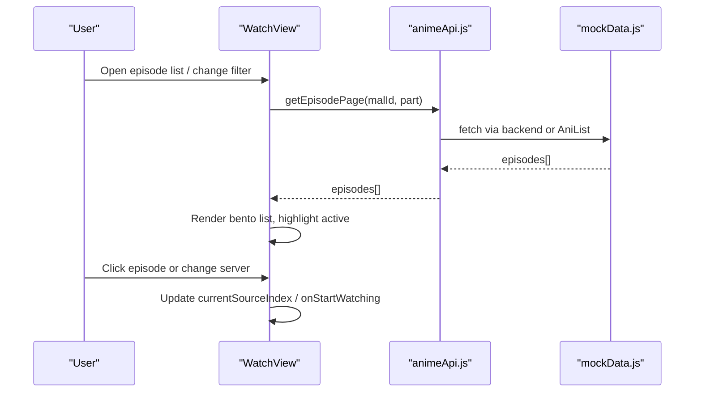
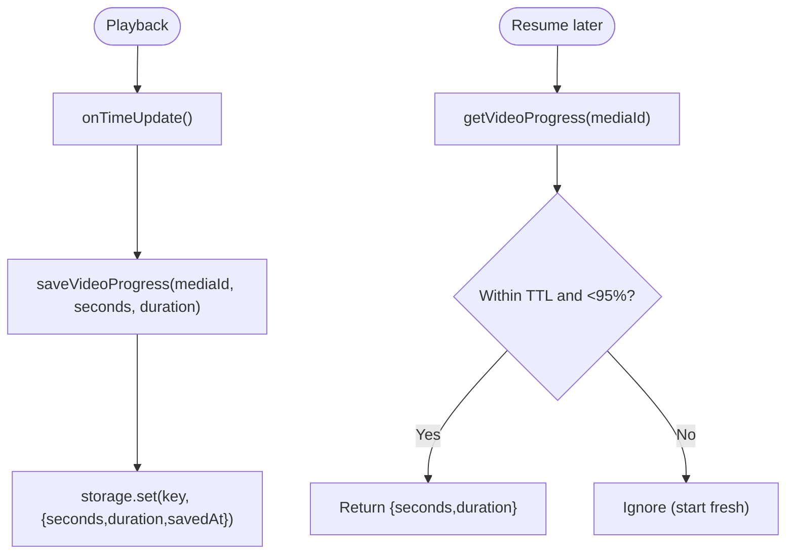
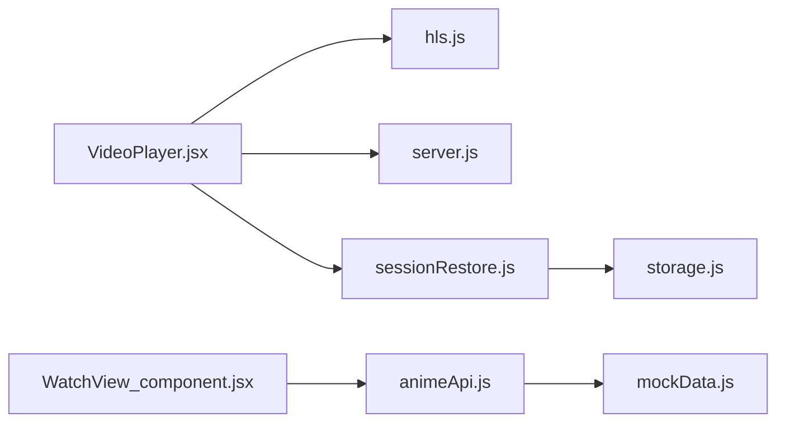

# Episode Management & Streaming

<cite>
**Referenced Files in This Document**
- [VideoPlayer.jsx](file://src/components/VideoPlayer.jsx)
- [WatchView_component.jsx](file://src/WatchView_component.jsx)
- [AnimeView.jsx](file://src/features/anime/components/AnimeView.jsx)
- [animeApi.js](file://src/features/anime/api/animeApi.js)
- [sessionRestore.js](file://src/utils/sessionRestore.js)
- [storage.js](file://src/utils/storage.js)
- [mockData.js](file://src/mockData.js)
- [server.js](file://server.js)
</cite>

## Table of Contents
1. [Introduction](#introduction)
2. [Project Structure](#project-structure)
3. [Core Components](#core-components)
4. [Architecture Overview](#architecture-overview)
5. [Detailed Component Analysis](#detailed-component-analysis)
6. [Dependency Analysis](#dependency-analysis)
7. [Performance Considerations](#performance-considerations)
8. [Troubleshooting Guide](#troubleshooting-guide)
9. [Conclusion](#conclusion)
10. [Appendices](#appendices)

## Introduction
This document explains the episode management and streaming system that powers anime playback across providers. It focuses on:
- The VideoPlayer component built with HLS.js for adaptive bitrate streaming
- Episode navigation, quality selection, and subtitle track switching
- Session restoration to preserve viewing progress and resume capabilities
- Examples for implementing custom streaming endpoints and handling different video formats
- Error recovery mechanisms for failed streams and network interruptions

## Project Structure
The streaming stack spans UI components, utilities, APIs, and a server-side proxy layer:
- VideoPlayer handles playback, controls, quality/audio tracks, subtitles, and error recovery
- WatchView orchestrates episode lists, source selection, and provider fallbacks
- AnimeView provides browsing and “Continue Watching” integration
- sessionRestore and storage persist app state and per-media progress
- mockData exposes API helpers and provider availability checks
- server.js proxies M3U8 streams and VTT subtitles to bypass CORS and handle referer requirements

**Diagram sources**
- [VideoPlayer.jsx:1-282](file://src/components/VideoPlayer.jsx#L1-L282)
- [WatchView_component.jsx:260-382](file://src/WatchView_component.jsx#L260-L382)
- [AnimeView.jsx:45-147](file://src/features/anime/components/AnimeView.jsx#L45-L147)
- [animeApi.js:4-17](file://src/features/anime/api/animeApi.js#L4-L17)
- [mockData.js:79-150](file://src/mockData.js#L79-L150)
- [sessionRestore.js:17-95](file://src/utils/sessionRestore.js#L17-L95)
- [storage.js:29-70](file://src/utils/storage.js#L29-L70)
- [server.js:235-256](file://server.js#L235-L256)
- [server.js:361-390](file://server.js#L361-L390)

**Section sources**
- [VideoPlayer.jsx:1-282](file://src/components/VideoPlayer.jsx#L1-L282)
- [WatchView_component.jsx:260-382](file://src/WatchView_component.jsx#L260-L382)
- [AnimeView.jsx:45-147](file://src/features/anime/components/AnimeView.jsx#L45-L147)
- [animeApi.js:4-17](file://src/features/anime/api/animeApi.js#L4-L17)
- [sessionRestore.js:17-95](file://src/utils/sessionRestore.js#L17-L95)
- [storage.js:29-70](file://src/utils/storage.js#L29-L70)
- [mockData.js:79-150](file://src/mockData.js#L79-L150)
- [server.js:235-256](file://server.js#L235-L256)
- [server.js:361-390](file://server.js#L361-L390)

## Core Components
- VideoPlayer: Adaptive HLS playback, quality/audio track selection, CC toggling, skip intro/end, scrubbing preview, fullscreen/PiP, keyboard shortcuts, and robust error recovery.
- WatchView: Episode list pagination, season/part selection, audio mode (sub/dub/hindi), server/source selector, and provider problem warnings.
- AnimeView: Category chips, trending grids, continue watching row, and quick start into playback.
- sessionRestore + storage: Persistent app session and per-media progress with expiration policies.
- Server proxy: M3U8 stream proxy with Range support and VTT subtitle proxy to avoid CORS issues.

**Section sources**
- [VideoPlayer.jsx:148-282](file://src/components/VideoPlayer.jsx#L148-L282)
- [WatchView_component.jsx:260-382](file://src/WatchView_component.jsx#L260-L382)
- [AnimeView.jsx:45-147](file://src/features/anime/components/AnimeView.jsx#L45-L147)
- [sessionRestore.js:17-95](file://src/utils/sessionRestore.js#L17-L95)
- [storage.js:29-70](file://src/utils/storage.js#L29-L70)
- [server.js:235-256](file://server.js#L235-L256)
- [server.js:361-390](file://server.js#L361-L390)

## Architecture Overview
The player initializes an HLS instance when the source is an m3u8 stream, detects available qualities and audio tracks, and attaches event listeners for error recovery. Non-HLS sources (MP4) are played directly. Subtitles are provided via <track> elements and can be toggled. A server-side proxy ensures reliable streaming and subtitle loading by forwarding requests with correct headers and supporting byte-range requests.

**Diagram sources**
- [VideoPlayer.jsx:148-282](file://src/components/VideoPlayer.jsx#L148-L282)
- [VideoPlayer.jsx:244-261](file://src/components/VideoPlayer.jsx#L244-L261)
- [VideoPlayer.jsx:300-332](file://src/components/VideoPlayer.jsx#L300-L332)
- [sessionRestore.js:63-95](file://src/utils/sessionRestore.js#L63-L95)
- [server.js:361-390](file://server.js#L361-L390)

## Detailed Component Analysis

### VideoPlayer: HLS.js-based adaptive streaming
- Source detection and initialization:
  - Detects HLS vs native HLS vs direct MP4 and sets up accordingly.
  - For HLS, creates an instance with tuned buffer and retry settings, then loads the manifest and attaches media.
- Quality selection:
  - Parses levels from manifest, sorts by height, and exposes Auto/manual selection.
  - Updates current level on user choice.
- Audio track switching:
  - Listens for audio tracks, auto-selects preferred language (e.g., Hindi), and allows manual switching.
- Subtitle track switching:
  - Renders <track> elements for each subtitle; toggles visibility via CC button.
- Episode navigation:
  - Provides previous/next episode buttons wired to parent callbacks.
- Skip Intro/Ending:
  - Fetches AniSkip intervals and highlights markers on timeline; offers a skip action.
- Error recovery:
  - Handles fatal errors with limited retries for network and media errors; falls back to user-visible error and cleanup.
- Progress reporting:
  - Emits periodic progress updates to parent for session persistence.

**Diagram sources**
- [VideoPlayer.jsx:148-282](file://src/components/VideoPlayer.jsx#L148-L282)
- [VideoPlayer.jsx:244-261](file://src/components/VideoPlayer.jsx#L244-L261)

**Section sources**
- [VideoPlayer.jsx:148-282](file://src/components/VideoPlayer.jsx#L148-L282)
- [VideoPlayer.jsx:284-292](file://src/components/VideoPlayer.jsx#L284-L292)
- [VideoPlayer.jsx:300-332](file://src/components/VideoPlayer.jsx#L300-L332)
- [VideoPlayer.jsx:506-521](file://src/components/VideoPlayer.jsx#L506-L521)
- [VideoPlayer.jsx:940-1026](file://src/components/VideoPlayer.jsx#L940-L1026)

### Episode Navigation and Source Selection
- Episode list pagination:
  - Loads episodes in parts; supports filtering (all/canon/filler/recap).
  - Highlights active episode and scrolls into view.
- Season/part selection:
  - Dropdown shows parts for long-running series; switches part and refetches episodes if needed.
- Server/source selector:
  - When multiple sources exist, users can switch servers or qualities exposed by the provider.
- Provider problems:
  - Displays warnings when a provider returns fallback/error/unavailable states.

**Diagram sources**
- [WatchView_component.jsx:78-104](file://src/WatchView_component.jsx#L78-L104)
- [WatchView_component.jsx:183-189](file://src/WatchView_component.jsx#L183-L189)
- [WatchView_component.jsx:368-382](file://src/WatchView_component.jsx#L368-L382)
- [animeApi.js:4-17](file://src/features/anime/api/animeApi.js#L4-L17)

**Section sources**
- [WatchView_component.jsx:78-104](file://src/WatchView_component.jsx#L78-L104)
- [WatchView_component.jsx:183-189](file://src/WatchView_component.jsx#L183-L189)
- [WatchView_component.jsx:368-382](file://src/WatchView_component.jsx#L368-L382)
- [WatchView_component.jsx:119-119](file://src/WatchView_component.jsx#L119-L119)

### Session Restoration and Resume
- App session snapshot:
  - Saves minimal identifiers and titles to restore last view and selections.
  - Expires after 7 days to avoid stale data.
- Per-media progress:
  - Stores seconds and duration keyed by media ID; ignores tiny progress (<5s).
  - Expiration set to 30 days; does not restore if >95% complete.
- Storage abstraction:
  - Uses Capacitor Preferences on native platforms; falls back to localStorage on web.

**Diagram sources**
- [VideoPlayer.jsx:300-332](file://src/components/VideoPlayer.jsx#L300-L332)
- [sessionRestore.js:63-95](file://src/utils/sessionRestore.js#L63-L95)
- [storage.js:29-70](file://src/utils/storage.js#L29-L70)

**Section sources**
- [sessionRestore.js:17-95](file://src/utils/sessionRestore.js#L17-L95)
- [storage.js:29-70](file://src/utils/storage.js#L29-L70)

### Subtitles and Audio Tracks
- Subtitles:
  - Provided as an array of track objects; rendered as <track> elements.
  - Toggle CC visibility globally; default track can be set.
- Audio tracks:
  - Multi-audio HLS streams expose tracks; auto-selects preferred language (e.g., Hindi) and allows manual switching.

**Section sources**
- [VideoPlayer.jsx:284-292](file://src/components/VideoPlayer.jsx#L284-L292)
- [VideoPlayer.jsx:212-237](file://src/components/VideoPlayer.jsx#L212-L237)
- [VideoPlayer.jsx:940-1026](file://src/components/VideoPlayer.jsx#L940-L1026)

### Custom Streaming Endpoints and Formats
- HLS endpoints:
  - Pass URL with .m3u8 or set isM3U8 flag; VideoPlayer will use HLS.js path.
- Native HLS (iOS Safari):
  - If isM3U8 is true and HLS.js is unsupported, uses native playback.
- Direct MP4:
  - Any non-HLS URL plays directly via video.src.
- Server proxy usage:
  - Use server.js endpoints to proxy M3U8 manifests/segments and VTT subtitles to avoid CORS and enforce referers.

Examples:
- To implement a custom HLS endpoint:
  - Return an m3u8 URL through your server proxy to ensure proper headers and Range support.
  - In VideoPlayer, pass source.url and set isM3U8: true.
- To add subtitles:
  - Provide an array of { url, lang, label } where url points to a VTT file proxied via server.js subtitle proxy.

**Section sources**
- [VideoPlayer.jsx:180-282](file://src/components/VideoPlayer.jsx#L180-L282)
- [server.js:235-256](file://server.js#L235-L256)
- [server.js:361-390](file://server.js#L361-L390)

### Performance Considerations
- Buffering and retries:
  - HLS instance configured with generous buffer length and retry limits for manifests, levels, and fragments.
- Range requests:
  - Server forwards Range headers to upstream CDNs to avoid full-file downloads.
- Caching:
  - AniList queries cached in memory with TTL; Hindi dub availability cached to reduce repeated checks.
- UI responsiveness:
  - Debounced control timeouts; skeleton loaders for lists; lazy images for thumbnails.

**Section sources**
- [VideoPlayer.jsx:186-195](file://src/components/VideoPlayer.jsx#L186-L195)
- [server.js:361-390](file://server.js#L361-L390)
- [mockData.js:79-150](file://src/mockData.js#L79-L150)

## Dependency Analysis
- VideoPlayer depends on:
  - HLS.js library for adaptive streaming
  - Parent-provided props for source, subtitles, episode navigation, and progress callback
  - Server proxy for reliable streaming and subtitles
- WatchView depends on:
  - animeApi for fetching episode pages and details
  - mockData for provider availability and AniList access
- sessionRestore depends on:
  - storage abstraction for cross-platform persistence

**Diagram sources**
- [VideoPlayer.jsx:1-282](file://src/components/VideoPlayer.jsx#L1-L282)
- [WatchView_component.jsx:78-104](file://src/WatchView_component.jsx#L78-L104)
- [animeApi.js:4-17](file://src/features/anime/api/animeApi.js#L4-L17)
- [mockData.js:79-150](file://src/mockData.js#L79-L150)
- [sessionRestore.js:17-95](file://src/utils/sessionRestore.js#L17-L95)
- [storage.js:29-70](file://src/utils/storage.js#L29-L70)
- [server.js:235-256](file://server.js#L235-L256)

**Section sources**
- [VideoPlayer.jsx:1-282](file://src/components/VideoPlayer.jsx#L1-L282)
- [WatchView_component.jsx:78-104](file://src/WatchView_component.jsx#L78-L104)
- [animeApi.js:4-17](file://src/features/anime/api/animeApi.js#L4-L17)
- [mockData.js:79-150](file://src/mockData.js#L79-L150)
- [sessionRestore.js:17-95](file://src/utils/sessionRestore.js#L17-L95)
- [storage.js:29-70](file://src/utils/storage.js#L29-L70)
- [server.js:235-256](file://server.js#L235-L256)

## Performance Considerations
- Tune HLS buffering and retries to balance startup time and resilience.
- Prefer server-side proxies for HLS and subtitles to minimize client-side CORS issues and enable efficient Range-based streaming.
- Cache expensive API responses (AniList, Hindi availability) with appropriate TTLs.
- Use skeletons and lazy loading to keep UI responsive during data fetches.

[No sources needed since this section provides general guidance]

## Troubleshooting Guide
Common issues and resolutions:
- Stream fails to load:
  - Check if source URL is valid and accessible via server proxy.
  - Verify HLS support; fall back to iframe or alternative server if necessary.
- Network interruptions:
  - HLS.js automatically retries; ensure server forwards Range headers correctly.
- Media errors:
  - HLS.js attempts recovery; if persistent, reinitialize the player or switch source.
- Subtitles not showing:
  - Ensure VTT files are served via subtitle proxy with correct Content-Type and CORS headers.
- No audio tracks:
  - Confirm multi-audio HLS stream; otherwise rely on separate audio-only sources or dubs.

**Section sources**
- [VideoPlayer.jsx:244-261](file://src/components/VideoPlayer.jsx#L244-L261)
- [server.js:235-256](file://server.js#L235-L256)
- [server.js:361-390](file://server.js#L361-L390)

## Conclusion
The system combines a robust HLS.js-based player with flexible episode navigation, quality and audio track controls, and resilient error recovery. Session restoration ensures users can resume playback seamlessly. Server-side proxies provide reliability for streaming and subtitles across diverse environments. By following the patterns outlined here, you can integrate new providers, optimize performance, and maintain a smooth viewing experience.

[No sources needed since this section summarizes without analyzing specific files]

## Appendices

### Example: Implementing a Custom Streaming Endpoint
- Create a server route that proxies the upstream HLS stream, preserving Range and relevant headers.
- Expose a stable URL to the client; pass it to VideoPlayer with isM3U8: true.
- Optionally provide a fallback iframe for browsers without HLS support.

**Section sources**
- [server.js:361-390](file://server.js#L361-L390)
- [VideoPlayer.jsx:180-282](file://src/components/VideoPlayer.jsx#L180-L282)

### Example: Handling Different Video Formats
- HLS (.m3u8): Use HLS.js path with quality/audio menus.
- Native HLS (iOS Safari): Use direct src with isM3U8 flag.
- MP4: Direct src playback without HLS.

**Section sources**
- [VideoPlayer.jsx:180-282](file://src/components/VideoPlayer.jsx#L180-L282)

### Example: Adding Subtitles
- Provide an array of subtitle tracks with URLs pointing to VTT files.
- Use the server’s subtitle proxy to serve VTT files with correct headers and caching.

**Section sources**
- [VideoPlayer.jsx:284-292](file://src/components/VideoPlayer.jsx#L284-L292)
- [server.js:235-256](file://server.js#L235-L256)