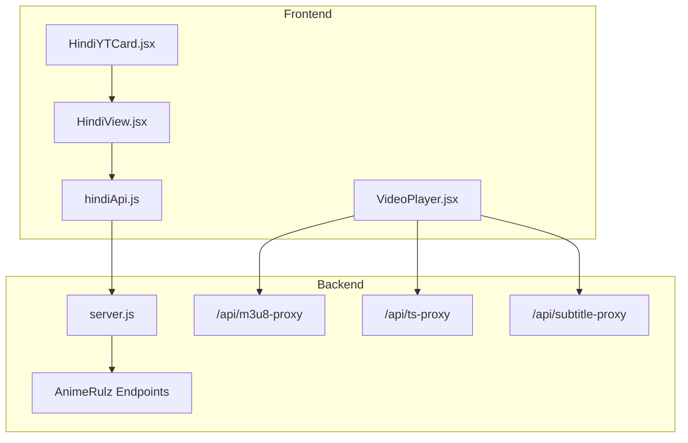
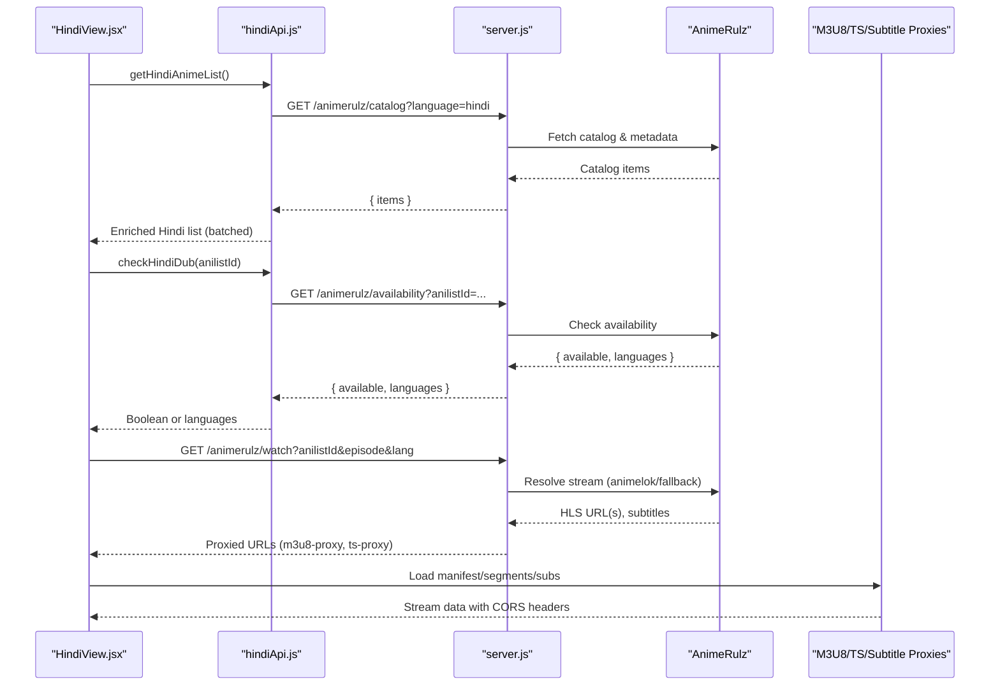
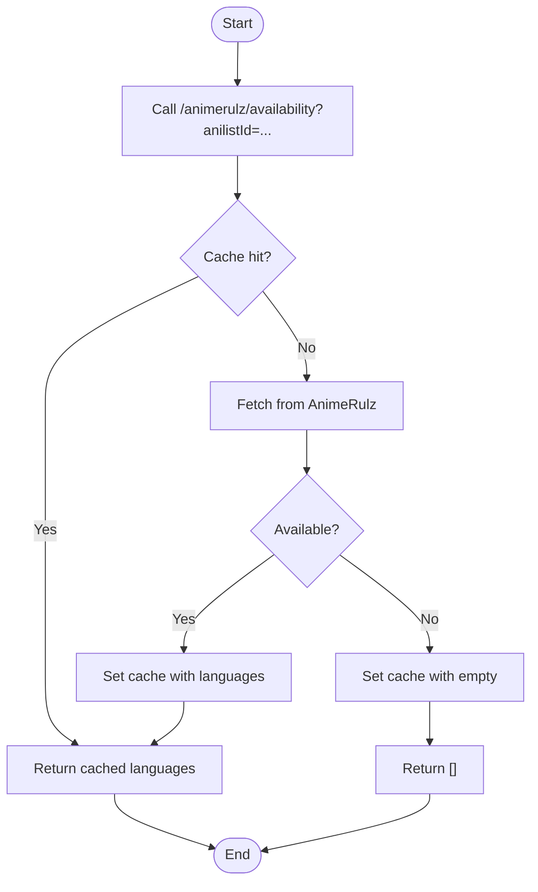
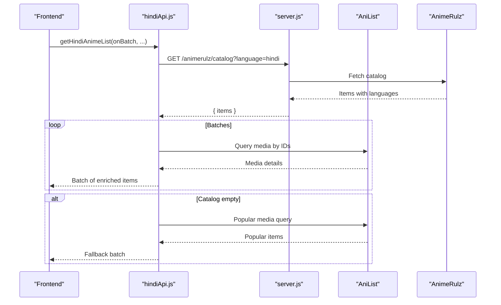
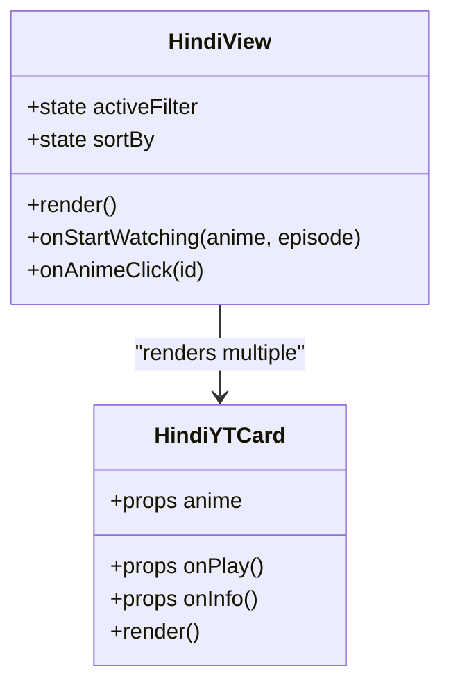
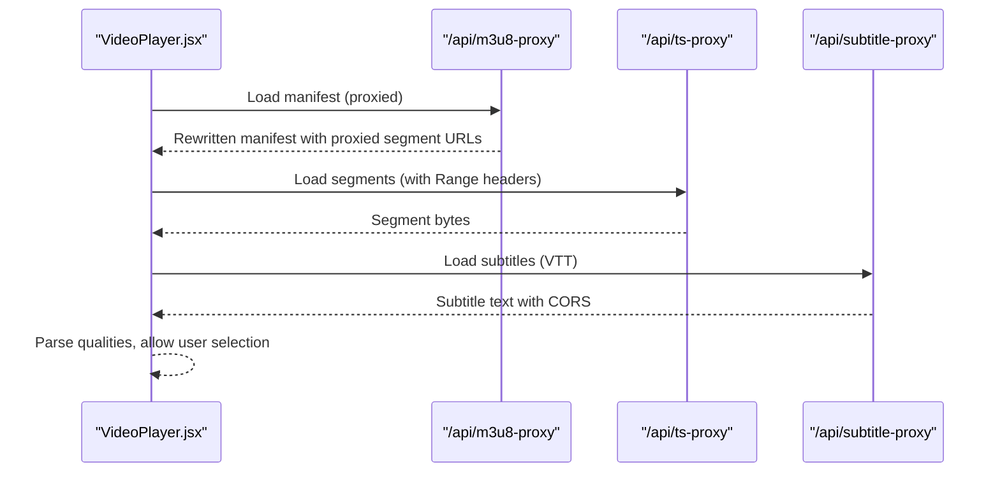
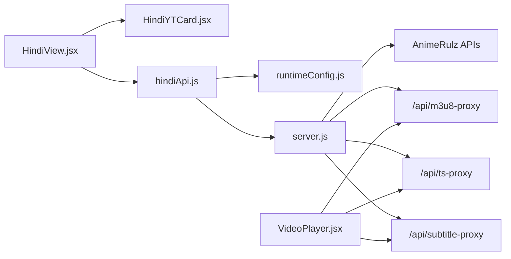

# Hindi Dubbed Content System

<cite>
**Referenced Files in This Document**
- [hindiApi.js](file://src/features/anime/hindi/api/hindiApi.js)
- [HindiView.jsx](file://src/features/anime/hindi/components/HindiView.jsx)
- [HindiYTCard.jsx](file://src/features/anime/hindi/components/HindiYTCard.jsx)
- [server.js](file://server.js)
- [runtimeConfig.js](file://src/runtimeConfig.js)
- [VideoPlayer.jsx](file://src/components/VideoPlayer.jsx)
- [animeApi.js](file://src/features/anime/api/animeApi.js)
</cite>

## Table of Contents
1. [Introduction](#introduction)
2. [Project Structure](#project-structure)
3. [Core Components](#core-components)
4. [Architecture Overview](#architecture-overview)
5. [Detailed Component Analysis](#detailed-component-analysis)
6. [Dependency Analysis](#dependency-analysis)
7. [Performance Considerations](#performance-considerations)
8. [Troubleshooting Guide](#troubleshooting-guide)
9. [Conclusion](#conclusion)
10. [Appendices](#appendices)

## Introduction
This document explains the Hindi dubbed anime system that integrates AnimeRulz and YouTube-style playback with robust subtitle support, CORS handling, and quality selection. It covers how language detection identifies Hindi content, routes requests to the correct backend endpoints, and renders a curated Hindi catalog in the UI. You will also find guidance on adding new Hindi dub sources, implementing custom language detection, extending the Hindi catalog, and configuring HLS quality selection and subtitles.

## Project Structure
The Hindi feature is implemented as a small set of frontend components and API utilities that call a Node/Express backend providing AnimeRulz integration and media proxies:

- Frontend Hindi module
  - API client: fetches Hindi catalog and availability checks
  - UI: HindiView and HindiYTCard for browsing and starting playback
- Backend server
  - AnimeRulz endpoints for catalog, availability, episodes, and watch resolution
  - Media proxies for subtitles and HLS manifests/segments (CORS bypass)
- Runtime configuration
  - Dynamic API base resolution for local/dev/prod environments

**Diagram sources**
- [HindiView.jsx:1-131](file://src/features/anime/hindi/components/HindiView.jsx#L1-L131)
- [HindiYTCard.jsx:1-75](file://src/features/anime/hindi/components/HindiYTCard.jsx#L1-L75)
- [hindiApi.js:1-132](file://src/features/anime/hindi/api/hindiApi.js#L1-L132)
- [server.js:235-393](file://server.js#L235-L393)
- [server.js:1048-1155](file://server.js#L1048-L1155)
- [VideoPlayer.jsx:178-282](file://src/components/VideoPlayer.jsx#L178-L282)

**Section sources**
- [HindiView.jsx:1-131](file://src/features/anime/hindi/components/HindiView.jsx#L1-L131)
- [HindiYTCard.jsx:1-75](file://src/features/anime/hindi/components/HindiYTCard.jsx#L1-L75)
- [hindiApi.js:1-132](file://src/features/anime/hindi/api/hindiApi.js#L1-L132)
- [server.js:235-393](file://server.js#L235-L393)
- [server.js:1048-1155](file://server.js#L1048-L1155)
- [VideoPlayer.jsx:178-282](file://src/components/VideoPlayer.jsx#L178-L282)

## Core Components
- Language detection and routing
  - Availability check via AnimeRulz determines if an anime has Hindi or other Indian languages.
  - Catalog endpoint filters by language to build the Hindi list.
- Hindi-specific API endpoints
  - getHindiAnimeList: fetches AnimeRulz Hindi catalog and enriches with AniList metadata; falls back to popular AniList items when needed.
  - checkHindiDub: checks availability for a given AniList ID and caches results.
- HindiView component
  - Displays a featured banner, genre chips, sorting controls, and a responsive grid of Hindi cards.
  - Delegates playback initiation to a parent handler that uses the video player.
- Playback and subtitles
  - VideoPlayer supports HLS with quality selection and audio track switching.
  - Subtitles are proxied through a dedicated endpoint to avoid CORS blocks.

**Section sources**
- [hindiApi.js:13-41](file://src/features/anime/hindi/api/hindiApi.js#L13-L41)
- [hindiApi.js:47-131](file://src/features/anime/hindi/api/hindiApi.js#L47-L131)
- [HindiView.jsx:5-131](file://src/features/anime/hindi/components/HindiView.jsx#L5-L131)
- [VideoPlayer.jsx:72-282](file://src/components/VideoPlayer.jsx#L72-L282)
- [server.js:1114-1155](file://server.js#L1114-L1155)

## Architecture Overview
The system follows a layered architecture:
- Frontend Hindi module calls backend APIs to retrieve catalog and availability.
- Backend resolves streams from AnimeRulz and proxies media assets to handle CORS and referer requirements.
- Player consumes proxied HLS manifests and segments, enabling quality selection and subtitles.

**Diagram sources**
- [hindiApi.js:47-131](file://src/features/anime/hindi/api/hindiApi.js#L47-L131)
- [server.js:1048-1155](file://server.js#L1048-L1155)
- [server.js:235-393](file://server.js#L235-L393)

## Detailed Component Analysis

### Language Detection Mechanism
- Availability check
  - The frontend calls checkHindiDub which queries the backend availability endpoint.
  - The backend consults the AnimeRulz catalog and returns available languages for the given AniList ID.
  - Results are cached in-memory to reduce repeated network calls.
- Catalog filtering
  - The catalog endpoint accepts a language parameter and returns only items that include that language in their languages array.
  - The frontend then enriches each item with AniList metadata and marks it as having Hindi availability.

**Diagram sources**
- [hindiApi.js:13-41](file://src/features/anime/hindi/api/hindiApi.js#L13-L41)
- [server.js:1114-1128](file://server.js#L1114-L1128)

**Section sources**
- [hindiApi.js:13-41](file://src/features/anime/hindi/api/hindiApi.js#L13-L41)
- [server.js:1114-1128](file://server.js#L1114-L1128)

### Hindi-Specific API Endpoints
- getHindiAnimeList
  - Fetches the AnimeRulz Hindi catalog and batches enrichment via AniList GraphQL.
  - Falls back to popular AniList items if the catalog is empty or unavailable.
  - Returns a sorted list with flags indicating Hindi availability.
- checkHindiDub
  - Checks availability for a specific AniList ID and caches results for a defined TTL.
  - Provides a boolean helper to quickly determine if Hindi is present.

**Diagram sources**
- [hindiApi.js:47-131](file://src/features/anime/hindi/api/hindiApi.js#L47-L131)
- [server.js:1133-1155](file://server.js#L1133-L1155)

**Section sources**
- [hindiApi.js:47-131](file://src/features/anime/hindi/api/hindiApi.js#L47-L131)
- [server.js:1133-1155](file://server.js#L1133-L1155)

### HindiView Component Implementation
- UI features
  - Featured banner with top pick and quick play button.
  - Genre chips for filtering and sort dropdown for popularity/rating.
  - Grid of HindiYTCard components with hover overlays and episode counts.
- Integration points
  - onStartWatching triggers playback using the app’s player.
  - onAnimeClick navigates to detailed view.

**Diagram sources**
- [HindiView.jsx:5-131](file://src/features/anime/hindi/components/HindiView.jsx#L5-L131)
- [HindiYTCard.jsx:5-75](file://src/features/anime/hindi/components/HindiYTCard.jsx#L5-L75)

**Section sources**
- [HindiView.jsx:5-131](file://src/features/anime/hindi/components/HindiView.jsx#L5-L131)
- [HindiYTCard.jsx:5-75](file://src/features/anime/hindi/components/HindiYTCard.jsx#L5-L75)

### YouTube Player Integration and Subtitle Support
- HLS playback
  - VideoPlayer detects HLS streams and initializes HLS.js where supported; otherwise uses native HLS on iOS Safari.
  - Quality levels are parsed from the manifest and exposed to the user for manual selection.
- Subtitles
  - Subtitles are fetched via a proxy endpoint that sets CORS headers and serves VTT content.
  - The player can load subtitles from proxied URLs without cross-origin restrictions.
- Quality selection
  - The player maintains a list of quality levels and current selection, allowing users to switch resolutions dynamically.

**Diagram sources**
- [VideoPlayer.jsx:178-282](file://src/components/VideoPlayer.jsx#L178-L282)
- [server.js:235-256](file://server.js#L235-L256)
- [server.js:263-393](file://server.js#L263-L393)

**Section sources**
- [VideoPlayer.jsx:178-282](file://src/components/VideoPlayer.jsx#L178-L282)
- [server.js:235-256](file://server.js#L235-L256)
- [server.js:263-393](file://server.js#L263-L393)

### Adding New Hindi Dub Sources
To integrate a new Hindi source:
- Backend integration
  - Add logic to resolve streams from the new provider similar to existing AnimeRulz resolution paths.
  - Ensure the provider’s URLs are wrapped through the m3u8-proxy and ts-proxy to handle CORS and referer constraints.
  - Update the watch endpoint to return sources with appropriate language labels and audioMode.
- Frontend exposure
  - If the new source provides different quality options or subtitles, ensure they are surfaced in the response and consumed by the player.
  - Optionally extend the Hindi catalog endpoint to include items from the new source.

**Section sources**
- [server.js:1048-1089](file://server.js#L1048-L1089)
- [server.js:263-393](file://server.js#L263-L393)

### Implementing Custom Language Detection
- Extend availability checks
  - Modify the availability endpoint to incorporate additional providers or language mappings.
  - Update the frontend checkHindiDub to handle new language codes and caching behavior.
- Catalog filtering
  - Adjust the catalog endpoint to filter by new language parameters and expose them in responses.

**Section sources**
- [server.js:1114-1155](file://server.js#L1114-L1155)
- [hindiApi.js:13-41](file://src/features/anime/hindi/api/hindiApi.js#L13-L41)

### Extending the Hindi Content Catalog
- Enrichment pipeline
  - The Hindi catalog fetcher batches AniList queries to enrich items with rich metadata.
  - Fallback to popular AniList items ensures the UI remains populated even if the catalog is empty.
- Sorting and display
  - Items are sorted by popularity; UI supports genre filtering and rating-based sorting.

**Section sources**
- [hindiApi.js:47-131](file://src/features/anime/hindi/api/hindiApi.js#L47-L131)
- [HindiView.jsx:35-131](file://src/features/anime/hindi/components/HindiView.jsx#L35-L131)

## Dependency Analysis
- Frontend dependencies
  - HindiView depends on HindiYTCard for card rendering.
  - hindiApi.js depends on runtimeConfig for API base resolution.
  - animeApi.js re-exports Hindi functions for broader use across the app.
- Backend dependencies
  - server.js orchestrates AnimeRulz endpoints and media proxies.
  - Proxies depend on external CDNs and require proper headers and referers.

**Diagram sources**
- [HindiView.jsx:1-131](file://src/features/anime/hindi/components/HindiView.jsx#L1-L131)
- [HindiYTCard.jsx:1-75](file://src/features/anime/hindi/components/HindiYTCard.jsx#L1-L75)
- [hindiApi.js:1-132](file://src/features/anime/hindi/api/hindiApi.js#L1-L132)
- [runtimeConfig.js:1-163](file://src/runtimeConfig.js#L1-L163)
- [server.js:235-393](file://server.js#L235-L393)
- [server.js:1048-1155](file://server.js#L1048-L1155)
- [VideoPlayer.jsx:178-282](file://src/components/VideoPlayer.jsx#L178-L282)

**Section sources**
- [animeApi.js:1-19](file://src/features/anime/api/animeApi.js#L1-L19)
- [runtimeConfig.js:1-163](file://src/runtimeConfig.js#L1-L163)
- [server.js:235-393](file://server.js#L235-L393)

## Performance Considerations
- Caching
  - In-memory caches for availability checks and AnimeRulz data reduce redundant network calls.
  - Server-side AniList proxy cache mitigates rate limiting and improves response times.
- Batching and streaming
  - Catalog enrichment is batched to minimize GraphQL queries and provide progressive UI updates.
- HLS optimization
  - Proxies forward Range headers for efficient segment loading.
  - Manifest rewriting ensures all resources go through controlled endpoints.

[No sources needed since this section provides general guidance]

## Troubleshooting Guide
- Common issues
  - Missing API_BASE: Verify runtime configuration resolves correctly in dev/prod.
  - CORS errors: Ensure media URLs are proxied through m3u8-proxy and ts-proxy.
  - Subtitles not loading: Confirm subtitle-proxy is used and CORS headers are set.
  - No Hindi content: Check availability endpoint and catalog filtering by language.
- Diagnostics
  - Use health endpoint to inspect service status and configured providers.
  - Inspect logs for AnimeRulz and proxy errors to identify upstream failures.

**Section sources**
- [runtimeConfig.js:82-153](file://src/runtimeConfig.js#L82-L153)
- [server.js:715-735](file://server.js#L715-L735)
- [server.js:235-256](file://server.js#L235-L256)
- [server.js:263-393](file://server.js#L263-L393)

## Conclusion
The Hindi dubbed content system combines AnimeRulz catalog and availability checks with a robust playback layer that handles CORS, subtitles, and quality selection. The modular design allows easy extension to new sources and languages while maintaining performance through caching and batching. Developers can confidently add new Hindi dub sources, implement custom detection logic, and expand the catalog with minimal friction.

[No sources needed since this section summarizes without analyzing specific files]

## Appendices

### API Reference Summary
- Hindi catalog
  - GET /animerulz/catalog?language=hindi&page=&limit=
  - Returns filtered items with language metadata.
- Availability check
  - GET /animerulz/availability?anilistId=
  - Returns available languages for the specified anime.
- Watch resolution
  - GET /animerulz/watch?anilistId=&episode=&lang=
  - Returns proxied HLS URLs and subtitles.

**Section sources**
- [server.js:1048-1155](file://server.js#L1048-L1155)