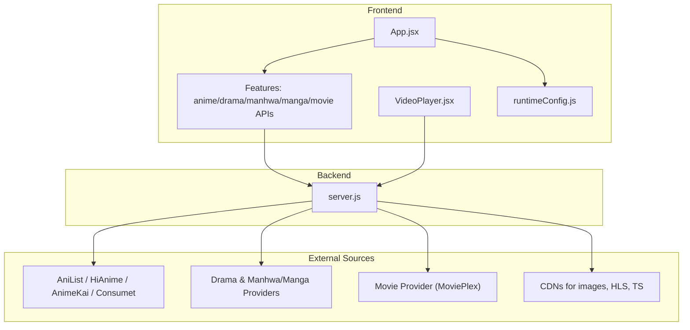
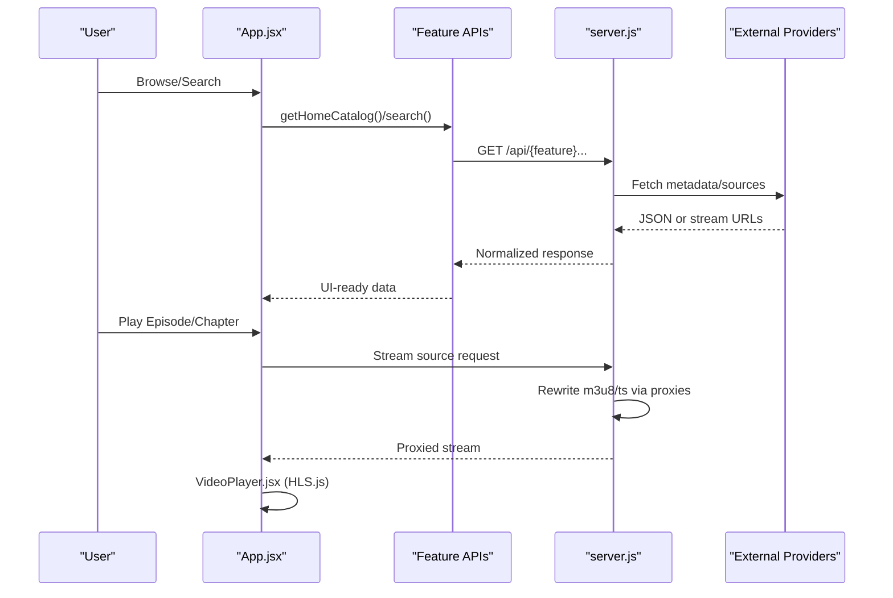
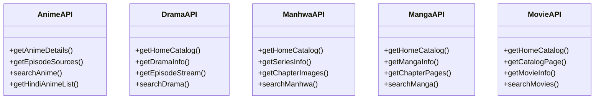
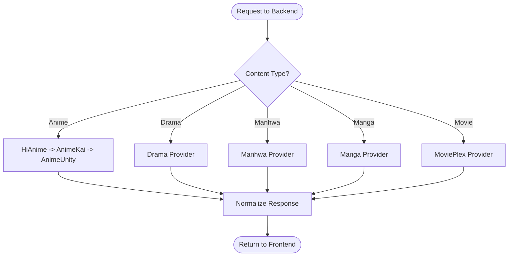
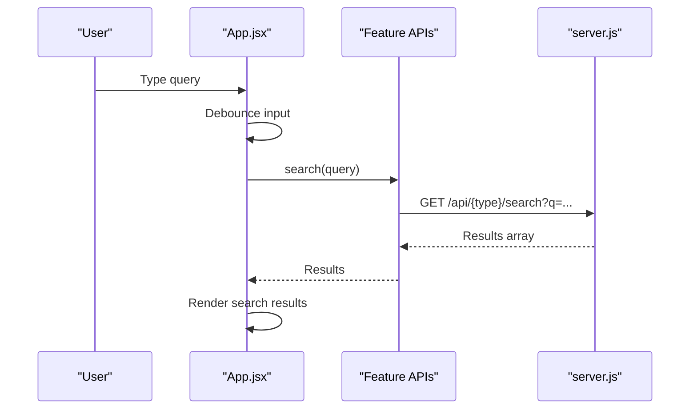
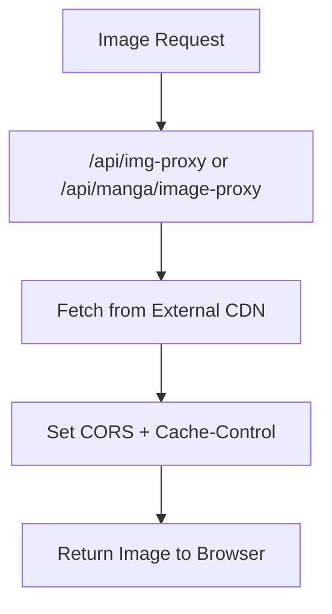
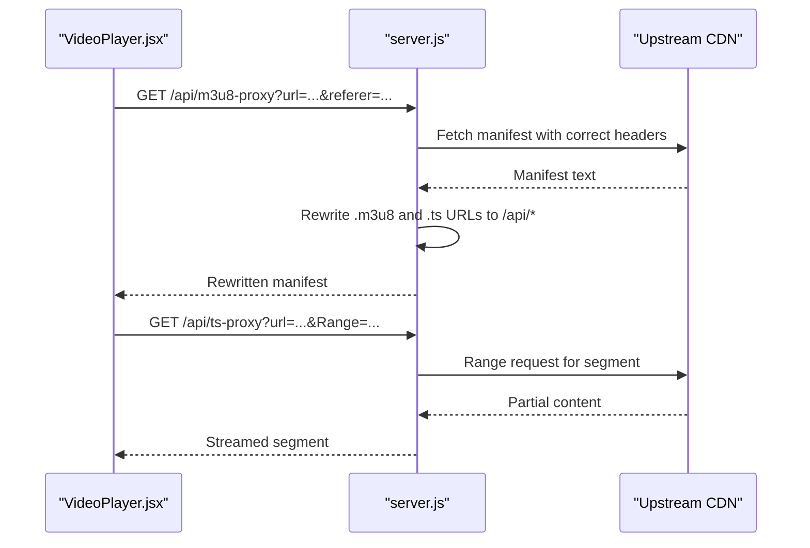

# Content Management

<cite>
**Referenced Files in This Document**
- [App.jsx](file://src/App.jsx)
- [main.jsx](file://src/main.jsx)
- [runtimeConfig.js](file://src/runtimeConfig.js)
- [mockData.js](file://src/mockData.js)
- [animeApi.js](file://src/features/anime/api/animeApi.js)
- [dramaApi.js](file://src/features/drama/api/dramaApi.js)
- [manhwaApi.js](file://src/features/manhwa/api/manhwaApi.js)
- [mangaApi.js](file://src/features/manga/api/mangaApi.js)
- [movieApi.js](file://src/features/movie/api/movieApi.js)
- [VideoPlayer.jsx](file://src/components/VideoPlayer.jsx)
- [server.js](file://server.js)
- [package.json](file://package.json)
- [README.md](file://README.md)
</cite>

## Table of Contents
1. [Introduction](#introduction)
2. [Project Structure](#project-structure)
3. [Core Components](#core-components)
4. [Architecture Overview](#architecture-overview)
5. [Detailed Component Analysis](#detailed-component-analysis)
6. [Dependency Analysis](#dependency-analysis)
7. [Performance Considerations](#performance-considerations)
8. [Troubleshooting Guide](#troubleshooting-guide)
9. [Conclusion](#conclusion)
10. [Appendices](#appendices)

## Introduction
This document explains Project Anime’s multi-format content management system that unifies anime, movies, dramas, manga, and manhwa behind consistent interfaces. It covers the provider pattern with automatic fallbacks, content discovery (search, categories, recommendations), metadata and image handling, streaming integration (quality selection, subtitles), and extensibility for new providers and content types. It also addresses caching, performance optimization, and error handling for unreliable external sources.

## Project Structure
The application is a React + Vite frontend with a Node/Express backend that proxies and scrapes multiple content providers. Feature modules encapsulate APIs and UI per content type, while shared utilities handle runtime configuration, session restore, and device detection. The backend centralizes streaming proxies (HLS manifests, segments, subtitles) and image proxies to bypass CORS and hotlink restrictions.



**Diagram sources**
- [App.jsx:51-445](file://src/App.jsx#L51-L445)
- [runtimeConfig.js:82-153](file://src/runtimeConfig.js#L82-L153)
- [server.js:23-393](file://server.js#L23-L393)

**Section sources**
- [main.jsx:1-15](file://src/main.jsx#L1-L15)
- [package.json:1-45](file://package.json#L1-L45)
- [README.md:1-160](file://README.md#L1-L160)

## Core Components
- Unified content abstraction layer: Each feature module exposes a small API surface (home catalog, detail info, search, episode/chapter retrieval). The app composes these into a consistent browsing experience across formats.
- Provider pattern and fallbacks: The backend orchestrates multiple upstream sources with retries and fallbacks (e.g., AniList via proxy then direct; HiAnime as primary; AnimeKai secondary; Consumet last resort).
- Streaming integration: HLS manifest and segment proxies rewrite URLs so browsers only talk to the backend, enabling quality selection, audio tracks, and subtitle support.
- Metadata and images: Centralized image proxy normalizes and caches images from various sources, avoiding CORS/hotlink blocks.
- Discovery: Search endpoints per feature, category rows on home views, and recommendation hooks integrated into the app state.

**Section sources**
- [animeApi.js:1-20](file://src/features/anime/api/animeApi.js#L1-L20)
- [dramaApi.js:1-33](file://src/features/drama/api/dramaApi.js#L1-L33)
- [manhwaApi.js:1-29](file://src/features/manhwa/api/manhwaApi.js#L1-L29)
- [mangaApi.js:1-29](file://src/features/manga/api/mangaApi.js#L1-L29)
- [movieApi.js:1-32](file://src/features/movie/api/movieApi.js#L1-L32)
- [server.js:213-228](file://server.js#L213-L228)
- [server.js:235-393](file://server.js#L235-L393)

## Architecture Overview
The system separates concerns between frontend features, backend orchestration, and external providers. Runtime configuration resolves the backend base URL dynamically to avoid stale tunnel URLs. The video player integrates HLS.js and leverages backend proxies for robust playback across devices.



**Diagram sources**
- [App.jsx:503-588](file://src/App.jsx#L503-L588)
- [animeApi.js:1-20](file://src/features/anime/api/animeApi.js#L1-L20)
- [dramaApi.js:1-33](file://src/features/drama/api/dramaApi.js#L1-L33)
- [manhwaApi.js:1-29](file://src/features/manhwa/api/manhwaApi.js#L1-L29)
- [mangaApi.js:1-29](file://src/features/manga/api/mangaApi.js#L1-L29)
- [movieApi.js:1-32](file://src/features/movie/api/movieApi.js#L1-L32)
- [server.js:235-393](file://server.js#L235-L393)

## Detailed Component Analysis

### Unified Content Abstraction Layer
Each content type has a dedicated API module that standardizes calls to the backend. The app composes these to present consistent cards, rows, and detail pages.

- Anime: details, episodes, franchises, TV shows, movies, new/popular, search, genres, Hindi dub availability.
- Drama: home catalog, drama info, episode stream, search.
- Manhwa: home catalog, series info, chapter images, search.
- Manga: home catalog, manga info, chapter pages, search.
- Movie: home catalog, paginated catalog, movie info, search.



**Diagram sources**
- [animeApi.js:1-20](file://src/features/anime/api/animeApi.js#L1-L20)
- [dramaApi.js:1-33](file://src/features/drama/api/dramaApi.js#L1-L33)
- [manhwaApi.js:1-29](file://src/features/manhwa/api/manhwaApi.js#L1-L29)
- [mangaApi.js:1-29](file://src/features/manga/api/mangaApi.js#L1-L29)
- [movieApi.js:1-32](file://src/features/movie/api/movieApi.js#L1-L32)

**Section sources**
- [animeApi.js:1-20](file://src/features/anime/api/animeApi.js#L1-L20)
- [dramaApi.js:1-33](file://src/features/drama/api/dramaApi.js#L1-L33)
- [manhwaApi.js:1-29](file://src/features/manhwa/api/manhwaApi.js#L1-L29)
- [mangaApi.js:1-29](file://src/features/manga/api/mangaApi.js#L1-L29)
- [movieApi.js:1-32](file://src/features/movie/api/movieApi.js#L1-L32)

### Provider Pattern and Automatic Fallbacks
The backend implements a layered provider strategy for anime:
- Primary: HiAnime via AniList mapping for precise season/episode resolution.
- Secondary: AnimeKai title-based search for English subs.
- Fallback: Consumet AnimeUnity as last resort.

For other media types, the backend routes requests to appropriate provider endpoints and returns normalized responses.



**Diagram sources**
- [server.js:213-228](file://server.js#L213-L228)

**Section sources**
- [server.js:213-228](file://server.js#L213-L228)

### Content Discovery System
- Search: Each feature API exposes a search method that queries the backend and returns results. The app debounces input and updates search states per section.
- Category browsing: Home catalogs provide featured items and genre/category rows. The app renders these as carousels and grids.
- Recommendations: The app integrates a recommendation utility to suggest related titles based on user context.



**Diagram sources**
- [App.jsx:503-588](file://src/App.jsx#L503-L588)
- [dramaApi.js:24-29](file://src/features/drama/api/dramaApi.js#L24-L29)
- [manhwaApi.js:21-25](file://src/features/manhwa/api/manhwaApi.js#L21-L25)
- [mangaApi.js:21-25](file://src/features/manga/api/mangaApi.js#L21-L25)
- [movieApi.js:24-28](file://src/features/movie/api/movieApi.js#L24-L28)

**Section sources**
- [App.jsx:503-588](file://src/App.jsx#L503-L588)
- [dramaApi.js:24-29](file://src/features/drama/api/dramaApi.js#L24-L29)
- [manhwaApi.js:21-25](file://src/features/manhwa/api/manhwaApi.js#L21-L25)
- [mangaApi.js:21-25](file://src/features/manga/api/mangaApi.js#L21-L25)
- [movieApi.js:24-28](file://src/features/movie/api/movieApi.js#L24-L28)

### Metadata Management and Image Handling
- Metadata normalization: The backend maps provider-specific fields to a common schema used by the frontend (titles, descriptions, ratings, genres, status, episodes/chapters).
- Image proxy: A centralized image proxy fetches images from external CDNs with proper headers and caching, returning them with CORS enabled. It handles protocol-relative URLs and defaults to known hosts when needed.



**Diagram sources**
- [server.js:152-199](file://server.js#L152-L199)

**Section sources**
- [server.js:152-199](file://server.js#L152-L199)

### Streaming Integration: Quality Selection and Subtitles
- HLS manifest and segment proxies rewrite all playlist and segment URLs to route through the backend, ensuring CORS compliance and enabling range requests for fast startup.
- Quality selection: The player detects available levels from the manifest and exposes a quality menu.
- Audio tracks: Multi-audio variants are proxied and selectable where available.
- Subtitles: VTT files are proxied to avoid CORS issues; the player can load them via track elements.



**Diagram sources**
- [VideoPlayer.jsx:178-210](file://src/components/VideoPlayer.jsx#L178-L210)
- [server.js:263-393](file://server.js#L263-L393)

**Section sources**
- [VideoPlayer.jsx:178-210](file://src/components/VideoPlayer.jsx#L178-L210)
- [server.js:263-393](file://server.js#L263-L393)

### Extending the Content Pipeline
- Adding a new content provider:
  - Create a new feature API module under src/features/<type>/api/ with methods for catalog, detail, and search.
  - Add backend routes in server.js to fetch from the provider and normalize responses.
  - Wire up UI components to call the new API and render results consistently with existing patterns.
- Implementing custom content types:
  - Follow the established API contract (home, info, list chapters/pages, search).
  - Use the image proxy for thumbnails and banners.
  - Integrate with the router and state management in App.jsx for navigation and persistence.

[No sources needed since this section provides general guidance]

## Dependency Analysis
The frontend depends on feature APIs which communicate with the backend. The backend depends on external libraries and services for scraping and streaming.

```mermaid
graph LR
FE["App.jsx"] --> APIs["Feature APIs"]
APIs --> BE["server.js"]
BE --> Libs["@consumet/extensions", "cheerio", "axios"]
BE --> Ext["AniList / HiAnime / AnimeKai / Providers"]
FE --> Player["VideoPlayer.jsx"]
Player --> BE
```

**Diagram sources**
- [package.json:14-35](file://package.json#L14-L35)
- [server.js:1-8](file://server.js#L1-L8)

**Section sources**
- [package.json:14-35](file://package.json#L14-L35)
- [server.js:1-8](file://server.js#L1-L8)

## Performance Considerations
- In-memory caching:
  - AniList GraphQL responses cached with TTL to reduce rate limits and network overhead.
  - Hindi availability checks cached to avoid repeated provider probes.
  - HiAnime episode lists cached for short durations.
- Streaming optimizations:
  - Range requests forwarded to minimize bandwidth and improve startup time.
  - HLS.js configured with retry policies and buffer tuning.
- Image caching:
  - Backend sets cache headers for images to reduce repeated fetches.
- Configuration freshness:
  - Runtime config prioritizes dynamic endpoints over build-time values to avoid stale tunnel URLs.

**Section sources**
- [mockData.js:75-150](file://src/mockData.js#L75-L150)
- [mockData.js:17-46](file://src/mockData.js#L17-L46)
- [server.js:226-228](file://server.js#L226-L228)
- [server.js:354-393](file://server.js#L354-L393)
- [runtimeConfig.js:82-153](file://src/runtimeConfig.js#L82-L153)

## Troubleshooting Guide
- No playable source:
  - Ensure backend is reachable and not blocked by provider IP restrictions.
  - Check if fallback providers returned usable streams.
- Video plays but subtitles fail:
  - Verify subtitle proxy endpoint is accessible and CORS is allowed.
- Images not loading:
  - Confirm image proxy is functioning and upstream CDN is reachable.
- Stale backend URL:
  - Update runtime config or environment variables; redeploy if necessary.

**Section sources**
- [server.js:235-256](file://server.js#L235-L256)
- [server.js:152-199](file://server.js#L152-L199)
- [runtimeConfig.js:82-153](file://src/runtimeConfig.js#L82-L153)

## Conclusion
Project Anime’s content management system delivers a unified, resilient experience across multiple media types by abstracting providers behind consistent APIs, implementing robust fallback strategies, and optimizing streaming and metadata delivery. The modular design enables easy extension with new providers and content types while maintaining performance and reliability.

[No sources needed since this section summarizes without analyzing specific files]

## Appendices

### Environment Variables and Deployment Notes
- Frontend uses runtime configuration to resolve the backend base URL dynamically, supporting local development, Vercel deployments, and native APK environments.
- Backend runs on Node/Express with optional relay proxy for provider access and supports CORS for cross-origin requests.

**Section sources**
- [README.md:76-141](file://README.md#L76-L141)
- [runtimeConfig.js:82-153](file://src/runtimeConfig.js#L82-L153)