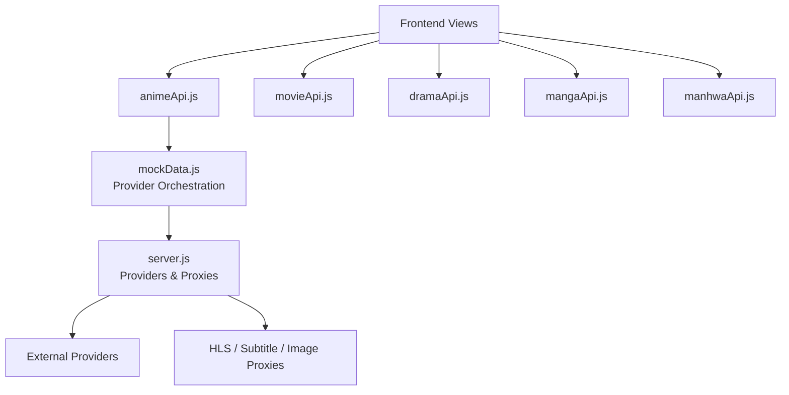
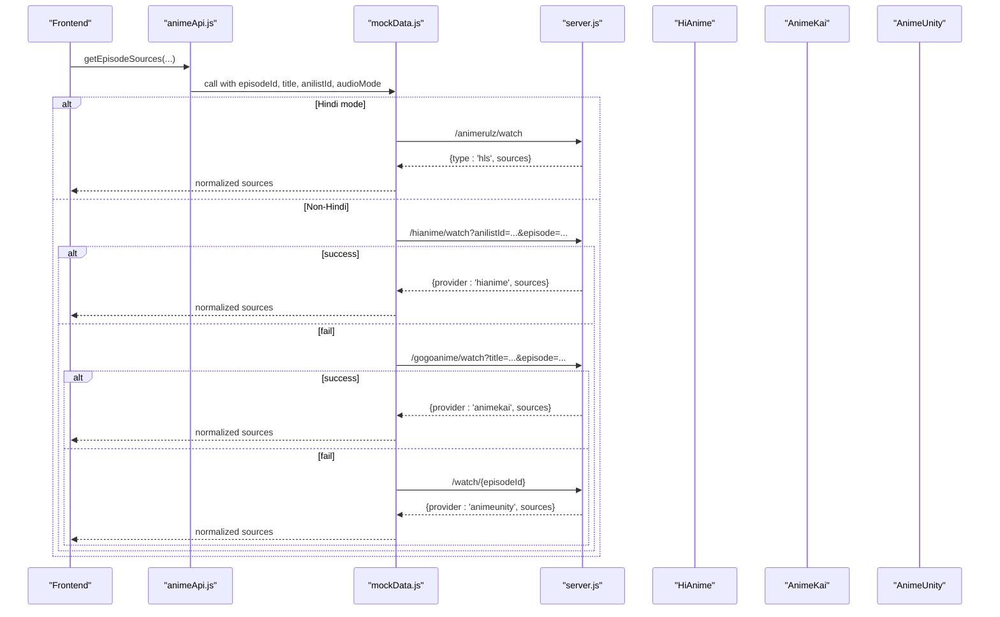
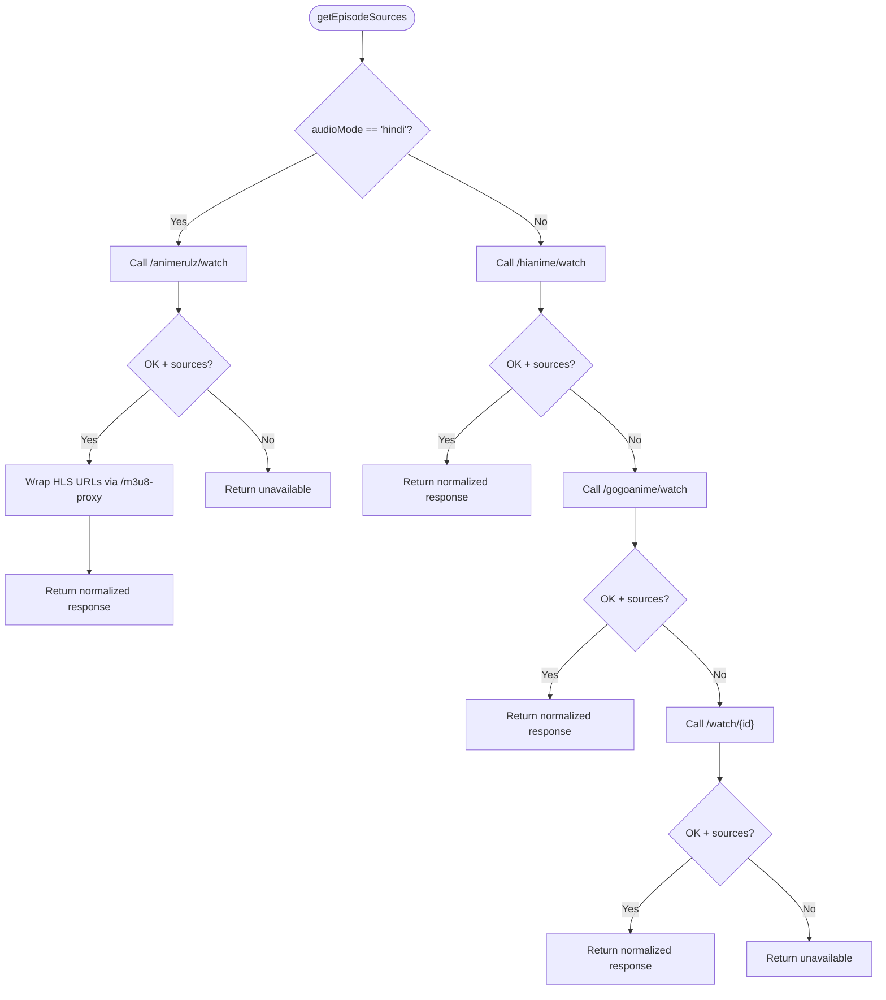
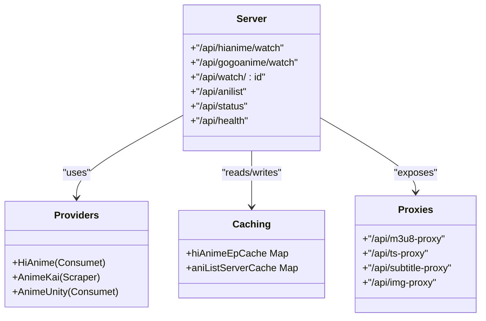
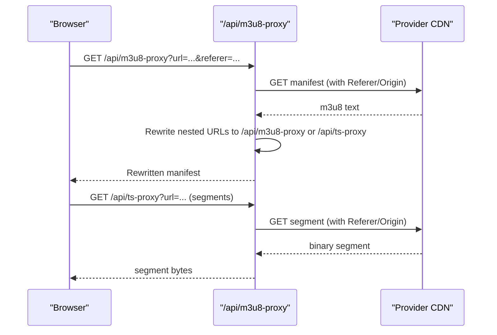
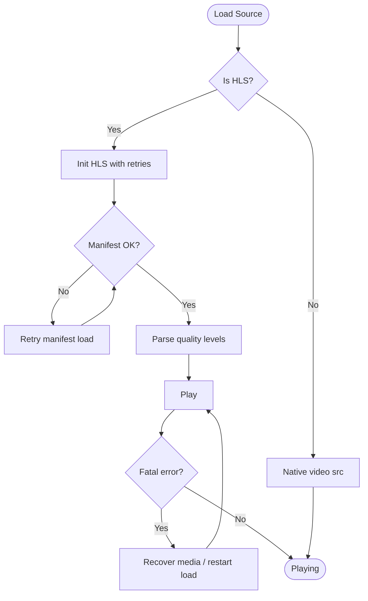
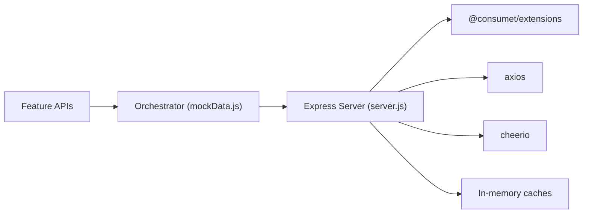

# Content Providers

<cite>
**Referenced Files in This Document**
- [server.js](file://server.js)
- [mockData.js](file://src/mockData.js)
- [animeApi.js](file://src/features/anime/api/animeApi.js)
- [movieApi.js](file://src/features/movie/api/movieApi.js)
- [dramaApi.js](file://src/features/drama/api/dramaApi.js)
- [mangaApi.js](file://src/features/manga/api/mangaApi.js)
- [manhwaApi.js](file://src/features/manhwa/api/manhwaApi.js)
- [VideoPlayer.jsx](file://src/components/VideoPlayer.jsx)
- [runtimeConfig.js](file://src/runtimeConfig.js)
- [index.js](file://api/index.js)
</cite>

## Table of Contents
1. Introduction
2. Project Structure
3. Core Components
4. Architecture Overview
5. Detailed Component Analysis
6. Dependency Analysis
7. Performance Considerations
8. Troubleshooting Guide
9. Conclusion
10. Appendices

## Introduction
This document explains the Content Provider abstraction layer in Project Anime. It covers how multiple streaming sources are unified behind a single interface, how providers are registered and prioritized, how caching and rate limiting protect external APIs, and how errors and retries are handled for unreliable sources. It also includes guidance for implementing custom providers, configuring priorities, debugging connectivity, and addressing security, CORS, and proxy concerns.

## Project Structure
The provider system spans client-side API modules and a Node.js backend:
- Client-side feature APIs expose a consistent interface per content type (anime, movie, drama, manga, manhwa).
- The anime module centralizes multi-provider orchestration with fallbacks and normalization to a unified response shape.
- The backend implements provider integrations (HiAnime via Consumet, AnimeKai title search, AnimeUnity last resort), HLS/proxying, subtitles, image proxies, health/status endpoints, and server-side caching/retries.

**Diagram sources**
- [animeApi.js:1-20](file://src/features/anime/api/animeApi.js#L1-L20)
- [movieApi.js:1-32](file://src/features/movie/api/movieApi.js#L1-L32)
- [dramaApi.js:1-33](file://src/features/drama/api/dramaApi.js#L1-L33)
- [mangaApi.js:1-29](file://src/features/manga/api/mangaApi.js#L1-L29)
- [manhwaApi.js:1-29](file://src/features/manhwa/api/manhwaApi.js#L1-L29)
- [mockData.js:632-818](file://src/mockData.js#L632-L818)
- [server.js:213-228](file://server.js#L213-L228)
- [server.js:235-300](file://server.js#L235-L300)

**Section sources**
- [animeApi.js:1-20](file://src/features/anime/api/animeApi.js#L1-L20)
- [movieApi.js:1-32](file://src/features/movie/api/movieApi.js#L1-L32)
- [dramaApi.js:1-33](file://src/features/drama/api/dramaApi.js#L1-L33)
- [mangaApi.js:1-29](file://src/features/manga/api/mangaApi.js#L1-L29)
- [manhwaApi.js:1-29](file://src/features/manhwa/api/manhwaApi.js#L1-L29)
- [mockData.js:632-818](file://src/mockData.js#L632-L818)
- [server.js:213-228](file://server.js#L213-L228)
- [server.js:235-300](file://server.js#L235-L300)

## Core Components
- Unified content interfaces per feature: each feature exposes a small API object that calls backend endpoints consistently.
- Anime provider orchestrator: selects providers by priority, normalizes responses, and applies fallbacks.
- Backend provider layer: integrates HiAnime (via Consumet), AnimeKai, AnimeUnity; provides HLS/subtitle/image proxies; caches and retries.
- Player integration: consumes normalized source objects and handles HLS playback with built-in retry logic.

Key responsibilities:
- Standardize data shapes across providers (sources, subtitles, headers, language metadata).
- Provide automatic fallback when a primary provider fails or returns no playable stream.
- Protect against rate limits and network errors with caching and retries.
- Normalize CORS and referer requirements through server-side proxies.

**Section sources**
- [animeApi.js:1-20](file://src/features/anime/api/animeApi.js#L1-L20)
- [mockData.js:632-818](file://src/mockData.js#L632-L818)
- [server.js:213-228](file://server.js#L213-L228)
- [server.js:235-300](file://server.js#L235-L300)
- [VideoPlayer.jsx:178-282](file://src/components/VideoPlayer.jsx#L178-L282)

## Architecture Overview
The provider architecture uses a layered approach:
- Frontend feature APIs call backend endpoints.
- The anime orchestrator tries providers in order: AnimeRulz (Hindi), HiAnime (primary), AnimeKai (fallback), AnimeUnity (last resort).
- The backend integrates providers via Consumet and direct scraping, then proxies media assets and subtitles to satisfy CORS and referer constraints.
- HLS manifests and segments are proxied to ensure reliable playback across browsers and platforms.

**Diagram sources**
- [animeApi.js:1-20](file://src/features/anime/api/animeApi.js#L1-L20)
- [mockData.js:632-818](file://src/mockData.js#L632-L818)
- [server.js:213-228](file://server.js#L213-L228)

## Detailed Component Analysis

### Anime Provider Orchestrator (Client-Side)
- Purpose: Centralize provider selection, normalize responses, and apply fallbacks for episodes.
- Behavior:
  - If audioMode is Hindi, it requests AnimeRulz and wraps HLS URLs through the backend proxy to avoid CORS issues.
  - Otherwise, it tries HiAnime first using AniList ID for deterministic season/episode mapping.
  - Falls back to AnimeKai title search if HiAnime fails or returns no sources.
  - Last resort: AnimeUnity via Consumet endpoint.
- Normalization: Returns a consistent object with provider name, type, sources array, subtitles, headers, and language metadata.

**Diagram sources**
- [mockData.js:632-818](file://src/mockData.js#L632-L818)

**Section sources**
- [mockData.js:632-818](file://src/mockData.js#L632-L818)

### Backend Provider Layer
- Provider registration:
  - Primary: HiAnime via META.Anilist (Consumet) for precise AniList ID mapping.
  - Secondary: AnimeKai via title search.
  - Fallback: AnimeUnity via Consumet.
- Episode list cache: HiAnime episode lists cached per AniList ID with TTL.
- Health and status:
  - /api/health reports configured providers and environment.
  - /api/status probes external services and returns aggregated status.

**Diagram sources**
- [server.js:213-228](file://server.js#L213-L228)
- [server.js:1158-1209](file://server.js#L1158-L1209)
- [server.js:713-726](file://server.js#L713-L726)
- [server.js:1304-1336](file://server.js#L1304-L1336)
- [server.js:235-300](file://server.js#L235-L300)

**Section sources**
- [server.js:213-228](file://server.js#L213-L228)
- [server.js:1158-1209](file://server.js#L1158-L1209)
- [server.js:713-726](file://server.js#L713-L726)
- [server.js:1304-1336](file://server.js#L1304-L1336)

### HLS and Subtitle Proxies
- HLS manifest and segment proxy:
  - Rewrites nested playlist and segment URLs so the browser only talks to the backend.
  - Handles referer and origin requirements for protected CDNs.
  - Unwraps previously proxied URLs to prevent loops.
- Subtitle proxy:
  - Fetches VTT files from external CDNs and serves them with CORS headers.
- Image proxy:
  - Serves images with appropriate headers and caching, bypassing hotlink restrictions.

**Diagram sources**
- [server.js:263-300](file://server.js#L263-L300)
- [server.js:74-148](file://server.js#L74-L148)

**Section sources**
- [server.js:263-300](file://server.js#L263-L300)
- [server.js:74-148](file://server.js#L74-L148)

### Player Integration and Retry Logic
- Video player consumes normalized sources and supports HLS with built-in retry settings.
- On fatal network or media errors, it attempts recovery up to configured limits before surfacing an error.
- For non-HLS streams, it falls back to native playback.

**Diagram sources**
- [VideoPlayer.jsx:178-282](file://src/components/VideoPlayer.jsx#L178-L282)

**Section sources**
- [VideoPlayer.jsx:178-282](file://src/components/VideoPlayer.jsx#L178-L282)

### Feature APIs (Unified Interfaces)
Each feature exposes a simple API object that calls backend endpoints consistently:
- Anime: delegates to centralized orchestrator.
- Movie, Drama, Manga, Manhwa: fetch catalogs, info, chapters/pages, and search results via backend routes.

These modules standardize error handling and return values, making it easy to swap or extend providers on the backend without changing UI code.

**Section sources**
- [animeApi.js:1-20](file://src/features/anime/api/animeApi.js#L1-L20)
- [movieApi.js:1-32](file://src/features/movie/api/movieApi.js#L1-L32)
- [dramaApi.js:1-33](file://src/features/drama/api/dramaApi.js#L1-L33)
- [mangaApi.js:1-29](file://src/features/manga/api/mangaApi.js#L1-L29)
- [manhwaApi.js:1-29](file://src/features/manhwa/api/manhwaApi.js#L1-L29)

## Dependency Analysis
- Client dependencies:
  - Feature APIs depend on runtime configuration for base URL resolution.
  - Anime API depends on the orchestrator in mockData.js for provider selection.
- Server dependencies:
  - Express app with CORS enabled.
  - Consumet extensions for standardized provider access.
  - Axios for HTTP requests with custom headers and timeouts.
  - Cheerio for HTML parsing where needed.
  - In-memory caches for AniList and HiAnime episode lists.

**Diagram sources**
- [animeApi.js:1-20](file://src/features/anime/api/animeApi.js#L1-L20)
- [mockData.js:632-818](file://src/mockData.js#L632-L818)
- [server.js:1-20](file://server.js#L1-L20)
- [server.js:213-228](file://server.js#L213-L228)
- [server.js:1158-1209](file://server.js#L1158-L1209)

**Section sources**
- [server.js:1-20](file://server.js#L1-L20)
- [server.js:213-228](file://server.js#L213-L228)
- [server.js:1158-1209](file://server.js#L1158-L1209)

## Performance Considerations
- Caching strategies:
  - Client-side in-memory cache for AniList queries with TTL.
  - Server-side AniList GraphQL proxy cache with TTL and retry on 429.
  - HiAnime episode list cache keyed by AniList ID with TTL.
- Rate limiting protection:
  - Exponential backoff and retries for 429 responses on AniList proxy.
  - Provider probing with timeouts to detect degraded states quickly.
- Network efficiency:
  - HLS proxy rewrites nested URLs to minimize cross-origin requests.
  - Subtitle and image proxies reduce CORS overhead and enable caching.

[No sources needed since this section provides general guidance]

## Troubleshooting Guide
Common issues and diagnostics:
- No playable source:
  - Check provider availability via /api/status (deep probe optional).
  - Verify backend logs for provider-specific errors during episode source resolution.
- HLS playback failures:
  - Inspect HLS retry behavior in the player and confirm proxy endpoints are reachable.
  - Ensure referer and Origin headers are set correctly by the proxy.
- Rate-limited metadata:
  - AniList proxy will retry and serve cached data; check /api/anilist behavior and cache TTL.
- Connectivity:
  - Use /api/health to verify service uptime and configured providers.
  - Validate CORS_ORIGIN environment variable and frontend base URL configuration.

**Section sources**
- [server.js:713-726](file://server.js#L713-L726)
- [server.js:1304-1336](file://server.js#L1304-L1336)
- [server.js:1158-1209](file://server.js#L1158-L1209)
- [VideoPlayer.jsx:178-282](file://src/components/VideoPlayer.jsx#L178-L282)

## Conclusion
Project Anime’s Content Provider abstraction delivers a resilient, unified streaming experience by combining multiple providers with automatic fallbacks, robust caching, and comprehensive proxying. The design isolates provider complexity behind stable interfaces, enabling seamless integration of new sources while maintaining reliability and performance.

[No sources needed since this section summarizes without analyzing specific files]

## Appendices

### Implementing a Custom Content Provider
Steps:
- Add a backend route that resolves a provider-specific endpoint and returns a normalized response (provider name, type, sources, subtitles, headers, language metadata).
- Integrate into the orchestrator flow in the anime module to try your provider at the desired priority.
- If your provider requires special headers or referers, add corresponding proxy logic in the backend.
- Update /api/status to include your provider in probes for observability.

**Section sources**
- [mockData.js:632-818](file://src/mockData.js#L632-L818)
- [server.js:213-228](file://server.js#L213-L228)
- [server.js:1304-1336](file://server.js#L1304-L1336)

### Configuring Provider Priorities
- Priority is enforced in the orchestrator: AnimeRulz (Hindi), HiAnime (primary), AnimeKai (fallback), AnimeUnity (last resort).
- To change priorities, reorder the conditional checks in the orchestrator function.
- Ensure each provider returns a compatible normalized structure to maintain consistency.

**Section sources**
- [mockData.js:632-818](file://src/mockData.js#L632-L818)

### Debugging Provider Connectivity
- Use /api/status to test reachability of external providers and keys.
- Review backend logs for provider-specific errors and retry behavior.
- For HLS issues, inspect proxy logs and verify referer/Origin handling.

**Section sources**
- [server.js:1304-1336](file://server.js#L1304-L1336)
- [server.js:74-148](file://server.js#L74-L148)

### Security Considerations, CORS, and Proxy Configuration
- CORS:
  - Backend enables CORS with configurable origin; ensure production sets a restrictive origin.
  - Proxies for HLS, subtitles, and images set appropriate Access-Control-Allow-Origin headers.
- Referer and Origin:
  - Proxies inject correct Referer and Origin for protected CDNs; validate target domains and avoid leaking sensitive origins.
- Proxy safety:
  - Unwrap previously proxied URLs to prevent loops.
  - Limit max depth for unwrapping to mitigate abuse.
- Environment:
  - Configure CORS_ORIGIN and provider base URLs via environment variables.
  - Use runtime configuration to override backend base URL safely.

**Section sources**
- [server.js:1-20](file://server.js#L1-L20)
- [server.js:32-70](file://server.js#L32-L70)
- [server.js:235-300](file://server.js#L235-L300)
- [runtimeConfig.js:32-71](file://src/runtimeConfig.js#L32-L71)