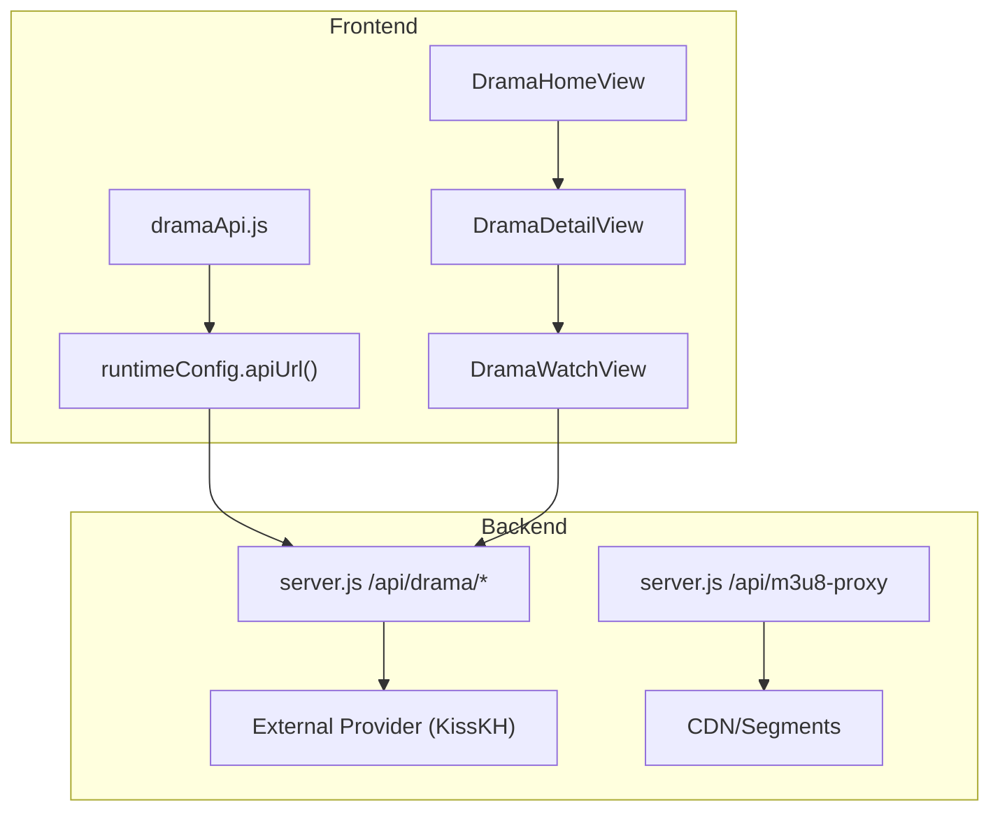
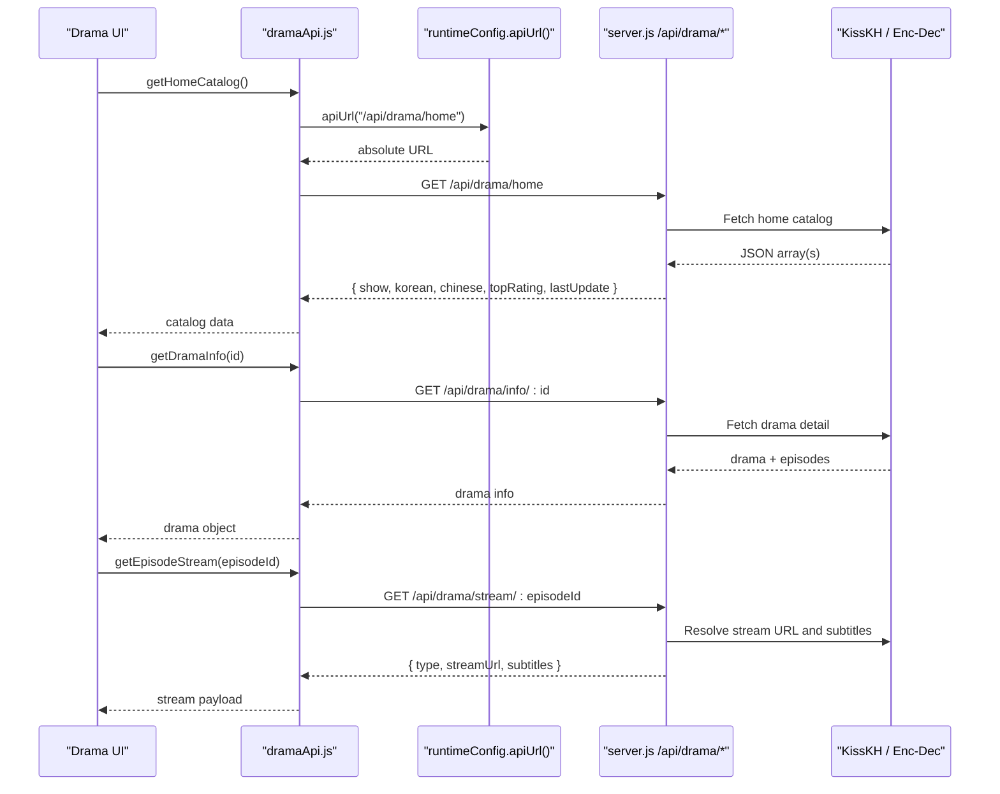
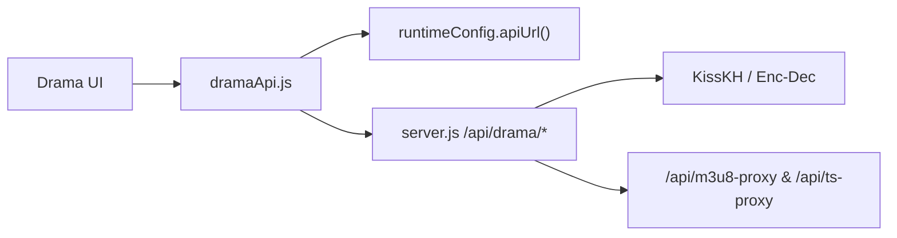

# Drama API Layer

<cite>
**Referenced Files in This Document**
- [dramaApi.js](file://src/features/drama/api/dramaApi.js)
- [runtimeConfig.js](file://src/runtimeConfig.js)
- [server.js](file://server.js)
- [DramaHomeView.jsx](file://src/features/drama/components/DramaHomeView.jsx)
- [DramaDetailView.jsx](file://src/features/drama/components/DramaDetailView.jsx)
- [DramaWatchView.jsx](file://src/features/drama/components/DramaWatchView.jsx)
</cite>

## Table of Contents
1. [Introduction](#introduction)
2. [Project Structure](#project-structure)
3. [Core Components](#core-components)
4. [Architecture Overview](#architecture-overview)
5. [Detailed Component Analysis](#detailed-component-analysis)
6. [Dependency Analysis](#dependency-analysis)
7. [Performance Considerations](#performance-considerations)
8. [Troubleshooting Guide](#troubleshooting-guide)
9. [Conclusion](#conclusion)
10. [Appendices](#appendices)

## Introduction
This document describes the Drama API layer responsible for fetching drama-related data and communicating with the backend. It covers four primary methods:
- getHomeCatalog: retrieves featured and categorized drama listings
- getDramaInfo: fetches series details including episodes
- getEpisodeStream: obtains streaming URLs (HLS or MP4) and subtitles
- searchDrama: performs content discovery by query

It also explains error handling patterns, response structures, runtime configuration integration, URL construction strategies, parameter encoding, and guidance for adding new sources and optimizing caching.

## Project Structure
The Drama API layer spans client-side API calls and server-side routes:
- Client API module exposes four methods that call backend endpoints via a centralized URL builder
- Runtime configuration resolves the API base URL dynamically at runtime
- Server routes proxy to external providers (e.g., KissKH), cache results, and normalize responses

**Diagram sources**
- [dramaApi.js:1-32](file://src/features/drama/api/dramaApi.js#L1-L32)
- [runtimeConfig.js:82-153](file://src/runtimeConfig.js#L82-L153)
- [server.js:1863-2043](file://server.js#L1863-L2043)

**Section sources**
- [dramaApi.js:1-32](file://src/features/drama/api/dramaApi.js#L1-L32)
- [runtimeConfig.js:1-163](file://src/runtimeConfig.js#L1-L163)
- [server.js:1863-2043](file://server.js#L1863-L2043)

## Core Components
- dramaApi.js: Exposes getHomeCatalog, getDramaInfo, getEpisodeStream, searchDrama; uses runtimeConfig.apiUrl to build absolute URLs; handles HTTP errors consistently
- runtimeConfig.js: Resolves API_BASE from multiple sources and provides apiUrl(path) for consistent endpoint construction
- server.js: Implements /api/drama/* endpoints, caches responses, proxies HLS streams, and normalizes subtitle URLs

Key responsibilities:
- URL construction: all paths are prefixed with /api and resolved against a dynamic base
- Parameter encoding: IDs and queries are encoded using encodeURIComponent
- Error handling: non-ok responses throw or return safe defaults; server returns structured error objects on failures

**Section sources**
- [dramaApi.js:1-32](file://src/features/drama/api/dramaApi.js#L1-L32)
- [runtimeConfig.js:82-153](file://src/runtimeConfig.js#L82-L153)
- [server.js:1863-2043](file://server.js#L1863-L2043)

## Architecture Overview
The flow from UI to backend and provider is as follows:
- UI components call dramaApi methods
- dramaApi builds URLs via runtimeConfig.apiUrl and performs fetch
- Backend routes handle requests, apply caching, and forward to external APIs
- For HLS content, backend proxies manifests and segments to bypass CORS and enforce referers

**Diagram sources**
- [dramaApi.js:5-29](file://src/features/drama/api/dramaApi.js#L5-L29)
- [runtimeConfig.js:149-153](file://src/runtimeConfig.js#L149-L153)
- [server.js:1863-2017](file://server.js#L1863-L2017)

## Detailed Component Analysis

### Frontend API Module: dramaApi.js
- getHomeCatalog: Calls /api/drama/home; throws on non-ok; returns JSON catalog
- getDramaInfo: Calls /api/drama/info/:id with id encoded; throws on non-ok; returns drama details
- getEpisodeStream: Calls /api/drama/stream/:episodeId with episodeId encoded; throws on non-ok; returns stream metadata
- searchDrama: Calls /api/drama/search?q=...; returns empty array on failure; ensures result is an array

URL construction and encoding:
- All paths are normalized and prefixed with /api
- Parameters are encoded with encodeURIComponent to ensure safe transport

Error handling:
- Non-ok responses throw descriptive errors for catalog/info/stream
- Search gracefully returns [] on failure to avoid breaking UI

Integration with runtime configuration:
- Uses apiUrl(path) to resolve absolute URLs based on runtime-config resolution

**Section sources**
- [dramaApi.js:1-32](file://src/features/drama/api/dramaApi.js#L1-L32)
- [runtimeConfig.js:149-153](file://src/runtimeConfig.js#L149-L153)

### Runtime Configuration: runtimeConfig.js
- loadRuntimeConfig: Determines API_BASE from query override, serverless config, static config, build-time env, and local dev detection
- getApiBase: Returns resolved base for synchronous callers
- apiUrl(path): Normalizes path and prepends base if present; otherwise returns relative path

Behavior highlights:
- No localStorage usage; avoids stale URLs
- Strips trailing slashes and cleans values
- On Vercel production, strips localhost values to prevent misrouting
- In Capacitor APK, falls back to a tunnel when no base is configured

**Section sources**
- [runtimeConfig.js:1-163](file://src/runtimeConfig.js#L1-L163)

### Backend Routes: server.js (/api/drama/*)
- /api/drama/home: Aggregates multiple categories (show, korean, chinese, topRating, lastUpdate); caches results; returns normalized arrays
- /api/drama/list: Paginated list with optional query and type filters; cached per key
- /api/drama/search: Validates q; forwards to provider; returns provider’s search result shape
- /api/drama/info/:dramaId: Fetches drama detail and episodes; caches by dramaId
- /api/drama/stream/:episodeId: Resolves video URL and subtitles; wraps HLS in m3u8-proxy; caches stream result
- /api/drama/subtitle?url=: Proxies subtitle files, ensuring WEBVTT format and CORS headers

Caching strategy:
- Home, list, info, and stream endpoints use in-memory caches with TTLs
- Keys include identifiers like dramaId or episodeId to scope cache entries

Provider integration:
- KissKH endpoints used for catalogs, details, and streams
- Enc-dec service used to obtain keys required for stream access

HLS handling:
- If stream is HLS (.m3u8), backend rewrites URLs through /api/m3u8-proxy to manage referers and segment requests

**Section sources**
- [server.js:1863-2043](file://server.js#L1863-L2043)

### UI Integration: Drama Views
- DramaHomeView: Displays hero, rows for categories, and search results; relies on catalog structure returned by /api/drama/home
- DramaDetailView: Shows synopsis and episodes grid; triggers watch flow with selected episode
- DramaWatchView: Renders player with stream payload; manages subtitle selection and episode navigation

Data expectations:
- Catalog: { show, korean, chinese, topRating, lastUpdate }
- Drama info: { title, description, thumbnail, releaseDate, country, status, episodes[] }
- Stream: { type: 'hls'|'mp4', streamUrl, subtitles[] }

**Section sources**
- [DramaHomeView.jsx:1-131](file://src/features/drama/components/DramaHomeView.jsx#L1-L131)
- [DramaDetailView.jsx:1-74](file://src/features/drama/components/DramaDetailView.jsx#L1-L74)
- [DramaWatchView.jsx:1-103](file://src/features/drama/components/DramaWatchView.jsx#L1-L103)

## Dependency Analysis
- dramaApi depends on runtimeConfig.apiUrl for URL resolution
- UI components depend on dramaApi for data fetching and on views for rendering
- Backend routes depend on external services (KissKH, enc-dec) and internal helpers (proxying, caching)
- HLS playback depends on /api/m3u8-proxy and /api/ts-proxy for CORS and referer handling

**Diagram sources**
- [dramaApi.js:1-32](file://src/features/drama/api/dramaApi.js#L1-L32)
- [runtimeConfig.js:149-153](file://src/runtimeConfig.js#L149-L153)
- [server.js:1863-2043](file://server.js#L1863-L2043)

**Section sources**
- [dramaApi.js:1-32](file://src/features/drama/api/dramaApi.js#L1-L32)
- [runtimeConfig.js:149-153](file://src/runtimeConfig.js#L149-L153)
- [server.js:1863-2043](file://server.js#L1863-L2043)

## Performance Considerations
- Use backend caching: rely on in-memory caches for home, list, info, and stream endpoints to reduce external calls
- Prefer searchDrama for lightweight discovery; it returns empty arrays on failure to avoid blocking UI
- For HLS playback, leverage /api/m3u8-proxy to minimize bandwidth and enable range requests via /api/ts-proxy
- Avoid redundant requests: cache results in UI state where appropriate (e.g., drama info while browsing episodes)
- Tune TTLs: adjust cache durations in server code based on update frequency of provider data

[No sources needed since this section provides general guidance]

## Troubleshooting Guide
Common issues and resolutions:
- Network errors on frontend:
  - getHomeCatalog/getDramaInfo/getEpisodeStream throw on non-ok responses; wrap calls in try/catch and display user-friendly messages
  - searchDrama returns [] on failure; ensure UI handles empty results gracefully
- Backend errors:
  - 502 responses indicate upstream provider failures; check logs and provider availability
  - Missing parameters (e.g., q or url) return 400; validate inputs before calling
- HLS playback issues:
  - Ensure streamUrl is proxied via /api/m3u8-proxy for .m3u8; direct CDN links may fail due to CORS/referer restrictions
  - Verify referer and Origin headers are set correctly by the backend proxy
- Subtitles not loading:
  - Confirm subtitles are wrapped through /api/drama/subtitle; ensure WEBVTT format and CORS headers

**Section sources**
- [dramaApi.js:5-29](file://src/features/drama/api/dramaApi.js#L5-L29)
- [server.js:1916-2043](file://server.js#L1916-L2043)

## Conclusion
The Drama API layer provides a robust abstraction over backend endpoints, integrating runtime configuration for flexible deployment, consistent URL construction, and resilient error handling. The backend centralizes provider interactions, applies caching, and handles HLS streaming complexities. Following the patterns outlined here will help maintain consistency, improve performance, and simplify adding new sources or features.

[No sources needed since this section summarizes without analyzing specific files]

## Appendices

### URL Construction Patterns and Parameter Encoding
- All client calls use apiUrl(path) to produce absolute URLs when a base is configured; otherwise, relative paths are used
- Paths are normalized to start with / and prefixed with /api
- Query parameters and path segments are encoded with encodeURIComponent to safely transmit IDs and search terms

Examples:
- /api/drama/home
- /api/drama/info/:id (id encoded)
- /api/drama/stream/:episodeId (episodeId encoded)
- /api/drama/search?q=:query (query encoded)

**Section sources**
- [dramaApi.js:5-29](file://src/features/drama/api/dramaApi.js#L5-L29)
- [runtimeConfig.js:149-153](file://src/runtimeConfig.js#L149-L153)

### Response Data Structures
- Home catalog: { show[], korean[], chinese[], topRating[], lastUpdate[] }
- Drama info: { title, description, thumbnail, releaseDate, country, status, episodes[] }
- Stream: { type: 'hls'|'mp4', streamUrl, subtitles[] }
- Search: Array of items or provider-specific wrapper containing an array

**Section sources**
- [server.js:1863-2017](file://server.js#L1863-L2017)
- [DramaHomeView.jsx:1-131](file://src/features/drama/components/DramaHomeView.jsx#L1-L131)
- [DramaDetailView.jsx:1-74](file://src/features/drama/components/DramaDetailView.jsx#L1-L74)
- [DramaWatchView.jsx:1-103](file://src/features/drama/components/DramaWatchView.jsx#L1-L103)

### Implementing New Drama Sources
Steps to add a new source:
1. Add backend route(s) under /api/drama/* in server.js to fetch from the new provider
2. Normalize responses to match existing structures (catalog, info, stream)
3. Apply caching with appropriate TTLs
4. Update dramaApi.js to call the new endpoints if you need separate client methods
5. Wire UI components to consume the new data shapes consistently

Best practices:
- Validate and sanitize inputs before forwarding to providers
- Handle provider-specific headers (User-Agent, Referer, Origin) to avoid 403 errors
- Wrap HLS URLs through /api/m3u8-proxy to ensure reliable playback

**Section sources**
- [server.js:1863-2043](file://server.js#L1863-L2043)
- [dramaApi.js:1-32](file://src/features/drama/api/dramaApi.js#L1-L32)

### Optimizing Request Caching
- Leverage backend caches for home, list, info, and stream endpoints
- Use query-based cache keys for list/search to avoid collisions
- Adjust TTLs based on content freshness requirements
- For UI-level caching, store fetched data in component state or global stores to prevent redundant calls during a session

**Section sources**
- [server.js:1863-2017](file://server.js#L1863-L2017)